# 从零到百万富翁：ChatGPT + Pinterest

> *在社交媒体上赚取百万美元 - 逐步指南，如何在线赚钱版权*

## 献给：

我将这本书，"**从零到百万富翁在线：ChatGPT + Pinterest：在社交媒体上赚取百万美元 - 逐步指南，如何在线赚钱**"，献给全能的上帝、我的孩子、我的妈妈和我的读者。

我谨将这本书献给全能的上帝，您是所有智慧、灵感和祝福的源泉。感谢您在整个旅程中的指引，赐予我坚持不懈的力量，并赐予我创造力的礼物。我永远感激您的神圣指引和坚定的爱。

致我的孩子们，你们是我最大的动力，也是我不懈追求成功的原因。你们坚定的支持，积极的热情和天真的微笑激发了我对你们创造更美好未来的决心。愿这本书成为我对你们的爱和奉献的见证，也愿它激励你们做大梦想，追寻自己的抱负。

致我母亲，您是我坚强的支柱，我的拉拉队长和引路明灯。您对我的能力的坚定信念，对我的鼓励和您的牺牲精神塑造了我今天的人格。这本书是对您坚定的爱、坚韧不拔和坚定的支持的致敬。谢谢您一直在那里支持我。

致我的读者，你们是这本书的心跳。因为你们，我把我的知识、经验和见解倾注在这些页面上。我非常感谢你们的信任，感谢你们选择和我一起踏上这段旅程，感谢你们让我成为你们追求财务自由和在线成功的一部分。愿这本书成为一个宝贵的资源，指引你们在社交媒体上赚取百万财富的道路上。

致所有追求财务自由的人，这本书献给所有那些敢于梦想的人，他们拒绝平庸，努力构建丰富自由的生活。无论你是刚开始你的在线业务还是希望扩大你现有的事业，我希望本书中分享的知识和策略能赋予你实现目标、打开财务独立之门的力量。

记住，成功不是终点，而是一段旅程。接受挑战，庆祝胜利，永远不要放弃你的愿景。愿这本书激励你相信自己，采取行动，创造你梦想中的生活。

衷心感激与致以深深的奉献，

**以色列约书亚·楚克韦贝兹**

## 前言

亲爱的读者，

欢迎来到“**从零到百万富翁在线：ChatGPT + Pinterest：社交媒体赚取百万财富的逐步指南，如何在线赚钱**”。我很高兴能与你一起踏上这一改变人生的旅程。

在我们深入探讨这本书之前，请允许我介绍一下自己。我的名字是以色列约书亚·楚克韦贝兹，以前叫克里斯托弗·埃凯尼·奥卡德。我一生都充满了对写作和分享知识的热情。这份热情激发了我帮助他人释放他们的全部潜力，并通过在线创业实现财务自由的愿望。

撰写本书的灵感源自我个人的经历和我在通往成功道路上所学到的宝贵经验。像许多有抱负的企业家一样，我从渴望摆脱传统就业的束缚，创造富足和满足的生活开始。然而，在这个过程中，我遇到了许多挑战、挫折和自我怀疑的时刻。通过坚持不懈、持续学习，并拥抱像 ChatGPT 和 Pinterest 这样的在线平台的力量，我才能克服这些障碍，实现我的目标。

本书的目的是为您提供一个全面的、分步指南，利用 ChatGPT 和 Pinterest 的综合力量在社交媒体上赚取百万。我将我的知识、见解和策略倾注到这些页面中，确保您拥有成功所需的所有工具。无论您是一名新兴的企业家、一名成熟的企业所有者，还是只是希望利用在线平台巨大潜力的人，本书将成为您成功的路线图。

在本指南中，我们将深入探讨 Pinterest，这是一个视觉吸引人且高度引人入胜的社交媒体平台，彻底改变了我们发现、保存和分享内容的方式。您将学会如何创建一个引人入胜的 Pinterest 页面，优化您的图钉以获得最大的可见性，并利用 Pinterest 广阔的用户群体的力量来增加您的在线存在感，并将大量流量引导到您的业务中。

但这还不是全部。我们还将探索 ChatGPT 的令人难以置信的能力，这是一款由人工智能驱动的工具，为内容创作、创意生成和战略决策开辟了无限可能。通过利用 ChatGPT 的力量，您将能够释放创造力，克服写作障碍，并生成引人入胜的内容，与您的受众产生共鸣。

在本书中，您将找到实用的技巧、现实生活中的例子和可立即实施的策略。我相信成功不仅仅取决于知识，还取决于对知识的应用。因此，我鼓励您不仅吸收这些页面中的信息，还要采取必要的步骤来实施共享的策略和技术。

需要注意的是，在线世界中的成功不是即时的，也不是保证的。它需要奉献、毅力和愿意适应不断发展的环境。本书将为您提供在在线业务世界中应对挑战和复杂性所需的知识和工具，但成功将取决于您的努力和行动。

我要向在这段旅程中支持我的所有人表达最深的感谢。感谢我的家人和朋友们，谢谢你们相信我，并给予我坚定的支持，让我追求自己的梦想。感谢我的博客读者和社交媒体粉丝们，谢谢你们不断的鼓励，并激励我与更广泛的观众分享我的知识。最重要的是，我永远感激全能上帝在这次努力中对我的引导、恩典和祝福。

现在，是我们一起踏上这段不可思议的旅程的时候了。您准备好改变您的线上形象，释放 ChatGPT 和 Pinterest 的潜力，开拓通向财务独立的道路吗？让我们开始，发现您如何从零到百万富翁的线上之旅。

祝你成功，

**Israel Joshua Chukwubueze**

## 第一章：Pinterest 和 ChatGPT 简介

**Pinterest 是什么？**

Pinterest 是一个强大的社交媒体平台，允许用户发现和保存有关食谱、时尚、家居装饰、旅行等各种主题的想法。它充当着一个虚拟的留言板，用户可以创建和整理视觉内容集合，称为“Pins”。多年来，Pinterest 在全球吸引了数百万用户，获得了极大的受欢迎度。

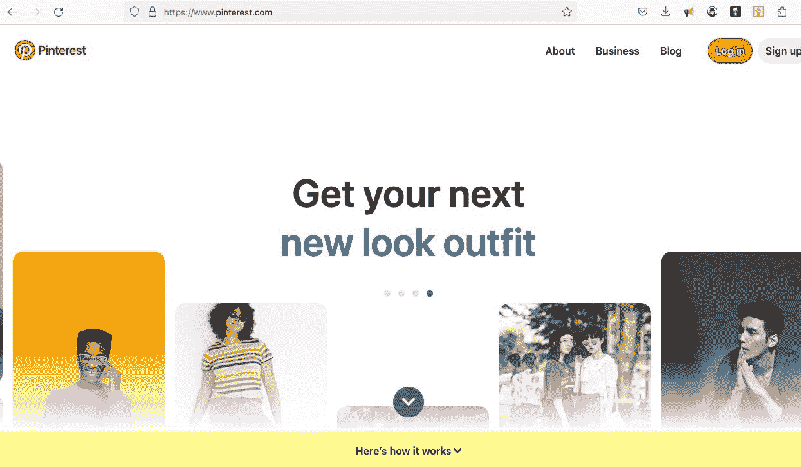

Pinterest 为个人和企业提供了展示其产品、服务和想法的独特机会，以视觉上令人愉悦的方式呈现。它作为灵感、发现和规划的平台，使其成为推广业务、产生潜在客户和促进销售的理想平台。

**ChatGPT 是什么？**

ChatGPT 是由 OpenAI 开发的人工智能语言模型。它使用先进的深度学习技术，根据给定的提示生成类似人类的文本响应。ChatGPT 经过对来自互联网的大量数据进行训练，使其能够理解和生成连贯且具有上下文相关的响应。

ChatGPT 可以成为内容创作、创意生成和问题解决的宝贵工具。它可以帮助用户提出创意想法，回答问题，甚至在各种主题上提供指导。凭借其自然语言处理能力，ChatGPT 有潜力彻底改变我们与人工智能的互动方式，并利用其能力实现我们的目标。

**为什么要使用 Pinterest 和 ChatGPT 来网上赚钱？**

Pinterest 和 ChatGPT 为希望在网上赚钱的个人提供了独特的优势和机会。

**以下是您应该考虑使用这些平台的一些令人信服的理由：**

> **Pinterest 的视觉吸引力：** Pinterest 的视觉特性使其成为展示产品、服务和想法的理想平台。通过创建引人入胜的 Pins，您可以吸引并吸引大量受众，增加驱动流量、产生潜在客户和进行销售的机会。
> 
> **目标受众：** Pinterest 拥有一个积极寻找灵感和规划未来购买的用户群体。用户经常带着特定意图来到 Pinterest，这使得企业更容易接触到他们的目标受众。通过利用 Pinterest 的高级定位选项，您可以确保您的内容在正确的时间抵达正确的人群。
> 
> **高转化率：** 研究表明，与其他社交媒体平台的用户相比，Pinterest 用户更有可能购买产品。Pinterest Pins 的视觉特性使用户更好地了解产品和服务，从而导致更高的转化率。通过在 Pinterest 上有策略地推广您的产品，您可以利用这种转化倾向，增加您的收入。
> 
> **ChatGPT 的创意帮助：** ChatGPT 可以是一个强大的创意生成和内容创建工具。通过利用 ChatGPT 的基于提示的交互，您可以利用其广泛的知识库提出创新和引人入胜的 Pin 点子。无论您需要帮助制作引人入胜的描述、构思新概念还是优化您的营销策略，ChatGPT 都可以提供有价值的见解和建议。
> 
> **自动化和效率：** Pinterest 和 ChatGPT 都提供了在线努力自动化和提高效率的机会。通过 Pinterest 的调度和自动化功能，您可以简化内容创建和发布流程，节省宝贵的时间和精力。同样，ChatGPT 生成基于文本的内容的能力可以加速您的内容创建工作流程，使您能够在更短的时间内生产更多内容。
> 
> **货币化选择：** Pinterest 提供了各种货币化途径，包括联盟营销、赞助内容和直接在平台上销售产品。通过利用 Pinterest 的货币化功能，您可以将您的 Pinterest 页面转化为一个创收资产。结合 ChatGPT 的创意帮助，您可以制定独特的策略有效地货币化您的 Pinterest 页面。

总之，Pinterest 和 ChatGPT 的结合为那些希望在网上赚钱的个人提供了巨大的潜力。无论您是企业主、内容创作者还是有抱负的企业家，利用这些平台的力量可以推动您在网上取得成功。在本书中，我们将详细探讨如何利用 Pinterest 和 ChatGPT 从零到百万富翁。所以，让我们深入了解并开启 Pinterest 和 ChatGPT 世界中等待您的机会！

> 关于作者：
> 
> *以色列·约书亚·楚克韦贝兹*

您可以在亚马逊上找到更多关于作者的书籍

点击这里[了解更多...](https://www.amazon.com/stores/Israel-Joshua-Chukwubueze/author/B0BHF5T1V7)

**作者的官方网站**

了解更多关于激情、才能和技能

点击这里[了解更多...](https://israeljoshua.com.ng/)

我知道您会喜欢这本书，别忘了为这本书留下您的评论。

**点击这里**[**留下评论！**](https://www.amazon.com/dp/B0BY33BPFW)

## 第二章：设置您的 Pinterest 帐户

Pinterest 是一个允许您发现、保存和分享激励内容的动态平台。要开始您的在线成功之旅，您需要设置您的 Pinterest 帐户。在本章中，我们将引导您完成创建 Pinterest 帐户、登录和设置个人资料的过程，以给您的受众留下深刻印象。

**如何创建 Pinterest 帐户**

创建 Pinterest 帐户是一个简单的过程，只需几分钟。

**按照以下步骤设置您的 Pinterest 帐户：**

**第 1 步：访问 Pinterest 网站或从您设备的应用商店下载 Pinterest 移动应用程序**。

**第 2 步：点击“注册”**按钮，具体取决于您使用的平台。

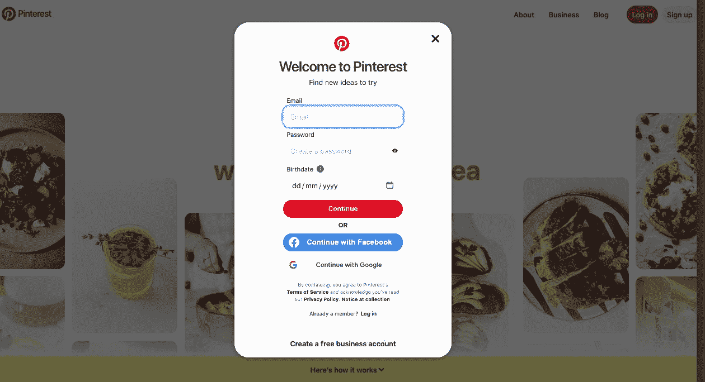

第 3 步：**选择您首选的注册方式。**您可以使用电子邮件地址、Google 帐户或 Facebook 帐户注册。选择对您最适合的选项，并按照提示继续进行。

**第 4 步：为您的 Pinterest 帐户创建一个独特的用户名。**理想情况下，您的用户名应反映您的品牌或个人身份，并且易于记住。

**第 5 步：完成注册流程**，输入额外的详细信息，如您的姓名和密码。确保选择一个不容易被猜到的强密码。

**第 6 步：提供必要信息后**，点击“创建帐户”或类似按钮，以完成 Pinterest 帐户设置。

**恭喜！**您已成功创建了 Pinterest 帐户。现在，让我们继续下一步：登录到您的 Pinterest 帐户。

**如何登录您的 Pinterest 帐户**

登录到您的 Pinterest 帐户可以让您访问您的个人资料，管理您的收藏，并与其他用户互动。以下是如何登录到您的 Pinterest 帐户：

**第 1 步：访问 Pinterest 网站或打开 Pinterest 移动应用程序**进行登录。

**第 2 步：点击“登录”或“注册”按钮**，通常位于 Pinterest 主页的右上角。

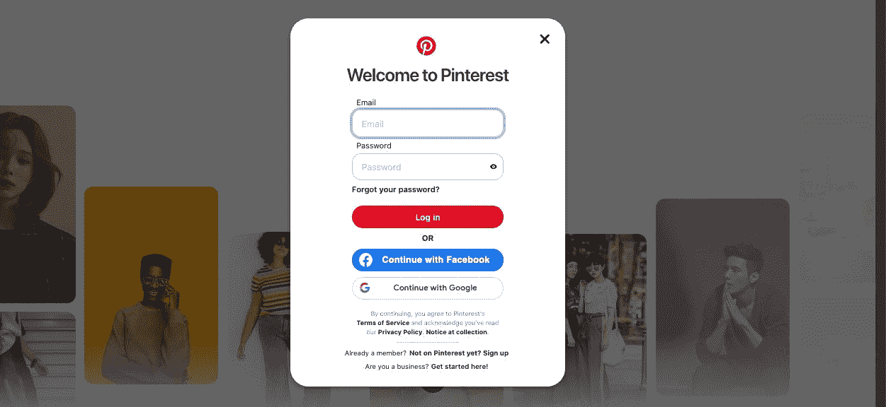

**第 3 步：输入与您的 Pinterest 帐户相关的电子邮件地址、Google 帐户或 Facebook 帐户**。

**第 4 步：如果您选择了电子邮件作为注册方法**，请输入密码到指定的字段中。如果您使用 Google 或 Facebook 注册，请按照提示使用那些凭据登录。

**第 5 步：一旦您输入了必需的信息**，点击“登录”或类似按钮以访问您的 Pinterest 帐户。

太棒了！您现在已经登录到了您的 Pinterest 帐户，准备开始探索、保存和创建收藏。现在，让我们继续进行下一个至关重要的步骤：设置您的 Pinterest 个人资料。

**如何设置您的 Pinterest 个人资料**

你的 Pinterest 个人资料是你在该平台上的数字身份。它代表着你是谁，或者你的品牌代表着什么。优化你的 Pinterest 个人资料对吸引关注者、建立信誉和建立强大的在线存在至关重要。按照以下步骤有效设置你的 Pinterest 个人资料：

**步骤 1：点击你的个人资料图片或用户名**，通常位于 Pinterest 界面的右上角。

**步骤 2：从下拉菜单中选择“设置”或“编辑资料”**。

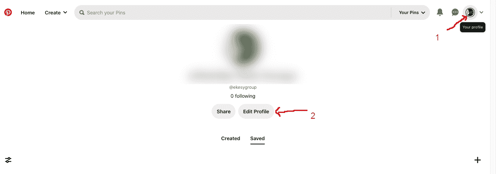

**步骤 3：更新你的个人资料图片**。选择一张清晰、高质量的图片，代表你的品牌或个人身份。理想情况下，你的个人资料图片应该是可辨认和专业的。

**步骤 4：撰写一个引人入胜的个人简介**。在“关于你”的部分，写下一个简洁而引人注目的描述，介绍你自己或你的品牌。突出你的独特卖点、专业知识或价值观。确保包含相关关键词，以优化你的个人资料以便搜索。

**步骤 5：添加你的网站或博客网址**。这使用户可以直接从你的 Pinterest 个人资料访问你的网站，增加流量并增强你的在线可见性。

**步骤 6：选择一个令人难忘的用户名**。如果你在注册过程中尚未选择用户名，那么在这个机会上选择一个符合你的品牌或个人身份的用户名。

**步骤 7：自定义你的个人资料外观。**选择一个视觉吸引人的封面图片，反映你的品牌或展示你最好的内容。你也可以调整你的 Pin 和画板的显示，以创建一个连贯和视觉上令人愉悦的个人资料布局。

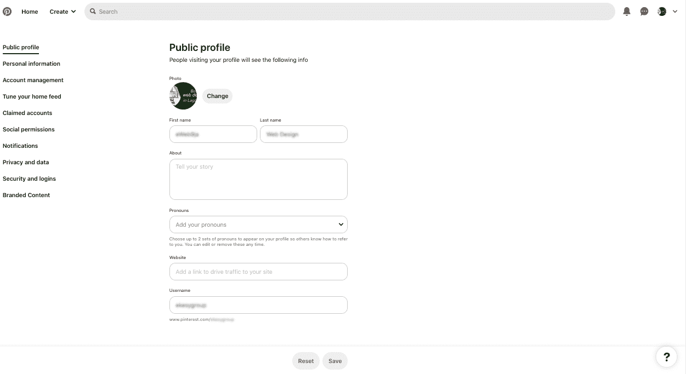

**步骤 8：连接你的社交媒体账户。**将你的 Pinterest 账户与其他社交媒体档案链接起来，可以实现跨平台推广，并允许用户在不同平台上与你联系。

**步骤 9：探索 Pinterest 设置。**花几分钟时间审查和自定义你的账户设置，包括隐私偏好、通知和电子邮件偏好。根据你的偏好和要求调整这些设置。

**步骤 10：保存你的更改。**一旦你对 Pinterest 个人资料做出必要的更新，点击“保存”或“应用”按钮，以确保你的更改生效。

遵循这些步骤，你将设置一个吸引人和专业的 Pinterest 个人资料，吸引你的目标受众的注意。你的个人资料就像是一个虚拟门面，而一个精心打造的门面能显著影响你在 Pinterest 上的成功。

总之，创建一个 Pinterest 账户，登录并设置您的个人资料是您在线旅程中的重要第一步。这些基础任务为您探索 Pinterest 和 ChatGPT 的全部潜力铺平了道路，以便在线赚钱。现在您的 Pinterest 账户已经启动，是时候深入探索 Pinterest 营销策略、Pin 创建以及利用 ChatGPT 来加速您的努力了。因此，让我们继续前进，解锁使用 Pinterest 和 ChatGPT 取得在线成功的秘诀！

## 第三章：创建 Pinterest Board

创建一个 Pinterest Board 是建立您在线存在和确立品牌的重要步骤。在本章中，我们将指导您完成创建 Pinterest Board、添加封面横幅以及整合页面图标/标志的过程。通过遵循这些步骤，您可以创建一个视觉吸引人且连贯的 Pinterest Board，吸引您的目标受众的注意。

**如何创建 Pinterest Board**

要创建一个 Pinterest Board，您需要拥有一个现有的 Pinterest 账户。如果您还没有创建账户，请参考第二章的说明。

**一旦您有了账户，按照以下步骤创建 Pinterest Board：**

**第一步：登录您的 Pinterest 账户。**

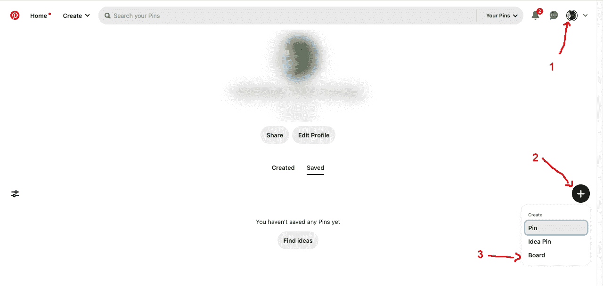

**第二步：点击您的个人资料图片或用户名**，通常位于 Pinterest 界面右上角。

**第三步：点击“+”**号，从下拉菜单中**选择创建“Board”**。

**第四步：填写您的 Pinterest Board 的必要细节**

选择一个与您的品牌或板块主题相符的名称。

**第五步：选择您的 Pinterest Board 是公开的还是保密的。**公开板块对所有 Pinterest 用户可见，而保密板块仅对您和您邀请的任何合作者可见。

**第六步：点击“创建”或类似按钮**来创建您的 Pinterest Board。

恭喜！您已成功创建了您的 Pinterest Board。

## 第四章：创建您的第一个 Pinterest Pin

Pin 是 Pinterest 的生命线——它们是您内容的视觉表现，吸引用户的注意并推动互动。在本章中，我们将指导您完成创建您的第一个 Pinterest Pin 的过程，提供成功的提示，并优化您的 Pin 以在搜索结果中获得最大的可见性。通过遵循这些步骤，您将在创建引人注目且激发您受众的 Pin 的道路上取得良好进展。

**如何创建 Pinterest Pin**

创建一个 Pinterest Pin 是一个创造性且简单的过程。

**以下是一份逐步指南，帮助您创建您的第一个 Pin：**

**第一步：登录您的 Pinterest 账户**并转到您的 Pinterest 页面。

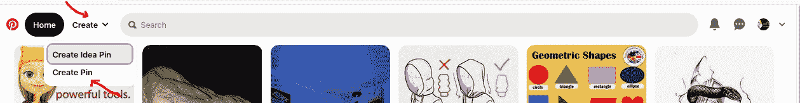

**第二步：点击“创建”或“添加 Pin”按钮。**此按钮通常位于您的 Pinterest 页面右上角。

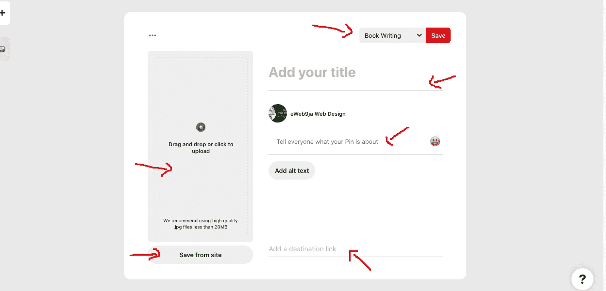

**第 3 步：选择您要用于 Pin 的图像或视频。**您可以从设备上传图像/视频，或从现有的 Pin 或画板中选择图像/视频。

**第 4 步：选择图像/视频后，**为您的 Pin 添加引人注目的标题。标题应简洁、描述性且引人，捕捉您内容的本质。

**第 5 步：为您的 Pin 撰写引人注目的描述。**描述提供了有关您内容的额外背景和信息。使用相关关键词和短语来优化您的 Pin 以便搜索。

**第 6 步：为您的 Pin 添加目标链接。**此链接可以将用户引导至您的网站、博文、产品页面或任何其他相关落地页。

**第 7 步：选择最适合您的 Pin 的画板。**画板有助于组织和分类您的 Pin，确保它们能够触达正确的受众。

**第 8 步：如果需要，您还可以为您的 Pin 添加相关标签。**标签是进一步增强您的 Pin 在搜索结果中可发现性的附加关键词。

**第 9 步：填写完所有必要细节后，**点击“**保存**”或“**发布**”按钮创建您的 Pin。

恭喜！您已成功创建了您的第一个 Pinterest Pin。现在，让我们探讨一些提示，帮助您创建出色的 Pin，脱颖而出并推动互动。

**创建成功的 Pinterest Pin 的提示**

创建成功的 Pinterest Pin 不仅仅是上传图像并添加标题。

**要使您的 Pin 对用户具有吸引力，请考虑以下提示：**

> **使用高质量视觉素材：**选择清晰、构图良好且引人注目的视觉图像或视频。高质量的视觉素材能够吸引注意力，鼓励用户与您的内容互动。
> 
> **专注于垂直 Pin：**Pinterest 建议使用 2:3 的垂直宽高比（例如，宽 1000 像素，高 1500 像素），因为它在 Pinterest 动态中占据更多空间，使其更加引人注目和吸引人。
> 
> **创建视觉吸引力图形：**如果您正在创建图形 Pin，请使用设计工具或模板创建品牌一致且引人注目的视觉吸引力图形。尝试使用字体、颜色和布局来创建脱颖而出的 Pin。
> 
> **保持信息量和价值：**提供有用信息、提示或解决方案的 Pin 往往表现良好。致力于创建能够为您的受众提供价值并激励他们采取行动的 Pin。
> 
> **使用引人注目的标题：**打造引人注目的标题，激起好奇心并诱使用户点击以了解更多。使您的标题简洁、描述性且可操作。
> 
> **撰写引人注目的描述：**利用 Pin 描述提供额外背景，解释您内容的好处，并鼓励用户参与互动。融入相关关键词以提高您的 Pin 在搜索结果中的可见性。
> 
> **融入品牌元素：** 在您的图钉上添加品牌标识或网站 URL，以增加品牌的可见性和认知度。这有助于用户将您的内容与您的品牌联系起来，并鼓励他们进一步探索。
> 
> **测试和迭代：** 尝试不同的图钉设计、标题、描述和格式，看看哪种与您的观众最契合。使用 Pinterest 分析工具跟踪图钉的表现，并为优化做出基于数据的决策。

**优化您的 Pinterest 图钉以进行搜索**

Pinterest 是一个强大的搜索引擎，通过优化图钉进行搜索可以显著增加其可见性和覆盖范围。

**以下是一些优化提示，可帮助您的图钉在搜索结果中排名更高：**

> **进行关键字研究：** 确定您的目标受众可能搜索的相关关键字和短语。自然地将这些关键字融入到您的图钉标题、描述和标签中。
> 
> **使用富含关键字的画板名称：** 创建画板时，请选择包含相关关键字的描述性画板名称。这有助于 Pinterest 理解您的画板内容，并改善其在搜索结果中的可见性。
> 
> **添加相关的标签：** 在您的图钉描述中使用相关的标签，以增加其可发现性。研究您所在领域的热门和趋势标签，并将它们融入到您的图钉中。
> 
> **优化图像替代文本：** 当为您的图钉上传图像时，请确保添加描述性的替代文本，以提高可访问性并为 Pinterest 的算法提供额外的上下文。
> 
> **将内容钉在相关的画板上：** 将您的内容固定在与您的内容密切相关的画板上。这向 Pinterest 表明您的图钉是相关的，并改善了其在搜索结果中的可见性。
> 
> **与您的观众互动：** 鼓励用户通过提问、引发讨论或邀请他们保存或尝试您的想法来参与您的图钉。用户参与表明 Pinterest 您的内容有价值，并有助于改善其可见性。

通过遵循这些优化提示，您可以增加图钉的可见性和发现性，吸引更多的观众，并将更多的流量引导到您的网站或落地页。

总之，创建引人注目的 Pinterest 图钉是您迈向在线成功的关键一步。通过遵循本章中概述的步骤并实施提供的提示，您可以创建引人入胜的图钉，吸引您的观众并推动参与。记得为搜索优化您的图钉以增加其可见性和覆盖范围。在下一章中，我们将探讨不同的策略来增长您的 Pinterest 页面并吸引更多的关注者。所以，让我们继续探索 Pinterest 和 ChatGPT，发挥在线赚钱的全部潜力吧！

## 第五章：使用 ChatGPT-3 游乐场进行每周图钉创意

在 Pinterest 的世界中，持续生成新鲜且引人入胜的内容可能是一个挑战。幸运的是，借助免费的 ChatGPT-3 Playground 的帮助，您可以解锁一宝藏般的想法，为您每周的 Pin 创作提供动力。在本章中，我们将指导您完成注册并登录 ChatGPT-3 Playground 的过程，利用其强大的提示功能生成每周的 Pin 点子，并提供优化您的 Pinterest 内容创作的技巧。

准备好利用 ChatGPT-3 无穷的创造力，将您的 Pinterest 游戏提升到新的水平。

**如何注册并登录免费的 ChatGPT-3 Playground**

在我们深入探讨使用 ChatGPT-3 生成 Pin 点子的激动人心世界之前，让我们从注册并登录免费的 ChatGPT-3 Playground 开始。以下是一个逐步指南，帮助您开始：

**第一步：打开您的网络浏览器**，并导航至 ChatGPT-3 Playground 网站[`chat.openai.com/`](https://chat.openai.com/)。

**第二步：点击“注册”**按钮开始注册流程。

**第三步：按照提示创建您的账户**，提供所需信息，如您的姓名、电子邮件地址，并创建一个安全的密码。确保您阅读并同意服务条款和隐私政策。

**第四步：完成注册流程后**，请查看您的电子邮件收件箱，查看来自 OpenAI 的验证电子邮件。点击邮件中提供的验证链接以确认您的账户。

**第五步：返回 ChatGPT-3 Playground 网页**，并点击“登录”按钮。

**第六步：输入您注册的电子邮件地址和密码**以登录 ChatGPT-3 Playground。

恭喜！您现在已经准备好利用 ChatGPT-3 的力量生成每周 Pin 点子，吸引您的观众。

**如何使用 ChatGPT-3 Playground 生成每周 Pin 点子**

现在您已经登录到 ChatGPT-3 Playground，是时候探索这个工具如何帮助您为每周的 Pin 点子生成新鲜而有创意的想法了。

**按照以下步骤利用 ChatGPT-3 进行 Pinterest 内容创作：**

**第一步：熟悉 ChatGPT-3** Playground 界面。界面包括一个文本框，您可以在其中输入提示，以及一个聊天窗口，您将从 AI 模型接收回复。

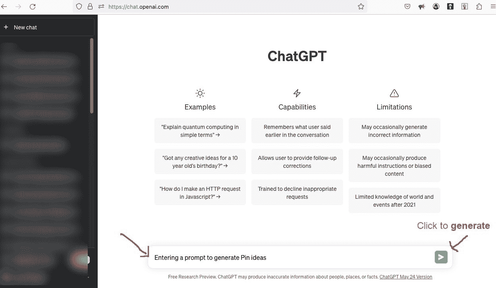

**第二步：开始输入一个提示来生成 Pin 点子。**例如，您可以从一个简单的提示开始，比如“我需要关于[您的领域或主题]的每周 Pin 点子的想法。”

**第三步：ChatGPT-3 将提供一个回复**，基于您的提示提供潜在的 Pin 点子。这个 AI 模型利用其广泛的知识和创造能力生成独特的建议。

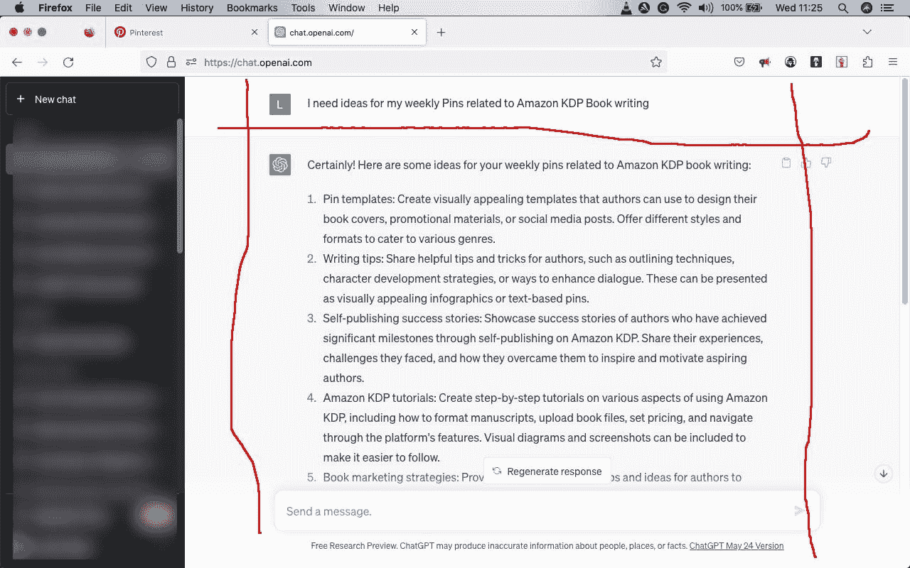

**步骤 4：如果初始回复不完全符合您的需求**，您可以通过提出后续问题或请求额外想法与 ChatGPT-3 继续对话。您的提示越具体和详细，AI 的回复就会越贴合。

**步骤 5：根据 AI 的建议进行迭代和完善提示。** 尝试不同的提示来探索各种 Pin 想法，并为您的每周内容找到灵感。

**使用 ChatGPT-3 Playground 进行 Pinterest 内容创作的提示**

为了充分利用 ChatGPT-3 Playground 的体验并优化您的 Pinterest 内容创作，请考虑以下提示：

> **在提示中明确具体：** 在提示中清晰定义与您的 Pin 相关的主题、主题或关键词。您的提示越具体，AI 的建议就会越相关和有针对性。
> 
> **探索不同角度和视角：** 尝试使用不同角度的提示来探索您的主题。这将帮助您发现 Pin 的独特和多样化想法。
> 
> **融入 Pinterest 最佳实践：** 虽然 ChatGPT-3 可以为您提供创意想法，但请确保遵循 Pinterest 的最佳实践，包括 Pin 设计、图像尺寸和内容指南，以最大化您的 Pin 的效果。
> 
> **将 AI 生成的想法与您自己的创意相结合：** ChatGPT-3 生成的建议可以作为您的 Pin 想法的起点。随意添加您自己的创意元素，融入您品牌的声音，并根据您独特的风格和受众喜好调整建议。
> 
> **不要局限于一个提示：** 尝试多个提示来探索各种 Pin 想法。通过结合不同的提示，您可以发现意想不到的联系，并生成真正创新的内容。
> 
> **保持组织：** 通过将 ChatGPT-3 生成的想法记录在电子表格中或使用笔记工具，来跟踪这些想法。这样，您在计划每周 Pin 时可以轻松地参考它们。

通过利用 ChatGPT-3 Playground 的强大功能，您可以为每周的 Pin 创作汲取无穷的灵感。拥抱创意可能性，尝试不同的提示，让 AI 生成的想法激发您的想象力。在下一章中，我们将探讨 ChatGPT-3 如何帮助您生成 Pinterest 横幅 Pin 设计创意。因此，让我们继续解锁 Pinterest 和 ChatGPT-3 的潜力，实现在线成功之旅！

## 第六章：使用 ChatGPT-3 Playground 设计 Pinterest 横幅 Pin 创意

Pinterest 是一个视觉平台，创建引人注目的横幅 Pins 对于吸引用户的注意力并引导他们与您的内容互动至关重要。幸运的是，免费的 ChatGPT-3 Playground 可以成为为您的 Pinterest 横幅 Pins 生成创意和创新设计理念的宝贵工具。在本章中，我们将探讨如何利用 ChatGPT-3 Playground 的力量生成令人惊叹的 Pinterest 横幅 Pin 设计理念。我们还将为您提供如何充分利用此工具以增强您的 Pinterest 横幅设计流程的技巧。准备好释放您的创造力，将您的 Pinterest 游戏推向新的高度吧！

**如何使用 ChatGPT-3 Playground 生成 Pinterest 横幅 Pin 设计理念**

ChatGPT-3 Playground 是一个强大的工具，可以帮助您生成 Pinterest 横幅 Pins 的设计理念。

**以下是一步步指南，帮助您有效利用其功能：**

**步骤 1：使用您的注册账户凭据登录 ChatGPT-3 Playground。**

**步骤 2：熟悉界面。** Playground 包括一个文本框，您可以在其中输入提示，以及一个聊天窗口，在那里您将收到 AI 模型的响应。

**步骤 3：开始输入提示以生成 Pinterest 横幅 Pin 的设计理念。** 例如，您可以以一个**提示**开始，比如：“我需要为我的 Pinterest 横幅 Pins 设计理念。我的品牌专注于[您的品牌领域或风格]。”

**步骤 4：ChatGPT-3 将根据您的提示为您提供设计建议。** 它将利用其广泛的知识和创造性能力为您的 Pinterest 横幅 Pins 生成创新理念。

**步骤 5：审查 ChatGPT-3 提供的设计建议。** 考虑每个建议的构图、配色方案、字体和整体美学吸引力。

**步骤 6：如果最初的建议与您的愿景或品牌不完全一致，请继续与 ChatGPT-3 对话。** 提出跟进问题或请求设计理念的变化，以进一步完善建议。

**步骤 7：迭代并尝试不同的提示，以探索各种设计选项。** ChatGPT-3 可以生成大量的理念，因此利用这一资源找到与您的品牌和受众 resonates 的完美 Pinterest 横幅 Pin 设计。

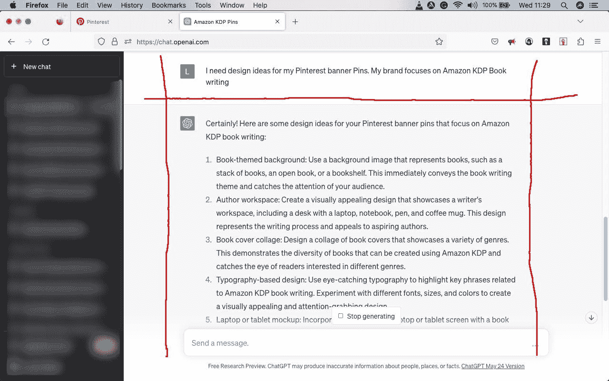

**使用 ChatGPT-3 Playground 设计 Pinterest 横幅的提示**

虽然 ChatGPT-3 Playground 可以为您提供宝贵的设计建议，但是为 Pinterest 横幅设计优化您的体验是至关重要的。

**考虑以下技巧以充分利用此工具：**

> **提供清晰的设计方向：** 在制作您的提示时，要具体说明您想要在 Pinterest 横幅设计中包含的元素。提及诸如颜色偏好、视觉风格、字体选择以及您想要包含的任何特定图像或图标等方面。
> 
> **融入您的品牌身份：** 确保设计建议与您品牌的视觉身份和信息相一致。提及您的品牌颜色、字体以及您遵循的任何设计指南，以保持 Pinterest 上的一致性。
> 
> **尝试不同的设计风格：** 使用 ChatGPT-3 Playground 探索各种设计风格和美学，为您的 Pinterest 横幅 Pin 尝试简约设计、充满活力和大胆的视觉效果，或优雅而复杂的布局，以发现最适合您受众的设计。
> 
> **考虑可读性和易读性：** Pinterest 横幅 Pin 通常包含文本元素来传达关键信息或行动号召。确保 ChatGPT-3 提供的设计建议优先考虑文本的可读性和易读性，特别是在字体选择、对比度和排版方面。
> 
> **拥抱独特性和创造力：** 鼓励 ChatGPT-3 生成突破界限、脱颖而出的非传统设计思路。不要害怕尝试非传统的色彩组合、布局或意想不到的视觉元素。
> 
> **将 AI 生成的想法与您自己的专业知识相结合：** ChatGPT-3 提供的建议应被视为您的 Pinterest 横幅设计过程的起点。利用您的创意专长来完善和反复推敲这些想法，加入您独特的风格，并确保它们与您品牌的愿景相一致。
> 
> **利用设计工具和资源：** 一旦您从 ChatGPT-3 收到设计建议，利用 Canva、Adobe Creative Cloud 或其他图形设计软件等设计工具将这些想法变为现实。这些工具为您提供各种模板、图形和编辑功能，将概念转化为视觉上吸引人的 Pinterest 横幅 Pin。

通过利用 ChatGPT-3 Playground 进行 Pinterest 横幅 Pin 设计想法，您可以利用无穷无尽的创意和灵感。AI 生成的建议，结合您自己的专业知识，将帮助您创建视觉上令人惊叹且引人入胜的 Pinterest 横幅 Pin，吸引您的受众。在下一章中，我们将探讨 ChatGPT-3 如何帮助您生成引人注目的 Pinterest Pin 内容。因此，让我们继续我们解锁 Pinterest 和 ChatGPT-3 的全部潜力，实现在线成功的旅程！

> *书籍推荐*

目前，我会为您推荐这两本书。

| 

**从零到百万富翁在线：ChatGPT + 电子商务：创建并设置您自己的在线商店：生成产品描述、SEO 排名、在线赚钱**

[`www.amazon.com/gp/product/B0BXY6NX3J`](https://www.amazon.com/gp/product/B0BXY6NX3J)

| 

**从零到百万富翁在线：ChatGPT + 博客：在 24 小时内建立您自己的网站 - 逐步指南，如何在线赚钱**

[`www.amazon.com/gp/product/B0BXY9W6P8`](https://www.amazon.com/gp/product/B0BXY9W6P8)

|

## 第七章：利用 ChatGPT-3 Playground 进行 Pinterest Pin 内容

Pinterest 不仅仅是关于视觉吸引力的图片，还包括每个 Pin 所附带的引人入胜和信息丰富的内容。制作引人入胜的 Pinterest Pin 内容对于吸引用户的注意并推动用户参与至关重要。免费的 ChatGPT-3 Playground 可以成为生成创意和吸引人内容点子的宝贵资源。在本章中，我们将探讨如何利用 ChatGPT-3 Playground 的力量来生成引人入胜的 Pinterest Pin 内容。我们还将为您提供如何最大限度地发挥该工具对 Pinterest 内容创作的有效性的建议。准备好释放 ChatGPT-3 的潜力，将您的 Pinterest 策略提升到新的水平！

**如何使用 ChatGPT-3 Playground 生成 Pinterest Pin 内容**

ChatGPT-3 Playground 是一个多才多艺的工具，可以帮助您生成高质量和引人入胜的 Pinterest Pin 内容点子。

**让我们深入了解利用这个工具的逐步过程：**

**步骤 1：使用您的注册账户凭据登录 ChatGPT-3 Playground。**

**步骤 2：熟悉界面。** Playground 由一个文本框和一个聊天窗口组成，您可以在文本框中输入提示，并在聊天窗口中接收 AI 模型的响应。

**步骤 3：开始输入提示以生成 Pinterest Pin 内容点子。** 例如，您可以从一个简单的**提示**开始，比如“我需要一些引人入胜的内容点子，以配合我的 Pinterest Pins 在[您的领域或主题]类别中。”

**步骤 4：ChatGPT-3 将根据您的提示提供内容建议。** 它将利用其丰富的知识和创造能力来为您的 Pinterest Pin 描述、标题和字幕生成信息丰富且引人入胜的点子。

**步骤 5：审查 ChatGPT-3 提供的内容建议。** 关注建议内容的清晰度、简洁性和相关性。寻找与您品牌声音和目标受众兴趣相符的创意。

**步骤 6：如果初始建议不能完全满足您的需求，请继续与 ChatGPT-3 对话。** 提出跟进问题或请求内容点子的变化，以优化并定制符合您特定需求的内容。

**步骤 7：通过不同的提示进行迭代和实验，探索各种内容可能性。** ChatGPT-3 可以生成许多点子，因此利用该资源找到对您的 Pinterest Pins 最吸引人的内容。

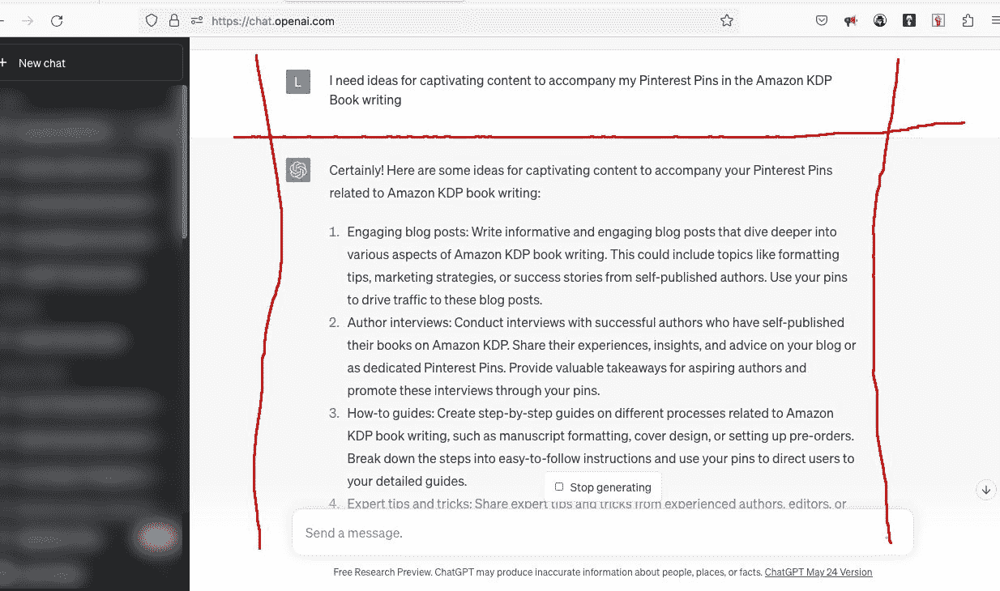

**利用 ChatGPT-3 Playground 进行 Pinterest 内容创作的建议**

虽然 ChatGPT-3 Playground 提供了宝贵的内容建议，但是有几种策略可以增强您的 Pinterest 内容创作过程。

**考虑以下利用该工具的建议：**

> **明确您的目标受众：** 在制定您的提示时，提及您目标受众的特征和偏好。这将有助于 ChatGPT-3 生成与您特定人群共鸣的内容思路。
> 
> **融入关键词和标签：** Pinterest 是一个以搜索驱动的平台，因此将您的内容优化以便被发现至关重要。在您的提示中包含相关的关键词和标签，以生成与您所处领域内热门搜索词相关的内容思路。
> 
> **提供上下文和约束：** 如果您对 Pinterest 内容有特定的指导方针或限制条件，请向 ChatGPT-3 传达。例如，您可能希望内容思路简洁、可行或言简意赅。设定这些约束将确保生成的内容符合您的要求。
> 
> **个性化建议：** 一旦您从 ChatGPT-3 收到内容建议，通过融入您品牌的声音和个性来个性化它们。为内容添加您自己的特色，使其独特并反映出您品牌的身份。
> 
> **专注于价值和叙事性：** Pinterest 用户经常在寻找灵感、信息或解决问题的方法。确保内容建议优先提供价值给受众。加入叙事元素，使内容更具吸引力和亲和力。
> 
> **审查和编辑建议：** 虽然 ChatGPT-3 能够生成创意内容思路，但审查和编辑建议以使其符合您的品牌指南并确保准确性至关重要。进行必要的编辑，校对内容，并优化其清晰度和可读性。
> 
> 结合人工智能生成的思路与您的专业知识：ChatGPT-3 提供的内容建议应该作为您 Pinterest 内容创建的起点。利用您的行业知识和专长，精炼和增强这些思路，使其适应您特定的受众和目标。

通过利用 ChatGPT-3 Playground 进行 Pinterest Pin 内容生成，您可以利用丰富的创意思路并增强您的 Pin 的质量和效果。结合人工智能生成的内容建议与您自己的专业知识，将帮助您创建引人入胜且信息丰富的 Pinterest Pin，与您的受众产生共鸣。在下一章中，我们将探讨增长您的 Pinterest 页面和扩大您的影响力的策略。让我们继续我们解锁 Pinterest 和 ChatGPT-3 在线成功的全部潜力的旅程吧！

## 第八章：增长您的 Pinterest 页面

Pinterest 为企业和内容创作者提供了一个广阔的机会，可以触达更广泛的受众，增加流量，并最终增加其在线存在。在本章中，我们将探讨策略和技术，帮助您有效地增加 Pinterest 页面的触达。从提高可见性到分析表现，我们将为您提供宝贵的见解和技巧，以扩大您在这个视觉发现平台上的影响力。准备好让您的 Pinterest 游戏提升到一个新的高度，并实现显著增长吧！

**如何增加您的 Pinterest 页面**

增加您的 Pinterest 页面需要一个全面的方法，包括 Pinterest 优化和参与的各个方面。

**让我们深入探讨一下您可以采取的措施来促进 Pinterest 页面的增长：**

> **优化您的个人资料：** 确保您的 Pinterest 个人资料完整并经过优化以进行搜索。在个人资料描述中使用相关关键词，包括指向您网站或博客的链接，并选择能有效代表您品牌的个人资料图片。
> 
> **创建高质量内容：** 持续创建和发布与您的目标受众 resonant 的高质量引脚。专注于创建视觉上吸引人并且信息丰富的引脚，提供价值并激发参与。
> 
> **定期固定引脚：** 通过定期固定引脚来保持在 Pinterest 上的活跃存在。每天确保固定新鲜内容，确保您自己的引脚和来自其他人的相关内容的混合。利用调度工具简化固定过程。
> 
> 策略性使用关键词：进行关键词研究，以确定您的领域中受欢迎和相关的关键词。将这些关键词融入您的引脚描述、标题和画板中，以提高可见性和改善搜索能力。
> 
> **优化引脚描述：** 为您的引脚创建引人注目且富有关键词的描述。提供清晰简明的描述，吸引用户与您的内容互动，并包含相关的标签以扩展覆盖范围和发现性。
> 
> **与社区互动：** 积极与其他 Pinterest 用户互动，重新固定、点赞和评论他们的内容。建立关系并培养社区意识将有助于增加您的可见性，并吸引更多参与的受众。
> 
> **加入群画板：** 寻找并加入您所在领域的相关群画板。群画板将您的内容暴露给更广泛的受众，并提供合作和参与的机会。
> 
> **推广您的 Pinterest 页面：** 利用您的其他在线渠道，如您的网站、博客或社交媒体平台，来推广您的 Pinterest 页面。添加 Pinterest 按钮和小部件，鼓励访客关注并与您的内容互动。

**增加您的 Pinterest 页面的可见性的提示**

增加您的 Pinterest 页面的可见性对于吸引更多关注者和扩大您的影响力至关重要。

**考虑以下提示来增强您的 Pinterest 页面的可见性：**

> **创建引人注目的图钉设计：** 投资于视觉吸引力强和引人注目的图钉设计。使用高质量的图片、引人入胜的图形和鲜艳的颜色，使您的图钉在用户的动态中脱颖而出。
> 
> **利用丰富的图钉：** 实施丰富的图钉以为用户提供额外的背景和信息。丰富的图钉会自动更新来自您网站的信息，确保用户在与您的图钉互动时拥有最新的详细信息。
> 
> **优化移动端：** Pinterest 主要是一个移动平台，因此确保您的图钉针对移动端进行了优化。使用纵向图钉，宽高比为 2:3 或 1:2.1，以最大化在移动设备上的可见性。
> 
> **利用 Pinterest SEO：** 实施有效的 SEO 策略以提高您的图钉的可发现性。进行关键词研究，使用相关关键词优化您的画板和图钉，并为您的图片包含描述性的 alt 文本。
> 
> **跨平台推广您的图钉：** 在其他社交媒体平台上分享您的图钉，如 Facebook、Twitter 或 Instagram。鼓励这些平台上的关注者与您的图钉互动，并关注您的 Pinterest 页面。
> 
> **与意见领袖合作：** 与您领域内的意见领袖或内容创作者合作，以扩大您的影响力。与意见领袖合作可以将您的 Pinterest 页面展示给他们已建立的受众群体，产生更多的可见性和参与。

**如何分析您的 Pinterest 页面的表现**

分析您的 Pinterest 页面的表现对于了解哪些策略有效并识别改进领域至关重要。

**以下是您如何有效分析和衡量您的 Pinterest 页面的表现：**

> **Pinterest 分析：** 利用 Pinterest 内置的分析工具来了解您页面的表现。访问关键指标，如曝光量、保存量、点击量和参与率。分析哪些图钉表现良好，并识别趋势以指导您的内容策略。
> 
> **转化跟踪：** 实施 Pinterest 转化跟踪，以衡量您在网站或在线商店上的 Pinterest 活动对其影响。跟踪指标如注册、购买或下载，以评估您的 Pinterest 努力的有效性。
> 
> **Google Analytics：** 将您的 Pinterest 页面与 Google Analytics 集成，以全面了解您网站的表现，并了解通过 Pinterest 生成的流量和转化。分析引荐流量和用户行为，以完善您的 Pinterest 策略。
> 
> **A/B 测试：** 通过与您的图钉进行 A/B 测试，评估不同设计、描述或呼吁行动元素的有效性。测试变量如图片、颜色、标题或图钉格式，以优化您的内容以获得更高的参与率和转化率。
> 
> **竞争分析：** 监控并分析竞争对手的 Pinterest 页面表现。识别他们成功的策略、内容主题和参与策略。利用这些见解优化自己的方法，并保持领先地位。
> 
> **受众洞察：** 通过在 Pinterest Analytics 中探索受众洞察部分，深入了解您的 Pinterest 受众。分析人口统计信息、兴趣和行为，以根据他们的偏好和需求定制您的内容。

定期审查和分析您的 Pinterest 页面的表现将使您能够做出数据驱动的决策，并优化您的策略以实现最佳增长和参与度。

发展您的 Pinterest 页面需要专注、一致性和对目标受众的深刻理解。通过实施本章中概述的策略，并持续监控和优化您的表现，您可以扩大影响力、增加参与度，并在 Pinterest 上实现实质性增长。在下一章中，我们将探讨不同类型的 Pinterest 页面推广思路，进一步提升您页面的可见性。让我们继续解锁 Pinterest 的全部潜力，将您的在线成功推向新高度！

## 第九章：不同类型的 Pinterest 页面推广思路

推广您的 Pinterest 页面是扩大受众、增加参与度并将流量引导至您的网站或博客的关键方面。在本章中，我们将探讨各种类型的 Pinterest 页面推广思路，帮助您扩大影响力并吸引更广泛的受众。从利用社交媒体到与意见领袖合作，我们将为您提供有效的策略，推广您的 Pinterest 页面并提升其可见性。让我们深入探索 Pinterest 页面推广的世界，解锁这个充满活力的平台的全部潜力！

**如何推广您的 Pinterest 页面**

在我们深入探讨具体的推广思路之前，让我们首先探索一些有效推广您的 Pinterest 页面的基本步骤：

> **优化您的个人资料：** 从优化您的 Pinterest 个人资料开始。确保您的个人资料完整、视觉吸引人，并反映您的品牌身份。在个人资料描述中使用关键词，并包含指向您的网站或博客的链接以增加流量。
> 
> **发布高质量内容：** 持续发布与目标受众 resonates 的高质量、引人入胜的内容。制作视觉吸引人的 Pins，并提供有价值的信息或灵感，吸引用户的注意力。
> 
> **利用 SEO 策略：** 为您的 Pins 和 boards 实施有效的搜索引擎优化（SEO）技术。进行关键词研究，并使用相关关键词优化您的描述、标题和 boards 以提高搜索可见性。
> 
> **在其他平台上进行交叉推广：** 利用您在其他社交媒体平台上的存在来推广您的 Pinterest 页面。在 Facebook、Twitter、Instagram 或 LinkedIn 等平台上分享您的 Pin，并鼓励您的关注者参与并关注您的 Pinterest 页面。
> 
> **添加 Pinterest 按钮：** 在您的网站、博客或电子邮件通讯中集成 Pinterest 按钮和小部件。这使访问者可以轻松关注您的 Pinterest 页面，保存您的 Pin，并与他们自己的网络分享。
> 
> **与影响者合作：** 与您所在领域的影响者或内容创作者合作，推广您的 Pinterest 页面。合作努力可以将您的页面展示给他们已建立的观众，带来更多的关注者和互动。

**不同类型的 Pinterest 页面推广创意**

现在我们已经介绍了基本步骤，让我们探讨不同类型的 Pinterest 页面推广创意，以扩大您的影响力并吸引更广泛的受众：

> **社交媒体推广：** 利用社交媒体平台的力量推广您的 Pinterest 页面。在 Facebook、Twitter、Instagram 或 LinkedIn 等平台上分享引人注目的 Pin，并呼吁关注您的 Pinterest 页面。使用相关的标签和标记相关的账户以扩大您的影响力。
> 
> **Pinterest SEO：** 为 Pinterest 搜索优化您的 Pin、画板和个人资料。使用富有关键词的描述，相关的标签和类别标签来提高您内容的可发现性。确保您的 Pin 在视觉上吸引人，并在用户的动态中脱颖而出。
> 
> **与 Pinterest 影响者合作：** 确定您所在领域中具有影响力的 Pinterest 用户，并与他们合作。这可能涉及在彼此的画板上进行客座固定，举办联合比赛或赠品活动，或在策展画板中展示彼此的内容。与影响者合作可以向他们的粉丝介绍您的 Pinterest 页面，并带来新的互动。
> 
> **参与群组画板：** 加入您所在领域中活跃且相关的群组画板。与社区互动，转发有价值的内容，并贡献您自己的 Pin。群组画板将您的内容展示给更广泛的观众，并可以吸引新的关注者到您的 Pinterest 页面。
> 
> **举办 Pinterest 比赛：** 组织 Pinterest 比赛以鼓励互动并吸引新的关注者。创建特定比赛的 Pin，用户可以转发或保存以参加比赛。制定明确的规则和激励措施，如奖品或独家内容，以激励参与并扩大您的影响力。
> 
> **分享教程或操作指南：** 创建信息丰富且视觉上吸引人的 Pin，提供与您所在领域相关的教程或操作指南。固定逐步说明、提示或 DIY 项目，用户可以保存并参考。有价值且教育性的内容在 Pinterest 上通常表现良好。
> 
> **制作信息图表：**信息图表在 Pinterest 上具有很高的分享性，可以吸引大量关注。设计视觉吸引力强的信息图表，提供有价值的信息或数据，与你的受众相关。在其中加入你的品牌和网站 URL，以将流量引导至你的网站或博客。
> 
> **与社区互动：** 积极与其他 Pinterest 用户互动，通过转发、点赞和评论他们的内容。回复你图片的评论，并参与和你领域相关的讨论。建立关系和培养社区意识可以增加可见性和有机增长。

**推广 Pinterest 页面的提示**

为了最大限度地提高你的 Pinterest 页面推广效果，考虑以下提示：

> **保持一贯：** 在 Pinterest 上一贯性非常重要。定期分享图片并保持活跃。每天推送新鲜内容，并确保你自己的图片和策划内容的混合使用。
> 
> **监控分析：** 定期监控你的 Pinterest 分析数据，了解哪些图片和画板表现良好。识别趋势、热门内容和参与模式。利用这些信息优化你的内容策略，并专注于与你的受众共鸣的内容。
> 
> **制作引人入胜的图片描述：** 为你的图片制作引人入胜且富含关键词的描述。使用强有力的行动号召，并突出用户点击或保存图片所获得的价值或好处。
> 
> **利用影响者外联：** 联系你所在领域的影响者或博主，并向他们提供对你内容的独家访问或合作项目。影响者可以帮助将你的 Pinterest 页面推广给他们的专注受众，吸引更多的粉丝和互动。
> 
> **利用推广的图片：** 考虑使用 Pinterest 的推广图片功能来触达更广泛的受众。推广图片会出现在用户的动态信息流、搜索结果或相关类别的动态信息流中，为你的内容提供更多的可见性。
> 
> **分析引荐流量：** 使用 Google Analytics 等工具跟踪来自 Pinterest 到你网站或博客的引荐流量。识别哪些图片或画板带来了最多的流量，并相应优化你的内容。

通过实施这些推广思路和提示，你可以有效增加 Pinterest 页面的可见性，吸引新粉丝，并将流量引导至你的网站或博客。记得保持一贯，监控你的分析数据，并与你的受众互动，促进 Pinterest 上的长期增长和成功。

在下一章中，我们将深入探讨使用 Pinterest 付费广告来进一步增强你页面的触达和互动。让我们继续解锁 Pinterest 的全部潜力，将你的在线成功推向新的高度！

## 第十章：使用 Pinterest 付费广告来建设你的页面

Pinterest 付费广告可以是一个强大的工具，可以提升您的 Pinterest 页面的可见性，触及更广泛的受众，并将有价值的流量引导到您的网站或在线商店。在本章中，我们将探讨如何有效使用 Pinterest 付费广告，提供创建成功广告活动的技巧，并指导您跟踪和优化广告表现。让我们深入探索 Pinterest 广告的世界，释放加速增长的潜力！

**如何使用 Pinterest 付费广告**

> **设置您的 Pinterest 商业账户：**在您可以在 Pinterest 上运行付费广告之前，请确保您拥有一个 Pinterest 商业账户。如果您还没有一个，您可以将您的个人账户转换为商业账户或创建一个新的商业账户。商业账户让您可以访问高级分析、受众定位选项和广告管理功能。
> 
> **选择您的广告活动目标：**Pinterest 提供各种广告活动目标，以符合您的广告目标。无论您想要增加流量、提升品牌知名度、增加参与度还是推广应用安装，选择正确的目标对于成功的广告活动至关重要。
> 
> **定义您的目标受众：**Pinterest 允许您根据人口统计信息、兴趣、行为和关键词来定位特定受众。根据您的利基、产品或服务以及您理想客户的特征来定义您的目标受众。优化您的定位选项，以吸引最相关的受众观看您的广告。
> 
> **设计引人注目的广告创意：**创建视觉吸引力和引人注目的广告创意，吸引用户的注意力。使用高质量的图片、引人入胜的标题和清晰的行动号召来鼓励点击。考虑使用生活方式图片、产品照片或垂直钉子来最大化影响。
> 
> **设定预算和竞价策略：**确定您广告活动的每日或终身预算。Pinterest 提供不同的竞价策略，如每次点击费用（CPC）或每千次展示费用（CPM）。选择与您的目标和预算相符的策略。
> 
> **监控和优化您的广告：**定期监控广告的表现，并进行数据驱动的优化。测试不同的创意、标题、定位选项或竞价策略，找到最适合您受众的方法。利用 Pinterest 分析的见解来完善和改进您的广告活动。

**创建成功 Pinterest 广告的技巧**

> **了解您的受众：**深入了解目标受众的偏好、兴趣和行为。制作与他们的需求和愿望 resonant 的广告创意。用他们的语言交流，并展示您的产品或服务如何解决他们的问题或满足他们的愿望。
> 
> **创建垂直钉子（Vertical Pins）:** 垂直钉子在 Pinterest 上表现出色。设计 2:3 的纵横比（理想尺寸为 1000 x 1500 像素）的钉子，以充分利用该平台的垂直格式。垂直钉子在用户屏幕上占据更多空间，使其更加显眼和引人注目。
> 
> **使用引人注目的标题和描述:** 创作引人注目的标题和简洁的描述，吸引用户点击您的广告。突出您的产品或服务的独特价值主张，并清晰传达用户可以期待的好处。
> 
> **利用丰富钉子（Rich Pins）:** 利用 Pinterest 的丰富钉子功能提供额外信息和背景。根据您的业务类型，您可以使用产品钉子、食谱钉子、文章钉子或应用钉子。丰富钉子提升用户体验并带来更多互动。
> 
> **A/B 测试您的广告:** 尝试不同的广告变体，以确定最有效的元素。测试不同的视觉效果、标题、描述或呼吁行动，以优化您的广告表现。进行渐进性的更改，并衡量对点击率和转化率的影响。

**如何跟踪您的 Pinterest 广告表现**

> **Pinterest Analytics:** 利用 Pinterest Analytics 来深入了解广告表现。跟踪关键指标，如曝光量、点击量、点击率（CTR）和转化率。分析哪些广告带来了最多的互动和转化，并相应优化您的广告活动。
> 
> **转化跟踪:** 实施 Pinterest 的转化跟踪功能，衡量广告对特定行动（如购买、注册或应用安装）的影响。在您的网站上设置转化跟踪标签，或使用第三方工具将转化归因于您的 Pinterest 广告。
> 
> **优化您的定位:** 根据不同的定位选项分析广告的表现。评估哪些受众群体产生了最高的互动和转化。通过调整人口统计数据、兴趣或关键词来优化您的定位，以专注于最具响应性的受众。
> 
> **ROI 分析:** 通过比较广告投放成本与收入生成情况，衡量您的 Pinterest 广告活动的投资回报率（ROI）。分析通过广告获得的客户的生命周期价值，并评估您的广告活动的盈利能力。
> 
> **持续优化:** 根据表现数据持续监控和优化您的广告活动。识别趋势、模式和机会，以完善您的定位、创意和出价策略。数据驱动的方法将帮助您最大化 Pinterest 付费广告的效果。

通过有效利用 Pinterest 付费广告，您可以加速您的 Pinterest 页面的增长，提高品牌知名度，并将有价值的流量引导到您的网站或在线商店。记得要了解您的受众，创作视觉吸引力强的创意作品，并跟踪您的广告表现，以优化您的活动，获得最大的结果。

在下一章中，我们将探讨各种战略来将您的 Pinterest 页面变现，并将您的努力转化为有利可图的企业。让我们揭示将您的 Pinterest 存在变现的可能性，并将您的在线成功带入新的高度！

**如果您购买/下载我的书并发现它有趣，我会很高兴；如果您可以为这本书留下一个好评，这将帮助其他潜在读者表现出兴趣。**

这只需要 30 秒，将非常感激。

**点击这里**[**留下评论！**](https://www.amazon.com/dp/B0BY33BPFW)

在此先行致谢，我爱你，你是最棒的。

## 第十一章：Pinterest 的变现

Pinterest 提供了优秀的变现机会，让您将您的激情、创造力和 Pinterest 存在变成有利可图的企业。在本章中，我们将探讨多种变现您的 Pinterest 页面的方式，提供不同赚钱策略的见解，并分享最大化您收益潜力的宝贵提示。让我们深入探讨 Pinterest 变现的世界，并解锁通往财务成功的道路！

**如何将您的 Pinterest 页面变现**

> **联盟营销：** 联盟营销是变现您的 Pinterest 页面的一种流行方法。加入与您的领域相关的联盟计划，并通过包含您独特联盟链接的 Pins 推广产品或服务。当用户通过您的链接购买产品时，您将获得佣金。专注于推广与您受众兴趣和需求相符的产品或服务。
> 
> **赞助的 Pins：** 通过提供赞助的 Pins 与品牌和企业合作。围绕其产品或服务创建引人入胜的内容，并向您的受众推广它们。赞助的 Pins 可以包括产品评论、教程或展示品牌产品的生活方式图像。为在您的 Pinterest 页面上展示赞助内容收取费用。
> 
> **Pinterest 商店：** 利用 Pinterest 的商店功能直接在平台上销售您自己的产品。建立一个 Pinterest 商店，并通过吸引人的 Pins 展示您的产品。将流量引导到您的商店，并将 Pinterest 用户转化为顾客。利用高质量的视觉效果、详细的描述和定价信息吸引用户进行购买。
> 
> **产品创造：** 开发并销售您自己的数字或实体产品。使用 Pinterest 展示和推广您的产品，将流量引导到您的网站或在线商店。创建视觉吸引人的 Pins，突出您产品的独特特点和优势。考虑提供独家折扣或限时促销来激励购买。
> 
> **赞助合作：** 与您领域内的其他内容创作者或意见领袖合作。提供赞助合作，您可以相互推广彼此的内容或产品。这可以包括在彼此的画板上进行客座固定、联合赠品活动或创建合作画板。赞助合作可以帮助您扩大影响力，吸引新的关注者和客户。

**从您的 Pinterest 页面赚钱的不同方式**

> **创建电子书或数字产品：** 利用您的专业知识，创建电子书、数字课程或其他可下载资源。固定视觉吸引力强的图形或数字产品的预览，以引起兴趣并将流量引导至您的销售页面。
> 
> **展示广告：** 如果您的博客或网站链接到您的 Pinterest 页面，请考虑整合展示广告。与 Google AdSense 或 Mediavine 等广告网络合作，在您的网站上展示广告。将流量从 Pinterest 引导至您的博客或网站，增加您的广告收入。
> 
> **Pinterest 管理服务：** 为希望优化其 Pinterest 存在的企业或个人提供 Pinterest 管理服务。帮助他们创建引人入胜的钉子，管理他们的账户，并将流量引导至他们的网站。为您的专业知识和时间收取费用。
> 
> **创建赞助画板：** 创建赞助画板，企业或品牌可以支付费用以展示其内容。策划与赞助画板主题相符的高质量钉子，并为支付展示费用的企业提供曝光。

**在 Pinterest 页面赚钱的技巧**

> **了解您的受众：** 深入了解您受众的兴趣、需求和偏好。调整您的盈利策略以满足他们的愿望并提供价值。避免过度推广，专注于与受众建立信任。
> 
> **提供有价值且引人入胜的内容：** 持续创作高质量、引人入胜且视觉吸引力强的内容，与您的受众产生共鸣。为他们提供解决问题的方案，用创意点子激发他们，提供可行的建议和提示。您提供的价值越大，您的受众就越有可能信任并参与您的推荐。
> 
> **保持真实性和透明度：** 对您的盈利策略保持透明。明确披露当您使用联盟链接、展示赞助内容或推广自己的产品时。真实性建立信任，信任带来忠实的关注者和客户。
> 
> **优化钉子以便搜索：** 使用相关关键词、引人入胜的描述和适当的标签，优化您的钉子以便搜索。这增加了您的钉子出现在搜索结果中的可能性，并将有机流量引导至您的盈利内容。
> 
> **与受众互动和参与：** 培养社区意识，积极与您的受众互动。及时回复评论，消息和咨询。展现对您的关注者的真诚兴趣，并与他们建立牢固的关系。
> 
> **分析和优化：** 定期分析您的 Pinterest 分析数据，了解哪些变现策略最有效。识别趋势，跟踪转化，并根据数据驱动的见解调整您的方法。持续优化您的变现努力，以最大化您的赚钱潜力。

赚取您的 Pinterest 页面需要战略性方法，创造力和对受众的深刻理解。通过利用各种变现方法，提供有价值的内容，并保持真实性，您可以将您的 Pinterest 存在转化为有利可图的事业。实施本章提供的提示，并发挥您的 Pinterest 变现之旅的全部潜力。

在下一章中，我们将探讨扩展您的 Pinterest 页面并将您的在线成功带到新高度的高级策略。让我们深入探讨高级 Pinterest 技术的领域，并揭示指数增长的秘密！

## 第十二章：Pinterest 上的联盟营销

联盟营销是一种强大的变现策略，通过您的 Pinterest 页面推广产品或服务，您可以赚取佣金。这是一种双赢的情况，您可以在为受众提供有价值的推荐的同时赚取收入。在本章中，我们将探讨联盟营销的概念，指导您如何在 Pinterest 上使用联盟营销，并分享成功的联盟营销宝贵提示。让我们深入探讨 Pinterest 上的联盟营销世界，并揭示其赚钱潜力！

**什么是联盟营销？**

联盟营销是一种基于绩效的营销模式，您通过您独特的联盟链接为每笔销售或行为赚取佣金。作为联盟营销人员，您与品牌或企业合作，并向您的受众推广他们的产品或服务。当有人点击您的联盟链接，进行购买，注册或完成特定操作时，您将获得销售额的一部分或固定佣金。

**如何在 Pinterest 上使用联盟营销**

> **选择合适的联盟计划：** 首先选择与您的领域，受众和兴趣相符的联盟计划。寻找声誉良好的联盟网络，个人联盟计划，或加入像亚马逊联盟，ShareASale 或 Commission Junction 这样的联盟市场。在加入之前研究佣金率，付款条款和产品提供。
> 
> **披露你的联盟关系：** 透明度在联盟营销中至关重要。在你的 Pinterest 页面、Pins 和博客文章中包含披露声明来披露你的联盟关系。明确说明你可能会从通过你的链接购买的商品中赚取佣金。诚实建立信任，加强与受众的关系。
> 
> **选择相关产品：** 选择与你受众的兴趣和需求相关的产品或服务。专注于推广你真正相信并与你的 Pinterest 页面内容一致的物品。真实的推荐更有可能引起你的受众共鸣，并导致更高的转化率。
> 
> **创建引人注目的 Pins：** 制作视觉上吸引人的 Pins，吸引用户点击你的联盟链接。使用高质量的图片、引人入胜的描述和有说服力的呼吁行动。突出产品的优势和特点，并考虑添加文本叠加以提供额外信息或激励。
> 
> 优化 Pin 以进行搜索：在 Pin 标题、描述和标签中加入相关关键词。这有助于你的 Pin 出现在 Pinterest 搜索结果中，并增加它们的可见性。使用关键词研究工具或 Pinterest 搜索栏来发现你所在领域中流行和趋势的关键词。
> 
> **创建描述性评论或教程：** 提供展示联盟产品的详细评论或教程。分享你的个人经验、好处和任何独特功能。诚实地提供优缺点，以提供客观的观点。考虑创建比较 Pin 来帮助用户做出明智的决定。
> 
> **利用丰富的 Pins：** 利用丰富的 Pins，这是 Pinterest 的一个功能，允许你自动向你的 Pins 添加额外信息。根据联盟产品的类型，你可以使用文章 Pins、产品 Pins 或食谱 Pins 来提供更多背景信息并增强用户参与度。

**在 Pinterest 上成功进行联盟营销的技巧**

> **了解你的受众：** 了解你的受众的人口统计数据、兴趣和偏好对于有效的联盟营销至关重要。根据他们的特定需求和欲望定制你的产品推荐。考虑为不同受众群体创建不同的板块或 Pin 集合。
> 
> **专注于质量和相关性：** 推广与你的 Pinterest 页面主题一致的高质量产品或服务。选择与知名品牌合作的联盟计划，并确保你推广的产品提供价值并满足你受众的期望。质量和相关性有助于建立信任和可信度。
> 
> **与品牌建立关系：** 与你所在领域的品牌和企业建立关系。直接与他们联系，讨论潜在的合作伙伴关系、赞助合作或专属折扣代码供你的受众使用。建立牢固的关系可以带来更多机会和更高的佣金。
> 
> **测试和跟踪：**尝试不同的联盟产品、Pins 和策略，找出您的受众最喜欢的内容。 使用联盟网络提供的跟踪工具跟踪您的联盟链接的性能，或者利用 UTM 参数监视点击和转化。 分析数据以优化您的活动。
> 
> **多样化您的联盟收入：**不要仅依赖于一个联盟计划。 参加多个计划，并推广各种产品或服务。 这种多样化可以扩展您的收入来源，并最小化任何单个联盟计划的变化或波动的影响。
> 
> **了解政策动态：**了解最新的 Pinterest 和联盟营销政策。 遵守平台的准则，以及您参与的联盟计划制定的任何特定规则。 定期审查条款和条件，以确保您遵守规则。

在 Pinterest 上进行联盟营销提供了巨大的机会，可以实现对 Pinterest 页面的货币化，创造 passsive 收入。 通过选择合适的联盟计划，创建吸引人的 Pins，优化搜索，并与您的受众建立信任，您可以最大程度地发挥收入潜力。 实施本章提供的提示，着手在 Pinterest 上进行成功的联盟营销之旅。

在下一章中，我们将探讨推动流量到您的联盟链接和优化您的转化率的高级策略。 让我们揭开在 Pinterest 上快速提升联盟营销成功的秘密！

> *书籍推荐*
> 
> •

| 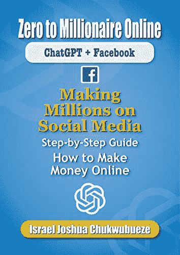

**从零到百万富翁在线：ChatGPT + Facebook：在社交媒体上赚数百万——步步为营指南，如何在线赚钱**

[`www.amazon.com/gp/product/B0BXYBWJW8`](https://www.amazon.com/gp/product/B0BXYBWJW8)

| 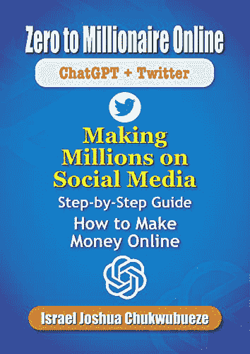

**从零到百万富翁在线：ChatGPT + Twitter：在社交媒体上赚数百万——步步为营指南，如何在线赚钱**

[`www.amazon.com/gp/product/B0BY32MW8J`](https://www.amazon.com/gp/product/B0BY32MW8J)

|

## 第十三章：在 Pinterest 上销售产品

Pinterest 不仅是一个激发灵感和发现的平台，还是一个销售产品的强大工具。 凭借其以视觉为驱动的特性和高度参与的用户群，Pinterest 为您提供了一个独特的机会，向广大受众展示和推广您的产品。 在本章中，我们将探讨在 Pinterest 上销售产品的过程，分享成功的宝贵建议，并指导您如何优化您的产品清单。 让我们深入挖掘在 Pinterest 上销售产品的世界，释放其全部潜力！

**如何在 Pinterest 上销售产品**

> **创建商业账户：** 要在 Pinterest 上销售产品，您需要拥有一个商业账户。如果您还没有，将您的个人账户转换为商业账户或创建一个专门用于您的业务的新账户。这将为您提供有价值的功能和分析工具。
> 
> **设置您的 Pinterest 商店：** 一旦您拥有一个商业账户，启用 Pinterest 商店功能。这使您可以直接在 Pinterest 上展示您的产品，使用户更容易发现并购买它们。要设置您的商店，请转到您的账户设置中的 Pinterest 商店部分，并按照提供的说明操作。
> 
> **添加产品图钉：** 产品图钉是包含有关您的产品详细信息的特殊图钉，如定价、可用性和指向您的网站或在线商店的直接链接。为您的每个产品创建产品图钉，确保它们被准确标记、分类，并链接到正确的产品页面。
> 
> **创建引人注目的产品图片：** 产品图片的视觉吸引力在吸引注意力和推动销售方面起着至关重要的作用。使用高质量、充分照明的照片，展示您的产品不同角度。考虑使用生活方式图片或融入创意设置，使您的产品脱颖而出。
> 
> **撰写引人注目的描述：** 除了引人入胜的视觉效果外，引人入胜的产品描述对于推动销售至关重要。清晰地传达产品的特点、优势和独特卖点。使用有说服力的语言，突出任何特别促销或折扣，并包含相关关键词以优化描述以供搜索。
> 
> **利用丰富的图钉：** 利用丰富的图钉，这是一个允许您自动向您的产品图钉添加额外信息的功能。为您的产品启用丰富的图钉，确保信息是最新的，并准确反映您的网站或在线商店上的详细信息。
> 
> **优化搜索：** 优化您的产品列表以增加它们在 Pinterest 上的可见性。在产品标题、描述和标签中使用相关关键词。进行关键词研究，发现与您的产品相关的热门和流行术语，并进行战略性地整合。

**在 Pinterest 上成功销售产品的技巧**

> **了解您的目标受众：** 了解您的目标受众的偏好、兴趣和痛点。调整您的产品选择和营销工作以满足他们的需求。固定与您的受众 resonant 的产品可以增加推动销售和建立客户忠诚度的机会。
> 
> **创建启发性画板：** 策划与您的产品和目标受众兴趣相符的启发性画板。通过提供更广泛的与您的利基相关的内容，您可以吸引更多关注者，增加互动，并将流量引导到您的产品列表。
> 
> **与受众互动**：积极地回复评论、留言和咨询，与你的受众互动。通过发起对话、征求反馈，并鼓励用户分享他们对你产品的体验，培养出社区感。建立良好的关系增加了信任，鼓励了重复购买。
> 
> **利用影响力营销**：与你所在领域的影响者或微影响者合作，推广你的产品。他们的认可和影响力可以极大地扩大你的产品知名度并推动销售。寻找与你的目标市场相符的受众的影响者，以获得最大的影响力。
> 
> **举办促销和比赛**：考虑举办促销、折扣或比赛，以激励用户购买。为 Pinterest 用户提供独家折扣或举办特定产品的比赛可以引起轰动，鼓励分享，并增加销售。
> 
> **使用 Pinterest 分析**：定期监控你的 Pinterest 分析数据，了解你的受众行为、参与水平以及产品销售的表现。识别趋势，分析热门的图片，并根据情况调整你的策略，以优化你的产品销售工作。

**优化你的产品列表在 Pinterest 上**

> **测试不同的 Pin 设计**：尝试使用不同的 Pin 设计，以确定什么样的设计最能 resonates your audience。测试颜色、布局、文本叠加和产品放置的变化，找到最有效的组合来推动点击和转化。
> 
> **AB 测试描述和行动号召**：持续测试不同的产品描述和行动号召短语，以评估它们对点击率和销售的影响。监控不同变体的表现，并根据数据调整你的描述。
> 
> **展示评价和社交证明**：将积极的评价、推荐或用户生成的内容融入你的产品图片中。社交证明在建立信任和鼓励潜在客户购买上起着重要作用。
> 
> **移动优化**：Pinterest 主要在移动设备上使用，因此确保你的产品列表经过移动端优化非常关键。为你的网站或在线商店使用响应式设计，以提供无缝的移动购物体验。
> 
> **其他平台交叉推广**：在其他社交媒体平台、你的网站或通过电子邮件营销交叉推广你的 Pinterest 产品。扩大你的影响力，并鼓励你现有的受众关注你在 Pinterest 上并探索你的产品。

在 Pinterest 上销售产品为你提供了一个极具吸引力的机会，能够接触到高度参与的受众并促进销售。通过遵循本章概述的步骤并实施提供的提示，你可以优化你的产品列表，吸引你的目标受众，并释放 Pinterest 产品销售的全部潜力。

在下一章中，我们将探讨推动产品列表流量和增加转化率的策略。让我们将您在 Pinterest 上的产品销售游戏提升到新的水平！

## 第十四章：在 Pinterest 上创建赞助内容

在当今的数字环境中，赞助内容已成为企业吸引目标受众并推广其产品或服务的强大营销工具。Pinterest 以其视觉驱动的平台和忠实用户群体，为品牌提供了一个独特的机会，可以创建与用户体验无缝融合的赞助内容。在本章中，我们将探讨赞助内容的概念，指导您创建在 Pinterest 上的赞助内容的过程，并分享成功的宝贵提示。让我们深入探讨 Pinterest 上的赞助内容世界，发掘其提升品牌能见度和参与度的潜力！

**什么是赞助内容？**

赞助内容是由品牌或广告商与内容创作者或发布者合作创建和分发的促销材料。它旨在与平台的有机内容融为一体，并为受众提供价值，同时推广特定产品、服务或品牌信息。赞助内容旨在与受众建立真实和有机的联系，而不是显得具有侵入性的广告。

**如何在 Pinterest 上创建赞助内容**

> **明确您的广告活动目标：** 在 Pinterest 上创建赞助内容之前，清楚地定义您的广告活动目标。您是想增加品牌知名度，增加网站流量，还是产生销售？了解您的目标将帮助您调整内容策略并衡量广告活动的成功。
> 
> **确定合适的内容创作者：** 与与您的品牌价值观和目标受众相符的内容创作者或意见领袖合作，可以极大地增强您的赞助内容的有效性。进行彻底的研究，以确定与您品牌美学、风格和受众相符的内容创作者。
> 
> **建立准则和目标：** 清晰地向您合作的内容创作者传达您的品牌准则、目标和期望。为他们提供详细的简报，概述关键信息、视觉效果以及赞助内容的任何特定要求。
> 
> **融入原生广告：** 为了确保您的赞助内容与 Pinterest 平台无缝融合，重点是创建感觉原生和真实的内容。调整您的内容以匹配 Pinterest 的整体美学，同时以微妙而有效的方式突出您的品牌和产品。
> 
> **运用叙事技巧：** 使用叙事技巧来吸引您的受众并与您的品牌营造情感联系。打造贴近您目标受众的有力叙事，唤起好奇心、灵感或渴望。
> 
> **利用富钉：** 利用 Pinterest 的富钉功能来增强您的赞助内容。富钉提供有关您的产品的额外信息，如定价、可用性和直接链接，使用户更容易参与并采取行动。
> 
> **推广高质量视觉内容：** Pinterest 是一个视觉驱动的平台，因此高质量的视觉内容对于吸引注意力和推动参与至关重要。投资于专业摄影或设计引人入胜的视觉内容，使其与您的品牌形象和 Pinterest 的美学相契合。
> 
> **监控和优化：** 不断监控您的赞助内容在 Pinterest Analytics 和其他跟踪工具中的表现。分析关键指标，如参与度、点击率和转化率，以找到改进的机会并优化您未来的活动。

**在 Pinterest 上成功的赞助内容提示**

> **与用户意图保持一致：** 了解 Pinterest 上的用户意图，并相应地调整您的赞助内容。用户经常使用该平台寻找灵感、制定计划和进行发现。定制您的内容以在这些领域提供价值，同时巧妙地整合您的品牌信息。
> 
> **保持真实和透明：** 透明度是与您的受众建立信任关系的关键。明确披露内容是否为赞助或推广。真实性对于维护积极的品牌形象和与受众建立真挚连接也是至关重要的。
> 
> **与微影响者合作：** 考虑与微影响者合作，他们虽然受众较少，但受众互动程度很高。这些影响者通常与他们的追随者有更个人化的联系，这可能会导致受众对您的赞助内容产生更高的信任和参与度。
> 
> **利用 Pinterest 的定位选项：** Pinterest 提供了强大的定位选项，以帮助您达到希望的受众。利用兴趣定位、关键词定位和人口统计定位等功能，确保您的赞助内容被展示给正确的人群。
> 
> **与 Pinners 互动：** 积极与与您的赞助内容互动的 Pinners 互动。回复评论、回答问题，并表达对他们参与的感激之情。建立关系和促进对话可能会带来增加的品牌忠诚度和支持。
> 
> **测试和迭代：** 不要害怕尝试不同的方法，并对您的赞助内容策略进行迭代。尝试不同的内容格式、视觉内容、信息传递和定位选项，以优化您的活动并逐渐获得更好的成果。

通过在 Pinterest 上创建与目标受众 resonates 且与该平台的视觉和鼓舞人心的特性相一致的赞助内容，你能够有效地推广你的品牌，同时为用户提供价值。记住要保持真实、透明，并专注于与受众建立有意义的联系。

在下一章中，我们将探讨衡量赞助内容活动成功的策略，并将您的投资回报最大化。让我们深入探讨 Pinterest 上的赞助内容的世界，将你的营销努力提升到一个新的高度！

## 第十五章：利用 Pinterest 进行电子商务

在在线业务领域，电子商务变得越来越受欢迎，为企业主和企业提供了新的机会来接触和吸引客户。Pinterest 以其视觉导向的平台和积极参与的用户群体，为推动电子商务成功提供了巨大的潜力。在本章中，我们将探讨如何有效地利用 Pinterest 进行电子商务，提供实用的成功提示，并指导你优化你的电子商务列表，以最大化转化。让我们深入探讨 Pinterest 对电子商务的潜力，并释放其提升你在线业务的潜力！

**如何利用 Pinterest 进行电子商务**

> **创建 Pinterest 商业账户：** 为了充分利用 Pinterest 上的电子商务功能，创建一个专门的商业账户。这将为你提供有价值的分析数据，广告选项和其他电子商务工具。
> 
> **设置 Rich Pins（丰富的钉子）：** Rich Pins 是 Pinterest 上的一个强大功能，可以通过显示额外信息（如定价、可用性和直接链接）增强你的产品列表。为你的电子商务列表启用 Rich Pins，为用户提供无缝购物体验。
> 
> **创意展示你的产品：** Pinterest 是一个视觉驱动平台，因此创造视觉吸引人的产品钉子至关重要。使用突出你的产品独特特点的高质量图像，并吸引用户在其滚动 feeds 时注意到。
> 
> **利用描述性且关键字丰富的描述：** 为你的电子商务列表打造引人注目且关键字丰富的描述。使用符合你目标受众兴趣和搜索行为的相关关键字。这将提高在 Pinterest 上发现你的产品的可能性。
> 
> **创建引人入胜的画板：** 将你的产品组织成主题画板，让用户更容易探索和发现你的商品。策划与不同兴趣、场合或产品类别相关的画板，以满足各种偏好。
> 
> **与受众互动：** 积极与与你的电子商务列表互动的用户互动。回复评论，解答问题，提供有用信息。建立关系和促进积极的客户体验可以增加品牌忠诚度和重复购买。
> 
> **与意见领袖合作：** 与意见领袖合作可以增强您在 Pinterest 上的电子商务努力。确定与您品牌价值观一致且拥有忠实粉丝的意见领袖。与他们合作创建展示您产品并将流量引导至您电子商务网站的赞助内容。
> 
> **运行推广 Pins 活动：** 推广 Pins 是 Pinterest 上的付费广告活动，可以提升您电子商务列表的可见性。利用 Pinterest 的定位选项来触达您期望的受众群体，并将有针对性的流量引导至您的网站。

**在 Pinterest 上成功开展电子商务的提示**

> **为 Pinterest 优化您的网站：** 确保您的电子商务网站针对 Pinterest 流量进行了优化。在产品页面添加 Pinterest 分享按钮，启用富钉，创建外观吸引人且易于固定的产品图片。
> 
> **利用季节性和流行主题：** 利用季节性活动、节日和流行主题在 Pinterest 上创建引人注目的电子商务活动。将您的产品与这些主题保持一致，并创建与固定用户在这些时期的兴趣和愿望 resonating 的 Pins。
> 
> **举办比赛和赠品活动：** 通过举办比赛和赠品活动来吸引您的受众并激励他们与您的电子商务列表互动。鼓励固定用户保存和分享您的 Pins，以赢取奖品或独家折扣。
> 
> **提供详细的产品信息：** 在 Pinterest 上创建您的电子商务列表时，提供详细的产品信息，以满足潜在客户的需求和关注点。包括关键细节，如尺寸、材料、护理说明和任何独特的卖点。
> 
> **利用可购买的 Pins：** 利用可购买的 Pins，让固定用户可以直接在 Pinterest 内购买商品。这种简化的购买体验消除了摩擦，并增加了转化的可能性。
> 
> **为移动设备优化：** 作为以移动设备为先的平台，Pinterest 有大量用户通过移动设备访问该网站。确保您的电子商务列表和网站具有移动友好的响应式设计和快速加载时间。
> 
> **监控和分析绩效：** 定期使用 Pinterest Analytics 和其他跟踪工具监控您在 Pinterest 上的电子商务努力的绩效。分析关键指标，如点击率、转化率和收入，以获取见解并优化您的策略。

**如何优化您在 Pinterest 上的电子商务列表**

> **使用丰富的关键词：** 将相关关键词融入到产品描述、标题和画板中。这将提高您的电子商务列表在 Pinterest 搜索结果中的可见性，并增加吸引有机流量的机会。
> 
> **测试不同的视觉效果：** 尝试不同的视觉效果，如生活方式图片，特写或产品拼贴，以确定哪种类型的图片最能 resonates 您的受众。跟踪不同 Pin 变体的表现，以确定最有效的视觉效果适用于您的电子商务列表。
> 
> **包含明确的行动号召：** 通过在您的 Pin 描述中包含清晰和引人注目的行动号召，鼓励 Pinners 采取行动。使用诸如“立即购买”，“了解更多”或“发现更多”等短语，引导 Pinners 进行购买或进一步探索您的产品。
> 
> **实施 Pinterest 标签和转化跟踪：** 在您的电子商务网站上安装 Pinterest 标签，以跟踪转化并衡量 Pinterest 流量对销售的影响。这将为您提供有关电子商务列表和广告效果的宝贵见解。
> 
> **优化您的产品标题：** 为您的电子商务列表制作简洁且描述性强的标题。融入相关关键词并突出产品的主要卖点。这将有助于您的列表出现在相关搜索结果中，并吸引 Pinner 的注意。
> 
> **创建可 Pin 的产品图片：** 设计外观吸引人且优化用于 Pin 的产品图片。展示产品的主要特点，展示其使用方式，或展示其多功能性，以激发 Pinners 保存和分享您的 Pins。
> 
> **利用产品 Rich Pins：** 实施产品 Rich Pins，自动显示您的电子商务列表上最新的定价和可用性信息。这将为 Pinners 提供准确的信息，并增加他们购买的信心。

通过有效利用 Pinterest 进行电子商务，您可以吸引高度参与的受众，并将有意义的流量引导至您的在线商店。实施提供的提示，持续监控您的表现，并优化您的电子商务列表，以最大化转化并在 Pinterest 上取得成功。

在下一章中，我们将深入探讨利用 Pinterest 的广告选项的高级策略，进一步推动您的电子商务努力。让我们探索 Pinterest 广告的世界，将您的在线业务推向新高度！

## 第十六章：创建 Pinterest 画板

Pinterest 画板是在该平台上建立成功存在的重要组成部分。它们允许您组织和策划您的 Pins，使 Pinners 更容易发现和互动您的内容。在本章中，我们将探讨 Pinterest 画板是什么，如何有效创建它们，并提供最大化影响力的宝贵提示。让我们深入探索 Pinterest 画板的世界，学习如何创建引人注目且成功的画板，吸引并互动您的受众！

**Pinterest 画板是什么？**

Pinterest 板块是允许您根据不同的主题、兴趣或话题保存和分类您的 Pin 的虚拟收藏或相册。它们作为您品牌、兴趣或专业知识的视觉代表，为 Pinners 提供了一个有组织的方式来探索和发现您的内容。通过创建板块，您可以策划您的 Pin，使您的受众更容易浏览您的内容并找到他们感兴趣的内容。

**如何创建 Pinterest 板块**

> **确定您的板块主题：** 从与您的品牌、利基或目标受众相关的不同主题或话题开始进行头脑风暴。考虑您受众的兴趣和愿望，并创建满足他们需求的板块。例如，如果您是时尚博主，您可以创建诸如“春季时尚趋势”、“街头风格灵感”或“运动装搭配灵感”等板块。
> 
> **命名您的板块：** 为您的板块选择描述性且关键词丰富的名称。这将帮助 Pinterest 了解您的板块的内容，并提高它们在搜索结果中的可见性。使用清晰简洁的语言准确地代表您的板块的主题或话题。
> 
> **添加相关描述：** 为您的每个板块撰写一个引人入胜的描述。利用这个空间提供额外的背景信息，解释 Pinners 可以在板块上找到什么，并包含相关关键词。一篇写得好的描述可以吸引 Pinners 探索您的板块并与您的内容互动。
> 
> **选择适当的封面图片：** 封面图片是您的板块的视觉代表，对吸引 Pinners 的注意起着至关重要的作用。选择一个引人注目且代表性强的图片，清晰传达板块的内容。它应该视觉上吸引人，并鼓励 Pinners 点击并进一步探索。
> 
> **组织您的 Pin：** 创建板块时，在每个板块内以逻辑和直观的方式组织您的 Pin。考虑 Pin 的流程和顺序，为 Pinners 创建一个连贯且引人入胜的浏览体验。您可以通过拖放来重新排列板块内的 Pin 的顺序。
> 
> **与他人合作：** Pinterest 允许您与其他用户共同在板块上合作。这一功能特别适用于团队项目、团队合作或来自多个贡献者的策划内容。邀请其他人加入您的板块，并贡献他们的 Pin，丰富内容并扩大受众范围。
> 
> **保持您的板块更新：** 定期审查和更新您的板块，确保内容保持新鲜、相关和引人入胜。删除过时的 Pin，添加新的 Pin，并根据需要调整板块的重点，以与您受众的不断变化的兴趣保持一致。

**创建成功的 Pinterest 板块的提示**

> **具体而专注于细分市场：** 不要创建通用的画板，而是专注于特定主题或与你的目标受众相关的细分市场。通过迎合特定的兴趣，你可以吸引更多参与度高、有针对性的受众。
> 
> **融入关键词：** 在你的画板名称、描述和 Pin 标题中使用相关关键词。这将提高你的画板的可发现性，并使它们更有可能出现在相关搜索结果中。
> 
> **遵循 Pinterest 的最佳实践：** 时刻关注 Pinterest 的最佳实践和创建画板的指南。这确保你的画板符合平台的政策，并增加它们获得可见性的机会。
> 
> **提供价值和灵感：** 力求通过你的画板为受众提供价值。策划高质量和富有启发性的内容，为 Pinners 提供教育、娱乐或解决问题的内容。这将鼓励他们关注你的画板并与你的内容互动。
> 
> **创建各种类型的画板：** 尝试创建不同类型的画板，以迎合各种兴趣和偏好。你可以创建专注于产品推荐、启发性语录、DIY 项目、季节趋势或你所在领域内特定主题的画板。
> 
> **展示你的专业知识：** 使用你的画板展示你的专业知识，树立自己作为你所在领域的思想领袖。策划展示你的知识、技能和独特观点的内容，将自己定位为可信赖的信息来源。
> 
> **推广你的画板：** 积极在其他平台上推广你的画板，比如你的网站、博客或社交媒体账号。鼓励你的粉丝探索并关注你在 Pinterest 上的画板，扩大你的影响力并带来更多的互动。

通过创建组织良好、吸引人的 Pinterest 画板，你可以增强在该平台上的存在感，并吸引一批忠实的、积极参与的粉丝。按照本章概述的步骤，融入提供的建议，并继续完善和优化你的画板，以最大程度地发挥它们的影响力。在下一章中，我们将探讨利用 Pinterest 来驱动流量和增加转化率的高级策略。准备好把你的 Pinterest 游戏提升到一个新水平吧！

## 第十七章：Pinterest 上的群组画板

Pinterest 提供了一个独特的功能，称为群组画板，这为在该平台上进行协作和扩展你的影响力提供了绝佳机会。在本章中，我们将探讨群组画板是什么，如何加入它们，并分享有效使用 Pinterest 群组画板的宝贵技巧。让我们深入探索群组画板的世界，并了解它们如何增强你的 Pinterest 体验！

**Pinterest 上的群组画板是什么？**

Pinterest 上的群组板是多个用户可以共同贡献和分享特定主题或话题的协作板。它们允许用户邀请其他人加入板，赋予他们固定和参与内容的能力。群组板是提高您的图钉可见性、触达更广泛受众，并在 Pinterest 社区内促进参与的强大工具。

**如何加入 Pinterest 上的群组板**

> **寻找相关的群组板：** 首先确定与您的专业领域、兴趣或目标受众相符的群组板。您可以通过在 Pinterest 搜索栏中搜索特定的关键词或主题来找到群组板。此外，像 PinGroupie、PinGroupie 这样的平台，或加入相关的 Pinterest 社区可以帮助您发现并联系群组板所有者。
> 
> **遵循群组板指南：** 每个群组板都有板主设置的特定指南。在申请加入群组板之前，仔细审查和遵守这些指南。通常的要求可能包括追随板主，从板上 repin 一定数量的图钉，或通过电子邮件或指定表单联系板主。
> 
> **发送申请加入：** 一旦您找到一个相关的群组板并熟悉了准则，就用礼貌和简洁的方式向板主发出加入请求。使用板的首选联系方式，例如评论特定的图钉、发送直接消息，或使用板主提供的电子邮件地址。
> 
> **等待批准并按照说明操作：** 发送请求后，耐心等待板主的回复。如果被批准，认真遵守板主提供的任何额外指示，例如添加特定的图钉或向板社区介绍自己。遵守这些说明有助于维护所有成员积极的群组体验。

**在 Pinterest 上使用群组板的技巧**

> **积极参与：** 一旦加入了一个群组板，积极参与内容，repin,点赞和评论其他贡献者的图钉。参与有助于培养社区感，鼓励互惠互利，并增加自己图钉的可见性。
> 
> **提供高质量的图钉：** 向群组板贡献高质量、视觉吸引人和有价值的图钉。确保你的图钉与板块的主题一致，并 resonant with 其受众。优质内容增加了参与的可能性，并鼓励其他群组成员 repin 你的图钉。
> 
> **尊重规则：** 遵守群组板的规则和准则。避免用过度的自我推广或不相关的内容向板发送垃圾邮件。尊重板的目的，贡献相关和有价值的图钉，为成员提高整体体验。
> 
> **合作与连接：** 群组板为您提供了与同一领域志同道合的个人合作和连接的机会。与其他群组板成员联系，参与讨论，并建立关系。合作可以超越 Pinterest，并为客座博客、合作企业或在其他平台上的交叉推广提供机会。
> 
> **监控表现：** 使用 Pinterest Analytics 定期监控您在群组板上的 Pin 的表现。识别哪些 Pin 引起了观众的共鸣，产生了互动并带来了流量。分析表现数据可以让您完善您的 Pinterest 策略，并专注于产生最佳结果的 Pin。
> 
> **创建您自己的群组板：** 随着您在群组板上的经验增加，考虑创建您自己的群组板。邀请相关的 Pinners 贡献内容，建立准则，并为您的领域策划一个有价值的资源。拥有一个群组板可以增强您的权威性，扩大您的网络，并在 Pinterest 社区内增加您的可见性。

群组板可以显著增强您在 Pinterest 上的存在感，增加互动，并将流量引导到您的网站或在线业务。通过遵循本章概述的步骤并实施提供的提示，您可以充分利用群组板，并将它们作为您的 Pinterest 营销策略中的强大工具。在下一章中，我们将探讨优化您的 Pinterest 个人资料和最大化在该平台上的影响力的高级策略。准备好将您的 Pinterest 游戏提升到新的高度！

## 第十八章：在 Pinterest 上使用标签

标签已成为社交媒体平台的一个重要组成部分，允许用户发现和组织围绕特定主题的内容。虽然 Pinterest 以其视觉发现而闻名，但该平台也接受了使用标签来增强可搜索性和互动性。在本章中，我们将探讨什么是标签，在 Pinterest 上如何有效使用它们，并提供有价值的提示，以充分利用您的 Pinterest 策略中的标签。让我们深入探讨 Pinterest 标签的世界，并释放它们的潜力！

**Pinterest 上的标签是什么？**

Pinterest 上的标签是由“#”符号前导的关键词或短语。它们作为一种分类和组织内容的方式，使用户更容易找到与特定主题相关的 Pin。当用户点击或搜索标签时，Pinterest 会显示包含该特定标签的 Pin 的动态。

**Pinterest 上的标签不仅限于标题，还可以添加到 Pin 描述、板块标题和评论中。**

**如何在 Pinterest 上使用标签**

> **研究相关标签：** 首先研究并确定在您的利基或行业内流行的相关标签。使用 Pinterest 搜索栏探索与您的内容、产品或服务相关的标签。注意每个标签关联的 Pin 数量，以衡量它们的受欢迎程度和潜在覆盖范围。
> 
> **将标签融入 Pin 描述中：** 创建新 Pin 时，在 Pin 描述中包含相关标签。使用广泛和具体的标签组合，确保您的 Pins 可以被各种用户发现。例如，如果您分享一款素食冰沙的食谱，您可以包含标签如#veganrecipes，#smoothielovers 或#healthydrinks。
> 
> **将标签添加到板块标题中：** 通过将相关标签纳入标题中，增强您的板块的可搜索性。这有助于对您的板块进行分类，并使它们在用户搜索特定主题时更易发现。例如，如果您有一个专门用于健身技巧的板块，您可以在板块标题中包含像#fitnessgoals 或#workoutinspiration 这样的标签。
> 
> **在评论中使用标签互动：** 通过在评论部分与 Pinterest 社区互动，与相关标签互动。在具有相关标签的 Pins 上留下深思熟虑的评论，展示您的专业知识或提供与主题相关的见解。与标签互动有助于增加您的可见性，并与其他 Pinners 建立联系。
> 
> **关注热门标签：** 保持对 Pinterest 上热门标签的最新动态，并在相关时将它们纳入您的内容策略中。Pinterest 经常在搜索栏或探索部分突出显示热门标签，为加入对话和触达更广泛受众提供机会。

**在 Pinterest 上使用标签的技巧**

> **具体而相关：** 使用与您内容相关的特定标签，以吸引真正对您所提供的内容感兴趣的用户。避免使用通用或过度使用的标签，这可能导致您的 Pins 在大量内容中迷失。要具体并选择准确描述您的 Pin 主题或焦点的标签。
> 
> **混合热门和利基标签：** 在使用具有更广泛搜索量的热门标签和具有更有针对性受众的利基标签之间取得平衡。热门标签可以让您的 Pins 暴露给更大的受众，而利基标签则帮助您接触更受关注和相关的受众。尝试不同的组合，找到适合您的 Pins 的最佳平衡。
> 
> **使用品牌标签：** 将品牌标签融入您的 Pins 中，并鼓励您的受众在分享您的内容时使用它们。品牌标签有助于创建社区感，增加品牌知名度，并使您能够轻松跟踪与您品牌相关的用户生成内容。
> 
> **保持标签一致性：**建立一组在您的 Pin、画板和个人资料中使用的一致的标签。一致性使用户更容易将特定标签与您的内容和品牌联系起来。它还有助于 Pinterest 更好地理解您的内容，提高您的 Pin 在相关搜索中出现的机会。
> 
> **监控标签表现：**定期使用 Pinterest Analytics 监控与特定标签相关联的 Pin 的表现。分析哪些标签产生最多的印象、参与度和点击量。这些数据可以指导您的标签策略，并帮助您随着时间的推移完善和优化您对标签的使用。
> 
> **测试和迭代：**尝试不同的标签组合，观察它们对您的 Pin 在可见性和参与度上的影响，并相应地进行调整。标签的有效性可能会根据您的领域、受众和当前趋势而有所不同。测试不同的策略可以让您完善您的方法，并最大程度地扩大您 Pin 的受众。

通过将标签纳入您的 Pinterest 策略中，您可以增加 Pin 的发现性，扩大受众，并在 Pinterest 社区内促进参与。记得要研究相关的标签，谨慎地将它们融入，以及监控它们的表现，以优化您的结果。在下一章中，我们将探讨优化您的 Pinterest 个人资料和内容以带来更多流量和转化的高级技巧。准备好将您的 Pinterest 营销推向新高度吧！

> *书籍推荐*
> 
> •

| 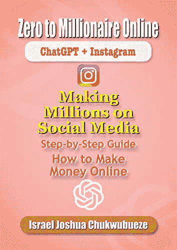

**从零到百万富翁在线：ChatGPT + Instagram：在社交媒体上赚取百万美元 - 逐步指南，如何在线赚钱**

[`www.amazon.com/gp/product/B0BY2XXL3J`](https://www.amazon.com/gp/product/B0BY2XXL3J)

| 

**ChatGPT 的在线零到百万富翁：50+种使用博客、电子商务、联盟营销、YouTube、TikTok、Facebook、Instagram 等赚钱的方法**

[`www.amazon.com/gp/product/B0BY57NJ1F`](https://www.amazon.com/gp/product/B0BY57NJ1F)

|

## 第十九章：创建 Pinterest 竞赛

Pinterest 竞赛是一个激动人心和互动的方式，可以吸引您的受众，增加访问您的 Pinterest 页面的流量，并增加品牌知名度。通过利用竞赛的力量，您可以鼓励用户参与，产生用户生成的内容，并在您的追随者中营造出一种社区意识。在本章中，我们将探讨 Pinterest 竞赛是什么，如何创建它们，并为在平台上成功运行竞赛提供宝贵的建议。准备好用 Pinterest 竞赛激发兴奋，并提升参与吧！

**Pinterest 竞赛是什么？**

Pinterest 竞赛是一种促销活动，鼓励 Pinterest 用户通过提交内容、与你的 Pin 互动或遵循特定的指南来参与。这些竞赛可以采取各种形式，例如照片竞赛、标题竞赛、产品赠品或创意挑战。目标是激励用户与你的品牌互动，并围绕你的产品或服务产生话题。

**如何创建 Pinterest 竞赛**

> **明确你的竞赛目标：**在推出 Pinterest 竞赛之前，清晰地定义你的目标。你是想增加品牌知名度、产生用户生成内容、吸引网站流量，还是扩大你的 Pinterest 粉丝？了解你的目标将有助于塑造竞赛的结构和机制。
> 
> **选择竞赛类型：**确定与你的目标和目标受众一致的竞赛类型。在 Pinterest 上流行的竞赛类型包括照片竞赛，参与者提交与特定主题或话题相关的图像，以及标题竞赛，用户为给定的图像提交创意标题。其他选项包括抽奖活动、创意挑战或知识竞赛。
> 
> **制定清晰的规则和指南：**制定清晰的竞赛规则和指南，以确保公平和透明。指定符合条件的标准、参赛要求、提交截止日期和任何其他相关细节。确保你的竞赛符合 Pinterest 的指南和政策，以避免任何违规行为。
> 
> **创建引人注目的竞赛 Pin：**设计一个视觉吸引人且引人注目的 Pin 来促销你的竞赛。使用高质量的图像、引人入胜的图形和清晰的文本来传达竞赛细节、规则和激励措施。确保 Pin 在用户的 Feed 中脱颖而出，并促使他们采取行动。
> 
> **选择相关的奖品：**选择与你的目标受众一致并与你的品牌一致的奖品。奖品应足够诱人，以激励用户参与。它可以是你的企业的产品或服务、礼品卡、独特的体验，或与你的受众兴趣相关的任何其他有价值的提供。
> 
> **促销你的竞赛：**通过各种渠道宣传你的竞赛，为其创造话题。在 Pinterest 页面、网站、博客、电子邮件通讯和社交媒体平台上分享竞赛 Pin。鼓励你的粉丝与他们的网络分享竞赛，从而增加其有机的覆盖范围。
> 
> **跟踪和评估绩效：**通过跟踪参与人数、互动水平、网站流量和粉丝增长等关键指标来监测你的竞赛表现。根据事先确定的目标评估你的比赛的成功，并相应地调整未来的策略。

**创建成功 Pinterest 竞赛的建议：**

> **保持简单：** 避免复杂的参与要求或过于复杂的规则。保持参与过程简单直接，以鼓励最大程度的参与。
> 
> **选择引人入胜的主题：** 选择一个与你的目标受众 resonates 的主题，并鼓励创造力。激发情感、启发讲故事，或者利用当前趋势的主题很可能吸引更多参与者。
> 
> **利用用户生成的内容：** 鼓励参与者创作并提交与你的品牌或产品相关的内容。用户生成的内容不仅可以提升参与度，还可以作为有价值的社交证明和品牌的真实见证。
> 
> **促进社区参与：** 鼓励参与者通过点赞、评论或转采互相的作品进行互动。这可以培养社区意识，鼓励参与者在整个比赛期间保持参与。
> 
> **提供激励措施：** 提供有吸引力的激励措施来激励用户参与。考虑提供独家折扣、新产品的提前访问权限，或者有机会被展示在你的 Pinterest 页面或网站上。
> 
> **与意见领袖合作：** 与意见领袖或相关品牌合作举办比赛。这将扩大你的影响力，并为你的活动增加可信度，增加参与度和互动。
> 
> **遵守 Pinterest 指南：** 熟悉 Pinterest 的比赛指南，并确保你的比赛符合他们的政策。这将帮助你避免任何惩罚或账户问题。

创建 Pinterest 比赛可以是吸引受众、增加品牌曝光度和生成用户生成内容的有趣有效方式。通过遵循提供的建议并根据你独特的品牌和受众进行调整，你可以举办成功的比赛，吸引你的 Pinterest 社区并产生实际效果。准备好释放 Pinterest 比赛的力量，看着你的参与度飙升吧！

## 第二十章：在 Pinterest 上合作

在 Pinterest 上合作是一种强大的策略，可以让你利用其他 Pinterest 用户的专业知识、受众和创造力。通过与志同道合的个人、品牌或意见领袖联手，你可以扩大你的影响力，吸引更广泛的受众，并创造令人兴奋和引人入胜的内容。在本章中，我们将探讨如何与其他 Pinterest 用户合作，提供成功合作的宝贵建议，并展示成功 Pinterest 合作的示例。准备好释放 Pinterest 上合作的全部潜力吧！

**如何与其他 Pinterest 用户合作**

> **确定兼容的合作伙伴：** 首先确定与你的品牌价值观、目标受众和细分市场相符的 Pinterest 用户。寻找与你的产品互补且目标一致或审美相似的个人或企业。可以是有影响力的人、互补品牌、博客作者，或者在 Pinterest 上有强大存在感的内容创作者。
> 
> **建立联系并建立连接：** 一旦确定了潜在的合作伙伴，通过直接消息、电子邮件或评论他们的 Pins 与他们联系。介绍自己，表达对合作的兴趣，并解释你认为合作的双方会有什么互惠互利的好处。要真诚、具体，并强调为什么你认为合作对双方都有价值。
> 
> **明确目标和目的：** 明确定义你的合作目标和目的。你是想扩大受众、增加网站流量、提高参与度，还是创造创新和鼓舞人心的内容？确保你和合作伙伴对合作的期望结果达成一致。
> 
> **一起规划和头脑风暴：** 在构思和规划阶段进行合作，提出创新和引人入胜的内容创意。安排头脑风暴会议或使用协作工具交换想法，讨论主题，并概述合作内容的结构和格式。
> 
> **创建联合画板和群画板：** 创建联合画板或群画板，双方可以共同贡献和策划内容。这些画板可以作为你们合作努力的中心，也是双方受众可以发现和参与你们共同创作内容的地方。
> 
> **相互推广对方的内容：** 互相推广对方的 Pins、画板或个人资料，以交叉污染你们的受众。转发对方的内容，在 Pin 描述中标记对方，或在标题中提及对方，以增加流量，为双方提高曝光度。
> 
> **共同创作引人入胜的内容：** 合作创作引人入胜的内容，展示双方品牌的优势和专业知识。可以是联合博客文章、信息图表、教程或主题画板，为共同受众提供价值。结合你们独特的观点、知识和创意风格，提供引人入胜和独特的内容。

**在 Pinterest 上成功合作的提示**

> **建立清晰的沟通渠道：** 与合作伙伴保持开放和频繁的沟通。建立专门的沟通渠道，如电子邮件或项目管理工具，以简化合作流程，确保协调顺畅。
> 
> **明确角色和责任：** 清晰定义双方的角色、责任和期望。确定谁负责内容创作、安排、推广和监控合作。这有助于避免误解，确保双方在同一页面上。
> 
> **尊重彼此的品牌指南：** 在合作时，要注意彼此的品牌指南、审美和价值观。确保你们共同创作的内容符合双方品牌的身份，并与共同受众产生共鸣。
> 
> **发挥各自优势：** 辨别并发挥各自的优势、专业知识和独特优势。这样可以创造出突显双方优势并为观众提供卓越价值的内容。
> 
> **灵活并对新的想法持开放态度：** 合作通常需要妥协与适应。要对合作者的新想法、反馈和建议持开放态度。抓住相互学习的机会，并尝试新的方法。
> 
> **建立明确的推广策略：** 讨论并规划如何在各自的渠道上推广合作内容。确定最佳的渠道、时机和策略，以最大程度地提高可见性和参与度。
> 
> **评估和衡量结果：** 合作结束后，评估你们的共同努力所产生的影响和结果。分析参与度、流量、转化率和观众增长等指标，以衡量合作的成功程度。利用这些见解来完善未来的合作，并增强你在 Pinterest 上的策略。

**成功的 Pinterest 合作示例**

> **家居装饰影响者和家具品牌合作：** 一位知名的家居装饰影响者和一个家具品牌合作，共同创建一个联合画板，展示使用品牌家具打造的精美室内装饰。此次合作引起了轰动，提高了品牌知名度，并带动了品牌网站的流量。
> 
> **食谱博主与厨房电器品牌合作：** 一位食谱博主与一家厨房电器品牌合作，共同创建一系列图钉，展示使用品牌电器制作的美味食谱。此次合作展示了品牌产品的实际效果，为博主的观众提供了有价值的内容，并带动了品牌的销售。
> 
> **旅行博主与行李品牌合作：** 一位旅行博主与一个行李品牌合作，共同创建一系列重点突出旅行目的地并提供打包技巧的图钉。此次合作吸引了旅行爱好者的观众，扩展了博主和品牌的影响力，并提高了参与度和转化率。
> 
> **时尚博主和珠宝品牌合作：** 一位时尚博主与一家珠宝品牌合作，共同创建一个联合画板，展示搭配该品牌珠宝的时尚服装。此次合作提升了博主的时尚内容，向新的观众介绍了这个品牌，并为珠宝品牌带来了销售。
> 
> **DIY 博主和手工供应品牌合作：** 一位 DIY 博主与一家手工供应品牌合作，共同创建一个合作的 Pinterest 画板，展示使用该品牌的材料制作的 DIY 项目。此次合作激励了 DIY 社区，树立了该品牌作为手工供应资源的首选地位，并带动了双方网站的流量。

结论

在 Pinterest 上进行合作为扩大您的影响力、吸引更广泛的受众和创造出色内容打开了令人兴奋的可能性。通过确定兼容的合作伙伴、有效规划并利用彼此的优势，您可以取得显著的成果并开拓新机会。记得建立清晰的沟通，尊重彼此的品牌准则，并跟踪合作的影响。通过正确的合作，您可以将您在 Pinterest 上的存在推向新高度，并在 Pinterest 社区内建立持久的联系。准备好合作并释放 Pinterest 的全部潜力！

**如果您购买/下载了我的书并发现它有趣，我会很高兴；如果您能为这本书留下一个好评，这将帮助其他潜在读者表现出兴趣。**

只需 30 秒，将不胜感激。

**点击这里** [**留下评论！**](https://www.amazon.com/dp/B0BY318HFF)

预先感谢您，我爱您，您是最棒的。

## 第二十一章：创建 Pinterest 视频 Pin

视频内容在包括 Pinterest 在内的社交媒体平台上变得越来越受欢迎。通过 Pinterest 视频 Pin，您可以吸引观众，讲述引人入胜的故事，并以动态和引人入胜的形式展示您的产品或服务。在本章中，我们将探讨 Pinterest 视频 Pin 是什么，提供创建它们的逐步指南，并提供创建成功的视频 Pin 的宝贵提示，以推动参与和转化。准备好通过引人入胜的视频为您的 Pinterest 内容注入生机！

**什么是 Pinterest 视频 Pin？**

Pinterest 视频 Pin 是出现在用户动态和画板上的短视频，它们会在用户浏览 Pinterest 动态时自动播放，吸引注意力并邀请观众与内容互动。视频 Pin 可以是教程、产品演示、幕后花絮、鼓舞人心的故事或有趣的片段。

创建视频 Pin 可以让您以更具沉浸感和视觉吸引力的方式展示您的品牌、产品或服务，增加用户参与和点击的可能性。随着视频内容的日益流行，视频 Pin 为您提供了一个脱颖而出的机会，吸引新关注者，并将流量引导至您的网站或在线商店。

**如何创建 Pinterest 视频 Pin**

创建 Pinterest 视频 Pin 包括几个简单的步骤。

**按照本指南创建引人入胜且有效的视频 Pin，与您的受众产生共鸣：**

**步骤 1：准备您的视频内容在创建您的视频 Pin 之前，构思想法并确定您的视频的目标。** 决定您是想展示产品、分享教程、讲故事还是提供有价值的信息。概述您想包含的关键信息、镜头和视觉效果。

**第 2 步：创建或编辑您的视频 使用视频编辑软件或应用程序创建或编辑您的视频内容。** 考虑 Pinterest 视频 Pin 的长度、宽高比和格式要求。请记住，在社交媒体平台上，较短的视频通常表现更好。确保您的视频视觉吸引人、引人入胜，并与您的品牌形象一致。

**第 3 步：为 Pinterest 优化您的视频 在上传视频之前，通过以下准则为其优化以适应 Pinterest：**

> •  在最初几秒钟使用引人注目的视觉效果来吸引观众的注意力。
> 
> •  添加字幕或字幕，使您的视频即使没有声音也能被理解和访问。
> 
> •  在视频中包含您的品牌标识、网站或产品信息，以加强品牌认知并增加流量。
> 
> •  使用高质量的视觉效果，确保视频清晰明亮。
> 
> •  在各种设备和平台上测试您的视频，以确保它显示和播放正确。

**第 4 步：上传您的视频 Pin 要上传您的视频 Pin，请按照以下步骤操作：**

> •  登录您的 Pinterest 账户。
> 
> •  点击“+”图标创建一个新的 Pin。
> 
> •  从您的设备选择视频文件或从您喜欢的视频托管平台中选择。
> 
> •  添加一个引人注目的标题、描述和相关关键词，以优化您的视频 Pin 的搜索效果。

**第 5 步：选择封面图像 为您的视频 Pin 选择一个视觉上吸引人的封面图像。** 这个封面图像将显示在用户的板块和搜索结果中，吸引注意力并诱使观众点击观看。

**第 6 步：添加相关细节和链接 在 Pin 描述中包含产品信息、定价或其他背景信息等相关细节。** 考虑添加一个呼吁行动（CTA）以鼓励观众采取特定行动，例如访问您的网站、订阅您的通讯或进行购买。添加适当的目标链接，将观众重定向到您期望的落地页。

**第 7 步：发布和推广您的视频 Pin 发布您的视频 Pin 并开始在其他社交媒体渠道、网站或博客上推广。** 考虑在相关的 Pinterest 社区、群组板块或协作板块中分享，以扩大其影响范围并增加互动。

**成功创建 Pinterest 视频 Pin 的提示**

要使您的 Pinterest 视频 Pin 真正脱颖而出并推动互动，请考虑以下提示：

> **保持简短和引人入胜：** 目标是制作 30 秒至 2 分钟长的视频。在最初几秒内吸引观众的注意力，并在整个视频中保持他们的兴趣。
> 
> **讲一个引人入胜的故事：** 使用讲故事的技巧与观众建立情感联系。无论是产品故事、旅程还是鼓舞人心的叙述，让您的视频内容引人共鸣且难以忘怀。
> 
> **为无声观看优化：** 由于 Pinterest 视频 Pin 自动播放时没有声音，请确保您的视频即使在无声观看时仍能传达其信息。添加字幕可以增强观看体验并提高可访问性。
> 
> **使用清晰和吸引人的视觉效果：** 使用高质量的视觉效果，鲜艳的颜色和清晰的图像来吸引注意力并有效传达您的信息。避免杂乱的场景或复杂的视觉效果可能会分散或混淆观众的注意力。
> 
> **展示产品和服务：** 如果您正在推广产品或服务，请在您的视频中展示它们的特点、优势和用途。突出它们的独特卖点，并展示它们如何提升用户的生活。
> 
> 融入品牌元素：在您的视频 Pin 中始终包含您的品牌标识、颜色和字体，以加强您的品牌身份并增加品牌识别度。这有助于观众将视频内容与您的品牌联系起来，并建立信任。
> 
> **测试和优化：** 尝试不同的视频格式、风格和信息传递方式，以确定什么最能 resonates 您的观众。使用 Pinterest 分析监控您的视频 Pin 的表现，并根据观众参与度和反馈进行调整。
> 
> **利用 Pinterest 趋势：** 保持与最新的 Pinterest 趋势保持同步，并将其融入到您的视频 Pin 中。创建与热门话题或季节主题相符的内容可以帮助增加可见性和参与度。

结论

Pinterest 视频 Pin 提供了一个强大的方式来吸引您的观众，展示您的品牌，并将流量引导到您的网站或在线商店。通过按照逐步指南并实施本章提供的提示，您可以创建引人注目的视频 Pin，吸引观众并激励他们采取行动。尝试不同的视频内容创意，优化您的视频以适应 Pinterest，并监控表现以随时间完善您的策略。随着视频内容的日益流行，利用 Pinterest 视频 Pin 的潜力提升您在平台上的存在感，并与您的观众在更深层次上建立联系。

## 第二十二章：使用 Pinterest 分析

在快节奏的在线营销世界中，获得可靠数据和见解对于做出明智决策和优化您的策略至关重要。Pinterest 分析提供有关您的 Pinterest 帐户的宝贵信息，帮助您了解您的观众，跟踪您的 Pin 的表现，并做出数据驱动的决策以改善您页面的表现。在本章中，我们将探讨如何访问 Pinterest 分析，要跟踪的关键指标，并提供有关如何利用这些分析来增强您的 Pinterest 营销工作的提示。准备好深入挖掘您的 Pinterest 数据并解锁成功的秘诀！

**如何访问 Pinterest 分析**

要访问 Pinterest 分析，请按照以下简单步骤操作：

**步骤 1：** 登录您的 Pinterest 帐户。

**步骤 2：** 转到您的 Pinterest 个人主页。

**步骤 3：** 点击您个人主页左上角的分析标签。

一旦您进入分析部分，您将获得大量数据和见解，可以帮助您了解您的受众、衡量 Pin 的表现，并更深入地了解哪些工作良好以及需要改进的地方。

**Pinterest 上需要追踪的指标**

Pinterest Analytics 提供了各种指标，用于跟踪您的 Pin、画板和整体账户的表现。以下是一些关键指标需要注意：

> **印象数：** 印象数是指您的 Pin 被显示给 Pinterest 用户的次数。跟踪印象可以让您了解您内容的触达和可见度。
> 
> **保存数：** 保存数表示用户将您的 Pin 保存到他们自己的画板上的次数。跟踪保存可以帮助您了解哪些 Pin 引起了受众共鸣，以及具有更高机会带动互动和流量。
> 
> **点击数：** 点击数表示用户点击您的 Pin 查看详细信息或访问您的网站的次数。跟踪点击可以帮助您衡量 Pin 在带动流量和互动方面的有效性。
> 
> **互动：** 互动包括对您的 Pin 的所有互动，包括保存、点击、放大和评论。跟踪互动可以让您全面了解用户与您内容的互动情况。
> 
> **热门 Pin：** Pinterest Analytics 还提供了关于您表现最好的 Pin 的数据。这些是获得最多印象、保存和点击的 Pin。分析您的热门 Pin 可以为您提供有关内容、视觉和信息传达方式与受众最匹配的见解。
> 
> **受众见解：** Pinterest Analytics 提供了有关您受众的人口统计信息，包括他们的位置、性别、语言和兴趣。了解您受众的人口统计信息可以帮助您定制内容和定位策略，与目标受众更好地建立联系。

**使用 Pinterest 分析提高页面性能的技巧**

现在您知道如何访问 Pinterest Analytics 和需要跟踪的关键指标，让我们探讨一些利用这些数据来提高页面性能的技巧：

> **识别表现最好的 Pin：** 分析您表现最好的 Pin，了解使它们成功的要素。寻找视觉、信息和主题方面的模式。利用这些见解创建更多能引起您受众共鸣的内容。
> 
> **优化 Pin 描述：** 分析您表现最好的 Pin 中使用的关键词和描述。识别您受众共鸣的常见主题和关键词。将这些关键词纳入您未来的 Pin 描述中，以提高搜索可见度。
> 
> **测试和完善：** 使用 Pinterest Analytics 识别表现不佳的 Pin。尝试不同的视觉、标题、描述或格式，看看哪种与您的受众产生最好的共鸣。根据分析数据持续测试和完善您的内容。
> 
> **了解您的受众：** 利用 Pinterest Analytics 提供的受众见解，了解您的受众人口统计、兴趣和偏好。利用这些信息创建与他们的需求和兴趣相符的有针对性的内容。
> 
> **跟踪转化指标：** 如果您有网站或在线商店，请集成 Pinterest Tag 或其他转化跟踪工具，以衡量您的 Pin 在推动转化方面的效果。监控从 Pinterest 流量产生的购买、注册或线索等指标。
> 
> **设定目标和 KPIs：** 为您的 Pinterest 营销努力制定具体的目标和关键绩效指标（KPIs）。定期跟踪您的进展，并根据您的目标调整您的策略。
> 
> **保持与 Pinterest 更新同步：** Pinterest 经常推出新功能、算法和最佳实践。保持与最新的 Pinterest 新闻和更新同步，以确保您充分利用平台的潜力并适应变化。

结论

Pinterest Analytics 是一个强大的工具，提供有价值的见解，以增强您的 Pinterest 营销策略。通过跟踪关键指标，分析表现最佳的 Pin，了解您的受众，您可以优化您的内容，提高参与度，并将更多流量引导至您的网站或在线商店。记得定期审查您的分析数据，尝试不同的方法，并保持对受众的偏好和行为的响应。Pinterest Analytics 是您了解您的 Pinterest 账户表现的窗口，因此明智地使用它来释放平台的全部潜力，实现您的营销目标。

## 第二十三章：Pinterest SEO

在庞大的在线世界中，数百万用户正在寻找灵感、想法和产品，对于您的 Pinterest 营销策略的成功来说，在搜索引擎上拥有强大的存在至关重要。这就是 Pinterest SEO（搜索引擎优化）发挥作用的地方。通过优化您的 Pinterest 页面和 Pin 以供搜索，您可以增加您的可见性，吸引更多有机流量，并触达更广泛的受众。在本章中，我们将探讨 Pinterest SEO 的概念，学习如何优化您的 Pinterest 页面以供搜索，并提供有价值的提示来改善您的 Pinterest SEO 策略。准备好释放搜索的潜力，将您的 Pinterest 存在推向新高度！

**什么是 Pinterest SEO?**

Pinterest SEO 指的是优化您的 Pinterest 页面和内容，以在 Pinterest 的搜索结果中排名更高的实践。当用户在 Pinterest 上搜索特定关键词或主题时，平台的算法根据各种因素，包括相关性、参与度和质量，确定要显示的标签和配置文件。通过了解 Pinterest 的搜索算法如何运作并实施有效的 SEO 策略，您可以增加您的标签和配置文件出现在相关搜索结果顶部的机会。

**如何优化您的 Pinterest 页面以进行搜索**

为了优化您的 Pinterest 页面以提高搜索可见性，请遵循以下基本步骤：

> **进行关键词研究：** 首先研究与您的领域、目标受众和您计划创建的内容相关的关键词。使用像 Pinterest 自己的关键词研究工具、Google 趋势或其他关键词研究工具来识别与您行业相关的热门和趋势关键词。
> 
> **优化您的配置文件名称：** 在您的配置文件名称中包含相关关键词，以使其更容易被搜索特定术语的用户发现。例如，如果您是健身博主，请考虑在您的配置文件名称中包含关键词“健身技巧”、“锻炼计划”或“健康生活方式”。
> 
> **打造 SEO 友好的配置文件描述：** 利用您的配置文件描述提供清晰简洁的概述您的领域和您提供的价值。在描述中自然地融入相关关键词，以提高您在相关搜索中出现的机会。
> 
> **优化板块标题和描述：** 在 Pinterest 上创建板块时，请确保标题和描述富含关键词，并准确描述每个板块内的内容。这将帮助 Pinterest 了解您的板块的相关性，并在搜索结果中排名更高。
> 
> **创建高质量、经过 SEO 优化的标签：** 为了最大化您的 Pinterest SEO，请创建外观吸引人的标签，并对其进行搜索优化。在标签标题、描述和替代文本中使用相关关键词。优化您的图像文件名称，并确保它们描述性强且与标签内容相关。
> 
> **使用丰富的标签（Rich Pins）：** 丰富的标签提供了有关您的标签的更多上下文和信息，使它们更有可能在搜索结果中排名更高。根据您的内容启用不同类型的丰富标签，如文章标签、产品标签或食谱标签，以增强它们的可见性和参与度。
> 
> **利用标签（Hashtags）：** 标签在 Pinterest SEO 中起着至关重要的作用，因为它们帮助对您的内容进行分类，并使其对搜索特定主题或主题的用户可发现。在您的领域内研究热门和相关的标签，并将它们融入到您的标签描述中。

**提高您的 Pinterest SEO 的提示**

除了上述基本步骤之外，以下是一些额外的提示来增强您的 Pinterest SEO：

> **专注于高质量视觉内容：** Pinterest 是一个视觉平台，高质量、引人注目的视觉内容是吸引用户注意力的关键。投资于创作引人入胜且视觉吸引的 Pin，使其脱颖而出，并吸引用户与您的内容互动。
> 
> **鼓励互动：** Pinterest 重视保存、点击和评论等互动指标。通过在描述中添加呼吁行动或创建引发对话并鼓励用户保存或点击 Pin 的内容，鼓励您的受众与您的 Pin 互动。
> 
> **监控分析数据：** 定期查看您的 Pinterest 分析数据，以了解哪些 Pin 和画板表现良好。关注印象、保存和点击等指标，以识别模式，并相应优化您的内容策略。
> 
> **保持一致性：** 在 Pinterest SEO 中，一致性至关重要。定期分享高质量内容，保持活跃的存在，并与您的受众互动。Pinterest 奖励那些持续提供价值并与社区互动的账户。
> 
> **优化移动端体验：** 由于 Pinterest 的大部分用户通过移动设备访问平台，因此优化您的 Pin 和网站以适应移动端观看至关重要。确保您的视觉内容适合移动端，并且您的网站在移动设备上响应迅速。

结论

Pinterest SEO 是一种强大的策略，可以显著影响您的 Pinterest 页面的可见性和成功。通过为搜索优化您的个人资料、画板和 Pin，您可以吸引更多的有机流量，触达更广泛的受众，并增加与您内容的互动。记得进行关键词研究，使用相关关键词优化您的个人资料和 Pin，策略性地使用富钉和标签，创作视觉吸引人、高质量的内容。定期监控您的分析数据，根据表现数据调整您的策略，并保持一致地提供有价值和引人入胜的内容。通过有效的 Pinterest SEO，您可以释放平台的全部潜力，提升您的在线存在。

## 第二十四章：创建 Pinterest Stories

在当今数字化的环境中，讲故事已经成为品牌和内容创作者与其受众互动的有力工具。以视觉灵感而闻名的 Pinterest 也加入了故事格式的潮流，推出了 Pinterest Stories。在本章中，我们将探讨 Pinterest Stories 是什么，如何创建它们，并提供成功打造引人入胜的 Pinterest Stories 的宝贵提示。准备好吸引您的受众，并通过这种动态和沉浸式的叙事格式将您的 Pinterest 策略提升到新的高度。

**Pinterest Stories 是什么？**

Pinterest 故事是一项功能，允许用户使用图片、视频和文字的组合创建短期、沉浸式的视觉叙事。故事会显示在 Pinterest 主页的顶部，并为您的受众提供了一种独特的方式来分享引人入胜和时间紧迫的内容。与其他社交媒体平台上的故事格式类似，Pinterest 故事在 24 小时后消失，创造了一种紧迫感和独特性。

**如何创建 Pinterest 故事**

创建 Pinterest 故事是一个简单的过程，包括以下步骤：

> **进入故事创作者：** 要创建 Pinterest 故事，打开你的移动设备上的 Pinterest 应用程序，在屏幕右上角点击“+”按钮。从所呈现的选项中选择“创建故事”。
> 
> **选择图片和视频：** 选择要在你的故事中包含的图片和视频。你可以从设备的相机照片中选择，也可以从你现有的 Pinterest 收藏中选择。
> 
> **添加文字和贴纸：** 用文字叠加、标题和贴纸增强你的故事。使用文字提供背景，为你的视觉增加标题，或包含相关的标签以增加被发现的机会。
> 
> **排列和定制：** 通过拖放来重新排列你的视觉顺序。使用定制选项来调整、裁剪或对你的图片和视频应用滤镜。
> 
> **发布你的故事：** 一旦你对你的故事满意，点击“下一步”按钮。为你的故事添加一个标题，选择持续时间（每个视觉最多 20 秒），并选择你的故事是公开的还是仅对你的关注者可见。最后，点击“发布”使你的故事上线。

**创建成功的 Pinterest 故事的提示**

要充分利用 Pinterest 故事，并创建引人入胜的叙事，考虑以下提示：

> **真实和真诚：** Pinterest 用户喜欢真实和真诚的叙事。使用故事来提供幕后一瞥，分享个人经历，或展示与你的品牌或内容领域相关的真实例子。
> 
> **利用视觉吸引力：** Pinterest 是一个视觉平台，你的故事应该反映这一点。使用高质量、有吸引力的图片和视频，以符合你的品牌美学。考虑加入引人注目的设计元素、颜色和图案，使你的故事在视觉上更具吸引力。
> 
> **讲故事：** 利用 Pinterest 故事的连续性来讲述连贯而引人入胜的叙事。计划你的视觉流程，引导观众完成引人入胜的故事情节，建立悬念，最终给出令人满意的结局。
> 
> **包含文字和标题：** 虽然视觉在故事中很重要，但不要低估文字和标题的力量。使用它们来提供背景信息，分享关键信息，或添加故事元素。确保你的文字简洁易读，确保它在不压倒视觉的情况下起到补充作用。
> 
> **融入互动性：** Pinterest Stories 提供了诸如投票、问题和测验等互动功能。利用这些功能与观众互动，收集反馈或鼓励参与。互动元素可以使您的故事更具动态性，鼓励观众花更多时间与您的内容互动。
> 
> **利用标签和位置标签：** 就像常规的 Pins 一样，Stories 可以受益于对标签和位置标签的战略使用。研究您所在领域相关和热门的标签，并将它们纳入您的故事标题中。位置标签也可以帮助增加可发现性，特别是如果您的内容是特定于某个地点的。
> 
> **尝试不同的故事格式：** Pinterest 提供不同的故事格式，包括图像故事、视频故事和混合媒体故事。尝试不同的格式，找到最适合您的内容和观众的方式。测试仅包含图像的故事与以视频为中心的故事的有效性，以了解您的观众偏好。
> 
> **与观众互动：** 积极回应您的故事收到的评论和消息，与观众互动。鼓励观众分享与您的故事相关的想法、意见或问题。建立社区意识和促进对话可以加强您与观众的关系。

**成功的 Pinterest Stories 示例**

为了激发您自己的 Pinterest Stories 创作灵感，让我们探索一些在 Pinterest 上成功的 Stories 示例：

> **幕后故事：** 一家时尚品牌分享了一场拍摄幕后的故事，让观众一窥创意过程，并展示即将到来的时尚趋势。
> 
> **逐步教程：** 一位 DIY 影响者创建了一个引导观众完成手工项目逐步教程的故事，使用视觉和标题解释每个阶段。
> 
> **产品发布预告：** 一家电子商务店通过创建一个逐渐揭示产品细节的故事来预告新产品的发布，引起观众的期待。
> 
> **旅行指南：** 一位旅行博主创建了一个展示旅行目的地的故事，分享沉浸式视觉、个人轶事和内幕贴士，为一次难忘的旅行提供指引。
> 
> **励志语录：** 一位健康影响者利用 Stories 分享每日励志语录，将视觉吸引力背景与激励性标题相结合。

通过遵循这些提示并从成功的示例中汲取灵感，您可以创建引人入胜的 Pinterest Stories，与您的观众产生共鸣，推动互动，并增强您的整体 Pinterest 战略。

结论

Pinterest 故事提供了一种独特而沉浸式的方式来与您的受众互动并分享及时的内容。通过利用故事格式，您可以创建引人入胜的叙事，展示幕后瞥见，并向您的追随者提供独家内容。记得保持真实性，利用视觉吸引力，并讲述一个与您的受众产生共鸣的连贯故事。尝试使用互动元素、标签和位置标签来提高可发现性和参与度。通过将 Pinterest 故事纳入您的整体 Pinterest 营销策略中，您可以提升品牌存在感，与受众更深入地连接，并推动有意义的参与。

> *书籍推荐*
> 
> •

| 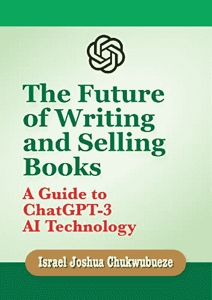

**写作和销售书籍的未来：ChatGPT-3 AI 技术指南**

[`www.amazon.com/gp/product/B0BTWVXFFS`](https://www.amazon.com/gp/product/B0BTWVXFFS)

| 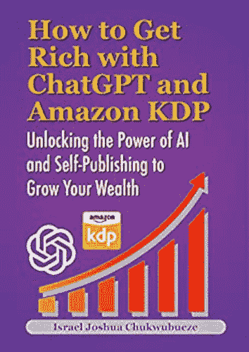

**如何通过 ChatGPT 和 Amazon KDP 致富：解锁 AI 和自助出版的力量来增加财富**

[`www.amazon.com/gp/product/B0C398P8RW`](https://www.amazon.com/gp/product/B0C398P8RW)

|

## 第二十五章：使用 Pinterest 进行影响力营销

在当今数字化的环境中，影响力营销已经成为品牌与目标受众建立联系并推动参与的强大策略。Pinterest 以其视觉启发平台为品牌提供了一个独特的机会，利用影响者的力量推广他们的产品和服务。在本章中，我们将探讨影响力营销的概念，如何在 Pinterest 上进行影响者合作，并提供成功在 Pinterest 上进行影响力营销活动的宝贵建议。准备好利用有影响力的声音，将您的 Pinterest 营销推向新高度。

**什么是影响力营销？**

影响力营销是一种营销策略，专注于利用在特定领域或行业内拥有大量追随者和影响力的个人的影响力和影响力。这些个人被称为影响者，他们已经在他们的受众中建立了信誉和信任，使他们成为寻求扩大影响范围并与目标客户建立联系的品牌宝贵合作伙伴。

**使用 Pinterest 进行影响力营销**

Pinterest 提供了一个独特的平台用于影响力营销，因为它强调视觉内容和忠实的用户群体。

**以下是您如何使用 Pinterest 进行影响力营销：**

> **识别相关的影响者：** 首先要识别与您的品牌或产品领域相符的影响者。寻找在 Pinterest 上拥有大量追随者并创作与您目标受众产生共鸣的内容的影响者。考虑参与率、内容质量和相关性等因素，以确保合作的成功。
> 
> **研究影响者在 Pinterest 上的存在：** 深入了解影响者的 Pinterest 资料，了解他们的内容风格、受众人口统计和参与模式。寻找他们内容的一致性、Pins 的质量以及整体品牌一致性。关注他们创建的各种 Pins、他们策划的画板以及他们从追随者那里获得的参与。
> 
> **与影响者联系：** 一旦您确定了潜在的影响者，用个性化的信息联系他们，表达您对合作的兴趣。强调为什么您相信他们的受众会对您的品牌产生共鸣，并提出互利合作的建议。明确您的期望，无论是创建赞助内容、举办赠品活动还是其他促销活动。
> 
> **定义合作条款：** 与影响者合作，明确合作条款。讨论工作范围、交付内容、补偿以及活动的任何具体指南或要求。确保双方对期望有清晰了解，以避免任何误解。
> 
> **创造引人入胜的活动内容：** 与影响者紧密合作，创建与您品牌信息和影响者风格都相符的引人入胜的活动内容。鼓励影响者利用 Pinterest 的视觉格式创建可激发行动的引人入胜的 Pins，与他们的受众产生共鸣。无论是产品评测、教程还是生活方式内容，确保内容讲述一个连贯的故事，并以真实而引人入胜的方式展示您的品牌。
> 
> **跟踪和衡量成果：** 随着活动的进行，跟踪和衡量您的影响者营销努力的成果。使用 Pinterest 分析工具来监测影响者内容所产生的参与度、印象和点击率。根据预先确定的指标（如网站流量、转化率或品牌知名度）来评估活动的成功程度。

**在 Pinterest 上成功进行影响者营销的提示**

要使您在 Pinterest 上的影响者营销活动成功，考虑以下提示：

> **真实至关重要：** 选择真正与您的品牌价值观和产品相符的影响者。真实性对于与影响者的受众建立信任至关重要。确保影响者的内容与您品牌的身份产生共鸣，以保持真实性和可信度。
> 
> **合作至关重要：** 在活动期间与影响者密切合作。鼓励他们的创造力，并为他们提供必要的资源和信息来创造引人注目的内容。保持沟通渠道畅通，对他们的想法和建议作出响应。
> 
> **利用 Pinterest 的视觉吸引力：** Pinterest 是一个视觉平台，所以要充分利用它。鼓励意见领袖创建引人注目的图钉，以吸引注意力。高质量的图片、引人注目的标题和引人入胜的描述可以在推动参与度方面发挥重要作用。
> 
> **融入行动号召：** 鼓励意见领袖在他们的图钉中包含明确且可操作的行动号召。无论是邀请用户访问您的网站、参加比赛还是购买商品，包含行动号召可以增加转化和可衡量结果的机会。
> 
> **监控和优化：** 持续监控您的意见领袖营销活动的表现。分析意见领袖内容产生的参与度、覆盖范围和转化情况。识别哪些效果良好，并根据这些见解优化未来的活动。
> 
> **建立长期关系：** 考虑与那些持续交付成功活动的意见领袖建立长期关系。与真正与您的品牌和受众建立联系的意见领袖建立关系，因为随着时间的推移，他们可以成为有价值的品牌倡导者。

结论

在 Pinterest 上，意见领袖营销可以是一种非常有效的策略，用于提升品牌知名度、参与度和转化率。通过与与您的品牌价值观相符的意见领袖合作，并利用 Pinterest 的视觉吸引力，您可以利用他们的影响力，并以有意义的方式与目标受众建立联系。记住要培养真实的合作关系，提供清晰的指导方针，并跟踪您的意见领袖营销努力的结果。通过正确的方法和战略合作伙伴关系，在 Pinterest 上进行意见领袖营销可以帮助提升您品牌的存在感，并实现营销目标。

## 第二十六章：利用 Pinterest 为业务服务

Pinterest 不仅是一个灵感和发现平台；它也是企业展示产品、增加流量和提高销售的强大工具。凭借其视觉吸引人的格式和积极参与的用户群体，Pinterest 为企业提供了与目标受众连接和建立品牌知名度的独特机会。在本章中，我们将探讨如何有效利用 Pinterest 为你的业务，提供成功的宝贵建议，并突出成功的 Pinterest 企业账户的示例。准备好为你的业务释放 Pinterest 的全部潜力。

**如何为你的业务使用 Pinterest**

Pinterest 提供了一系列功能和策略，可以帮助企业实现其营销目标。

**以下是如何有效利用 Pinterest 为你的业务的方法：**

> **创建企业账户：** 首先在 Pinterest 上创建一个企业账户。这将为你提供诸如 Pinterest Analytics、Promoted Pins 等有价值的功能。设置你的个人资料，提供关于你业务的相关信息，并选择代表你品牌的个人资料图片。
> 
> **明确你的目标受众：** 清晰地定义你的目标受众，并了解他们的兴趣、偏好和行为。这将帮助你调整你的内容和策略，与 Pinterest 上的受众产生共鸣。
> 
> **优化你的个人资料：** 优化你的 Pinterest 个人资料以吸引你的目标受众。在个人资料描述和板块名称中使用关键词，以提高在搜索结果中的可见性。包括指向你的网站或落地页的链接以增加流量。
> 
> **创建灵感板块：** 创建与你的业务相关并吸引你目标受众兴趣的板块。精心挑选高质量的 Pin，展示你的产品，激发创造力，并提供有价值的信息。合理组织你的板块，使用户能够轻松导航并找到相关内容。
> 
> **创建引人注目的 Pin：** 设计视觉吸引人的 Pin，吸引用户在浏览他们的动态时注意到。使用高质量的图片，引人注目的标题和吸引人的描述来吸引用户点击你的 Pin。将你品牌的美学和信息融入到你的 Pin 中，以建立品牌认知度。
> 
> **优化搜索：** 利用 Pinterest SEO 技术来提高你的 Pin 的可发现性。进行关键词研究，并在 Pin 描述、标题和板块名称中加入相关关键词。这将增加你的 Pin 出现在搜索结果中的可能性。
> 
> **参与 Pinterest 社区：** 通过与其他用户互动，积极参与 Pinterest 社区。关注相关账号，点赞和评论别人的 Pin，加入你所在行业的群组板块。这将帮助你建立关系，增加曝光度，并吸引更多的关注者。
> 
> **利用丰富采集物：** 充分利用 Pinterest 的丰富采集物功能，为你的采集物提供额外的信息和背景。丰富采集物可以包括产品价格、可用性和成分等细节，使它对用户更有价值，并增加转化的机会。
> 
> **推广你的采集物：** 考虑使用 Pinterest 的推广采集物功能，来扩大你内容的影响力。推广采集物允许你针对特定人口统计、兴趣和关键词，确保你的采集物能够触达正确的受众。设定预算，并根据表现数据优化你的活动，以最大化效果。
> 
> **分析你的表现：** 定期分析你的 Pinterest 分析数据，以了解你的采集物的表现、受众人群、以及参与度指标。利用这些数据来完善你的策略，识别受欢迎的采集物，并更好地了解你的受众。

**成功使用 Pinterest 进行业务的建议**

要充分利用 Pinterest 进行业务的话，考虑以下建议：

> **了解 Pinterest 的人口统计：** Pinterest 的用户群体以女性为主，主要关注生活方式、时尚、家居装饰和 DIY 内容。调整你的内容以与这一受众产生共鸣，并考虑相应地调整你的产品和信息传达。
> 
> **创建垂直采集物：** Pinterest 的垂直格式（2:3 的长宽比）对于最佳的可见度和参与度效果最好。创建垂直方向的采集物，以充分利用可用的空间，突显在用户的动态中。
> 
> **整合丰富产品采集物：** 如果你销售产品，利用 Pinterest 的丰富产品采集物来展示最新的价格、可用性和直接购买链接。这一功能增强了用户体验，让潜在客户更容易进行购买。
> 
> **讲述一个故事：** 使用你的采集物来讲述有关你品牌和产品的引人入胜的故事。分享你创作背后的灵感，突出客户的见证，或展示你产品的多功能性和独特特点。强调你的产品给用户生活带来的价值和好处。
> 
> **与意见领袖合作：** 与你所在行业的意见领袖或内容创作者合作，以触达更广泛的受众，并利用他们的追随者的信任和影响力。合作可以采取赞助内容、产品植入或联合活动等形式，视你的业务目标而定。
> 
> **将 Pinterest 与你的网站整合：** 通过在你的网站或博客上添加 Pinterest 按钮或小部件，让用户方便地保存和分享你的内容。这鼓励用户参与你的采集物，并增加你的内容在平台上被分享的可能性。

**成功的 Pinterest 业务账户的例子**

让我们来看一些成功的 Pinterest 业务账户的例子，以激发你自己的策略：

> **家居装饰零售商：** 一家家居装饰零售商有效地利用 Pinterest 展示其产品。他们创建了专门展示不同房间风格的画板，如“舒适客厅”和“现代厨房创意”。每个画板都展示了视觉上令人惊叹的 Pin，激发用户灵感，并直接链接到他们网站上的产品页面。
> 
> **美妆品牌：** 一家美妆品牌精心策划了化妆教程、美容技巧和产品推荐的画板。他们与意见领袖合作，创作引人入胜且信息丰富的内容。他们的 Pin 包括前后对比、分步教程和用户生成内容，使他们的账户成为美妆爱好者的首选资源。
> 
> **食品和食谱网站：** 一家食品和食谱网站分享他们美味食谱的令人垂涎的 Pin。他们根据不同的烹饪类型、饮食偏好和特殊场合组织他们的画板。每个 Pin 都包括引人注目的图片、简洁的描述和链接到他们网站上完整食谱的链接。
> 
> **时尚零售商：** 一家时尚零售商创建了展示最新时尚趋势、搭配技巧和服装灵感的画板。他们与时尚博主和意见领袖合作，创作时尚指南和风格指南。他们的 Pin 展示了令人惊叹的服装、配饰和时尚灵感，推动流量到他们网站进行购买。

结论

Pinterest 为企业提供了与目标受众联系、增加网站流量和提高销售的不可思议机会。通过利用 Pinterest 独特的功能，优化内容以便搜索，并与 Pinterest 社区互动，您可以成功地利用 Pinterest 来推动您的业务。记得要分析您的表现，尝试不同的策略，并随时了解最新趋势，以保持领先地位。从成功的 Pinterest 商业账户中汲取灵感，但也要在您的 Pinterest 展示中加入独特的元素以脱颖而出。立即利用 Pinterest 的力量，释放您的业务的全部潜力。

## 第二十七章：Pinterest 趋势

在快节奏的数字营销世界中，保持领先至关重要。跟上最新趋势和消费者兴趣，使企业能够创造与目标受众共鸣的相关且引人入胜的内容。Pinterest 凭借其庞大的用户群和丰富的视觉灵感，为新兴趋势提供了宝贵的见解。在本章中，我们将探讨 Pinterest 趋势的概念，如何利用它们来指导您的内容策略，并提供保持最新 Pinterest 趋势的技巧。让我们深入探讨，发现 Pinterest 趋势如何帮助推动您的营销工作。

**Pinterest 趋势是什么？**

Pinterest 的趋势是指目前在 Pinterest 用户中流行的话题、主题和想法。这些趋势是基于平台上数百万用户的搜索行为和参与模式。Pinterest 通过分析这些数据来识别新兴趋势，并提供用户正在积极搜索和保存的内容的见解。

Pinterest 的趋势可以涵盖广泛的类别，包括时尚、美容、家居装饰、美食、旅行等。它们可以围绕季节性事件、节日、文化时刻或新兴的生活方式偏好。通过利用 Pinterest 的趋势，企业可以抓住他们目标受众的兴趣和愿望，并创造与他们共鸣的内容。

**如何使用 Pinterest 的趋势来指导你的内容**

使用 Pinterest 的趋势来指导你的内容策略可以带来多个好处，包括：

> **内容相关性：** 通过将热门话题和主题融入你的内容中，确保你的品牌保持相关性，并与目标受众当前的兴趣保持一致。这有助于吸引他们的注意，并增加参与的可能性。
> 
> **增加曝光度：** 围绕热门话题创建内容可以增加你的 Pin 出现在相关搜索结果和类别动态中的机会。这会让你的品牌暴露在更广泛的受众面前，潜在地吸引新关注者并将流量引向你的网站。
> 
> **激发创造力的灵感：** Pinterest 的趋势可以激发你的创造力，为你的内容带来新的灵感。它们提供了对用户共鸣的视觉美学、风格和偏好的洞察，让你可以创造视觉吸引力和引人注意的 Pin。

**以下是你可以如何使用 Pinterest 的趋势来指导你的内容策略：**

> **探索 Pinterest 的热门话题：** 访问 Pinterest 趋势页面，这个页面提供了平台上热门话题的概览。你可以通过地点、时间范围和类别来过滤趋势，缩小结果并找到对你的受众最相关的趋势。
> 
> **分析热门 Pin：** 仔细观察与你的行业或利基相关的热门 Pin。注意这些 Pin 中所使用的视觉元素、关键词和描述。分析它们的特点将有助于你了解使它们受欢迎的原因，并让你能够将类似的元素融入到你自己的内容中。
> 
> **识别相关主题：** 寻找热门话题之间的共同主题或模式。是否有任何新兴的偏好、风格或生活方式选择与你的品牌相一致？识别与你的目标受众 resonates 的主题，并构思将它们融入你的内容的方式。
> 
> **创建基于趋势的画板：** 根据流行的话题或主题创建新的 Pinterest 画板。收集一组符合这些趋势的 Pins，并展示你品牌对热门话题的观点。这展示了你品牌的相关性，并将你定位为行业内的思想领袖。
> 
> **定制你的内容：** 调整你的内容以融入流行的话题和主题。例如，如果可持续生活是一个流行的话题，创建突出环保产品或分享过更可持续生活的建议的 Pins。这样，你可以利用你受众的兴趣来推广你的品牌。

**保持与 Pinterest 趋势同步的建议**

要及时了解 Pinterest 的最新趋势，考虑以下建议：

> **关注 Pinterest 的官方频道：** 关注 Pinterest 的官方账号，如 Pinterest News，获取关于最新趋势、功能发布和最佳实践的更新。这些频道通常提供有价值的见解和有效利用趋势的建议。
> 
> **监控 Pinterest 分类动态：** 定期浏览与你所在行业或利基相关的分类动态。关注受欢迎的 Pins 并分析使它们成功的共同特征。
> 
> **与 Pinterest 社区互动：** 通过评论 Pins、加入群组画板和参与相关社区与 Pinterest 上的其他用户互动。这可以让你与这个充满活力的社区保持联系，并获得关于他们兴趣和偏好的见解。
> 
> **使用 Pinterest Analytics：** 利用 Pinterest Analytics 监控你的 Pins 和画板的表现。分析参与度指标，如保存、点击和近距离查看，以确定与你受众最相关的趋势和话题。
> 
> **保持行业新闻的最新信息：** 了解可能对 Pinterest 产生影响的行业新闻、事件和新兴趋势。订阅相关博客、在社交媒体上关注行业领袖，并加入在线社区以及时获取信息。

结论

Pinterest 趋势为平台用户的兴趣、偏好和愿望提供了有价值的见解。通过利用这些趋势，企业可以创造与他们目标受众相关、引人入胜并引起共鸣的内容。将流行话题和主题融入到你的内容策略中可以增加可见性、推动流量，并将你品牌定位为行业内的思想领袖。通过掌握 Pinterest 趋势，你可以走在竞争对手前面，创造迷人的内容吸引你的受众。

## 第二十八章：个人使用的 Pinterest

Pinterest 不仅是一种强大的企业和品牌平台，也是一种多功能的个人使用工具。无论你是在策划婚礼，探索新菜谱，还是寻找家居装饰灵感，Pinterest 都提供了丰富的想法和创意资源来满足你个人兴趣。在本章中，我们将探讨如何使用 Pinterest 进行个人使用，提供精选个人 Pinterest 画板的建议，并展示成功的个人 Pinterest 账户的示例。让我们一起深入探索 Pinterest 为个人丰富的可能性。

**如何使用 Pinterest 进行个人使用**

Pinterest 不仅是一种有助于企业和品牌组织、策划和探索符合你个人兴趣的想法的有价值工具。

**以下是如何充分利用 Pinterest 进行个人使用的方法：**

> **创建 Pinterest 账户：**如果你还没有，请创建一个 Pinterest 账户开始使用。你可以使用你的电子邮件地址或 Facebook 或 Google 等社交媒体账户进行注册。通过添加个人资料图片、简介和其他相关信息来定制你的个人资料。
> 
> **定义你的兴趣：**确定你想通过 Pinterest 探索或改进的生活领域。它可以是从时尚和美容到家居装饰、DIY 项目、旅行目的地或健身灵感的任何事物。了解你的兴趣将帮助你策划画板并找到相关的内容。
> 
> **开始策划画板：**根据你的兴趣创建画板，并开始收藏与你 resonate 的内容。例如，如果你对家居装饰感兴趣，可以创建极简风格、波西米亚风格或斯堪的纳维亚风格的画板。当你遇到启发性的标签时，将它们保存到相应的画板中。
> 
> **探索和发现：**Pinterest 是一个灵感宝库。使用搜索栏探索特定主题或浏览主页来发现新的想法。关注符合你兴趣的账户或画板，打造个性化的订阅。
> 
> **组织你的标签：**通过将它们分类到相关的画板中，保持你的标签有组织性。你可以为个人项目或想保密的想法创建秘密画板。以对你有意义的方式整理你的画板，这样就能轻松找到并重温你最喜欢的标签。
> 
> **参与社区：**Pinterest 不仅仅是保存和组织内容；它也是与志同道合的人联系的地方。通过点赞、评论和保存他人的标签来参与其他用户。关注那些激励你的账户，并参与群画板，分享你自己的想法。

**精选个人 Pinterest 画板的建议**

精选个人 Pinterest 画板让你能够建立与你兴趣相关的想法、灵感和资源的收藏。

**以下是精选你个人 Pinterest 画板的一些建议：**

> **具体化：** 不要创建过于宽泛的画板主题，要用你的画板主题来具体化。例如，如果你热爱烹饪，可以为开胃菜、主菜、甜点或特定的烹饪风格创建单独的画板。这有助于你组织你的图钉并快速找到灵感。
> 
> **编辑和优化：** 定期审查你的画板，并移除那些不再与你共鸣或符合你兴趣的图钉。编辑和优化你的画板将确保它们保持相关，并反映出你不断发展的品味和偏好。
> 
> **增添个人风采：** 通过在你的画板上添加个人评论或标题来将你的个性融入其中。分享为什么一个特定的钉子与你共鸣，或者你将如何将一个想法融入你的生活。这种个人风格为你的画板增添了深度和真实性。
> 
> **混搭：** 不要害怕在你的画板上混搭不同类型的内容。你可以保存图片、文章、视频，甚至创建你自己的图钉。混搭不同格式和类型的内容可以让你的画板更加多样化和有吸引力。
> 
> **与他人合作：** 通过创建群画板与朋友或家人合作。群画板允许多人向共享画板添加图钉，营造了一个分享思想和灵感的协作空间。

**成功个人 Pinterest 账户的例子**

Pinterest 上有许多个人成功打造个人账户，展示他们的热情和兴趣。以下是一些成功个人 Pinterest 账户的例子：

> **简的婚礼奇迹：** 简已创建了一个致力于婚礼策划的 Pinterest 账户。她的画板展示了令人惊叹的婚纱、创意的装饰想法和独特的婚礼主题。拥有数千名追随者，简的账户已经成为订婚夫妇寻找婚礼灵感的首选资源。
> 
> **美食冒险：** 马克的 Pinterest 账户是美食爱好者的天堂。他的画板充满了让人垂涎欲滴的食谱、餐厅推荐和美食摄影。马克对美食的热情通过他精心策划的画板得以彰显，吸引了众多美食爱好者的关注。
> 
> **热爱旅行的梦想家：** 莎拉的 Pinterest 账户是她对旅行的热爱的明证。从异国情调的目的地和旅行贴士到收拾指南和非常规冒险，她的画板激发了她的追随者的旅行热情。莎拉的账户已经成为了一个可信赖的旅行灵感和计划的来源。
> 
> **创意角落：** 大卫的 Pinterest 账户是 DIY 爱好者的天堂。他的画板展示了创新的手工项目，再利用的想法和逐步教程。大卫的账户已经吸引了一群忠实的创意人士，他们欣赏他独特而富有想象力的想法。

结论

Pinterest 为个人提供了一个令人难以置信的平台，让个人探索他们的兴趣，收集想法，并与志同道合的人联系。通过创建个性化的板块，策划内容，并与 Pinterest 社区互动，你可以充分利用这个视觉发现平台。使用提供的技巧有效地策划你的个人 Pinterest 板块，并找到与你兴趣相关的灵感。探索成功的个人 Pinterest 账户以获取灵感，并创建一个反映你的激情和愿望的 Pinterest 体验。拥抱 Pinterest 的力量，为个人使用解锁一个充满灵感和创造力的世界。

## 第二十九章：非营利组织的 Pinterest

Pinterest 不仅仅是一个供商业和个人使用的平台；它也可以成为非营利组织提高意识、吸引支持者和推广事业的强大工具。凭借其视觉吸引力的格式和庞大的用户群，Pinterest 为非营利组织展示他们的使命、影响和倡议提供了独特的机会。在本章中，我们将探讨非营利组织如何使用 Pinterest，提供使用 Pinterest 推广非营利组织的技巧，并展示成功的非营利组织 Pinterest 账户的示例。让我们深入探索 Pinterest 对非营利组织的世界，发现它为增强社会影响力所具有的潜力。

**非营利组织如何使用 Pinterest**

Pinterest 为非营利组织提供了一个平台，以视觉方式传达他们的使命，分享故事，并与观众互动。

**以下是非营利组织有效使用 Pinterest 的一些方法：**

> **创建激励板块：** 非营利组织可以创建展示他们工作、影响和支持的事业的板块。例如，一个野生动物保护组织可以有专门致力于不同濒危物种、它们的栖息地和保护工作的板块。使用引人注目的视觉效果吸引用户的注意，并激励他们了解更多关于这个事业的信息。
> 
> **通过图片讲述故事：** 利用叙事的力量与你的观众建立情感联系。分享成功故事、证词和突出你组织工作影响的叙述。每个图片可以是一个受益于你的非营利组织倡议的人或社区的快照。
> 
> **分享教育内容：** 使用 Pinterest 作为一个平台，教育和提高人们对你的非营利组织所关注问题的意识。创建板块，提供与你的事业相关的提示、指南和信息内容。例如，一个专注于心理健康的组织可以有板块，提供自我护理、应对机制和心理健康意识的资源。
> 
> **与影响者和支持者合作：** 吸引影响者和支持者创建合作画板，促进您非营利组织事业的推广。拥有大量粉丝的影响者可以帮助放大您的信息并吸引新的支持者。合作画板也能够培养观众之间的社区意识和共同兴趣。
> 
> **筹款和活动推广：** 利用 Pinterest 推广筹款活动和倡议。创建专门用于即将到来的活动、筹款活动或特定倡议的画板，提供所有必要的细节，并鼓励用户参与或捐款。

**利用 Pinterest 推广非营利组织的技巧**

要在 Pinterest 上有效推广非营利组织，请考虑以下建议：

> **优化图钉描述：** 为您的图钉撰写引人注目的描述，不仅吸引注意，还提供上下文并传达每个图钉的目的。使用相关关键词和标签以提高可发现性。
> 
> **与 Pinterest 社区互动：** 通过喜欢、评论和转发与您非营利组织使命一致的其他用户的内容来与用户互动。进行有意义的对话，并与您的观众建立联系，培养社区意识。
> 
> **利用丰富的图钉：** 充分利用 Pinterest 的丰富图钉功能，可以在图钉上直接提供额外信息，如文章标题、产品详细信息或活动信息。丰富的图钉增强了用户体验，并提供了关于非营利组织倡议的更多上下文。
> 
> **创建可共享的内容：** 设计视觉吸引人且可共享的图钉，与您的观众产生共鸣。使用高质量的图片、信息图表或视频，有效传达您的信息。让用户能够轻松在不同社交媒体平台上分享您的图钉。
> 
> **融入行动号召：** 在图钉描述或图钉图片本身中包含行动号召，鼓励用户采取行动。例如，您可以要求用户捐款、志愿参与、签署请愿书或与他们的网络分享您的图钉。

**成功的非营利组织 Pinterest 账户示例**

让我们探索一些有效利用 Pinterest 推广他们事业的非营利组织的例子：

> **慈善机构：** 慈善水（[`www.pinterest.com/charitywater/`](https://www.pinterest.com/charitywater/)）：慈善水是一家致力于为发展中国家人民带来干净安全饮用水的非营利组织。他们的 Pinterest 账户展示了强大的视觉效果、成功故事，以及突出他们服务的社区、有关水的事实和 DIY 筹款理念的画板。
> 
> **世界自然基金会** ( [`www.pinterest.com/world_wildlife/`](https://www.pinterest.com/world_wildlife/) ): 世界自然基金会（WWF）是一家国际性的保护组织，致力于保护濒危物种和生态系统。他们的 Pinterest 账号展示了令人惊叹的野生动物摄影作品、关于保护的教育内容、可持续生活建议，以及专门致力于特定物种和栖息地的画板。
> 
> **Feeding America** ( [`www.pinterest.com/feedingamerica/`](https://www.pinterest.com/feedingamerica/) ): [美国饥饿救援组织](https://www.pinterest.com/feedingamerica/)是一家非营利组织，致力于与饥饿作斗争，并为有需要的个人和家庭提供食物。他们的 Pinterest 账号展示了提供食谱、餐饮规划理念、减少食物浪费的建议和志愿者机会的画板。他们还与影响者和支持者合作，创建专注于解决与饥饿相关问题的协作画板。
> 
> **铅笔的承诺** ( [`www.pinterest.com/pencilsofpromise/`](https://www.pinterest.com/pencilsofpromise/) ): 铅笔的承诺是一家非营利组织，致力于在贫困社区为儿童建立学校并提供教育资源。他们的 Pinterest 账号展示了他们的项目、学生成功故事、筹款活动，以及专门致力于教育相关主题如识字、教师资源和课堂灵感的画板。

结论

Pinterest 为非营利组织提供了一个独特的平台，可以分享他们的使命，与支持者互动，并提高人们对他们事业的认识。通过创建激励人心的画板，通过 Pins 讲述故事，并利用视觉的力量，非营利组织可以有效传达他们的信息，并与受众建立更深层次的联系。采用本章提供的建议，充分利用 Pinterest 的功能，并真诚地与 Pinterest 社区互动。探索成功的非营利组织 Pinterest 账号，获得灵感，并根据组织的目标和目标受众调整 Pinterest 策略。拥抱 Pinterest 的潜力，推广您的非营利组织，并在世界上留下持久的影响。

**如果您购买/下载了我的书，并发现它有趣，我会很高兴；如果您能为这本书留下一个好评，这将帮助其他潜在读者表现出兴趣。**

只需 30 秒，将不胜感激。

**点击这里** [**留下评论！**](https://www.amazon.com/dp/B0BY318HFF)

预先感谢您，我爱你，你是最棒的。

## 第三十章：结论

恭喜您达到本书的最后一章！在这段旅程中，我们探讨了利用 Pinterest 和 ChatGPT 在线赚钱的不可思议潜力。在这个结论性章节中，让我们回顾我们所涵盖的关键点，思考前方的可能性，并概述行动步骤，帮助您开始 Pinterest 和 ChatGPT 之旅。

**关键点回顾**

> **Pinterest:** 我们首先介绍了 Pinterest 作为一个拥有庞大用户群的强大视觉发现平台。我们讨论了创建引人注目的 Pinterest 个人资料、为搜索优化您的 Pin 以及利用各种功能如画板、群画板、标签和分析的重要性。
> 
> **ChatGPT:** 我们随后探讨了 ChatGPT 平台以及如何将其用作生成想法、创建内容和增强您的 Pinterest 策略的有价值工具。我们学习了如何使用 ChatGPT-3 Playground 生成每周的 Pin 点子，设计横幅 Pin，创建 Pin 内容，并获取内容优化的见解。
> 
> **盈利机会:** 我们深入探讨了利用您的 Pinterest 存在赚钱的各种方式，包括联盟营销、销售产品、赞助内容、电子商务和影响者营销。我们强调了提供价值、与受众建立信任以及利用 Pinterest 的功能来推动转化和收入的重要性。
> 
> **Pinterest 最佳实践:** 在各章节中，我们分享了许多有关创建引人注目的 Pin、为搜索优化您的 Pinterest 页面、增长您的受众以及通过 Pinterest 分析来分析表现的技巧和最佳实践。这些策略对于最大化您在平台上的影响力、参与度以及最终成功至关重要。

**关于使用 Pinterest 和 ChatGPT 赚取在线收入的最终想法**

Pinterest 和 ChatGPT 的融合为您提供了一个强大的机会，释放您的创造力，与目标受众建立联系，并在线赚取收入。通过利用 Pinterest 的视觉吸引力和 ChatGPT 的创新能力，您可以创建引人注目的内容，建立忠实的追随者，并在您的领域确立自己的权威地位。

然而，重要的是要记住成功不会一蹴而就。在 Pinterest 上建立一个有利可图的存在需要奉献、一贯性以及对受众需求和偏好的深刻理解。同样，有效利用 ChatGPT 作为内容生成工具需要练习和完善，以在人类创造力和 AI 辅助之间找到平衡。

**在 Pinterest 和 ChatGPT 上入门的行动步骤**

现在您已经对 Pinterest 和 ChatGPT 有了扎实的了解，以下是一些行动步骤，帮助您踏上旅程：

> **定义您的领域:** 确定一个与您的兴趣、专业知识和潜在盈利机会相符的特定领域或主题。这将帮助您建立您独特的价值主张，并吸引一个有针对性的受众。
> 
> **创建您的 Pinterest 账户:** 按照第二章中概述的步骤设置您的 Pinterest 账户。优化您的个人资料，选择一个相关的用户名，并撰写一个引人注目的简介，展示您的专业知识以及用户可以从您的 Pinterest 存在中期待的内容。
> 
> **生成内容创意：** 利用第五章中描述的 ChatGPT-3 Playground，每周生成钉子创意并进行内容概念的头脑风暴。尝试不同的提示，并完善你的方法，以符合你的利基和受众偏好。
> 
> **设计引人注目的钉子：** 应用第四章的技巧，创建视觉上引人注目的钉子，吸引用户的注意。尝试不同的格式、图片和描述，优化参与度和点击率。
> 
> **优化搜索：** 实施第二十三章中讨论的 Pinterest SEO 技术，提高你的钉子的可发现性，并增加你个人资料的有机流量。使用相关关键词、标签和引人注目的描述来增强你的搜索排名。
> 
> **与 Pinterest 社区互动：** 积极参与 Pinterest 社区，关注相关用户，参与他们的内容，并加入群板。与其他 Pinterest 用户合作（如第二十章所述），扩大你的影响力并吸引新的受众。
> 
> **分析和完善：** 定期检查你的 Pinterest 分析，如第二十二章所述，以获得关于你的钉子表现、受众人口统计信息和参与度指标的见解。利用这些数据完善你的内容策略，并做出数据驱动的决策。
> 
> **探索变现机会：** 研究不同的变现途径，例如联盟营销、产品销售、赞助内容、电子商务和影响者营销，如第 11 至 26 章所述。确定哪些策略最符合你的利基和受众，以最大化你的收益潜力。
> 
> **跟随 Pinterest 趋势进化：** 保持与最新的 Pinterest 趋势保持同步，如第二十七章所述，以指导你的内容创作，并确保你的钉子始终与你的受众相关和吸引人。
> 
> **保持一致并适应：** 保持一致对于在 Pinterest 上建立成功的存在至关重要。不断创建和分享高质量内容，与你的受众互动，并根据用户反馈和平台更新调整你的策略。

记住，在 Pinterest 和 ChatGPT 上通过网赚需要坚韧不拔、适应能力和对为受众提供价值的热情。拥抱旅程，从经验中学习，并始终努力改善。

当你踏上你的 Pinterest 和 ChatGPT 的冒险之旅时，不要忘记沿途庆祝你的成功。每个 Pin、每个互动和每个里程碑的实现都让你离目标更近。享受过程，拥抱可能性，让你的创造力闪耀，留下你在数字世界上的印记。

在你的 Pinterest 和 ChatGPT 之旅中祝你一切顺利！愿你的努力有成果，你的参与有意义，你的在线成功能够反映出你的激情和奉献精神。

> *推荐阅读书籍清单：*

**查看我的所有书籍**

[`www.amazon.com/stores/author/B0BHF5T1V7/allbooks`](https://www.amazon.com/stores/author/B0BHF5T1V7/allbooks)

**《面向作家和作者的 ChatGPT 书籍》**

《亚马逊自助出版入门：逐步初学者指南》

[`www.amazon.com/dp/B0C381DGXK`](https://www.amazon.com/dp/B0C381DGXK)

《ChatGPT 秘密武器：24 小时内开始写作和销售书籍的 5 个步骤》

[`amazon.com/dp/B0BV6TQL55`](https://amazon.com/dp/B0BV6TQL55)

《写作和销售书籍的未来：ChatGPT-3 AI 技术指南》

[`www.amazon.com/dp/B0BTWVXFFS`](https://www.amazon.com/dp/B0BTWVXFFS)

如何用 ChatGPT 和亚马逊 KDP 获取财富：解锁 AI 和自助出版的力量，增长财富

[`www.amazon.com/gp/product/B0C398P8RW`](https://www.amazon.com/gp/product/B0C398P8RW)

ChatGPT 的 2000+ 低内容书籍创意：设计、市场策略和快速销售的成熟策略

[`amazon.com/dp/B0BYXVQY7Q`](https://amazon.com/dp/B0BYXVQY7Q)

ChatGPT 和 365 天创意低内容书籍创意：每月 1 年的低内容书籍创意

[`www.amazon.com/gp/product/B0C2NXGVZ8`](https://www.amazon.com/gp/product/B0C2NXGVZ8)

《释放亚马逊 Kindle 的力量：如何出售你的前 1000 本书并获得评论，轻松赚取每月 1 千至 2 万美元-ChatGPT》

[`www.amazon.com/dp/B0BX6K1TJN`](https://www.amazon.com/dp/B0BX6K1TJN)

**《1 亿美元创意书籍》**

打造 1 亿美元帝国：知识产权的力量：利用专利，版权和商标

[`www.amazon.com/gp/product/B0C4LH5L1L`](https://www.amazon.com/gp/product/B0C4LH5L1L)

从副业到 1 亿美元：保留日常工作的成功创业指南

[`www.amazon.com/dp/B0C4PWPWFS`](https://www.amazon.com/dp/B0C4PWPWFS)

**《自由职业书籍》**

利用 ChatGPT 为 Fiverr 和 Upwork 创造 30 个自由职业工作的秘密武器，立即开始为客户生成创意和内容

[`www.amazon.com/dp/B0C42JXBRC`](https://www.amazon.com/dp/B0C42JXBRC)

**《GumRoad 和社交媒体营销书籍》**

《GumRoad 掌握自助出版：提高销量，建立书籍受众终极指南》

[`www.amazon.com/dp/B0C1QWZL5B`](https://www.amazon.com/dp/B0C1QWZL5B)

ChatGPT、YouTube 和 GumRoad：初学者指南，实现货币化，建立忠实受众和销售产品

[`www.amazon.com/dp/B0C1ZXDGS2`](https://www.amazon.com/dp/B0C1ZXDGS2)

ChatGPT、Instagram 和 GumRoad：初学者指南，实现货币化，建立忠实受众和销售产品

[`www.amazon.com/dp/B0C1ZX1JX5`](https://www.amazon.com/dp/B0C1ZX1JX5)

ChatGPT、Facebook 和 GumRoad：初学者指南，实现货币化，建立忠实受众和销售产品

[`www.amazon.com/dp/B0C1MC4JBH`](https://www.amazon.com/dp/B0C1MC4JBH)

ChatGPT、Twitter 和 GumRoad：初学者指南，实现货币化，建立忠实受众和销售产品

[`www.amazon.com/dp/B0C1LQ27H1`](https://www.amazon.com/dp/B0C1LQ27H1)

**AI 视频创作者书籍**

开始使用 Pictory AI 视频创作：初学者食谱

[`amazon.com/dp/B0BYB6QFY1`](https://amazon.com/dp/B0BYB6QFY1)

**应用创意和开发书籍**

未来的应用创意；下一个大事件：终极数千种应用创意手册

[`www.amazon.com/dp/B0BT8NKYNQ`](https://www.amazon.com/dp/B0BT8NKYNQ)

**社交媒体书籍**

ChatGPT + YouTube 频道或房地产：如何通过您的 YouTube 频道和 ChatGPT 每月赚取$10,000-$50,000

[`amazon.com/dp/B0BVCQBBXY`](https://amazon.com/dp/B0BVCQBBXY)

仍然认为 TikTok 只是孩子们的东西吗？：由 ChatGPT 创建的短视频内容现在正蓬勃发展！

[`amazon.com/dp/B0BWQZ92BH`](https://amazon.com/dp/B0BWQZ92BH)

**ChatGPT 百万富翁书籍**

ChatGPT 百万富翁的创意：230+种使用 ChatGPT 和其他隐藏秘密信息的方法

[`www.amazon.com/dp/B0BW85S76R`](https://www.amazon.com/dp/B0BW85S76R)

从零到百万在线：ChatGPT + Facebook：在社交媒体上赚取百万美元-逐步指南，如何在线赚钱

[`www.amazon.com/gp/product/B0BXYBWJW8`](https://www.amazon.com/gp/product/B0BXYBWJW8)

从零到百万在线：ChatGPT + Instagram：在社交媒体上赚取百万美元-逐步指南，如何在线赚钱

[`www.amazon.com/gp/product/B0BY2XXL3J`](https://www.amazon.com/gp/product/B0BY2XXL3J)

从零到百万在线：ChatGPT + LinkedIn：在社交媒体上赚取百万美元-逐步指南，如何在线赚钱

[`www.amazon.com/gp/product/B0BY318HFF`](https://www.amazon.com/gp/product/B0BY318HFF)

从零到百万在线与 ChatGPT：50+种通过博客、电子商务、联盟营销、YouTube、TikTok、Twitter 赚钱的方法

[`www.amazon.com/dp/B0BY57NJ1F`](https://www.amazon.com/dp/B0BY57NJ1F)

从零到百万在线：ChatGPT +博客：在 24 小时内建立您自己的（WordPress）网站-逐步指南，如何在线赚钱

[`www.amazon.com/gp/product/B0BXY9W6P8`](https://www.amazon.com/gp/product/B0BXY9W6P8)

从零到百万在线：ChatGPT +电子商务：创建和设置您自己的在线商店：生成产品描述、SEO 排名、在线赚钱

[`www.amazon.com/gp/product/B0BXY6NX3J`](https://www.amazon.com/gp/product/B0BXY6NX3J)

从零到百万在线：ChatGPT + Twitter：在社交媒体上赚取百万美元-逐步指南，如何在线赚钱

[`www.amazon.com/gp/product/B0BY32MW8J`](https://www.amazon.com/gp/product/B0BY32MW8J)

**个人发展、成功和财务心态书籍**

财富创造的四大支柱

[`www.amazon.com/dp/B0BKYH7ZTG`](https://www.amazon.com/dp/B0BKYH7ZTG)

背诵之后；我是百万富翁：百万富翁的秘密

[`www.amazon.com/dp/B0BNLXGYYV`](https://www.amazon.com/dp/B0BNLXGYYV)

财务规划心态：创造、管理和投资——财务自由的初学者指南

[`www.amazon.com/dp/B0BWLWXD3S`](https://www.amazon.com/dp/B0BWLWXD3S)

时间管理图书

计划的力量：通过战略行动实现目标

[`www.amazon.com/dp/B0BTGT58F2`](https://www.amazon.com/dp/B0BTGT58F2)

**征服分心：掌握成功的时间管理**

[`www.amazon.com/dp/B0BTGT7MHB`](https://www.amazon.com/dp/B0BTGT7MHB)

**笔记本和日记**

2023 年度月度周度计划：适用于男性、女性和忙碌的企业家设定月度和周度目标，待办事项清单和笔记

[`www.amazon.com/dp/B0BW2JL4GM`](https://www.amazon.com/dp/B0BW2JL4GM)

空白 12 个月日历，年度、月度和周度计划，适用于男性和女性，月度和周度目标，待办事项清单和笔记

[`www.amazon.com/dp/B0BR9J8QXW`](https://www.amazon.com/dp/B0BR9J8QXW)
