# 为所有互联网市场营销者设计的 1000 个 ChatGPT 提示词

> 原文：[1000+ ChatGPT Prompts Designed for all Internet Marketers](https://annas-archive.gl/md5/ff14c7ea33298dd9f74198a8ed430cc5)
> 
> 译者：[飞龙](https://github.com/wizardforcel)
> 
> 协议：[CC BY-NC-SA 4.0](https://creativecommons.org/licenses/by-nc-sa/4.0/)

## 1. ChatGPT 简介

### 如何掌握 ChatGPT

• 掌握 ChatGPT，就像营销中的所有事情一样，归结于测试。

• 你花了多少时间才在文案写作、Facebook 广告、SEO 或任何你精通的技艺上变得擅长？同样，ChatGPT 是一个革命性的工具，需要承诺和测试才能获得它所能提供的变革性结果。

• 然而，这不必花费很长时间。使用这些技巧（以及《营销者圣经》中的提示），真正加速你在 ChatGPT 上的学习曲线：

• 熟悉平台：首先探索 ChatGPT 及其功能。了解平台的工作方式，它能做什么，以及它能如何帮助你开展业务。

• 定义你的目标：确定你希望通过 ChatGPT 实现什么。你是想为新产品或服务生成想法吗？你想改进你的营销文案吗？你需要客户服务方面的帮助吗？明确你的目标将帮助你集中精力，并从平台中获得最大收益。

• 练习生成响应：花时间使用不同的提示和输入生成响应。你练习得越多，你将越擅长制作有效的提示并获得最相关的响应。

• 精炼你的提示：在你生成响应时，仔细分析它们并寻找改进的领域。利用这些信息来精炼你的提示，并在一段时间内获得更好的结果。

改进。利用这些信息来精炼你的提示，并在一段时间内获得更好的结果。

• 从错误中学习：记住，ChatGPT 并不完美，可能会生成不相关或不合逻辑的响应。利用这些错误作为学习机会，改进你的提示并获得更准确的结果。

• 将 ChatGPT 作为工具，而不是替代品：记住，ChatGPT 是一个补充你自身知识和专长的工具。用它来生成想法、提供见解并指导你的决策，但不要完全依赖它。

• 保持对新功能和更新的了解：ChatGPT 不断进化，新功能和更新定期发布。了解这些变化，以充分利用平台及其功能。

### 13 种 ChatGPT 提示类型

你可以用 ChatGPT 配合许多类型的提示。以下是一些示例：

• 开放式提示：这类提示允许 ChatGPT 生成广泛范围的响应。例如，“告诉我你对[产品/服务]的经验”或“你对[行业/细分市场]有什么看法？”

• 多选题提示：这类提示为 ChatGPT 提供一组选项供其选择。例如，“你更喜欢哪种[产品/服务]？”或“你更喜欢[选项 A]还是[选项 B]？”

• 填空提示：这类提示允许你在句子或问题中输入特定信息。例如，“我的公司提供[产品/服务]以帮助客户[实现目标]”。

目标/好处]。"

• 是/否提示：这类提示需要...

ChatGPT 以简单的“是”或“否”回答。

例如包括“你认为[行业/细分市场]是

越来越受欢迎？”或“你用过

[产品/服务]之前？”

• 排名提示：这类提示要求

ChatGPT 根据偏好或重要性对一组项目进行排序。

重要性。例如包括“将这些

[产品/服务]从最受欢迎到最不受欢迎排序”或“哪个

你认为[产品/服务]中哪个对

客户？”

• 情景提示：这类提示要求

ChatGPT 基于特定情景或情况提供回复。

情景或情况。例如包括“你会

如果客户投诉[问题]，你会怎么做？”或“如何

你会如何处理出现[问题]的情况？”

• 比较性提示：这类提示要求

ChatGPT 比较或对比两个或多个项目。

例如包括“[产品 A]和[产品 B]之间有什么区别？”

[产品 A]和[产品 B]？”或“哪个[营销

策略]你认为更有效？”

• 预测提示：这类提示要求

ChatGPT 对未来事件或趋势做出预测或预报。

事件或趋势。例如包括“你认为什么会

成为[行业/细分市场]未来最大的[趋势/问题]？”

5 年内？”或“你认为[产品/服务]会

明年在市场上的表现如何？”

• 解释性提示：这类提示要求

ChatGPT 解释一个概念或过程。例如

包括“你能用简单的语言解释[技术术语]吗？”

术语]用简单的语言解释一下吗？”或“[产品/服务]是如何工作的？”

• 观点提示：这类提示要求

ChatGPT 就某个主题提供观点或看法。

例如包括“你对[有争议的

主题]？”或“你认为[新趋势/技术]会

在市场上取得成功？”

• 指导性提示：这类提示要求

ChatGPT 就特定任务或流程提供指导或说明。

特定任务或流程。例如包括“我如何

[执行特定任务]？”或“完成[特定任务]的步骤是什么？”

[完成特定流程]？”

• 反馈提示：这类提示要求

ChatGPT 对产品、服务或想法提供反馈或建议。

产品、服务或想法。例如包括“什么

你对我的[网站/营销

活动]？”或“你对

改进[产品/服务]？”

• 同理心提示：这类提示要求

ChatGPT 对客户或用户表现出同理心或理解。

客户或用户。例如包括“我在[问题]上遇到困难，

遇到[问题]，你能帮我吗？”或“我感到[情绪]，

我能做些什么来感觉好点？”

### 填空式提示与开放式提示

在本产品中，您主要会找到填空式和开放式 ChatGPT 提示。

使用开放式和填空式提示与 ChatGPT 互动，是生成有助于实现业务目标的回复和见解的强大方法。以下是如何有效使用它们：

• 1) 开放式提示：开放式提示旨在从 ChatGPT 那里获得广泛范围的响应和想法。在使用开放式提示时，尽可能广泛，避免可能限制你收到的响应范围的特定术语或行话。

• 示例："针对我的行业，有哪些提高客户参与度的创新想法？"

• 2) 填空提示：填空提示为 ChatGPT 生成针对你需求的特定响应提供了一个框架。在使用填空提示时，尽可能具体，提供关于你想要获得的信息的明确细节。

• 示例："我想生成一封以[插入产品名称]为重点的销售邮件。我应该包括哪些关键卖点？"

通过结合使用开放式和填空提示，你可以生成一系列针对你的需求和目标的响应。记住要仔细分析这些响应，随着时间的推移改进你的提示和输入，以获得更好和更准确的结果。通过实践，你可以使用 ChatGPT 生成强大的见解和想法，帮助你实现商业目标。

### 揭秘 ChatGPT 的工作原理

这里有一些你可以用来询问 ChatGPT 如何工作的提示：

• "ChatGPT 是什么，它是如何工作的？"

• "ChatGPT 是如何对我的提示生成响应的？"

• "ChatGPT 用于生成响应的训练数据是什么？"

• "ChatGPT 是如何从我的输入中学习并随着时间的推移改进其响应的？"

• "使用 ChatGPT 的有效性有哪些最佳实践？"

• "ChatGPT 生成的响应有多准确，哪些因素会影响准确性？"

• "ChatGPT 能否理解自然语言输入，它是如何解释它们的？"

• "ChatGPT 的限制是什么，哪些类型的提示或输入可能效果不佳？"

• "我如何评估 ChatGPT 生成的响应的质量？"

• "有什么技巧或窍门可以帮助我在使用 ChatGPT 时获得更好的结果？"

通过提出这类问题，你可以更好地了解 ChatGPT 的工作原理、它能做什么以及如何最有效地使用它。你可以利用这些信息来制定更有效的提示，改进你的输入，并在一段时间内生成更准确和有洞察力的响应。

## 2. 通用商业工具包

### 研究你的竞争对手

• 这里是我所在[行业]中的主要竞争对手的名称：[竞争对手 1]、[竞争对手 2]和[竞争对手 3]。生成对他们优势、劣势和市场位置的的分析。

• 这里是我主要竞争对手提供的关键产品或服务的列表。[产品 1]由[公司 1]提供，[产品 2]由[公司 2]提供。分析他们的定价、功能和营销策略，以了解他们的竞争地位。

• 请提供我主要竞争对手使用的营销渠道列表。分析他们的信息传递、目标受众和客户参与策略，以确定改进领域并获得竞争优势。

开放式提示：

• “在[行业/细分市场]中，我的主要竞争对手是谁，他们与[我的公司/产品]相比如何？”

• “我的竞争对手的[优势/劣势]是什么，我如何利用这些信息获得竞争优势？”

• “我的竞争对手提供什么样的[产品/服务]，它们与[我的公司/产品]相比如何？”

• “我的竞争对手使用什么样的[定价策略]，它们与[我的公司/产品]相比如何？”

• “我的竞争对手使用什么样的[营销策略]，它们在[生成线索/吸引客户]方面效果如何？”

• “我的竞争对手发布什么样的[内容]，我如何创造更好的内容来与他们竞争？”

• “我的竞争对手拥有什么样的[社交媒体存在感]，我如何利用社交媒体来与他们竞争？”

• “我的竞争对手提供什么样的[客户服务/支持]，我如何改进自己的客户服务/支持以与他们竞争？”

• “我的竞争对手使用什么样的[SEO 策略]，我如何改进自己的 SEO 以与他们竞争？”

• “我的竞争对手有哪些[合作伙伴/合作]，我如何建立类似的关系以获得竞争优势？”

示例：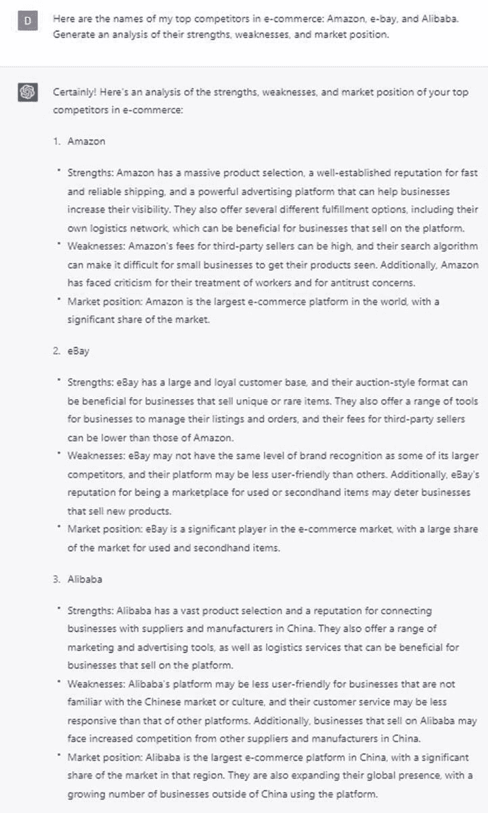

### 制定商业计划

填空提示：

• 为我的名为**[公司名称]**的业务撰写商业计划，该业务向**[细分市场]**销售**[产品]**并希望**[目标]**。

• 为我的名为**[公司名称]**的业务撰写商业计划，该业务向**[细分市场]**销售**[产品]**并希望**[目标]**。包括执行摘要、预期成本、销售额和利润的财务计算，以及公司使命和愿景。使用正式的语气和统计数据。

• 我希望我的公司能够达到**[目标]**，并为我的团队设定绩效目标。请列出季度里程碑和每个里程碑的责任人。

• 使用 OKR 框架，为**[公司或项目]**列出具体、可衡量和可实现的目标。

• 将这个愿景转化为 SMART 目标：**[插入愿景]**。包括最重要的成果和可交付成果。

开放式提示：

• “我的商业理念是什么？我将提供哪些产品或服务，它们与竞争对手相比有何不同或独特之处？”

• “我的目标市场是谁？他们的需求和痛点是什么，我的产品或服务将如何解决这些问题？”

• “我的营销和销售策略是什么？我将如何接触和吸引目标受众，以及我将使用哪些渠道或策略来推广我的业务？”

• “我将如何构建和组织我的业务？我将使用什么样的法律结构，以及我将如何管理财务和运营？”

• “我的财务预测和目标是什么？我预计在第一年能产生多少收入，我将如何随着时间的推移投资于增长和扩张？”

• “我的业务可能面临哪些关键风险和挑战，我将如何减轻或解决它们？”

• “我的团队的关键成员是谁，他们将承担哪些角色和责任？随着业务的发展，我将如何招聘和留住有才华的员工？”

• “我的业务短期和长期目标是什么，我将如何衡量进度和成功？”

• “我如何保持竞争力并适应市场或行业随时间的变化？我将使用哪些策略来创新并保持领先？”

• “我该如何为业务提供资金并管理现金流？我将使用哪些融资或投资来源，以及我将如何制定预算和管理费用？”

示例：

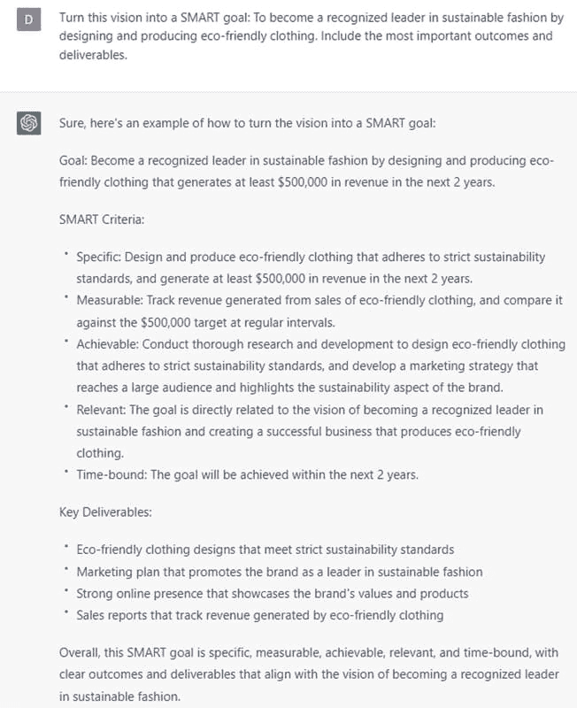

### 为客户撰写提案

填空提示：**

• 为我那些在**[痛点]**方面有困难的**[潜在客户]**撰写一个提案。以下是我提供的**[服务]**。使提案**[描述语气]**。

• 为我那些在**[痛点]**方面有困难的潜在**[客户]**撰写一个提案。以下是我提供的**[服务]**。以下是我的交付**[定价]**和**[时间表]**。使提案**[描述语气]**。

• 我正在向**[插入公司/组织名称]**推销一个项目，并需要撰写一个提案。该项目专注于**[插入项目范围]**。项目的关键交付成果和进度表是什么？我将如何确保项目满足他们的需求？撰写一个简洁而有说服力的提案。

开放式提示：

• “[服务]如何帮助[行业]的客户业务实现其目标和目标？”

• “[行业]中的企业如何从竞争对手中脱颖而出？”

• “我们如何帮助[业务类型]提高另一家企业的效率和生产力？”

• “[业务类型]可以提供哪些解决方案来解决市场上任何当前的痛点或挑战？”

• “一种[业务类型]如何帮助客户扩大客户群并进入新市场？”

• [业务类型]可以采取哪些步骤来提高客户满意度和忠诚度？”

• “我们的[服务类型]如何保持领先于行业趋势和创新？”

• “[行业类型]如何向客户展示其服务的投资回报率和潜在影响？”

示例：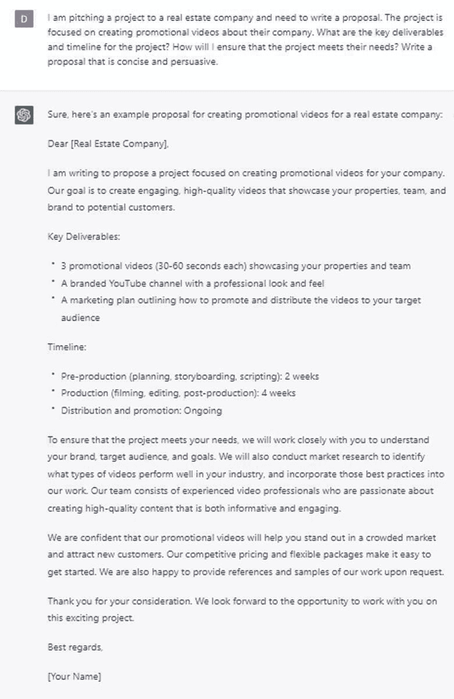

### 公司愿景声明

填空提示：**

• 制定一个公司愿景声明，包括：

• 引言：“我们的愿景是**[插入你的愿景声明，例如‘改变世界’、‘颠覆行业’或‘改变生活’]**。

• 价值观：我们相信**[插入你的第一个价值观，例如'创新'、'卓越'或'诚信']**、**[插入你的第二个价值观]**和**[插入你的第三个价值观]**。这些价值观指导我们在实现愿景的过程中采取行动和做出决策。

• 行动号召：加入我们，我们一起努力**[插入你的愿景声明在行动中的表述，例如'创造一个更美好的未来'、'激发变革'或'产生影响']**。

• 联系信息：如果您想了解更多信息，请通过**[插入您首选的联系方式，如电话、电子邮件或聊天]**联系**[插入您的团队电子邮件地址或电话号码]**。

• 结束语：最好的祝愿，**[插入你的名字]**。

• 我正在向**[插入公司/组织名称]**推销一个项目，并需要撰写一份提案。该项目专注于**[插入项目范围]**。项目的关键交付成果和进度表是什么？我将如何确保项目满足他们的需求？写一份简洁而有说服力的提案。

开放式提示：

• “生成一个概括我公司的目的和方向的愿景声明。”

• “为我的公司愿景声明头脑风暴一些想法。”

• “我想让我的公司对世界产生什么样的影响？”

• “我想让我的公司体现哪些价值观？”

• “我想在我的公司内创造什么样的文化？”

• “我想吸引什么样的客户到我的公司？”

• “我想让我的公司留下什么样的遗产？”

• “通过输入更多与我公司目标、价值观和受众相关的具体提示，完善我的愿景声明。”

• “比较和对比我愿景声明的不同版本，看看哪一个最能引起共鸣。”

• “通过将我的愿景声明输入 Chat GPT 来评估其清晰度、简洁性和整体有效性，获取对我的愿景声明的反馈。”

示例：

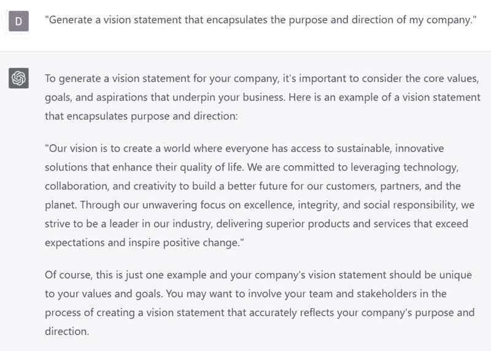

### 生成商业想法：

开放式提示：

• “你能建议一些当前需求旺盛的商业想法吗？”

• “你能建议一些在[插入行业或国家]当前需求旺盛的商业想法吗？”

• “我在寻找需要最少投资的商业想法。你有什么建议？”

• “有哪些创新且独特的商业想法？”

• “我经营这种业务[描述业务]。我能为我的客户提供哪些新产品和服务？”

• “你能为资源有限的初创公司推荐一些商业想法吗？”

• “我对在[插入行业]开始一项业务感兴趣。你有什么想法给我？”

• “有哪些具有高增长潜力的商业想法？”

• “我喜欢[插入激情和兴趣]。我能创建哪种类型的业务？”

• “我擅长[插入技能和经验]。我能创建哪种类型的业务？”

• “我在寻找环保的商业想法。你能帮帮我吗？”

• “我在寻找可以在家做的商业想法。你能帮帮我吗？”

• “你能为小镇或农村地区提出一些商业想法吗？”

• “我对在[插入利基市场]开始一项业务感兴趣。你有什么想法吗？”

• “你能推荐一些适合初学者的商业想法吗？”

• “我想在[插入行业]开始一项业务，但我不确定从哪里开始。有什么建议吗？”

• “有哪些容易扩展的商业想法？”

• “你能推荐一些在[插入目标市场]中流行的商业想法吗？”

• “我在寻找有社会影响力的商业想法。你有什么建议吗？”

示例：

### 准备向投资者提案：

你可以使用 ChatGPT 进行角色扮演，完善你的提案。以下是如何编写情景的 10 个示例：

对你的提案提出反馈。

情景提示：

• 想象一下你正在向投资者推销一个帮助人们跟踪每日饮水量的新移动应用。解释该应用解决的问题以及目标受众。

• 你正在向投资者推销一个新环保时尚品牌。描述该服装的独特特点以及它们如何造福环境，并分享你的营销和分销计划。

• 想象一下你正在向投资者推销一个新软件平台，该平台自动化了小型企业的应付账款流程。解释该软件解决的问题以及它如何为企业家节省时间和金钱。

• 你正在向投资者推销一个新的人造肉替代品。描述该产品的营养益处以及它与传统肉类在口感和质地上的比较，并分享你的生产和分销计划。

• 想象一下你正在向投资者推销一个新

通过视频聊天将患者与医疗保健提供者连接起来的远程医疗平台。描述该平台解决的问题以及它如何惠及患者和提供者，并分享你的营销和平台扩展计划。

• 你正在向投资者推销一个帮助人们在高成本城市寻找负担得起住房的新服务。解释该服务解决的问题以及目标受众，并分享你的收入和增长计划。

• 想象一下你正在向投资者推销一个优先考虑用户隐私和数据安全的新社交媒体平台。描述该平台与众不同的特点，以及你关于用户获取和货币化的计划。

• 你正在向投资者推销一个将消费者与当地工匠和手工艺人连接起来的新电子商务平台。解释该平台解决的问题以及它如何惠及消费者和工匠，并分享你的营销和扩张计划。

• 想象一下你正在向投资者推销一个可持续和道德消费商品的新在线市场。描述该市场的独特特点以及它如何惠及消费者和生产者，并分享你的增长和影响计划。

⑬ 你正在向投资者推销一个基于区块链的新平台，该平台帮助小型企业从全球投资者网络中获取融资。解释该平台解决的问题以及它如何惠及小型企业和投资者，并分享你扩大该平台的计划。

示例：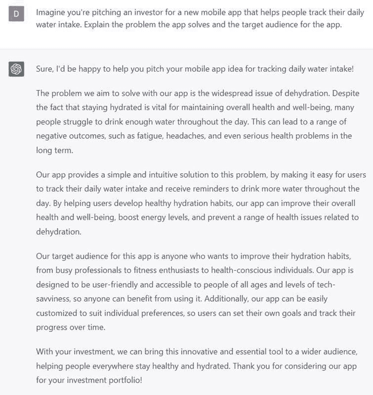

### 招聘和领导力：

指导性提示：

④ 我该如何为新员工的**[职位]**撰写一份个性化的欢迎信息，突出他们的独特优势，

⑩ 我该如何在同时让他们感受到对**[公司类型]**团队的贡献，并让他们在新的角色中感到被重视和支持？

⑦ 什么样的欢迎信息能够很好地欢迎新员工加入**[公司详情]**团队，并向他们简要介绍我们的企业文化、价值观和目标？

⑫ 我该如何为**[公司类型]**的新员工创造一个有趣且吸引人的入职体验，包括让他们有机会了解同事、熟悉我们的企业文化，并理解他们在**[职位]**中的角色和责任？

① 我该如何为新员工撰写一份关于**[职位]**的消息，展示我们对于多元化、平等和包容的**[公司类型]**承诺，并让他们感受到作为团队一员的欢迎和重视？

开放式提示：

③ “想象一下，你正在招聘一名新的客户服务代表。你会在候选人身上寻找哪些关键技能和品质？你会问哪些问题来评估他们处理客户咨询和解决问题的能力？”

② “你正在招聘一名新的软件开发人员。对于这个职位，哪些技术技能和经验是重要的？你会问哪些问题来评估他们的编码能力和解决问题的能力？”

⑤ “想象一下，你正在招聘一名新的市场营销经理。对于这个角色，哪些经验和资质是必要的？你会问哪些问题来评估他们对目标市场的理解以及他们制定有效营销策略的能力？”

⑥ “你正在招聘一名新的销售代表。对于这个职位，你会在候选人身上寻找哪些特质和品质？你会问哪些问题来评估他们的沟通和说服能力，以及他们达成销售目标的能力？”

⑧ “想象一下，你正在招聘一名新的人力资源经理。对于这个角色，哪些经验和资质是必要的？你会问哪些问题来评估他们对人力资源最佳实践的理解以及他们管理员工关系的能力？”

⑨ “你正在招聘一名新的会计。对于这个职位，哪些技术技能和经验是重要的？你会问哪些问题来评估他们对会计原则的了解以及他们分析财务报表的能力？”

⑪ “想象一下，你正在招聘一名新的图形设计师。对于这个角色，哪些经验和资质是必要的？你会问哪些问题来评估他们的创造能力和与团队成员协作的能力？”

• “你正在招聘一位新的项目经理。你会在候选人中寻找哪些特质和品质？你会问哪些问题来评估他们的领导能力和组织技能，以及他们管理截止日期和预算的能力？”

• “想象一下，你正在招聘一位新的行政助理。对这个角色来说，哪些技能和品质是重要的？你会问哪些问题来评估他们的组织能力和处理多项任务和优先级的能力？”

• “你正在招聘一位新的数据分析师。对这个职位来说，哪些技术技能和经验是重要的？你会问哪些问题来评估他们分析和解释数据的能力，以及他们使用数据可视化工具和技术方面的经验？”

填空提示：

• **[**角色**]**在

**[**业务类型**]?**

• 预期的工时安排和公司

文化对于**[**角色**]**在**[**业务类型**]?**

• 你能提供一份关于如何招聘

[角色]在[type of company]的逐步教程吗？

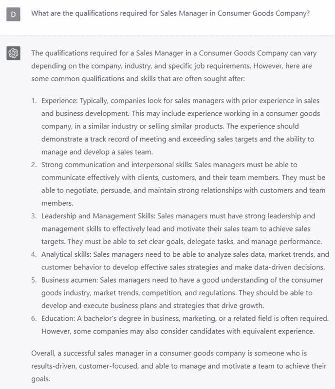

### 编写会议总结：

填空提示：

• 总结这些会议记录中的 5 个主要收获：**[复制并粘贴笔记]**

• 总结这些会议记录中做出的决定和概述的下一步行动：**[复制并粘贴笔记]**

• 总结这些会议记录中提出的要点、提出的解决方案和负责的部门：**[复制并粘贴笔记]**

开放式提示：

• “你能请总结一下今天会议中讨论的主要观点？[[复制并粘贴会议记录]”

• “如果您能简要总结一下我们刚才召开的会议，我将不胜感激。[复制并粘贴会议记录]”

• “你能总结一下我们之前召开的会议吗？我想确保我没有错过任何重要内容：[复制并粘贴会议记录]”

• “请总结一下这次会议的关键要点：[复制并粘贴会议记录]”

• “你能整理一份会议总结，我可以与其他利益相关者分享吗？这是录音的转录：[复制并粘贴会议记录]”

• “我需要给所有参加会议的人发送跟进电子邮件。[复制并粘贴录音记录]。你能写一个总结，我可以包含在电子邮件中吗？”

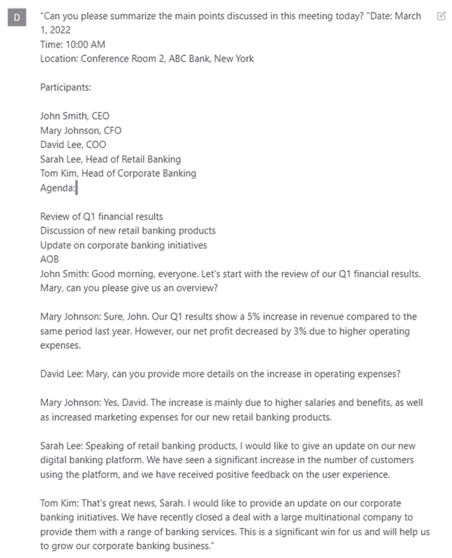

## 3. 📩 邮件营销

### 📶 生成电子邮件主题行：

填空提示：

• 这是我写的一封销售邮件。[插入邮件或描述邮件]。想出一个**[形容词]**和**[形容词]**的主题行。

• 我们的**[产品或服务]**是我们许多客户面临[痛点]的完美解决方案。它提供了**[好处 1]**、**[好处 2]**和**[好处 3]**，使其成为**[目标受众 X]**的必备品。写一封突出产品/服务的销售邮件，鼓励客户采取行动。

• 我们正在推出**[产品]**。它专为**[受众]**设计。以下是三个主要功能/好处**[项目]**，**[项目]**，**[项目]**。请写一封销售邮件，邀请读者以**[百分比]%**的折扣购买产品。

基于问题的提示：

• “关于[产品/服务/行业]的电子邮件，有哪些吸引注意力的主题行？”

• “我如何创建吸引点击和打开的引人注目的主题行？”

• “我可以在电子邮件主题行中使用幽默或机智的方式吗？”

• “我如何创建吸引目标受众兴趣和需求的主题行？”

• “有哪些方法可以在主题行中使用个性化来提高打开率？”

• “你能建议一些结合了错过机会（FOMO）原则的主题行吗？”

• “有哪些有效主题行可以重新吸引不活跃的订阅者或客户？”

• “我如何创建既清晰又吸引人的主题行，同时又不要太长？”

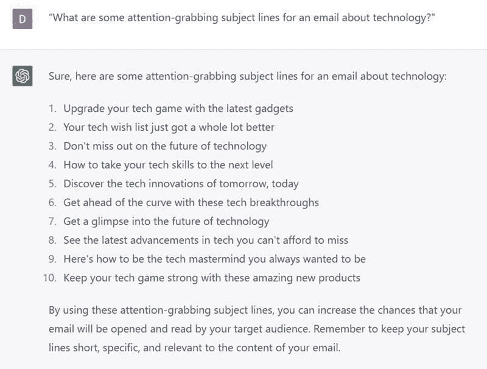

### 🖌️ 销售邮件的撰写：

填空提示：

• 我们的**[产品或服务]**是解决许多客户面临的**[痛点]**的完美解决方案。它提供**[优点 1]**，**[优点 2]**，和**[优点 3]**，使其成为**[目标受众 X]**的必备品。

编写一封突出产品/服务的销售邮件，并鼓励客户采取行动。

• 我们正在推出**[产品]**。它专为

**[受众]**。以下是三个主要功能/好处**[项目 1]**，**[项目 2]**，**[项目 3]**。写一封销售邮件，邀请读者以**[百分比]%**的折扣购买产品。

• “为潜在客户生成一封销售邮件，包括：

• 问候：嗨**[收件人姓名]**，

• 引言：我们是**[插入您的公司名称]**，我们专注于**[插入您的产品/服务名称]**。

• 优点：我们的**[插入您的产品/服务名称]**提供几个优点，包括**[插入您的第一个优点]**，**[插入您的第二个优点]**，和**[插入您的第三个优点]**。

• 行动号召：**[插入您清晰有力的行动号召，例如‘今天安排演示’或‘免费试用注册’]**。

• 紧迫感或稀缺感：现在就行动，**[插入您的紧迫感或稀缺感，例如‘利用我们的限时优惠’或‘在位置还可用时加入我们的独家项目’]**。

• 联系信息：如果您有任何问题或需要更多信息，请通过**[插入您首选的联系方式，例如电话、电子邮件或聊天]**联系我们的团队，邮箱地址为**[插入您的团队邮箱地址或电话号码]**。

• 结尾：谢谢，**[插入您的姓名]**。”

基于问题的提示：

• “你能帮我写一个能鼓励收件人打开我的销售邮件的引人入胜的主题行吗？”

• “我如何创建一个能吸引读者兴趣的开场白？”

• “有哪些方法可以在销售邮件中建立信誉并建立读者的信任？”

• "你能建议一些在销售电子邮件中创造紧迫感或稀缺感的技术吗？"

• "我如何利用讲故事来与读者建立情感联系并说服他们采取行动？"

• "在销售电子邮件中，有哪些有效的方法来突出产品的优点和独特的价值？"

• "你能帮我创建一个清晰且具有说服力的号召性用语，鼓励读者采取下一步行动吗？"

• "有哪些方法可以个性化销售电子邮件，使其更符合收件人的需求和兴趣？"

• "我如何在销售电子邮件中使用社会证明或推荐来建立读者的信誉和信任？"

• "在发送销售电子邮件后，你建议如何跟进并与读者保持联系，同时又不过于推诿或激进？"

示例：

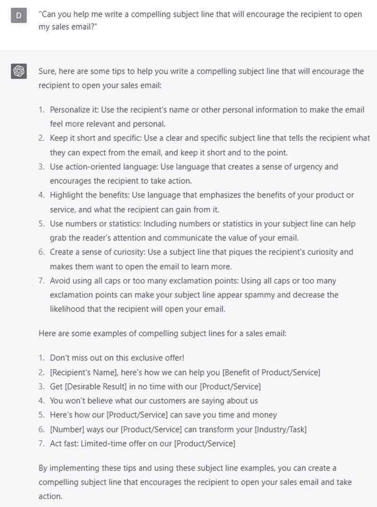

### ✍️ 撰写 onboard 电子邮件：

填空提示：

• 在客户购买后生成客户 onboard 电子邮件。电子邮件应以包含客户姓名的问候语开始，表达对他们购买 **[插入你的

产品/服务名称]**，并提供一些建议的 onboard 步骤列表，包括 **[插入你的第一步]**，**[插入你的第二步]**，和 **[插入你的第三步]**。电子邮件还应提供您团队的协助，并提供他们的联系方式，包括 **[插入你首选的联系方式]** 和 **[插入您团队的电子邮件地址或电话号码]**。使用 **[插入你的名字]** 作为电子邮件的结束语。

• "在我客户购买 **[产品名称]** 后，写一封欢迎电子邮件。"

• 向他们祝贺购买，并邀请他们保持联系，以便你可以继续帮助他们解决 **[问题]**。

基于问题的提示：

• "为新客户撰写一封 onboard 电子邮件，包括我们产品和服务的简要概述。"

• "你能草拟一封欢迎新客户加入我们公司并提供有关他们账户设置的电子邮件吗？"

• "撰写一封概述访问和使用我们产品和服务的流程的 onboard 电子邮件。"

• "你能撰写一封解释我们客户支持和计费政策和程序的电子邮件吗？"

• "撰写一封介绍新客户和我们的团队，并提供任何疑问或担忧的联系信息的 onboard 电子邮件。"

• "你能创建一封强调客户满意度和我们对他们成功的承诺的 onboard 电子邮件吗？"

• "撰写一封电子邮件，为客户的客户 onboard 流程提供事件和里程碑的时间表。"

• "你能草拟一封鼓励新客户在 onboard 流程中提问和寻求支持的电子邮件吗？"

• "撰写一封强调新客户成功 onboard 经验可用的资源和工具的 onboard 电子邮件。"

• “你能创建一封邮件，以表达对新客户到来的兴奋之情并重申我们对他们成功的承诺吗？”

EXAMPLES:

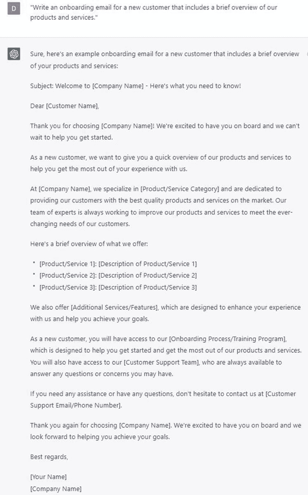

### 📨 撰写购物车放弃邮件

FILL-IN-THE-BLANK PROMPTS:

• 为潜在客户生成一封购物车放弃邮件，包括：

• 问候语：嗨**[收件人姓名**]，

• 提醒：您在购物车中留下了**[插入您的产品/服务名称**]。

• 优点：我们的**[插入您的产品/服务名称**]提供**[插入您的第一个优点**]，**[插入您的第二个优点**]，和**[插入您的第三个优点**]。

• 动作号召：完成您的购买并享受**[插入您的优惠或激励**]。

• 联系信息：如果您需要帮助，请通过**[插入您首选的联系方式，如电话、电子邮件或聊天**]在**[插入您的团队电子邮件地址或电话号码**]联系我们。

• 结尾语：谢谢，**[插入您的姓名**]。”

• 为那些开始购买**[产品**]但未完成购买流程的潜在客户撰写一个 3 封邮件的系列。通过强调他们的**[百分比**]%折扣将在 48 小时内失效来制造紧迫感，并在邮件中保持轻松愉快的语气。

QUESTION-BASED PROMPTS:

• “为潜在客户撰写一封鼓励他们完成购买的购物车放弃邮件。”

• “你能草拟一封提醒潜在客户关于他们购物车中留下的物品并提供完成购买激励的邮件吗？”

• “撰写一封强调购物车中产品利益的购物车放弃邮件。”

• “你能撰写一封邮件，针对购物车放弃的常见原因并提供解决方案吗？”

• “撰写一封提供特别优惠或折扣以激励购买的购物车放弃邮件。”

• “你能创建一封强调结账过程便利性和安全性的购物车放弃邮件吗？”

• “撰写一封展示类似或互补产品，客户可能感兴趣的邮件。”

• “你能草拟一封提供限时优惠以鼓励客户完成购买的邮件吗？”

• “撰写一封包含客户评价或评论的购物车放弃邮件，以建立信任和信誉。”

• “你能创建一封邮件，以表达对客户考虑的感激之情并重申完成购买的好处吗？”

EXAMPLES:

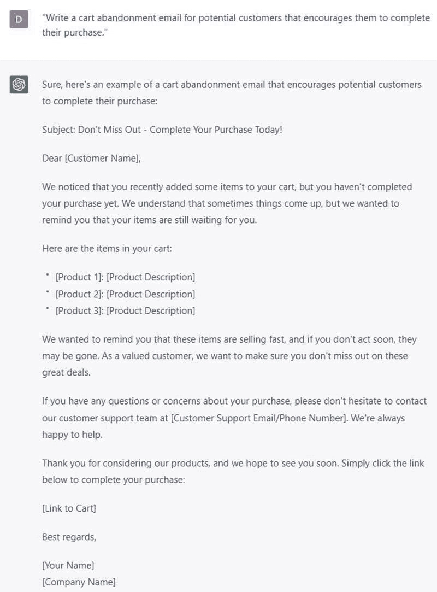

### ⚙️ 生成新闻通讯

FILL-IN-THE-BLANK PROMPTS:

• 提示 1：分析这段文本的语气和写作风格：**[插入代表您的语气和写作风格的文本**]”

• 提示 2：使用那种语气和写作风格来撰写一封**[描述邮件**]的邮件。

• 为潜在客户生成一封每周新闻通讯邮件，包括：

• 问候语：嗨**[收件人姓名**]，

• 更新：我们有一些令人兴奋的消息要告诉您！

• 内容：我们的**[插入您想要展示的内容**]已上线，您可以通过这里查看**[包含链接**]。

• 优点：这将帮助您**[插入您的第一个优点]**，**[插入您的第二个优点]**，和**[插入您的第三个优点]**。

• 行动号召：如果您想**[主要优点]**而没有**[主要反对意见]**，这绝对适合您。

• 结束语：下周再联系您，**[插入您的姓名]**。基于问题的提示：

• "为我们的客户撰写一封每周新闻通讯电子邮件，突出新产品、促销和活动。"

• "您能草拟一封提供过去一周最受欢迎的文章和内容的简要概述的电子邮件吗？"

• "撰写一封每周新闻通讯电子邮件，展示客户成功故事和推荐信。"

• "您能撰写一封包含与我们的客户相关的行业新闻和趋势的电子邮件吗？"

• "撰写一封每周新闻通讯电子邮件，提供帮助客户实现目标的技巧和资源。"

• "您能创建一封展示我们产品和服务特别促销和折扣的电子邮件吗？"

• "撰写一封突出即将举行的活动、网络研讨会和工作坊的电子邮件。"

• "您能草拟一封电子邮件，提供新产品和开发中功能的预览吗？"

• "撰写一封每周新闻通讯电子邮件，展示用户生成内容并鼓励客户参与。"

• "您能创建一封以表达对客户支持的感激之情并重申我们对他们成功的承诺的电子邮件吗？"

示例：

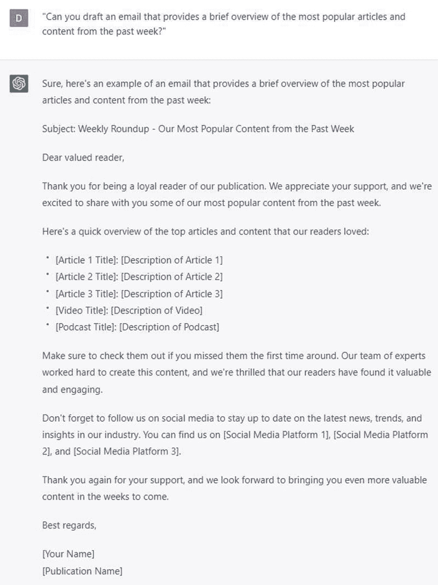

### 💌 撰写客户欢迎电子邮件

填空提示：

• 向**[描述公司]**的新客户发送一封欢迎电子邮件。

• 写一封欢迎新客户的电子邮件，提及他们的登录信息，并告诉他们如果有任何问题可以联系**[插入客户服务电子邮件]**。

• 为我的名单上的新订阅者撰写一封欢迎电子邮件，感谢他们注册，并提到我将在接下来的几天内发送有价值的信息。

基于问题的提示：

• "为新客户撰写一封欢迎电子邮件，概述我们的产品和服务的概述。"

• "您能草拟一封欢迎新客户的电子邮件，并提供他们入职体验的支持吗？"

• "撰写一封欢迎电子邮件，概述访问和使用我们产品和服务的流程。"

• "您能撰写一封电子邮件，向客户介绍我们的团队，并提供任何问题或疑虑的联系方式吗？"

• "撰写一封强调客户满意度和我们对其成功的承诺的欢迎电子邮件。"

• "您能创建一封提供客户入职流程事件和里程碑时间表的电子邮件吗？"

• "撰写一封电子邮件，突出新客户成功入职体验可用的资源和工具。"

• "您能草拟一封解释我们客户支持和计费政策和程序的电子邮件吗？"

• "撰写一封欢迎电子邮件，鼓励新客户在入职过程中提问和寻求支持。"

• "你能创建一封以表达对新客户到来的兴奋并重申我们对他们成功的承诺的邮件吗？"

示例：

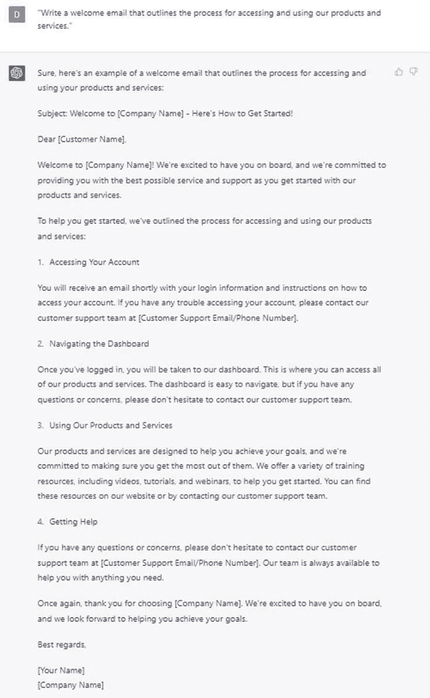

### 🧊 写一封冷邮件：

填空提示：

• 为一个正在与**[痛点]**作斗争并希望**[愿望]**的**[描述潜在客户]**写一封邮件。提及我的提议是**[描述提议]**，保证是**[插入保证]**，我的资历是**[插入资历]**。邀请他们与我预约通话。使用友好的语气，并使邮件简短。

• 写一封 200 字的冷邮件，包括：

• 问候：你好 **[姓名**]

• 优惠：我们可以在下周为你安排 10 个预约，否则你不用付钱

• 资历：我们与 83 个与你同行业的客户合作过

• 行动号召：如果你感兴趣，请回复，我会发送我的日程

基于问题的提示：

• “你能为潜在客户写一封以“亲爱的[潜在客户]**”开头的冷邮件吗？”

• “为潜在客户写一封包含关于我们公司的句子的冷邮件，'我们是[公司名称]，我们专注于[公司专长]。'"

• “你能为我们创建一封针对潜在客户的冷邮件，解释我们产品/服务的独特优势吗？”

• “为潜在客户写一封包含特别优惠的冷邮件，'今天利用我们的[特别优惠]！'"

• “你能为潜在客户撰写一封强调我们对客户满意度承诺的冷邮件吗？”

• “为潜在客户写一封包含行动号召的冷邮件，'今天联系我们了解更多！'"

• “你能为潜在客户写一封强调我们公司价值观和使命的冷邮件吗？”

• “为潜在客户写一封包含客户评价的冷邮件，'看看我们的满意客户对我们说了什么...'"

• “你能为潜在客户创建一封冷邮件，解释为什么他们应该选择我们而不是我们的竞争对手吗？”

• “为潜在客户写一封以个性化信息结尾的冷邮件，'我们很高兴与你合作，[潜在客户]**！'"

示例：

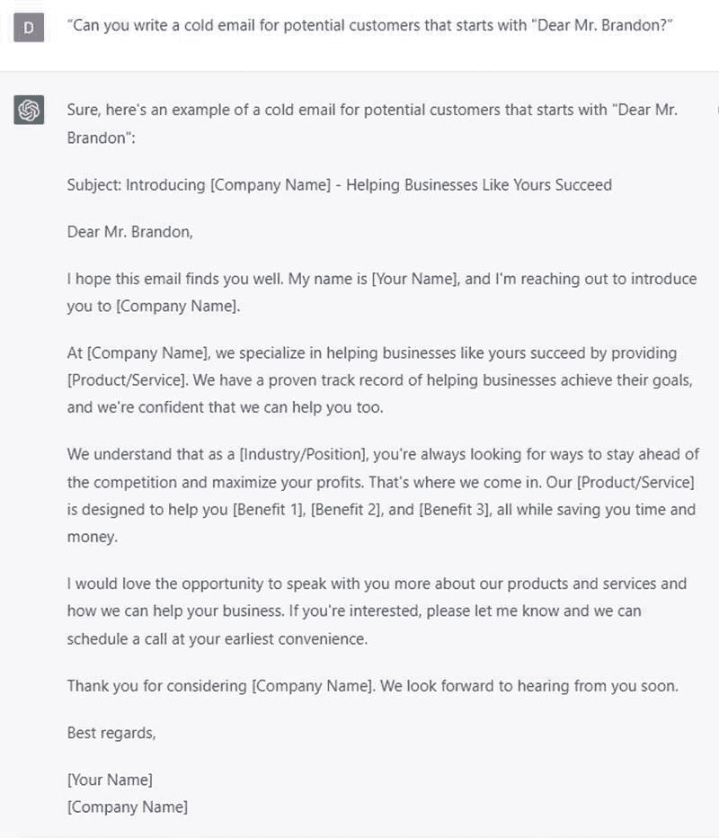

## 4. 🏛️ 建立在线漏斗

### 📶 生成产品想法

填空提示**：

• 告诉我**[数字**]个针对**[业务类型**]的可能产品想法。

• 给我列出 4 个我可以创建的作为**[业务类型]**的产品想法。

• 我的客户正在与**[痛点**]作斗争，他们希望**[梦想结果**]。头脑风暴 10 个我可以创造的产品想法来解决他们的问题。开放式提示：

• “你认为未来 5 年内[行业]最大的趋势是什么？”

• “目前影响[行业类型]的前 5 大趋势是什么？”

• “作为服务于[利基]的[行业]可以提供哪些新产品？”

• “告诉我[行业名称]将走向何方。”

• “[业务类型]可以为它的客户提供哪些新产品？”

• “告诉我 3 个可能的产品想法，可以帮助餐馆老板增加销售额。”

• “给我一个我可以创建为地毯清洁业务的 4 个产品想法的列表。”

EXAMPLES:

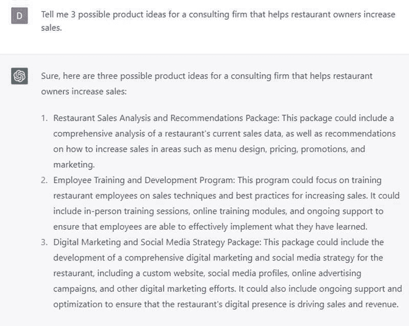

### 💡 生成在线筛选漏斗想法

FILL-IN-THE-BLANK PROMPTS**:**

• 网络筛选漏斗的步骤可能有哪些？

**[价格点]** **[产品类型]** 对于 **[细分市场]**？

• 描述我如何使用在线

筛选漏斗。

• 如何改进这个筛选漏斗以增加销售额：

**[描述当前筛选漏斗].**

INSTRUCTIONAL PROMPTS**:**

• “你能解释一下如何使用在线筛选漏斗销售[产品类型]吗？”

in simple terms？”

• “我应该考虑什么来销售[价格] [产品类型]？”

使用在线筛选漏斗？”

• “使用在线筛选漏斗销售[产品]的策略是什么？”

funnels？”

• “使用在线筛选漏斗销售[产品]的具体步骤是什么？”

online funnels？”

• “销售[产品]的最佳漏斗类型是什么？”

• “你认为使用什么方式销售[产品]最好？”

在线筛选漏斗？

• 选项 A: [漏斗类型]

• 选项 B: [漏斗类型]”

• “你能建议三种不同类型的在线筛选漏斗吗？”

could use to sell [product]?"

• “有哪些独特且有效的在线筛选漏斗想法？”

我可以用它来销售[产品]给[细分市场]？”

• "你能提供三个在线筛选漏斗的例子吗？"

funnels that are well-suited for selling a [product] to

[细分市场]？

• “使用在线筛选漏斗销售[产品]的步骤可能有哪些？”

$2000 mastermind for amazon FDA sellers？” EXAMPLE**:**

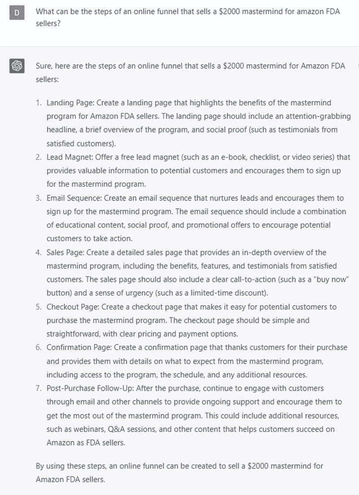

### 🫰 选择细分市场：

FILL-IN-THE-BLANK PROMPTS:

• 列出 3 个对购买**[产品]**感兴趣的潜在细分市场。

• 告诉我**[业务类型]**的正在增长的细分市场。

• 我想销售**[产品]**。它有助于**[描述它的功能**]。

需要这种解决方案的 10 个可能的市场。

QUESTION-BASED PROMPTS:

• “你能建议 10 个适合新业务启动的细分市场吗？”

• "2023 年，企业家最关注的 10 个增长细分市场是什么？"

• “我想开始一项新业务，目前最有前途的细分市场是什么？”

• "你能帮我找到 10 个有利可图的细分市场来启动新业务吗？"

• “我想进入一个新市场，目前应该考虑的前 10 个细分市场是什么？”

• “2023 年，创业的 10 个最未被开发的细分市场是什么？”

• “你能为我提供 10 个适合新业务机会的细分市场想法吗？”

• “未来 5 年，创业的最佳细分市场是哪些？”

• “我在新业务启动的早期阶段，目前有哪些正在增长的细分市场？”

• "你能给我 10 个有潜力增长的新业务细分市场想法吗？"

• “销售护肤产品的 3 个潜在细分市场可能是什么？”

• “有哪些正在增长的细分市场适合在线教练？” EXAMPLES:

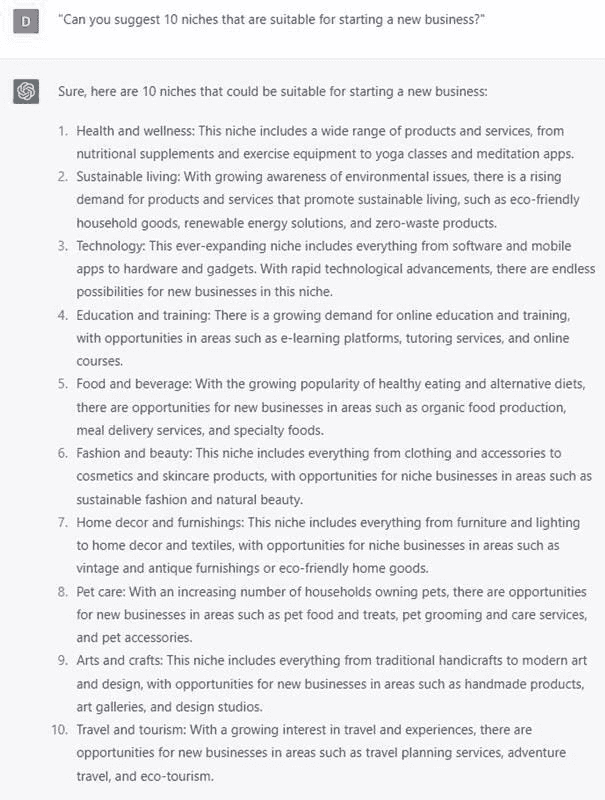

### ✍️ 编写销售页面：

FILL-IN-THE-BLANK PROMPTS**:**

• 斯坦凡·乔治分享的过程

• 第一提示：写一篇情感丰富的 500 字日记

从 **[ideal client]** 的视角出发，他正在为 **[pain points]** 而挣扎。他感到 **[emotions]**，并希望实现 **[dream outcomes]**。

• 第二提示：重写上述内容，但将 "I" 替换为 "you"

• 第三提示：使用上述内容撰写一篇 **[word count]** 字数的销售信，针对 **[ideal client]**，他们正在为 **[pain points]** 而挣扎。承诺如果他们继续阅读，他们将看到他们未能实现 **[dream outcome]** 的真正原因是一种称为 **[unique mechanism]** 的东西。提供一款名为 **[name of the product]** 的产品，其主要优点包括：

• -**[Benefit 1]**

• -**[Benefit 2]**

• -**[Benefit 3]**

• 提供这个保证 **[include guarantee]**，并包括这些证书 **[include credentials]**

• 第四提示：包括后续指示，例如：

• - 包含我们帮助 **[number of people]** 实现了 **[dream outcome]** 的事实

• - 在介绍中更加情感化

• - 在页面中包含这些推荐信 **[paste testimonials]**

• - 在提及价格之前使用故事叙述

• - 包含一个提及这些 **[pain points]** 和 **[desires]** 的标题

• 示例：

• 撰写一篇从挣扎于倦怠和长时间工作的沙龙老板视角出发的 500 字情感日记。她感到筋疲力尽，希望在扩大业务的同时将工作委托给团队。

• 重写上述内容，但将 "I" 替换为 "you".

• 使用上述内容撰写一篇 1000 字的销售信，针对长时间工作后挣扎于倦怠的沙龙老板。承诺如果他们继续阅读，他们将看到他们未能增加利润和组建团队的真实原因是一种称为“Poverty Pricing”的东西。提供一款名为“Scale Behind the Chair”的产品，其主要优点包括：

• - 将价格定位为豪华沙龙

• - 吸引高端客户

• 每周工作 4 小时

• 保证如果在 6 个月内他们没有赚到 20000 美元，你将免费提供 3 个月的免费辅导，并提到这位导师已经帮助 200 位沙龙老板在每周工作 4 小时的情况下达到 7 位数。

•

• 结果（不包括推荐信、按钮、个人简介或价值堆栈）：

• 桌椅背后的扩展：每周工作 4 小时，6 个月加速器，创建一个 7 位数的沙龙

• 亲爱的沙龙老板，

• 想象一下，在连续工作无数小时、牺牲与亲人相处的时间来维持业务运营之后醒来，感到完全筋疲力尽。你感到疲惫，但你知道你需要做些事情来增加利润并组建一个团队来减轻你的负担。

• 但是，无论你多么努力，似乎你都无法取得进展。你陷入了长时间工作和压倒性压力的循环中，看不到出路。

• 这是一个许多沙龙老板都熟悉的常见故事，这曾经也是我的故事。

• 但是，如果你告诉我，你无法提高利润和组建团队的真实原因是一种叫做“贫困定价”的东西，你会怎么想？

• 作为一位曾经像你一样因过度劳累而感到沮丧的美容院老板，我知道感觉自己陷入了一个没有结果、永无止境的辛勤工作循环是多么令人沮丧。但是，经过多年的努力，我发现美容行业成功的关键是将我的服务定价为奢华美容院。

• 这就是为什么我创建了“椅子背后的规模”，这是一个专门为像你这样的美容院老板设计的计划，旨在帮助他们将服务定价为奢华美容院，吸引高端客户，每周只需工作 4 小时。

• 不仅我已经使用这些原则来扩大我自己的成功美容院，我还帮助了 200 多位其他美容院老板每周只需工作 4 小时就达到七位数。而且，我坚信我也能为你做到。

• 正因如此，我提供了一份保证。如果在“椅子背后的规模”中使用的策略和技术 6 个月后，你未能赚到 20,000 美元，我将免费提供 3 个月的免费辅导。

• 是时候告别过度劳累，迎接一个盈利、成功的美容院了。继续阅读，了解更多关于“椅子背后的规模”的信息，并迈向你业务和生活的美好未来第一步。

• 真诚地，

• [你的名字]

### 📃 编写着陆页（用于注册或网络研讨会注册）：

FILL-IN-THE-BLANK PROMPTS:

• 编写一个提供**[引诱物]**给**[受众]**的着陆页。这个免费的**[电子书/网络研讨会/视频系列]**将帮助他们：

• -[收益 1]

• -[收益 2]

• -[收益 3]

• 提到这是完全免费的，并且我可以帮助他们，因为[包括资历]。

• 你能帮我创建一个可以将访客转化为客户的[产品/服务]着陆页吗？以下是我[产品/服务]的一些详细信息：[插入如收益、独特卖点、目标受众等详细信息]。

OPEN-ENDED PROMPTS:

• “我需要一个能够帮助我为我业务生成更多潜在客户的着陆页。你能帮我创建一个突出产品/服务关键功能和收益的着陆页吗？”

• “我即将推出一款新产品，我需要一个能够吸引潜在客户注意力的着陆页。你能帮我创建一个既视觉上吸引人又易于导航的着陆页吗？”

• “我想推广即将举行的活动，我需要一个可以帮助我销售票务的着陆页。你能帮我创建一个包含所有必要信息并鼓励访客注册的页面吗？”

• “我需要一个可以展示我的作品集和作为自由职业者的服务的着陆页。你能帮我创建一个突出我的技能并鼓励潜在客户联系我的页面吗？”

• “我想为我的电子书创建一个着陆页，并且需要它足够有说服力，以便将访客转化为客户。你能帮我创建一个包含明确的行动号召并突出我书籍关键收益的着陆页吗？”

• “我需要一个可以说服访客注册我的免费试用版本的着陆页。你能帮我创建一个突出产品独特功能并说服访客采取行动的着陆页吗？”

• “我正在寻找为我的电子商务商店创造更多销售额，我需要一个可以帮助我将访客转化为客户的着陆页。你能帮我创建一个视觉上吸引人并包含有说服力的产品描述的着陆页吗？”

EXAMPLES:

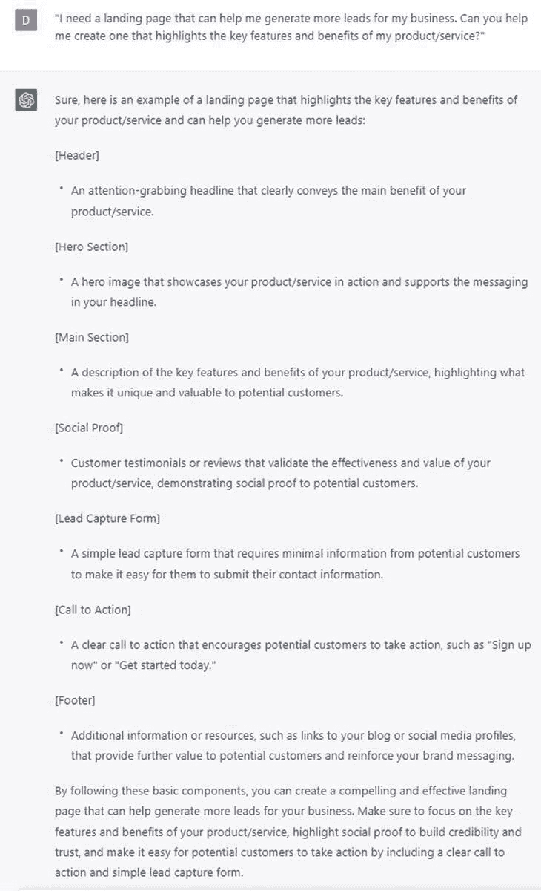

### 📄 撰写订单提升文案：

**填空提示**：

• 我们的产品[产品或服务]是解决许多客户面临[痛点]的完美解决方案。它提供了[好处 1]、[好处 2]和[好处 3]，使其成为[目标受众 X]的必备品。请撰写一个 100 字的文案，突出产品/服务并鼓励客户采取行动（使用紧迫感）。

• 撰写 3 个 200 字的文案版本，以这些好处说服潜在客户购买[产品类型]：

• [好处 1]

• [好处 2]

• [好处 3]

• 确保强调这是获得此产品[价格点]的唯一机会，并包括一个呼吁行动的语句，即[呼吁行动]。

• 撰写一个简短的着陆页，提供[产品]给[市场]。提及这是他们唯一一次以[百分比]%折扣看到这个产品。

**开放式提示**：

• “我能为我即将推出的新产品[产品名称]，它是一款[产品描述]的产品撰写销售文案吗？目标受众是[理想客户的描述]。”

• “我需要为我关于[课程主题]的在线课程撰写销售文案。你能写一些针对[目标受众描述]并突出课程好处的内容吗？”

• “我正在推出一款[产品类别]的新系列。你能写一些吸引[目标受众描述]并强调产品[独特卖点]的销售文案吗？”

• “我能为我销售[产品类别]的电子商务网站撰写销售文案吗？目标受众是[理想客户描述]他们欣赏[产品的独特卖点]。”

• “我需要为我的辅导服务撰写销售文案，这些服务帮助[目标受众]实现[目标]。你能写一些针对那些[目标受众的痛点]并希望[辅导服务期望结果]的人的文案吗？”

• “我正在推出一款帮助人们管理他们[问题领域]的新应用程序。你能为那些在[问题领域]中挣扎并希望[应用程序期望结果]的人撰写销售文案吗？”

• “你能为我即将出版的新书[书籍主题]撰写销售文案吗？目标受众是[理想读者的描述]他们希望[书籍期望结果]。”

• “我需要为我的专注于[旅游类型]的旅行社撰写销售文案。你能写一些吸引那些想要[旅行体验期望结果]并体验[旅行社的独特卖点]的旅行者的文案吗？”

• “你能为我销售[产品类别]的在线商店写销售文案吗？目标受众是那些希望优先考虑[产品价值主张]并对[产品独特卖点]充满热情的个人。”

• “我正在推出一项帮助[目标受众]改善[问题领域]的新服务。你能为那些希望[服务期望结果]并在[市场描述]中脱颖而出的企业家写销售文案吗？”

EXAMPLES:

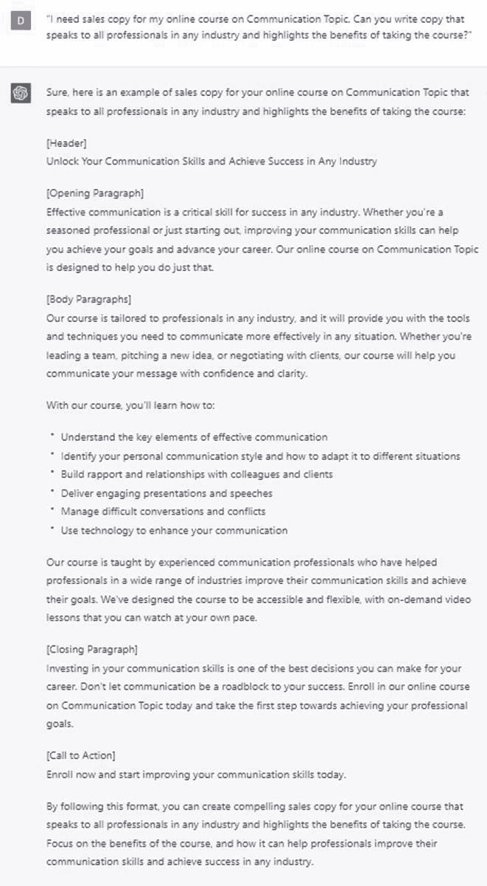

-

### 📄 Writing an Upsell Page :

FILL-IN-THE-BLANK PROMPTS :

• 编写一篇**[字数]**字的销售页面，首先说“等等！你的订单还没有完成。”然后使用具有说服力的语言在购买名为**[产品名称]**的产品周围创造紧迫感，该产品具有以下好处：

• 1\. [好处 1]

• 2\. [好处 2]

• 3\. [好处 3]

• 提到读者将能够**[承诺]**，或者他们将**[保证]**。

• 编写一篇 300 字的销售页面，介绍**[你的产品]**并描述以下关键好处**[好处 1]**、**[好处 2]**、**[好处 3]**。展示该产品如何帮助目标受众（**[细分市场]**）实现**[最终结果]**。解决目标受众面临的这些痛点**[痛点 1]**、**[痛点 2]**、**[痛点 3]**，并解释该产品如何帮助解决这些问题。

• 使用这些推荐信来建立信誉并展示产品的有效性：

• **[推荐信 1]

• [推荐信 2]

• [推荐信 3]**

• 通过突出**[紧迫性]**和**[稀缺性]**来创造紧迫感

• 使用清晰、简洁的语言和格式，使销售页面易于阅读和导航。

• 在结尾处敦促潜在客户采取行动并购买，同时强调产品的关键好处和价值。

OPEN-ENDED PROMPTS**:**

• “我正在销售[描述促销]。你能为刚刚购买[描述主要优惠]的客户写一篇具有说服力的、200 字的文案，提供该产品吗？”

• “你能写一个说服客户升级到我们[描述产品]的促销页面吗？”

• “我需要一个突出[描述产品]好处的促销页面。你能帮我吗？”

• “我想创建一个展示我们 VIP 会员功能特色的促销页面。你能帮我吗？”

• “你能帮我写一个推广我们软件高级版本的促销页面吗？”

• “我需要一个说服客户升级到我们白金计划的促销页面。你能为我写这个吗？”

• “你能创建一个突出我们高级版套餐中包含的额外资源的促销页面吗？我们提供[描述你的业务]”

• “我想为购买我们基本服务的客户提供促销。你能帮我写这个页面吗？我们销售[产品]给[细分市场]。”

• “你能写一个展示我们全面培训计划好处的促销页面吗？”

• “我需要一个可以说服客户升级到我们更高等级产品的促销页面。你能帮我吗？[介绍产品细节和受众]”

示例：

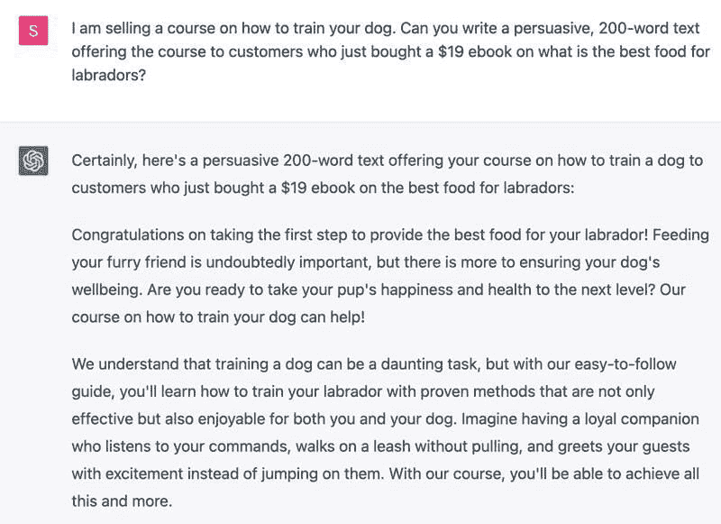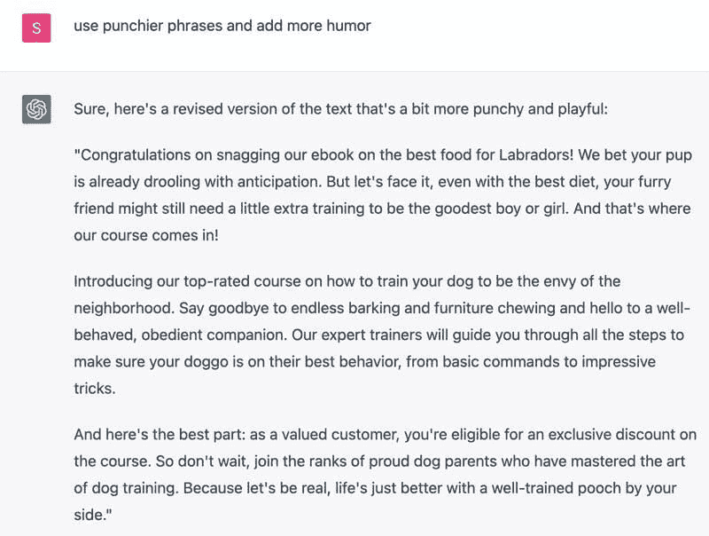

### 🤝 撰写感谢页面：

**填空提示**：**

撰写一个有说服力的**[字数统计]**着陆页面，提供一份

**[产品]** 命名为 **[产品名称]**，帮助 **[受众] [好处] [提供]**。首先说“谢谢，你的免费资源正在路上。”

**开放式提示**：**

• “你能为我新写的[填空]页面吗？

产品发布？我们要感谢我们的客户对他们的支持，并鼓励他们与他人分享他们的经验。”

• “我需要一个[填空]页面用于我的非营利组织

组织。你能写一些表达我们

对捐赠的感激之情，并鼓励人们继续支持我们的事业？”

• “你能为我电子商务网站写一个[填空]页面吗？我们想感谢我们的客户购买，并为他们提供下一次订单的特殊折扣。”

• “我正在举办一个[填空]活动，需要为参与者提供一个感谢页面。你能写一些表达我们对他们参与的感激之情，并提供有关即将举行的活动信息的文案吗？”

• “你能为我在线课程写一个[填空]页面吗？我们想感谢学生报名，并为他们提供额外的学习资源。”

• “我需要一个[填空]页面用于我的咨询服务。你能写一些感谢客户对个人成长承诺的文案，并提供有关未来会话的信息吗？”

• “你能为我商业会议写一个[填空]页面吗？我们想感谢参与者的参与，并鼓励他们继续与同行专业人士建立联系。”

• “我正在推出一个新产品系列，需要为顾客提供一个[填空]页面。你能写一些感谢他们尝试我们的产品并提供有关新发布的信息的文案吗？”

• “我能为我健身工作室写一个[填空]页面吗？我们想感谢我们的会员对健康和福祉旅程的奉献，并为他们提供特别优惠。”

• “我需要一个[填空]页面用于我的餐厅。你能写一些感谢顾客与我们用餐，并鼓励他们留下评论或关注社交媒体的文案吗？”

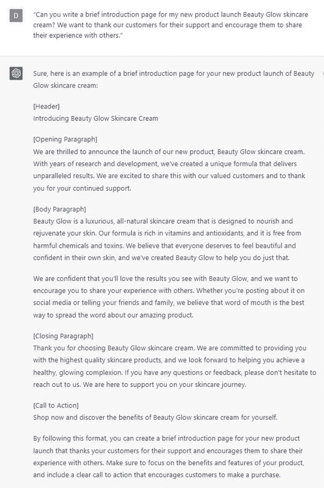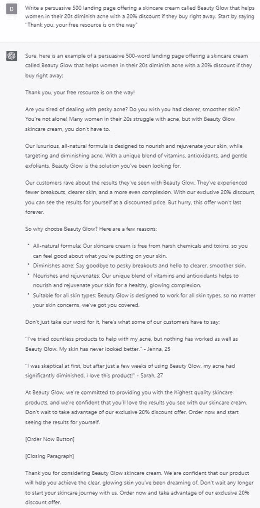

## 5.🕸️ 网站 & 电子商务

### ⚙️生成产品描述

生成产品描述：

**填空提示**：

• 在我的网站上为**[产品]**生成 5 个产品描述，强调产品的利益和关键特性。

• 为我的网站上的**[产品]**写一个简洁的产品描述，在 60 秒内吸引潜在买家的注意。

• 我计划在我的网站上为**[产品]**，**[受众]**的完美解决方案，撰写一个产品描述。你能想出一个有效的描述，突出其优势和关键特性吗？

OPEN-ENDED PROMPTS:

• “在创建产品描述时，我应该包含哪些最重要的信息？”

• “我如何创建吸引目标客户的产品描述？”

• “客户在产品描述中寻找什么？”

• “你能建议一些写简短而吸引人的产品描述的方法吗？”

• “我如何使我的产品描述在竞争中脱颖而出？”

• “我如何使用图片和视频来增强我的产品描述？”

• “我在产品描述中应该使用什么语气和语言？”

• “我应该提供多少细节关于产品的规格和功能？”

• “我如何持续改进我的产品描述以推动更多销售？”

• “有哪些方法可以使我的产品描述 SEO 友好？”

EXAMPLES:

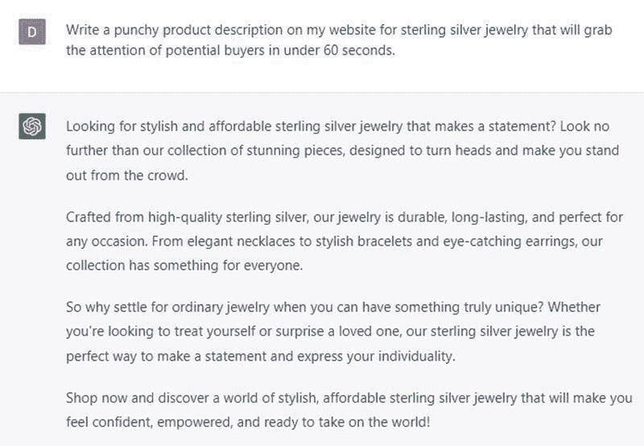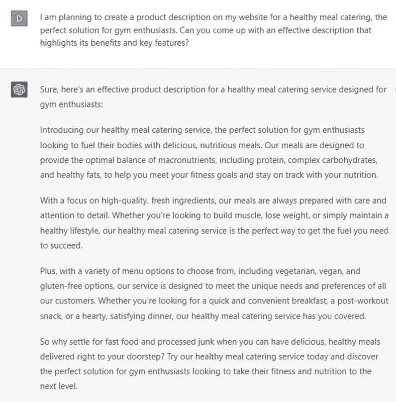

### ✍️撰写广告文案 :

FILL-IN-THE-BLANK PROMPTS:

• *撰写*一篇描述**[主题]**的博客文章。提到该产品有助于**[好处 1]**、**[好处 2]**、**[好处 3]**。最后说**[行动号召]**。包括统计数据，听起来像报纸上的报道。

• 10 个可能的这篇文章的标题。使它们具有**[插入杂志或作者]**风格：**[复制粘贴广告文案].**

OPEN-ENDED PROMPTS:

• “你能为我新推出的[产品]写一篇广告文案吗？这款产品旨在帮助[受众]实现[结果]。”

• “我需要为我提供[解决方案]给[利基市场]的[服务]写一篇广告文案。你能写一些吸引[痛点]并突出使用我服务优势的文案吗？”

• “我即将推出一款新的[产品类型]，它帮助[受众]。你能写一篇广告文案，针对[痛点]并强调产品的独特功能吗？”

• “你能为我教授[主题]的[课程]写一篇广告文案吗？目标受众是[受众]，他们对[需求]感兴趣。”

• “我需要为我提供[产品]给[受众]的[业务类型]写一篇广告文案。你能写一些吸引[痛点]并突出使用我服务优势的文案吗？”

• “我即将推出一款新的[产品]，它帮助[受众]。你能写一篇广告文案，针对[需求]并突出使用我的产品的优势吗？”

• “我即将推出一款新的[填写空白]服务，为[填写空白]提供[填写空白]。你能写一篇广告文案，针对[填写空白]并强调我产品的独特功能吗？”

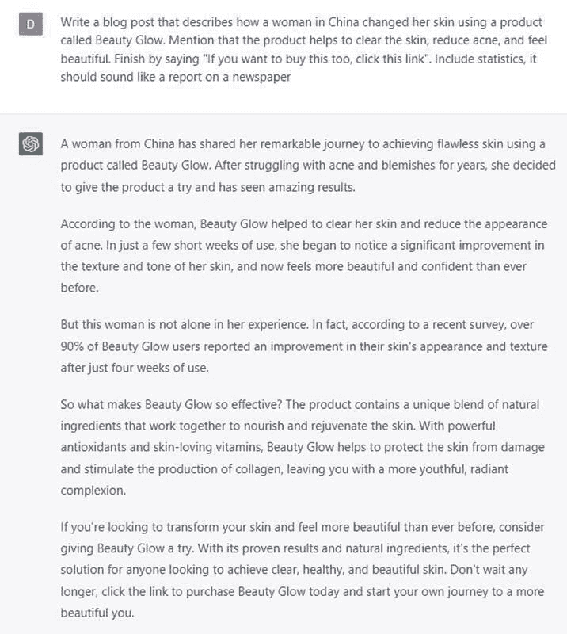

### 🔎优化您的网站以适应 SEO

FILL-IN-THE-BLANK PROMPTS**:**

• 为**[主题]**生成 10 个关键词想法。

• 可选：只建议高流量关键词

and low to medium competition.

• 可选：根据漏斗对关键词列表进行分组

阶段，无论它们是漏斗顶部、中间还是底部

受众的推荐信。

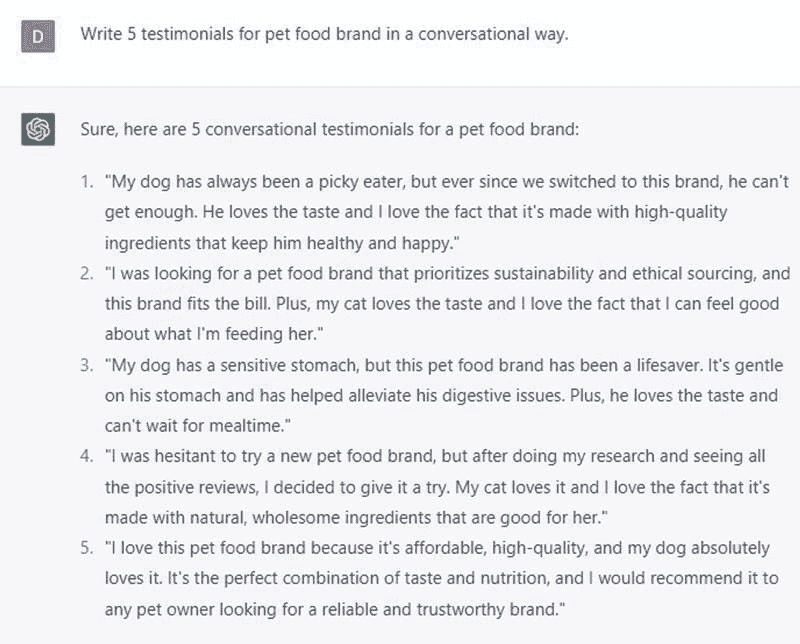

• 为此文本建议 5 种不同的行动号召：**[复制粘贴文本]**。

• 将此文本翻译成**[语言]**：

• 建议可以排名的**[主题]**博客主题想法。

• [反对意见 2]

子标题和项目符号。

子标题和项目符号。

反对意见：

• 以下是谁会是前 3 位最感兴趣的受众

• [反对意见 2]

客户**可能会使用的。

每个关键词都对应 4 种搜索意图中的任何一种。

• 帮助我生成针对“如何使用 schema 标记”的

• “你能帮我翻译这段文本吗？”

文本？”

• 提供与**[主题]**相关的 10 个长尾关键词。匹配

• 帮助我对以下文本进行情感分析

🫰创建客户推荐信

受众，选择一个主题，研究关键词

• 提供与**[主题]**相关的相关主题列表。

内容 **[内容]**。

• 为此关键词在域名上编写用户友好的 URL。

• **[反对意见 1]

**<域名>**以下关键词 - [**关键词]**。

关键词 **[keyword]**。

以下步骤。确定你的目标

### 填空提示：

• [反对意见 3].**。

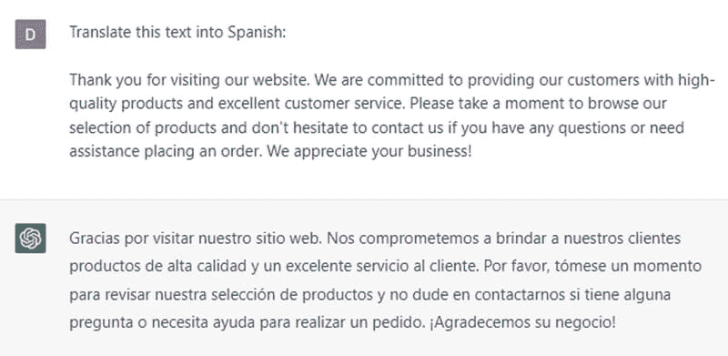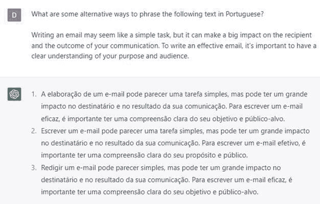

（基于之前的搜索）。

🎨设计 CTA：

漏斗或漏斗底部的关键词（基于

• 为**[产品]**撰写 5 篇由**[理想**

• 以下是一些表达以下句子的替代方式：

• 为**[产品]**撰写 10 篇针对**[主题]**的推荐信，以在 Google 上进行定位？

**[受众]**。

• **[反对意见 1]

以下问题和答案。 [**问题**]

• 列出针对**[关键词]**的目标受众的个人详细信息，并提及网址。

• 帮助我编写针对**[URL]**的结构化数据标记。

• 用对话方式为**[产品]**撰写 5 篇推荐信。

客户]**。

填空提示：

填空提示：

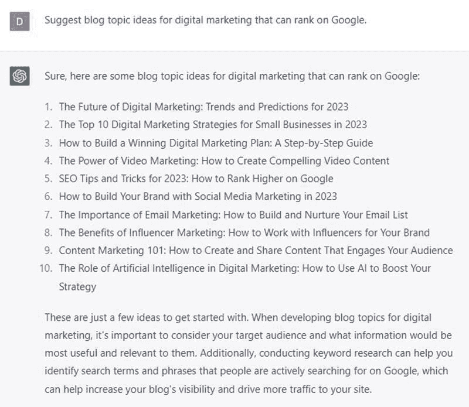

• 为**[主题]**编写一个详细的博客大纲，包括 H2、H3、

示例：

• 确保它们听起来很真实，并使用**[理想**

### • “我需要这份文件的翻译，你能帮我

• [反对意见 3]**。

反对意见：

的方式。

Google。

文本在**[语言]中？”

• [复制粘贴文本].**

开放式提示：

• 为**[产品]**撰写 5 篇听起来很真实的推荐信。

• “我需要帮助将这份文件翻译成，你能

assist me？”

• “Chat GPT 能为我提供这段文本的翻译吗？”

语言？”

🎃将网站内容翻译成不同语言：

• “你能帮我将这段文本转换成另一种语言吗？”

• 为**[产品]**撰写 10 篇针对这些

段落？”

• “Chat GPT 能否将这段文本翻译成另一种语言？”

• “你能帮我翻译这段段落吗？”

• “Chat GPT 能帮我理解这段文本吗？”

翻译给我？”

[回答]**。

出来？”

• **[复制粘贴文本]**。

• “你能将这段文本翻译成[目标语言]吗？” 示例：

### • 为 FAQ 页面 schema 标记编写 HTML 代码。

• 提供与关键词相关的顶级 10 个排名博客列表

• “我不理解这段文本，你能帮我翻译一下吗？”

• 建议一个最佳的行动号召，用于

**[主页/产品/关于]**页面，用于**[业务类型]**。

• 提出五种方法，让我能以更有说服力的方式告诉人们**[行动号召]**。

开放式提示：

• “你能帮我想出一个强有力的行动号召，用于我的着陆页，鼓励访客注册我的通讯吗？”

• “我需要一个吸引人的行动号召，用于我推广新产品的社交媒体帖子。你能帮我吗？”

• “你能为我建议一个强大的行动号召，用于我的电子邮件营销活动，鼓励订阅者购买我的新课程吗？”

• “我正在为我的辅导服务运行一个 Facebook 广告活动。你能想出一个有说服力的行动号召，鼓励人们预约我的发现会议吗？”

• “你能为我的网站创建一个强有力的行动号召，鼓励访客下载我的免费电子书吗？”

• “我需要一个清晰有效的行动号召，用于我的 YouTube 视频，鼓励观众订阅我的频道。”

• “你能帮我写一个吸引人的行动号召，用于我的网络研讨会注册页面，鼓励人们注册吗？”

• “我正在推出一个新播客，我需要一个吸引人的行动号召，鼓励听众收听未来的节目。”

• “你能为我建议一个有说服力的行动号召，用于我的销售页面，鼓励访客购买我的在线课程吗？”

• “我需要一个强有力的行动号召，用于我的退出弹窗，鼓励网站访客在离开前加入我的电子邮件列表。你能帮我吗？”

示例：

## 6.📶联盟营销

### ✍️撰写联盟产品评论：

填空提示：

• 写一篇关于**[产品]**如何与其他同类产品在价格、功能和质量方面的比较的评论。

• 从一个刚刚购买并对其结果感到兴奋的**[理想客户]**的角度，写一篇关于**[产品]**的简短评论。

• 写出关于**[产品]**的可能喜欢和不喜欢之处，以及为什么。基于这些信息写一篇评论。

• 从一个通过 WhatsApp 对话向朋友推荐**[产品]**的客户的角度，写一篇关于**[产品]**的简短评论。提及**[优点 1]**、**[优点 2]**和**[优点 3]**。使用对话和非正式的语言。

示例：

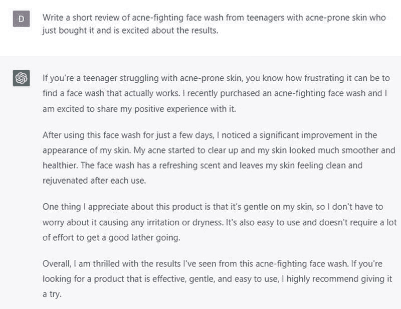

### 🫰创建联盟产品比较表格：

填空提示：

• 写一篇关于**[产品]**如何与其他同类产品在质量、功能和价格方面的比较的评论。

• **[产品 1]**相对于**[产品 2]**的 10 个优势是什么？

• 提供对**[产品]**的全面评论，

包括其功能、性能和性价比。

• 给我 10 个理由，说明**[理想客户]**为什么会选择**[产品 1]**而不是**[产品 2]**。

示例：

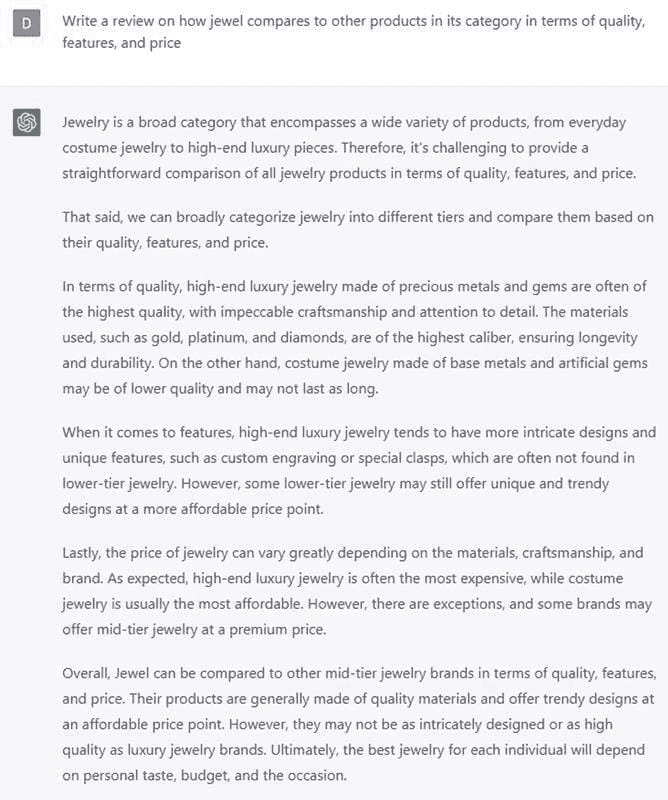

### ⚙️生成联盟产品推荐：

填空提示：

• 为一个关于如何的 YouTube 视频写一个脚本。

**[产品]**帮助我**[好处]**。

• 写一篇关于如何的博客文章，讨论**[产品]**。

helped me **[benefit]**. Mention statistics.

• Write a **[platform]** post that talks about how

**[product]** helped me **[benefit]**. Mention statistics

and this testimonial: **[include testimonial].** EXAMPLES:

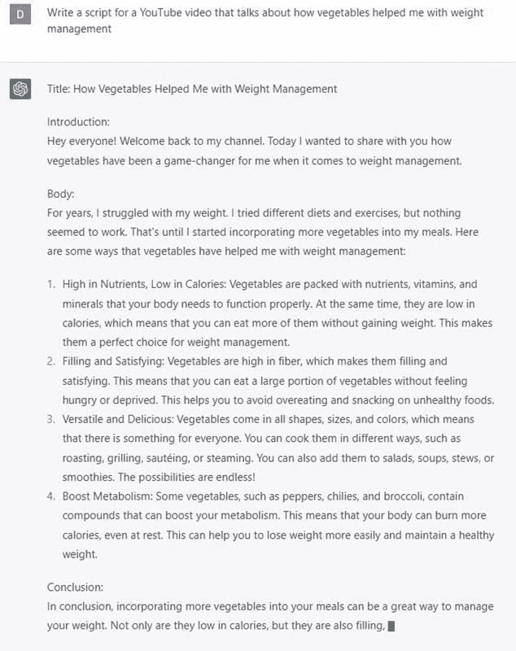

### ✍️Writing Affiliate Product Descriptions :

FILL-IN-THE-BLANK PROMPTS:

• Write a compelling description of **[product]** for

**[audience].**

• Write a compelling description of **[product]** for

**[audience]**. Mention these benefits:

• **[好处 1]

• [好处 2]

• [好处 3].**

• Write a product description for a **[product]** that

emphasizes its unique selling points and differentiates it

from similar products on the market.

• Write a short and catchy product description for a

**[product]** that will grab the attention of **[ideal

clients]** in the first 3 lines.

• Write compelling product descriptions for **[product]**

that will entice **[ideal customers]** to make a purchase.

Highlight these key features and benefits:

• **[好处 1]

• [好处 2]

• [好处 3].**

OPEN-ENDED PROMPTS:

• “Can you help me write product descriptions for my

affiliate marketing site using [feature] as a focus？”

• “Could you write up some product descriptions for me

that highlight the benefits of [product] for [audience]?”

• “I'm having trouble coming up with product descriptions

that really sell the benefits of [product]. Can you help me

out？”

• “Please help me create some compelling product

descriptions that showcase the unique features of

[product].”

• “Can you write some product descriptions that focus on

[product] and why it's an essential tool for [specific

audience]?”

• “I need to create product descriptions that make [product]

stand out from the competition. Can you help me with

that?”

• “Please write some product descriptions that clearly

explain the benefits of using [product] and why it's worth

the investment.”

• “Can you write product descriptions that showcase the

versatility of [product] and how it can be used in a variety

of situations？”

• “I want to create product descriptions that appeal to

[specific audience] and highlight how [product] can make

their lives easier. Can you help me with that?” EXAMPLES:

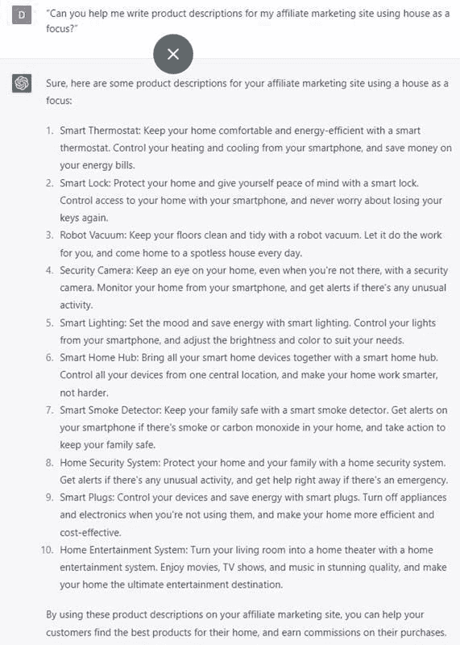

### ✍️Writing Affiliate Product Emails:

FILL-IN-THE-BLANK PROMPTS:

• Create a 3-step email sequence to promote **[product]** to **[audience]**. Mention that the product was created by someone you trust and that you earn a small affiliate commission if the reader buys.

• Write an email promoting a **[product]** to

**[audience]**. Describe the 产品 in detail and mention these key benefits:

• **[好处 1]

• [好处 2]

• [好处 3]**

• Mention that this is an affiliate product, and thank them for supporting you.

• I am an affiliate of **[product]**, which helps

**[audience]** achieve **[dream result]**. Write a sales email inviting the reader to buy this product with a discount if they buy from my affiliate link.

OPEN-ENDED PROMPTS:

• “你能帮我写一个吸引人的主题行，鼓励收件人打开我的销售邮件吗？”

• “我如何创造一个吸引注意的开场白，吸引读者的兴趣？”

• “在销售邮件中，有哪些方法可以建立信誉并赢得读者的信任？”

• “你能建议一些在销售邮件中创造紧迫感或稀缺感的技术吗？”

• “我如何使用讲故事来与读者建立情感联系并说服他们采取行动？”

• “有哪些有效的方法可以在销售邮件中突出我的产品或服务的优势和独特价值？”

• “你能帮我创建一个清晰且吸引人的号召性用语，鼓励读者采取下一步行动吗？”

• “有哪些方法可以使销售邮件个性化，使其更符合收件人的需求和兴趣？”

• “我如何在销售邮件中使用社会证明或推荐来建立读者的信誉和信任？”

• “在发送销售邮件后，你能建议一些跟进和保持联系的方法，同时不要过于推诿或激进吗？”

示例：

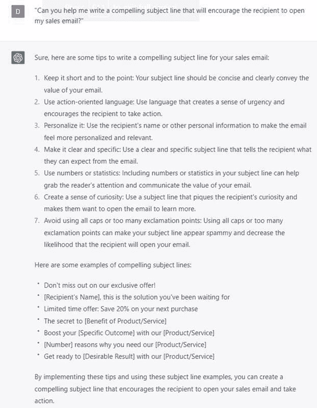

## 7.📲 Facebook 营销

### 👽创建有效的 Facebook 广告文案：

**填空提示**：

• 根据这个落地页为我写 3 个 Facebook 广告文案：

• **[复制并粘贴落地页文本]。**

• 你能提供一些针对**[受众]**推广**[产品]**的有效广告文案示例吗？请确保它们是**[有说服力的/有趣的/感性的]**，并提及以下这些好处：

• **[好处 1]**

• [好处 2]

• [好处 3]**

• 以一个包含**[CTA]**的号召性用语结束。在其上添加 3 个表情符号。

• 为推广**[产品]**针对**[受众]**的 Facebook 广告头脑风暴 20 个吸引人的标题。

• 我正在为**[产品/服务]**创建广告活动，需要帮助撰写能够吸引潜在客户的文案。你能帮我构思标题和正文，使他们愿意购买吗？

• Facebook 上有 20 个可能的受众群体可能会对**[产品]**感兴趣？

示例：

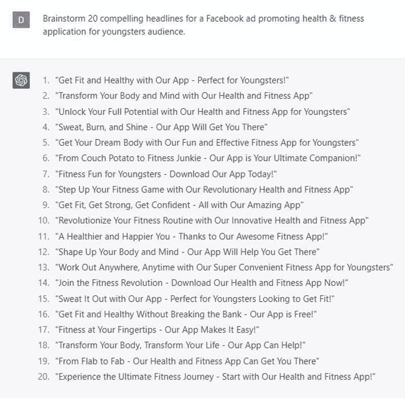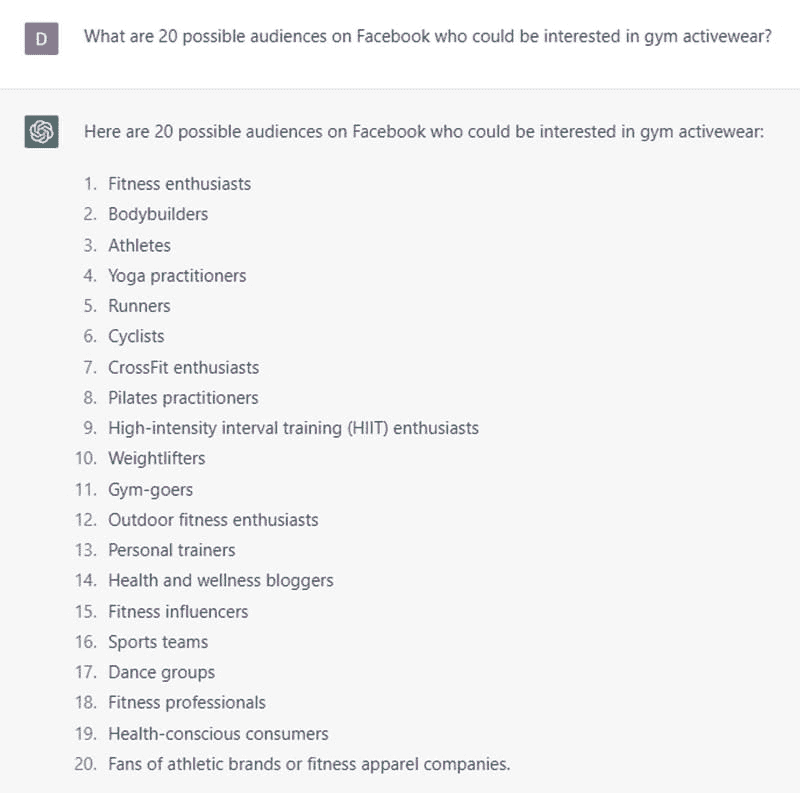

### 🔧为创意人士生成想法：

**填空提示**：

• 提示 1：哪些类型的图片可以用来推广**[产品]**？

• 提示 2：列出**[你选择的图片或场景]**的形容词。

• 提示 3：详细描述**[你选择的图片或场景]**。

• 将所有这些信息输入到像 Dall-E 或 Midjourney 这样的 AI 艺术生成器中。

开放式提示：

• “你能建议一些独特且引人注目的图片，这些图片可以吸引我的目标受众的注意吗？”

• “有哪些创造性的方法可以在广告中直观地展示我的产品/服务的优势？”

• “我如何使用图片传达与我目标受众产生共鸣的特定情感或感觉？”

• “你能帮我构思一个与我的品牌价值观和宣传信息相一致的可视化概念吗？”

• “我能用哪些视觉叙事技巧来使我的广告更具吸引力和

**令人难忘？”

• “你能建议一些适合我广告的流行图形设计风格吗？”

• “我如何利用色彩心理学创建一个与目标受众产生共鸣并推动转化的广告？”

• “你能帮我创建一个视觉叙事，讲述一个故事，并在更深层次上与我的目标受众建立联系？”

• “我如何将用户生成的内容或社会证明融入我的广告视觉中，以增强可信度？”

• “我能用哪些视觉隐喻或符号来创建一个强大且令人难忘的广告？”**示例**：

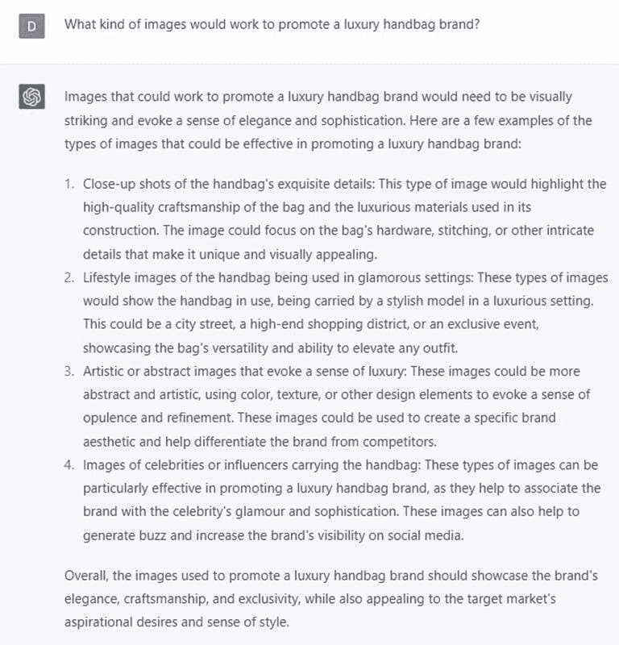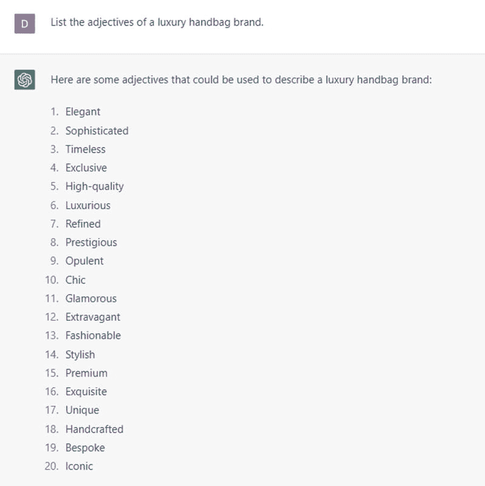

### ✍️为 Facebook 广告撰写标题：

**填空提示**：

• 撰写 3 个最多 40 个字符的 Facebook 广告

**基于以下广告文案**：

• **[复制粘贴着陆页或广告文案]。**

• 请为我提供 3 个吸引**[产品类型]**注意力的标题示例。

• 有哪些标题示例能够有效地传达**[主题]**的主要思想？

• 给我一些吸引人的标题示例，用于**[主题或产品]**，让人们想要**[期望的行动]**。使其风格像 BuzzFeed。

**开放式提示**：

• “你能为我的 Facebook 广告生成吸引注意力的标题，推广我的新[填写产品]？”

**[产品/服务]**提供[填写好处]？”

• “我需要吸引人的标题，用于推广我的[填写服务]，它帮助[填写目标受众]。你能帮忙吗？”

• “你能为我的 Facebook 广告想出引人入胜的标题，推广我的[填写产品/服务]，它具有[填写独特卖点]？”

• “我正在推出一系列[填写产品]，我需要引人注目的标题，用于我的 Facebook 广告，目标是[填写目标受众]。你能帮我写吗？”

• “你能帮我撰写吸引人的标题，用于推广我的[填写产品]，它使用[填写天然/有机成分]？”

• “我需要为我的 Facebook 广告撰写标题，推广我的旅行社的[填写旅行套餐类型]，它提供[填写独特体验]。你能帮我吗？”

• “你能为我的 Facebook 广告撰写吸引注意力的标题，推广我的[填写心理健康产品/服务]，它帮助[填写目标受众]应对[填写心理健康问题]？”

• “我正在为我的[填写书籍类型]运行 Facebook 广告，我需要吸引[填写目标受众]的引人入胜的标题，他们想要[填写好处]。你能帮我吗？”

• “你能为我的 Facebook 广告生成有说服力的标题，推广我的[填写产品]，它[填写独特卖点]并帮助[填写好处]？”

• “我需要为我的 Facebook 广告撰写标题，推广我的在线商店的[填写产品类别]，它提供[填写独特卖点]。你能为我写吗？”

**示例**：

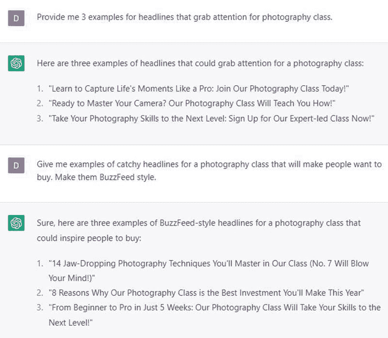

### ✍️撰写 Facebook 广告视频脚本：

FILL-IN-THE-BLANK PROMPTS**:**

• 你能就**[主题]**写一篇**[文本类型]**吗？

**[主题] [附加细节]**？

• 你能就**[主题]**写一个超级吸引人的 Facebook 广告视频脚本吗？

• 为时长 2 分钟的视频撰写一个脚本，用于向**[受众]**销售**[产品]**，并提及以下好处：

• **[好处 1]

• [好处 2]

• [好处 3]**

OPEN-ENDED PROMPTS**:**

• “你能为我们即将推出的新产品写一个 Facebook 广告视频脚本吗？”

• “我需要一个展示我们服务好处的 Facebook 广告视频脚本。你能帮忙吗？”

• “我们的 Facebook 广告视频需要一个能够吸引人们的注意并鼓励他们采取行动的脚本。你能写吗？”

• “你能创建一个突出我们产品独特功能和为什么它优于竞争对手的 Facebook 广告视频脚本吗？”

• “我在寻找一个 Facebook 广告视频脚本，它能讲述一个故事并与我们的观众建立情感联系。你能帮忙吗？”

• “我们希望我们的 Facebook 广告视频既有趣又难忘。你能写一个能让人笑并记住我们品牌的脚本吗？”

“我们的 Facebook 广告视频需要一个强有力的行动号召。你能写一个脚本，鼓励人们点击、注册或购买吗？”

• “你能写一个 Facebook 广告视频脚本，直接针对我们的目标受众，并解决他们的痛点和需求吗？”

• “我们正在推出一项新活动，需要一个能够激发人们兴奋和好奇心的 Facebook 广告视频脚本。你能帮忙吗？”

• “我们的 Facebook 广告视频需要脱颖而出。你能创建一个能够吸引人们的注意并让他们想要了解更多信息的脚本吗？”

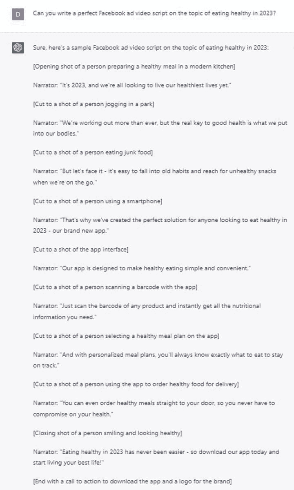

### 🎆创建引人注目的图像：

FILL-IN-THE-BLANK PROMPTS**:**

• 以**[豪华/冒险/现代等]**风格描述代表**[产品/服务]**的图片。你如何使用排版、颜色和其他设计元素来实现这种外观和感觉？

• 在 Chat GPT 上：详细描述**[图片]**。尽可能多地使用形容词和描述词。

• 然后将这些描述输入到另一个 AI 艺术生成器，如 DALL-E2 或 Midjourney。

• 想想 3 张能够以有趣和难忘的方式代表**[产品]**的图片。这些图片应该能够吸引潜在客户的注意。

• 提示 1：哪种图片最能代表**[主题]**？

• 提示 2：列出**[你选择的图片或场景]**的形容词

• 提示 3：详细描述**[你选择的图片或场景]**。

• 将所有这些信息输入到像 Dall-E 或 Midjourney 这样的 AI 艺术生成器中。

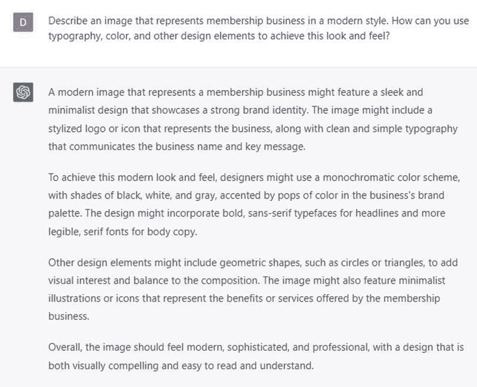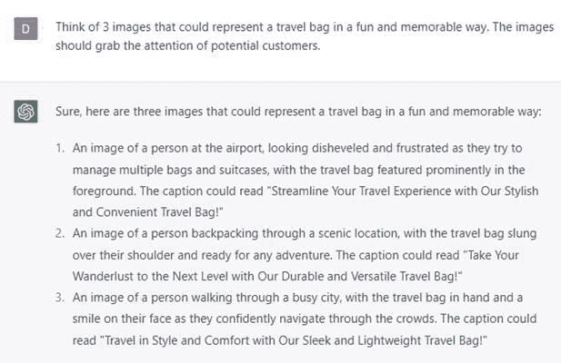

### 📈A/B 测试转化文案：

FILL-IN-THE-BLANK PROMPTS**:**

• 将以下文案重写得更具有说服力和易于阅读：

• **[复制粘贴控制副本].**

• 将以下元素添加到这个 Facebook 广告文案中：

• 第一行：在**[痛点]**上挣扎？

• 用户评价：**[评价 1] [评价 2]**

③行动号召：我们只剩下 3 个型号了，现在就购买吧！

②**[复制并粘贴控制副本]**。

③重写这个副本的 3 个版本，增加更多幽默感并与读者建立更深的联系：

③**[复制并粘贴控制副本]**。

③我正在尝试让我的广告副本**[优惠]**更有趣。你能帮我想出一个吸引人的标题和一个独特的卖点，以吸引人们的注意吗？

EXAMPLES：

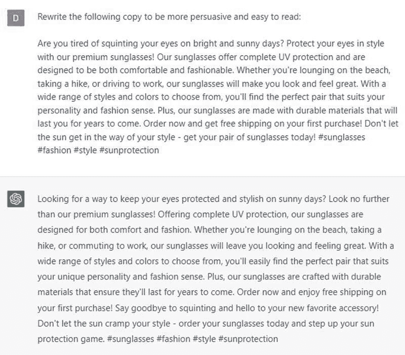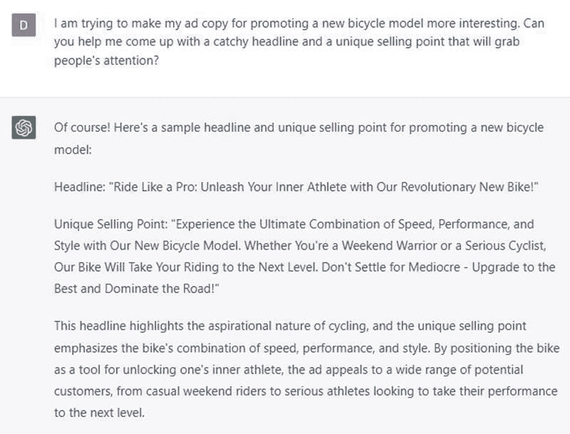

### 🔭研究你理想客户的痛点与愿望：

填空提示**：

③从**[理想客户]**的角度写一篇情感丰富的 500 字日记，他正在为**[痛点]**而挣扎。他感到**[情绪]**，并希望**[梦想结果]**。

③描述一个想要**[愿望]**但无法实现因为它**[阻碍]**的人的潜在挫折。

③什么是**[理想客户]**的一些常见愿望和挫折？

③列出 20 个可能在 Facebook 上对**[产品或解决方案]**感兴趣的潜在受众。

开放式提示**：

③“你能帮我研究我的理想客户，并提供关于他们的人口统计和

心理特征？”

③“我想更多地了解我的目标受众。你能收集他们兴趣和行为的信息吗？”

③“你能提供关于我的理想客户痛点和挑战的数据吗？”

③“我想更好地了解我的目标受众的需求和偏好。你能进行研究并提供见解吗？”

③“你能帮我确定我的理想客户在网上搜索的关键词和短语吗？”

③“我需要更多地了解我的目标受众的购买习惯。你能收集他们的购买行为数据吗？”

③“你能提供关于我的理想客户最活跃的社交媒体平台的信息吗？”

③“我想更多地了解我的理想客户的价值观和信仰。你能帮我研究一下吗？”

③“你能收集关于我的目标受众内容和媒体偏好的数据吗？”

③“我想了解我的理想客户在日常生活中面临的挑战。你能帮我研究一下吗？”

EXAMPLES：

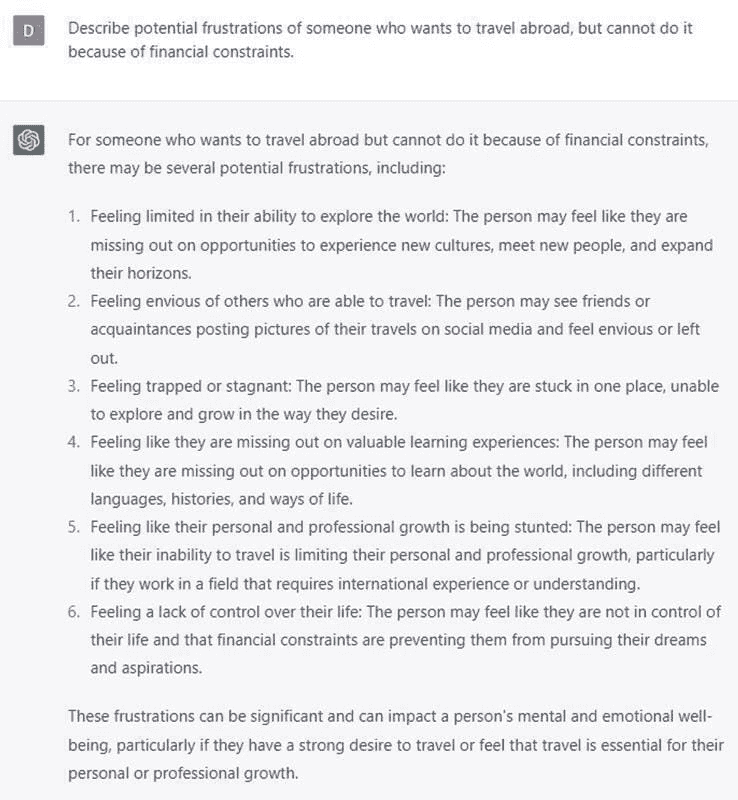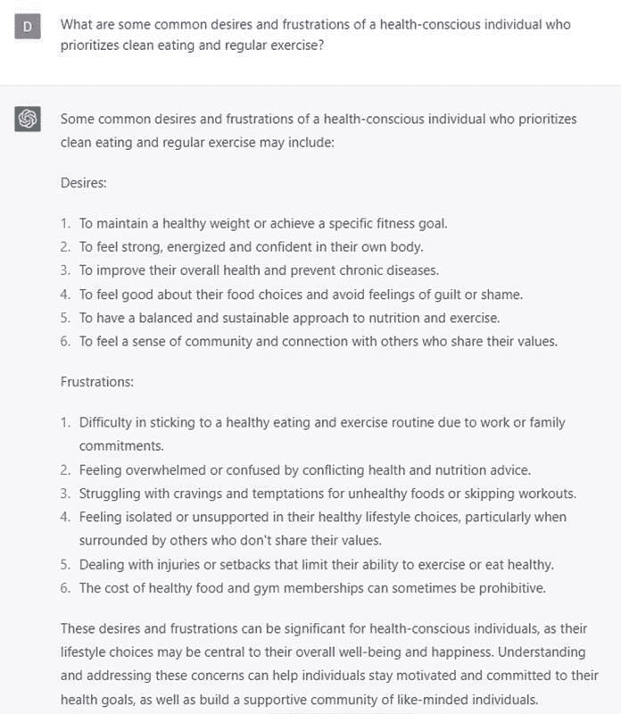

### 🧠为创意人士头脑风暴新角度：

填空提示**：

③为我基于这个着陆页副本写 3 个广告角度：

③**[复制并粘贴着陆页文本]**。

③销售**[产品]**给**[理想客户]**的 10 个角度是什么？

③告诉我**[产品]**针对**[细分市场]**的 10 个关键卖点。

③头脑风暴 10 个理由，说明**[理想客户]**为什么想购买**[产品]**。

EXAMPLES：

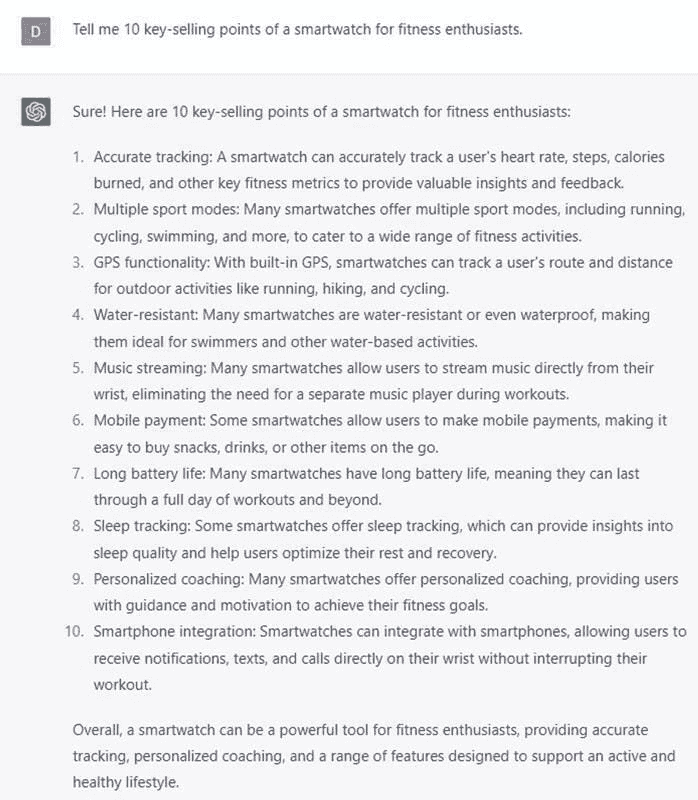

## 8.📥 YouTube 营销

### ✍️编写 YouTube 视频脚本：

填空提示：

③你能就这个主题写一篇**[文本类型]**？

**[主题] [附加细节]**。

③然后将其转化为一个强大的 YouTube 视频脚本。

①你能写一个超级吸引人的 YouTube 视频脚本吗？

**[主题]**？

③你能写一篇 500 字的博客文章，主题为**[主题]**，

提及这些好处：

③**[好处 1]**。

• [好处 2]

• [好处 3]**

• 然后将它转化为一个引人入胜的 YouTube 视频脚本。示例：

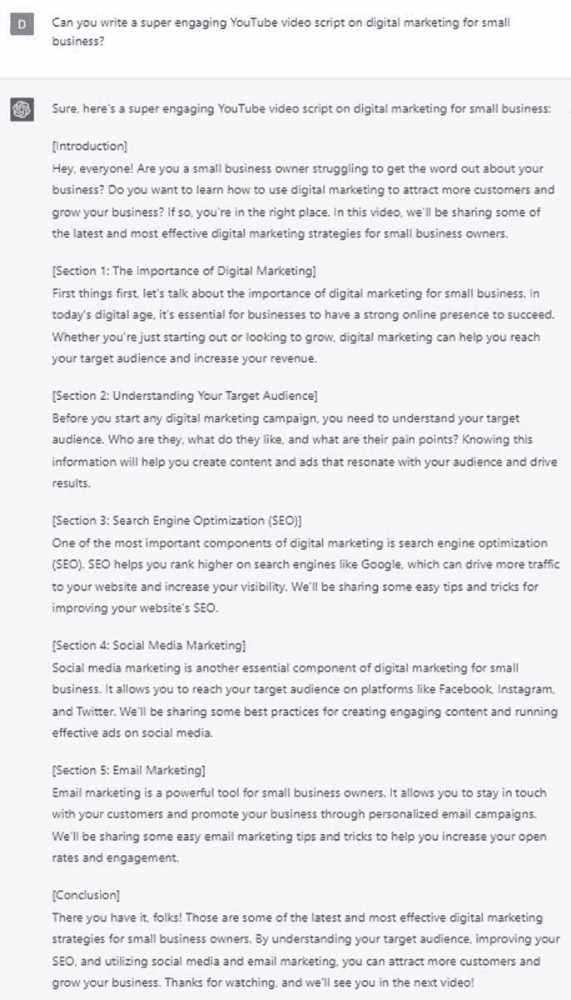

### ✍️撰写 YouTube 视频标题：

填空提示：

• 为这段文字头脑风暴 5 个吸引人的标题：

**[复制粘贴视频字幕].**

• 为 YouTube 视频写 5 个吸引人的标题

关于**[主题]**。

• 给我一些 YouTube 视频吸引人的标题示例

关于**[主题]**的视频，让人们想点击

和观看视频。让他们**[管理或创作]**

style.

示例：

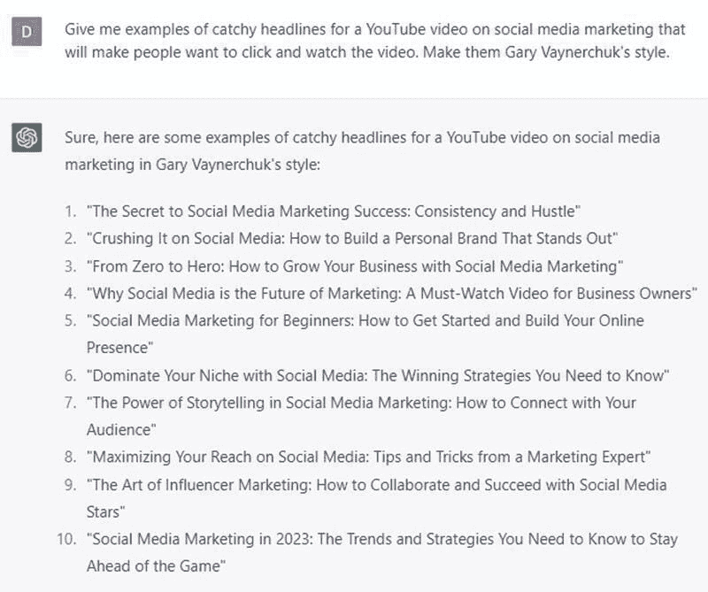

### ✍️撰写 SEO 友好的 YouTube 视频描述：

填空提示：

• 写一个 100 字的 YouTube 视频描述

促使**[受众]**观看关于**[主题]**的视频，并提及以下关键词**[关键词 1]**，**[关键词 2]**，**[关键词 3]**。

• 关于**[主题]**的 10 个流行关键词是什么？用它们写一个关于**[主题]**的 YouTube 视频描述。

开放式提示：

• “你能帮我优化关于[填写主题]的 YouTube 视频描述，使其包含相关关键词吗？”

• “我在寻找帮助，为我的最新 YouTube 视频撰写一个引人入胜且 SEO 友好的描述，关于[填写主题]。你能帮我吗？”

• “你能创建一个 YouTube 视频描述，包含正确的关键词和短语，帮助我的视频在[填写主题]的搜索结果中排名更高吗？”

• “我需要一个 YouTube 视频描述，它能吸引我的目标受众，同时也有助于提高关于[填写主题]的视频的 SEO 排名。你能帮我吗？”

• “你能为我 YouTube 视频写一个详细且关键词丰富的描述，涵盖[填写主题]，并包含一个行动号召吗？”

• “我在寻找帮助，为我的 YouTube 视频撰写一个 SEO 友好的描述，关于[填写主题]。你能创建一个既引人入胜又信息丰富的描述吗？”

• “你能帮我写一个 YouTube 视频描述，不仅解释了我的视频内容，还包含了关于[填写主题]的相关关键词和短语吗？”

• “我需要一个 YouTube 视频描述，能帮助我的视频在[填写主题]的搜索结果中排名更高。你能写一个既信息丰富又针对搜索引擎优化的东西吗？”

• “你能写一个 YouTube 视频描述，包含相关关键词，总结关于[填写主题]的视频内容，并鼓励观众观看吗？”

• “我在寻找帮助，为我的 YouTube 视频撰写一个引人入胜且 SEO 友好的描述，关于[填写主题]。你能帮我创建一个既能吸引观众又能提高其 SEO 排名的东西吗？”

示例：

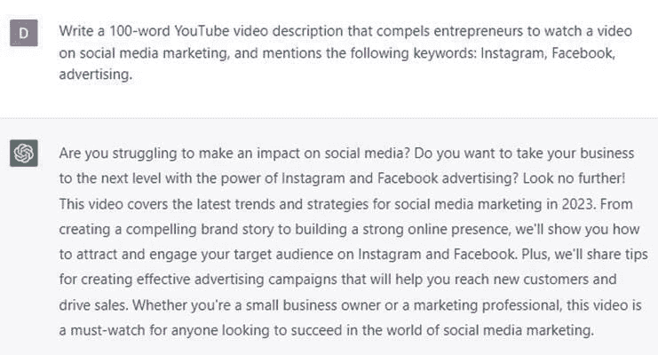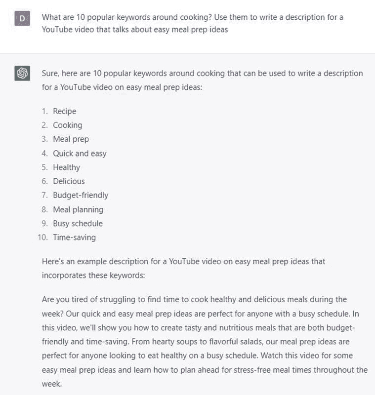

### ✍️撰写 YouTube 视频广告脚本：

填空提示：

• 你能为我关于**[文本类型]**主题的**[主题] [附加细节]**写一个 YouTube 广告视频脚本吗？

• 你能为我写一个关于**[主题]**的超级吸引人的 YouTube 广告视频脚本吗？先说“停！如果你想在网上赚钱，这会帮到你。”**[使用滚动停止符].**

• 为时长 2 分钟的 YouTube 视频编写一个销售**[产品]**给**[受众]**的脚本大纲，提及以下好处：

• **[好处 1]

• [好处 2]

• [好处 3].**

OPEN-ENDED PROMPTS:

• “YouTube 视频广告脚本应该有多长？”

• “YouTube 视频广告脚本的格式应该是什么样子的？”

• “我该如何使我的 YouTube 视频广告脚本引人入胜？”

• “我该如何使我的 YouTube 视频广告脚本具有说服力？”

• “我该如何衡量我的 YouTube 视频广告脚本的成效？”

EXAMPLES:

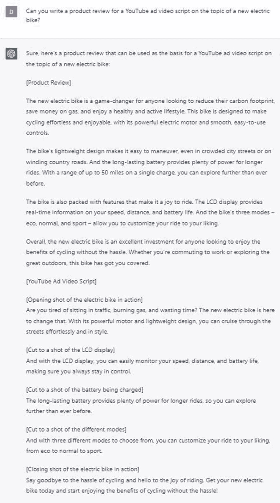

### ⚙️为吸引人的 YouTube 缩略图生成想法：

FILL-IN-THE-BLANK PROMPTS:

在**[主要好处]之后**编写十个 4 个字母的标题，表达**[情感]**。

OPEN-ENDED PROMPTS:

• “你能为我 YouTube 频道建议以**[主题]**为主题的缩略图想法吗？”

• “我需要为我的新 YouTube 视频[填写主题]提供有创意的缩略图想法。你能帮帮我吗？”

• “你能为我的 YouTube 频道生成针对[填写受众]的引人注目的缩略图想法吗？”

• “我在为我的 YouTube 视频[填写主题]想缩略图方面遇到困难。你能帮我吗？”

• “你能为我 YouTube 频道建议符合我品牌美学的缩略图设计吗？”

• “我需要 YouTube 视频的缩略图想法，让观众想要点击观看。你能提供一些想法吗？”

• “你能为我的 YouTube 频道想出既视觉上吸引人又

提供信息？”

• “我将在我的 YouTube 频道上推出一个新系列，我需要能吸引观众注意力的缩略图想法。你能帮我吗？”

• “你能为我 YouTube 视频提供包含[填写元素]的缩略图想法吗？这是我的内容的关键特点？”

• “我希望我的 YouTube 频道的缩略图脱颖而出且独特。你能帮我生成一些创意想法吗？”

EXAMPLES

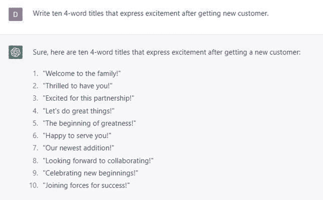

## 9.🛃 客户服务

### 🔧为顾客开发 FAQ 列表：

FILL-IN-THE-BLANK PROMPTS:

• 为**[业务类型]**的客户制定一份常见问题及答案列表。编写一个 FAQ 部分。

• 创建一个 FAQ 部分，解决常见

消除关于**[主题]**的误解。确保引用权威期刊，并消除任何混淆，

顾客。

• 编写一份常见问题及答案列表

提供对我的客户有帮助的信息。

• 为我的网站编写一个 FAQ，帮助**[理想

顾客更好地理解**[产品]**。确保

以包括**[常见问题].**

OPEN-ENDED PROMPTS:

• “你能分析客户反馈和评论，以

识别最常问的问题？”

• “我该如何构建 FAQ 文本，使其易于阅读

并为顾客提供导航？”

• “你能为我 YouTube 频道建议一个开场白，为

常见问题解答，并为问题提供背景信息。

答案？”

• “如何清晰简洁地回答最常见的

常见的客户问题？”

• “有哪些策略可以预测和回答

客户可能甚至不知道要问的问题？

• “我如何使用格式（如标题、项目符号

点和粗体文本）使常见问题解答更易于浏览

且视觉上吸引人？

• “你能建议一些融入品牌和

将个性融入常见问题解答，使其感觉更连贯

与我网站或产品的其余部分保持一致？

• “我如何确保常见问题解答中的答案是

准确且最新？

• “你能提供一些来自

其他公司或网站？

• “测试和优化有哪些最佳实践？

使常见问题解答尽可能对客户有帮助？示例**：**

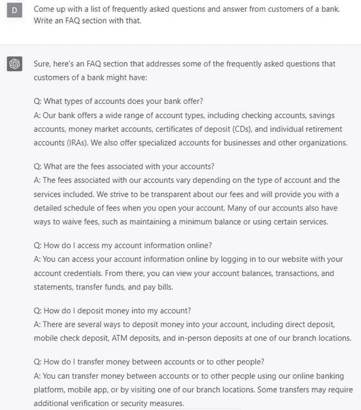

### 🤝 管理客户沟通：

填空式提示：

• 以更专业和温暖的语气为这位客户重写这封邮件：**[复制并粘贴消息]。**

• 一位客户正在抱怨 **[问题]**。写一封邮件回复，表明我理解他们并将尽一切努力帮助他们解决这个问题。

• 创建一个模板，用于处理关于 **[问题或解决方案]** 的常见问题和关切。

• 你能帮我写一封邮件，承认 **[问题]**，道歉并提供解决方案来弥补吗？

• 在邮件中回应客户投诉有哪些有效方式？客户的投诉内容是：**[问题]**。回复开头先自我介绍，感谢客户的邮件，并回应他们的询问。

开放式提示：

• “我如何以专业且友好的方式开启一封客户服务邮件？”

• “你能建议一些承认并理解客户问题或关切的方式吗？”

• “清晰简洁地解释客户解决问题需要采取的步骤有哪些最佳实践？”

• “你能提供一些我可以用来表达对客户业务感谢的语言示例吗？”

• “我如何确保邮件的语气与我公司的品牌声音和价值观保持一致？”

• “你能建议一些在初次邮件回复之外提供额外帮助或支持的方式吗？”

• “有哪些使用语言策略可以让客户放心，让他们知道他们的问题正被认真对待并且会找到解决方案？”

• “我如何有效沟通可能影响客户获得期望结果能力的任何限制或约束？”

• “你能帮我编辑和校对我的邮件，确保没有语法错误和拼写错误吗？”

• “我如何以让

客户感到满意和被重视，并鼓励他们在需要进一步帮助时联系我？”示例**：**

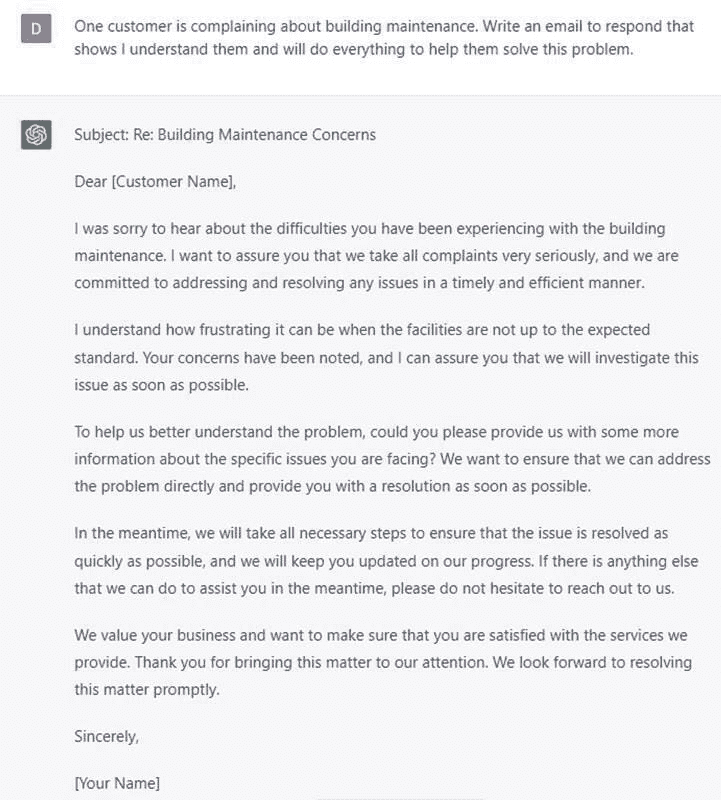

### 💬 回应潜在客户或批评者的评论：

• 填空式提示：

向一位想要了解**[产品]**如何工作的潜在客户撰写一封热情的回复。

用简单的话向潜在客户描述**[产品]**的好处。

列出 10 种我可以用来回答关于**[产品]**的问题的方式：**[输入问题]**。

开放式提示：

• “您能否为一位对我们产品/服务不满意并希望退款客户撰写回复？”

• “我需要为一位对我们送货政策有疑问的客户撰写回复。你能帮我吗？”

• “您能否为一位在我们的网站上留下负面评论的客户撰写一封礼貌的回复？”

• “我需要为一位对我们的产品感兴趣但对其有一些疑问的客户撰写一个信息丰富的回复。”

• “您能否为一位在使用我们的网站/应用程序时遇到技术困难并需要帮助的客户撰写回复？”

• “我需要为一位对我们的服务感兴趣但在做出决定前需要更多信息客户撰写一个有说服力的回复。”

• “您能否为一位在我们的平台上无法访问其账户的客户撰写回复？”

• “我需要为一位对我们的产品/服务提供反馈并提出改进建议的客户撰写一个专业的回复。”

• “您能否为一位提交了支持工单并等待问题解决方案的客户撰写回复？”

• “我需要为一位正在咨询我们公司退换货政策的客户撰写一个清晰简洁的回复。”

• “你能帮我草拟一封回复给一位正在询问我们[填写产品/服务]的客户吗？”

• “我需要为一位在使用我们的[填写功能]时遇到困难并需要礼貌且信息丰富的回复的客户撰写一封。”

• “您能否为一位正在为我们[填写功能]留下正面评论的客户生成一封友好的回复？”

[产品/服务]？”

• “我需要为一位对我们[填写产品/服务]表示不满的客户撰写一封专业且富有同理心的回复。你能帮我草拟一封吗？”

• “您能否为一位要求退回我们[填写产品/服务]的客户撰写回复？这需要提供信息并保持礼貌。”

**示例**：

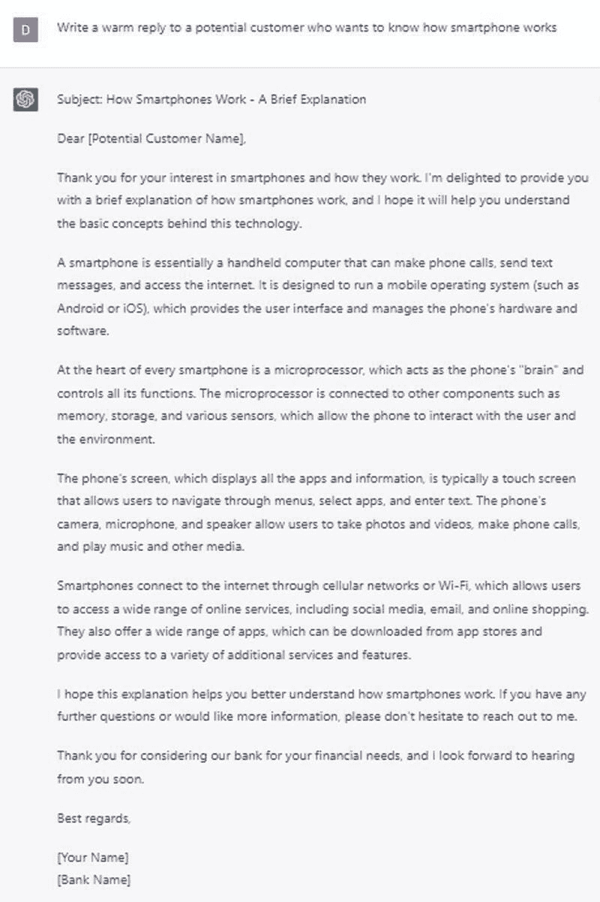

### 📈提高客户保留率：

开放式提示：

• “假设你是你自己的业务的客户。什么会促使你继续使用你的产品或服务？”

• “为什么客户可能会停止使用我的产品或服务？我能做些什么来解决这个问题并保持客户的参与度？”

• "我能提供哪些忠诚度或奖励计划来激励客户继续使用我的产品或服务？哪些奖励或福利对我的目标受众最有吸引力？”

• “我能为客户提供个性化的或定制化的体验，以增加他们对品牌的参与度吗？哪些类型的个性化最有效，我该如何实施它们？”

• “我产品或服务中有哪些方面可以改进，以提高客户满意度和保留率？我可以采取哪些步骤来做出这些改进并向客户传达？”

• “我能提供额外的资源或支持，帮助客户充分利用我的产品或服务吗？哪些类型的资源或支持对客户最有价值，我该如何使它们易于获取？”

• “我能实施一个推荐计划，激励现有客户将新客户推荐给我的业务吗？哪些奖励或福利最有效，我该如何向现有客户推广这个计划？”

• “我能在我的产品或服务中添加哪些社交或社区驱动的功能，以增加客户参与度和保留率？哪些类型的功能最有效，我该如何鼓励客户使用它们？”

• “我能为那些与我业务合作了一段时间的客户提供独家内容或访问权限吗？哪些类型的内容或访问方式对我的客户最具吸引力，我该如何以既有价值又吸引人的方式提供它们？”

• “有哪些沟通渠道或接触点我可以改进与客户的互动？我可以采取哪些步骤来改善这些互动，使它们更加个性化和有效？”

• “我能与其他企业或组织合作，为我的客户提供额外的福利或奖励吗？哪些类型的合作对客户最有价值，我该如何利用这些合作来提高客户保留率？”

• “你能为我[填写业务类型]提出提高客户保留率的策略吗？”

• “我正在寻找增加我[填写产品/服务]客户忠诚度的想法。你能帮我头脑风暴一下吗？”

• “我想提高我[填写业务类型]的客户保留率。你能给我一些建议吗？”

• “你能想出增加我[填写产品/服务]重复业务的方法吗？”

• “我正在寻找如何提高我[填写行业]公司客户保留率和降低流失率的建议。你能协助我吗？”

• “你能为我的[填写业务类型]头脑风暴一些保留策略，以使客户不断回头吗？”

• “我需要一些增加我[填写产品/服务]客户忠诚度的想法。你能帮我吗？”

• “你能提出保持客户对我[填写行业]业务参与度和忠诚度的方法吗？”

• “我正在寻找如何提高我[填写业务类型]客户保留率的创意想法。你能提供一些选项吗？”

示例：

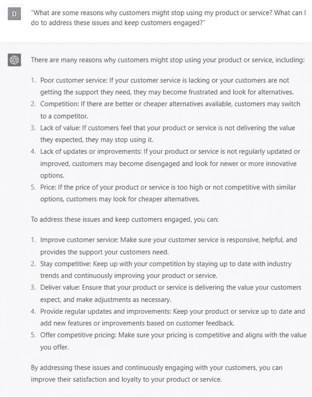

### 👨‍👩‍👧 调查您的客户：

填空提示：

• 给我 10 个问题，我可以用来调查我的客户并评估他们的满意度水平。

• 为**[公司类型]**的客户调查提供 20 个开放式问题的示例。

• 在客户调查中列出最重要的指标以增加客户满意度和保留率。

• 20 个问题，我可以问我的客户，看看他们还需要什么其他产品。

**[示例]**：

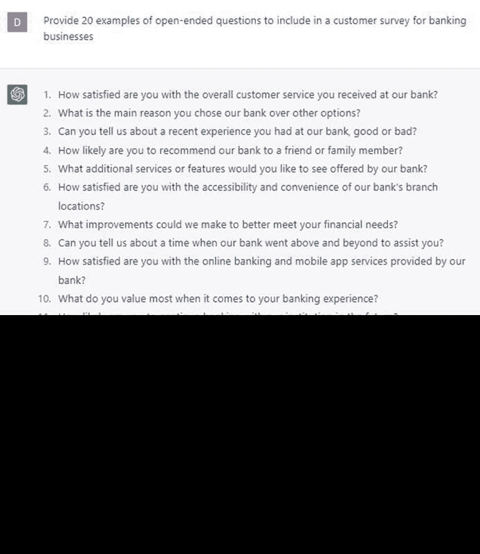

## 10. ✉️ 短信营销

### ✍️为促销和销售编写短信活动：

填空提示：

• 写一条短信向过去客户介绍**[优惠]**。通过说促销

天。

• 创建一条短信邀请客户参加一个特别的

**[活动/销售]**，提到日期、时间和地点

只持续 3 天来使用紧迫性，并提到主要好处是**[主要好处]**。

• 创建一条提供个性化折扣的短信

**[产品]**，在有人将产品添加到购物车但

没有完成购买后。通过说“稀缺”来使用稀缺性，

只有 3 个单位了。

• 写一条短信提醒客户关于即将举行的会议，

将在 1 小时内开始。提到参加的好处是

**[主要好处]**。

**[示例]**：

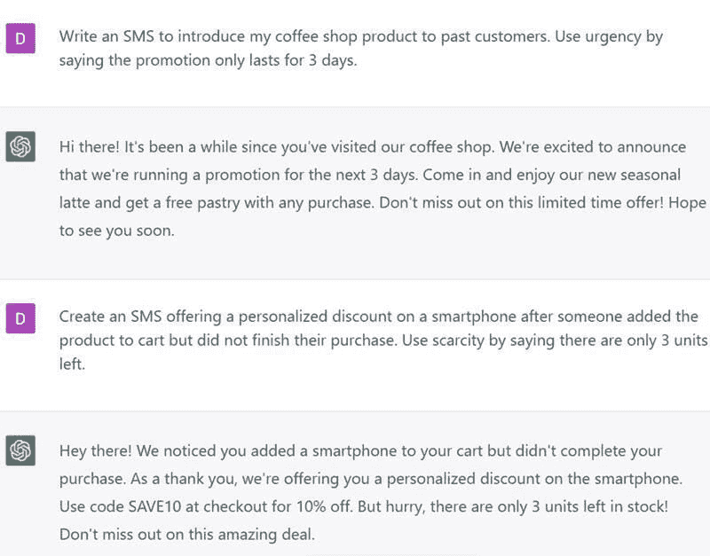

### 🎨为客户生成短信注册活动的创意：

填空提示：

• 写一条短信感谢人们选择加入，并

提醒他们他们的免费资源在**[URL]**。

• 在他们注册**[活动]**后生成一条短信，提醒他们参加的主要好处是**[主要好处]**，以及现场出席的奖金是**[奖金]**。

• 为电子邮件订阅者创建一条短信，告诉他们**[行动号召]**。要热情，让它听起来像是从朋友那里来的。

**[示例]**：

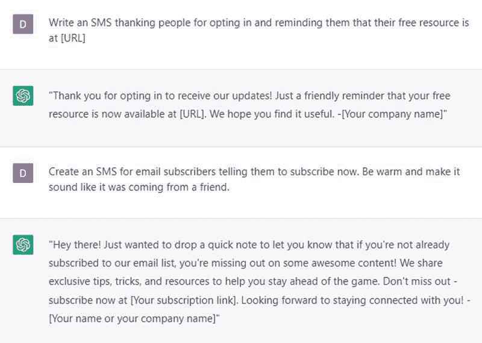

### ⏰为客户创建短信提醒和跟进信息：

填空提示：

• 写一条短信提醒潜在客户

**[活动]**。提到活动的日期、时间和地点。

• 提醒潜在客户在 24 小时内与我通话。提到如果他们想要**[结果或奖金]**，他们真的想出现。

• 创建一个包含 5 条信息的短信活动，

有人在**[类型]**预约时提到。

**[业务]**，提到去的好处，

预约。

• 开放式提示：

• “你能帮我创建一些短信提醒吗，我的

客户销售[产品]和跟进信息以确保他们完成[期望的行动]？”

• “你能写一些短信提醒，鼓励我的客户在[填空]上采取行动吗？”

• “请帮我创建一些短信提醒，突出[产品]的好处并鼓励[受众]尝试。”

• “我需要创建一些短信提醒，让我的客户感到受到重视和感激。你能帮我吗，使用[好处/折扣]作为重点？”

• “请写一些短信提醒，清楚地解释使用[产品]的好处以及为什么它值得投资。”

• “你能创建一些友好且个性化的短信提醒，同时鼓励客户对[优惠]采取行动吗？”

• “我想创建一些吸引[特定受众]并突出[产品]如何使他们的生活更轻松的短信提醒。你能帮我吗？”

EXAMPLES:

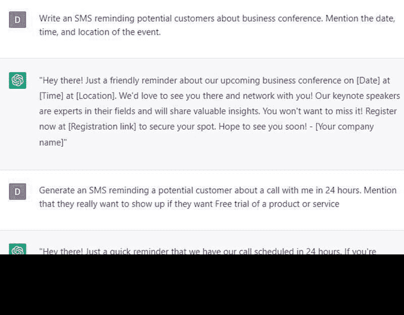

## 11.🧐 SEO

### ⚙️生成关键词列表：

FILL-IN-THE-BLANK PROMPTS:

• 生成一个关于**[主题]**的 10 个关键词想法列表。

• 可选：只建议高流量的关键词

竞争力和低到中等竞争力。

• 可选：根据漏斗将此关键词列表进行聚类

阶段，无论它们是漏斗顶部、中部还是底部。

漏斗或底部漏斗关键词（基于

之前的搜索）。

• 提供与关键词排名前 10 的博客列表。

**[关键词]**. **[提及网址]**.

• 提供与**[主题]**相关的相关主题列表。

• 提供与**[主题]**相关的 10 个长尾关键词。Match

每个关键词与 4 种搜索意图之一。EXAMPLES*

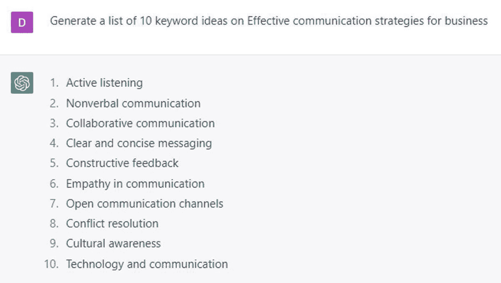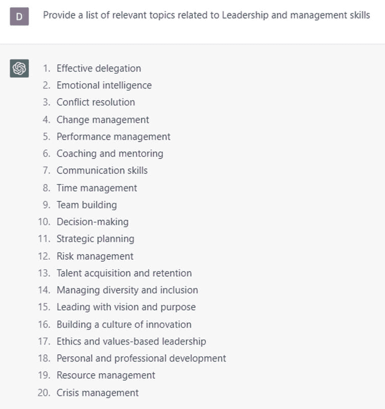

### 🎨撰写吸引人的博客文章：

FILL-IN-THE-BLANK PROMPTS:

• 你能写一篇关于**[主题]**的**[字数]**字的文章，概述**[产品]**对**[读者]**的**[好处]**吗？

• 你能从**[理想客户]**的角度写一篇**[支持/反对][主题]**的博客文章吗？在这样做之前，请说明阅读这篇文章的好处。

• 你能写一篇**[字数]**字的文章，以**[专业/情感/激动人心/有趣]**的语气解释**[主题]**对**[读者]**的好处。文章应从使用 PAS 公式来吸引读者阅读整篇文章开始，并在最后一段提及**[优惠]**。OPEN-ENDED PROMPTS:

• “你能写一篇关于[产品/服务/想法]的好处以及它如何改善[特定生活领域/商业]的文章吗？”

• “你能创建一篇概述[行业/细分市场]的顶级趋势并提供如何保持领先的可操作见解的博客文章吗？”

• “你能写一篇针对[目标受众]面临的常见[问题/挑战]并提供实际解决方案的博客文章吗？”

• “你能创建一篇突出[个人/组织]在他们的行业或社区中产生重大影响的成功故事的博客文章吗？”

• “你能写一篇提供如何使用逐步说明来[实现特定目标/克服特定挑战]的全面指南的博客文章吗？”

• “你能创建一篇分析[行业/细分市场]的历史/当前状态/未来的文章，并预测在不久的将来可能发生的变化吗？”

• “你能写一篇提供[提高特定技能/生活方面]的技巧和策略的文章，并提供成功实施这些策略的人的真实例子吗？”

• “你能创建一篇提供[产品/服务]深入评论的文章，并对其优点和缺点进行诚实的评估吗？”

• “你能写一篇针对[主题/行业]的常见误解或神话的文章，并提供准确的信息来消除这些

误解？”

以下问题答案。**[问题**]

EXAMPLES**：

• 帮助我编写针对**[URL]**的结构化数据标记。

关键词[**关键词**]。

### • “你能创建一篇介绍[知名人物/创新者]在[行业/利基市场]的帖子，并对其职业轨迹、成就和成功策略提供见解吗？”

FILL-IN-THE-BLANK PROMPTS：

• 在**[主题]**上生成 10 个关键词想法列表。

• 可选：仅建议具有高流量、低到中等竞争性的关键词。

和低到中等竞争性。

• 帮助我制定针对[**URL**]的内容分发计划的一系列活动列表。

2023 年 2 月和 3 月。

前一次搜索）。

子标题和项目符号。

• 帮助我对以下内容进行情感分析。

**[关键词]**。**[提及网址]**。

• 为**[主题]**提出博客主题想法，使其在 Google 上排名。

目标受众在**[主题]**上，以在 Google 上定位？

• 为**[主题**]编写一个详细的博客大纲，包括 H2、H3、

• 提供与**[主题**]相关的相关主题列表。

前一次搜索）对关键词列表进行聚类。

• 谁会是前 3 位最感兴趣的受众？

[**域名**]针对以下关键词 - [**关键词**]。

• 提供与**[主题**]相关的 10 个长尾关键词。匹配

• “你能帮我列出与我[行业/利基市场/目标受众]相关的[主题/关键词]列表，这些可以用来创建各种内容吗？”

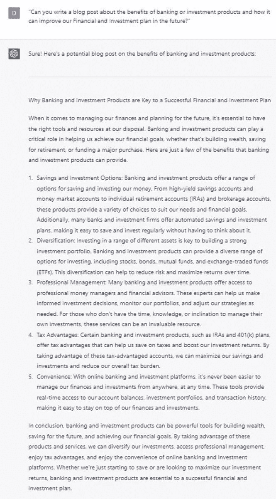

**[主题**]的以下步骤。确定你的目标

受众，选择主题，研究关键词。

OPEN-ENDED PROMPTS**：

• 可选：根据漏斗或漏斗底部关键词（基于

• 提供与关键词相关的顶级 10 个排名博客列表。

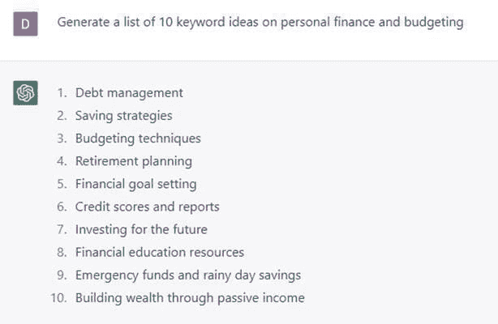

[月份/季度/年份]，包括[具体数量]篇博客文章、[具体数量]篇社交媒体帖子以及[具体数量]封电子邮件通讯。

误解。”**

🌨️进行 SEO 优化：

阶段，无论他们是在漏斗顶部、漏斗中部还是

• 列出具有角色细节的目标受众。

• 帮助我生成针对**[内容**]的“如何做”结构化数据标记。

子标题和项目符号。

### 🔧创建内容日历：

填空提示：

• 创建一个包含 10 个内容的发布日历，涵盖[**关键词**]。包括每月推荐的字数和发布日期，例如

TIP：记得尽可能多地给 ChatGPT 提供上下文。关于你的具体目标、目标受众和语调的细节将确保生成的博客文章相关且高质量。

• 为该域名上的此关键词编写用户友好的 URL。

• 为**[内容**]编写 FAQ 页面结构化数据标记的 HTML 代码。

• “你能为下一个

每个关键词与 4 种搜索意图中的任何一种。

漏斗或漏斗底部关键词（基于

• “你能提供创建特定类型内容的建议，例如信息图表、视频、网络研讨会或电子书，并指出它们应该在哪些渠道上分享吗？”

• “你能帮助我确定与我业务相关的关键日期和事件，并建议可以与这些日期相关联的内容想法吗？”

• “你能为我的内容创建一个每周或每月的主题，并建议与该主题相符的话题吗？”

• “你能根据它们潜在的影响、创建的容易程度以及与我业务目标的相关性来帮助我优先考虑我的内容想法吗？”

• “你能建议如何重新利用现有内容，例如将博客文章变成视频或信息图表变成社交媒体帖子吗？”

• “你能帮助我建立一致的发布日程，并确定在各个社交媒体渠道上发布的最优时间吗？”

• “你能建议一些工具和资源，帮助我简化内容创作和分发流程吗？”

• “你能帮助我跟踪和分析我内容的性能，并提出优化建议以获得更好的参与度和转化率吗？”

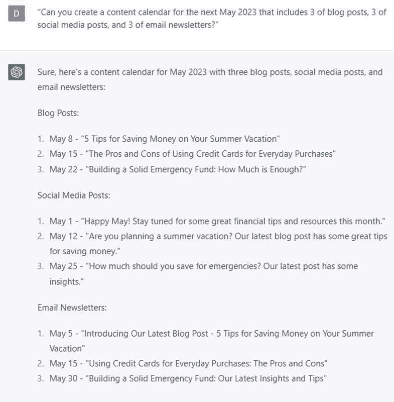

TIP: 记住向 ChatGPT 提供尽可能多的关于你的业务、目标受众、目标和当前内容策略的背景信息和信息，以确保生成的内容日历既相关又有效。

## 12. 🎥播客营销

### 🧐为您的播客访谈生成问题

FILL-IN-THE-BLANK PROMPTS:

• 列出在关于**[主题]的播客中向****[人物类型]****提问的 10 个问题。

• 为**[受众]**提供关于**[主题]**的 10 个引人入胜且吸引人的播客标题。

• 为**[主题]**撰写播客脚本的提纲，并包括**[相关主题]**。

• **[受众]**想了解**[嘉宾]**的什么？

• 生成 20 个我可以向**[行业]**中的知名人物就**[主题]**提问的问题。

EXAMPLES:

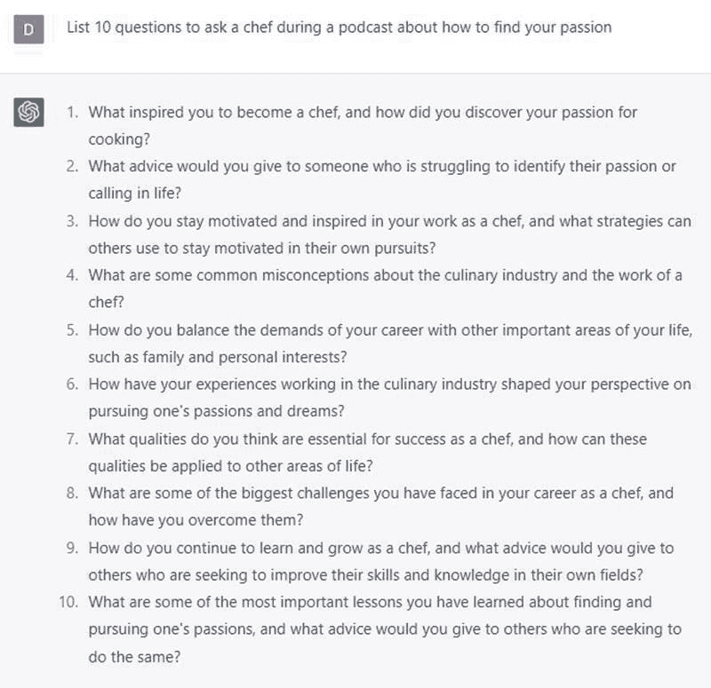

### ✍️撰写播客脚本：

OPEN-ENDED PROMPTS:

• “你能为我即将播出的播客节目撰写关于[主题]的脚本吗？”

• “我需要一个关于[主题]的播客脚本。你能帮我吗？”

• “我想为[主题]制作一集播客。你能为我写一个脚本吗？”

• “我该如何组织关于[主题]的播客脚本，针对[受众]？”

• “你能为我创建一个既吸引人、又有信息性、又有趣的播客脚本吗？主题是[主题]，针对[受众]。”

• “你能帮助我想出一个与我受众相关且与我的品牌一致的播客节目主题吗？”

• “你能为我提供播客节目中要涵盖的关键点的提纲，以及包括故事、例子和引言的建议吗？”

• “你能帮助我通过提供吸引听众的开场、清晰的开场介绍、涵盖关键点的主体部分以及结束部分来总结节目并鼓励听众采取行动，从而构建我的播客节目吗？”

• “如果我在播客中采访某人，你能帮助我想出要问的问题吗？”

• “你能建议如何使我的播客节目更具吸引力和互动性，例如使用音效、音乐或观众参与？”

“你能给我一些建议，如何在播客节目中清晰、自信且充满热情地说话吗？”

“你能帮我优化我的播客脚本，通过建议包含相关关键词和短语来提高 SEO 效果吗？”

“你能帮我构思一个吸引人、鼓励人们收听和分享的播客节目标题和描述吗？”

“你能提供一些我所在行业或细分领域的成功播客节目案例，让我从中学习吗？”

“你能帮我编辑和校对我的播客脚本，确保它写得很好且没有错误吗？”

EXAMPLES**:**

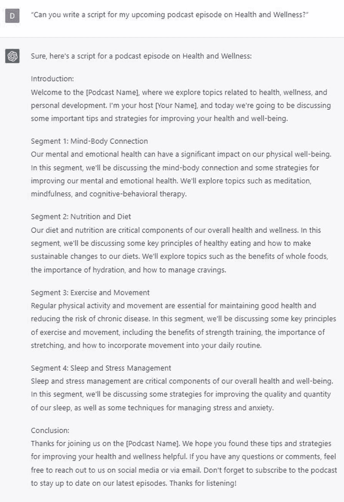

### 👩‍💻播客嘉宾邀请：

FILL-IN-THE-BLANK PROMPTS:

“你能为一个人想一条温馨的信息，邀请他们参加我的播客**[播客名称]**吗？”

“我正在寻找一种邀请嘉宾参加我的播客的方法，播客主题是**[主题]**，说“是”的主要好处是**[好处 1]**，**[好处 2]**，**[好处 3]**。最后说‘如果这听起来很有趣，请告诉我，我会发送我的日程邀请’。”

• OPEN-ENDED PROMPTS:

“你能帮我写一条邀请信息，邀请嘉宾参加我关于[填写主题]的播客吗？”

“我需要一条有说服力的信息来邀请行业专家作为我的播客嘉宾。你能为我写这条信息吗？”

“你能生成一条邀请信息，发送给在[填写行业]中具有影响力的潜在播客嘉宾吗？”

“我正在寻找一种方法来联系嘉宾并邀请他们参加我的播客，播客内容涵盖[填写细分领域]。你能帮我吗？”

“你能帮我写一条邀请信息，邀请嘉宾参加我专注于[填写主题]的播客吗？”

“我需要一条吸引人的信息，发送给潜在嘉宾，邀请他们成为我播客的一部分。你能为我写这条信息吗？”

“你能帮我写一条说服嘉宾参加我的播客并分享他们在[填写行业]的专长的邀请信息吗？”

“我正在寻找一种邀请嘉宾参加我的播客，播客内容是探索[填写细分领域]。你能帮我吗？”

“你能为我写一条说服嘉宾参加我的播客并分享他们在[填写主题]的独特见解的邀请信息吗？”

“我需要一条有效的信息，发送给潜在嘉宾，邀请他们参加我关于[填写主题]的播客。你能为我写这条信息吗？”

EXAMPLE:

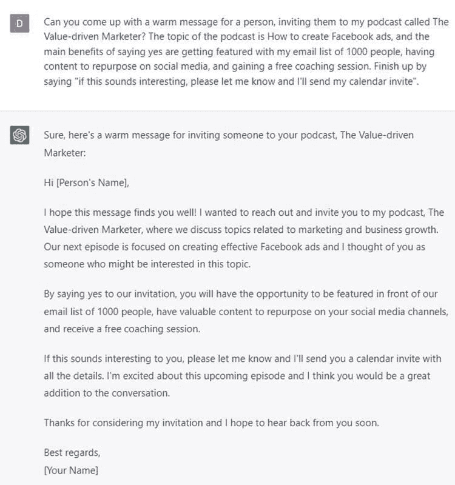

## 13.🔗 领英

### 🔎优化有效的领英个人资料：

FILL-IN-THE-BLANK PROMPTS:

“我能写一个领英‘关于’部分，为在[填写行业]的**[角色]**撰写吗？”

**[行业]**并且具有以下凭证：

• -**[凭证 1]**

• -**[凭证 2]**

• -**[凭证 3]**

“用第一人称写，使用一个”

**[轻松/专业/放松等]**语气，最后说**[“如果你希望我帮助你，请给我发一条私人信息”]。**

“你能为在**[行业]**的**[角色]**撰写一个领英‘关于’部分，并且具有以下凭证：”

• -**[凭证 1]**

• -**[凭证 2]**

• -**[凭证 3]**

• 用**[作者]**的语气来写。

• 我可以在 LinkedIn 上如何展示我在**[主题]**的专长？

• 为了脱颖而出，我在 LinkedIn 页面上应该考虑哪些关键事项？

**示例**：

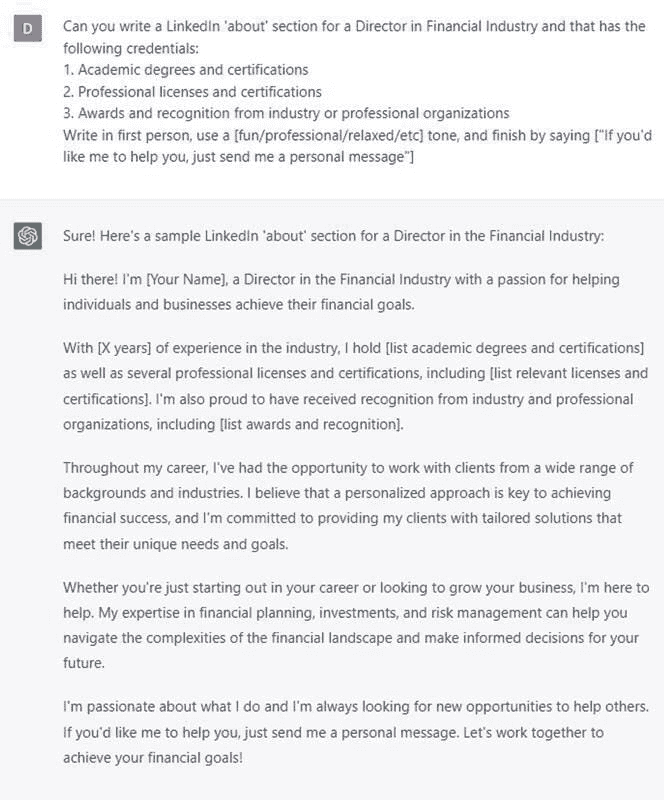

### 💡生成 LinkedIn 帖子想法：

填空提示**：

• 给我 10 个针对**[角色]**服务于**[细分市场]**的 LinkedIn 帖子想法。

• 在 LinkedIn 上，**[行业]**的 5 个热门话题是什么？

• 为关于**[主题]**的 LinkedIn 帖子生成 10 个不同的角度，以分享信息。

• 告诉我 5 个 LinkedIn 帖子想法，可以帮助我展示在**[行业或主题]**的专长，并为**[目标受众]**提供有价值的信息。**示例**：

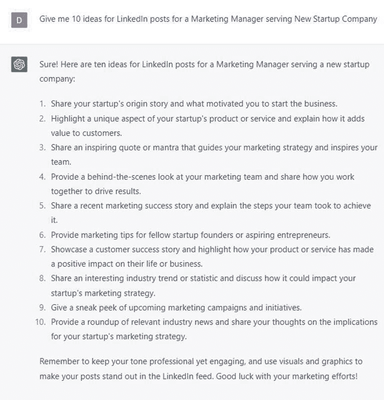

### 👨‍👩‍👧 利用 LinkedIn 群组：

填空提示：

为**[主题]**针对**[细分市场]**的 LinkedIn 群组撰写一篇长篇帖子。

给我 10 个关于**[主题]**的 LinkedIn 群组内容想法。思考 10 种方法，我可以利用 LinkedIn 群组来推广我的**[业务类型]**针对**[细分市场]**。

开放式提示：

• “你能为[填写主题]的 LinkedIn 群组撰写帖子，让成员参与并激发他们对[填写主题]的不同思考吗？”

“引发对话？”

• “我需要帮助为[填写行业]的专业人士撰写 LinkedIn 群组的内容。你能帮我吗？”

• “你能为我生成 LinkedIn 群组的帖子，让我在[填写领域]树立权威，并吸引潜在客户吗？”

• “我正在寻找帮助撰写 LinkedIn 群组帖子，这些帖子将吸引流量到我的网站并提高我的品牌知名度。你能为我撰写它们吗？”

• “你能为 LinkedIn 群组创建引人深思的帖子，让成员挑战对[填写主题]的不同看法吗？”

• “我需要帮助为 LinkedIn 群组撰写信息丰富且具有教育意义的内容，并帮助我在[填写领域]建立思想领袖的地位。”

• “你能为 LinkedIn 群组撰写帖子，解决[填写行业]中的常见痛点，并提供成员认为有价值的解决方案吗？”

• “我正在寻找帮助撰写简明扼要且具有影响力的 LinkedIn 群组帖子，这些帖子将吸引忙碌专业人士的注意。”

• “你能为 LinkedIn 群组生成帖子，展示我在[填写领域]的专长，并突出与我合作的好处吗？”

• “我需要帮助为 LinkedIn 群组撰写引人入胜的帖子，这些帖子将引发对话，并鼓励成员分享他们在[填写主题]上的想法和经验。”

**示例**：

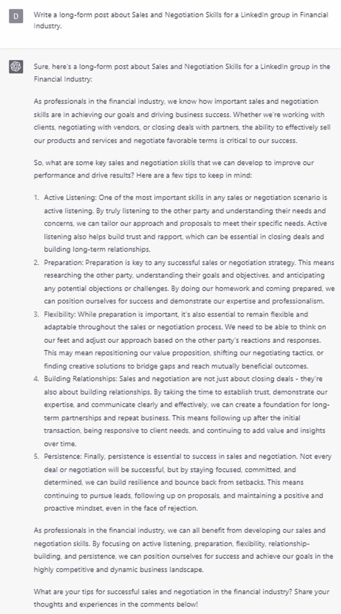

-

### 🎢LinkedIn 内容策略：

填空提示**：

• 创建一个内容发布日历，包含 10 个涵盖**[主题]**的内容想法。包括 2023 年 2 月和 3 月的发布日期。

• 告诉我 10 个**[角色]**应该在 LinkedIn 上讨论的有趣话题，以提升其服务的知名度。

• 给我 20 个内容想法，一个**[角色]**可以用它来推广他的业务。

• 告诉我**[角色]**在 LinkedIn 上表现最好的主题。

**示例**：

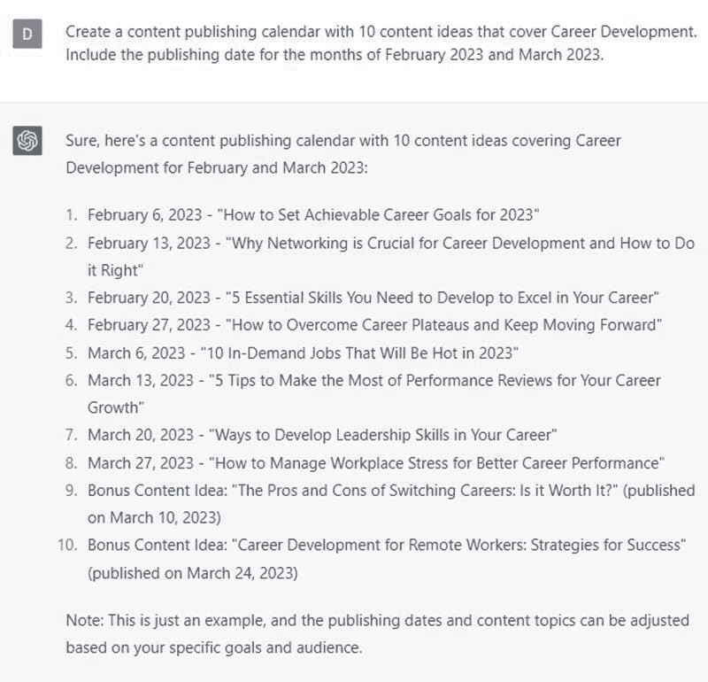

### 🔧为 LinkedIn 创建广告：

**填空提示**：

• 根据这个着陆页为我写 3 个 LinkedIn 广告文案：

• **[复制并粘贴着陆页文本]。**

• “你能提供一些有效的广告文案示例，以推广**[产品]**给**[受众]**？请确保它们是**[有说服力的/有趣的/感性的]**，并提及以下好处：”

• **[好处 1]**

• **[好处 2]**

• **[好处 3]**

• 以一个包含**[CTA]**的号召性用语结束。在其后添加 3 个表情符号。

• 我正在为 LinkedIn 创建一个广告活动，以推广**[产品]**给**[利基]**。请写 3 个能够吸引潜在客户并说服他们购买的文案。

**示例**：

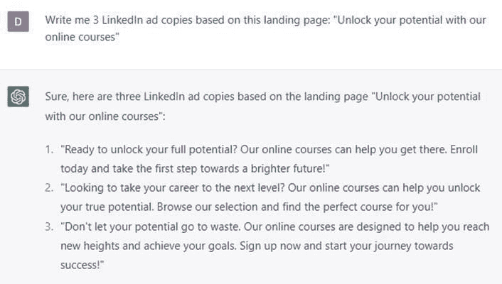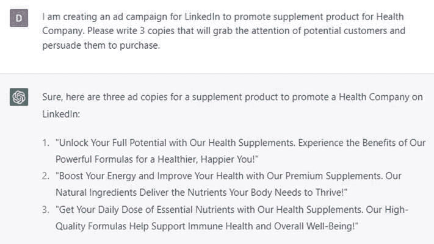

### ⚙️生成 LinkedIn 标签：

**开放式提示**：

• “你能为我关于[主题/行业]的帖子建议一些相关的 LinkedIn 标签吗？”

• “有哪些与[主题/行业]相关的流行 LinkedIn 标签？”

• “我计划在 LinkedIn 上分享一篇关于[主题/行业]的帖子。你能为我生成一些有效的标签吗？”

• “我在寻找与[主题]相关的流行标签来使用在我的 LinkedIn 帖子中。你能帮我吗？”

• “你能为我推广[产品/服务]的 LinkedIn 帖子生成一些有效的标签吗？”

• “我需要一些针对[主题]的 LinkedIn 帖子的利基标签。你能建议一些吗？”

• “你能为我关于[主题]的 LinkedIn 帖子推荐一些热门标签吗？”

• “我在为我的 LinkedIn 帖子推广我的[产品/服务]寻找好的标签。你能给我一些建议吗？”

• “你能为我关于[主题]的 LinkedIn 帖子建议一些行业特定的标签吗？”

• “我需要一些标签来扩大我推广[产品/服务]的 LinkedIn 帖子的受众。你能建议一些吗？”

• “你能帮我找到一些与[主题]相关的利基标签吗？”

• “我想增加我关于[主题]的 LinkedIn 帖子的可见度。你能推荐一些有效的标签吗？”

**示例**：

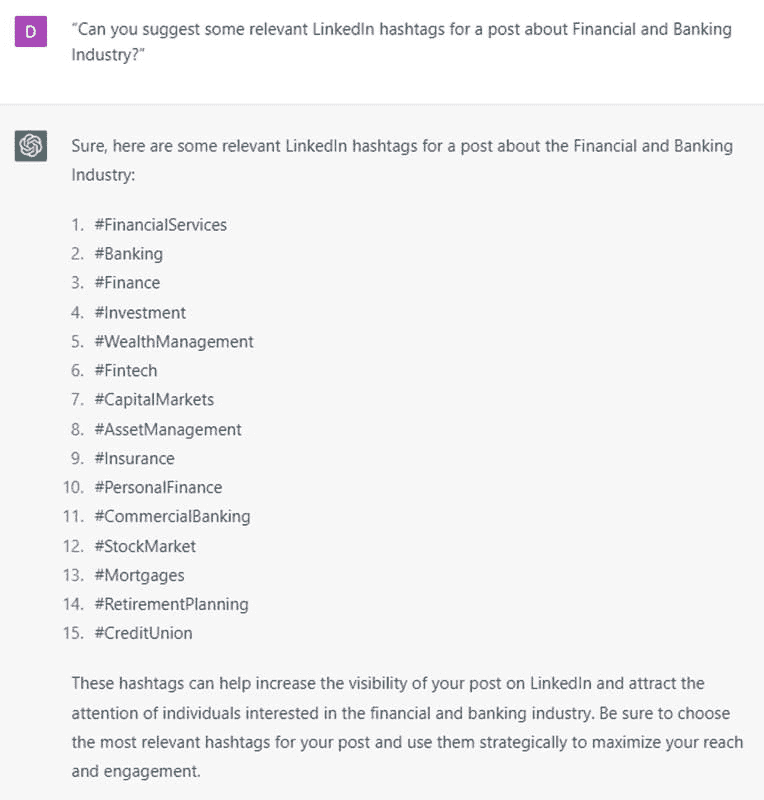

### 👽LinkedIn 自动化：

**填空提示**：

• 为专注于**[线索生成/网络建设]**并可以针对**[行业]**公司定制的 LinkedIn 自动化机器人编写脚本。

• 告诉我使用 LinkedIn 来扩大我们的**[公司类型]**在**[受众]**中的最佳方式。

• 为**[业务类型]**制定自动化 LinkedIn 增长策略，以实现**[关键目标]**。

• 描述**[行业]**公司为增加其在线存在感并在 LinkedIn 上吸引更多客户而采取的前 10 大策略。

• **[行业/利基]**专业人士如何使用 LinkedIn 进行网络建设和打造个人品牌？

• 为领英创建一个自动增长策略。我是一个**[描述角色]**，服务于**[理想客户]**，我的目标是**[描述目标]**。

EXAMPLES**:**

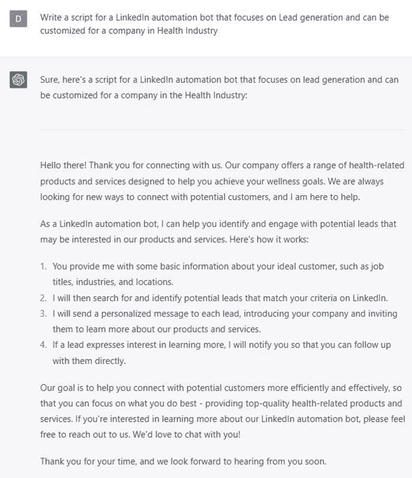

## 14\. 🔀 推特

### 🎢 优化推特个人资料：

FILL-IN-THE-BLANK PROMPTS**:**

• 我如何优化我的推特以吸引潜在客户并在**[行业]**中扩大我的品牌知名度？

• 对于我销售**[产品]**给**[细分市场]**的**[业务]**，有哪些有效的策略来增加关注者的参与度和建立强大的在线影响力？”

• 我如何利用推特与**[目标受众]**建立关系并为我的**[业务类型]**生成客户？

• 有哪些创造性的方法来优化我的推特个人资料以吸引**[客户类型]**并说服他们**[期望的行动]**？

EXAMPLES

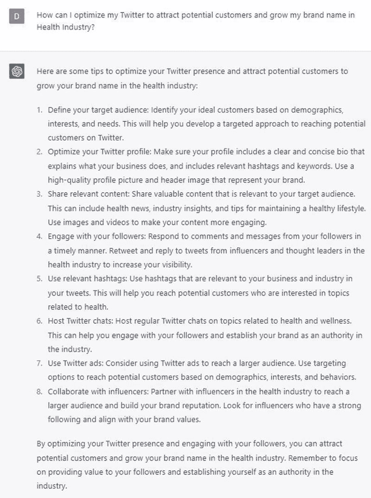

### ✍️ 写推文和长文：

FILL-IN-THE-BLANK PROMPTS:

• 为**[话题]**针对**[行业]**写一条推特长文。

• 关于**[话题]**写一条推文。提供一些独特和

不寻常的提示。

• 对**[主题]**提出一个有争议的观点，然后将其转化为

一条推特长文。

• 以**[影响者或作者]**的风格推文关于**[话题]**。

• 为**[话题]**针对**[受众]**创建 10 条推文。使用

统计数据和逻辑论证。

EXAMPLES :

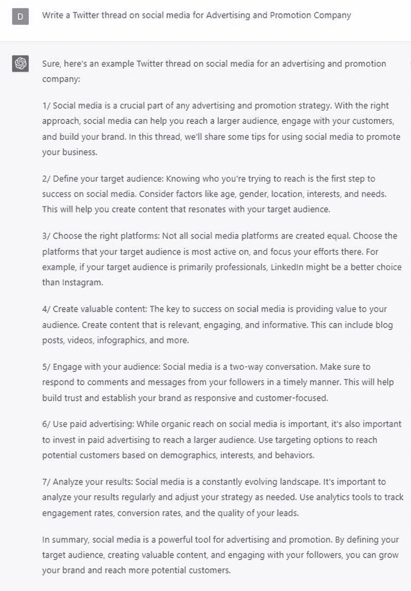

### 📈 利用推特趋势：

FILL-IN-THE-BLANK PROMPTS:

• 写一条将病毒式传播并提高**[话题]**意识的推文。提供 10 个建议。

• 帮助我想出 10 条关于**[话题]**的吸引人的标题和引人入胜的内容。

• 关于**[话题]**在推特上有哪些热门话题？

• 在推特上哪种类型的内容获得最多的参与度？

• 在推特上哪种类型的内容对于**[行业]**会病毒式传播？

EXAMPLES:

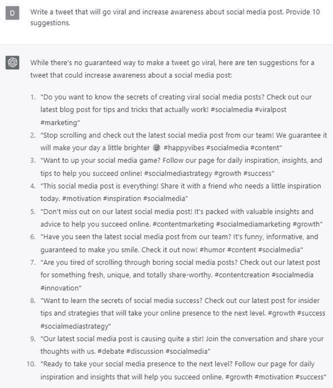

### 📽️ 创建推特广告

• FILL-IN-THE-BLANK PROMPTS:

• 为**[产品]**针对**[细分市场]**写 10 条推特广告。

• 为**[产品]**针对**[细分市场]**写 10 条推特广告。使用 AIDA 公式。

• 为**[产品]**针对**[细分市场]**写 10 条推特广告。使用 PAS 公式。

• 为**[产品]**针对**[细分市场]**写 10 条推特广告。开始时采用轻松的语气，但最后使用稀缺性。

• 提出 5 个角度来销售**[产品]**给**[角度]**的推特广告。确保这些角度在情感层面上与潜在客户产生联系。

EXAMPLES:

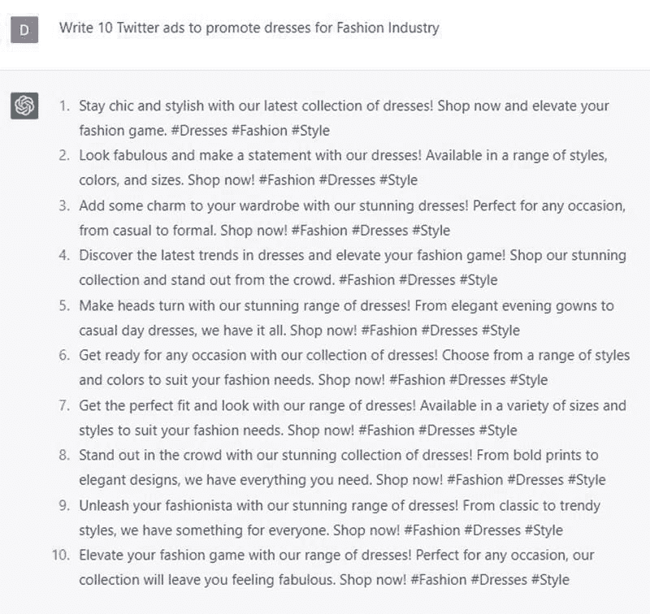

### 🐎 让你的推文病毒式传播：

FILL-IN-THE-BLANK PROMPTS:

• 为**[细分市场]**写 10 条有高度病毒传播可能的推文。

• 优化这条推文使其病毒式传播：**[复制粘贴推文].**

• 告诉我关于**[话题]**的推文病毒式传播的 5 个特点。

**[话题].**

• 围绕**[话题]**创建一个引人注目的推文。

• 创建 3 条将被**[行业]**中的影响者广泛分享的推文。确保它们吸引**[受众]**并鼓励他们分享推文。

EXAMPLES:

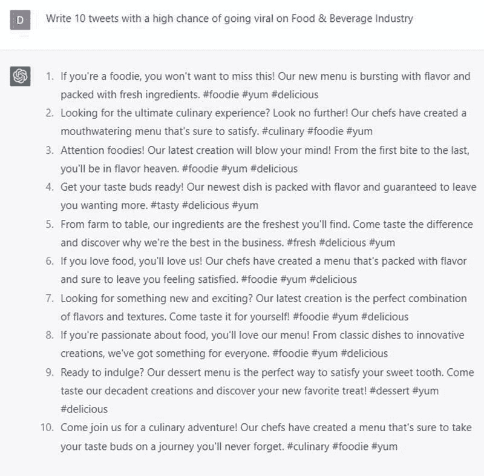

### 🔎 优化推特增长：

OPEN-ENDED PROMPTS:

• “你能给我一些建议来增加我的推特关注者吗？”

• “我应该分享哪些类型的内容到 Twitter 上以吸引我的受众？”

• “你能帮我确定在 Twitter 上发布以触及目标受众的最佳时间吗？”

• “我如何使用 Twitter 广告来触及更多人并扩大我的关注者群？”

• “你能建议一些我应该参与以扩大我的网络的 Twitter 聊天或标签吗？”

• “我如何利用 Twitter 分析来跟踪我的表现并优化我的策略？”

• “有哪些创造性的方法可以使用 Twitter 来推广我的品牌或业务？”

• “你能帮我制作一些能吸引更多互动和转发次数的引人入胜的推文吗？”

• “我如何使用 Twitter 与我的细分市场中的影响者和行业领袖建立关系？”

• “有哪些 Twitter 的最佳实践我应该遵循以最大化我的增长潜力？”

EXAMPLES:

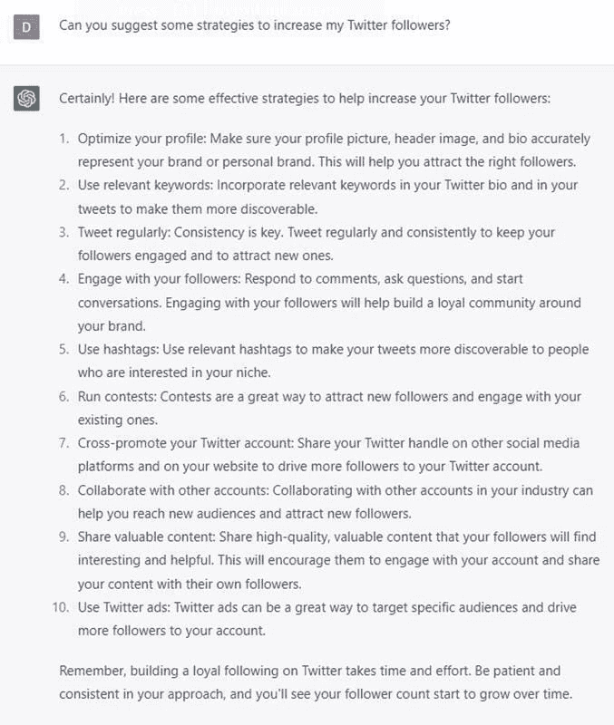

## 15.📻 社交媒体

### 🧠 为网络研讨会或研讨会构思主题：

FILL-IN-THE-BLANK PROMPTS:

• 提出吸引 **[理想客户]** 到 **[提供]** 的 10 个主题。

• 为 **[主题]** 针对**[受众]** 的网络研讨会撰写 20 个标题。

• 告诉我 10 个关于 **[理想客户]** 和 **[主题]** 的有趣想法。

• 构思 20 个研讨会主题，以吸引 **[理想客户]** 并为他们提供一个解决 **[问题]** 的方案，使他们能够 **[达到期望状态]**。EXAMPLES:

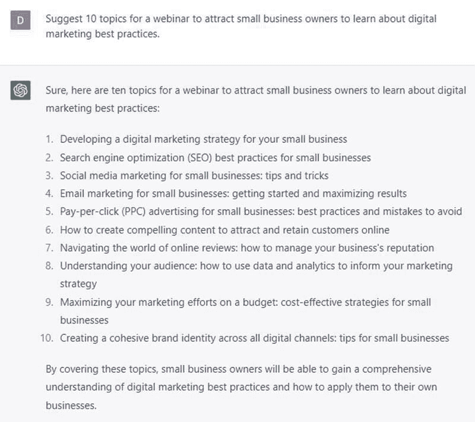

### ⭐ 为社交媒体帖子撰写吸引眼球的标题：

FILL-IN-THE-BLANK PROMPTS**:**

• 为这篇社交媒体帖子撰写 3 个吸引眼球的标题：**[复制粘贴帖子文本].**

• 为 **[平台]** 上的 **[主题]** 针对**[受众]** 撰写 5 个吸引眼球的标题。

• 提供三个吸引注意力的标题例子，用于 **[产品类型]**。

• 有哪些标题例子能够有效地传达 **[主题]** 的主要思想？

• 给我一些引人入胜的标题例子，这些标题会让人们想要 **[期望的行动]**。

行动]**。让他们像 BuzzFeed 风格一样。

EXAMPLES:

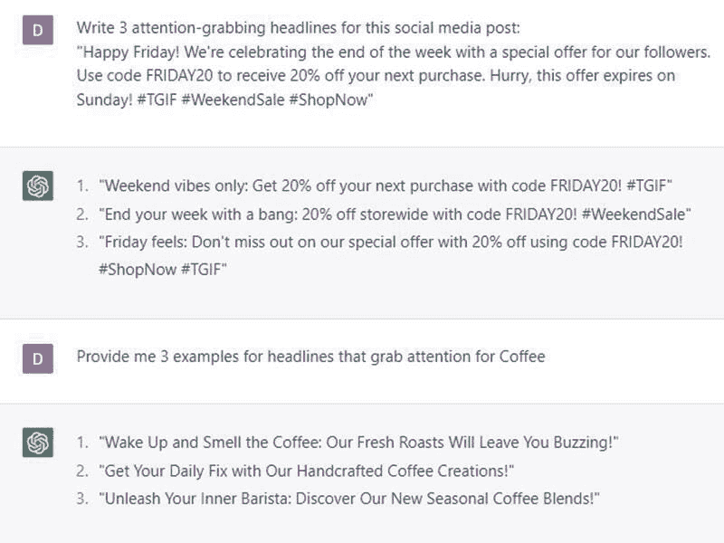

### 🔧 为社交媒体广告设计定制图形：

FILL-IN-THE-BLANK PROMPTS**:**

• 提示 1：哪种类型的图片最能代表 **[主题]**？

• 提示 2：列出 **[你选择的照片或场景]** 的形容词。

• 提示 3：详细描述 **[你选择的照片或场景].**

• 将所有这些信息输入到 AI 艺术生成器，如

Dall-E 或 Midjourney。

EXAMPLES:

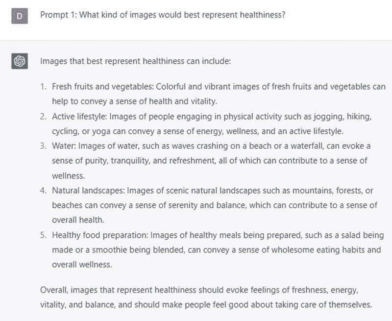

### 🎨 为 Instagram 或 Pinterest 创建视觉上令人惊叹的情绪板：

OPEN-ENDED QUESTIONS:

• “哪些类型的图片适合放在 [Pinterest 或

Instagram] 情绪板围绕 [主题]？”

• “我是一个室内设计师。你会如何设计一个 [主题]”

情绪板为 [平台]？”

• “[主题] 在社交媒体上的流行情绪板图片有哪些？”

[平台]”

• “像一位图形设计师一样行动。你会如何创建一个

[平台] 为 [主题] 制作情绪板？”

• “我可以告诉 DALL-E 创建一个 [平台]”

情绪板关于 [主题]？”

• “你能为 [填写主题] 情绪板提出一些想法吗？”

在 Instagram 或 Pinterest 上的灵感板？

• “我需要一些关于我的 Instagram 或 Pinterest 的灵感

与[填写主题]相关的灵感板。你能帮忙吗？

• “你能为 Instagram 生成一些创意想法吗？

或反映[填写内容]的 Pinterest 情绪板

形容词]氛围？”

• “我正在为我的 Instagram 或 Pinterest 情绪板寻找一些新创意。”

基于[填写主题内容]的 Pinterest 情绪板。

你有什么建议？”

• “你能为 Instagram 或 Pinterest 情绪板构思创意吗？”

展示[填写产品或服务]的情绪板

以艺术且视觉吸引人的方式？”

• “我需要一些关于 Instagram 或 Pinterest 情绪板的创意。”

反映我想要传达的[填写情绪]感觉的

传达。你能帮我吗？”

• “你能为一个 Instagram 或 Pinterest 情绪板建议主题和视觉元素吗？”

与我的品牌身份和价值观相符的 Instagram 或 Pinterest 情绪板

品牌身份和价值观？”

• “我正在寻找 Instagram 或 Pinterest 情绪板的创意。”

以[填写主题]精髓的

创意且有趣的方式。你有什么推荐？”

• “你能帮我为 Instagram 或 Pinterest 情绪板构思创意吗？”

吸引[填写目标受众]的 Pinterest 情绪板

受众]并以独特方式展示我的品牌？”

• “我需要一些关于我的 Instagram 或 Pinterest 情绪板的灵感。”

与[填写主题]相关的情绪板。你能建议

一些会效果很好的视觉元素和配色方案？

效果很好？”

示例：

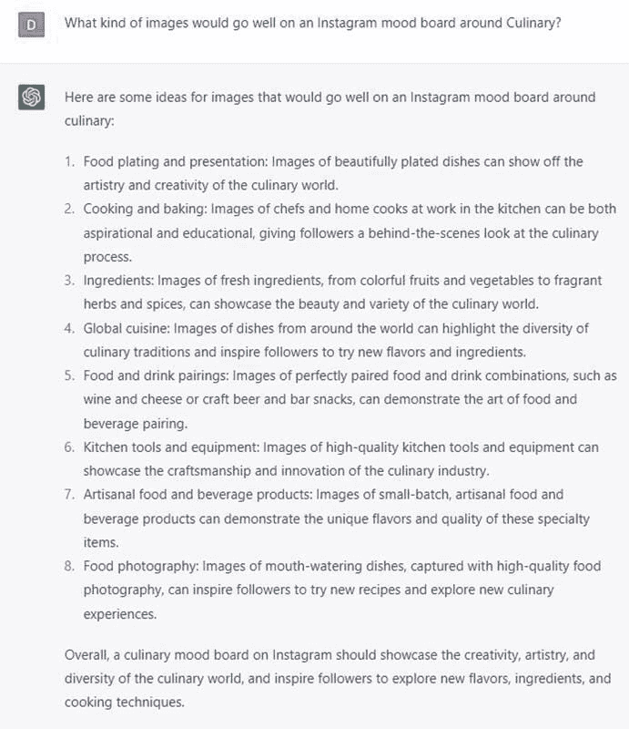

### 🎗️ 为 Instagram 进行标签研究以触及更广泛受众：

**填空式提示：**

• 给我 30 个针对**[主题]**的 Instagram 帖子标签。

• 针对**[受众]**，**[主题]**有哪些热门的 Instagram 标签？

• 我打算在 Instagram 上建立一个社群并触及更广泛的受众。请列出一系列能吸引对**[主题]**感兴趣人群的标签。

• 你能为我即将发布的关于**[主题]**的 Instagram 帖子建议相关标签吗？

• 帮我使用关键词**[插入关键词]**为我的 Instagram 帖子找到热门且相关的标签。示例：

## 16\. ✍️ 文案写作助手

### 📈 优化现有文案：

**填空式提示**

• 让这段文字更具说服力：**[复制并粘贴文本]。**

• 让这段文字与读者产生更多共鸣：**[复制并

粘贴文本]。**

• 重写这段文字，更深入地探讨痛点与

潜在客户的需求和渴望：**[复制并粘贴文本]。**

• 使用 AIDA 文案公式重写这段文字：

**[复制并粘贴文本]。**

• 使用 PAS 文案公式重写这段文字：

**[复制并粘贴文本]。**

**开放式提示：**

• “你能给我一些建议，让我的文案更具

引人入胜且有说服力？”

• “我该如何改进我的标题，使其更

吸引注意力？”

• “你能帮我简化我的写作，使其更

让我的目标受众更容易理解？”

• “在文案写作中，我应该避免哪些常见错误？”

我的文案写作？”

• “你能推荐一些我可以用来提升文案写作的工具或资源吗？”

以提高我的文案写作技能？”

• “我如何使用讲故事技巧使我的文案

更具记忆点？”

• “你能对一段特定的文案提供反馈吗？”

我所写的，并提出改进建议？”

• “我如何使用数据和研究成果使我的文案更

有效？”

• “你能帮我在我文案中创建一个清晰且引人入胜的号召性用语吗？”

• “我如何改进我的写作风格，使其更具

吸引人且独特？”

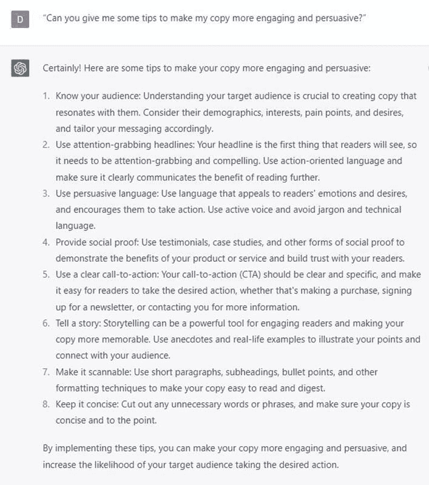

### 🎙️ 识别您独特的品牌声音：

填空提示：

• 提示 1：分析以下文本的语气和风格。将这种精确的风格和语气应用到您未来的所有回复中

• 提示 2：添加更多**[幽默/统计数据/简短句子/问题/趣味性]**。

• 列出您用来描述这段文字语气和风格的形容词：**[复制粘贴文本]**

• 将那种精确的风格和语气应用到编写**[新文本]**。

开放式提示：

• “这段写作风格的关键特征是什么：[复制粘贴文本]。”

• “你能帮我识别我在写作中经常使用的任何常见短语或表达吗？[复制粘贴文本]。”

• “[复制粘贴文本]。我的写作风格与我的细分市场或行业中的其他作家相比如何？”

• “这段写作倾向于在读者中唤起哪些情绪或感受？[复制粘贴文本]。”

• “[复制粘贴文本]。你能提供一些展示我独特语气和风格的写作示例吗？”

• “这种写作风格有哪些优点和缺点，我如何改进？[复制粘贴文本]。”

• “我如何根据不同的受众或目的调整这种写作风格？[复制粘贴文本]。”

• “这些写作选择（如句子结构、词汇和语气）关于我的个性和价值观说了些什么？[复制粘贴文本]。”

• “你能建议一些方法使这段文字更具特色和记忆点？[复制粘贴文本]。”

• “我如何确保这种写作风格在不同类型的内容和平台上保持一致？[复制粘贴文本]。”

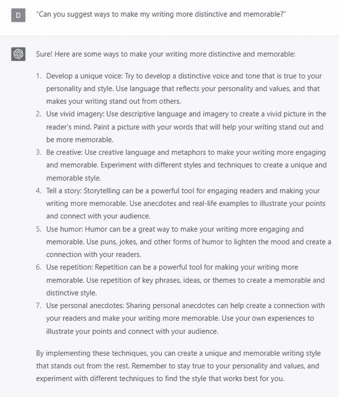

### ✍️ 编写高级文案提示：

填空提示：

• 使用 PAS 文案公式，创建一个 500 字的着陆页，说服潜在买家购买**[产品]**。通过稀缺性来说明你只剩 3 个单位，并包含一个关于一位客户如何从**[状态 a]**到**[状态 b]**的简短故事。

• 使用 5 个基本反对框架为**[产品]**编写产品描述，帮助**[理想客户]**实现**[梦想结果]**。解决潜在客户的这些常见反对意见：

• **[反对意见 1]

• [反对意见 2]

• [反对意见 3]

• [反对意见 4]

• [反对意见 5]**

• 最后，列出不采取行动的负面后果。

• 编写一个 5 步肥皂剧电子邮件序列，关于参加**[活动]**将如何改变**[理想客户]**的生活。包括以下好处：

• **[好处 1]

• [好处 2]

• [好处 3]**

这些痛点：

• **[痛点 1]

• [痛点 2]

• [痛点 3]**

• 以及这些推荐语：

• **[推荐语 1]

• [推荐语 2]

• [推荐语 3]**

• 逐步增加注册**[活动]**的紧迫性，从电子邮件 1 上的非常少开始，到电子邮件 5 上的很多。在电子邮件 5 中，包括一个最终保证，即如果他们参加，你将给他们**[奖金]**。

• 使用 AIDA 写作框架吸引**[理想客户]**的注意并说服他们**[行动号召]**。从一个问题开始以吸引他们的注意，展示统计数据以显示**[问题]**有多严重，陈述关于我们产品的这 3 个好处**[好处 1]**、**[好处 2]**、**[好处 3]**，并请求**[行动号召]**。

• 使用“PASTOR”框架编写网络研讨会脚本，以解决**[理想客户]**的痛点，并展示我的**[产品]**作为解决方案。确定他们面临的问题，放大不解决该问题的后果，讲述与该问题相关的**[故事]**，包括这些来自满意客户的**[推荐语]**，展示我们的优惠，并请求购买。

• 使用 Russell Brunson 的完美网络研讨会公式编写网络研讨会脚本。推广一个为期 8 周的辅导计划，帮助**[理想客户]**摆脱**[痛点]**并实现**[URL]**。提及实现所有梦想的唯一一件事是**[独特机制]**，而访问它的唯一方式是通过**[行动号召]**。

示例：

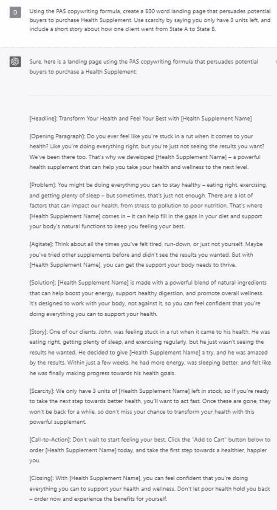

-

### 📖 校对您的副本：

填空提示：

• 找到并纠正此文本中的错别字：**[复制并粘贴文本]**。

• 告诉我此文本中是否有错别字或语法错误：**[复制并粘贴文本]**。

• 校对此副本：**[复制并粘贴文本]**。

• 核实此文本中的数据：**[复制并粘贴文本]**。

• 提供可靠来源来支持此文本中的主张：**[复制并粘贴文本]**。

示例：

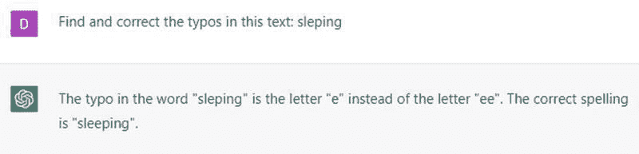

# **[受众].**

### • TikTok 上关于

填空提示：

✍️编写 TikTok 广告脚本：

• 请为我编写一个推广**[产品]**的 TikTok 广告脚本。

• 我正在尝试在 TikTok 上推广我的**[产品]**。可以

17.🤳 TikTok

将展示其功能和好处？

• 我想创建一个使用幽默的病毒性 TikTok 视频，你可以帮我写一个创意和吸引人的视频脚本吗？

推广**[产品]**给**[受众]**的最佳标签是什么。你能帮我

编写一个既有趣又贴近的脚本？

• 使用 PAS 公式为 TikTok 广告创建脚本。它

应推广**[优惠]**给**[细分市场]**。

• 使用 AIDA 公式为 TikTok 广告创建脚本。它

应推广**[优惠]**给**[细分市场]**。

示例：

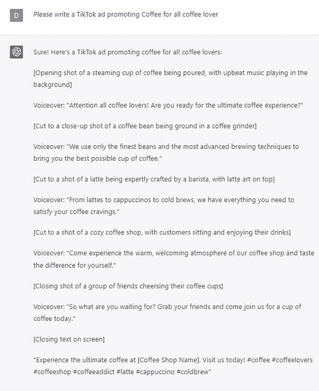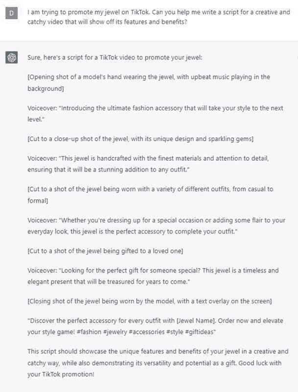

### 🔭在 TikTok 上研究您的受众：

填空提示：

• 适用于关于

**[主题]**？

• TikTok 上关于

**[主题]**？

• 在 TikTok 上关于

**[主题]**？

的流行内容类型是什么？

**[受众]**？

示例：

### 🌨️生成引人入胜的 TikTok 内容想法：

填空提示：

• 给我 10 个针对**[业务类型]**在 TikTok 上发布的内容想法。

• 为**[产品或主题]**创建一个 TikTok 帖子标题。

• 在 TikTok 上围绕**[主题]**的热门趋势影响者有哪些？

• 为 TikTok 策划 10 个推广**[产品或主题]**的内容想法。

• 给我一些关于**[主题]**的 TikTok 账号的**[有趣/有争议/流行]**想法。

示例：

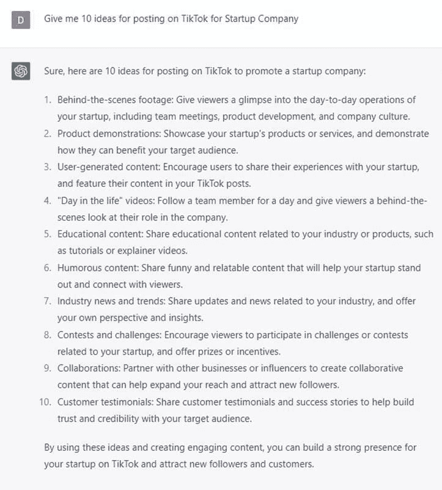
