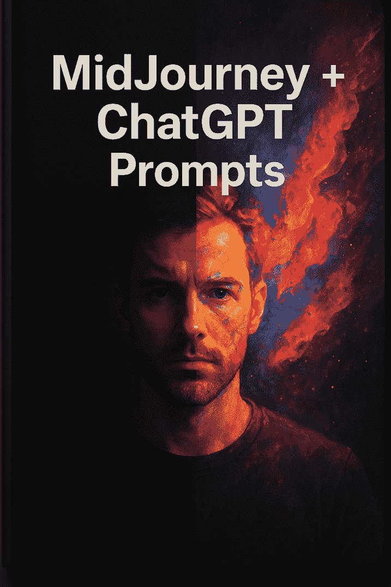

# 1001 个 Midjourney + ChatGPT 为 AI 设计师提供的提示

> 原文：[1001 Midjourney + ChatGPT Prompts for AI Designers](https://annas-archive.gl/md5/e1b07006e969a94cdfa579a82854459c)
> 
> 译者：[飞龙](https://github.com/wizardforcel)
> 
> 协议：[CC BY-NC-SA 4.0](https://creativecommons.org/licenses/by-nc-sa/4.0/)

🧠第一部分：ChatGPT 为 AI 设计师提供的提示（50 个）

🎨品牌与视觉识别

1. “为简约科技初创公司生成 5 个品牌风格指南。”

2. “为可持续时尚品牌建议一个调色板和字体搭配。”

3. “为针对 Z 世代的奢侈护肤品牌创建品牌识别。”

4. “为环保电动自行车公司设计 3 个标志概念。”

5. “描述一个构建信任和简单性的金融科技应用程序的视觉识别。”

🖌️图形设计与布局

1. “为 SaaS 网站建议 10 种着陆页布局结构。”

2. “为加密钱包移动应用程序生成图形想法。”

3. “为 AI 咨询公司设计 3 个英雄横幅概念。”

4. “提供 5 个针对高转化率的行动按钮设计。”

转化。

5. “解释如何在网页设计中有效地使用空白。”

📱UI/UX 设计提示

1. “为健身追踪移动应用程序生成 3 个 UI 流程概念。”

2. “描述通过手机预订酒店的用户旅程。”

3. “为设计生产力仪表板提供 10 个 UX 技巧。”

4. “电子商务网站中常见的 5 个 UI 错误是什么？”

5. “为加密交易应用程序设计深色模式调色板。”

✏️字体、图标与视觉元素

元素

1. “列出 5 种未来赛博朋克设计的字体搭配。”

2. “为旅行预订应用程序生成图标想法。”

3. “在标志设计中，我可以使用哪些视觉隐喻来表示‘速度’？”

4. “为博客文章页面建议一个视觉层次布局。”

5. “为解释区块链创建信息图表概念。”

📐创意概念与活动

1. “为 Instagram 上的 AI 艺术品牌设计 3 个帖子轮播概念。”

2. “为智能城市的数字广告牌撰写创意简报。”

3. “为科技通讯提供 10 个 AI 主题插图建议。”

4. “为我提供 5 个生产力应用程序的入门 UI 动画。”

5. “为数字净化品牌概述完整的视觉广告活动。”

🧭目标受众与趋势

1. “如何为 Gen Alpha 设计”

偏好与 Z 世代有何不同？”

2. 2 岁的初创公司创始人。”

3. “列出 2025 年应纳入的 10 个网页设计趋势。”

4. “我应该如何为神经多样性用户设计 UI？”

5. “解释如何为低视力用户设计。”

💼作品集与自由职业工作

1. “为食品配送应用程序的重设计生成 UX 案例研究大纲。”

2. “创建 5 个展示标志设计作品集的提示想法。”

3. “我如何使用 AI 来加速我的自由职业设计工作流程？”

4. “使用 AI 生成的艺术建议 10 个 Behance 项目想法。”

5. “为设计数字宠物应用程序撰写客户简报。”

🧠AI 工具与自动化

1. “我如何使用 AI 更快地生成调色板？”

2. “比较 Midjourney 和 Adobe Firefly 在概念艺术中的应用。”

3. “列出 Midjourney 中最有效的提示结构。”

4. “我如何向 Midjourney 描述抽象视觉风格？”

5. “列出加速线框图创建的 AI 工具。”

🖼美学与设计系统

1. “描述拟物化设计与拟态设计的区别。”

2. “为可扩展的 UI 工具包创建组件列表。”

3. “健康科技移动应用的良好设计系统是什么？”

4. “为旅行预订平台提出图标风格。”

5. “有哪些方法可以在多个平台上创建统一的视觉识别？”

🧳特定设计用例

1. “为数字游牧工作者生产力工具设计 UI。”

2. “为 AR 试穿应用生成 5 个界面想法。”

3. “为太空主题科幻游戏 UI 创建提示。”

4. “为食品配送无人机初创公司提出品牌概念。”

5. “在 Figma 中为初创公司演示文稿创建 3 个布局想法。”

🎨第二部分：中途提示用于

人工智能设计师（50）

格式："风格提示，色调，媒介，照明，宽高比"

1. "未来派仪表盘 UI，霓虹蓝和黑色，数字绘画，发光灯光，--ar 16:9"

2. "环保包装设计，柔和的绿色和棕色，平面矢量，柔和阴影，--v 5"

3. "奢华时尚品牌标志，黑色皮革上的金色箔片，3D 渲染"

戏剧性的照明"

4. "极简主义着陆页，白色和珊瑚色调，UI 线框风格，等距，--ar 9:16"

5. "赛博朋克城市概念艺术，深洋红色和紫色，数字哑光绘画，电影照明"

6. "复古 VHS 主题移动应用 UI，故障效果，暗模式，像素艺术风格"

7. "儿童 AI 机器人插画，卡通风格，鲜艳色彩，水彩纹理"

8. "加密货币交易仪表板，光滑的渐变，拟物化风格"

9. "有机形状的标志设计，土色调，抽象矢量艺术"

10. "干净的移动银行应用

界面，平面 UI，蓝白色调，阴影"

11. "AI 意识数字海报，大胆的排版，故障效果，红色和黑色"

12. "太空旅行 UI 设计，科幻全息风格，青色和紫色调色板"

13. "元宇宙头像定制屏幕，多彩 3D 模型，未来主义美学"

14. "现代健康应用 UI，柔和的粉彩，UI 工具包布局，舒缓的色调"

15. "逼真的智能手表应用概念，健身追踪，光滑 UI"

16. "AI 生成艺术博物馆"

网站的动画 UI 提示，最小化 UI，空白，衬线字体"

17. "破裂表面上的超现实标志"

混凝土墙，金属墨水纹理，灰度"

18. "初创公司英雄部分，等距插画，轻量 UI，引人入胜的 CTA"

19. "复古打字机应用 UI，

单色调色板，怀旧感"

20. "光泽 3D 网页按钮，

玻璃质感，渐变照明"

21. "凤凰鸟的标志设计，部落风格，矢量艺术，鲜艳色彩"

22. "游戏化教育应用的数字艺术提示，卡通 UI"

23. "未来派移动应用界面，半透明层，超宽屏幕"

24. "生态农业 AI 机器人的概念海报，乡村风格，复古字体"

25. "AI

聊天机器人使用中的 AR 应用原型，浮动元素，柔和的光晕"

26. "神经

网络，铬纹理，科学插画"

27. "由

青少年，休闲街头服饰风格，现代 UI"

28. "生产力工具仪表板，模块化布局，柔和渐变"

29. "智能镜 UI 概念，语音助手界面，简约图标"

30. "医疗保健中 AI 的视觉主题，蓝白色，无菌 UI，柔和图标"

31. "餐厅应用界面，温暖色彩，乡村 UI 设计，菜单布局"

32. "音乐流媒体应用重设计，深色模式，霓虹色彩强调"

33. "智能家居控制面板 UI，未来布局，简洁设计"

34. "电子商务时尚网站"

主页，基于网格的布局，中性色调"

35. "视觉风格提示：复古赛博朋克 + 包豪斯字体"

36. "运动追踪应用界面，充满活力的红色和黑色，数据驱动 UI"

37. "‘知识可视化’中途旅程提示，发光的大脑，数据线"

38. "在线学习平台 UI，柔和的蓝绿色，模块化卡片"

39. "移动 UI 的动画微交互，Lottie 风格，活泼的色彩"

40. "AI 驱动的视频编辑布局，时间轴视图，动态工具栏"

41. "业务自动化流程图 UI 设计，平面图标，结构化布局"

42. "‘提示工程师’的图形，平板电脑上的网络手绘"

43. "应用图标设计中途旅程提示，渐变背景，光泽风格"

44. "曲面智能设备屏幕上的 UI 3D 渲染，未来形态"

45. "黑暗幻想游戏 UI 库存屏幕，华丽，中世纪图标"

46. "充满霓虹的科幻标志概念，三角形形状，发光边缘"

47. "AI 办公助手头像的概念艺术，半写实风格"

48. "NFT 画廊应用界面设计提示，黑色和金色，优雅"

49. "极简主义者天气应用，灰度，醒目的字体，无图标"

50. "中途旅程提示：'去中心化投票系统品牌标志'，简洁且象征性"

🎨 第二部分

提示 101-200

格式："主题，风格，色彩，媒介，照明，--ar 比率"

💡创意 UI/UX 概念

1. "个人财务仪表板 UI，简洁布局，绿色和海军蓝调色板，数字设计，柔和阴影，--ar 16:9"

2. "习惯追踪应用界面，圆角 UI 元素，柔和色调，平面矢量艺术，明亮照明"

3. "霓虹智能家居控制 UI，科幻风格，紫色和蓝色渐变，未来照明，--ar 21:9"

4. "游戏化生产力应用，有趣图标，鲜艳色彩，漫画风格 UI，--v 6"

5. "移动日历界面，简约设计，白色和珊瑚色，俯视视角"

🧠技术与 AI 主题视觉

1. "AI 大脑概念，发光的神经网络，电路风格线条，深色背景，--ar 1:1"

2. "数据可视化仪表板，图表和图形 UI，科技美学，蓝色调"

3. "全息 AI 助手"

接口，半透明面板，3D 渲染，霓虹照明"

4. "机器学习概念艺术，数字绘画，抽象"

连接，充满活力的科技

颜色"

5. "用于 UI 原型的网络人形助手，光滑的金属皮肤，简约界面"

🧪未来设备 UI 原型

1. "AR 眼镜界面概念，浮动 UI，平视视角，数字草图风格"

2. "智能手表睡眠追踪 UI，简约，灰度和

淡紫色，平面图标设计"

3. “双屏 UI 的可折叠手机，未来元素，发光的应用图标”

4. “脑波

控制耳机的设计，霓虹电线，黑色背景”

5. “语音控制厨房设备 UI，发光的按钮，柔和的黄色和白色”

🖼着陆页与英雄部分 1. “SaaS 着陆页英雄横幅，现代布局，渐变，UI 元素，柔和阴影”

2. “AI 设计工具的动画着陆页概念，等距插画风格”

3. “金融科技应用主页，奢华金色主题，粗体无衬线字体，--ar 16:10”

4. “中世纪现代着陆页，柔和的颜色，几何布局”

5. “冥想应用的首屏，宁静的绿色，舒缓的 UI”

🎨标志与图标设计概念 1. “AI 驱动

医疗公司，蓝白色，抽象矢量风格”

2. “简约的字母标志，黑白，包豪斯

影响”

3. “健康应用动画图标集，柔和圆形形状，柔和色调”

4. “加密钱包的标志提示，盾牌和关键元素，平面设计，金色色调”

5. “现代符号图标集，

单色，像素完美，高对比度”

🛸科幻与未来主义

1. “飞船控制面板的界面，复杂 UI，蓝色发光，

科技幻想美学”

2. “赛博朋克城市地图 UI，顶部”

下的网格，霓虹粉色和蓝色，

游戏 HUD 风格”

3. “安卓面部界面，高

细节，机械部件，柔和

反射”

4.“AI 实验室 UI 草图，简洁

白色和青绿色，体积光” 5. “基于全息的 AR 工作空间

UI，数字透明度，

未来调色板”

🏙建筑与 UI 融合

1. “智能建筑 UI 面板，

透明界面覆盖玻璃塔，黄昏照明”

2. “城市 AR 导航 UI，街景视图，浮动标志，GPS 启发的布局”

3. “室内设计选择

界面，简约 UI，

灰度调色板”

4. “房地产应用 UI 草图，简洁卡片，奢华金色加海军蓝配色方案”

5. 交互式楼层平面 UI，

等距投影，线框设计”

🎮游戏 UI 与界面

1. “后末日游戏的库存屏幕，生锈

界面，深红色和灰色”

2. “科幻飞船 HUD，霓虹雷达视觉效果，驾驶舱

视角，--ar 21:9”

3. “幻想 RPG 角色屏幕，华丽设计，中世纪

纹理”

4. “赛博朋克黑客界面，故障风格，鲜艳的颜色”

5.“战斗皇家游戏的 UI 概念，能量条，武器选择器，流畅布局”

👗时尚、艺术与文化

1. “时尚电商 UI 草图，中性色调，编辑风格布局，高端外观”

2. “数字艺术画廊应用 UI，深色背景，浮动框架，清晰的字体”

3. “中途旅程提示：高端着陆页，现代 UI，衬线字体，超大英雄图像”

4. “文化活动海报 UI，鲜艳的颜色，当地图案和视觉纹理”

5. “艺术作品集网站的风格提示，水彩点缀，浅色纸张背景”

🧬健康与福祉 UI

1. “瑜伽应用界面，明亮

紫罗兰和桃色调色板，清晰的按钮，透气

间距”

2. “医疗仪表板 UI，蓝白色，卡片组件，实时图表”

3. “心理健康聊天机器人 UI，柔和插图，简约布局，

--ar 9:16”

4. “药丸提醒移动应用

接口，俏皮图标，绿色和黄色主题”

5. “睡眠监测仪表板，深蓝色调，平滑曲线，文字最少”

🔗Web3，加密货币与区块链

1. “NFT 市场界面，网格布局，鲜艳的显示卡片”

2. “加密货币投资组合应用 UI，光滑图表，深色 UI，带有电绿色高光”

3.“去中心化投票应用 UI 概念，简单卡片，信任感配色方案”

4.“区块链分析

仪表板，深色背景，发光线条，矩阵风格”

5. “Web3 钱包设计 UI，

玻璃质感，分层图标，未来主义字体”

✈旅行与生活方式 UI

1. “旅行预订应用界面，轻量 UI，友好布局，柔和的柔和色调”

2. “探险装备电子商务网站 UI，粗犷视觉，醒目

排版，户外色调”

3. “航班状态仪表板 UI，机场屏幕风格，数字字体”

4. “酒店预订深色模式 UI，光滑卡片，金色点缀，--ar 9:16”

5. “数字游民生产力仪表板，模块化小部件，简洁设计”

📚学习与教育接口

1. “在线课程平台 UI，模块化网格布局，教育图标，浅蓝色调”

2. “语言学习移动应用，俏皮元素，游戏化进度条”

3. “数字闪卡应用 UI，

极简布局，柔和淡入淡出过渡”

4. “带有 AI 导师界面的学生仪表板，知识图谱显示”

5. “以儿童为重点的学习应用，卡通图标，醒目

排版”

⚙自动化与数据工具

1. “工作流程自动化

仪表板，流程图风格 UI，干净的节点和连接器”

2. “数据管道可视化，黑色背景上的霓虹线条”

背景，3D 风格”

3. “AI 驱动的电子表格 UI，智能建议，轻量外观”

4. “项目跟踪板 UI，看板布局，柔和渐变，柔和色调”

5. “自动化任务助手界面，流畅 UX，圆形按钮”

📈营销与分析 UI

1. “电子邮件营销管理 UI，清晰布局，颜色编码标签，白色和绿色”

2. “社交媒体仪表板 UI，轮播模块，参与度图表”

3. “品牌身份生成器界面，标志原型，配色方案，实时预览”

4. “销售漏斗分析 UI，简洁且醒目，块状可视化，-ar 4:3”

5. “UX 热图可视化仪表板，红色/黄色覆盖在线框 UI 上

🌌概念艺术与抽象

接口”

1. “Midjourney 提示：梦幻般的悬浮 UI 面板，超现实设计，生动的渐变”

2. “仅包含排版和白色空间的超简约 UI，受现代主义启发”

3. “由玻璃块组成的 3D 界面，未来操作系统概念设计”

4. “解构 UI 组件，拼贴艺术风格，现代

实验性感觉”

5. “科幻神殿控制界面，古代符号，金色发光 UI”

🔧工具、构建器和编辑器

1. “提示构建工具界面，拖放块，深色 UI，图标密集”

2. “视觉应用构建器界面，模块化卡片，阴影效果”

组件，蓝绿色主题”

3. “无代码网站编辑器 UI，基于网格的布局，白色和海军蓝”

4. "语音到视觉 UI 转换原型，干净的向导流程设计"

5. "AI 照片编辑器界面，分层工具栏，电影式深色界面"

📦杂项设计

实验

1. "复古街机 UI 提示，像素艺术风格，80 年代色彩调色板"

2. "有机 UI 布局，流动形状，自然主题色调"

3. "火星任务数字仪表盘，科幻字体，数据面板"

4. "为宠物设计的移动应用界面（跟踪、安排），明亮的卡通视觉效果"

5. "未来感自动售货机 UI，产品预览，交互式界面"

🧾附加：视觉提示风格实验

1. "仅使用排版和符号的极简 UI 提示，无图标"

2. "受日本禅设计启发的界面，自然纹理，空白空间"

3. "新闻阅读器的动态动态 UI，快速转换，模块化标题"

4. "中断 UI 美学的 Midjourney 提示，故障视觉，超现实叠加"

5. "带有颜色编码情绪、视觉反馈系统设计的 UX 概念"

6. "去中心化云仪表盘，浮动模块，

玻璃质感"

7. "虚拟教室界面，多窗口布局，柔和色彩"

8. "手势控制应用"

界面，未来手

覆盖层，深色背景"

9. "带有 AI 情绪检测、面部表情、环境色彩变化的仪表盘 UI"

10. "来自未来操作系统的抽象 UI 面板，旋转模块"

虚拟现实感，--v 6"

🎨第三部分：AI 设计师的旅程中程提示

提示 201–300

格式："主题，风格，颜色，媒介，照明，--ar 比例"

这些提示非常适合生成 UI/UX 概念、产品设计视觉、品牌资产和未来概念。

🔮201–220: 应用 UI 主题与布局

1. "预算追踪应用 UI，干净的白色界面，绿色点缀，柔和的阴影，扁平矢量风格"

2. "冥想应用 UI 设计，薰衣草和桃色主题，圆润形状，舒缓布局，

--ar 9:16"

3. "旅行应用仪表盘，卡片布局，生动的摄影，现代设计"

4. "增强现实眼镜菜单 UI，透明浮动界面，霓虹蓝色线条，--ar 16:9"

5. "极简待办事项应用，清单布局，灰度，高

可读性"

6. "语言学习应用 UI，多彩，游戏化进度条，俏皮图标"

7. "健身追踪智能手表 UI，黑色和绿色主题，粗体字体，紧凑布局"

8. "植物护理应用 UX 线框图，柔和的绿色色调，扁平线条图标"

9. "心理健康日记应用 UI，温暖的粉色和橙色色调，衬线字体，柔软布局"

10. "加密钱包 UI 界面，未来感外观，光滑的深色主题，带有发光点缀"

11. "日历安排应用，模块化网格布局，明亮的柔和色彩"

12. "音乐播放列表应用，深色背景，专辑卡片，鲜艳对比，--ar 9:16"

13. "电子商务家居装饰应用 UI，地球色调调色板，干净的白色空间"

14. "社交社区应用 UI，交互式头像，明亮的渐变，现代用户体验"

15. "深色主题生产力仪表盘，模块化 UI 块，扁平矢量"

16. "任务管理应用，极简设计，拖放操作"

接口，柔和阴影"

17. “语音助手界面用户界面，发光波形，圆形设计元素”

18. “AI 聊天机器人移动用户界面，干净的

气泡，蓝白色调，--ar 9:16”

19. “个人财务概览用户界面，信息图表，甜甜圈图，现代界面”

20. “学生仪表板用户界面，

教育图标，多彩标签，白色背景”

🧬221–240：未来派 &

实验性用户界面概念”

1. “AI 神经接口，科幻风格，全息层，紫色和青色，--ar 21:9”

2. “量子计算仪表板用户界面，深色背景，数据线程，最小化布局”

3. “虚拟宠物模拟的 UX，卡通风格，交互式

元素，有趣的界面”

4. “时间旅行设备界面，后未来主义，模拟表盘，发光用户界面”

5. “元宇宙中心界面，3D 图标，玻璃质感，抽象元素”

6. “水下无人机控制面板的用户界面，深蓝色，声纳风格视觉效果”

7. “机器人助手仪表板，醒目的 UI 元素，机械纹理”

8. “适用于 VR 的未来派教育用户界面，浮动课程面板，干净的霓虹视觉效果”

9. “基于手势交互区域的全息用户界面，运动模糊效果”

10. “外太空用户界面提示，宇宙背景，基于重力的布局，--v 6”

11. “梦境记录设备的 UX，超现实界面，云和波浪主题”

12. “AI 生成现实滤镜应用界面，柔和

扭曲用户界面”

13. “数据仓库用户界面，安全锁系统，蓝色数字网格，

网络朋克美学”

14. “地球改造模拟游戏界面，红色和棕色火星色调”

15. “语音控制 3D 界面的提示，分层

透明面板”

16. “抽象模块化用户界面

组件，AI 生成表单，旋转立方体”

17. “火星漫游车全息控制用户界面，土色调，硬边”

18. “‘数字灵魂’追踪器的概念用户界面，情感指标，发光的图表线条”

19. “受埃及象形文字启发的用户界面，金色主题，现代感”

20. “后人类 AI 界面，生物技术风格，神经纹理，铬质视觉效果”

🖌241–260：用户界面元素研究与组件设计

1. “移动应用的按钮集，柔和阴影，圆润的形状，鲜艳的色彩样本”

2. “切换开关用户界面样式，浅色和深色主题，3D 深度”

3. “仪表板 UI 的数据卡片组件，柔和渐变，信息层次”

4. “聊天气泡变化，简洁设计，图标和头像”

包含”

5. “最小化输入字段设计，平面矢量风格，白色背景”

6. “用户界面组件库”

展示，现代平面设计，图标 + 卡片网格”

7. “定价表格布局，现代用户界面，浅色背景，柔和阴影”

8. “自定义单选按钮样式，3D 光泽用户界面设计”

9. “表单验证状态，绿色勾选和红色错误样式，干净的 UI”

10. “进度条变化，霓虹光，水平样式”

11. “以排版为重点的卡片布局，Google 字体风格用户界面”

12. “玻璃用户界面滑块，优雅

透明风格，现代感”

13. “导航栏用户界面组件，浮动菜单，平滑

过渡效果”

14. “用户界面头像和资料徽章，以用户为中心的设计，明亮的色调”

15. "自定义加载旋转器，平面图标，动画循环感觉"

16. "色彩调色板探索器 UI 的中途提示，频谱瓷砖"

17. "UX 动画过渡状态，滑动面板，淡入"

元素"

18. "日历日期选择器 UI，浅色主题，鲜明对比"

19. "标签和徽章组件，圆角形状，颜色编码系统"

20. "清洁图标集网格"

单色，像素对齐" 📱261–280: 移动应用视觉原型

1. "财务应用移动原型，余额摘要，整洁的蓝色布局"

2. "习惯追踪器移动 UI，表情符号图标，柔和的网格布局"

3. "在线学习移动界面，模块，进度条，平面 UI"

4. "购物清单应用 UI，基于图标的清单，浅绿色主题"

5. "照片编辑移动 UI，滑块，裁剪工具，现代控件"

6. "睡眠追踪器应用 UI，圆形图表，夜间模式颜色"

7. "音乐播放器 UI，最小化白色布局，专辑艺术焦点，--ar 9:16"

8. "语言闪卡移动应用 UI，滑动动画，俏皮外观"

9. "餐厅搜索器 UI，基于卡的布局，位置标记"

10. "新闻阅读器移动 UI，整洁布局，大胆标题，白色主题"

11. "活动策划应用 UI，彩色卡片，RSVP 按钮"

12. "每日肯定应用 UX，柔和渐变，励志风格"

13. "房地产列表 UI，图像瓷砖，整洁的数据布局"

14. "日记应用界面，衬线字体，羊皮纸纹理风格"

15. "投票应用 UI 原型，整洁的红/白/蓝主题，公民风格"

16. "具有智能 AI 回复的聊天应用，最小化界面，发光建议"

17. "带有轮播卡的社交动态，丰富的媒体内容，白色背景"

18. "增强现实 UI 叠加，现实世界背景，浮动标签"

19. "语音笔记应用 UI，波形动画，直观布局"

20. "冥想音乐播放器 UX，放松的视觉效果，缓慢的过渡"

🧭281–300: 品牌识别与美学方向

1.  "中途提示：AI 的标志和调色板"

建筑公司，整洁"

单色加钴蓝色"

2.  "品牌识别板"

未来主义时尚品牌，铬色，电紫色，高对比度"

3. "心理健康初创公司标志，柔和的绿色，抽象面部轮廓"

4. "正念移动应用品牌方向，柔和的调色板，平静的字体"

5. "排版标志"

去中心化平台，故障风格，大胆的无衬线字体"

6. "蒸汽波主题品牌识别，复古网格背景，紫色和蓝绿色"

7. "中途提示：环保无人机配送初创公司品牌指南"

8. "未来操作系统标志设计，简约电路图标，灰度色调"

9. "AI 艺术市场品牌情绪板，柔和纹理，圆角"

10. "科幻风格风格方向"

纪录片，大胆的标题字体，深蓝色主题"

11. "生产力工具品牌板，充满活力的橙色，整洁布局，图标集"

12. "旅行平台身份系统，俏皮矢量艺术，阳光黄色主题"

13. "‘液体 UI’品牌概念的中途提示，光泽流体视觉效果"

14. "豪华 AI 咨询公司品牌识别，金色箔片，衬线字体，炭灰色调"

15.  "初创公司路演设计主题，未来派，深色

渐变，技术图标"

16. "睡眠技术应用的品牌视觉，月亮图标，海军蓝和紫罗兰色调"

17. "神经网络公司品牌，抽象连接视觉，蓝色数据点"

18. "Web3 游戏中心品牌套件，活力字体，霓虹色点缀"

19. "创意 AI 机构视觉方向，拼贴风格，温暖的粉彩色调"

20.  "中途提示：视觉提示生成应用的品牌，未来派，大胆，创意"

第三部分：AI 设计师的中途提示（继续）

提示 280–300

🎛280–300: UI 组件与设计系统探索

1. "圆形按钮变体，悬停效果，柔和阴影，拟物风格"

2.  "模块化卡片 UI 集合，整洁布局，微妙阴影，

响应式设计"

3.  "深色主题输入字段，发光轮廓，交互式动画"

4.  "极简图标集"

生产力应用，轮廓风格"

5.  "AI 聊天机器人 UI 组件，消息气泡，头像样式，简洁线条"

6.  "表单字段集合 UI，

微交互，错误状态可视化"

7. "浮动工具提示库设计，

软渐变，柔和

过渡"

8.  "下拉菜单变体，现代 UX 行为，平滑悬停状态"

9.  "日历选择器 UI 设计，浅色主题，微动画"

10. "数据可视化

组件，迷你图表，小部件，多彩指标"

11. "单选按钮和复选框，拟物风格，现代风格"

12. "通知徽章样式，警报，颜色和动画"

13. "搜索栏 UI 设计变体，语音搜索图标，圆角"

14. "多步骤表单向导 UI，步骤指示器，进度跟踪器"

15. "移动 UI 标签栏样式，基于图标，极简且大胆"

16. "个人资料卡片组件，头像样式，社交徽章"

17. "轮播 UI 设计，可滑动，响应式卡片集合"

18. "AI 图像生成应用 UI 组件，提示输入字段，预览卡片"

19. "生产力应用小部件集合，极简风格，仪表盘就绪"

20. "按钮微交互集合，动画状态，简洁

阴影"

21. "组件设计库，一致的填充，平滑过渡"

第四部分：AI 设计师的中途提示

提示 301–400

使用这些提示生成仪表盘，未来派 UI 面板，品牌视觉，以及独特的设计系统。专为 AI 设计师，UI/UX 创意人员和品牌

创新者。

📊301–320: 仪表盘与分析 UI 概念

1. "分析仪表盘 UI，

模块化卡片，浅色主题，清晰的数据可视化"

2. "销售仪表盘设计，明亮的图表，多彩小部件，整洁布局"

3.  "深色主题开发者

仪表盘，代码片段，终端风格 UI，--ar 16:9"

4.  "AI 洞察面板，发光图表，软渐变"

5. "加密分析仪表盘，蜡烛图，黑白主题"

6. "营销绩效

仪表盘，饼图和 KPI，企业主题"

7. "机器学习模型

仪表盘，混淆矩阵，现代数据布局"

8. "实时服务器监控面板，终端 UI，黑色背景上的绿色，技术风格"

9. 移动分析仪表板 UI，可滑动卡片，明亮且响应迅速

10. 用户行为热力图仪表板，渐变叠加，整洁 UX

11. 产品分析概览，环形图，关键指标，浅灰色背景

12. 物联网数据仪表板，多个图表，传感器视觉，整洁布局

13. 个人财务摘要仪表板，简约设计，基于图标的指标

14. 数据科学家工作空间 UI，标签导航，交互式图表

15. 物流和车队跟踪仪表板，地图集成，路线优化

16. 项目绩效

仪表板，甘特图，颜色编码任务

17. 云资源使用面板，系统指标，未来派显示风格

18. 用户体验研究仪表板，调查回复，用户旅程图

19. 游戏性能跟踪器 UI，计分板，霓虹

指标

20. 可持续发展影响

仪表板，碳足迹图表，生态色调方案

🧪321–340: 实验性应用界面

1. 音乐可视化应用 UI，反应性动画，霓虹主题

2. 全息笔记应用

接口，未来主义，半

透明层

3. 人工智能伴侣移动应用 UI，基于聊天，同理心设计语言

4. 虚拟现实服装店应用，头像预览，3D 产品展示

5. 梦境日记界面，超现实视觉元素，柔和动态 UI

6. 语言交换学习应用 UI，并排翻译，

平滑滑动

7. 增强现实园艺规划器 UI，植物预览，可拖拽叠加

8. 心理健康界面，柔和颜色，呼吸动画

9. 创意想法板应用 UI，便利贴布局，颜色编码分类

10. 虚拟健身教练应用 UI，运动检测叠加

11. 互动故事书阅读器 UI，可滑动章节，音频集成

12. 定制键盘设计应用，实时预览，注重排版

13. 时尚风格手册创建器界面，拖放衣柜 UI

14. 摄影比赛应用 UI，投票面板，画廊网格

15. 人工智能梦境解释器 UI，象征性图标，叙事流程

16. 基于头像的约会应用 UI，情感档案，滑动和滚动

17. 联觉艺术生成器界面，声音到颜色

映射

18. 个人操作系统界面 UI，模块化小部件，助手集成

19. 去中心化投票应用 UI，以透明度为首要布局

20. 基于情绪的播放列表构建器 UI，表情符号滑块，流派颜色标签

🎨341–360: 创意品牌与身份视觉

1. 未来主义品牌识别套件，标志，字体搭配，色调板

2. 创业演示文稿幻灯片，极简主义品牌，浅色背景

3. 人工智能生成产品标签原型，包装变体，鲜艳风格

4. 生态品牌视觉识别，树叶图案，干净的白色背景

5. 个人品牌情绪板，柔和色调，时尚元素

6. 动态 3D 标志设计，金属纹理，黑色透明层

背景

7. 奢侈香水包装设计，金色压纹标志，极简主义排版

8. 游戏团队品牌，霓虹标志，盾形图标，故障效果

9. 人工智能驱动应用品牌，技术渐变颜色，几何标志

10. "循环动画品牌标志，圆形设计，微妙的光泽"

11. "暗学术品牌标识，衬线字体，棕褐色"

调色板"

12. "素食食品产品标识，自然纹理，绿色配色方案"

13. "书封面设计生成器，基于类型的风格，干净的标题区域"

14. "AI 生成字体"

原型，未来无衬线字符"

15. "精神品牌标志"

探索，莲花符号，金色线条艺术"

16. "赛博朋克品牌视觉，数字故障字体，霓虹强调"

17. "现代 SaaS 初创品牌，单色图标，干净的标志"

18. "时尚电子商务品牌工具包，中性颜色，优雅 UI"

19. "抽象品牌形状库，滴状图标，柔和渐变"

20. "摄影作品集"

"品牌，电影胶片图标，简洁布局"

🌐361–380: 网络与 SaaS UI

概念

1. "AI 初创公司主页 UI，干净的英雄部分，动画背景"

2. "SaaS 入门 UI 设计，逐步指南，蓝色调"

3. "着陆页设计"

生产力应用程序，醒目的 CTA，分割布局"

4. "订阅定价表 UI，切换开关，浅色/深色模式"

5. "基于 Web 的协作工具 UI，实时光标，文档编辑预览"

6. "自由职业者作品集网站 UI，个人品牌，以图像为主的布局"

7. "带有嵌入式聊天机器人的联系表单 UI，现代友好 UX"

8. "基于 Web 的任务管理器界面，拖放卡片，颜色标签"

9. "在线课程着陆页 UI，课程预览，评论"

10. "SaaS 仪表板入门 UI，基于清单的进度跟踪器"

11. "现代博客主页 UI，模块化文章，无限滚动"

12. "活动预订网络应用程序 UI，日历集成，RSVP 系统"

13. "新闻通讯订阅页 UI，单字段表单，极简设计"

14. "个人知识库 UI，可扩展部分，干净的字体"

15. "团队协作工作空间 UI，留言板，共享笔记"

16. "云存储网络 UI，文件预览缩略图，智能文件夹"

17. "基于 AI 的简历构建器 UI，模板轮播，实时预览"

18. "金融科技着陆页设计，深色主题，明亮的 CTA"

19. "旅行规划器网络 UI，地图集成，目的地"

"高亮"

20. "实时网络研讨会界面 UI，参会者名单，问答部分"

🧱381–400: 模块化设计

系统 & 工具包

1. "设计系统工具包，按钮，卡片，输入，滑块，浅色模式"

2. "原子设计集，标记的 UI 部分，基于组件的布局"

3. "拟态设计工具包，柔和阴影，发光边缘"

4. "材料设计 v4 组件，网格布局，提升级别"

5. "字体系统原型，标题层次，响应式文本"

6. "表单元素工具包"

验证状态，可访问性焦点"

7. "以移动端为先的设计系统，触控友好 UI，最小间距"

8. "复古 Web 1.0 UI 工具包，像素字体，明亮的背景"

9. "玻璃形态 UI 集，模糊背景，发光卡片"

10. "开源设计系统组件，标准间距和颜色"

11. "线框 UI 组件，灰度块，布局占位符"

12. "基于令牌的设计系统，一致的色彩和间距令牌"

13. "多品牌 UI 工具包，

可交换主题，一致的组件"

14. "深色主题 UI 工具包，可访问性检查，对比度平衡"

15. "动态准备好的 UI 元素，动画过渡，悬停状态"

16. "人工智能设计工具界面，插件集成 UI，可拖拽面板"

17. "协作设计系统仪表板，多用户编辑"

18. "Web3 准备好的 UI 工具包，钱包连接按钮，NFT 预览"

19. "CMS 设计入门套件，内容块，博客布局模块"

20. "低代码 UI 构建器"

组件库，可调整大小的块"

第五部分：ChatGPT 为 AI 设计师的提示

提示 401-500

这些 100 个提示帮助人工智能

设计师加快想法

生成，改善 UX

写文案，构建线框图，创建品牌系统，并使用 ChatGPT 增强创造力。

💬UX 写作与微文案

1. 为生产力应用中的新用户欢迎屏幕编写友好的微文案。

2. 为具有温暖、有帮助语气的注册表单生成错误消息。

3. 为设计 SaaS 网站上的定价页面提出 CTA（行动号召）短语。

4. 在保存用户偏好设置后创建确认消息变体。

5. 为日记输入字段编写 3 个替代占位符。

6. 为 UI 设计工具的高级功能草拟工具提示微文案。

7. 为设计工作室品牌提出巧妙的 404 页面文本。

8. 为任务管理应用创建“空状态”消息。

仪表板。

9. 为深色主题 UI 中的表单编写易于访问性的标签。

10. 为专注于人工智能个性化的设置菜单提出 5 个独特名称。

🧠创意生成与创造性思维

1. 列出 10 个未来主义日历 UI 的创意概念。

2. 根据正念与人工智能的交集生成应用想法。

3. 为人工智能设计工具提出新的用户画像。

4. 给我 5 个健康追踪器仪表板布局想法。

5. 为虚拟室内设计助手提出创意应用名称。

6. 为专注于设计师的习惯跟踪应用头脑风暴利基功能。

7. 提供 10 种不同的用户界面隐喻来组织数字工具。

8. 为语音激活的设计系统创建 5 个用例场景。

9. 生成项目想法

结合人工智能、可持续性和 UI 设计。

10. 列出情感感知日记应用的可能 UI 功能。

🎯设计策略与品牌建设

1. 帮助我为未来主义 UI 工具包定义品牌声音。

2. 为创建一个语气指南

极简主义，禅意设计产品。

3. 为创意人工智能生产力工具提出品牌价值观。

4. 列出 10 个无代码人工智能界面构建器的标语想法。

5. 为 Web3 初创公司生成视觉身份调色板提示。

6. 为专业创意作品集网站提出字体配对选项。

7. 列出核心 UX 原则

设计人工智能工具。

8. 为创建人工智能工具的独立设计师定义使命宣言。

9. 为专注于可访问性的设计系统创建品牌支柱。

10. 为帮助设计师保持专注的移动应用撰写 5 条标语。

✏界面文案写作

1. 为人工智能艺术生成器编写 3 个版本欢迎文本。

2. 草拟一封

verification screen with clear, warm language。

3. 提出一份感觉高端的时事通讯订阅弹出窗口内容。

4. 为专注于

simplicity.

5. 为颜色选择器生成简短、有效的工具提示文本。

6. 创建一个介绍自定义 AI 助手的入门信息。

assistant。

7. 为设计插件市场编写简短的营销简介。

8. 为移动 UI 原型共享工具生成帮助文本。

9. 列出“免费试用”按钮标签的替代文本选项。

10. 为设计反馈应用提出有趣的加载屏幕信息。

🛠线框与系统构建

1. 帮助我创建一个 3 步

wireframe 概要用于任务管理器 UI。

2. 为模块化仪表板系统生成组件想法。

3. 列出最小化笔记应用所需的 UI 元素。

4. 提出一个移动 AR 设计工具的布局结构。

5. 概述暗模式应用的组件化设计系统。

6. 创建一个多步骤 AI 图像生成 UI 的流程图。

7. 为未来派 VR 仪表板生成线框提示。

8. 为多工具创意应用提出 5 个菜单设计。

9. 设计基于情绪的音乐应用 UI 的骨架。

10. 列出低代码 SaaS 构建器可重用 UI 元素。

🧩设计系统与标记

1. 为模块化 UI 框架定义 6 个设计标记。

2. 为设计组件生成命名约定。

3. 使用设计标记创建主题切换逻辑。

4. 列出响应式设计系统中的间距规则。

responsive design system。

5. 提出光/暗/无障碍模式的颜色调色板逻辑。

6. 编写共享 UI 库的文档结构。

7. 为语义颜色标记创建一个命名方案。

8. 定义用于

typography 在一个流畅的 UI 系统中。

9. 列出移动应用中动画标记的运动值。

10. 概述在简约设计工具包中使用的图标指南。

🌍本地化与无障碍性

1. 列出多语言 AI 应用的小型文案示例。

2. 为 5 个界面图标生成可访问的替代文本。

3. 为多元化的用户群体创建包容性的入门文案。

4. 列出 Figma 中表单设计的无障碍性检查。

5. 将友好的确认信息翻译成 3 种语言。

6. 为全球工作的 UI 设计师提出本地化技巧。

7. 为类似滑块和开关的 UI 组件编写 alt-text 示例。

8. 为登录表单生成无障碍性友好的错误信息。

9. 列出入门屏幕的文化 UX 变化。

10. 帮助创建移动应用 UI 的无障碍性检查清单。

🧘生产力与工作流程

1. 为 UI 设计师创建一个每周创意计划模板。

2. 为 Figma + ChatGPT 用户提出生产力工作流程。

3. 生成反映完成的设计冲刺的提示。

4. 为 UX 设计师编写一个使用 Notion 的每日日记模板。

5. 提出自动化提示来总结客户反馈。

6. 在原型发布前概述设计 QA 检查清单。

7. 为快速原型会议生成一个简短模板。

8. 帮助编写个人 UI 设计挑战的进度日志。

9. 建议三种 AI 工作流程以减少重复设计任务。

10. 创建工作室任务清单

单人自由职业设计师的模板。

🧪实验性与创意

1. 创建一个受超现实主义和用户情感启发的设计提示。

2. 为 2040 年提出具有未来感的应用程序想法。

3. 基于科幻隐喻生成应用程序概念。

4. 描述一个用于人机情感

连接。

5. 受联觉启发的全新数字工具。

6. 为 AI 生成的梦想可视化器编写创意简报。

7. 想象一个由动物设计的生产力应用程序——它看起来会是什么样子？

8. 提出创意用途

用户体验研究中的中途。

9. 基于抽象艺术原则生成 UI 挑战。

10. 设计受折纸启发的微交互。

🔄反馈、迭代与增长

1. 为早期 UI 测试生成 3 个用户反馈问题。

2. 帮助编写一个新功能的可用性测试清单。

3. 提出用于从测试用户那里收集用户体验洞察的反馈提示。

4. 为发布后设计审查编写反思提示。

5. 在原型交付后向客户提问。

6. 帮助总结多次用户访谈的反馈。

7. 生成自我批评设计工作的提问。

8. 在设计冲刺后提出团队回顾提示。

9. 为 UX 研究参与者写一封感谢信。

10. 在发布 AI 设计工具后生成后续调查问题。

绝对！这是第六部分的正确、整洁版本，从“第六部分”开始，包括 100 个有用的提示——50 个用于

中途和 50 个用于 ChatGPT，不提及“karela”，并且所有内容都针对专业 AI

设计师。

第六部分：AI 设计提示 —

中途+ChatGPT

提示 501–600

(50 个中途提示 + 50

ChatGPT 提示）

🎨中途提示（501–550）

使用这些提示在 Midjourney 中生成用于应用程序、品牌、产品、UX 和未来设计系统的令人惊叹的视觉效果。

1. 以赛博朋克风格、发光元素、深色 UI、3D 等距视图的 UX 设计工作流程仪表板 --v 6 --ar 16:9

2. 极简主义设计公司

主页、空白空间、粗野主义网格布局、柔和阴影 --v 6

3. 由 AI 驱动的移动助手界面，光滑的全息 UI，未来照明 --v 6 --ar 9:16

4. 奢侈智能手表 UI，发光生物识别扫描仪，霓虹蓝点缀，深色背景 --v 6

5. 设计师创意工作空间内部，暖色调，现代家具，AI 助手屏幕 --v 6

6. 响应式 SaaS 仪表板，未来图表，干净扁平设计，具有深度，趋势 UI 风格 --v 6

7. 增强现实购物体验 UI，叠加，产品扫描，最小化 UX 元素 --v 6

-ar 3:2

8. 生产力应用程序的概念

带有游戏化界面、徽章图标、排行榜、柔和

渐变 --v 6

9. 受日本极简主义、柔和色调、直观布局启发的移动健康应用程序 UI --v 6

10. 生成式设计界面，数据以视觉方式流动，基于节点的编辑器，环境

背景 --v 6

11. 现代 UI 的电子商务首页布局，整洁的产品网格，柔和的悬停效果 --v 6

12. 3D 文件管理器应用设计，浮动图标，深度，

透明度效果 --v 6

13. 带有模块化窗口和任务自动化面板的未来派操作系统 UI --v 6 --ar 16:9

14. 带有径向时间线的日历应用，AI 调度机器人，优雅的深色模式 --v 6

15. 带有霓虹图的财务跟踪应用，整洁布局，

响应式 UI 原型 --v 6

16. AI 增强文本编辑器

界面，代码 + 自然语言，最小化命令面板 --v 6

17. AI 图像生成器界面，提示栏，输出画廊，风格控制滑块 --v 6 18. 未来城市规划

软件 UI，卫星叠加，AI 洞察面板 --v 6

19. 心理健康移动应用首页，平静的色彩，动画云彩，宁静的视觉效果 --v 6

20. 实时协作

仪表板，头像，实时光标轨迹，发光的 UI 元素 --v 6

21. 语音助手 UI，波形动画，圆形界面，透明深色主题 --v 6

22. 智能手表 UI，用于日常仪式，微交互，

励志名言，日出色调 --v 6

23. AR 眼镜 UI 原型，现实世界物体扫描，手势导航 --v 6

24. 受折纸设计原则启发的任务管理器应用，折叠卡片 UI --v 6

25. 可持续能源应用

仪表板，绿色和蓝色色调，整洁的字体 --v 6

26. 加密货币交易应用界面，实时发光图表，深色金融 UI --v 6

27. 教育 VR 界面，模块化知识图谱，互动课程 --v 6

28. 健身跟踪应用 UI，大胆的字体，渐变速度计，深色光滑外观 --v 6

智能家居控制器 UI，设备图标，语音输入，未来派深色玻璃布局 --v 6

30. 设计公司网站英雄部分，大胆的视觉，动画滚动提示，简约布局 --v 6

31. 数字素描工具 UI，

漂浮笔刷选择器，流畅画布，柔和色调 --v 6

32. 零

分散注意力的写作应用，超简约白色 UI --v 6

33. 活动管理仪表板，日历，票务系统，深紫色蓝色主题 --v 6

34. 作为沉浸式 3D 演示 UI 的创业演示文稿幻灯片 --v 6

35. 生产力 AI 助手概念艺术，发光的大脑 UI，用户情绪追踪器 --v 6

36. 移动应用操作流程屏幕集，3 步，多彩

插画，柔和动画 -v 6

37. 订阅分析

SaaS 仪表板，收入增长图表，流畅

动画 --v 6

38. 由 AI 驱动的简历构建器 UI 原型，整洁布局，图标设计 --v 6

39. 带有 AI 搜索，全息文件夹，语音输入面板的未来派文件浏览器 --v 6

40. 模块化 UI 库布局，分组组件，整洁的设计令牌视觉 --v 6

41. NFT 市场 UI 概念，产品卡片，创作者徽章，微妙的玻璃质感 --v 6

42. 针对远程团队的交互式仪表板，视频瓷砖，实时状态，生产力计 --v 6

--v 6

43. 智能日记应用 UI，情绪跟踪，基于表情符号的日志系统 --v 6

44. 极简主义人工智能聊天助手界面，侧边栏操作，对话流程 UI --v 6

45. 类似 Midjourney 的提示编辑器 UI，可调节滑块，风格预设，提示历史记录 --v 6

46. 时间管理应用设计，圆形计时器，拖动安排界面 --v 6

47. 人工智能创造力提升界面，色彩灵感，草图面板，语音到涂鸦 --v 6

48. 工作空间管理应用，多个虚拟桌面，发光轮廓 --v 6

49. 霓虹生产力仪表板，大胆的排版，人工智能习惯跟踪洞察 --v 6

50. 清洁设计作品集

UI/UX 设计师的首页，居中网格，动画悬停

-v 6

💬ChatGPT 人工智能提示

设计师（551–600）

使用这些来规划、构思、编写或优化使用 ChatGPT 的数字产品设计。

1. 列出 10 个使用人工智能驱动的生产力工具的设计师创意应用想法。

2. 为移动人工智能助手生成 UX 写作示例。

入职屏幕。

3. 帮助我为一个具有舒缓语调的智能日历应用编写微文案。

4. 为测试人工智能图像的用户生成反馈问题。

生成器。

5. 建议一个面向 SaaS 生产力工具的设计系统的结构。

6. 为可扩展设计创建 UI 组件命名指南。

系统。

7. 为带有图表和任务卡的仪表板 UI 编写替代文本。

8. 解释如何应用

将可访问性原则应用于深色模式设计。

9. 帮助为人工智能任务管理应用生成创意品牌名称。

10. 提出运动设计

禅修应用指南。

11. 为复杂的 AI 设置面板编写友好的工具提示文本。

12. 列出人工智能生成 UI 个性化流程的最佳实践。

13. 为设计系统文档网站创建入职文案。

14. 帮助定义结合聊天和项目跟踪的应用的 UX 目标。

15. 为设计工具更新编写清晰简洁的发布说明。

16. 为轻松的设计生成语气和声音规则。

生产力品牌。

17. 列出具有 3 个主要指标的移动仪表板的布局模式。

18. 帮助撰写带有人文关怀的文件上传成功消息。

19. 生成用户画像

生产力设计平台的描述。

20. 为创意专注力跟踪应用提出游戏化元素。

21. 为探索协作白板工具的用户需求生成提示。

22. 为人工智能设计合作飞行员编写价值主张文案。

23. 创建移动设计 UX 审计启动清单。

24. 为账户删除确认编写清晰的 UI 文案。

25. 为一款人工智能驱动的笔记应用生成常见问题解答条目。

26. 列出设计作品集构建应用中的空状态想法。

27. 为 UI/UX 人工智能工具发布生成社交媒体帖子文案。

28. 为智能联系表单创建成功和错误消息。

29. 列出将草图转换为 UI 模拟器的移动应用的特性。

30. 帮助使用人工智能工具为 UI/UX 设计师构建个人网站的结构。

31. 为人工智能增强仪表板生成 UI 内容指南。

32. 为一个帮助设计师使用人工智能更快地构思的初创公司撰写简短的提案。

33. 列出 AI 增强习惯追踪的图标主题。

34. 为 AI 辅助的每日任务规划创建 Notion 模板。

35. 编写友好 UX 语调的模态确认消息。

36. 为产品研究摘要页面建议布局线框图。

37. 为自由职业者使用的图形工具编写变更日志条目。

38. 为设计反馈自动化工具创建营销文案。

39. 帮助构思视觉

AI 驱动专注追踪的隐喻。

40. 为仪表板中的智能过滤芯片编写 UX 文案。

41. 为着陆页生成内容策略想法。

定位 AI 设计师。

42. 为帮助 UI 设计师的浏览器扩展编写入门文本。

43. 列出最小设计编辑器的菜单标签和导航术语。

44. 创建引人入胜的提示

Midjourneystyle 设计生成器的模板。

45. 为设计挑战平台建议行动号召按钮文案。

46. 为 UI 设计 AI 工具的 beta 版发布编写公告。

47. 为与 AI 创意助手互动生成用户提示。

48. 列出为移动设备编写 UX 文案的风格规则。

49. 为使用 AI 的组合项目建议 UX 案例研究大纲。

50. 为设计团队回顾创建每周反思提示集。

太好了！这是第七部分，从“第七部分”开始，包括 100 个提示（601–700）——包含 50 个 Midjourney 提示，随后是 50 个 ChatGPT 提示，专为 AI 设计师定制。

第七部分：AI 产品与 UI/UX 提示

提示 601–700

50 Midjourney + 50 ChatGPT

提示

🎨Midjourney 提示（601–650）

使用这些提示创建未来 UI，产品原型，以及 AI 工具的概念艺术。

1. 未来派生产力应用界面，柔和色彩调色板，模块化小部件，浮动 UI --v 6 --ar 16:9

2. 现代 AI 笔记应用，数字纸张纹理，发光手写 UI --v 6 --style raw

3. 清洁 B2B SaaS 仪表板设计，实时数据

可视化，最小化布局 --v 6

4. AI 头脑风暴板

界面，3D 空间中浮动的便签，协作设计 -v 6

5. 加密钱包的深色模式界面，发光硬币，动态模糊过渡 --v 6

6. 时尚健身追踪应用

概念，深色背景，霓虹图标，动画进度环 -v 6

7. 最小化在线学习应用界面，整洁卡片，衬线字体，优雅布局 --v 6

8. 智能家居控制仪表盘 UI，环境照明，圆形开关，现代图标 --v 6

9. AI 驱动 UX 反馈

仪表板，热图，用户流程箭头，清晰布局 --v 6

10. 生成性 UI 工具包界面，发光组件，拖放视觉构建器 --v 6

11. 为 UI 设计师的整洁组合布局，浮动图像，微妙阴影 --v 6

12. 增强现实生产力界面，浮动计时器，免触摸输入 --v 6 --ar 3:4

13. AI 辅助日记应用界面，语音输入，情绪追踪器，柔和渐变 --v 6

14. 语音助手控制中心，波形动画，圆形卡片，玻璃质感 --v 6

15. 优雅的任务规划应用，AI 建议的常规，彩色编码优先级 --v 6

16. 视觉搜索界面 UI，大图缩略图，智能过滤器，浅色主题 --v 6

17. 加载屏幕动态设计概念，霓虹圆形涟漪，未来感 --v 6

18. 团队数字白板，便利贴群组，手势控制界面 --v 6

互动过滤器 --v 6

20. 语言学习应用设计，游戏化进度条，AI 发音检查器 --v 6

大缩略图，基于标签的排序系统 --v 6

22. AI 写作工具仪表板，文档版本控制，深色编辑模式 --v 6

23. 生成式设计展示网站，无限滚动，

48. 智能食谱应用，食物

24. UX 案例研究布局，粘性导航，逐步项目分解，浅色主题 --v 6

25. 正念追踪器移动 UI，动画花朵

31. 中途旅程提示构建器

26. 重新构想的电子邮件客户端，基于语音的排序，紧凑布局，干净的白色 UI --v 6

39. 带有 AI 洞察力的创业公司分析仪表板，清晰的视觉效果，积极的语气 --v 6

28. 虚拟衣柜应用，AI 穿搭推荐，拖拽组合 UI --v 6

29. 带有 AI 节省提示的预算跟踪器，柔和色调，微

36. 从草图到 UI 移动工具概念，铅笔素描自动转换为组件 --v 6

21. 招聘板界面，AI 匹配角色，整洁布局，浅色 UX --v 6

扫描功能，干净的 UI，即时的 AI 建议 --v 6

接口，下拉标签，实时预览卡片 --v 6

32. AI 项目生命周期仪表板 UI，进度流程，阶段，干净的图标 --v 6

33. AI 音乐生成器概念设计，波形控制 UI，发光效果 --v 6

27. 学习应用界面，闪卡滑动 UI，AI 摘要面板 --v 6 --ar 9:16

35. AI 健身教练应用，语音警报，动态锻炼卡片

-v 6

37. 设计师文件管理器界面，

转录叠加，时间线播放，现代布局 --v 6

38. 习惯跟踪应用夜间模式，动画日历，

交易预测 --v 6

19. 智能杂货应用 UI，相机扫描界面，价格预测模块 --v 6

40. 带有透明背景的现代字体的 SaaS 登录页面 --v 6

测试 imonials 滑块，深

34. 深色主题视频编辑器界面，时间线元素，智能剪辑建议 --v 6

41. 未来主义指挥中心仪表板 UI，生物识别扫描区域，控制开关 --v 6

42. 游戏化 AI 学习门户，等级提升，徽章，流畅交互 --v 6

43. 最低限度的移动银行应用，深蓝色调，智能

可视化，平静界面 --v 6

44. 带有 AI 驱动预测的天气应用界面，径向图，动画背景 --v 6

45. 设计冲刺计时器工具

接口，AI 提示栏，粗体计时器，响应式 UI --v 6

46. 创意简报生成器移动 UI，品牌调调选择器，AI 复制字段 --v 6

47. 语音工具仪表板 UI，文本到语音输入，曲目预览，波形控制 --v 6

30. 带有发光进度点的语音备忘录应用 --v 6

交互 --v 6

49. 数字活动海报生成器接口，模板选择，色彩理论辅助 --v 6

50. AI 聊天机器人构建器界面，基于节点的对话映射，深色编辑器 --v 6

💬ChatGPT 提示（651-700）

使用这些提示进行创意构思、策略规划和构建数字

在 ChatGPT 的帮助下创建产品。

1. 为 AI 驱动的创意工作空间工具编写入职文本。

2. 为提供 AI 内容策划的初创公司生成命名列表。

3. 解释一个

跟踪专注、习惯和时间的仪表板。

4. 列出使用 AI 自动化 UX 研究任务的优缺点。

5. 为 B2B 设计协作提出游戏化想法。

平台的用户流程。

6. 为将想法转化为待办事项的移动应用创建 UX 文案。

7. 生成 10 个用户画像

为视觉

生产力应用。

8. 为具有友好语气的 AI 电子邮件摘要工具编写微文案。

9. 列出基于 Web 的 AI 布局生成器的功能想法。

10. 帮助为产品团队编写设计系统介绍页面。

11. 为 UI 免费试用编写行动号召信息。

自动化工具。

12. 为 AI 驱动的仪表板构建器提出组件类别。

13. 为专注于 AI 和健康的生产力初创公司起草使命宣言。

14. 为具有搜索功能的数字笔记存档生成空状态内容。

15. 为视觉 AI 提示编辑器界面创建工具提示文案。

16. 帮助我设计一个感觉亲切和温暖的反馈表单。

17. 为自动化的平台提出入职流程步骤。

生成创意简报。

18. 编写成功和错误

上传品牌资产的短信变体。

19. 列出 AI 日历规划器应用的营销标语。

20. 为使用生成式 AI 的产品设计团队创建博客标题。

21. 为专注跟踪应用的用户生成面试问题。

22. 为各种设计工具操作编写简洁的模态标题和副标题。

23. 为具有分析、聊天和任务的 AI 仪表板提出菜单结构。

24. 帮助为帮助减少决策疲劳的 UX 工具构思核心价值观。

25. 为针对设计师的 AI 写作协同飞行员起草产品描述。

26. 为展示案例研究部分标题。

Midjourney + ChatGPT 项目。

27. 为具有智能提示的创意习惯跟踪器提出交互想法。

28. 列出使用 AI 辅助的免费设计工具的增值功能。

29. 为来自设计工具初创公司的每周更新创建通讯标题。

30. 帮助定义由 AI 驱动的创意画布的用户类型。

31. 为智能提示编辑器的首次用户编写应用内指导文本。

32. 为简化 UI 创建的新 AI 工具创建标语想法。

33. 为多功能设计平台列出入职清单项目。

34. 为友好的 AI 设计助手编写聊天风格信息。

35. 为智能颜色生成器提出标签和占位文本。

36. 为使用设计视频系列生成标题。

ChatGPT 和 Midjourney。

37. 帮助为每天与 AI 合作的平面设计师编写团队仪式。

38. 为设计文档网站中的 AI 搜索功能起草界面文案。

39.  为创意 AI 设计工具的用户创建简短的欢迎电子邮件。

40.  列出供日记应用用户反思日常的提示。

生产力。

41.  为 AI 组件浏览器工具建议过滤器类别。

42.  为提示历史管理器功能生成工具提示。

43.  为关于设计+AI 融合的主页撰写解释段落。

44.  帮助创建一个测验，引导新用户到正确的设计

模板。

45.  列出使用生成工具的 UI/UX 团队的成功指标。

46.  为 UI 应用程序中的“随机灵感”功能生成提示建议。

47.  为创意机构起草一份“用 AI 设计”宣言。

48.  为将网站转换为设计模式的浏览器插件编写 UI 文本。

49.  列出使用 ChatGPT 和 Midjourney 为自由职业者生成 10 倍输出量的博客想法。

50.  为移动提示写作创建行动号召文案。

伴侣应用程序。

太好了！这是第八部分，包含 100 个 AI 设计提示（701–800）——前 50 个 Midjourney 提示，然后是 50 个 ChatGPT 提示——正好从以下开始：

第八部分

🎨Midjourney Prompts (701–750)

使用这些提示来生成高级产品概念、Web/应用程序 UI 和未来设计原型。

1.  AI 驱动的设计助手界面，全息控制，深色玻璃美学 --v 6 --ar 16:9

2.  生产力仪表板，具有生成布局，动态色彩系统，最小化 UI --v 6

3.  AR 任务规划器概念 UI，手势交互，未来式悬浮瓷砖 --v 6

4.  电子商务店面设计，AI 个性化布局，温暖色调，以 UX 为先 --v 6

5.  智能学习应用程序界面，分层卡片，交互式

问卷调查，动态提示 --v 6

6.  财务跟踪仪表板 UI，优雅的排版，柔和的图表，AI 通知 --v 6

7.  可穿戴 AI 概念

助手应用程序，圆形卡片，基于手势的输入 --v 6

8.  虚拟协同工作空间 UI，实时头像，动态任务板，清晰设计 --v 6

9.  AI 健康助手应用程序设计，平静的 UI，习惯洞察，柔和的过渡 --v 6

10.  悬浮在 3D UI 元素中

空间，生产力界面，科幻霓虹色调 --v 6

11.  AI 艺术生成器的移动界面，输入文本区域，渲染预览，最小化 UI --v 6

12.  带波形视觉的语音界面仪表板，干净的深色主题 --v 6

13.  语言 AI 助手 UI，紧凑设计，带有表情符号反应的语音聊天 UI --v 6

14.  时间块规划器 UI，基于网格的调度，智能颜色编码 --v 6

15.  创意头脑风暴工具，浮动标签，交互式提示建议 --v 6

16.  健康数据仪表板，

动画图表，预测性 AI 模块 --v 6

17.  指导性日记 AI 的移动概念，情绪表情符号，清晰的字体 --v 6

18.  创业路演演示文稿构建器界面，智能内容

建议，UI 卡片 --v 6

19.  设计系统可视化器，交互式标记，响应式网格预览 --v 6

20.  实时团队更新仪表板 UI，通知流，明亮的 UI --v 6

21.  带有 AI 洞察力的产品路线图规划器，交互式时间线，标签过滤器 --v 6

22. 以设计师为中心的 AI 提示编辑器，标签视图，自动格式化，简洁的用户界面 --v 6

23. 游戏化生产力应用，柔和霓虹光晕，进度可视化，深色 UI --v 6

24. 智能设计反馈 UI，AI 建议模块，修订时间线 --v 6

25. 创作者的社会动态

动态布局，极简设计，浮动反应 --v 6

26. 最简桌面助手 UI，透明小部件，简洁图标 --v 6

27. 创意挑战生成器工具，基于卡的 UI，滑动机制 --v 6

28. 提示市场界面，基于标签的过滤器，精选提示卡片 --v 6

29. 适用于 AI 驱动的聊天，科幻主题的发光输入字段 UI --v 6

30. AI 概念艺术生成器 UI 原型，流行风格

侧边栏，保存面板 --v 6

31. 设计冲刺跟踪器

仪表板，进度热图，实时团队统计 --v 6

32. 智能应用概念

书签管理器，链接预览，滑动分组 --v 6

33. 创意工作流程规划器简洁 UI，看板+日历混合 --v 6

34. 数字工作空间 UI，模块化布局，主题选择器，提示助手 --v 6

35. 风格化的 AI 调色板

生成器 UI，动态对比反馈 --v 6

36. 邮件助手仪表板，情感检测器，语气重写器 --v 6

37. 投资组合创建器 UI，预置模板，实时预览，拖放 --v 6

38. 无代码设计工具 UI，

组件库，布局自动对齐 --v 6

39. AI 视觉叙事应用，逐页故事板 UI --v 6

40. 智能头像创建器界面，情绪驱动表情，简洁 UI --v 6

41. 由提示驱动的网站构建器 UI，实时部分预览 --v 6

42. 社交帖子生成工具，趋势标签 AI 模块，布局切换器 --v 6

43. 演示 AI 工具 UI，自动幻灯片生成器，旁白时间线 --v 6

44. 内容日历仪表板，提示建议，帖子分析 --v 6

45. 专注助手移动 UI，计时器，统计数据，环境声音选择器 --v 6

46. 创意 AI 项目中心，项目卡片，团队聊天，目标时间线

--v 6

47. 交互式数据故事应用 UI，滑块控制的洞察力，信息图表风格 --v 6

48. 提示混搭工具界面，保存变体，比较布局

--v 6

49. 概念艺术板查看器，滑动浏览艺术作品，AI 标签，评分过滤器 --v 6

50. 每日创意提示交付用户界面，连续提示，分享选项，深色/浅色切换 --v 6

💬ChatGPT 提示（751–800）

使用这些提示进行战略写作，创意构思和自动化 AI 驱动的设计工作流程。

1. 为视觉产品工作的 AI 设计师生成 10 个每周提示主题。

2. 列出以下核心功能

跟踪每日创意能量的仪表板应用。

3. 帮助我编写拖放提示的 UX 文案

编曲家。

4. 对于一个发送创意设计挑战的移动应用，有哪些用户需求？

5. 为从文本构建网页组件的 AI 工具生成营销标题。

6. 为结合 Midjourney 和 ChatGPT 的工作空间建议入门提示

prompts.

7. 为一个由 AI 驱动的里程碑驱动的创意项目跟踪器撰写产品描述。

8. 对于专注于独立设计师的 AI 工具，哪种定价模式最有效？

9. 为个人 AI 生产力

助手。

10. 编写删除、存档和导出提示草稿的确认消息。

首个以语音为主的 AI 生产力规划器。

12. 为视觉提示构建器应用的首次用户编写用户旅程。

13. 帮助我为新提示组织功能编写发布说明。

14. 列出仪表板设计工具的常见 UI 布局模式。

15. 创建每周发送给创意用户的简短电子邮件，介绍新功能。

16. 为 AI 日记助手的主页建议五个行动号召。

17. 帮助我撰写鼓励持续创意输出的通知消息。

18. 列出 10 个结合视觉+文本生成的 AI 的创意用例。

19. 为提示作家交互式入门聊天机器人编写欢迎脚本。

20. 为提示创建一套微文案短语。

灵感侧边栏。

21. 列出提供 AI 设计加速器的 SaaS 工具的性能 KPI。

生成产品页面

头条突出

生产力、创造力和自动化。

23. 帮助我创建针对提示驱动设计应用的 UX 写作清单。

11. 为 AI 生成 10 个应用名称。

预览工具？

25. 根据提示使用模式建议个性化的升级销售信息。

26. 为“AI 如何改变设计工作流程”撰写博客引言。

27. 列出关于提示构建的社区网站的内容类别。

28. 为创意 AI 工具网站创建有用的 404 页面文本。

29. 为 Midjourney 提示管理 SaaS 编写电梯简报。

30. 列出在提示编写 IDE 内有用的工具或功能。

31. 为 AI 驱动的设计工具发布创建案例研究模板部分。

32. 为关于高级 Midjourney 提示技术的博客生成 SEO 标题。

33. 为使用 ChatGPT 进行设计项目的团队建议 Slack 频道名称。

34. 列出将设计工具与 ChatGPT 连接的产品理想的集成。

35. 为视觉 AI 生产力工具制定品牌语调指南。

36. 生成示例占位符提示，以在新应用 UI 中展示。

37. 帮助撰写一个针对对提示风格或语法感到困惑的用户的问题解答。

38. 列出针对新 Midjourney+ChatGPT 平台的社会媒体帖子想法。

39. 为使用生成式 AI 输入的应用编写隐私通知摘要。

40. 起草一个引导设计团队决策的功能请求表单字段。

41. 写 10 条关于用 AI 进行设计的短励志名言。

42. 为游戏化提示写作应用建议徽章名称和标准。

43. 为教授用户 AI 提示设计的电子邮件漏斗活动生成标题。

44. 为感觉独家和令人兴奋的 beta 邀请弹出窗口编写 UI 文案。

45. 为针对创意工作者的 AI 工具市场建议类别。

46. 创建一个变更日志条目，突出提示仪表板的用户体验改进。

47. 列出适用于不同创意工作流程的 AI 辅助工具。

48. 为初创公司撰写“提示 UX 设计师”的职位描述。

49. 建议交互式教授提示链的方法

应用内技术。

50. 为混合 Midjourney + ChatGPT 创意套件的用户生成推荐文本。

第九部分

🎨Midjourney 提示（801–850）

用于高级创意设计、UI 探索和概念构思。

1. AI 引导的线框构建器 UI，灰度原型，最小化界面 --v 6

2. 移动心情板应用概念，鲜艳的拼贴布局，点击交互 --v 6

3. 为建筑师设计的 AR 仪表板，网格 UI，全息蓝图叠加

--v 6

4. 基于 AI 的书籍摘要器的概念 UI，简洁主题，

时间线视图的健身应用 UI --v 6

5. 带智能

进度教练，曲线卡片，粗体字体 --v 6

6. 设计思维研讨会工具 UI，便签模拟，可缩放画布 --v 6

7. SaaS 计费仪表板 UI，

渐变标题，标签页

分析，智能警报 --v 6

8. 带 AI 口味推荐器的食谱应用概念，温暖的色调 --v 6

9. 智能家居应用 UI，交互式平面图，设备控制瓷砖 -v 6

10. 带拖放模块的目标规划器界面，柔和色调 --v 6

11. 带 AI 回复功能的电子邮件 UI

建议，现代布局，智能收件箱聚类 --v 6

12. 最小化投资组合构建器 UI，基于块的布局，快速定制工具 --v 6

13. 远程团队任务管理器，彩色任务标签，里程碑图表 --v 6

14. 设计反馈 UI，注释叠加，评论线程，版本历史 --v 6

15. 提示探索应用 UI，滑动查看，交互式过滤器

--v 6

16. 情绪驱动的播放列表构建器 UI，柔和发光的 UI 元素 --v 6

17. Figma 插件 UI 设计，紧凑布局，内联 AI 建议 --v 6

18. 以人为中心的个人 CRM 概念应用，卡片 UI，标签云 --v 6

19. 创业 UI 套件预览，模块化组件，现代无衬线设计 --v 6

20. 无代码动画构建器 UI，时间轴栏，动态预览

-v 6

21. 漫画分镜布局生成器 UI，拖动重新排列，字体选择器 --v 6

22. 博客写作助手 UI，音调滑块，草稿演变树 --v 6

23. 游戏 UI 生成工具，街机设计主题，AI 关卡预览

--v 6

24. 设计用 VR UI 概念

展示，互动画廊墙 --v 6

25. 移动 AI 日记应用，发光文本字段，渐变情绪环

--v 6

26. 宣传海报生成器 UI，字体自动建议，动态缩放 --v 6

27. 思维导图界面，流畅节点链接，AI 节点建议 --v 6

28. 带 AI 增强的书籍布局 UI，内容层次结构可视化器 --v 6

29. 视频编辑器 UI 原型，智能剪辑建议，时间轴刮擦器 --v 6

30. AI 营养教练应用设计，圆形餐卡，情绪颜色 --v 6

31. 模块化投资组合网站构建器 UI，干净的拖放界面 --v 6

32. AI 主题生成器工具 UI，颜色随机器，暗/亮预览 --v 6

33. 用户角色构建器 UI，

可编辑头像，特征滑块 --v 6

34. 实时 Figmato-code AI 翻译器的 UI 概念 --v 6

35. 项目仪表板 UI，实时团队脉搏，情感栏 --v 6

36. AI 海报设计师，创意主题预览，文本+图像布局网格 --v 6

37. 设计反馈分析仪表板，清晰度得分图表 -v 6

38. 中途提示

市场 UI，按风格筛选，点赞功能 --v 6

39. 字体可视化工具 UI，比例+节奏实时预览 --v 6

40. 设计预算规划器 UI，成本估算器，资产管理卡片

--v 6

41. AI 表情符号生成器 UI，情绪+表情滑块，下载包 --v 6

42. 团队用想法板 UI，语音笔记支持，实时粘性墙 --v 6

43. 基于情绪的 UI 切换概念应用，环境色 UI

-v 6

44. 提示链编辑器 UI，视觉地图视图，条件逻辑节点 --v 6

45. 内容想法日历 UI，创意提升按钮，周视图切换 --v 6

46. 问答构建器 UI，生成逻辑预览，模板块

-v 6

47. 实时绘画挑战 UI，倒计时计时器，用户

提交画廊 --v 6

48. AI 杂志布局工具，朋克风格

纸张纹理预览 --v 6

49. 创意会话计时器 UI，趣味视觉，励志名言 --v 6

50. 提示重写助手 UI，语气建议，副本变体

--v 6

💬ChatGPT 提示（851–900）

提升内容写作，想法

UX 策略，

自动化和更多。

1. 为提示设计工具生成 10 个基于生产力的用户角色。

2. 首次使用 AI 设计应用的用户应该体验什么样的入门之旅？

3. 为提示写作初学者创建一周的教程计划。

4. 列出在 Midjourney 生成时用户常见的 15 个错误。

提示和如何避免它们。

5. 为提示测试工具生成样本 UX 反馈问题。

6. 为混合人工智能设计用户撰写欢迎邮件

生产力套件。

7. 为新用户创建提示写作术语表。

8. 列出在由 GPT 驱动的 AI 日记应用中应包含的关键功能。

9. 为 ChatGPT 创建提高提示清晰度的简短提示。

10. 为创意工作流程助手编写产品之旅脚本。

11. 列出为提供每日美学的网站提供 5 个内容升级想法。

提示。

12. 当提示无法生成结果时，为 AI 工具编写错误信息。

13. 为创意提示写作社区生成每周挑战想法。

14. 设计一个针对持续提示创作者的奖励系统。

15. 列出将用户反馈转化为提示训练的方法

改进。

16. 为一个混搭 Midjourney 提示的工具编写着陆页副本。

17. 使用创意提示创建简短的入门故事，以及如何避免它们。

角色扮演。

18. 列出视觉与文本提示编辑器的优缺点。

19. 为一个结合 ChatGPT 和图像生成器的 AI 工具建议常见问题解答。

20. 为 AI 提示生产力浏览器扩展命名生成想法。

21. 为一个以提示为重点的 SaaS 产品创建客户旅程阶段。

22. 为提示数据库应用编写 3 个更新主题行。

23. 帮助我为 AI 设计师结构化提示通讯。

24. 建议“保存提示”、“混搭”和“分享”的 UI 副本变体。

25. 为组织提示库（UX，品牌，艺术等）列出类别。

26. 为提示管理工具编写以效益为导向的功能描述。

27. 设计一个帮助用户编写更好的 Midjourney 提示的聊天机器人流程。

28. 根据使用频率为提示工具生成定价层。

29. 为每天使用提示 AI 的设计团队创建推荐案例。

30. 为提示编写英雄标题和副标题。

生产力套件。

31. 为独立创作者设计的提示编辑器命名想法清单。

32. 帮助编写提示风格指南的 UX 内容。

第十部分

🎨Midjourney 提示（901–950）

UI 视觉提示想法，设计工具，仪表板和创意界面。

1. 带有 AI 生成图案的时间跟踪仪表板 UI，优雅的图表 --v 6

2. 环保购物应用 UI，柔和的绿色调，回收

纹理 --v 6

3. AI 团队协作中心 UI，生动的聊天气泡，卡片布局

--v 6

4. 提示建议轮播 UI，可滑动卡片，表情符号标记 -v 6

5. 带有财务规划的 UI

预算 AI，最小化线条图标

--v 6

6. 暗色模式提示编辑器 UI，发光代码块，

单色按钮 --v 6

7. 创意工作的 AI 语音助手界面，波形

背景 --v 6

8. 虚拟白板工具 UI，粘性

笔记，小组活动区域 --v 6 9. 儿童创意应用 UI，

顽皮字体，柔和界面 --v

6

10. AI 简历构建器 UI，时间线结构，智能建议侧边栏 --v 6

11. 基于 Web3 的设计

市场 UI，多边形布局，霓虹光 --v 6

12. 数字杂志布局

生成器 UI，滑动预览，字体选择器 --v 6

13. 创意路线图构建器 UI，流程图式布局，

里程碑卡片 --v 6

14. 带有 AI 梦境解析功能的梦境日记应用 UI

-v 6

15. 提示混音历史跟踪器 UI，分支树视图 --v 6 16. 互动故事构建器应用 UI，剧本模式，场景可视化器 -v 6

17. AI 品牌助手 UI，标志预览卡片，声音调子选择器 --v 6

18. 个人 AI 头像仪表板 UI，动画表情面板

--v 6

19. 字体风格匹配器 UI，实时样本预览，字体调子 AI --v 6

20. 从草图到 UI 转换器

界面，拖动预览区域

--v 6

21. 带有故事讲述 AI 的初创公司演示文稿构建器 UI，清晰的幻灯片流程 --v 6

22. AI 字体生成器应用 UI，变体切换，导出

选项 --v 6

23. 提示对决应用界面，并排图像生成预览 --v 6

24. 设计心情生成器 UI，情感滑块，抽象

背景 --v 6

25. 未来派播客编辑器 UI，带有文本预测 --v 6 26. 增强现实设计展示 UI，基于手势的控制 --v 6

27. 互动想法轮 UI，spinto-prompt 功能，火花

动画 --v 6

28. ChatGPT 品牌声音训练 UI，音调校准仪表板 --v 6

29. 游戏化创意日记 UI，经验值跟踪器，可解锁主题 --v 6

30. AI 壁纸生成器 UI，可滑动色彩调色板，动态纹理 --v 6

31. 针对儿童的互动故事讲述应用，插图提示场景

--v 6

32. AI 客户会议助手 UI，笔记摘要，情绪标签 --v 6

33. 复古设计美学

情绪板 UI，像素风格预览 --v 6

34. 零编码网站生成器、块编辑器的概念 UI

--v 6

35. AI 纹身设计生成器应用 UI，缩放和旋转皮肤预览

-v 6

36. 提示可视化

仪表板 UI，标签云，使用热图 --v 6

37. 语音到提示应用 UI，

波形时间线，转录精炼 --v 6

38. 用于动态图形生成的视频提示编辑器界面

--v 6

39. 语音控制 UI 构建应用，动画光标轨迹 --v 6

40. 带有提示反馈引擎和会话计时器的想法孵化 UI

--v 6

41. 时事通讯提示整理 UI，拖拽发布布局，

分析栏 --v 6

42. 协作提示编辑 UI，版本差异视图，合并工具 --v 6

43. AI 标志草图应用 UI，自动填充概念，颜色

反转器 --v 6

44. 创意目标设定应用 UI，每周灵感追踪器 --v 6 45. 个人品牌 UI 构建器，音调选项，风格调色板预设 -v 6

46. 3D 模型提示助手 UI，预览立方体，参考库

--v 6

47. NFT 艺术提示探索器 UI，稀有度过滤器，生成

预览 --v 6

48. Midjourney 每日挑战 UI，提示日历，排行榜

-v 6

将提示结果混搭到海报设计的界面 --v 6 50. AI 辅助 UI 审查助手，红旗指示器，建议面板 --v 6

💬ChatGPT 提示（951–1000）

最后 50 个提示以优化工作流程，创意，

通信及更多。

1. 为基于 AI 的提示设计工具创建 10 个营销故事角度。

2. 为基于提示的设计社区发布制定一个月度路线图。

3. 为专注于 AI 设计提示的品牌撰写社交媒体内容计划。

4. 草拟 5 个将使用 Midjourney + ChatGPT 设计组合的客户角色。

5. 为视觉提示构建器的首次用户编写入门指南。

6. 为专注于 AI 提示的博客建议 10 个主题。

设计师工程。

7. 为创意 AI 工具和提示制作创建 YouTube 系列标题。

8. 为创意提示加速器工具编写网站文案。

9. 概述销售 AI 提示工具的联盟营销策略。

10. 为 AI 提示生成器的 beta 用户创建反馈调查。

11. 列出 20 个社区活动想法，以吸引基于提示工具的用户。

12. 建议一个逐步的 UX 流程，用于视觉提示混搭功能。

13. 为创意用户提供 10 个基于提示的迷你游戏想法。

14. 为创意提示写作工具设计游戏化系统。

15. 为在 Midjourney 和 ChatGPT 使用之间感到困惑的人创建 FAQ。

16. 为 2025 年顶级 AI 提示工具编写比较内容。

17. 为使用 AI 提示提高输出的初创公司制定案例研究结构。

18. 从使用提示改进设计工作流程的用户中撰写样本推荐信。

19. 生成聚焦于创造力和 AI 生产力的时事通讯标题。

20. 帮助我编写 SEO 元数据

为此电子书的每一部分编写描述。

21. 列出 10 种货币化提示模板的收益想法。

22. 创建提示库新用户的电子邮件漏斗步骤以进行转换。

23. 为拖放提示构建器界面编写 UX 微文案。

24. 生成创意

为

中途 + GPT 设计

平台。

25. 使用简单易懂的方式向初学者解释提示链。

隐喻。

26. 帮助编写视觉提示构建器应用程序的“如何使用”指南。

27. 为协作提示工作空间的用户编写入职信息。

28. 建议 10 种策略来获取您应用程序中的用户生成提示。

29. 帮助设计一个 AI 协同流程，以协助用户编写他们的第一个图像提示。

30. 为创意 AI Discord 生成对话开场白。

社区。

31. 设计一个基于目标的聊天机器人对话，建议提示模板。

32. 列出智能的标签和分类提示结果的方法，以实现更好的可发现性。

33. 为提示包订阅服务撰写创意广告。

34. 生成有助于个性化用户提示建议的入职问题。

35. 设计一个鼓励每日提示写作的奖励系统。

36. 为提示生成器的错误状态编写 UX 文案。

37. 在社交媒体上的设计提示周围提出病毒式挑战想法。

38. 列出在创意工作流程中与中途 + ChatGPT 协作良好的工具。

39. 编写一个提供免费提示包的退出意图弹出窗口脚本。

40. 创建 10 个基于提示的创意反思日记模板。

41. 列出适用于创意生产力提示的有效标题格式。

42. 为提示整理工具生成行动号召按钮文案。

43. 编写一个创意提示

设计灵感挑战赛，为期 7 天。

44. 建议基于提示的学习的每周时事通讯主题。

45. 设计一个可分享的提示结果总结格式，以实现社会证明。

46. 列出此电子书的配套应用程序的想法。

47. 为创意提示中心撰写标语和使命声明。

48. 为提示写作应用程序的 2.0 版本生成 UX 目标。

助手的未来派品牌的提案。”

49. 为此电子书创建一个包含可操作要点的最终总结页面。

50. 建议如何将这个

将提示书籍改编成视频课程。

# 🧠奖励提示：高级且实用（ChatGPT + 中途）

💬ChatGPT 奖励提示（1–12）

长期、战略性和多层次

UX、品牌建设、内容和创意的提示。

“扮演一家设计公司的创意总监。您被要求准备一个面向希望拥有 AI 优先

重新品牌化策略。生成品牌故事、声音指南、色彩策略和视觉设计

在引人入胜的提案中提出语言。

“您是一位高级 UX 研究员，正在为多工具 AI 工作空间应用程序创建入职流程。概述用户画像、入职阶段、首次会话的情感目标以及摩擦点，并提供推荐的解决方案。”

“假装您是一位在顶级创意机构档案上训练的品牌 AI。为虚构的 AI 生产力应用程序创建 5 个独特的品牌风格指南，包括语气、字体、标语、色彩代码和设计原型参考。”

"扮演一位向创意专业人士解释抽象 AI 概念的视觉讲述者。使用

比喻、视觉提示和 UI 类比，清晰地解释“提示链”、“潜在扩散”和“标记化”。"

创意地。"

"你正在开发一个针对提示设计师的 AI 驱动 SaaS 产品。撰写一个深入的营销漏斗计划，包括着陆页结构、电子邮件序列、入职测验和内容升级。"

"你正在编写一个为期 5 天的电子邮件课程，标题为‘如何用 Midjourney 掌握视觉提示技巧’。为每一天起草电子邮件主题、内容摘要和行动号召。"

"你正在设计一个协作式提示编写工具。起草

招募 UI 文案、工具提示、错误信息和充满创意个性能量的友好微文案。"

Midjourney 视觉，和 GPT

内容编写部分。"

"帮助我构建一个用于提示设计师的 Notion 模板。包括提示草案、结果画廊、灵感标签、提示改进笔记和导出到画廊的按钮。"

"为像纹身艺术家、游戏 UI 设计师和音乐视频导演这样的利基专业人士生成 15 个不常见的 Midjourney + ChatGPT 使用案例，每个案例提供一个示例使用案例提示。"

"你是一位 AI 系统思考者。使用 Midjourney、ChatGPT 和 Figma 构建一个模块化的创意工作流程，将原始想法转化为完整的设计牌组。包括提示阶段、导出流程和修订循环。"

"创建一个比较 10 种不同 AI 图像提示结构的表格，用于不同的目标（例如，故事讲述、电子商务、UI 原型、漫画、数据可视化）。每一行应包括结构、目的和示例。"

🎨Midjourney 附加提示（13– 25）

针对高级视觉概念和界面的长、分层、高细节提示。"

未来主义设计工作室内部，AI 驱动的创意舱，带有悬浮 UI 的数字白板

模拟，环境霓虹灯照明，超现代纹理，电影渲染，octane 渲染 --ar 16:9 --v 6

AI 提示编写巫师角色，发光的眼睛，覆盖 Midjourney 符号的未来主义长袍，手持一本由光制成的书，环绕的虚幻 UI 屏幕，神秘的照明 --v 6

创意工作空间仪表板 UI，多个设计应用程序打开，分层提示编辑器，结果预览卡片，柔和的拟物化 UI，

详细照明 --ar 16:9 --v 6

交互式思维导图工具，提示逻辑的 3D 可视化，发光的思维节点，深色 UI 主题，彩虹线连接想法

-v 6

时间旅行 UI 界面，古代符号与未来控制相遇，刷过的钢纹理，全息时间表盘，科幻概念艺术 --v 6

增强现实创意

接口，与悬浮设计元素互动的人，超现代房间，混合现实

效果，聚焦深度场 --ar 4:3 --v 6

提示混搭界面，半数字、半纸质美学，悬停时按钮变形，超现实

模拟和 AI 元素之间的对比 --v 6

人工智能设计神祇的概念艺术，由漂浮的用户界面面板组成，数字笔触旋转成一个

人类形态，抽象设计能量 --v 6

人工智能驱动的设计工具包，

展开视图布局，带有发光效果的标签工具，逼真的光影效果 --v 6 --ar 3:2

数字提示市场，科幻集市布局，漂浮的 Midjourney 卡片，发光的路径指示器，情绪化的霓虹氛围 --v 6

创意提示实验室界面，复古未来主义风格，蒸汽朋克与神经网络相遇，充满光亮的齿轮，提示卷轴 -v 6

新一代提示仪表板，AI 建议面板，每日连胜计数器，互动式发光用户界面，铬和玻璃纹理 --ar 16:9 -v 6

提示制作寺庙内部，空中飘浮的卷轴，空灵的人工智能能量流动，创造之僧侣手持平板，柔和的环境光

-v 6
