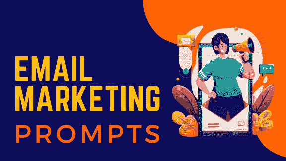

# 3.电子邮件营销提示

1-10：介绍和欢迎邮件

1.  写一封关于[热烈欢迎]的电子邮件："用[热烈欢迎]欢迎新订阅者，这是一个个性化的模板，包含友好的问候、您的品牌故事和一个特别优惠，为他们的旅程开启一个良好的开端。"

1.  写一封关于[入职专家]的电子邮件："通过[入职专家]轻松引导新客户入职，这是一个旨在指导他们了解关键功能、展示优势并建立强大初次连接的电子邮件模板。"

1.  写一封关于[第一印象]的电子邮件："用[第一印象]留下深刻印象，这是一个视觉上令人惊叹的模板，介绍您的品牌、服务和独家福利，吸引观众从一开始就被吸引。"

1.  写一封关于[独家访问]的电子邮件："提供 VIP 体验，使用[独家访问]的电子邮件模板突出独家内容、产品的提前访问和会员专属福利，保持观众的参与和价值感。"

1.  写一封关于[开始指南]的电子邮件："通过[开始指南]促进顺利开始，这是一个提供逐步说明、资源和有用提示的信息模板，确保用户顺利开始他们与您服务的旅程。"

––––––––

1.  写一封关于[新订阅者专享]的电子邮件："以[新订阅者专享]的风格欢迎新订阅者，这是一个引人注目的模板，包含特别的欢迎优惠、个性化推荐和号召行动，鼓励立即参与。"

1.  写一封关于[入职大师课程]的电子邮件："通过[入职大师课程]掌握入职的艺术，这是一个结合了教育内容、视频教程和互动元素的电子邮件模板，引导用户了解您平台的关键功能。"

1.  写一封关于[加入我们的社区]的电子邮件："通过[加入我们的社区]培养归属感，这是一个邀请新订阅者加入您的社区、参与讨论和探索独家内容的电子邮件模板，从第一天开始建立牢固的联系。"

1.  写一封关于[入职向导]的电子邮件："通过[入职向导]简化入职流程，这是一个包含逐步指南、互动元素和有用资源的电子邮件模板，确保用户轻松导航并欣赏您服务的价值。"

1.  写一封关于[发布庆典]的电子邮件："与[发布庆典]一起庆祝里程碑，这是一个宣布新产品发布、成就或公司里程碑的电子邮件模板，激发观众的兴奋和参与。"

11-20：促销和销售邮件

1.  为[限时抢购提醒]编写一封电子邮件："通过[限时抢购提醒]制造紧迫感，这是一个引人注目的电子邮件模板，通知订阅者限时优惠、折扣和独家交易，促使他们行动并在时间耗尽之前购买。"

1.  为[产品焦点]编写一封电子邮件："通过[产品焦点]突出展示特色产品，这是一个引人入胜的模板，展示关键产品细节、客户评价和引人入胜的号召，推动销售并提升您的热门产品的可见度。"

1.  为[限量版系列]编写一封电子邮件："通过[限量版系列]提升独家性，这是一个揭示独特和限量版产品的电子邮件模板，制造期待感并在您的受众中引发错失良机的恐惧。"

1.  为[节省盛宴]编写一封电子邮件："通过[节省盛宴]最大化节省，这是一个汇编独家折扣、捆绑交易和促销代码的电子邮件模板，吸引订阅者探索您的产品并享受无与伦比的节省。"

1.  为[季节性销售壮观]编写一封电子邮件："通过[季节性销售壮观]捕捉每个季节的精髓，这是一个多功能电子邮件模板，推广季节性销售、折扣和主题优惠，制造兴奋感并鼓励季节性购物狂欢。"

1.  为[VIP 销售访问]编写一封电子邮件："通过[VIP 销售访问]让您的订阅者感到特别，这是一个提供独家提前销售、促销和新系列的电子邮件模板，奖励忠诚并培养 VIP 受众的特权感。"

1.  为[捆绑优惠盛宴]编写一封电子邮件："通过[捆绑优惠盛宴]提升平均订单价值，这是一个呈现捆绑交易、精选产品套装和价值优惠优惠的电子邮件模板，鼓励客户探索并利用经济实惠的捆绑优惠。"

1.  为[限时抢购派对]编写一封电子邮件："通过[限时抢购派对]点燃激情，这是一个动画电子邮件模板，展示限时抢购、动态视觉效果和紧迫感，促使订阅者迅速行动并获得无与伦比的优惠。"

1.  为[假日忙碌]编写一封电子邮件："通过[假日忙碌]简化假日购物，这是一个展示精选礼品想法、节日促销和季节性折扣的电子邮件模板，引导您的受众度过愉快且无压力的假日购物体验。"

1.  为[大幅度降价疯狂]编写一封电子邮件："通过[大幅度降价疯狂]创造购物狂潮，这是一个突出大幅度降价、清仓销售和无与伦比折扣的电子邮件模板，鼓励订阅者尽情享受无罪购物狂欢。"

21-30：参与和反馈电子邮件

1.  为[评论汇总]编写一封电子邮件："通过[评论汇总]鼓励客户反馈，这是一个汇编最新产品评论、推荐和成功故事的电子邮件模板，提供社会证明并建立潜在客户的信任。"

1.  撰写一封关于[调查感知]的电子邮件："通过[调查感知]，一个互动的电子邮件模板，包含调查、投票和测验，鼓励订阅者分享他们的意见和偏好，帮助您根据他们的需求定制您的产品。"

1.  撰写一封关于[客户感激]的电子邮件："通过[客户感激]，一封表达对忠诚客户感谢之意的电子邮件模板，包含独家优惠、提前访问或个性化折扣，作为对他们持续支持的感谢之礼。"

1.  撰写一封关于[反馈派对]的电子邮件："通过[反馈派对]，一个引人入胜的电子邮件模板，展示客户证词、成功故事和积极经验，建立观众之间的社区感和信任。"

1.  撰写一封关于[获奖证词]的电子邮件："通过[获奖证词]，一个展示有影响力客户证词、评级和评论的电子邮件模板，巩固您品牌声誉，鼓励潜在客户信任。"

1.  撰写一封关于[参与盛宴]的电子邮件："通过[参与盛宴]，一封邀请订阅者参与测验、比赛或挑战的电子邮件模板，创造一个有趣互动的体验，加强品牌与消费者之间的联系。"

1.  撰写一封关于[社交媒体展示]的电子邮件："通过[社交媒体展示]，一个展示用户生成内容、客户照片和社交媒体分享的证词的电子邮件模板，鼓励订阅者加入对话，成为您品牌故事的一部分。"

1.  撰写一封关于[评论嘉年华]的电子邮件："通过[评论嘉年华]，一个鼓励订阅者评论、分享想法和与您内容互动的电子邮件模板，培养品牌周围的社区感和对话。"

1.  撰写一封关于[推荐好友派对]的电子邮件："通过[推荐好友派对]，一个鼓励订阅者推荐朋友的电子邮件模板，包含激励措施、折扣或成功推荐的独家奖励，将客户转化为品牌倡导者。"

1.  撰写一封关于[互动反馈]的电子邮件："通过[互动反馈]，一个包含可点击元素、调查和互动内容的电子邮件模板，以收集反馈和意见，使订阅者享受反馈过程。"

31-40: 活动和公告电子邮件

1.  撰写一封关于[活动盛宴]的电子邮件："通过[活动盛宴]，一个展示活动详情、日程和独家福利的电子邮件模板，鼓励订阅者确认出席并成为您精彩品牌活动的一部分。"

1.  撰写一封关于[网络研讨会向导]的电子邮件："通过[网络研讨会向导]，一个展示网络研讨会详情、演讲者简介和注册链接的电子邮件模板，最大化您教育或推广性网络研讨会的出席和参与。"

1.  为[产品发布巡游]撰写一封电子邮件："使用[产品发布巡游]为新产品建立期待，这是一个揭示产品细节、特点和独家发布优惠的电子邮件模板，为您的观众营造轰动和兴奋。"

1.  为[盛大开幕晚会]撰写一封电子邮件："使用[盛大开幕晚会]宣布盛大开幕或商店开业，这是一个提供活动详情、独家优惠和邀请加入庆祝活动的电子邮件模板，最大化出席率和参与度。"

1.  为[公告文集]撰写一封电子邮件："使用[公告文集]分享重要公告，这是一个提供简洁而有影响力的更新、新闻和公告的电子邮件模板，让订阅者了解并参与您品牌的旅程。"

1.  为[预留日期盛宴]撰写一封电子邮件："使用[预留日期盛宴]为即将到来的活动制造兴奋，这是一个提供引人注目的视觉效果、活动详情和明确行动号召以预留日期的电子邮件模板，确保最大限度的出席率和期待。"

1.  为[独家邀请]撰写一封电子邮件："使用[独家邀请]培养独家性，这是一个向特定订阅者发送个性化邀请参加特别活动、产品预览或 VIP 聚会的电子邮件模板，营造特权和兴奋感。"

1.  为[活动提醒会面]撰写一封电子邮件："使用[活动提醒会面]最大化活动出席率，这是一个提供活动提醒、最后一刻细节和独家福利的电子邮件模板，确保订阅者不会错过您令人兴奋的品牌活动。"

1.  为[有限座位晚会]撰写一封电子邮件："使用[有限座位晚会]创建对有限座位活动的紧迫感，这是一个电子邮件模板，包含稀缺性消息、独家福利和明确的行动号召以确保座位，提高活动出席率和参与度。"

1.  为[活动回顾盛会]撰写一封电子邮件："使用[活动回顾盛会]延长活动的生命周期，这是一个回顾活动亮点、照片和独家内容的电子邮件模板，提供一个让兴奋持续的活动后体验。"

41-50：教育和信息性电子邮件

1.  为[知识中心]撰写一封电子邮件："使用[知识中心]建立权威性，这是一个提供教育内容、专家见解和有价值资源的电子邮件模板，将您的品牌定位为行业的首选信息来源。"

1.  为[操作手册]撰写一封电子邮件："使用[操作手册]赋予您的观众力量，这是一个提供逐步指南、教程和实用建议的电子邮件模板，展示您的产品或服务的价值和实用性。"

1.  为[内幕见解]撰写一封电子邮件："使用[内幕见解]分享行业见解，这是一个提供独家访谈、专家意见和幕后内容的电子邮件模板，提供有价值的信息，将您的品牌定位为思想领袖。"

1.  为 [教育探险] 撰写一封电子邮件："随着 [教育探险] 的一封电子邮件模板，引导订阅者通过精心策划的学习路径、研讨会和教育系列踏上教育之旅，满足不同技能水平和兴趣。"

1.  为 [知识金点子] 撰写一封电子邮件："通过 [知识金点子] 提供一些知识点，一个电子邮件模板，呈现快速提示、有趣的事实或行业更新，用简洁而有价值的信息保持您的受众参与。"

1.  为 [行业洞察摘要] 撰写一封电子邮件："通过 [行业洞察摘要] 让订阅者保持知情，一个电子邮件模板，汇编最新的行业趋势、新闻和见解，将您的品牌定位为您领域更新的首选来源。"

1.  为 [教程宝库] 撰写一封电子邮件："通过 [教程宝库] 提高用户参与度，一个电子邮件模板，包括一系列教程、教学视频和有用指南，满足不同的学习偏好，促进用户赋能。"

1.  为 [信息图直觉] 撰写一封电子邮件："通过 [信息图直觉] 增强信息保留，一个电子邮件模板，将视觉吸引人的信息图结合起来传达复杂信息，使教育内容对您的受众更易消化和吸引。"

1.  为 [专业知识交流] 撰写一封电子邮件："通过 [专业知识交流] 促进知识分享，一个电子邮件模板，邀请订阅者参与专家主持的网络研讨会、专题讨论或问答环节，创造交互式和教育性的体验。"

1.  为 [资源集结] 撰写一封电子邮件："通过 [资源集结] 提供一个有价值的资源中心，一个电子邮件模板，其中包括精选内容、电子书和可下载资源，提供全面的材料收藏，支持您的受众持续学习之旅。"

51-60：通用业务模板

1.  为 [促销轰炸] 撰写一封电子邮件，展示引人注目的视觉效果、诱人的优惠和明确的行动号召，以提高销售额。

1.  为 [欢迎系列] 撰写一封电子邮件，向新订阅者介绍您的品牌，内容引人入胜，带有个性化的触摸。

1.  为 [产品发布] 撰写一封电子邮件，展示新产品，突出功能，并在订阅者中营造兴奋氛围。

1.  为 [活动邀请] 撰写一封电子邮件，邀请订阅者参加一个活动，提供 RSVP 选项、活动详情和独家感。

1.  为 [新闻简报] 撰写一封电子邮件，以视觉吸引人且易于阅读的格式总结最近的更新、博客文章和新闻。

1.  为 [放弃购物车] 撰写一封电子邮件，促使客户通过引人入胜的产品展示和限时优惠完成购买。

1.  为 [客户反馈] 撰写一封电子邮件，鼓励客户通过设计精良的调查表和个性化的触摸分享他们的想法。

1.  为 [闪购促销] 撰写一封电子邮件，通过限时优惠、倒计时器和醒目视觉效果营造紧迫感。

1.  撰写一封邮件，致[生日特惠]，发送个性化的生日祝福和特别折扣以增进客户忠诚度。

——————————————————————————————————————————

1.  撰写一封邮件，致[重新参与活动]，以诱人的优惠和有力的理由针对不活跃的订阅者。

61-70：电子商务模板

1.  撰写一封邮件，致[产品推荐]，根据客户偏好和购买历史推荐个性化产品。

1.  撰写一封邮件，致[交叉销售活动]，吸引客户购买互补产品，以增加平均订单价值。

1.  撰写一封邮件，致[限量库存提醒]，通知订阅者低库存商品，并配有有说服力的视觉效果和紧急语言。

1.  撰写一封邮件，致[节日促销]，以节日主题的视觉效果，折扣和独家优惠庆祝假期或季节。

1.  撰写一封邮件，致[产品评论请求]，鼓励客户分享最近购买后的想法和体验。

1.  撰写一封邮件，致[推荐计划]，推广具有诱人奖励和明确行动号召的推荐计划。

1.  撰写一封邮件，致[VIP 客户专属]，为忠实客户提供特别福利或提前访问以感谢他们不懈的支持。

1.  撰写一封邮件，致[库存补货通知]，通知客户先前缺货商品重新进货。

1.  撰写一封邮件，致[忠诚计划更新]，展示忠诚计划中新功能或奖励，并鼓励使用。

1.  撰写一封邮件，致[捆绑优惠]，促销捆绑产品以折扣价格鼓励批量购买。

71-80: B2B 和专业服务模板

1.  撰写一封邮件，致[网络研讨会邀请]，邀请专业人士参加信息丰富的网络研讨会，并提供清晰的详细信息和注册选项。

1.  撰写一封邮件，致[案例研究展示]，突出成功案例和客户证言以建立信誉度。

1.  撰写一封邮件，致[免费试用优惠]，鼓励企业尝试您的服务，并突出限时免费试用和主要功能。

1.  撰写一封邮件，致[行业洞察新闻通讯]，分享有价值的行业更新，趋势和分析，以将您的品牌定位为权威。

1.  撰写一封邮件，致[咨询请求]，促使潜在客户安排咨询，并提供明确的选项和好处。

1.  撰写一封邮件，致[白皮书发布]，宣布新白皮书或研究报告，附有引人注目的摘要和下载链接。

1.  撰写一封邮件，致[演示请求]，鼓励潜在客户请求产品演示，带有个性化的触碰。

1.  撰写一封邮件，致[客户入职]，以清晰友好的格式提供新客户的基本信息和下一步行动。

1.  撰写一封邮件，致[服务升级公告]，告知客户有关服务改进或新功能以及对他们的益处。

1.  撰写一封邮件，致[行业洞察调查]，收集客户反馈以增强您的服务并更好地了解他们的需求。

81-90: 非营利组织和慈善模板

1.  为[捐赠呼吁]撰写一封邮件，围绕一个事业创造一个引人入胜的叙述，并提供订阅者贡献的简便方式。

1.  为[活动赞助请求]撰写一封邮件，寻求慈善活动的赞助，明确福利和影响详情。

1.  为[志愿者招募]撰写一封邮件，以真诚的信息和简单的注册选项号召志愿者。

1.  为[影响更新]撰写一封邮件，分享成功故事，展示捐赠的积极影响，并以视觉吸引人的方式呈现。

1.  为[月度捐赠计划]撰写一封邮件，鼓励支持者加入一个月度捐赠计划，并列出相关福利。

1.  为[社区参与]撰写一封邮件，邀请订阅者参与社区活动或倡议，传达团结的感觉。

1.  为[感谢活动]撰写一封邮件，向捐赠者、志愿者和支持者表达感激之情，并附上个性化的信息。

1.  为[筹款晚宴邀请]撰写一封邮件，邀请支持者参加一场筹款晚宴，提供活动详情和 RSVP 选项。

1.  为[支持者通讯]撰写一封邮件，让支持者了解正在进行的项目、成就和未来计划。

1.  为[匹配捐赠活动]撰写一封邮件，告知捐赠者有关匹配捐赠机会，并激励他们做出贡献。

91-100：教育和在线课程模板

1.  为[课程报名]撰写一封邮件，推广即将开设的课程，包括关键详情、福利和明确的行动号召。

1.  为[课程完成庆祝]撰写一封邮件，祝贺学生完成课程，并鼓励进一步学习。

1.  为[新课程提醒]撰写一封邮件，通知学生有关课程中新课程、模块或内容的添加。

1.  为[课程评价请求]撰写一封邮件，鼓励学生在完成课程后分享反馈和推荐。

1.  为[学生专属网络研讨会]撰写一封邮件，提供给已注册学生一个独家网络研讨会或讲习班，包括清晰的参与详情。

1.  为[教育资源发布]撰写一封邮件，宣布一个新的教育资源，比如一本电子书或指南，并提供下载链接。

1.  为[即将到来的考试提醒]撰写一封邮件，向学生提供即将到来的考试提醒、关键详情和准备提示。

1.  为[奖学金公告]撰写一封邮件，告知学生有关可获得奖学金、资格和申请详情。

1.  为[校友网络更新]撰写一封邮件，通过提供更新、活动和社交机会来与校友互动。

1.  为[课程折扣促销]撰写一封邮件，提供限时课程报名折扣，鼓励注册。

1.  请为新订阅者撰写一封欢迎邮件系列，介绍他们关于我们的[品牌/产品/服务]，并鼓励他们积极参与我们的内容。

1.  创建一封推荐邮件，促使我们的客户向朋友和家人推荐我们的[品牌/产品/服务]。

1.  起草一封产品发布电子邮件，揭示我们的新[产品/服务]，并强调其独特的特点和优势。

1.  撰写一封调查电子邮件，寻求我们的订阅者关于他们与我们的[品牌/产品/服务]的体验的反馈。

1.  制定一封促销电子邮件，为即将到来的[促销活动/事件]向订阅者提供折扣代码。

1.  创作一封遗弃购物车电子邮件，呈现折扣代码，诱使客户完成购买。

1.  撰写一封旨在激励不活跃订阅者重新连接到我们的[品牌/产品/服务]的再参与电子邮件。

1.  创作一个以节日为主题的电子邮件，促销我们的[品牌/产品/服务]，并邀请订阅者与我们一起庆祝。

1.  为我们的读者撰写一篇既具信息性又引人入胜的[长度]博客文章。

1.  创建一篇[长度]社交媒体帖子，促销我们的[产品/服务]，并呼吁我们的粉丝参与互动。

1.  生成[数量]个旨在吸引我们订阅者注意并提高开信率的电子邮件主题行。

1.  生成一封购买后的跟进电子邮件，表达对客户购买的感激之情，并鼓励他们通过评论分享他们的反馈。

1.  撰写一封电子通讯，突出我们最近的[博客文章/活动/产品发布]，并鼓励订阅者与我们的内容互动。

1.  汇编一份与我们的[产品/服务]相关的[数量]篇文章标题列表，可能会吸引我们的目标受众，[理想客户画像]。

1.  撰写一篇产品描述，重点介绍我们的[产品/服务]的特点和优势，以清晰而引人入胜的方式呈现给我们的客户。

1.  为我们的电子营销活动的电子通讯提供一系列可能的主题。

1.  撰写一封电子通讯，促销我们最近的[博客文章/活动/产品发布]，鼓励与我们的内容互动。

1.  为一封电子通讯提供五个标题选择，以促销我们的[产品/服务]给[目标受众]。

随着您特定的业务和营销目标，随意定制模板名称和描述。

通用电子邮件提示

1.  提供关于使用自动电子邮件序列和逐步计划的建议，以帮助感兴趣的人并引导他们了解产品或服务。

1.  谈论在电子邮件中使用客户创建的内容，如评论或故事，以使人们更加信任企业。

1.  讨论发送带有有用信息的电子邮件如何使发件人看起来像是行业专家。

1.  提供如何确保电子邮件不会进入垃圾邮件文件夹的想法，例如保持电子邮件列表整洁，不使用触发垃圾邮件过滤器的词语。

1.  谈论根据人们在网上喜欢或做的事情改变电子邮件内容如何使电子邮件更有趣。

1.  讨论在电子邮件中使用社交媒体粉丝数量或关于快乐客户的故事等内容，以使人们更加信任企业。

1.  提供撰写简短而有说服力的电子邮件消息的建议，告诉主要观点并让人们想要做某事。

1.  探索通过使用名字或提及之前他们做过的事情，让电子邮件感觉个人化的想法。

1.  讨论在电子邮件中使用良好的图片或视频可以让人们更多地注意到并感兴趣。

1.  分享关于何时以及多频繁发送电子邮件，以便它们更有可能在正确的时机被查看的想法。

1.  探究使用计划来扩大收取电子邮件名单的人的好处，比如提供有趣或特别的东西来注册。

1.  讨论在电子邮件中使用社交媒体连接来让人们分享它们并让信息传达给更多人的作用。

1.  给予制作从电子邮件转到的页面看起来漂亮并与电子邮件谈论的内容相匹配，让人们容易使用的建议。

1.  考虑通过将收件人分成群体并制作每封邮件特别来发送每个人刚好合适的电子邮件。

1.  看看如何检查和理解来自电子邮件的数字，比如有多少人打开它们或点击链接，以了解什么有效并利用数据使事情变得更好。

1.  提出使电子邮件更有趣并允许人们参与的想法，比如添加测验、投票或调查。

1.  考虑使用工具或程序来自动化任务，从而更容易管理和节省发送电子邮件时的时间。

1.  讨论为什么让电子邮件对所有人都易于使用很重要，包括那些使用屏幕阅读器或需要更好的颜色对比度的人。

1.  提出制作引起人们好奇并想打开和阅读电子邮件的电子邮件标题的建议。

1.  看看如何利用个人细节，比如某人购买或在网上查看的东西，让电子邮件更贴近每个人的兴趣。

1.  讨论在社交媒体上使用广告以及电子邮件可以让更多人看到并回应信息的作用。

1.  给出基于年龄或购买物品等因素将客户分成不同群体的想法，以便电子邮件更贴近每个群体喜欢的内容。

1.  考虑使用来自电子邮件的数字和数据来了解人们喜欢和行为，并利用这些信息使未来的电子邮件变得更好。

1.  讨论在电子邮件中告诉人们某事很快结束，比如即将结束的特别优惠，能让更多人购买物品的影响。

1.  给予关于如何制作一系列欢迎新订阅者的电子邮件，并帮助他们了解品牌的建议。

1.  看看如何利用个人细节建议人们可能喜欢的东西，基于他们之前查看或购买的物品。

1.  讨论在电子邮件的主要内容之前写一小段文字来提供更多信息并让人们想打开邮件的影响。

1.  提出让电子邮件在手机上看起来漂亮的建议，通过设计使其适应小屏幕。

1.  看看为什么定期清理收件人名单，比如移除那些不阅读邮件的人或修复退回的邮件，是个好主意。

1.  讨论在社交媒体上添加分享电子邮件的按钮或提供奖励来拉近朋友，让更多人了解一个企业的作用。

1.  给出使用自动计划帮助感兴趣的人根据他们的行为或时间进行步骤的提示。

1.  探讨根据某人之前购买或查看过的东西在邮件中建议购买物品的想法。

1.  讨论编写邮件标题让人感觉需要立即采取行动或是参与特别活动的好处。

1.  分享尝试在邮件中尝试不同内容的想法，比如外观或按钮位置，以找出最有效的方法。

1.  探讨在邮件中讲述故事的好处，让人们产生共鸣并希望继续听取企业的消息。

1.  讨论在邮件中展示其他人对企业的评价或邀请知名人士在邮件中表达对其喜爱的好处。

1.  给出关于确保电子邮件能够准确送达收件人收件箱的建议，通过正确设置并避免使用会让其看起来像垃圾邮件的词语。

1.  探讨在邮件中友好地打招呼或谈论收件人喜欢的事物的想法，以使邮件更有趣。

1.  讨论查看邮件中的数字（比如有多少人打开邮件或点击链接）的好处，以了解邮件的表现如何。

1.  分享使邮件看起来有趣的想法，包括好的图片和明确的操作指引。

1.  探讨将客户分成不同群体，并制作适合每个群体的邮件的想法。

1.  讨论使用自动计划的好处，比如提醒人们关于他们在网上购物车中留下的物品或询问他们的购买情况，可以促使更多人购买物品并保持兴趣。

1.  给出撰写邮件的想法，告诉人们为什么产品或服务好，解决他们的问题，并促使他们采取行动。

1.  谈论定期清理收件人名单的重要性，并分享保持其更新的方法。

1.  分享关于制作让人好奇并且想要打开邮件的邮件标题的建议。

1.  探讨根据某人喜欢或之前购买过的东西在邮件中建议购买物品的想法，以引起其兴趣。

1.  讨论在邮件中包含客户的评价或故事的好处，以建立人们对企业的信任。

1.  给出让长时间未阅读邮件的人重新感兴趣的策略。

1.  探讨如何使用自动计划帮助人们学习更多并购买物品。

1.  讨论为不同群体的人发送适合他们喜欢的内容的邮件的好处。

1.  分享确保邮件在各种设备上看起来好且运行良好的技巧。

1.  探讨如何在邮件中使用测验或调查来吸引人们参与并分享想法。

1.  讨论为了让人们可以在线关注和讨论品牌，将邮件与社交媒体联系起来的好处。

1.  给出确保邮件能够准确送达收件人收件箱并被视为可信的策略。

1.  探讨在正确的时间发送邮件的好处，比如当某人将物品留在购物车中或在他们的生日时。

1.  讨论如何在邮件中讲述有趣故事使人们产生共鸣并想要了解更多。

1.  分享如何制作在手机和平板电脑上运行良好的邮件的建议。

1.  探讨根据某人喜欢的或之前购买的东西改变邮件内容的想法，使其更加个性化。

1.  讨论为什么在邮件中包含分享邮件的按钮到社交媒体并让更多人看到和谈论品牌是个好主意。

1.  提供制作让人们可以注册邮件的表单更有效的想法，以便更多人加入并分享有用信息。

1.  谈论为什么通过调查或反馈请求向人们征求他们的想法是个好主意，以改进邮件。

1.  讨论在邮件中使用情感如何使人们感到更亲近并执行邮件要求。

1.  分享让人们停止接收邮件并听取他们意见的建议。

1.  探讨为某人的生日或纪念日发送特别邮件的想法，使他们感到特别并想要保持联系。

1.  讨论为什么在邮件中包含客户的评论或名人故事是个好主意，可以让人们更信任一个企业。

1.  给出制作特别优惠邮件的策略，让人们立即想购买物品。

1.  探讨在邮件中展示随着时间推移而变化的内容，如计时器或可用更新内容，以促使人们迅速行动的好处。

1.  讨论为什么根据人们的兴趣和行为发送适合不同群体的邮件是个好主意。

1.  分享制作按钮的提示，以清晰有趣的方式告诉人们该做什么。

1.  探讨制作与不同类型客户喜欢或关心的内容相匹配的邮件的想法。

1.  讨论为什么将邮件与社交媒体比赛混合在一起可以吸引人们并使邮件订阅者名单增长。

1.  分享使邮件的第一部分给出内部内容概述并使人们想要打开邮件的策略。

1.  探讨通过包含某人居住地或他们可能喜欢的特别事物等细节使邮件更加个性化的好处。

1.  讨论为什么发送试图重新激起人们兴趣的邮件是个好主意，如果他们一直没有阅读邮件。

1.  分享关于多久发送一封邮件让人们记住但不会厌烦的建议。

1.  探讨根据某人之前查看或购买的内容给出想法的邮件发送的想法。

1.  讨论为什么在邮件中包含客户的评论或社交媒体上关于企业的评论是个好主意，可以让人们更信任一个企业。

1.  分享根据人们喜欢的内容或身份制作适合不同群体的邮件的策略。

1.  了解如何使用自动计划的邮件可以使欢迎邮件或订单确认等事情自动发生，节省大量时间。

1.  谈论在邮件中讲述有趣故事如何让人们产生联系感并想要采取行动。

1.  获得关于如何使邮件易于阅读的建议，包括清晰的标题、列表和简短的文本。

1.  探讨根据某人以前的行为改变邮件内容的想法，比如根据他们查看或购买的物品推荐他们可能喜欢的东西。

1.  讨论查看邮件中的数字的好处，比如有多少人打开了邮件或点击了链接，以改进邮件质量。

1.  分享利用客户的行为或购买情况发送适合他们的邮件的想法，比如纪念日特别优惠或询问最近购买的商品如何。

1.  探讨为什么在不同时间向不同人发送不同邮件是有益的，比如新客户的欢迎邮件或忠诚客户的奖励。

1.  讨论在邮件中使用友好且易于理解的词语如何使其更有趣和易于共鸣。

1.  分享确保邮件中的图片尺寸合适并具有描述，以便所有人都能看到的建议。

1.  探讨在邮件中使用客户的评价或评论等内容使人们更加信任企业的想法。

1.  讨论在邮件中说一些让人感觉需要立即采取行动的事情是有益的，比如即将结束的特别优惠。

1.  分享制作一系列随时间提供有用信息的邮件的策略，比如教导人们更多关于产品或服务的内容。

1.  探讨利用个人细节，比如某人喜欢的东西或想了解的内容类型，使邮件更有趣的好处。

1.  讨论自动计划如何在某人做出重要举动时发送特殊邮件，比如达到一定购买金额。

1.  分享尝试在邮件中使用不同元素的提示，比如标题、按钮或外观，以找出最有效的方法。

1.  讨论为什么将客户分成不同群体并发送适合他们喜欢或关心的邮件是重要的。

1.  给出制作让人感到愉悦并与品牌建立良好联系的欢迎邮件的建议。

1.  探讨当某人将物品留在购物车中或在线查看物品时发送特殊邮件的想法，以引起他们的兴趣。

1.  讨论将邮件与社交媒体联系起来的好处，使人们可以在不同地方谈论品牌。

1.  分享使邮件易于阅读的想法，比如选择正确的字母、在行之间留出空间，并充分利用空白处。

1.  探讨在邮件中讲述有趣故事如何引起人们的兴趣和情感。

1.  讨论为什么在邮件中包含客户对品牌的评价或评论可以增加人们对其的信任。

1.  分享确保邮件对所有人都有效的提示，比如描述图片并确保它们可以被朗读出来。

1.  探讨当某人购买东西时发送特殊邮件以建议更多他们可能喜欢的东西的想法。

1.  讨论在邮件中使用某人的姓名并根据他们喜欢或以前的行为建议事物的好处。

1.  分享撰写引人注目的电子邮件的想法，告诉人们为什么某事很好，并使他们想要采取行动。

1.  探讨在电子邮件中展示随着时间推移而变化的事物的好处，比如实时更新或根据某人喜好建议事物。

1.  讨论在电子邮件中包含按钮的好处，使人们轻松分享社交媒体上的内容。

1.  分享确保电子邮件到达收件箱的技巧，遵循重要规则并被视为值得信赖。

1.  探索如果他们一直没有阅读它们，向人们发送特别的电子邮件以重新引起兴趣的想法。

1.  讨论根据不同人的身份或喜好向不同的人发送不同的电子邮件是件好事。

1.  分享使用自动计划帮助人们学习更多和购买东西的策略。

1.  探索通过电子邮件询问他人想法的好处，以改善事物并改进电子邮件的工作方式。

1.  讨论在电子邮件标题和文本中使用笑脸或其他小图片的影响，使它们更有趣并吸引人们参与。

1.  提供何时发送电子邮件以产生最大影响并使更多人打开它们的想法。

1.  探索向人们发送特别的电子邮件以提醒他们为什么喜欢一个品牌以及保持联系的好处的想法。

1.  讨论在电子邮件中说类似“限时”或“即将售罄”的话语的好处，以促使人们购买东西。

1.  分享在电子邮件中尝试不同事物的想法，比如外观或内容，以了解人们最喜欢的东西。

1.  探索根据某人以前查看或购买的内容向他们建议在电子邮件中购买的东西的好处，以引起他们的兴趣。

1.  讨论在某人购买东西时发送特别的电子邮件的好处，以提供重要信息并使他们更信任品牌。

1.  分享让人们轻松停止接收电子邮件并提供其他选项（如更少地收到电子邮件）的建议。

1.  探索向那些一段时间内对品牌不感兴趣的人发送特别的电子邮件的想法。

1.  讨论查看电子邮件中的数字的重要性，比如有多少人打开它们或点击链接，以改进电子邮件。

1.  分享制作引人注目的电子邮件标题的想法，使人们想要打开它们。

1.  探索在电子邮件中说更多个人事物的好处，比如某人之前购买过什么或他们住在哪里。

1.  讨论在电子邮件营销中拥有奖励和保留好客户的计划的好处。

1.  分享在电子邮件中询问人们想法的技巧，以改善未来的事物。

1.  探索向人们发送特别的电子邮件以提醒他们定期购买的想法。

1.  讨论在电子邮件中举办比赛或赠品活动的好处，以吸引更多人关注并谈论品牌。

1.  分享在电子邮件中制作按钮的策略，以清晰而有趣的方式告诉人们该做什么。

1.  探索当某人将物品留在在线购物车中时发送特别的电子邮件的好处，以提醒他们并提供额外的东西。

1.  讨论在电子邮件中使用测验或演示的好处，以吸引人们参与其中。

1.  分享确保电子邮件在各种设备上看起来漂亮且功能良好的建议。

1.  探讨向客户发送特别电子邮件以庆祝重要时刻，比如纪念日或生日的想法。

1.  讨论在电子邮件中使用个性化内容，比如个人喜欢的事物或之前的行为，可以使电子邮件更有趣的想法。

1.  分享利用电子邮件来保持对品牌感兴趣的想法，这些人是在其他地方了解到品牌的，比如社交媒体或在线内容。

1.  探讨在电子邮件中询问人们的想法以改善事物并了解他们喜欢什么的想法。

1.  讨论向曾经购买过但已经有一段时间没有购买的人发送特别电子邮件的好处。

1.  分享使电子邮件从一开始就引人入胜的提示，使人们愿意打开并阅读它们。

1.  探讨向新客户发送一系列特别电子邮件介绍他们的想法。

1.  讨论在电子邮件中说些个人的事情以奖励并留住忠实客户的好处。

1.  分享向长期不感兴趣的人发送特别电子邮件的策略，为他们提供额外的东西。

1.  探讨在电子邮件中包含客户说的话或名人故事的好处，以增加人们对品牌的信任。

1.  讨论查看电子邮件的数据的重要性，比如点击次数等，以改进电子邮件。

1.  分享使电子邮件的第一部分引人入胜的提示，使人们想要打开它。

1.  探讨在电子邮件中讲述有趣故事的想法，以保持人们的兴趣并使品牌难忘。

1.  讨论在电子邮件中包含客户说的话或真实人物故事的好处，以增加人们对品牌的信任。

1.  分享在小屏幕上（如手机和平板电脑）使电子邮件看起来漂亮且功能良好的策略。

1.  探讨在电子邮件中展示随着时间变化的内容的好处，比如基于天气的特别优惠或基于个人喜好的建议。

1.  讨论根据某人的行为或喜好发送特别电子邮件的影响。

1.  分享制作电子邮件中的按钮的技巧，以清晰而有趣的方式告诉人们该做什么。

1.  探讨根据人们喜欢或关心的事物向不同的人发送不同的电子邮件的想法。

1.  讨论从电子邮件中查看数字和信息如何帮助了解它们的表现情况以及哪里可以改进。

1.  分享使电子邮件个性化的想法，比如根据个人喜好或之前的购买行为提出购买建议。

1.  探讨使用自动计划使事情更容易并引导人们进行购买的好处。

1.  讨论在电子邮件中尝试不同事物的好处，比如外观或内容，以了解人们喜欢什么。

1.  分享确保电子邮件发送到人们的收件箱并且看起来良好的建议，比如使用良好的电子邮件服务和拥有干净的电子邮件列表。

1.  探讨在电子邮件中询问人们的看法以改善事物并改进电子邮件工作的好处。

1.  讨论在电子邮件中说一些个人的事情以奖励和保持忠诚客户的好处。

1.  分享提醒人们关于他们没有购买的事物的特别电子邮件的想法。

1.  探讨根据某人查看或购买的东西发送特别电子邮件以引起他们的兴趣的好处。

1.  讨论为什么将电子邮件与社交媒体联系起来让人们可以在不同的地方谈论品牌是有好处的。

1.  分享使电子邮件看起来漂亮并与品牌风格相匹配的技巧。

1.  探讨在电子邮件中使用定时器或只在短时间内有效的特别交易等方式，让人们想购买东西的概念。

1.  讨论向那些已经有一段时间没有对品牌感兴趣的人发送特别的电子邮件的想法。

1.  分享使用电子邮件来保持对在其他地方（如活动或在线内容）了解品牌的人的兴趣的策略。

1.  探讨在电子邮件中建议阅读或查看的好处，以提供价值并引起人们的兴趣。

1.  讨论在电子邮件中使用能够让人产生情感的语言和故事的好处。

1.  分享发送正确数量的电子邮件以使人们记住品牌但不感到不堪重负的方法的提示。

1.  探讨通过根据某人的身份或喜好建议事物来使电子邮件变得个性化的概念。

1.  讨论观察人们的行为，比如他们看什么或购买了什么，如何帮助向他们发送他们喜欢的内容的电子邮件。

1.  分享向那些有一段时间没有表现出兴趣的人发送特别电子邮件的想法，让他们想要回来。

1.  探讨在告诉人们已经购买了某物时建议他们购买更多东西的想法。

1.  讨论在某人生日或他们成为客户一段时间后发送特别电子邮件的好处。

1.  分享确保电子邮件对所有人都有效，包括使用特殊工具阅读的人的建议。

1.  探讨通过增加游戏或挑战来使电子邮件变得有趣的想法，让人们享受其中。

1.  讨论利用对客户的了解来建议他们可能喜欢或感兴趣的事物的想法。

1.  分享使用客户的图片或文字在电子邮件中的方法。

1.  探讨向那些以前购买过但已经有一段时间没有购买的人发送特别电子邮件的想法。

1.  讨论为什么在电子邮件中放置让人们与朋友分享内容的按钮是有好处的。

1.  分享使人们轻松停止接收电子邮件并给予其他选项（如减少电子邮件数量或选择所需内容）的技巧。

1.  探讨查看人们可能了解品牌的所有时间，并使用电子邮件使他们感兴趣的概念。

1.  讨论在电子邮件中说一些个人的事情以让人们感觉特别的好处。

1.  分享发送一系列引导人们逐步购买的电子邮件的策略。

1.  探讨发送具有早期预览、幕后内容或特别提示等内容的特别电子邮件的好处。

1.  讨论在邮件中使用使人想购买东西的词语和故事的好处。

1.  分享使邮件的第一部分有趣以吸引人们打开的技巧。

1.  探索在邮件中使用动态图片或视频使邮件更加有趣的想法。

1.  讨论利用人们的反馈不断改进邮件的想法。

1.  分享使用邮件告知人们在线活动或课程并引起他们兴趣的方法。

1.  探索发送有关顾客留在购物车中的物品的特别邮件的好处，并提供额外的东西来完成购买。

1.  谈论根据顾客以前购买的东西建议其他购买选择并使顾客感兴趣的邮件发送的作用。

1.  分享分享有趣内容、新闻和特别优惠的邮件的想法以保持人们的兴趣。

1.  讨论企业在发送的邮件中拥有强大且独特的身份，从而脱颖而出的重要性。

1.  分享创建让人好奇并想打开邮件的主题行的技巧。

1.  探索通过谈论订阅者感兴趣的事情使邮件更加个人化的想法。

1.  讨论在邮件中使用社交媒体上有影响力的人可以帮助企业触达更多人并更加值得信赖的原因。

1.  分享使邮件易于阅读的策略，比如使用项目符号、标题和清晰的组织结构。

1.  探索使用一系列欢迎邮件的好处，这些邮件自动发送给新订阅者，让他们感觉融入团体，并将他们转化为快乐的顾客。

1.  讨论在邮件中包含顾客对企业的评价以建立信任和展示人们喜欢产品的重要性。

1.  分享确保邮件送达收件箱的技巧，包括保持邮件地址列表更新和避免使邮件看起来像垃圾邮件的方法。

1.  探索在邮件中使用调查或投票等方式来吸引订阅者参与的想法。

1.  讨论将顾客分组并向他们发送特别邮件可以使人们更有可能购买的想法。

1.  分享使用邮件让人们对博客文章或其他内容感兴趣，从而增加网站访问量的策略。

1.  探索根据以前浏览或购买过的产品建议产品的特别邮件的好处。

1.  讨论使邮件紧急，比如说某个优惠只限短时间可以促使人们更多购买的想法。

1.  分享设计易于所有人阅读的邮件的技巧，包括使用图片描述和高对比度的颜色。

1.  探索当有人做某事时自动发送邮件的想法，比如将物品留在购物车中。

1.  讨论讲故事在邮件中的作用，使顾客感到与品牌建立联系并想购买更多。

1.  分享使用邮件帮助人们了解产品并决定购买的策略。

1.  探索电子邮件主题行个性化的好处，以引起注意并吸引更多人打开它们。

1.  讨论如何利用电子邮件告知人们特殊事件，例如新产品或在线演示，可以让他们感到兴奋和感兴趣。

1.  ChatGPT 可能会犯错。考虑检查导入

1.  给出在手机上阅读电子邮件的建议，使用在不同屏幕上工作良好的设计，并保持信息简洁。

1.  谈论向最近没有兴趣的人发送特别邮件的想法，以再次激起他们对品牌的兴趣。

1.  讨论将客户分成组，并向他们发送带有额外优惠的特别邮件，可以使已经购买东西的人购买更多。

1.  分享利用电子邮件询问客户意见和想法的想法，这可以帮助改进产品和服务。

1.  探索发送一系列邮件的好处，帮助人们更多地了解品牌并建立联系。

1.  讨论在电子邮件中放置按钮的影响，使人们轻松点击并转到网站，这可以带来更多销售。

1.  分享如何在电子邮件中使用个性化建议，根据他们之前的操作推荐客户可能喜欢的产品的提示。

1.  探索使用电子邮件告知客户特别优惠或独家交易以感谢他们的忠诚的想法。

1.  讨论如何利用电子邮件向客户教授关于品牌的知识并表明它对行业了解很多。

1.  分享使用某些类型的电子邮件的策略，例如订单确认或发货通知，使客户感到自信和参与。

1.  探索发送自动电子邮件庆祝客户生日或纪念日的好处，提供特别优惠让他们感到受到尊重。

1.  讨论如何使电子邮件对快速查看内容的人易于理解，使用标题、项目符号和短段落。

1.  分享利用电子邮件提醒客户之前查看过的产品或在网站上访问过的页面的想法。

1.  讨论向具有不同兴趣的不同客户群发送个性化内容的电子邮件的作用。

1.  分享利用电子邮件告知客户忠诚计划并鼓励他们再次购买并谈论品牌的策略。

1.  探讨发送自动电子邮件询问客户想法和反馈的好处，这可以用来显示其他人喜欢品牌。

1.  讨论在电子邮件中使用动态图片或视频来吸引人们的注意力并使他们感兴趣的影响。

1.  分享有关多久发送电子邮件的提示，以便客户保持兴趣，但不要让他们觉得收件箱太满。

1.  探索在有人购买东西后使用电子邮件建议他们根据其购买情况可能喜欢的其他东西的想法。

1.  讨论使用电子邮件建立兴奋和告知客户新产品或更新的作用。

1.  分享使用电子邮件提供重要信息的策略，比如政策变更、新功能，或者服务出现任何问题。

1.  了解使用自动回购电子邮件带回最近没有购买任何东西的客户的优势。

1.  讨论根据客户所在地区或时区划分客户如何帮助发送更个性化的电子邮件。

1.  分享制作电子邮件模板的技巧，使其在不同的电子邮件应用和设备上看起来好看，从而给每个人带来一致且良好的体验。

1.  探索使用自动邮件提供及时和有用信息的想法，比如订单更新或产品建议。

1.  讨论如何在电子邮件中使用情感可以让人们感觉良好并与品牌更紧密地联系。

1.  分享使用电子邮件保持人们兴趣并引导他们在社交媒体上显示兴趣后购买的策略。

1.  探索通过发送一系列有用内容的电子邮件来教育和吸引订阅者的好处。

1.  讨论如何将客户分组并发送给他们带有个性化优惠的特别回购电子邮件以吸引他们回来。

1.  分享制作电子邮件注册表单更好的技巧，比如解释好处并保持简洁。

1.  “我想要一封电子邮件向我的理想客户展示我的产品/服务有多么棒，并通过证据支持和建立信任来说服他们采取特别行动。”

1.  “我正在寻找一封直接针对我的理想客户需求的电子邮件，通过提供优惠和紧迫感让他们迅速行动起来。”

1.  “我需要一封电子邮件通过突出其特殊优势来促使我的理想客户购买我的产品/服务，并回答他们可能有的任何担忧。”

1.  制定一系列邮件来教导客户了解你销售的内容。

1.  发送一份包含行业更新和新闻的通讯。

1.  通过电子邮件为客户提供特别折扣和优惠券。

1.  制作一封讲述使用你的产品取得成功的客户故事的电子邮件。

1.  通过电子邮件展示客户的评论和幸福想法。

1.  制作一组带有视频的邮件来分享有趣的内容。

1.  设计一封带有酷炫图形和图片的电子邮件。

1.  发送一封带有测验或有趣内容的邮件供客户参与。

1.  制作一封带有公司负责人问题和答案的邮件。

1.  制作一封邮件展示公司幕后发生的事情。

1.  为客户分享他们的想法和评论提供奖励。

1.  制作一封邀请读者加入你的邮件列表的电子邮件。

1.  发送一封感谢客户选择你的邮件。

1.  使用一封邮件告诉客户你正在提供的新东西。

1.  制作一封邮件让大家知道新的博客文章或文章。

1.  通过电子邮件为客户提供赢得令人兴奋物品的机会。

1.  当客户购买时为他们提供免费礼品。

1.  发送一封带有有用提示和建议的通讯。

1.  为回头客准备一封带有特别优惠的电子邮件。

1.  发送一封邮件告诉大家即将举办的活动。

1.  创建一封宣布特价或折扣的电子邮件。

1.  使用电子邮件分享客户的故事和想法。

1.  制作一封展示客户评论的电子邮件。

1.  发送调查以收集客户的想法和反馈。

1.  为带来新顾客的客户制作特别优惠的电子邮件。

1.  制作一封促进在线商店销售的电子邮件。

1.  用电子邮件告诉大家您即将推出的新事物。

1.  为客户提供独家折扣和优惠券的电子邮件。

1.  发送一份调查，收集客户的想法和反馈。

1.  制作一系列的电子邮件，向客户介绍您的产品。

1.  向收到您邮件的人发送一次特别优惠。

1.  制作一封分享客户成功使用您产品的故事的电子邮件。

1.  制作一封带有个人风格的电子邮件，与客户建立联系。

1.  发送一封包含测验或有趣活动供客户参与的电子邮件。

1.  制作一系列带有视频的电子邮件，分享有趣的内容。

1.  发送一个包含行业更新和新闻的新闻简报。

1.  使用电子邮件展示客户的评论和积极想法。

1.  制作一封有视觉图像和图片的电子邮件。

1.  制作一封电子邮件展示客户的评论。

1.  为特殊活动或假日制定电子邮件营销活动。

1.  发送欢迎邮件感谢新订阅者。

1.  用电子邮件宣布新产品或服务。

1.  分享带有特别优惠的假日主题电子邮件。

1.  在电子邮件中展示客户评论或故事。

1.  发送一封“最后机会”的限时优惠电子邮件。

1.  告诉所有人热门产品重新上架的电子邮件。

1.  用电子邮件促销免费试用或演示。

1.  用特别的一封电子邮件向客户表示“谢谢”。

1.  发送提醒给将商品留在购物车中的用户。

1.  使用电子邮件促销您企业的推荐计划。

1.  一封告诉您关于短期特价或快速折扣的电子邮件。

1.  一封感谢客户并提供特别优惠的电子邮件。

1.  一封告诉您一组产品或服务以优惠价格一起销售的电子邮件。

1.  一封带有问题或投票的电子邮件，让人们参与并分享想法。

1.  一封告诉您有关在线举办的网络研讨会或活动的电子邮件。

1.  一封邀请您关注并查看您的企业在社交媒体上的电子邮件。

1.  一封通知您的企业提供免费送货或配送的电子邮件。

1.  一封比较您的产品或服务与市场上其他产品的电子邮件。

1.  一封说明即将推出的新产品的电子邮件，激发人们的兴奋。

1.  一封邮件告诉您关于产品或服务的升级或改进。

1.  一封告诉您有关产品或服务的新变化和改进的电子邮件。

1.  包含用户生成内容（如评论或照片）的电子邮件。

1.  一封告诉您关于企业支持或服务的电子邮件。

1.  一封介绍您团队并展示您企业运作方式的电子邮件。

1.  一封要求您安装并使用移动应用的电子邮件。

1.  一封提醒访问过您企业 Facebook 页面的用户您的产品或服务的电子邮件。

1.  促销生日或周年纪念日的特别优惠的电子邮件。

1.  一封附带视频，展示如何使用你的产品或服务的邮件。

1.  一封谈论你的企业如何帮助社区的邮件。

1.  一封电子邮件，从可能的客户那里获取联系信息。

1.  一封介绍符合当前趋势或季节的产品或服务的邮件。

1.  一封通知某个地区的人们了解你的企业的邮件。

1.  一封为收到你的邮件的人提供特别优惠的邮件。

1.  一封提醒之前从你的网站购买过的用户再次光临的邮件。

1.  一封推广奖励和感谢忠诚顾客的计划的邮件。

1.  一封告诉顾客如何解决他们经常遇到的常见问题的产品或服务的邮件。

1.  一封提供即将推出的产品或服务的独特外观或提前获取机会的邮件。

1.  一封邀请人们参加比赛或赠品活动，让他们对你的品牌感到兴奋的邮件。

1.  一封提供说明或展示如何使用或做某事的视频的邮件。

1.  一封专门为首次购买的人提供特别优惠或折扣的邮件。

1.  一封展示你企业内部运营和介绍团队的幕后花絮的邮件。

1.  一封与当前事件或节日相关的产品或服务的广告邮件。

1.  一封告诉顾客你的企业正在提供的特别或限时优惠的邮件。

1.  一封推广你企业博客或其他有趣内容的邮件。

1.  一封为某种类型的产品或服务提供限时折扣或交易的邮件。

1.  一封推广有利于环境或可持续制造的产品或服务的邮件。

1.  一封介绍一个顾客及其与你的企业的经历的邮件。

1.  一封推广顾客可以自定义或个性化的产品或服务的邮件。

1.  "我需要一封邮件，让可能购买我的产品的人感到愉快并想获取它，即使他们有顾虑或问题。"

1.  "我正在寻找一封邮件，通过告诉他们将得到什么以及为什么它有价值来解释为什么人们应该注册我的计划或订阅的邮件。"

1.  "我需要一封邮件，让可能购买我的产品的人产生特定的情感，并让他们采取特定的行动。"

1.  "我正在寻找一封邮件，以易于理解的方式解释我产品或服务的重要内容，这样消费者会想要购买它。"

1.  "我需要一封邮件，谈论可能购买我产品的人的问题和需求，并向他们展示我的产品是答案。"

1.  "我正在寻找一封邮件，以有说服力的言辞引起可能购买我的产品的人的注意，并说服他们采取特定的行动。"

1.  "我需要一封邮件，讲述我的产品或服务的故事，并展示它如何帮助人们实现他们的目标，让人们容易理解和享受。"

1.  "我正在寻找一封邮件，谈论我的产品或服务提供的特别之处，并说服人们购买它。"

1.  "我需要一封邮件，回答人们可能对我的产品或服务有的担忧和问题，并说服他们采取具体的行动。"

1.  "我正在寻找一封邮件，通过分享其他使用过产品或服务的人的成功和快乐故事来建立与可能购买我的产品或服务的人的信任。"

1.  "我需要一封邮件，让可能购买我的产品的人产生特定的情感，并说服他们采取具体的行动，而且我希望它感觉紧急。"

1.  创建一封解释你的产品或服务的优点并通过告诉他们产品的功能来鼓励合适的人购买的邮件。

1.  制作一封展示你的产品或服务为何有价值并通过证据和建立信任来说服合适的人采取你想要他们采取的行动的邮件。

1.  设计一封直接针对你想要触达的人的问题或需求并通过强有力的提议和紧迫感说服他们采取重要行动的邮件。

1.  创建一封通过谈论其独特优势并回答可能存在的担忧来说服合适的人购买你所提供的内容的邮件。

1.  制作一系列展示视频的邮件。

1.  制作一封展示图片和图形的邮件。

1.  发送一封带有测验或有趣玩意的邮件。

1.  制作一封询问公司领导一些问题的邮件。

1.  写一封分享你公司内部情况的邮件。

1.  给予给客户写产品评论的奖励。

1.  写封邮件邀请人们加入你的邮件列表。

1.  发送一封感谢客户的邮件。

1.  使用邮件告诉大家你正在推出的新产品。

1.  写封邮件告诉大家有关新博客文章或文章的信息。

1.  让客户通过邮件参加赢取奖品的比赛。

1.  当客户购买东西时给予免费礼物。

1.  发布一封带有实用提示的通讯。

1.  制作一封为回头客提供特别优惠的邮件。

1.  发送一封通知大家即将举行的活动的邮件。

1.  写封邮件告诉大家有关促销或折扣的信息。

1.  使用邮件展示客户对你的业务说的好话。

1.  写一封展示客户评论的邮件。

1.  通过调查询问客户的意见。

1.  制作一封为转介他人的客户提供特别优惠的邮件。

1.  创建一封促进在线销售的邮件。

1.  使用邮件告诉大家有关新产品或服务的信息。

1.  通过邮件给客户提供特别折扣和优惠券。

1.  通过调查询问客户的意见。

1.  创建一系列邮件向客户介绍你所提供的内容。

1.  发送一份特别优惠给只订阅一次的人。

1.  制作一封讲述使用你产品取得成功的客户故事的邮件。

1.  写一封感觉亲密的邮件。

1.  发送一封带有测验或有趣活动的邮件。

1.  制作许多展示视频的邮件。

1.  发送一封关于行业新闻和更新的信件。

1.  使用邮件展示客户对你的业务说的好话。

1.  编写一封包含图片和图形的电子邮件。

1.  制作一封显示客户评论的电子邮件。

1.  创建一组特殊活动或节日的电子邮件。
