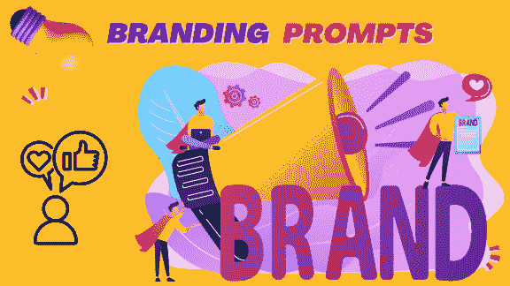

|  |  |  |
| --- | --- | --- |

# 5.品牌定位

这里有一些提示来生成品牌内容，每个提示都有内容的简要描述和特点：

1-10：品牌介绍

1.  撰写[品牌故事视频]的品牌内容：打造一个引人入胜的视频，讲述您品牌的旅程、价值观和使命，与观众建立情感联系，树立一个令人难忘的品牌身份。

1.  撰写[品牌宣言页面]的品牌内容：在您的网站上开发一个强大的品牌宣言页面，阐明您的核心信念、愿景以及品牌希望产生的影响。

1.  撰写[品牌语音指南]的品牌内容：通过全面的指南定义品牌的语音，确保在所有沟通渠道上保持一致性，加强独特和可识别的身份。

1.  撰写[品牌标志演变]的品牌内容：展示品牌标志随时间演变的过程，讲述成长、演变和适应性的故事，以视觉吸引人的形式呈现。

1.  撰写[创始人留言博客文章]的品牌内容：分享创始人的个人留言，表达品牌的起源、价值观和愿景，培养与受众的真实性和连接感。

1.  撰写[品牌价值观信息图]的品牌内容：创建一个突出您品牌价值观的信息图，使其在社交媒体平台上具有视觉吸引力并易于分享。

1.  撰写[品牌颜色心理学页面]的品牌内容：在专门的网页上解释品牌颜色背后的心理学，提供有关与您的视觉身份相关的情绪和联想的见解。

1.  撰写[品牌国歌视频]的品牌内容：制作一个动态的国歌视频，概括您品牌的本质，呈现视觉、音乐和信息，给受众留下深刻印象。

1.  撰写[品牌口号创作]的品牌内容：通过社交媒体投票或比赛，让受众参与创建新的品牌口号，使他们成为定义您品牌身份的积极参与者。

1.  撰写[品牌物料展示]的品牌内容：展示您品牌物料的画廊，包括名片、信头和包装，提供一个统一和专业的视觉身份概览。

11-20：视觉身份

1.  撰写[摄影风格指南]的品牌内容：通过详细指南定义您品牌的一致摄影风格，确保视觉与品牌个性一致并与受众产生共鸣。

1.  为[情绪板创建]编写品牌内容：邀请您的受众参与创建品牌情绪板，通过共享的视觉灵感捕捉您品牌的本质和美学。

1.  为[品牌字体指南]编写品牌内容：阐明您品牌的字体指南，确保所有沟通材料中一致和易读的排版风格。

1.  为[图标设计展示]编写品牌内容：展示您品牌的定制图标和符号，解释它们在保持统一视觉语言中的重要性和用途。

1.  为[视觉品牌演变时间线]编写品牌内容：创建一个视觉时间线，展示您品牌视觉形象的演变，从早期到现在，展示成长和适应能力。

1.  为[交互式调色板选择器]编写品牌内容：在您的网站上开发一个交互式调色板选择器，让用户可以探索和了解品牌调色板中每种颜色的含义。

1.  为[自定义插图功能]编写品牌内容：突出您品牌沟通中使用的定制插图，解释代表您品牌价值观的特定插图背后的故事和含义。

1.  为[品牌商品系列]编写品牌内容：推出一系列品牌商品，从服装到配饰应有尽有，让您的受众成为品牌大使。

1.  为[品牌壁纸下载]编写品牌内容：为桌面和移动设备提供可下载的品牌壁纸，将您的视觉形象延伸到受众的个人数字空间中。

1.  为[品牌虚拟背景]编写品牌内容：提供一系列视频通话虚拟背景，展示品牌视觉，保持专业和一致的品牌形象。

21-30：品牌参与

1.  为[品牌测验]编写品牌内容：在您的网站上创建一个引人入胜的测验，帮助用户发现他们与您品牌最相关的方面，促进更深层次的连接和理解。

1.  为[品牌社交媒体挑战]编写品牌内容：推出鼓励用户生成内容与品牌价值观一致的社交媒体挑战，促进受众之间的参与和创造力。

1.  为[音乐平台上的品牌播放列表]编写品牌内容：在音乐平台上策划一个反映您品牌情绪和个性的播放列表，通过共享的音乐偏好与受众建立联系。

1.  为[品牌关联合作伙伴关系]编写品牌内容：与志同道合的品牌或意见领袖探索合作伙伴关系，将您的品牌与其他分享相似价值观的品牌联系起来，扩大您的影响力和相关性。

1.  为[品牌忠诚计划]编写品牌内容：推出一个奖励客户持续支持的忠诚计划，为品牌倡导者创造独家感和感激之情。

1.  为[品牌增强现实滤镜](https://wiki.example.org/branded_augmented_reality_filters)撰写品牌内容：为社交媒体平台开发定制的增强现实滤镜，让用户以一种有趣和互动的方式参与并分享您的品牌。

1.  为[品牌叙事播客](https://wiki.example.org/brand_storytelling_podcast)撰写品牌内容：推出一个深入探讨您品牌、产品和团队成员背后故事的播客系列，为您的受众打造一个充满叙事性的体验。

1.  为[交互式品牌时间线](https://wiki.example.org/interactive_brand_timeline)撰写品牌内容：在您的网站上实施一个交互式时间线，允许用户探索您品牌历史上的重要里程碑和成就。

1.  为[虚拟品牌体验活动](https://wiki.example.org/virtual_brand_experience_events)撰写品牌内容：举办提供沉浸式品牌体验的虚拟活动，包括现场演示、互动问答环节和独家产品发布等元素。

1.  为[用户生成内容展示](https://wiki.example.org/user_generated_content_showcases)撰写品牌内容：在您的网站和社交媒体上突出展示用户生成的内容，庆祝并展示您受众的创造力和忠诚度。

31-40：品牌消息传递

1.  为[品牌人物发展指南](https://wiki.example.org/brand_persona_development_guide)撰写品牌内容：创建一个指南，用于制定您的品牌人物，概述反映品牌个性的关键特征和沟通风格。

1.  为[品牌故事板动画](https://wiki.example.org/brand_storyboard_animation)撰写品牌内容：将您的品牌故事转化为引人入胜的动画故事板，使其对广大受众易于理解和引人入胜。

1.  为[品牌口号创作比赛](https://wiki.example.org/brand_slogan_creation_contest)撰写品牌内容：发起一个比赛，让您的受众创作一个新的品牌口号，鼓励参与，加强品牌合作精神。

1.  为[品牌声音展示视频](https://wiki.example.org/brand_voice_showcase_video)撰写品牌内容：制作一个展示您品牌声音的视频，展示来自各种沟通渠道的片段，以说明一致性和真实性。

1.  为[品牌播客系列](https://wiki.example.org/branded_podcast_series)撰写品牌内容：推出围绕与您品牌价值观一致的主题的播客系列，提供有价值的内容，强化您品牌的思想领导地位。

1.  为[品牌消息传递研讨会](https://wiki.example.org/brand_messaging_workshop)撰写品牌内容：进行虚拟研讨会或网络研讨会，指导您的受众创建有效和共鸣的品牌信息，促进对您品牌沟通风格的更深入理解。

1.  为[品牌理念博客系列](https://wiki.example.org/brand_ethos_blog_series)撰写品牌内容：开发一系列博客文章，探索您的品牌理念、价值观和指导决策的原则，向您的受众提供透明度和洞察力。

1.  为[品牌叙事信息图](https://wiki.example.org/brand_narrative_infographic)撰写品牌内容：用视觉吸引力的信息图总结您的品牌叙事，提供关于您品牌旅程的快速而令人难忘的概述。

1.  为[品牌国歌歌曲](https://wiki.example.org/brand_anthem_song)撰写品牌内容：与音乐家合作创作一首品牌国歌歌曲，用音乐形式概括您品牌的本质和价值观。

1.  为[品牌信息强化宣传活动]编写品牌内容：在各种渠道上启动一项宣传活动，强化关键品牌信息，确保与您的受众一致并产生共鸣。

41-50：品牌影响

1.  为[品牌可持续性报告]编写品牌内容：发布一份全面的可持续性报告，概述您品牌对环境和社会责任的承诺，突出具体影响和未来目标。

1.  为[客户影响故事]编写品牌内容：分享您的品牌如何在客户或社区生活中产生积极影响的感人故事，强调产品以外的更广泛影响。

1.  为[品牌捐赠计划]编写品牌内容：推出一系列销售额或利润的一部分用于慈善事业的倡议，展示您品牌对产生有意义影响的承诺。

1.  为[品牌透明度页面]编写品牌内容：在您的网站上创建一个透明度页面，提供有关您的制造过程、采购和道德实践的见解，与您的受众建立信任。

1.  为[有影响力的合作]编写品牌内容：记录与非营利组织或事业的合作，展示您品牌致力于创造积极变革和为社会事业做出贡献的决心。

1.  为[品牌影响指标信息图表]编写品牌内容：设计一张信息图表，直观展示您的品牌已经取得的可衡量影响，使可持续性和社会贡献的数据易于理解。

1.  为[客户见证展示]编写品牌内容：在您的网站上精选一个专门的区域，展示客户的见证，强调您的品牌提供的积极影响和价值。

1.  为[品牌社区倡议]编写品牌内容：突出您品牌领导的社区倡议，展示对本地社区福祉和发展做出的活动、项目或合作。

1.  为[品牌里程碑庆祝活动]编写品牌内容：通过向您的受众表达感激之情来庆祝重大里程碑，强调他们的支持在您品牌的发展过程中发挥了至关重要的作用。

1.  为[年度品牌影响报告]编写品牌内容：发布一份年度报告，总结您品牌在各个领域的整体影响，强调您对透明度和责任的承诺。

1.  您能制定一个反映我的品牌价值观并与我的[目标受众]产生共鸣的品牌战略吗？

1.  如何有效利用叙事和视觉品牌塑造来传达我的品牌信息和价值观？

1.  您能提出方法来增强我们的品牌定位，打造一个与目标受众联系紧密且使我们与竞争对手区别开来的独特品牌身份吗？

1.  生成包含我们品牌个性和价值主张的 10 个口号/标语概念，旨在让目标受众能记住并产生共鸣。

1.  您会推荐哪些策略来区别我的品牌与竞争对手，并制定独特的价值主张？

1.  哪些方式可以利用品牌塑造来增强客户忠诚度，并与客户建立牢固的情感联系？

1.  请评估我的品牌指标并提出改进品牌策略的建议。

1.  建立品牌认知度和知名度的有效策略是什么？提供线上和线下品牌活动的建议。

1.  建立我的品牌成为行业思想领袖的最有效途径是什么，以此在目标受众中建立权威和信任？

1.  利用讲故事的方式，如何与目标受众建立情感联系并培养品牌忠诚度？

1.  如何区别我的品牌与竞争对手，并将其定位为[目标受众]的最佳选择？

1.  制定一个简洁捕捉我的品牌精髓并有效传达给目标受众的品牌信息框架。

1.  推荐创造性的方法来展示我的品牌个性，使其更加难忘和易于理解。

请随意调整这些提示以适应您的具体品牌、行业和目标，创造符合目标受众共鸣并加强品牌形象的内容。
