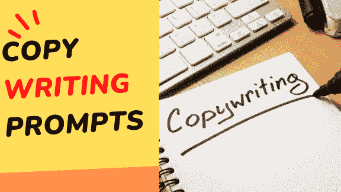

# 11. 写作提示

1.  "制作一种引人入胜的[内容类型]，旨在 resonant with 我的[理想客户角色]，激励他们在我的[网站/产品]上完成[期望的行动]。"

1.  "生成有说服力的[内容类型]，旨在说服[理想客户角色]投资我的[产品/服务]，强调其独特的优势并解决潜在的疑虑。"

1.  "开发一种[内容类型]，有效地说服[理想客户角色]参加我的[计划/订阅]，提供对其价值和相关利益的全面解释。"

1.  "创建一种[内容类型]，唤起[理想客户角色]对我的[产品/服务]的[情感]，迫使他们采取[期望的行动]。"

1.  "制作一种简洁地传达我[产品/服务]的特点和优势的[内容类型]，引导他们做出清晰明智的购买决策。"

1.  "生成专门解决我的[理想客户角色]的具体挑战和要求的[内容类型]，说明我的[产品/服务]如何成为理想的解决方案。"

1.  "撰写一种 [内容类型]，通过引人注目的标题和引子吸引我的[理想客户角色]的注意，并随后使用有说服力的语言和有力的证据，说服他们采取[期望的行动]。"

1.  "打造一种[内容类型]，讲述关于我的[产品/服务]如何帮助[理想客户角色]实现他们的[目标]的引人入胜的故事，以贴近和引人入胜的方式呈现。"

1.  "生成一种从我的[理想客户角色]那里唤起[情感]的[内容类型]，迫使他们急切采取[期望的行动]。"

1.  "制作一种[内容类型]，清楚地概述我的[产品/服务]的特点和优势，说服[理想客户角色]通过有吸引力的号召行动来购买。"

1.  "开发了强调我[产品/服务]的独特特点和优势以影响[理想客户角色]进行购买的[内容类型]。"

1.  "创建专注于克服我与[理想客户角色]可能出现的异议和疑虑的[内容类型]，最终说服他们追求[期望的行动]。"

1.  "撰写一种与我的[理想客户角色]建立信任和信誉的[内容类型]，展示以前用户的成功和证词。"

1.  "创建一种展示我[产品/服务]的价值和好处的[内容类型]，利用社会证明和建立信誉的元素来影响他们朝向[期望的行动]。"

1.  "设计[内容类型]，直接解决我的[理想客户人设]的需求和痛点，说服他们迅速采取行动，带着紧迫感和引人注目的优惠。"
