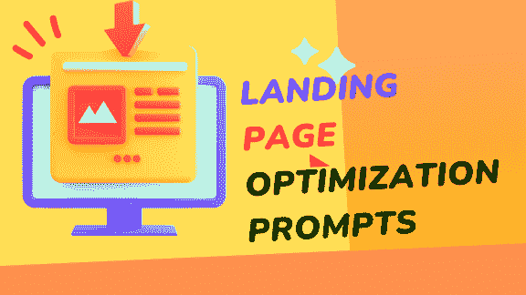

# 14.落地页优化提示

1.  你能设计一个有效展示我[产品/服务]优势并鼓励访客以高转化率采取[期望行动]的落地页吗？

1.  为了确保最大转化率，我的落地页文案和布局的最佳结构是什么？

1.  我可以采取哪些策略来有效地优化我的落地页以满足移动用户的需求？

1.  制作一个个性化的落地页，根据访客的需求和兴趣量身定制信息。

1.  开发一个针对我们的 PPC 广告进行优化的落地页，包含关于我们的[产品/服务]的所有必要信息。

1.  如何利用 A/B 测试来提升我的落地页的转化率？

1.  评估我的落地页的指标，并提出如何提升其性能的建议。

1.  创作一个既适合移动设备又能为移动用户优化的落地页内容的最有效方法是什么？
