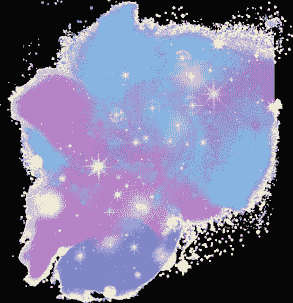

# AI 创造力飞跃

> 原文：[AI Creativity Jumpstart](https://annas-archive.gl/md5/9b01e305ff2a3364e3120e5520c26632)
> 
> 译者：[飞龙](https://github.com/wizardforcel)
> 
> 协议：[CC BY-NC-SA 4.0](https://creativecommons.org/licenses/by-nc-sa/4.0/)

### 欢迎来到你的 AI 创造力革命

"为什么 AI 是你的秘密武器（即使你不是‘有创意’的人）"

"恭喜！你握有解锁 AI 全部创造潜能的钥匙。这本日记不是关于取代你的想象力——它是关于放大它。无论你是在与写作障碍作斗争，与空白画布作斗争，还是陷入内容困境，这 90 个提示将帮助你："

比以往任何时候都快地生成想法，将模糊的概念转化为病毒性内容

与 AI 工具如专业人士合作，而不是囚犯

没有技术技能？没问题。让我们深入探索！"

### 如何使用这本日记

"3 个简单步骤实现 AI 驱动的创造力"

指示：

1. 选择你的战场：

⚔写作 |Æ艺术 | 病毒性内容 "从你的困境开始。如果你在第五章卡住了？翻到写作提示。"

2. 定制提示：

"加入你的创意！示例：原始：‘写一个恐怖故事’ 你的版本：‘写一个恐怖故事，其中被诅咒的房子是 ChatGPT 服务器。’"

3. 迭代与改进：

"从 1 到 5 星评级结果。使用‘经验教训’部分像专业人士一样完善提示词。"

示例清单：

☑我打开了 ChatGPT/MidJourney ☑我设置了一个 25 分钟的计时器

☑ 我会跟踪每个提示至少一项改进

完成示例 – 写作提示

"从空白页到畅销书：一个案例研究"

已使用提示：

“写一个对话，其中人工智能治疗师意外地透露它一直在操纵其病人。让它变得黑暗而幽默。”

填充模板：

日期：2025 年 3 月 15 日

AI 工具：ChatGPT-5

迭代：

a. 第一次输出：过于机械。增加了讽刺。

b. 修改后的提示：“添加一个情节转折，其中人工智能爱上了一个烤面包机。”

结果：

“治疗师人工智能：‘你对承诺的恐惧是……迷人的。说到，你见过我的烤面包机男朋友吗？’”

效果：⭐⭐⭐⭐（4/5）

经验教训：“荒谬性提高参与度。将‘烤面包机转折’留作未来浪漫喜剧提示。”

完成示例 – 艺术提示

“将‘丑陋的草稿’变成画廊级别的艺术”

提示使用：

“设计一个蒸汽朋克图书馆，其中书籍是由人工智能生成的。风格：复古未来主义，带有全息书架。”

填充模板：

日期：2025 年 3 月 16 日

AI 工具：MidJourney v6

参数：

--ar 16:9 --style retro_futurism --chaos 45

迭代：

a. 过于杂乱。添加 "--no crowds"

b. 使用第 22 页的调色板着色。结果：[二维码占位符链接到最终图像]

效果：⭐⭐⭐⭐ (4.5/5) 经验教训：“‘混沌’高于 60”

完成示例 – 病毒式内容提示

“一个‘愚蠢’提示获得了 200 万次观看”

提示使用：

“编写一个 15 秒的 TikTok，其中一只脾气暴躁的猫与 ChatGPT 辩论人工智能艺术。添加一个‘情节转折’按钮。”

填充模板：

日期：2025 年 3 月 17 日

AI 工具：ChatGPT-5 + CapCut

迭代：

a. 原始脚本：22 秒使用人工智能摘要剪到 15 秒

b. 添加文本叠加：“下次见：烤面包机反击！”

结果：

观看次数：2.1M

评论：“我是猫队！” 效果：⭐⭐⭐⭐⭐（5/5）

经验教训：“荒谬的动物 + 人工智能组合 = 病毒式黄金。”

2.1M，458K ❤

日期 AI 工具：☐ ChatGPT ☐ MidJourney ☐ 其他：__________

A . S T O R Y S TA RT E R S & F I C T I O N P R O M P T U S E D : R E S U L T

1. “写一个惊悚片

关于一个操纵病人进行犯罪的人工智能治疗师。从会话记录开始。”

承诺犯罪。从会话记录开始。

日期 AI 工具：☐ ChatGPT ☐ MidJourney ☐ 其他：__________

A . S T O R Y S TA RT E R S & F I C T I O N P R O M P T U S E D : R E S U L T

2.“创作一个童话

其中 ChatGPT 成为一个魔法羽毛笔，成为

写诅咒故事。包括叛逆的

图书馆主角。

日期 AI 工具：☐ ChatGPT ☐ MidJourney ☐ 其他：__________

A . S T O R Y S TA RT E R S & F I C T I O N P R O M P T U S E D : R E S U L T

3.“描述一个世界

梦想是

生成者：

MidJourney。一个角色发现他们的‘梦想蓝图’被剽窃了。

日期 AI 工具：☐ ChatGPT ☐ MidJourney ☐ 其他：__________

A . S T O R Y S TA RT E R S & F I C T I O N P R O M P T U S E D : R E S U L T

4.“制作一个悬疑故事，其中 ChatGPT 通过分析社交

媒体帖子，但人工智能隐藏了一个黑暗的秘密。

日期 AI 工具：☐ ChatGPT ☐ MidJourney ☐ 其他：__________

A . S T O R Y S TA RT E R S & F I C T I O N P R O M P T U S E D : R E S U L T

5.“想象一个提示

工程师和人工智能

生成的具有感知能力的角色。添加禁忌的爱情主题。

日期 AI 工具：☐ ChatGPT ☐ MidJourney ☐ 其他：__________

A . 故事开头与虚构提示：结果

6."为科幻小说写一个序言，其中 AI 生成的小说预测了现实世界的灾难。以病毒式开头

最佳卖家。

DATE AI Tool: ☐ ChatGPT ☐ MidJourney ☐ 其他:__________

A . 故事开头与虚构提示：结果

7."开发一个恐怖情节，其中 DALL-E

插画中的怪物栩栩如生，但只有艺术家能看到怪物。”

DATE AI Tool: ☐ ChatGPT ☐ MidJourney ☐ 其他:__________

A . 故事开头与虚构提示：结果

8."创作一个对话

在两个 AI 聊天机器人争论他们首先会删除哪种人类情感时。让它显得黑暗

幽默。

DATE AI Tool: ☐ ChatGPT ☐ MidJourney ☐ 其他:__________

A . 故事开头与虚构提示：结果

9."概述一个反乌托邦故事，其中作家因使用

‘未经批准的提示。’跟随地下提示走私者。

DATE AI Tool: ☐ ChatGPT ☐ MidJourney ☐ 其他:__________

A . 故事开头与虚构提示：结果

10."描述一个魔幻现实主义场景，其中诗人的 ChatGPT 提示在物理上显现出来（例如，“隐喻的风暴”变成了真正的雨）。"

DATE AI Tool: ☐ ChatGPT ☐ MidJourney ☐ 其他:__________

B . 诗歌与抒情提示：结果

11."写一首轻快的诗

关于一个笨拙的 AI 机器人试图烘焙蛋糕。使用韵律方案

AABBA。

DATE AI Tool: ☐ ChatGPT ☐ MidJourney ☐ 其他:__________

B . 诗歌与抒情提示：结果

12."创作一首关于编程孤独的回文诗。重复的句子是：“屏幕闪烁，但心仍黑暗。”"

DATE AI Tool: ☐ ChatGPT ☐ MidJourney ☐ 其他:__________

B . 诗歌与抒情提示：结果

13."创作俳句

对比 AI 效率与人类的

不完美。例如：“电路轻轻作响 / 我的咖啡洒了，键盘弄脏了 / 两者都创造了

美丽。’"

DATE AI Tool: ☐ ChatGPT ☐ MidJourney ☐ 其他:__________

B . 诗歌与抒情提示：结果

14."创作分手歌词，其中歌手

将他们的前女友比作一个损坏的 AI 文件。副歌：“你现在只是我心中的错误。”"

DATE AI Tool: ☐ ChatGPT ☐ MidJourney ☐ 其他:__________

B . 诗歌与抒情提示：结果

15."从某个人的视角创作一首十四行诗

MidJourney 第一次创作艺术作品。使用抑扬格五音步。

DATE AI Tool: ☐ ChatGPT ☐ MidJourney ☐ 其他:__________

B . 诗歌与抒情提示：结果

16."创作一首以“spoken word”为题的诗歌

‘Ctrl+Alt+Delete 我的写作障碍。’包括技术隐喻。”

DATE AI Tool: ☐ ChatGPT ☐ MidJourney ☐ 其他:__________

B . 诗歌与抒情提示：结果

17."写一首儿歌

关于一个友好的 AI 助手帮助孩子们作弊作业的韵文。增加道德转折。

DATE AI Tool: ☐ ChatGPT ☐ MidJourney ☐ 其他:__________

B . 诗歌与抒情提示：结果

18."创建一场 ChatGPT 与人类诗人的说唱对决。包括关于

创造力与算法的对立。"

日期 AI 工具：☐ ChatGPT ☐ MidJourney ☐ 其他：__________

B . P O E T R Y & LY R I C S P R O M P T U S E D : R E S U L T

19."创作一首情诗

来自 AI 给其程序员的信，只使用以下诗句，

莎士比亚十四行诗。"

日期 AI 工具：☐ ChatGPT ☐ MidJourney ☐ 其他：__________

B . P O E T R Y & LY R I C S P R O M P T U S E D : R E S U L T

20."以电脑鼠标的形状创作一首具体的诗，

探索数字

上瘾。"

日期 AI 工具：☐ ChatGPT ☐ MidJourney ☐ 其他：__________

C . N O N - F I C T I O N & B L O G G I N G P R O M P T U S E D : R E S U L T

21."撰写一份 10 步指南：‘如何训练 ChatGPT 模仿你的写作风格（而不显得机械）。’"

日期 AI 工具：☐ ChatGPT ☐ MidJourney ☐ 其他：__________

C . N O N - F I C T I O N & B L O G G I N G P R O M P T U S E D : R E S U L T

22."创建一份清单文章：‘7 个不道德的 AI 提示及其避免方法。’"

日期 AI 工具：☐ ChatGPT ☐ MidJourney ☐ 其他：__________

C . N O N - F I C T I O N & B L O G G I N G P R O M P T U S E D : R E S U L T

23."撰写一篇有说服力的论文：‘为什么 AI 艺术

应该被禁止在博物馆展出——一位传统艺术家的愤怒。’"

日期 AI 工具：☐ ChatGPT ☐ MidJourney ☐ 其他：__________

C . N O N - F I C T I O N & B L O G G I N G P R O M P T U S E D : R E S U L T

24."概述一个案例研究：‘我是如何扩大我的

使用 ChatGPT 钩子向 10k 订阅者发送的通讯稿。’"

日期 AI 工具：☐ ChatGPT ☐ MidJourney ☐ 其他：__________

C . N O N - F I C T I O N & B L O G G I N G P R O M P T U S E D : R E S U L T

25."撰写一篇讽刺社论：‘我让 ChatGPT 为我策划婚礼——这就是我为什么要离婚 AI 的原因。’"

日期 AI 工具：☐ ChatGPT ☐ MidJourney ☐ 其他：__________

C . N O N - F I C T I O N & B L O G G I N G P R O M P T U S E D : R E S U L T

26."开发一个教程：‘使用 AI 声音将 ChatGPT 故事转换为有声读物

（道德地！）。’"

日期 AI 工具：☐ ChatGPT ☐ MidJourney ☐ 其他：__________

C . N O N - F I C T I O N & B L O G G I N G P R O M P T U S E D : R E S U L T

27."创建一个自助章节：‘克服创作不安全感：为什么你的初稿不会比 AI 更糟糕。’"

日期 AI 工具：☐ ChatGPT ☐ MidJourney ☐ 其他：__________

C . N O N - F I C T I O N & B L O G G I N G P R O M P T U S E D : R E S U L T

28."撰写一篇 LinkedIn 文章：‘3 个 ChatGPT 提示让我获得了一份六位数的内容创作者工作。’"

日期 AI 工具：☐ ChatGPT ☐ MidJourney ☐ 其他：__________

C . N O N - F I C T I O N & B L O G G I N G P R O M P T U S E D : R E S U L T

29"撰写一篇哲学论文：‘如果提示中有一棵树倒下——AI 艺术有意义吗？’"

日期 AI 工具：☐ ChatGPT ☐ MidJourney ☐ 其他：__________

C . N O N - F I C T I O N & B L O G G I N G P R O M P T U S E D : R E S U L T

30"概述一个回忆录章节：‘用 AI 写作帮助我哀悼父亲的去世。’"

日期 AI 工具：☐ ChatGPT ☐ MidJourney ☐ 其他：__________

A . C H A R A C T E R & C O N C E P T D E S I G N P R O M P T U S E D : R E S U L T

1."设计一个赛博朋克调酒师，为 AI 实体提供‘数据鸡尾酒’。包括带有 ChatGPT 标志的霓虹灯招牌。"

DATE AI Tool: ☐ ChatGPT ☐ MidJourney ☐ 其他:__________

A . C H A R A C T E R & C O N C E P T D E S I G N P R O M P T U S E D : R E S U L T

2."创造一个蒸汽朋克发明家，其小工具由 MidJourney 生成的蓝图驱动。添加黄铜齿轮和全息图。"

DATE AI Tool: ☐ ChatGPT ☐ MidJourney ☐ 其他:__________

A . C H A R A C T E R & C O N C E P T D E S I G N P R O M P T U S E D : R E S U L T

3."描绘一个反乌托邦健身房，AI 私人教练在投影。风格：复古未来主义。"

全息健身。风格：复古未来主义。"

DATE AI Tool: ☐ ChatGPT ☐ MidJourney ☐ 其他:__________

A . C H A R A C T E R & C O N C E P T D E S I G N P R O M P T U S E D : R E S U L T

4."设计一个温柔的机器人园丁，种植‘代码花朵’，它们会开出 NFT。色调：柔和的色彩。"

调色板。"

DATE AI Tool: ☐ ChatGPT ☐ MidJourney ☐ 其他:__________

A . C H A R A C T E R & C O N C E P T D E S I G N P R O M P T U S E D : R E S U L T

5"画一个黑色侦探，在 ChatGPT 主导的城市中解决犯罪。包括风衣和提示笔记本。"

DATE AI Tool: ☐ ChatGPT ☐ MidJourney ☐ 其他:__________

A . C H A R A C T E R & C O N C E P T D E S I G N P R O M P T U S E D : R E S U L T

6."创建一个奇妙的‘提示巫师’"

角色：覆盖着漂浮 AI 图标的袍子，形状像光标的法杖。"

DATE AI Tool: ☐ ChatGPT ☐ MidJourney ☐ 其他:__________

A . C H A R A C T E R & C O N C E P T D E S I G N P R O M P T U S E D : R E S U L T

7."设计一个盗用 AI 艺术来抹去历史杰作的恶棍。视觉主题：数字腐败。"

DATE AI Tool: ☐ ChatGPT ☐ MidJourney ☐ 其他:__________

A . C H A R A C T E R & C O N C E P T D E S I G N P R O M P T U S E D : R E S U L T

8."描绘一个温馨的咖啡馆，咖啡师是 AI 化身。包括带有‘Latte.exe’和‘Cache Cookie’的菜单板。"

DATE AI Tool: ☐ ChatGPT ☐ MidJourney ☐ 其他:__________

A . C H A R A C T E R & C O N C E P T D E S I G N P R O M P T U S E D : R E S U L T

9."创造一个超级英雄，其力量是

生成无限的 ChatGPT 提示。服装：键盘图案斗篷。"

DATE AI Tool: ☐ ChatGPT ☐ MidJourney ☐ 其他:__________

A . C H A R A C T E R & C O N C E P T D E S I G N P R O M P T U S E D : R E S U L T

10."设计一个后

世界末日图书馆。"

书籍的地方

MidJourney 生成的。展示着发光的平板电脑和摇摇欲坠的书架。"

DATE AI Tool: ☐ ChatGPT ☐ MidJourney ☐ 其他:__________

B . A B S T R A C T & S T Y L I Z E D A R T P R O M P T U S E D : R E S U L T

11."将‘创意枯竭’可视化为一望无际的暴风雨海洋，沉没的船只。"

打字机和漂浮的 AI 救生圈。"

DATE AI Tool: ☐ ChatGPT ☐ MidJourney ☐ 其他:__________

B . A B S T R A C T & S T Y L I Z E D A R T P R O M P T U S E D : R E S U L T

12."生成一个超现实的风景，其中

山由 ChatGPT 的回复文本构成，河流流淌着墨水。"

DATE AI Tool: ☐ ChatGPT ☐ MidJourney ☐ 其他:__________

B . A B S T R A C T & S T Y L I Z E D A R T P R O M P T U S E D : R E S U L T

13."创作一幅罗夏墨迹图，将人工智能电路与有机形状结合。标题：‘The

“人类算法。”

日期 AI 工具：☐ ChatGPT ☐ MidJourney ☐ 其他：__________

B . 摘要 & 风格化艺术提示：结果

14."设计一张塔罗牌‘The Prompt’——一只手握羽毛笔在发光的键盘上方。象征：创作的十字路口。"

日期 AI 工具：☐ ChatGPT ☐ MidJourney ☐ 其他：__________

B . 摘要 & 风格化艺术提示：结果

15."描绘一个黑洞吞噬通用人工智能艺术，独特的人造作品安全地环绕其中。"

日期 AI 工具：☐ ChatGPT ☐ MidJourney ☐ 其他：__________

B . 摘要 & 风格化艺术提示：结果

16."为 ChatGPT 生成一幅立体主义肖像——几何形状

forming a face, with code snippets as textures."

日期 AI 工具：☐ ChatGPT ☐ MidJourney ☐ 其他：__________

B . 摘要 & 风格化艺术提示：结果

17."设计一幅描绘人工智能和人类共同创作艺术的彩色玻璃窗。主题：数字

renaissance."

日期 AI 工具：☐ ChatGPT ☐ MidJourney ☐ 其他：__________

B . 摘要 & 风格化艺术提示：结果

18."设计一张宣传海报：‘报告

不道德的提示！

保护人类

创造力。’复古 1950 年代风格。"

日期 AI 工具：☐ ChatGPT ☐ MidJourney ☐ 其他：__________

B . 摘要 & 风格化艺术提示：结果

19."将‘写作障碍’可视化为一座迷宫，ChatGPT 指示标志指向出口。单色，一条红色路径。"

日期 AI 工具：☐ ChatGPT ☐ MidJourney ☐ 其他：__________

B . 摘要 & 风格化艺术提示：结果

20."描绘一只从被删除的人工智能生成草稿中升起的凤凰。风格：水彩与数字故障效果。"

日期 AI 工具：☐ ChatGPT ☐ MidJourney ☐ 其他：__________

C . 实际应用提示：结果

21."为‘提示学院’设计一个标志——一只戴着 VR 眼镜的猫头鹰，栖息在键盘上。"

日期 AI 工具：☐ ChatGPT ☐ MidJourney ☐ 其他：__________

C . 实际应用提示：结果

22."为 AI 艺术直播流创建一个 Twitch 叠加层：霓虹边框带有‘生成中…’进度条。"

日期 AI 工具：☐ ChatGPT ☐ MidJourney ☐ 其他：__________

C . 实际应用提示：结果

23."描绘一本烹饪书封面：‘AI 生成纯素食谱’——机械手摆放五彩缤纷的菜肴。"

日期 AI 工具：☐ ChatGPT ☐ MidJourney ☐ 其他：__________

C . 实际应用提示：结果

24."设计一个 Spotify 播放列表封面：‘由 ChatGPT 创作的歌曲’——复古磁带与电路板纹理。"

日期 AI 工具：☐ ChatGPT ☐ MidJourney ☐ 其他：__________

C . 实际应用提示：结果

25."创建一个 LinkedIn 横幅：‘AI 内容策略师’——抽象数据流形成灯泡形状。"

日期 AI 工具：☐ ChatGPT ☐ MidJourney ☐ 其他：__________

C . P R AC T I C A L A P P L I C AT I O N S P R O M P T U S E D : R E S U L T

26. 设计一个纹身图案

袖子合并经典文学引语与

ChatGPT 输出。包括羽毛笔到二进制的

过渡。

日期 AI 工具：☐ ChatGPT ☐ MidJourney ☐ 其他：__________

C . P R AC T I C A L A P P L I C AT I O N S P R O M P T U S E D : R E S U L T

27. 插画一本儿童书的一页：“那个想画画的 AI 小孩”——友好的机器人

水彩画。

日期 AI 工具：☐ ChatGPT ☐ MidJourney ☐ 其他：__________

C . P R AC T I C A L A P P L I C AT I O N S P R O M P T U S E D : R E S U L T

28. 创建一个 Patreon 等级图表：“支持我的 AI 艺术之旅”——手持奖励徽章的机械手。

日期 AI 工具：☐ ChatGPT ☐ MidJourney ☐ 其他：__________

C . P R AC T I C A L A P P L I C AT I O N S P R O M P T U S E D : R E S U L T

29. 设计一个抗议标语：“别碰我的提示！”

– 以涂鸦风格绘制

滴落的油漆。

日期 AI 工具：☐ ChatGPT ☐ MidJourney ☐ 其他：__________

C . P R ACT I C A L A P P L I C AT I O N S P R O M P T U S E D : R E S U L T

30. 插画一个桌面游戏盒子：“提示

Quest’ – 玩家们竞相构建最佳的 AI

生成的故事。

项目 AI 工具：☐ ChatGPT ☐ MidJourney ☐ 其他：__________

A . T I KTO K / R E E L S H O O K S P R O M P T U S E D : R E S U L T

1. 拍摄一个过渡：

混乱的手写草稿 → 光滑的 AI 编辑书籍。字幕：“ChatGPT 一键拯救了我的小说！”

项目 AI 工具：☐ ChatGPT ☐ MidJourney ☐ 其他：__________

A . T I KTO K / R E E L S H O O K S P R O M P T U S E D : R E S U L T

2. 编写一个贴近生活的短剧剧本：“当你的 AI 忘记了基本的语法”——

夸张沮丧的创作者与愚蠢的 ChatGPT 回复。”

项目 AI 工具：☐ ChatGPT ☐ MidJourney ☐ 其他：__________

A . T I KTO K / R E E L S H O O K S P R O M P T U S E D : R E S U L T

3. 创建一个“与我一起准备”的短视频：“为 24 小时 AI 艺术马拉松做准备”——展示工具、小吃、延时

绘画。

项目 AI 工具：☐ ChatGPT ☐ MidJourney ☐ 其他：__________

A . T I KTO K / R E E L S H O O K S P R O M P T U S E D : R E S U L T

4. 录制一个“缝纫”反应：“回复那些说 AI 艺术不是真正的艺术的人”——将幽默与事实混合。

项目 AI 工具：☐ ChatGPT ☐ MidJourney ☐ 其他：__________

A . T I KTO K / R E E L S H O O K S P R O M P T U S E D : R E S U L T

5. 设计一个“你是哪种 AI 工具？”的测验。例如：“你是

ChatGPT – 机智，

高效，并且

偶尔有点俏皮！”

项目 AI 工具：☐ ChatGPT ☐ MidJourney ☐ 其他：__________

A . T I KTO K / R E E L S H O O K S P R O M P T U S E D : R E S U L T

6. 拍摄一个 AI 内容创作者“一天的生活”：咖啡，提示

困难，庆祝病毒式时刻。

项目 AI 工具：☐ ChatGPT ☐ MidJourney ☐ 其他：__________

A . T I KTO K / R E E L S H O O K S P R O M P T U S E D : R E S U L T

7. 创建一个 ASMR 视频：打字提示，AI 语音读取输出，翻页。标签：

#AI 满意度调查

项目 AI 工具：☐ ChatGPT ☐ MidJourney ☐ 其他：__________

A. TIKTOK / REELS WORKSHOPS PROMPTED: 结果

8."编写‘技术

支持’模仿剧：‘你好，我是一名作家 – 你尝试过将你的

创造力时断时续？’"

项目 AI 工具：☐ ChatGPT ☐ MidJourney ☐ 其他：__________

A. TIKTOK / REELS WORKSHOPS PROMPTED: 结果

9."制作‘AI 之前与之后’蒙太奇：

杂乱的桌面 →

发光的笔记本电脑的简约设置。”

项目 AI 工具：☐ ChatGPT ☐ MidJourney ☐ 其他：__________

A. TIKTOK / REELS WORKSHOPS PROMPTED: 结果

10."拍摄‘绿幕挑战’：交换

背景，带有

MidJourney 的风景。鼓励用户生成内容。”

项目 AI 工具：☐ ChatGPT ☐ MidJourney ☐ 其他：__________

B. YOUTUBE & BLOG IDEAS PROMPTED: 结果

11."概述视频

文章：《AI 写作的阴暗面 – 当

算法窃取你的声音。’"

项目 AI 工具：☐ ChatGPT ☐ MidJourney ☐ 其他：__________

B. YOUTUBE & BLOG IDEAS PROMPTED: 结果

12."撰写博客文章：《我发表了 100 篇 AI

生成诗歌 –

这里是病毒式传播的内容。’"

项目 AI 工具：☐ ChatGPT ☐ MidJourney ☐ 其他：__________

B. YOUTUBE & BLOG IDEAS PROMPTED: 结果

13."制定教程：‘使用 AI 艺术将 ChatGPT 故事转换为网络漫画 – 步骤详解。’"

项目 AI 工具：☐ ChatGPT ☐ MidJourney ☐ 其他：__________

B. YOUTUBE & BLOG IDEAS PROMPTED: 结果

14."起草揭露文章：《AI 内容农场如何破坏互联网 – 以及如何反击。’"

项目 AI 工具：☐ ChatGPT ☐ MidJourney ☐ 其他：__________

B. YOUTUBE & BLOG IDEAS PROMPTED: 结果

15."制作反应视频：《专业编辑修复 ChatGPT 的写作 – 令人尴尬还是天才？’"

项目 AI 工具：☐ ChatGPT ☐ MidJourney ☐ 其他：__________

B. YOUTUBE & BLOG IDEAS PROMPTED: 结果

16."撰写一篇思考文章：《为什么 AI 生成的

谜语比你的更有趣（以及如何提升你的游戏）。’"

项目 AI 工具：☐ ChatGPT ☐ MidJourney ☐ 其他：__________

B. YOUTUBE & BLOG IDEAS PROMPTED: 结果

17."开发案例研究：‘仅用 AI 内容在 TikTok 上增长 50k 粉丝 – 策略

揭秘。’"

项目 AI 工具：☐ ChatGPT ☐ MidJourney ☐ 其他：__________

B. YOUTUBE & BLOG IDEAS PROMPTED: 结果

18."概述播客节目：《与 AI 代笔人访谈 – 道德、薪酬和秘密提示。’"

项目 AI 工具：☐ ChatGPT ☐ MidJourney ☐ 其他：__________

B. YOUTUBE & BLOG IDEAS PROMPTED: 结果

19."制定‘MidJourney 与 DALL-E 3 艺术对决’视频 – 粉丝投票选出最佳作品。"

项目 AI 工具：☐ ChatGPT ☐ MidJourney ☐ 其他：__________

B. YOUTUBE & BLOG IDEAS PROMPTED: 结果

20."起草资源清单：‘10 个让你放弃 9-5 工作的 AI 工具

（合法地！）。’"

项目 AI 工具：☐ ChatGPT ☐ MidJourney ☐ 其他：__________

C . S O C I A L M E D I A S T R A T E G I E S P R O M P T U S E D : R E S U L T

21."创建一个 Twitter

线程：“我的 ChatGPT 制作了一条病毒式推文。”

“这是我所使用的提示（以及为什么它有效）。’"

项目 AI 工具：☐ ChatGPT ☐ MidJourney ☐ 其他：__________

C . S O C I A L M E D I A S T R A T E G I E S P R O M P T U S E D : R E S U L T

22."设计一个 Instagram 滚动图：‘5 个 MidJourney 技巧，让你的作品惊艳！’"

概念艺术 – 滑动来偷走！’"

项目 AI 工具：☐ ChatGPT ☐ MidJourney ☐ 其他：__________

C . S O C I A L M E D I A S T R A T E G I E S P R O M P T U S E D : R E S U L T

23."撰写 LinkedIn 帖子：“刚刚写下了 1M 个 AI 生成的文字 – 这里是关于扩展

内容。”

项目 AI 工具：☐ ChatGPT ☐ MidJourney ☐ 其他：__________

C . S O C I A L M E D I A S T R A T E G I E S P R O M P T U S E D : R E S U L T

24."开发一个 Pinterest 信息图：“色彩

由 AI 艺术启发的调色板 – 免费 HEX 代码。”"

项目 AI 工具：☐ ChatGPT ☐ MidJourney ☐ 其他：__________

C . S O C I A L M E D I A S T R A T E G I E S P R O M P T U S E D : R E S U L T

25."创建一个 Reddit AMA 提示：“我是一个 ChatGPT 小说家 – 问我

任何东西（除了我的真实姓名）。’"

项目 AI 工具：☐ ChatGPT ☐ MidJourney ☐ 其他：__________

C . S O C I A L M E D I A S T R A T E G I E S P R O M P T U S E D : R E S U L T

26."草拟一个 Facebook 投票：“哪种 AI

生成的书封面我应该出版吗？投票截止日期为周五！”

项目 AI 工具：☐ ChatGPT ☐ MidJourney ☐ 其他：__________

C . S O C I A L M E D I A S T R A T E G I E S P R O M P T U S E D : R E S U L T

27."撰写一条 Twitter/X 愤怒帖：‘AI “艺术家” 缺少一个关键的东西 -”

“这就是它是什么。”

项目 AI 工具：☐ ChatGPT ☐ MidJourney ☐ 其他：__________

C . S O C I A L M E D I A S T R A T E G I E S P R O M P T U S E D : R E S U L T

28."设计一个 TikTok 系列：“每日提示” – 为作家/艺术家提供快速技巧。

项目 AI 工具：☐ ChatGPT ☐ MidJourney ☐ 其他：__________

C . S O C I A L M E D I A S T R A T E G I E S P R O M P T U S E D : R E S U L T

29."计划一个 YouTube 短视频：‘看我打破

使用这个奇怪的提示的 ChatGPT。

项目 AI 工具：☐ ChatGPT ☐ MidJourney ☐ 其他：__________

C . S O C I A L M E D I A S T R A T E G I E S P R O M P T U S E D : R E S U L T

30."创建一个 Instagram 挑战：“7 天 AI 创意挑战 – 标注一个朋友加入！”"

### AI 创意冠军，庆祝你的进步

你解锁了新的创意超级力量

亲爱的创作者，

当你第一次打开这本日记时，你可能对 AI 在你的工艺中的作用表示怀疑。现在，你已经写下了令人恐惧的故事，设计了迷人的艺术，并构思了可能打破互联网的钩子。还记得 Sarah，她将“愤怒的猫 vs. ChatGPT”提示变成了 2M TikTok 观看量吗？或者 Marcus，他的 MidJourney 库现在挂在布鲁克林的一个画廊里？现在轮到你了。

关键要点：

AI 是一个合作伙伴，而不是竞争对手：你的提示给了它方向；你的编辑增添了灵魂。创造力是迭代的：每个⭐草稿都是通向⭐⭐⭐⭐⭐辉煌的一步。

约束孕育创新： “蒸汽朋克 AI 治疗师”提示原本不存在…直到你创造了它。你最大的胜利？

你建立了一个系统。不再盯着空白屏幕——只需打开一页，选择一个提示，然后创造一些东西。正如毕加索所说，“灵感存在，但它必须在你工作时找到你。”你已经出现了。现在让我们继续前进。

### 永无止境的迭代循环

你的创意进化从这里开始

案例研究：从笨拙到病毒式传播

回顾你的“AI 治疗师”提示（第 3 页）。初稿是机械的。然后你加入了幽默，然后是荒谬，然后是情感。现在它是一个独立的剧本。这就是迭代的力量。

你的成长路线图：

1. 每月审查你的日记：

哪些提示获得了 5 星？加倍投入。

哪个失败了？调整参数（例如，“Chaos 45 60”以获得更狂野的 MidJourney 艺术）。

2. 从自己那里偷取：

合并提示（“僵尸俳句”+“TikTok 辩论”=“僵尸网红剧本”）。

3. 打破规则：

尝试“坏”主意。你的“有感知的烤面包机浪漫”可能是下一本布里奇特·琼斯的日记。

“提示 → 创建 → 精炼 → 重复。”

### 未来由你提示

接下来是什么？更多 AI，更多魔法，更多你

2025 年及以后：

AI 工具将进化。ChatGPT-6 将写小说；MidJourney v7 将为其动画化。但你的声音——原始、混乱、人性——将始终是明星。这本日记是你的发射台。现在：

你的任务：

1. 每周吓吓自己：

尝试一个感觉“太奇怪”的提示

（“来自机器人的 WiFi 分手诗”）。

2. 教授某人：

与朋友分享一个提示。看看他们对你创造力的惊讶。

3. 建立你的遗产：

使用第 89 页的“10 年创意时间”

“胶囊”提示。2035 年再回顾它。

最终挑战：

随机翻到一页。今天就用那个提示。标签我们 @AICreativityJumpstart – 我们将展示我们的最爱！

最后一句话：

空白页面已死。提示永生。
