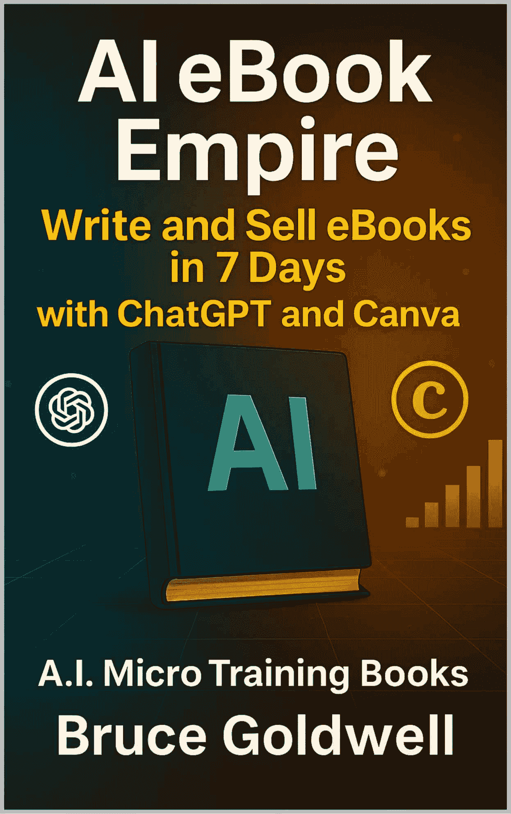

# AI 电子书帝国：在 7 天内编写和销售电子书

> 原文：[AI eBook Empire: Write and Sell eBooks in 7 Days with ChatGPT and Canva](https://annas-archive.gl/md5/9a6d3f6547eb9947dcc48d585b2a60f0)
> 
> 译者：[飞龙](https://github.com/wizardforcel)
> 
> 协议：[CC BY-NC-SA 4.0](https://creativecommons.org/licenses/by-nc-sa/4.0/)

## 引言 – 在 7 天内建立您的第一本电子书

想象一下，到下周这个时候，你已经写完并发布了整本电子书——无需盯着空白页面或雇佣团队。多亏了 ChatGPT、Canva 以及像 Amazon KDP 和 Payhip 这样的自出版平台，创建自己的书籍从未如此快速或便宜。

本指南将向您展示确切步骤：

+   猛烈思考一个获胜的主题

+   使用 AI 编写完整的电子书

+   设计一个专业的封面

+   在数字商店发布

+   在仅仅一周内开始赚取被动收入

您不需要成为专家作家。您不需要昂贵的软件。您只需要一台笔记本电脑、几个小时，以及遵循简单计划的意愿。

作为超过 200 本书的作者，我测试了无数策略来从我的写作中赚钱。现在，我想把我在使用中最简单、最强大的系统之一传授给你——这个系统让你能够快速创建简短、有影响力的书籍，并将它们转化为盈利的数字资产。

无论你是想建立全职业务还是只是开始一个有利可图的副业，现在是你的时刻。

让我们今天就开始启动你的 AI 驱动出版帝国。

这本书的 PDF 副本（含额外材料）可在以下地址获取：

[`payhip.com/b/d9ahR`](https://payhip.com/b/d9ahR)

 [`youtu.be/Rk5v1r-13fc`](https://youtu.be/Rk5v1r-13fc)

## 第一章：为什么 AI 电子书是被动收入的大功率

想象一下，醒来时发现账户里多了新的存款——上周或去年你写的书的销售额。这就是电子书的力量，多亏了 AI，创建它们比以往任何时候都要快、便宜和简单。

电子书就是数字书——通常在 10 到 50 页之间，专注于特定的主题、解决方案或技能。你可以在像亚马逊 KDP、Payhip 或 Gumroad 这样的平台上销售它，买家可以立即下载到他们的手机、平板电脑或 Kindle 上阅读。只需一个文件，你就可以触达全球读者，多年赚取版税，而且永远不用担心库存、运输或印刷成本。

为什么电子书是终极数字产品

1. 低成本

你不需要编辑团队、昂贵的软件或营销机构。有了 ChatGPT、Canva 和免费出版平台，你可以零成本地写作和发布一本书。

2. 快速创建

与可能需要数月的传统出版不同，你可以使用 AI 在周末内概述、撰写和格式化一本电子书。像 ChatGPT 这样的工具可以在几分钟内撰写整个章节，而 Canva 可以帮助你在不到一个小时的时间内设计一个专业的封面。

3. 永久性和可扩展性

一旦发布，你的电子书可以多年产生销售。你不仅限于一个标题——你可以创建一系列、捆绑标题或撰写多个主题。你拥有的书籍越多，你的收入增长越快。

电子书的收入潜力

让我们来做数学。如果你将你的电子书定价为 5 美元：

+   每月 20 笔销售 = 每月 100 美元

+   每月 100 笔销售 = 每月 500 美元

+   每月 200 笔销售 = 每月 1000 美元

现在想象一下，你有 5-10 本书正在销售——每天每本书都能产生几笔销售。你突然发现这是一个可观的被动收入流。

示例：

一本关于“极简生活”的简短电子书，定价为 5 美元，在接下来的 60 天内售出 100 次 = 500 美元

创建 3 本关于整理、习惯或预算等相关主题的书 = 1500 美元以上

由于像亚马逊和 Payhip 这样的平台为你处理销售，你的重点可以保持在创造优质内容上，而不是处理交易或客户支持。

思维模式检查：像出版商一样思考，而不仅仅是作家

这就是许多人犹豫的地方。他们会问：

“但我有资格写一本书吗？”

在 AI 的帮助下，你不必是文学天才或某个领域的专家。你只需要好奇心、一个细分市场的想法，以及愿意遵循一个系统的意愿。如果你在一个细分市场读过几本书，你就能写一本书。

在我的《解锁无限心智》一书中，我解释了如何通过视觉化将您的信念与目标对齐。现在，想象一下您正在查看仪表板，看到每日销售额、读者评论和版税不断累积。感受看到您的想法帮助他人并获得经济回报的满足感。

您已准备好启动

电子书不仅仅是创意的出口。它们是 24/7 产生收入的微型数字资产。本章是向您展示可能性。在下一章中，我们将使用 ChatGPT 概述您的电子书——这样您就可以在几小时内从想法到书面内容。

准备好撰写您的第一本高转化率、人工智能辅助的电子书。

让我们一次构建一个标题，建立您的电子书帝国。

## 第二章：使用 ChatGPT 撰写您的电子书

一本优秀的电子书始于清晰的结构。您不需要是一位经验丰富的作家或畅销书作者才能出版您的第一本书。您只需要一个想法、一个框架，以及一个可靠的 AI 工具来帮助您快速、干净地写作。这就是 ChatGPT 的作用所在。

本章将指导您使用 ChatGPT 来构思主题、概述章节、生成内容，并完成一本精炼的电子书——通常只需一天时间。

第 1 步：使用 ChatGPT 构思电子书主题

首先要求 ChatGPT 生成高需求、趋势性的主题。

提示：列出 2025 年的 10 个热门电子书主题。

您将得到以下类型的回复：

+   极简生活

+   对于初学者来说，被动收入

+   创业者的人工智能工具

+   数字断食策略

选择一个主题，它：

+   激发您

+   反映了您所探索的内容

+   容易研究和讨论

您不必是专家——ChatGPT 填补了空白，使任何人都能写作。

第 2 步：缩小到特定领域

广泛的主题更难销售。为了脱颖而出，选择特定领域。

示例：

+   将“生产力”改为“远程工作者生产力技巧”

+   将“AI”改为“如何为 Etsy 卖家使用 ChatGPT”

花上 5 分钟列出您选择主题的三个专注的变体。选择一个既具体又灵活的——您可以在其周围构建一本短书。

第 3 步：使用 ChatGPT 概述您的电子书

一旦您的领域清晰，就是时候构建您的书籍结构了。

提示：为[您的主题]创建一个五章节的电子书大纲，包括章节标题和每个章节的 2-3 个要点。

极简生活指南示例：

第一章：什么是极简主义？

– 核心哲学

– 常见误解

– 简单性的好处

第二章：整理您的空间

– 80/20 法则的实际应用

– 如何决定保留什么

– 创建开放、宁静的环境

这种结构为您提供了清晰的目录和写作时的路线图。将其保存在 Google Docs 或您构建书籍的地方。

第 4 步：使用 ChatGPT 撰写每一章

现在，您已准备好生成内容。

提示：撰写一篇 600 字的[章节标题]，涵盖以下要点：[插入项目符号]。

ChatGPT 将在几秒钟内创建您的第一稿。阅读并轻修改以下内容：

+   语气

+   流程

+   准确性

+   个性化处理

您还可以使用后续提示，例如：

+   使其更加随意。

+   在结尾添加一个激励性的号召性用语。

+   将其简化为 9 年级阅读水平。

对每个章节重复此操作。有 5 个章节，您通常会在一天结束时完成一本 3,000-4,000 字的电子书。

第 5 步：最终编辑和润色

一旦您的章节写好，快速检查语法和可读性。您可以使用以下工具：

+   Grammarly（免费）

+   Hemingway Editor

+   Google Docs 拼写检查

确保以下内容：

+   章节标题保持一致

+   语调与您的受众相匹配

+   在手机和平板电脑上易于阅读

可选：请 ChatGPT 为您撰写引言和结论。

提示：为关于[您的主题]的电子书撰写 100 字的引言。

您现在拥有一个完整的电子书草案：由 AI 撰写，由您编辑，准备发布。

在下一章中，我们将向您展示如何在 Canva 中设计封面、格式化内容，并在亚马逊 KDP 或 Payhip 上发布您的书籍。你已经完成了一半——让我们保持势头。

## 第三章：使用 Canva 设计和发布您的电子书

当您的电子书全部写完后，是时候让它看起来很棒并上线了。您不需要昂贵的工具或设计经验——只需 Canva、ChatGPT 和免费的自出版平台。本章将指导您设计专业封面、格式化内页，并将您的书籍发布到亚马逊 KDP 和 Payhip 等平台。

您只需几个小时就能拥有一本美丽、准备出售的电子书。

第 1 步：在 Canva 中设计您的电子书封面

封面是您的第一印象——也是获得点击和销售的关键因素。

+   前往 canva.com，在模板库中搜索“eBook Cover”。

+   选择适合您主题的干净、专业的布局。

+   更新标题、副标题，并添加您的作者姓名（Bruce Goldwell 或笔名）。

+   使用粗体字体、强烈的对比和最少的杂乱。

+   对于图片，您可以使用 Canva 的免费元素或获取 Midjourney 生成的图像（每月 10 美元）以获得独特性。

将您完成的封面导出为高质量的 PNG 或 JPEG 格式。

小贴士：如果您计划撰写一系列多本书，请坚持一致的设计风格。

第 2 步：格式化内页

您有两个简单的格式化选项：

1.  Canva – 用于 PDF 电子书（最适合 Payhip 和 Gumroad）

1.  Google Docs / Word – 用于亚马逊 KDP

对于 Canva：

+   在 Canva 中打开一个新的“A4 文档”。

+   逐个粘贴你的章节。

+   使用粗体标题作为章节标题。

+   选择易于阅读的字体，如 Open Sans 或 Lato（12-14 磅）。

+   添加来自 Pexels 或 Canva 库的偶尔图片或图标。

+   插入一个标题页、目录和简短的作者简介。

完成后，将整本书导出为 PDF。

对于 Google Docs：

+   将您的书籍内容粘贴进来，使用简单的格式。

+   在章节之间添加分页符。

+   使用标题 1 用于标题，正常文本用于段落。

+   保存为.docx 文件用于亚马逊 KDP 或通过 Reedsy.com（免费工具）导出为 ePub。

第 3 步：发布到亚马逊 KDP

如果您希望您的电子书在世界最大的图书市场上列出，请上传到 kdp.amazon.com。这是免费的，并且只需不到 30 分钟。

步骤：

+   前往 KDP 并使用您的亚马逊账户登录。

+   点击“创建 Kindle 电子书”。

+   输入您的标题、作者姓名和书籍描述。

+   添加与您领域相关的最多 7 个关键词（可以使用 ChatGPT 来帮助生成这些关键词）。

+   选择与您的书籍主题相匹配的 2 个类别。

+   上传您的手稿（.docx 或.ePub）和封面（JPEG 或 PNG）。

+   设置您的价格（对于大多数电子书，建议为 2.99 美元至 9.99 美元）。

亚马逊对定价在 2.99 美元至 9.99 美元之间的书籍支付 70%的版税，因此即使每月只有 10-20 次销售，也能迅速增加收入。

第 4 步：在 Payhip 或 Gumroad 上发布

如果您想要完全控制和即时支付，请将您的 PDF 电子书发布在 Payhip 或 Gumroad 上。

对于 Payhip：

+   前往 payhip.com 并注册一个免费账户。

+   点击“添加产品”→“数字产品”。

+   上传您的 PDF 电子书，输入标题、描述和价格。

+   添加封面图片。

+   点击发布并在任何在线位置分享您的链接。

对于 Gumroad：

+   在 gumroad.com 上注册。

+   上传您的书籍并设置价格。

+   Gumroad 收取约 10%的费用，但您保留其余部分。

+   您还可以激活联盟支持，让其他人通过佣金推广您的电子书。

小贴士：Gumroad 和 Payhip 是直接通过 X、Pinterest 或电子邮件列表进行销售的理想选择，而 Amazon KDP 则能为您带来数百万读者的可见性。

工作流程示例总结

这里是一个仅使用免费工具的典型电子书制作工作流程：

+   使用 ChatGPT 写书 - 3 小时

+   使用 Canva 设计封面 - 30 分钟

+   使用 Canva 或 Docs 格式化内文 - 1 小时

+   在 KDP 和 Payhip 上发布 - 30 分钟

总计：从想法到出版书籍大约需要 5 小时。

一旦发布，您的书籍就成为了一个被动收入资产，每天无需额外工作即可销售。

在下一章中，我们将探讨如何使用社交平台推广您的电子书，并将您的成果扩展到每月 500 美元或更多。您只需再迈出一小步，就可以启动您的写作业务。

## 第四章：营销和扩展您的电子书销售

现在您的电子书已经上线，是时候让它出现在买家面前了。即使是最优秀的书籍，如果没有被人找到，也不会有人购买。本章将向您展示如何使用免费的 AI 工具和社交平台来为您的书籍引流，提高可见性，并将单本电子书变成稳定的收入来源。

您将学习如何优化您的列表、有效推广以及将您的电子书业务扩展到每月 500 美元或更多。

使用关键词优化您的标题和描述

您的电子书标题和描述是人们点击的原因。为了出现在亚马逊、Payhip 或 Gumroad 的搜索结果中，请包含您的目标受众可能使用的特定关键词。

对于您的标题，包括主要好处和一个趋势关键词。例如：

极简生活：2025 年简化您生活的入门指南

如果可能，将其控制在 60 个字符以内，以免在搜索列表中被截断。

接下来，使用 ChatGPT 编写一个关键词丰富的描述。

提示：为包含 3 个主要好处的[主题]电子书撰写 100 字的商品描述。

示例输出：

正在努力简化你的空间和心灵？本指南教你如何在 2025 年拥抱极简生活。你将学习如何自信地整理，培养更好的习惯，并为重要的事情创造更多空间。包括可操作的建议、清单和逐步计划。今天开始你的极简之旅吧！

确保你的描述中至少包含目标关键词（例如，“极简生活指南”）两次。

在 X、Pinterest 和 Medium 上推广

优化你的列表后，使用免费、快速的平台进行推广，这些平台是你的受众已经花费时间的地方。专注于 X（Twitter）、Pinterest 和 Medium。

在 X 上

发布关于你的书的简短预告，使用相关标签。

示例帖子：

刚刚发布了我的新电子书！学习如何简化你的空间和你的生活。现在在亚马逊上可用 → [链接] #极简生活 #电子书 #被动收入

每篇帖子使用 2-3 个标签。每周发布 2-4 次，内容多样化——引用、问题、好处或幕后揭秘。

在 Pinterest 上

使用 Canva 创建带有你的电子书标题和干净的封面样式的垂直图钉（735x1102px）。

图钉示例：

+   “极简生活电子书 – $5 下载”

+   “7 天内整理你的生活 – 立即 PDF 指南”

在与自我帮助、数字产品或生活方式技巧相关的版块发布帖子。在你的 Payhip 或 Gumroad 产品页面上添加链接。

在 Medium 上

将你的一部分书籍改编成一篇简短的文章（300-500 字）。在文章末尾添加一个 CTA 链接到你的书籍。

标题想法：

+   “如何在一周内简化我的生活”

+   “从我的新电子书中获得 3 个整理技巧”

小贴士：你可以要求 ChatGPT 将章节摘要重写为 Medium 帖子。

使用 ChatGPT 重新利用内容

通过使用 AI 将一章内容转化为多个内容片段来更聪明地工作。以下是方法：

提示：将关于[主题]的这一章转化为 5 条 280 字以下的推文。

提示：为这一章创建一个 50 字以内的 Pinterest 标题。

提示：使用这个电子书摘录创建一篇 100 字的博客文章。

这让你能够在 15 分钟内为每个章节创建 5-10 篇独特的帖子。使用 Buffer 或 Later 提前安排所有内容。

这个简单的再利用过程帮助你保持一致的推广，而无需每天花费数小时。

通过更多书籍和捆绑包进行扩展

大多数作者不会只写一本书——你也不应该。

完成你的第一本电子书后，为相关主题重复此过程。这会建立势头并增加你被更多买家发现的机会。

你也可以：

+   围绕一个细分市场创建 3 本书系列

+   将多本短书捆绑在一起，以$9.99-$19.99 的价格出售

+   在书籍之间进行交叉推广（“如果你喜欢这本书，看看第二本书！”）

示例：

+   《第一本书：初学者的极简生活》

+   《第二本书：数字整理：夺回你的时间和专注力》

+   《第三本书：极简预算：少花钱，多生活》

有 3-5 本书上线时，即使是适度的流量也能转化为每月 500-1000 美元的收入。

里程碑示例

假设你发布你的第一本电子书，并将其定价为 5 美元：

+   20 次销售 = 100 美元

+   每周通过 X 和 Pinterest 推广 = 每天销售 2-3 次

现在扩展到 5 本书：

+   每本书每月 20 次销售 = 每月 500 美元

持续推广，重新利用内容，并在多个平台上列出你的书籍。随着每本新书的出现，你的品牌和收入都在增长。

在下一章中，你将遇到一位兼职作家，他在 6 个月内将这个过程变成了每月 1000 美元的业务。你通往持续数字收入的道路已经开启——继续前进。

## 第五章：将一本电子书转变为系列或捆绑包

发布你的第一本电子书只是开始。增长收入最快的方法是通过将一本成功的书籍转变为系列、捆绑包甚至相关产品的数字图书馆来建立势头。喜欢一本书的读者更有可能购买下一本书——特别是如果你让它变得简单并提供价值。

这就是如何通过几个额外的步骤来扩展你的品牌并增加你的收入流。

创建一个主题 3 部分系列

如果你的第一本书解决了一个问题，你的第二本和第三本书可以深入挖掘或扩展到相关主题。例如系列：

+   极简生活 1：整理你的家

+   极简生活 2：整理你的思绪

+   极简生活 3：极简预算

每本书可以很短且具有可操作性——10 到 30 页，定价在 2.99 美元到 5 美元之间。你正在你的细分市场中建立一个微型品牌。系列标题在 Amazon KDP 和 Gumroad 上特别有效，因为读者倾向于从同一创作者那里购买更多。

捆绑多个简短电子书

一旦你有两本或更多电子书，将它们捆绑成一个更高价值的数字产品。

例如：

将三个 5 美元的电子书捆绑成一个 15 美元的 PDF 捆绑包在 Payhip 或 Gumroad 上。你还可以包括额外的物品，如可打印的清单、奖励指南或一页行动计划，以提升感知价值。

这不仅增加了你的平均订单价值，还让你在特殊活动或促销期间有东西可以推广（例如，“限时 3 件 1 件捆绑包”）。

在每本书内进行交叉推广

在每本电子书的结尾添加一个简单的号召性用语，链接到下一本书或捆绑包。

例如：

喜欢这个指南吗？获取第二部分：极简生活，心灵之极简——只需 1.99 美元即可在此处购买：[链接]

在系列中跨系列使用相同的封面品牌，使它们看起来像是一起属于的。一致的视觉元素让你看起来更专业和值得信赖。

添加奖励以增加价值

人们喜欢额外的物品。使用 Canva 来创建：

+   打印式工作表

+   清单

+   跟踪器

+   快速入门指南

然后将它们与你的书籍捆绑在一起或作为购买捆绑包的奖励提供。你甚至可以提供电子书的作业本版本，读者可以打印并填写。

为什么这个策略有效

当你发布一本单独的电子书时，你只能从每个客户那里获得一次收入机会。当你发布一系列书籍并提供捆绑包时，你将增加：

+   重复购买者

+   客户终身价值

+   你在亚马逊、Payhip 和 Gumroad 上的可见性

更多产品 = 更多货架空间 = 更多销售机会。

你不需要写很长的书。你只需要持续出现，围绕你的利基市场建立，并给买家更多他们已经喜欢的东西。

## 结论 – 本周建立你的帝国

你现在已经看到了如何使用你自己的电子书从想法到收入的整个过程——并且全部使用 ChatGPT 和 Canva 等 AI 工具的力量。曾经需要几周或几个月的事情，现在只需 7 天就可以完成，而且几乎没有任何前期成本。

创建和销售数字书籍不再只是作者或技术专家的专属。有了明确的计划和正确的工具，任何人都可以将他们的知识转化为被动收入。

你的 7 天行动计划

今天：

打开 ChatGPT 并头脑风暴你的主题。使用第二章中的提示来概述你的电子书并确定一个利基市场。

本周末：

使用 ChatGPT 撰写你的内容。在 Canva 中设计封面和内页。到周日晚上，你的电子书就可以完成。

下周：

发布到 Amazon KDP、Payhip 或 Gumroad。使用 ChatGPT 和 Canva 为 X、Pinterest 和 Medium 创建简单的帖子。自信地分享你的作品。

每月重复一次，到年底，你将拥有一个 24/7 为你工作的小型出版帝国。

想要超级加速你的结果？

要真正在这段旅程中繁荣，你需要正确的思维方式。我的书《解锁无限心智》为你提供了保持动力、克服恐惧、并在通过数字创作建立财富和自由的过程中保持一致性的心理蓝图。

最后的激励

你的第一本电子书只是开始。下一本可能会改变你的生活。

你的下一本电子书可能会启动你的出版帝国。

所以从今天开始——永远不要回头。

## 资源

准备建立你的电子书业务并开始赚钱？以下是本指南中提到的工具和平台的快速参考列表——以及一个特别的邀请，加入 Payhip 销售你自己的书籍并赚取推广他人的佣金。

免费工具

+   ChatGPT – 快速清晰地撰写你的书籍（chat.openai.com）

+   Canva – 设计封面、样机和内页（canva.com）

+   Pexels – 免费股票图片以增强你的视觉效果（pexels.com）

+   Bitly – 缩短和跟踪联盟或产品链接（bitly.com）

+   Google Docs – 起草、编辑和格式化你的手稿（docs.google.com）

### 付费工具

+   Midjourney – 使用 AI 创建令人惊叹的封面艺术（每月 10 美元，midjourney.com）

+   Jasper AI – 精炼写作或 SEO 描述（每月 29 美元，jasper.ai）

+   Grammarly Premium – 提高语法和清晰度（grammarly.com）

### 发布平台

+   Amazon KDP – 发布到世界上最大的电子书市场

+   Payhip – 上传、销售并赚取联盟收入

+   Gumroad – 直接销售并控制你的定价

+   Reedsy – 免费格式化你的电子书（reedsy.com/write-a-book）

+   BookBolt – 研究关键词以改善 KDP 可见性（bookbolt.io）

为什么你应该注册 Payhip

如果你还没有，请免费注册 Payhip 账户[`payhip.com/auth/register/af5a8b1375c7283`](https://payhip.com/auth/register/af5a8b1375c7283)

它是最适合初学者的平台之一：

+   直接销售你的电子书（PDF 或 ePub 格式）

+   自定价格（并保留 90-95%的利润）

+   激活联盟计划——其他人可以为您推广书籍

+   通过推广其他作者的书来赚钱（即使你没有写任何书）

无论您是想销售自己的内容还是作为联盟营销者开始，Payhip 都为您提供今天开始赚钱的工具。

您的电子书帝国从正确的工具开始——现在您已经拥有了所有这些工具。

## 推荐阅读的书籍

这里是 3 本特别推荐的书籍，特别是那些使用 ChatGPT、Canva 等工具建立自我出版职业的作家——特别是那些使用 ChatGPT、Canva 等工具建立自我出版职业的作家。

+   《自我出版并成功》由 Julie Broad 著

为什么阅读它：

这是一本实用的、无废话的指南，专门针对非小说类作家。Julie 拆解了如何制作一本能连接读者并销售的书籍——而不依赖于传统出版。

适用于：

首次出版书籍并围绕其建立长期品牌的作家。

+   《成功作家：如何通过写作谋生》由 Joanna Penn 著

为什么阅读它：

Joanna 是独立出版的领导者，这本书涵盖了通过书籍、课程和数字产品赚取真实收入的思维模式、模型和方法。

适用于：

准备将业务扩展到电子书、有声书和多种收入流的作家。

+   《7 天内如何写一本非小说类书籍》由 Dominic Mann 著

为什么阅读它：

一本快速阅读指南，与您所教授的 7 天出版系统完美匹配。它帮助作家快速将文字写下来——有结构、清晰和简单。

适用于：

想要高效写作并快速出版的初学者。

.

## A.I. 微型训练书籍

[`amzn.to/4342c0h`](https://amzn.to/4342c0h)

未来书籍和 PDF 电子书

[`www.mykindlebooks.net/AI_Masters/`](https://www.mykindlebooks.net/AI_Masters/)

##    关于作者

Bruce Goldwell 是一位多产的作家和企业家，已出版 200 多本书，涵盖个人发展、商业和创意讲故事。他是利用 AI 进行内容创作的先驱，通过 ChatGPT 和 YouTube 等工具帮助他人建立被动收入流。他对心态和显化的热情在他的电子书《解锁无限心智》中闪耀，帮助读者实现他们的梦想。通过这样的实用指南，Bruce 分享了将想法转化为收入的验证策略。如果您适用，可以通过 Facebook 链接[`Www.BruceGoldwellOfficial.com`](http://Www.BruceGoldwellOfficial.com/)与他联系，获取更多建议和灵感。
