# 人工智能驱动的生产力手册

> 原文：[The AI-Powered Productivity Handbook](https://zh.annas-archive.org/md5/1d55973fc6a4358b97df089db60c6fe1)
> 
> 译者：[飞龙](https://github.com/wizardforcel)
> 
> 协议：[CC BY-NC-SA 4.0](https://creativecommons.org/licenses/by-nc-sa/4.0/)

# 人工智能（AI）简介

*"你在一个迷宫般的曲折小通道中。" - 庞大洞穴冒险*


AI 简介 - 由 Midjourney AI 生成的图像

## AI 及其应用概述

### 什么是 AI

人工智能（AI）指的是在设计成能够像人类一样思考和行动的机器中模拟人类智能的技术。这些智能系统可以执行诸如识别语音、做出决策和翻译语言等任务。AI 技术已存在数十年，并不断发展进步，导致 AI 应用在医疗保健、金融、教育和交通等各行业广泛应用。在医疗保健领域，AI 用于医学影像分析、药物发现，甚至虚拟健康助手。在金融领域，AI 用于欺诈检测、投资组合管理和财务预测。对于教育，AI 驱动的学习系统和个性化导师正在改变学生学习的方式。在交通领域，AI 在提高安全性、减少交通拥堵和优化交付路线方面发挥着关键作用。AI 有潜力彻底改变我们的生活、工作和相互交流方式，使其成为一个令人兴奋且快速增长的领域。

### AI 发展简史

在 1950 年代，英国数学家和计算机科学家艾伦·图灵提出了一个能够展示类似人类智能的机器的概念，标志着人工智能（AI）历史的开始。术语“人工智能”首次由约翰·麦卡锡在 1956 年的一次关于该主题的会议上创造。在接下来的几十年里，AI 研究取得了重大进展，包括创建第一个 AI 语言和实施简单的问题解决程序。然而，由于缺乏资金和无法在关键领域如自然语言处理和机器视觉中取得突破，AI 领域在 1970 年代遭遇了挫折。

1980 年代标志着 AI 研究的复苏，这是由计算机技术的进步和大量数据的可用性推动的。在 1990 年代，专家系统被引入，并开发了金融和医疗保健领域的第一个 AI 应用。最近，随着数据的指数增长、强大计算资源的可用性以及深度学习技术的发展，AI 在图像和语音识别、语言翻译和自主系统等领域取得了显著进展。

展望未来，持续发展的 AI 对改善我们的生活和改变社会具有巨大的潜力。

## ChatGPT 概述及其功能

### 什么是 ChatGPT

ChatGPT 是由 OpenAI 开发的一种可以生成类似人类文本的语言模型。它在互联网上训练了大量文本，因此可以理解和回答许多问题和话题。例如，它可以回答事实性问题，总结长文本，甚至生成创意写作。ChatGPT 对于需要高质量基于语言的支持的企业、研究人员和个人非常有用。它还可以将文本从一种语言翻译成另一种语言，并执行许多其他与语言相关的任务。ChatGPT 的先进技术有潜力改变我们与计算机互动和获取信息的方式，这非常令人兴奋！

### 使用 ChatGPT - 用户界面

注册并注册 ChatGPT 后，您可以通过在输入框中输入提示来使用它，ChatGPT 大多数时候会以正确答案回复。例如：

#### 提示 - 月份：

```
show me all the months in a year 
```

#### 输出 - 月份

```
Certainly! Here are all the months in a year, listed in order:

January
February
March
April
May
June
July
August
September
October
November
December
I hope this helps! Let me know if you have any other questions.
```

需要注意的是，当您向 ChatGPT 提问时，答案可能每次都不同，即使一般含义和数字相同。这是因为 ChatGPT 被设计成模拟人类对话，就像人类一样，它可以在传达相同信息的同时变化其回答。

此外，ChatGPT 始终通过接触各种信息源学习和改进其回答。其训练者不断纠正和完善其能力，甚至像您这样的用户也可以为其发展做出贡献。这种持续学习过程使 ChatGPT 能够随着时间生成更准确和更细致的回答，使其成为一种越来越有价值的工具，适用于各种与语言相关的任务。

请注意每个答案旁边的点赞和踩按钮？这是让您确认答案好坏的。

当我们再次询问一年中的月份时，现在的答案是：

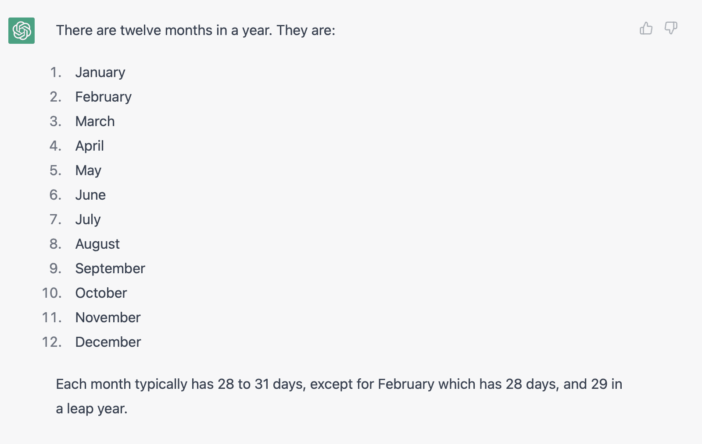

一年中的月份

当答案旁边的点赞按钮被按下时，如果有积极的回应，您将被要求提供。

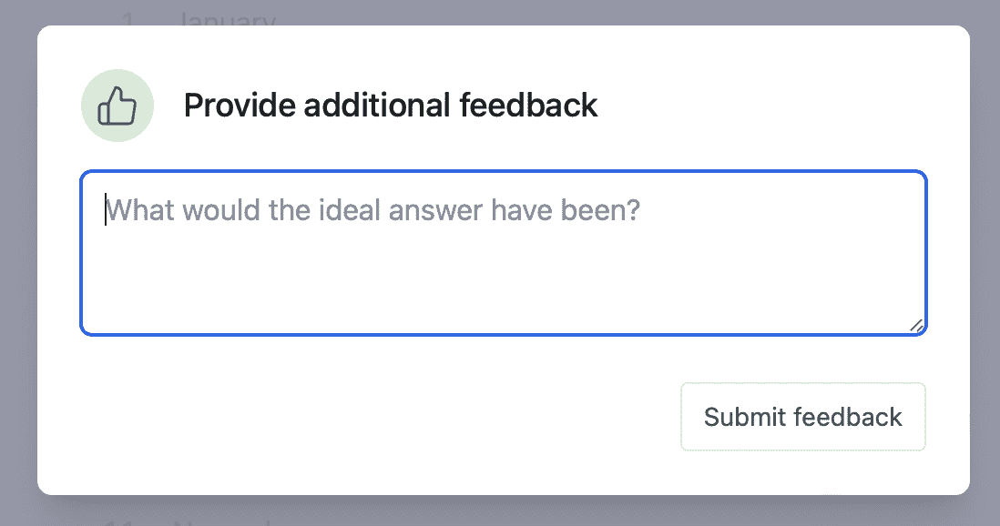

点赞

如果按下踩按钮，您将被要求再次回答，并对为什么回答不好进行分类。

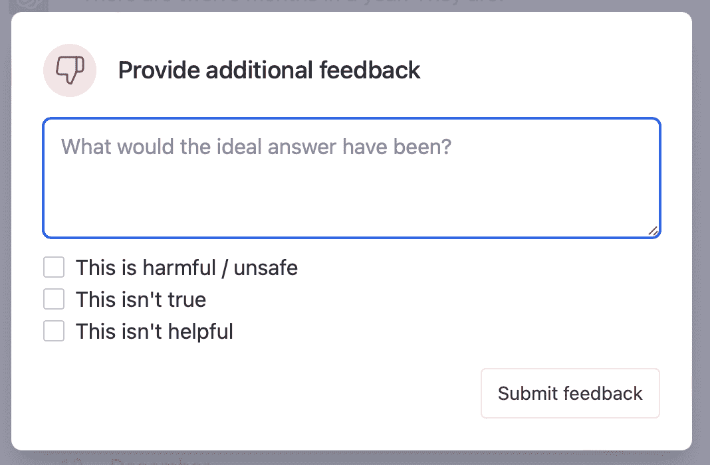

踩

您的答案将与其他回答进行比较，并由人类训练者添加到 ChatGPT 对世界的整体知识中。

### 这一切是如何运作的？

在日常生活中，我们经常使用写作应用程序来撰写消息、电子邮件，甚至文件。我们都依赖的一个常见功能是拼写纠正。每当我们遇到一个陌生单词时，您手机或计算机上的应用程序会自动提出更正建议，使我们的生活更轻松。

### 预测文本

该应用还使用预测文本来帮助我们更高效地撰写消息。根据上下文和我们已经写过的单词，应用程序预测下一个单词，为我们节省宝贵的时间。

但是这个应用程序如何知道推荐哪些词作为更正或预测下一个词？答案在于应用程序配备的庞大词汇量。英语大约有 17 万个单词，其他语言可能也有类似数量的单词。任何人都不可能记住所有这些单词，但对于计算设备来说，这都是家常便饭。

通过编程和机器学习算法，计算机、移动设备和应用程序可以通过所有所需的拼写更正和预测文本的模式、语法规则和句子结构的知识进行训练。这现在是许多写作应用程序中的常见功能，它帮助我们写得更好，更有效地沟通。

但是拼写更正和预测文本只是人工智能可以做的开始。像 ChatGPT 这样的聊天机器人是由人工智能驱动的助手，可以处理各种查询。从简单问题到复杂的多部分查询，对话交互，甚至内容创作任务，如撰写博客文章或创建代码，人工智能都可以胜任。

### 超越单词预测到思想预测

作为一种语言模型，ChatGPT 可以理解问题的上下文，并根据其训练时使用的大量文本数据提供个性化的回答。与使用关键词或短语返回相关网页的谷歌搜索不同，它可以为您的问题提供更具体和个性化的答案。

重要的是要记住，尽管被称为人工智能（AI），但它实际上并不具备类似人类的智能。相反，它依赖于复杂的模式识别来匹配特定模式，并大多数情况下提供适当的回应。在回应不完全准确的情况下，这可能归因于不精确的提示，可以通过额外信息进行纠正。

这个概念在中国屋思想实验中得到了有效的阐释。

中国屋思想实验如下：

1.  想象一个被密封的房间里的人，对中文一无所知，但却收到用英语写的指示来回应中文符号。

1.  中文符号被传递到房间里，这个人将它们与相应的英文符号匹配起来。

1.  使用指示，这个人用中文字符写下了回应。

1.  房间里的人似乎能理解中文，但实际上并不理解这门语言或其背后的含义。

1.  这个实验说明了机器在真正理解语言和拥有智能方面的局限性。它表明机器只是执行指令，而不理解其背后的含义。

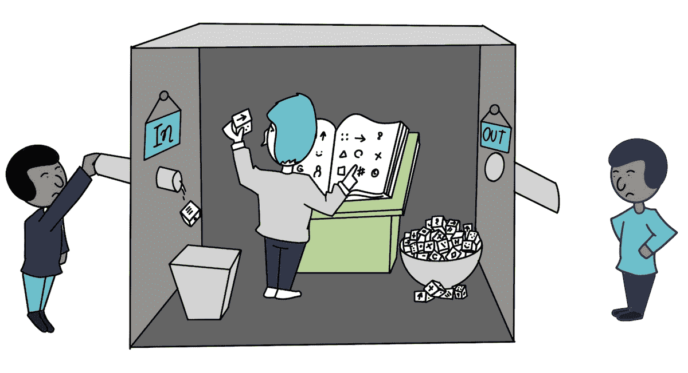

中国屋是一个思维实验，挑战了计算机程序是否真正能够像人类那样“理解”或具有“意识”的想法。它通过将一个不懂中文的人放在一个房间里，里面有中文符号和操作指令，能够正确回答问题而不理解背后的含义。

### 偏见

ChatGPT 是一种 AI 语言模型，通过处理和吸收来自新闻文章、书籍、科学期刊和维基百科等多种来源的信息来学习。然而，由于一些来源（如维基百科）可能呈现出有偏见的观点或选择性地呈现某些论点而忽略其他论点，因此在使用 AI 时要意识到这一点。此外，ChatGPT 训练的数据仅涵盖到 2021 年，这意味着它可能缺乏更近期的信息。

需要牢记的是，AI 生成的回答可能会受到用于训练的来源和团队的影响。虽然对于科学或已建立的问题可能只有一个正确答案，但对于政治或主观主题的回答可能会存在偏见。

### 错误

由于 ChatGPT 只知道从训练中学到的知识，因此有时可能提供不正确的信息或犯错误。它可能并不总是理解问题的含义或具有正确的信息来回答问题。因此，重要的是要仔细核对来自任何来源的信息，包括 ChatGPT。

## 文本到图像人工智能

### DALL-E

DALL-E 是由 OpenAI 开发的基于神经网络的 AI 模型，可以根据文字描述生成图像。它结合了计算机视觉和自然语言处理，理解给定文本提示背后的含义，然后生成与描述相匹配的图像。

“DALL-E”这个名字是艺术家萨尔瓦多·达利和皮克斯角色 WALL-E 的结合，突显了该模型从简单提示中创造出超现实和富有想象力的图像的能力。

DALL-E 已经在大量图像和文本数据集上进行了训练，可以生成各种各样的图像，包括物体、动物、场景，甚至抽象概念。该模型因其令人印象深刻且常常令人惊讶的结果而引起了广泛关注，并被视为人工智能艺术领域的重大突破。

### Midjourney

Midjourney 是一家专注于人工智能的独立研究实验室。该公司开发了自己的 AI 程序，也称为 Midjourney，使用户能够根据文字描述创建图像，类似于 OpenAI 的 DALL-E 和 Stable Diffusion。Leap Motion 的联合创始人大卫·霍尔兹领导着 Midjourney 团队。

Midjourney 的技术目前处于公开测试阶段，始于 2022 年 7 月。用户可以通过公司的 Discord 机器人上的/imagine 命令输入提示来生成图像。机器人会返回一组四张图片，用户可以选择哪些放大。Midjourney 不断改进其算法，并定期发布新更新。

此外，Midjourney 正在开发 Web 界面，以使其技术更易于访问。

总之，Midjourney 是一家领先的人工智能公司，开发了独特的文本到图像程序。该公司不断完善其技术，并已因其显著成果而获得认可。Midjourney 的 Discord 机器人目前提供对该程序的访问，但公司正在通过开发 Web 界面扩大其覆盖范围。

### 稳定扩散

稳定扩散是由 OpenAI 研究人员开发的最先进的生成模型。它是 2020 年引入的扩散模型的延伸，用于生成高质量图像。

稳定扩散是一种创建看起来像是由人制作的图片，但实际是由计算机制作的方法。这就像一个魔术，计算机自己学会如何制作图片。它通过向图片添加噪音，如滤镜，然后平滑处理以使其看起来更好。计算机完全自主完成所有这些，没有人告诉它如何做。

总的来说，稳定扩散是一种有望推动人工智能领域发展的生成建模方法。

### 本书中的插图

本书中展示的图像和插图都是使用人工智能创建的。OpenAI 的 DALL-E 和 Midjourney AI 是生成视觉内容的两个平台。这两个程序都使用算法根据文本描述创建图像。在被提示存在并由 AI 生成之前，这些图像都是不存在的。

唯一的例外是受到一个著名思想实验启发的 The Chinese Room。

要使用 DALL-E，只需访问 https://labs.openai.com 并输入所需的插图提示。目前，有限数量的图像可免费使用，额外的图像需要付费。然而，这一政策可能会在未来发生变化。使用 DALL-E 很简单，概念上类似于 Chat-GPT。我们在 AI 品牌化章节中也稍微谈到了 DALL-E。

要访问 Midjourney，您必须首先收到他们 Discord 服务器的邀请，可以通过遵循其网站 https://www.midjourney.com 上提供的说明和链接获得。与 DALL-E 一样，一定数量的提示是免费提供的，但随后的请求需要付费。有关最新详情，请访问 Midjourney 的网站和 Discord 服务器。

关于稳定扩散（Stable Diffusion），这并没有直接用于这本书，它不是你可以直接使用的东西，就像一个应用程序或一个网站。这是其他程序用来制作图片的特殊技术，比如 OpenAI 的 DALL-E 和 Midjourney 的文本到图像程序。如果你想使用稳定扩散，你需要使用这些已经内置了它的其他程序。

## 结论

总之，人工智能已经成为我们生活中不可或缺的一部分，帮助我们更高效地交流并执行几十年前还不可能完成的任务。随着持续的发展和完善，人工智能的可能性是无限的。

*"一段旅程的结束只是另一段旅程的开始。" - 未知*


# 办公椅设计的故事

*“最好的设计是最简单的能够工作的设计。” - 阿尔伯特·爱因斯坦*


办公椅设计 - 由 Midjourney AI 生成的图像

## 不起眼的办公椅

从前，有一个苦苦挣扎的设计团队，他们被委托为公司设计下一个热门产品。他们已经进行头脑风暴了几个星期，但似乎无法想出任何能够吸引市场注意力的新点子。

有一天，团队决定召开会议讨论他们的选择。他们聚集在一个被素描和笔记覆盖的白板包围的会议室里。当他们讨论各种想法时，一个团队成员建议他们设计完美的办公椅。

### 重新思考办公椅！

起初，这个想法遭到了一些怀疑。“一个办公椅？”一个团队成员说道。“谁会对那感到兴奋？”但随着他们继续讨论，他们意识到一个设计精良的办公椅实际上可能是一个改变游戏规则的产品。

他们开始列出所有能够使完美办公椅的特点：可调节高度、人体工程学支撑、透气面料，以及在任何办公室都看起来很棒的时尚设计。他们甚至谈论到添加智能技术，监测用户的姿势并提出调整建议以预防背部疼痛。

随着他们继续完善他们的想法，团队变得越来越兴奋。他们能够看到他们的椅子如何革新办公家具行业，并成为任何长时间坐在办公桌前的人必备的产品。

在接下来的几天里，团队不知疲倦地努力设计和完善他们的办公椅。他们经历了无数原型，测试和调整每一个，直到他们对最终产品满意为止。

当他们最终推出他们的椅子时，它立即成为了一大热门。全国各地的办公室工作者都对它提供的舒适和支撑赞不绝口，而时尚的设计使其成为现代办公室的热门选择。团队成功地创造了下一个热门产品，所有这一切都是因为他们决定专注于这个不起眼的办公椅。

### 这就是这个不起眼的办公椅如何取得成功的故事。

经过无数次详尽的会议和激动人心的头脑风暴，团队成功地策划出了完美办公椅应具备的规格和特点的全面清单。在创意能量的爆发下，他们筛选出了只有最出色和创新的特点，为追求卓越而不遗余力。

接下来是这些规格：

一把好的人体工程学办公椅应该具备一定的特点，以确保对用户来说既舒适又支撑。首先，座椅高度应该可调节，从地面 16.1 英寸到 20.9 英寸（41 厘米到 53 厘米），让用户可以保持双脚平放在地面上，大腿水平，手臂与桌子高度一致。座椅宽度和深度也应该可调节，标准宽度为 17 英寸至 20 英寸（43.2 厘米至 50.8 厘米），深度足够留出 2 英寸至 4 英寸（5.1 厘米至 10.2 厘米）的空间，让膝盖后面和座位之间有空间。此外，座椅的前后倾斜也应该可调节。

腰部支撑是人体工程学办公椅的另一个关键特点。椅子应该具有腰部调节（高度和深度），以支撑下背部的自然内弯曲线。这很重要，因为长时间坐着而没有支撑这个曲线会导致驼背和下脊柱的紧张。

椅子的靠背应该是 12 至 19 英寸（30.5 厘米至 48.3 厘米）宽，可调节高度和角度，以支撑脊柱的自然曲线，特别注意正确支撑腰部区域。如果座椅和靠背是分开的，靠背应该能够支撑脊柱的自然曲线，并具有锁定机制，以防止过度向后倾斜。座椅材料还应该有足够的填充物，以便长时间坐着时感觉舒适，最好选择透气的布料。

除了腰部支撑外，椅子还应该具有可调节的扶手，让用户的手臂舒适休息，肩膀放松。肘部和下臂应该轻轻放在扶手上，打字时前臂不应该放在扶手上。椅子还应该容易旋转（转动），以让用户不费力地到达桌子不同区域。

尽管没有单一的“最佳”人体工程学办公椅类型，但上述特点是重要的，以确保椅子对用户来说既舒适又支撑。

你们都同意了设计，现在想要推广和建造它。

让我们向 ChatGPT 询问一个吸引人的标题。我们的问题中包含了我们刚刚拟定的规格，这样 ChatGPT 可以参考它们，知道我们在谈论什么。

我们还会跟进更多问题，帮助建立我们新椅子的产品档案。

#### 提示 - 标题：

```
Create a catchy headline for this new product launch:
A good ergonomic office chair should possess certain features to ensure that it is comfortable and supportive for the user. Firstly, the seat height should be adjustable, ranging from 16 to 21 inches off the floor, to allow the user to keep their feet flat on the floor and their thighs horizontal, with arms even with the height of the desk. The seat width and depth should also be adjustable, with a standard width of 17-20 inches, and enough depth to leave 2 to 4 inches of space between the back of the knees and the seat. Additionally, the forward or backward tilt of the seat should also be adjustable. Lumbar support is another key feature of an ergonomic office chair. The chair should have a lumbar adjustment (both height and depth) to support the natural inward curve of the lower back. This is important because sitting for long periods without support for this curve can lead to slouching and strains in the lower spine. The backrest of the chair should be 12 to 19 inches wide, and adjustable in height and angle to support the natural curve of the spine, with special attention paid to proper support of the lumbar region. If the seat and backrest are separate, the backrest should be able to support the natural curve of the spine, and have a locking mechanism to secure it from going too far backward. The seat material should also have enough padding to be comfortable to sit on for extended periods of time, with a cloth fabric that breathes being preferable

In addition to lumbar support, the chair should also have adjustable armrests, which allow the user's arms to rest comfortably and shoulders to be relaxed. The elbows and lower arms should rest lightly, with the forearm not on the armrest while typing. The chair should also easily rotate (swivel) to allow the user to reach different areas of their desk without straining. While there isn't a single "best" type of ergonomic office chair, the above features are important to look for to ensure that the chair is comfortable and supportive for the user.
```

#### 输出 - 标题

```
"Introducing the Ultimate Ergonomic Office Chair: Comfort and Support for Extended Workdays"
```

#### 提示 - 卖点：

```
Generate a headline that highlights the unique selling points of this chair
```

#### 输出 - 卖点

```
"Revolutionize Your Workday with Our Ergonomic Office Chair - Adjustable in Every Way for Ultimate Comfort and Support!"
```

#### 提示 - 多功能性：

```
Create a headline that promotes the versatility of this furniture design
```

#### 输出 - 多功能性

```
"From Home Office to Conference Room: Discover the Versatility of Our Ergonomic Chair Design!"
```

#### 提示 - 摘要：

```
Provide a written summary of the ergonomics of this chair design.
```

#### 输出 - 摘要

```
This office chair design has a number of ergonomic features aimed at providing comfort and support for the user. The chair is adjustable in several ways, including seat height, width, and depth, as well as forward and backward tilt. The seat is designed to keep the user's feet flat on the floor and thighs horizontal, with arms even with the height of the desk. The chair also includes lumbar support, with both height and depth adjustable to support the natural inward curve of the lower back. The backrest is adjustable in both height and angle, and is designed to support the natural curve of the spine, with special attention paid to proper support of the lumbar region. The chair also has adjustable armrests to allow for comfortable resting of the arms and shoulders. Overall, the design of this chair takes into account the natural curves and positions of the human body, aiming to provide a comfortable and supportive seating experience for the user
```

#### 提示 - 缩短：

```
make it shorter and to the point
```

#### 输出 - 缩短

```
This chair is designed with several adjustable features, including seat height, width, depth, and tilt, as well as lumbar support, backrest height and angle, and armrests. These features work together to provide comfort and support for the user, while also allowing for easy movement and versatility.
```

#### 提示 - 吸引人：

```
Create a catchy headline for this new product launch
```

#### 输出 - 吸引人

```
"Experience Unmatched Comfort and Support: Introducing the Ultimate Ergonomic Office Chair!"
```

正如在前面与 ChatGPT 的“对话”中所展示的，我们提供了我们椅子的完整规格，一旦通知完毕，就无需再次查看细节。ChatGPT 保留了信息，现在可以回答我们的问题，提出潜在的解决方案。如果回答与我们的需求不完全符合，我们可以提供 ChatGPT 额外的信息，或要求它修改答案以更好地满足我们的需求。

### 关于 ChatGPT 输入的注意事项：

ChatGPT 文本输入限制在撰写本文时为 2048 个字符，大约为 300-400 个单词，每页 80 个字符的行数为 25-26 行。

这很可能会在未来增加，但你现在需要了解这些限制。

好的，回到提示。

每个人都喜欢关于产品的背景故事，这让人们感受到历史和归属感，并拥有一些经过时间发展的独特血统的东西，让我们为我们的椅子打造一个背景故事。

#### 提示 - 故事：

```
Write a story that brings this chair design to life , create an inventor character that struggled and experimented until he came up with this chair design, his long story and quest for perfection
```

#### 输出 - 故事

```
Meet Martin, a brilliant inventor who has always been passionate about creating furniture that enhances people's lives. His latest obsession is to create a chair that not only looks great but also provides unparalleled support for the human body. He's been working on this project for months, but the prototypes have never quite met his exacting standards. Martin has always been fascinated by the human body's mechanics and how it moves. He spends hours researching and testing different designs to find the perfect solution. He even started taking classes in anatomy and physiology to better understand the human body's needs. After months of experimentation, Martin finally developed a prototype that met all of his criteria. The chair's seat height is adjustable, ranging from 16 to 21 inches off the floor, and the seat width and depth are also adjustable. The forward or backward tilt of the seat can also be adjusted. But Martin didn't stop there. He also added lumbar support with height and depth adjustments to support the natural inward curve of the lower back. The backrest of the chair is 12 to 19 inches wide, adjustable in height and angle, and provides proper support for the lumbar region. The chair also has adjustable armrests that allow the user's arms to rest comfortably and shoulders to be relaxed. The elbows and lower arms rest lightly on the armrests, with the forearm not on the armrest while typing. The chair can easily rotate (swivel) to allow the user to reach different areas of their desk without straining. Martin's quest for perfection wasn't easy, though. He faced numerous challenges along the way, from funding issues to failed prototypes. But he never gave up on his dream of creating the perfect chair. In the end, Martin's perseverance paid off. His chair design is now considered a breakthrough in ergonomic office furniture. Workers who spend long hours at their desks are now able to do so in comfort, without worrying about developing back pain or other health issues. And all of this was thanks to Martin's unwavering dedication to his craft.
```

输出有点长，让我们要求它更短，更引人入胜。

#### 提示 - 简短故事：

```
make the story shorter and more exciting like an adventure of struggle and success
```

#### 输出 - 简短故事

```
Meet Jack, the inventor of the perfect chair. Jack had been working in an office for years and suffered from constant back pain due to poor posture and uncomfortable seating. He tried different chairs, but none of them seemed to offer the perfect solution. Jack's frustration led him to begin experimenting with different chair designs. Jack spent countless hours researching and testing different prototypes. He was determined to create a chair that would provide the ultimate ergonomic support for anyone who used it. But the road to success was long and filled with setbacks. At one point, Jack had almost given up hope. He had spent all of his savings and still had not found the perfect design. But then, one day, he was struck with a brilliant idea. He would combine all the best features of his prototypes into one perfect chair. Jack went back to the drawing board and poured all of his energy into designing the ultimate chair. Finally, after months of hard work, he succeeded. The chair he created had adjustable seat height, width, and depth. It had lumbar support and an adjustable backrest. It even had adjustable armrests and rotated easily. Word of Jack's invention quickly spread, and soon, everyone wanted his perfect chair. It wasn't long before Jack was flooded with orders, and his business began to thrive. Years later, Jack looked back on his struggles and smiled. He had overcome so much to create the perfect chair, and in the end, it had all been worth it. His invention had helped so many people, and he was proud to have made a difference in the world.
```

经过我们的标题、卖点、椅子特点摘要、引人入胜的背景故事和引人注目的口号的开发，我们现在准备与我们的海外工厂合作，开始生产这把椅子。此外，我们可以将其推广给主要分销商和重要客户。

## 结论

正如你所看到的，从一场乏味的会议开始，接着是一份文件，最后变成了一个引人入胜的椅子，配有宣传标题和文本，独特的卖点，以及一个引人入胜的背景故事。

*"设计是智慧的体现。" - Alina Wheeler*


# 开设食品业务

*"我唯一比谈论食物更喜欢的事情就是吃东西。" - 约翰·沃尔特斯*

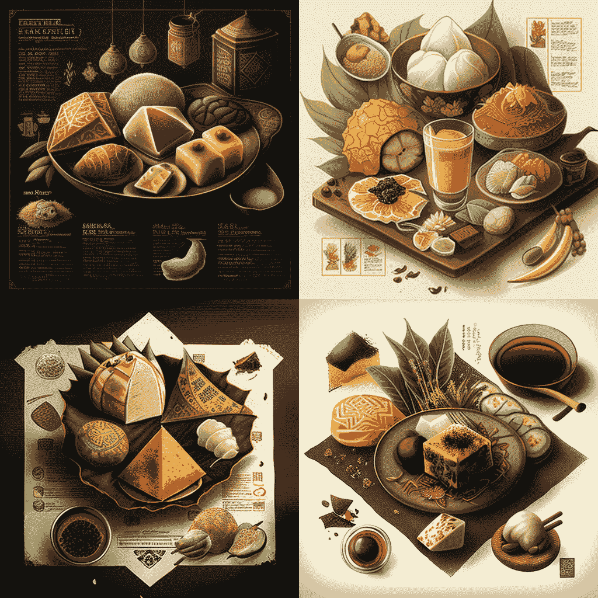

食品 - 由 Midjourney AI 生成的图像

## Fatima 和食物

Fatima 是一个有着伟大梦想的女孩：开设自己的食品服务业务。她一直热爱烹饪和尝试不同的口味和菜系。她的朋友和家人经常赞不绝口地夸奖她美味的餐点，有些人甚至建议她考虑开设自己的业务。

食谱是任何食品业务的重要组成部分，在这方面，ChatGPT 可以是一个宝贵的资产。例如，如果您的厨房里有现成的食材，ChatGPT 可以迅速为您提供一个您可以立即制作的食谱。

例如：

#### 提示 - 素食：

```
Generate a vegetarian dish using zucchini and cherry tomatoes.
```

#### 输出 - 素食

```
One delicious and healthy vegetarian dish that you could make using zucchini and cherry tomatoes is a Zucchini and Cherry Tomato Saute. Here's how to make it:

Ingredients:

2 medium-sized zucchinis, sliced
1 pint of cherry tomatoes, halved
3 cloves of garlic, minced
2 tablespoons of olive oil
Salt and pepper to taste
Fresh basil leaves, chopped (optional)
Instructions:

Heat a large skillet over medium heat and add the olive oil. Once the oil is hot, add the minced garlic and saute for about 30 seconds or until fragrant. Add the sliced zucchini to the skillet and saute for about 5 minutes or until it starts to brown. Add the halved cherry tomatoes to the skillet and saute for another 5 minutes or until the tomatoes are heated through and start to release their juices. Season with salt and pepper to taste. If desired, add fresh basil leaves to the skillet and stir to combine. Serve the zucchini and cherry tomato saute hot and enjoy! This dish is a great option for a light and healthy lunch or dinner. It's also quick and easy to make, and the combination of zucchini and cherry tomatoes is both flavorful and colorful.
```

-或-

#### 提示 - 健康午餐：

```
Generate a healthy lunch option using quinoa and avocado.
```

#### 输出 - 健康午餐：

```
One healthy and delicious lunch option that you can make using quinoa and avocado is a Quinoa and Avocado Salad. Here's how to make it:

Ingredients:

1 cup of quinoa
2 cups of water
1 avocado, diced
1 red bell pepper, diced
1/2 cup of fresh cilantro, chopped
1/4 cup of red onion, diced
1/4 cup of lime juice
2 tablespoons of olive oil
Salt and pepper to taste
Instructions:

Rinse the quinoa in a fine mesh strainer and place it in a medium-sized saucepan with 2 cups of water. Bring the quinoa to a boil, reduce heat to low, cover and simmer for 15-20 minutes or until the quinoa is tender and the water has been absorbed. Fluff the quinoa with a fork and set aside to cool. In a large mixing bowl, combine the diced avocado, red bell pepper, cilantro, and red onion. Add the cooled quinoa to the mixing bowl and stir to combine. In a small mixing bowl, whisk together the lime juice, olive oil, salt, and pepper. Pour the dressing over the quinoa salad and stir to combine. Serve the quinoa and avocado salad chilled and enjoy! This salad is a great option for a healthy and filling lunch. Quinoa is a great source of protein and fiber, while avocado provides healthy fats and essential nutrients. The red bell pepper and cilantro add a nice flavor and texture to the dish, while the lime dressing adds a refreshing touch.
```

-或-

#### 提示 - 意大利菜：

```
Write a recipe for a traditional Italian dish using eggplant and ground beef
```

#### 输出 - 意大利菜

```
One traditional Italian dish that you can make using eggplant and ground beef is Eggplant and Beef Lasagna. Here's how to make it:

Ingredients:

1 large eggplant, thinly sliced
1 lb. of ground beef
2 cans of crushed tomatoes
2 cloves of garlic, minced
1 small onion, chopped
2 tablespoons of olive oil
Salt and pepper to taste
1 teaspoon of dried oregano
1/2 teaspoon of dried basil
12 lasagna noodles
2 cups of shredded mozzarella cheese
1/2 cup of grated Parmesan cheese
Instructions:

Preheat the oven to 375°F (190°C). In a large skillet, heat the olive oil over medium heat. Add the minced garlic and chopped onion to the skillet and sauté until the onion becomes translucent, about 3-4 minutes. Add the ground beef to the skillet and cook until browned, about 10 minutes. Add the crushed tomatoes, salt, pepper, dried oregano, and dried basil to the skillet and stir to combine. Reduce the heat to low and let the sauce simmer for 20 minutes. While the sauce is simmering, prepare the eggplant by slicing it into thin rounds and sprinkling them with salt. Let them sit for 10 minutes to remove any excess moisture, then rinse and pat dry. Cook the lasagna noodles according to the package instructions. Assemble the lasagna by spreading a layer of the beef sauce on the bottom of a 9x13 inch baking dish. Add a layer of the eggplant slices on top of the sauce, followed by a layer of lasagna noodles. Repeat the layers until you reach the top of the baking dish, finishing with a layer of beef sauce on top. Sprinkle the shredded mozzarella cheese and grated Parmesan cheese on top of the lasagna. Cover the baking dish with foil and bake in the preheated oven for 30 minutes. Remove the foil and bake for an additional 15 minutes or until the cheese is melted and bubbly. Let the lasagna cool for 10 minutes before slicing and serving. This Eggplant and Beef Lasagna is a classic Italian dish that is sure to impress. The combination of the eggplant, ground beef, and tomato sauce creates a hearty and flavorful filling, while the layers of lasagna noodles and cheese add a satisfying texture. This dish is perfect for a family dinner or a special occasion.
```

Fatima 的食谱研究之所以如此引人注目，是因为她巧妙地利用了 ChatGPT。通过向这个创新的人工智能提出动态和令人兴奋的提示，Fatima 能够解锁一批美味食谱结果，这些结果她可能以其他方式无法发现。有了 ChatGPT 的帮助，Fatima 的烹饪冒险比以往任何时候都更加令人兴奋！

#### 提示 - 供您尝试：

```
Write a recipe for a spicy Thai dish using tofu and green curry paste.
```

```
Write a recipe for a comforting bowl of chicken noodle soup.
```

```
Generate a dinner recipe using salmon and asparagus.
```

```
Generate a vegetarian pasta dish using roasted red peppers and eggplant.
```

## 从小开始

起初，Fatima 表现出犹豫。她没有太多资源，也没有经营业务的经验。但她将自己对烹饪的热情转化为盈利事业的动力很强。她决定从小处着手，逐步发展。

### 食品摊位

Fatima 从在家附近开设一个小食品摊开始。她提供了一些她的招牌菜，并迅速赢得了一批追随者。人们从邻里各处前来尝试她的食物。Fatima 不断探索如何改进和扩大她的菜单。她仔细倾听顾客的反馈，并开始尝试新的食谱。

Fatima 的目标是为她的客户提供更健康的食品选择，但她遇到了一个常见的困境，健康食品往往缺乏���不健康选项相关的美味口感。

尽管一些 Fatima 的顾客无法抵制快餐的美味，而选择健康选项，但她拒绝让这使她灰心。凭借对食物的热情和创造力，Fatima 想出了一个解决方案，既满足他们的渴望，又提供更健康的选择。

正如他们所说，“健康饮食并不一定枯燥无味。它是关于发现新的口味，享受食物的天然好处。”

## 想象食品卡车

随着她的业务不断发展，Fatima 意识到她需要有更大的想法。她开始研究食品卡车，并意识到这可能是将她的业务提升到下一个水平的完美方式。她花费了无数个小时与食品卡车业主交谈，参加食品节，并阅读最新的食品趋势。

凭借她初创的商业意识和发现趋势的能力，法蒂玛知道她需要做些什么让她的食品车脱颖而出。她决定专注于健康、本地食材，并提供迎合各种饮食需求的菜单。她还确保拥有引人注目的品牌形象和强大的社交媒体存在，以吸引顾客。

尽管创业带来的挑战，法蒂玛仍然坚持不懈。她不辞辛劳地积攒足够的钱购买一辆二手食品车，并获得所有必要的许可证和执照。当终于到来的那一天，法蒂玛第一次打开食品车的车门时，她知道自己做出了正确的决定。

她的生意迅速起飞，几个月内，法蒂玛的食品车成为当地美食界的一大亮点。她甚至开始受到国家美食刊物的认可，并被邀请参加全国各地的美食节。

法蒂玛的成功是她辛勤工作、决心和倾听并适应顾客需求的能力的结果。她知道开设食品服务业不会容易，但她对烹饪的热爱和与他人分享激情的愿望让她坚持下去。如今，法蒂玛是一位成功的企业主，也是任何梦想将自己的激情变成蓬勃发展事业的人的榜样。

#### 提示 - 麦当劳：

```
recommend a healthy  3 meal menu for breakfast, lunch and dinner for 1200 calories only sourced from McDonalds
```

#### 输出 - 麦当劳

```
While it's generally recommended to eat a varied, balanced diet that includes nutrient-dense foods, including fast food like McDonald's in your diet can be done in moderation. As per your request, here's a sample menu for breakfast, lunch, and dinner that totals to approximately 1200 calories:

Breakfast (approx. 300 calories)

Egg White Delight McMuffin (250 calories)
Black Coffee or Unsweetened Iced Tea (0-10 calories)
Lunch (approx. 400 calories)

Artisan Grilled Chicken Sandwich without the bun (200-250 calories)
Side Salad with Newman's Own Low-Fat Balsamic Vinaigrette dressing (70 calories)
Apple Slices (15 calories)
Small French Fries (230 calories)
Dinner (approx. 500 calories)

Southwest Grilled Chicken Salad (350 calories)
Low-Fat Balsamic Vinaigrette dressing (25 calories)
Fruit & Yogurt Parfait (150 calories)
Note that calorie counts may vary depending on the specific items ordered and portion sizes. It's important to keep in mind that fast food should be consumed in moderation and should not make up a large portion of your diet. Additionally, this meal plan may not provide all the necessary nutrients for optimal health, so it's important to include a variety of nutrient-dense foods in your diet.
```

#### 提示 - 必胜客：

```
recommend a healthy  3 meal menu for breakfast, lunch and dinner for 1200 calories only sourced from Pizza Hut
```

#### 输出 - 必胜客

```
Pizza Hut is generally known for their high-calorie and high-fat pizza options, so finding a healthy meal for all three meals while keeping the calorie count at 1200 can be challenging. However, here is a sample meal plan for breakfast, lunch, and dinner that is as healthy and low in calories as possible:

Breakfast (approx. 300 calories):

2 Egg and Vegetable Omelette with a side of fresh fruit (approx. 300 calories)
Lunch (approx. 400 calories):

Garden Salad with Grilled Chicken and Low-Fat Dressing (approx. 300 calories)
Small order of bone-out wings with buffalo sauce (approx. 100 calories)
Dinner (approx. 500 calories):

Veggie Lovers Thin Crust Pizza (1 slice, medium size) with light cheese (approx. 200-250 calories)
Small Caesar Salad with Low-Fat Dressing (approx. 100-150 calories)
Grilled Chicken Sandwich with no sauce or cheese (approx. 150-200 calories)
Please note that the calorie counts for each item may vary depending on the specific ingredients used and portion sizes. Additionally, this meal plan may not provide all the necessary nutrients for optimal health, so it's important to include a variety of nutrient-dense foods in your diet.
```

#### 供您尝试的提示：

```
recommend a healthy  3 meal menu for breakfast, lunch and dinner for 1200 calories only sourced from Friday's
```

```
recommend a healthy  3 meal menu for breakfast, lunch and dinner for 1200 calories only sourced from Chillis
```

```
recommend a healthy  3 meal menu for breakfast, lunch and dinner for 1200 calories only sourced from Dominos Pizza
```

法蒂玛在从快餐店采购餐点的方式上展现出她的足智多谋。她不是为顾客购买餐点，而是卖给他们一个信封，里面包含了如何点餐的说明，包括必要的份量，以及她与所选餐厅预先安排好的折扣券。

这不仅适用于低热量餐，还适用于有饮食限制的人，比如只吃植物性食物：

#### 提示 - 素食：

```
recommend a plant based   3 meal menu for breakfast, lunch and dinner from a lebanese restaurant
```

#### 输出 - 素食

```
Here's a sample plant-based menu for breakfast, lunch, and dinner sourced from a Lebanese restaurant:

Breakfast:

Foul Mdammas: A traditional Lebanese breakfast dish made from fava beans, garlic, lemon juice, and olive oil, served with pita bread (approx. 300 calories)
Lunch:

Mujadara: A dish made from cooked lentils, rice, and caramelized onions, served with a side salad of mixed greens and a lemon-tahini dressing (approx. 400 calories)
Dinner:

Stuffed Eggplant: Roasted eggplant stuffed with a mixture of spiced rice, tomatoes, onions, and chickpeas, served with a side of grilled vegetables and a tahini sauce (approx. 500 calories)
Please note that the calorie counts for each item may vary depending on the specific ingredients and portion sizes used. These dishes offer a tasty and healthy plant-based alternative to traditional Lebanese cuisine.
```

## 结论

在 ChatGPT AI 的帮助下，法蒂玛能够迅速扩展她的食品业务，展现出在菜单选择方面的卓越灵活性和速度，以适应市场迅速变化的趋势和口味。她还能够高效地采购食材，确保轻松获得最佳质量，并以专业的方式经营她的业务。

*"吃饭不是一种爱好，而是一种生活方式。" - 匿名*


# 用于测试和评估的人工智能

*"教学不是一种职业；它是一种激情。" - 未知*


学校生活 - Midjourney AI 生成的图像

## 兼职教师 Mamdooh

Mamdooh 是一个勤奋的博士生，同时也兼职教授学校和本科生，以支持他的学业。他使用 Skype 和 Zoom 指导高级学生，并根据他们的学科、水平和表现为每个学生定制测试来评估他们的进展。虽然 Mamdooh 喜欢创建自己的测试，但这个过程非常耗时，特别是考虑到需要为每个学生定制测试。

### 使用 ChatGPT 帮助进行测试

幸运的是，Mamdooh 发现了 ChatGPT 提供的巨大生产力提升。有了这个工具，他可以在几秒钟内生成测试和模型答案，大大减少了为学生提供有效指导所需的时间和精力。ChatGPT 彻底改变了 Mamdooh 教学的方式，使他能够简化工作流程，高效地为学生提供高质量教育。

#### 提示 - 历史测试：

```
Generate 10 multiple choice questions on the topic of World History
```

#### 输出 - 历史测试

```
Sure, here are ten multiple-choice questions on the topic of world history:

In which year did the Cold War end? A) 1989
B) 1991
C) 1993
D) 1995
Who was the leader of the Soviet Union during World War II? A) Joseph Stalin
B) Vladimir Lenin
C) Mikhail Gorbachev
D) Nikita Khrushchev
Who was the first emperor of Rome? A) Julius Caesar
B) Augustus
C) Mark Antony
D) Caligula
Who is known for leading the Indian independence movement against British rule? A) Mahatma Gandhi
B) Jawaharlal Nehru
C) Subhas Chandra Bose
D) Sardar Vallabhbhai Patel
Which ancient civilization built the Machu Picchu citadel? A) Incas
B) Mayas
C) Aztecs
D) Olmecs
Which battle is considered the turning point of World War II in the European Theater? A) Battle of Stalingrad
B) Battle of Midway
C) Battle of the Bulge
D) Battle of Kursk
Who wrote the "Communist Manifesto"? A) Karl Marx
B) Friedrich Engels
C) V.I. Lenin
D) Mao Zedong
In which year did the Spanish conquer the Aztec empire? A) 1505
B) 1521
C) 1603
D) 1707
Who was the first African American to become the President of the United States? A) Barack Obama
B) Martin Luther King Jr. C) Malcolm X
D) Rosa Parks
Who was the first woman to win a Nobel Prize? A) Marie Curie
B) Jane Addams
C) Mother Teresa
D) Wangari Maathai
```

#### 对历史测试答案的后续提示：

```
list out the answers
```

#### 输出 - 历史测试答案

```
Sure! Here are the answers to the ten multiple-choice questions on world history:

A) 1989
A) Joseph Stalin
B) Augustus
A) Mahatma Gandhi
A) Incas
A) Battle of Stalingrad
A) Karl Marx
B) 1521
A) Barack Obama
A) Marie Curie
```

#### 你可以尝试的提示：

```
Generate 10 multiple choice questions on the topic of World History
```

```
Create 5 true or false questions on the topic of Biology
```

```
Develop 10 short answer questions on the topic of Literature
```

```
Generate 5 essay questions on the topic of Political Science
```

```
Create 10 matching questions on the topic of Geography
```

```
Develop 5 fill-in-the-blank questions on the topic of Math
```

```
Generate 10 reasoning questions on the topic of Physics
```

```
Create 5 case study questions on the topic of Business Management
```

## 散文

除了选择题，Mamdooh 的学生还被要求写作文。Mamdooh 可以使用 ChatGPT 来批改这些作文。

这里是一个学生关于幸福写作的糟糕尝试，她的拼写不太好，语法也不是最好的。

* * *

每天我们都在完全混乱中寻找幸福，这就是我们奋斗的目标。实际上，如果我们愿意寻找并追求，暂时的幸福无处不在。有时它就在我们身边，就像一只可爱的小猫，有时候给予需要我们的人一只手就足够了。有时甚至只是呼吸也可能给某人带来绝对的幸福。但如果我们放下暂时的幸福，决定建立在永久幸福的基本原则上的生活呢？当然，这些原则取决于一个人的特点和观点。在我看来，社会关系、接受和独立是生活中永久幸福的最重要元素。

首先，社会关系对我来说在我生活的总体趋势中非常重要。我应该与我周围的人保持良好的关系，以保持内心的平静。如果我有亲密的朋友，可以与他们分享我的烦恼、忧虑和喜悦，那么这意味着我在很大程度上战胜了生活的压力。在我看来，拥有真正朋友的人拥有了生活中最宝贵的财富。为了获得这个宝藏，我选择那些原则与我相似、特点最适合我的、真诚的人作为我的朋友。除了朋友，我还努力与我每天在某种程度上遇到的人保持良好的关系，比如邻居、熟人、老师、亲戚等。

对我来说，持续幸福的第二个元素是接受：换句话说，接受我的特征、行为、选择和欲望。在某种程度上，它可以被定义为接受我作为一个真实个体的存在。只要我被接受并被接纳，我就能为自己做出正确的决定。为了实现这一点，我解释说我不希望周围的人对我进行不必要的批评。除非我做的事情或想法影响到任何人，否则其他人不应该干涉。他们无权干涉我只关乎我的事情。

总之，如果我在社交关系、独立性和接受方面取得成功，那就意味着我拥有了使幸福成为我生活中持久元素的黄金钥匙。获得所有这些元素可能并不容易，它们可能只能在长期内实现，但有一点我们应该牢记，实现生活中真正和持久的幸福并不容易。

* * *

Mamdooh 可以请 ChatGPT 纠正作文并指出错误所在。

#### 提示 - 作文审阅和评分：

```
review this essay and correct it like a teacher showing where the mistakes are and what can be done to improve  it and grading it:

Everyday we try to find happyness in a complete caos, that's what we struggle for. Actually, temprary happyness is evrywhre if we want to find it and search for it. Sometimes it is just as close as a cute kitn to us, sometimes givin a hand to someone who is in need of us is enough. Even takin a breth may give somebody the absolute happyness at times. But what if we leave temprary happyness alone and decide to constrct our lives on basic principls of permanent happyness? Cirtainly these principls depend on one's charactaristics and point of view. In my opinion, social relations, acceptance and independence are the most important elemnts of permanent happyness in life. To begin with, socal relations are very important for me to be happy in the general drift of my life. I should have good relations with the people around me for peace of my mind. If I have close and intimate frends with whom I can share my trubbles, woris and also my joy, then it means that I have beaten the life up to a very considerable point. In my opinion, someone who has real frends has the most valuable treasure of life. In order to obtain this treasure, I make my frends among the people whose principles resemble mine, whose characteristics best suit me and who are sincere. Besides frends I try to have good relations with the people I encounter somehow everyday, like neighbors, acquaintances, teachers, relatives and the others. The second elemnt of continuous happyness for me is acceptance: to clarify, acceptance of my characteristics, behaviors, choices and desires. At one point, it can be defined as the acceptance of my existence as a real individual. As long as I am accepted and taken as I am, I can make right decisions for myself. To accomplish this, I explain that I don't want unnecessary criticisms from the people around me. Unless the things I do or think affect anybody, the others should not poke their nose into them. It is none of their business to interfere with me about the subjects that only interest me. To sum up, if I aquire success in social relations, independence and acceptance, then it means that I have the golden key to make happyness an enduring elemnt of my life. Obtaining all these elemnts may not be very easy, they may be achieved only in the long run but there is something we should always bear in mind, achieving the real and permanent happyness in life is not that easy, either
```

#### 输出 - 作文审阅和评分

```
Essay Review:

Every day, we try to find happiness in complete chaos, and that's what we struggle for. Actually, temporary happiness is everywhere if we want to find it and search for it. Sometimes, it is just as close as a cute kitten to us, sometimes giving a hand to someone who is in need of us is enough. Even taking a breath may give somebody the absolute happiness at times. But what if we leave temporary happiness alone and decide to construct our lives on basic principles of permanent happiness? Certainly, these principles depend on one's characteristics and point of view. In my opinion, social relations, acceptance, and independence are the most important elements of permanent happiness in life. To begin with, social relations are very important for me to be happy in the general drift of my life. I should have good relations with the people around me for peace of my mind. If I have close and intimate friends with whom I can share my troubles, worries and also my joy, then it means that I have beaten life up to a very considerable point. In my opinion, someone who has real friends has the most valuable treasure of life. To obtain this treasure, I make friends with people whose principles resemble mine, whose characteristics best suit me, and who are sincere. Besides friends, I try to have good relations with the people I encounter somehow every day, like neighbors, acquaintances, teachers, relatives, and others. The second element of continuous happiness for me is acceptance: to clarify, acceptance of my characteristics, behaviors, choices, and desires. At one point, it can be defined as the acceptance of my existence as a real individual. As long as I am accepted and taken as I am, I can make right decisions for myself. To accomplish this, I explain that I don't want unnecessary criticisms from the people around me. Unless the things I do or think affect anybody, the others should not poke their nose into them. It is none of their business to interfere with me about the subjects that only interest me. To sum up, if I acquire success in social relations, independence, and acceptance, then it means that I have the golden key to make happiness an enduring element of my life. Obtaining all these elements may not be very easy. They may be achieved only in the long run, but there is something we should always bear in mind: achieving real and permanent happiness in life is not that easy, either. Grading:

This essay shows a good understanding of the topic and presents a clear argument about the importance of social relations, acceptance, and independence for achieving permanent happiness. However, there are several spelling and grammatical errors throughout the essay, which can make it difficult to understand in some places. For example, "temprary happyness" should be "temporary happiness," "evrywhre" should be "everywhere," "kitn" should be "kitten," "freinds" should be "friends," and "elemnts" should be "elements." To improve the essay, the writer should focus on proofreading and correcting these errors before submitting the final draft. Additionally, the essay could benefit from more specific examples and evidence to support the argument. Overall, the essay is well-written and thoughtful, and the writer has done a good job of conveying their ideas about the topic. Grade: B
```

好的，学生得了一个 B，Mamdooh 节省了很多时间来纠正那份作业。

ChatGPT 在写作作文方面同样出色，让我们请 ChatGPT 以一个 14 岁孩子的身份写一篇永远受欢迎的作文题目：“我在暑假里做了什么”

#### 提示 - 我的暑假作文：

```
you are a 14 year old male student, you went on holiday in Egypt  for 10 days last summer, you stayed in Cairo for a few days and visited all the famous places, and you also went to Sharm El Sheikh where you enjoyed the beach and related activities. Write me a 500 word essay on my summer vacation
```

让我们尽可能多地给 ChatGPT 关于写作内容的提示，然后看看我们会得到什么。请注意，在提示中，我们设置了一个 500 字的字数限制，否则，ChatGPT 会很高兴地为你的作文写出许多页。

#### 输出 - 我的暑假作文

```
Last summer, I had the opportunity to travel to Egypt for 10 days with my family. It was my first time visiting this beautiful country, and I was really excited to explore all the amazing places that I had heard so much about. We started our trip in Cairo, where we spent the first few days visiting all the famous landmarks such as the Great Pyramids, the Sphinx, and the Egyptian Museum. Seeing the Great Pyramids in person was absolutely breathtaking. They are so massive and grand, and it's hard to imagine how they were built so many thousands of years ago. We also went inside one of the pyramids, which was a really cool experience. The Egyptian Museum was also really interesting, with so many artifacts from ancient Egyptian times, including the famous gold mask of King Tutankhamun. In addition to the historical sites, we also visited some modern attractions in Cairo such as the Cairo Tower and the Khan el-Khalili market. The Cairo Tower provided an incredible view of the entire city, and we got some great photos from the top. The market was a bustling and colorful place, filled with shops selling all kinds of goods, from spices to jewelry to souvenirs. After a few days in Cairo, we headed to Sharm El Sheikh, which is located on the coast of the Red Sea. This was a completely different experience from our time in Cairo, as we spent most of our time at the beach and doing water-related activities. The water in the Red Sea is so clear and blue, and we spent hours swimming and snorkeling among the coral reefs. We even went on a glass-bottomed boat tour to see the underwater world from a different perspective. One of the highlights of our time in Sharm El Sheikh was a day trip we took to the nearby desert. We rode camels and ATVs, and even went sandboarding down the dunes. It was a really fun and unique experience that we all enjoyed. Overall, my trip to Egypt was an unforgettable experience. I learned so much about ancient Egyptian history and culture, and also got to enjoy some beautiful natural scenery and modern attractions. It was amazing to see how different the city of Cairo was from the beach town of Sharm El Sheikh, and I feel lucky to have had the opportunity to experience both. I would definitely recommend Egypt as a travel destination to anyone who is interested in history, culture, and adventure.
```

一篇真正优秀的作文，我们无法做得更好。

## 结论

正如你所看到的，ChatGPT 非常灵活，擅长生成甚至是非学术性的、仅存在于职业世界中的主题的测试。作文也很容易创建或修正，你提供的背景信息越多，作文结果就会越好。

*"要做出伟大的工作，唯一的方法就是热爱自己的工作。" - 史蒂夫·乔布斯*


# 用于商业的人工智能

*"关键不在于想法，而在于实现想法。" - 斯科特·贝尔斯基*


现代商人 - 由 Midjourney AI 生成的图像

## 介绍由萨米开发的 FamilyGram 应用程序

萨米打算基于他已经创建的应用程序开展自己的业务。这款类似于 Instagram 的应用程序使用户可以拍照并与家人独家分享。它旨在通过与社交媒体平台保持分离为用户提供更高的隐私保护。该应用程序需要订阅费，但它保证父母和孩子他们的个人时刻将保持私密，并且只与他们亲近的人分享。他想将其命名为 FamilyGram。

现在应用程序已经开发并准备就绪，可以在 Android 和 iPhone 上运行，萨米不知道接下来该做什么，所以他问 ChatGPT 接下来的步骤是什么。

#### 提示 - 应用程序发布步骤：

```
Sami has developed an app called familygram. It runs on IOS and Android , what are the reccomended steps to launch this app as a viable profitable business
```

#### 输出 - 应用程序发布步骤

```
Launching an app as a viable and profitable business requires careful planning and execution. Here are some recommended steps that Sami can take to launch his app, Familygram:

Conduct market research: Sami needs to research the market to understand the competition, target audience, and potential demand for his app. This can be done through surveys, focus groups, and other market research methods. Develop a business plan: A business plan will help Sami define his goals, target audience, revenue model, and marketing strategies. It should also include financial projections, such as expected revenue and costs. Build a website and social media presence: Creating a website and social media profiles will help Sami promote his app and build a strong brand image. He can also use social media to engage with potential customers and gather feedback. Launch the app on app stores: Sami needs to list his app on the App Store and Google Play Store. This will require complying with their submission guidelines and paying any associated fees. Launch marketing campaigns: Sami needs to promote his app through digital marketing campaigns such as social media advertising, search engine optimization, and email marketing. He can also reach out to influencers or bloggers who specialize in family-related content. Continuously improve the app: Sami should gather feedback from customers and use it to improve the app's user experience. This can help attract new customers and retain existing ones. By following these steps, Sami can launch Familygram as a profitable business and grow it over time.
```

这需要考虑和做的事情很多，而萨米是一个优秀的编码人员，但在商业方面缺乏经验。ChatGPT 列出了以下步骤：

1.  进行市场调研

1.  制定商业计划

1.  建立网站和社交媒体存在

1.  在应用商店上发布应用程序

1.  推出营销活动

1.  持续改进应用程序。

是时候让萨米开始工作了，最好的方法是向 ChatGPT 寻求建议。

## 进行市场调研

在向 ChatGPT 提问时，最好将问题尽可能详细地提出，这样你就可以得到最适合你想要实现的答案。

让我们询问如何进行市场调研而不必花费很多钱。

#### 提示 - 市场调研：

```
I have developed an app   similar to Instagram, enables users to take photos and share them exclusively with family members. It is designed to provide greater privacy for its users by remaining separate from social media platforms. The app requires a subscription fee, but it guarantees parents and children that their personal moments will stay private and only shared with people close to them. He wants to call it FamilyGram. How do i conduct market research for my app familygram, that allows family to post private pictures and pay a fee for using the app. I have no budget and need a no cost or low cost method
```

#### 输出 - 市场调研

```
There are several ways to conduct market research for your app FamilyGram, even with a low or no budget. Here are some ideas:

Use social media: You can leverage social media to reach out to your target audience and conduct surveys or polls. You can post on Facebook groups, Twitter, or LinkedIn to ask questions about the types of features they would like to see in a family photo-sharing app, their willingness to pay a subscription fee, and their preferences for app design. Conduct customer interviews: You can reach out to friends, family members, and acquaintances who fit your target audience to conduct customer interviews. You can ask them questions about their photo-sharing habits, their opinions on existing photo-sharing apps, and their willingness to pay for a subscription-based app. Analyze competitor apps: Look at what other photo-sharing apps offer and read their reviews to understand what customers like and dislike about them. You can then use this information to develop features that will differentiate your app from the competition. Create a landing page: You can create a landing page for your app and use Google Analytics to track the number of visitors and the actions they take on the page. You can use this data to gauge interest in your app and understand which features are most appealing. Attend local events: You can attend local events such as family festivals or parenting workshops to conduct in-person surveys and get feedback from your target audience. Overall, it's important to be creative and resourceful when conducting market research with a limited budget. By leveraging free or low-cost tools, you can get valuable insights that will help you refine your app and make it more appealing to your target audience.
```

好的，这是一个很长的清单，但包含了很多有用的信息。让我要求一个待办事项摘要清单，这样我们就可以开始我们的市场调研之旅。

#### 提示 - 待办事项清单：

```
summarize in a todo list
```

#### 输出 - 待办事项清单

```
Sure! Here's a summary of the market research tasks you can do for FamilyGram, arranged in a to-do list format:

Use social media to conduct surveys or polls. Conduct customer interviews with friends, family members, and acquaintances who fit your target audience. Analyze competitor apps and their customer reviews. Create a landing page for your app and track visitors' actions using Google Analytics. Attend local events to conduct in-person surveys and get feedback from your target audience. Remember to keep track of your findings and use them to improve your app's features and design. Good luck with your market research!
```

萨米继续进行市场调研，并从他的目标受众那里得到了积极的反馈，他们都欣赏他的产品提供的隐私，并且开发者很容易就能接受任何建议或请求。

## 制定一个商业计划

萨米与潜在客户互动，并进行了所需的市场调研，更好地了解了他的应用程序以及人们在寻找什么。

现在他待办事项清单上的下一个任务是制定一个商业计划，问题是：萨米以前从未制定过商业计划。

再次，他请 AI 给他提出问题，以便他可以使他的商业计划更加有效和有用。

#### 提示 - 商业计划：

```
I have developed an app   similar to Instagram, enables users to take photos and share them exclusively with family members. It is designed to provide greater privacy for its users by remaining separate from social media platforms. The app requires a subscription fee, but it guarantees parents and children that their personal moments will stay private and only shared with people close to them. He wants to call it FamilyGram. I want to develop a busines plan, what questions do i need to answer to help build a good busines plan
```

#### 输出 - 商业计划

```
To develop a business plan for your app, here are some key questions that you should consider:

What is the market opportunity for FamilyGram? Who is your target audience, and what are their needs? What is the competitive landscape? Who are your competitors, and what are their strengths and weaknesses? What is your unique value proposition? What sets FamilyGram apart from other photo-sharing apps, and how does it solve your target audience's problems? What is your pricing strategy? How much will you charge for subscriptions, and how does this compare to other photo-sharing apps? What is your marketing strategy? How will you promote FamilyGram to your target audience, and what channels will you use to reach them? What is your sales strategy? How will you acquire new subscribers, and what will your customer acquisition cost be? What is your operational plan? How will you manage the day-to-day operations of the business, and what resources will you need? What is your financial plan? How much revenue do you project to generate, and what are your expenses? What are your key performance indicators (KPIs), and how will you measure success? What are the risks and challenges that you anticipate, and how will you mitigate them? By answering these questions, you can develop a comprehensive business plan that will guide your app's development, marketing, and growth.
```

现在萨米有了问题，而且他已经从市场调研中得到了许多答案，他可以回答这些问题，然后要求 ChatGPT 提供一个商业计划。

好的，现在萨米需要回答这些问题：

**你的目标受众是谁，他们的需求是什么？**

*目标受众需要良好的隐私保护和一个值得信赖的人，不会出售他们的私人照片。目标受众将是家庭和大家庭。*

**你的竞争对手是谁，你的应用程序的市场机会是什么？**

*竞争对手是 Instagram 和 Facebook，他们的弱点是隐私不能得到保证，第三方可以看到成员发布的帖子。FamilyGram 致力于隐私，并且只会存储和与预期受众分享图片，并使用高度安全的方法保证隐私。*

**你的独特价值主张是什么？**

*隐私，隐私，隐私，以及一个倾听并迅速采取客户建议行动的响应式开发人员。*

**你的定价策略是什么？**

*定价将为每年订阅 5 美元。这将用于使应用程序独立，无需向订阅者出售客户信息，也将用于维护运行所需的计算资源。*

**你的营销策略是什么？**

*营销策略将是推荐，如果有人被提及，他们将被通知加入，如果他们想分享。一旦我们发展壮大，还将有在线广告针对亲密的家庭和朋友。*

**你的销售策略是什么？**

*最初，将通过推荐获得客户，客户获取将通过口碑传播，后来将有现有客户的促销推荐，目标客户将获得 20%的折扣，推荐客户将获得 10%的奖金。*

**你的运营计划是什么，你将需要什么资源？**

*将有一个客户服务电子邮件和聊天机器人处理客户请求，并将外包。*

*将有一个开发团队负责维护和更新应用程序。*

*将有一个财务团队外包负责跟踪所有资金。*

**你的财务计划是什么，你的关键绩效指标是什么？**

*我们计划从头三个月开始有机增长，然后在选择的市场开始推广应用程序，然后依靠网络效应使软件传播。*

*我们的主要关键绩效指标是用户数量*

*用户收入*

*用户获取成本*

*支持和开发成本*

*杂项成本*

**你预期的风险和挑战是什么，你将如何减轻它们？**

*风险是软件不会像预期的那样传播，为了减轻这一风险，我们将努力进行更多的促销活动和功能来吸引用户。*

### 制定商业计划

回答了所有问题后，现在我们可以向 ChatGPT 提供我们的答案，并告诉它为我们提供一个商业计划。

由于我们向 ChatGPT 提供了所有问题的答案，这将是一个很长的提示

#### 提示 - 商业计划开发：

```
Develop a business plan for me defining  goals, target audience, revenue model, and marketing strategies. It should also include financial projections, such as expected revenue and costs

business plan can be built based on below information:

**Who is your target audience and what are their needs?**
_The target audience needs good privacy and someone trustworthy that will not sell their private photos. The target audience will be families and extended families. _

**Who are your competitors and what is the market opportunity for your app?**
_The competitor is instagram, and facebook, their weakness is that  privacy is not guaranteed and third parties can see posts that members post. FamilyGram is committed to privacy and will store and share pictures only with the intended audience and use highly secure methods to guarantee privacy._

**What is your unique value proposition?**
_Privacy, privacy, privacy, and a responsive developer who listens and acts fast on suggestions from is customers._

**What is your pricing strategy?**
_The pricing will be USD 5 per yearly subscription, and this will be used to make the app independent and not need to sell customer information to subscribers, it will also be used to maintain the computing resources needed to keep it running._

**What is your marketing strategy?**
_The marketing strategy will be referrals, and if someone is mentioned, they get notified to join in if they want to share. Once we grow, there will be online advertising also targeting close knit families and friends._

**What is your sales strategy?**
_Initially it will be by referrals, and customer acquisition will be by word of mouth, later there will be promotional referrals from existing customers , the target customer will receive a 20% discount, and the referring customer will get a 10% bonus ._

**What is your operational plan and what resources will you need?**
_There will be a customer service email and chatbot that will handle customer requests, and that will be outsourced._
_There will be a development team for maintaining and updating the app._
_There will be a finance team that will be outsourced for keeping track of all the money._

**What is your financial plan and what are your key performance indicators?**
_We plan organic growth to start with in the first 3 month, then start promoting the app in select markets, then rely on the network effect in having the software spread._

_Our main KPI is number of users _
_Users  Revenue_
_Users Acquisition cost_
_Support and Development Cost_
_Miscellaneous cost _

**What are the risks and challenges you anticipate and how will you mitigate them?**
_Risks are the software will not spread as predicted, to mitigate it, we will work on more promotions and features to attract users._
```

#### 输出 - 商业计划开发

```
Business Plan for FamilyGram

Executive Summary:
FamilyGram is a social media platform that prioritizes privacy, providing families with a secure way to share photos and communicate with each other. Our target audience is families and extended families who value privacy and trust. Our app will offer a yearly subscription plan of $5 to ensure that our users' private information is not sold to third-party organizations. Market Opportunity:
The market for social media platforms is vast, with billions of active users worldwide. However, there is a growing concern among users about privacy and data security. Our unique value proposition of ensuring privacy and responsiveness to customer feedback differentiates us from other social media platforms like Instagram and Facebook. Target Audience:
Our target audience is families and extended families. They need a social media platform that provides privacy and security, allowing them to share personal photos and communicate with each other. By providing a more secure and private platform, we aim to attract users who have concerns about their online privacy. Competitors:
Our primary competitors are Instagram and Facebook. While they offer social media platforms for users to share photos and communicate, privacy is not guaranteed. FamilyGram is committed to ensuring privacy and security, only sharing pictures with the intended audience, and using highly secure methods to guarantee privacy. Revenue Model:
FamilyGram will use a yearly subscription model of $5 per user. This subscription fee will be used to maintain the app's computing resources, ensure the app's independence, and ensure that users' private information is not sold to third-party organizations. Marketing Strategy:
Our marketing strategy will be based on referrals, where existing users will invite their family members to join. As the app grows, we will promote it in select markets and rely on the network effect to have the software spread. We will also use online advertising to target close-knit families and friends. Sales Strategy:
Initially, FamilyGram will acquire customers by word of mouth and referrals. To incentivize referrals, we will offer a 20% discount to the target customer and a 10% bonus to the referring customer. Operational Plan:
There will be a development team to maintain and update the app. We will also outsource the customer service email and chatbot to handle customer requests. A finance team will also be outsourced to keep track of all financial activities. Financial Plan:
Our primary financial goal is to achieve organic growth in the first three months of launch, followed by promoting the app in select markets. We will track our growth and revenue through several key performance indicators, including the number of users, revenue, user acquisition cost, support, and development cost, and miscellaneous cost. Risks and Challenges:
The primary risk is that the software may not spread as predicted. To mitigate this risk, we will work on more promotions and features to attract users. We will also prioritize customer feedback and respond promptly to their suggestions to ensure that our app remains competitive and meets users' needs. Conclusion:
FamilyGram aims to provide a social media platform that prioritizes privacy and security for families and extended families. By offering a more secure and private platform, we aim to attract users who have concerns about their online privacy. We believe that our unique value proposition, pricing strategy, and marketing approach will enable us to grow and succeed in the social media industry.
```

让我们也要求一些更详细的财务数据。

#### 提示 - 财务：

```
give me financials for the next 4 quarters, including a balance sheet, profit and loss, and cash flow. Make assumptions where needed and use industry figures when the information is not know
```

#### 输出 - 财务

```
I'm sorry, but it's not possible for me to generate specific financial projections without having detailed information about the business, including historical financial data and market analysis. Developing financial projections requires a thorough analysis of various factors such as the size of the target market, the competition, the pricing strategy, the marketing budget, the operational expenses, and many others.
```

随后是一些需要填写的空模板和表格。因此，我重新表述了具有数字预测的提示，特别是第一个提示响应中提到的要点。

#### 提示 - 具有数字假设的财务：

```
give me financials for the next 4 quarters, including a balance sheet, profit and loss, and cash flow. Make assumptions where needed and use industry figures when the information is not know
Assume $5 per user for an annual fee
Assume 30% growth per quarter. The first quarter will have 5000  users. Operations cost is 10% of revenue
Advertising is 15% of revenue
Acquistion cost is 10% of revenue
```

*结果是按季度综合的财务报表，包含所有细节，填满了几页。我将留给你作为一个练习来查看。*

*注意：有时 ChatGPT 在中途停止输出，只需在提示文本框中写“继续”。*

如果您不想深入了解业务计划部分，可以在这里停下，或者继续下面，我们请求资产负债表、利润和损失以及现金流量。

### 商业计划细节

或者，让我们将其分解成更小的部分，因此让我们修改提示如下

#### 提示 - 资产负债表：

```
Assume $5 per user for an annual fee
Assume 30% growth per quarter. The first quarter will have 5000  users. Operations cost is 10% of revenue
Advertising is 15% of revenue
Acquistion cost is 10% of revenue

I want a balance sheet for the next 4 quarters
```

#### 输出 - 资产负债表

```
Based on the given information, we can start by calculating the revenue and costs for each quarter, and then use those figures to construct a balance sheet. Quarter 1:

Starting Users: 5000
Annual Fee per User: $5
Revenue: 5000 * $5 = $25,000
Operations Cost: 10% of Revenue = $2,500
Advertising Cost: 15% of Revenue = $3,750
Acquisition Cost: 10% of Revenue = $2,500
Net Income: Revenue - Operations Cost - Advertising Cost - Acquisition Cost = $16,250
Using the 30% growth per quarter assumption, we can calculate the number of users for each subsequent quarter:

Quarter 2:

Starting Users: 5000 * 1.3 = 6,500
Annual Fee per User: $5
Revenue: 6,500 * $5 = $32,500
Operations Cost: 10% of Revenue = $3,250
Advertising Cost: 15% of Revenue = $4,875
Acquisition Cost: 10% of Revenue = $3,250
Net Income: Revenue - Operations Cost - Advertising Cost - Acquisition Cost = $21,125
Quarter 3:

Starting Users: 6,500 * 1.3 = 8,450
Annual Fee per User: $5
Revenue: 8,450 * $5 = $42,250
Operations Cost: 10% of Revenue = $4,225
Advertising Cost: 15% of Revenue = $6,338
Acquisition Cost: 10% of Revenue = $4,225
Net Income: Revenue - Operations Cost - Advertising Cost - Acquisition Cost = $27,462
Quarter 4:

Starting Users: 8,450 * 1.3 = 10,985
Annual Fee per User: $5
Revenue: 10,985 * $5 = $54,925
Operations Cost: 10% of Revenue = $5,493
Advertising Cost: 15% of Revenue = $8,239
Acquisition Cost: 10% of Revenue = $5,493
Net Income: Revenue - Operations Cost - Advertising Cost - Acquisition Cost = $35,700
Using these figures, we can construct a balance sheet for each quarter:

Quarter 1 Balance Sheet:

Assets		Liabilities & Equity	
$25,000	Equity	$25,000
Total	$25,000	Total	$25,000
Quarter 2 Balance Sheet:

Assets		Liabilities & Equity	
$57,500	Equity	$57,500
Total	$57,500	Total	$57,500
Quarter 3 Balance Sheet:

Assets		Liabilities & Equity	
$105,962	Equity	$105,962
Total	$105,962	Total	$105,962
Quarter 4 Balance Sheet:

Assets		Liabilities & Equity	
$163,337	Equity	$163,337
Total	$163,337	Total	$163,337
Note:

These balance sheets reflect the growth in assets (primarily cash from revenue) and equity (the owner's share of the business) over the four quarters, as well as the liabilities (none, in this case) that are owed by the business. It's worth noting that the assumptions made in this model may not reflect actual business performance. For example, 30% growth per quarter may be overly optimistic, while the percentages assigned to costs may not reflect real-world expenses. Additionally, the balance sheet does not account for additional factors such as taxes, interest on debt, or depreciation of assets. Nevertheless, this model can serve as a starting point for estimating the financial performance of a business over time.
```

#### 提示 - 网格形式的资产负债表：

```
summarize it in a grid form for all quarters combined
```

#### 输出 - 网格形式的资产负债表

```
Sure, here's a summary grid for all quarters combined:

Quarter	Starting Users	Revenue	Operations Cost	Advertising Cost	Acquisition Cost	Net Income	Assets	Equity	Liabilities
Q1	5,000	$25,000	$2,500	$3,750	$2,500	$16,250	$25,000	$25,000	$0
Q2	6,500	$32,500	$3,250	$4,875	$3,250	$21,125	$57,500	$57,500	$0
Q3	8,450	$42,250	$4,225	$6,338	$4,225	$27,462	$105,962	$105,962	$0
Q4	10,985	$54,925	$5,493	$8,239	$5,493	$35,700	$163,337	$163,337	$0
This table shows the key financial metrics for each quarter, as well as a running total for assets, equity, and liabilities. Note that there are no liabilities in this model, so the "Liabilities" column is always $0.
```

#### 提示 - CSV 摘要：

```
give me the summary in CSV so i can import it to excel
```

#### 输出 - CSV 摘要

```
Sure, here's the summary in CSV format:

Copy code
Quarter,Starting Users,Revenue,Operations Cost,Advertising Cost,Acquisition Cost,Net Income,Assets,Equity,Liabilities
Q1,5000,25000,2500,3750,2500,16250,25000,25000,0
Q2,6500,32500,3250,4875,3250,21125,57500,57500,0
Q3,8450,42250,4225,6338,4225,27462,105962,105962,0
Q4,10985,54925,5493,8239,5493,35700,163337,163337,0
You should be able to save this as a CSV file and then import it into Excel or any other spreadsheet software.
```

要进入 Excel，复制逗号分隔（或分隔）的数字，粘贴到文本文件中，保存该文本文件并命名为 balance.csv，然后获取您喜欢的电子表格并将该文件加载到您的电子表格中。

在 Excel 中，调整列宽后，应该看起来像这样：


在 MS Excel 中的显示方式

现在要求利润和损失

#### 提示 - 利润和损失：

```
give me the profit and loss for every quarter
```

#### 输出 - 利润和损失

```
Sure, here's the profit and loss for each quarter:

Quarter	Revenue	Operations Cost	Advertising Cost	Acquisition Cost	Net Income
Q1	$25,000	$2,500	$3,750	$2,500	$16,250
Q2	$32,500	$3,250	$4,875	$3,250	$21,125
Q3	$42,250	$4,225	$6,338	$4,225	$27,462
Q4	$54,925	$5,493	$8,239	$5,493	$35,700
This table shows the revenue, operations cost, advertising cost, acquisition cost, and net income for each quarter. Net income is calculated as revenue minus the total of operations cost, advertising cost, and acquisition cost.
```

还有现金流量

#### 提示 - 现金流量：

```
give me the cash flow for every quarter
```

#### 输出 - 现金流量：

```
Certainly! Here's the cash flow for each quarter:

Quarter	Cash Inflow	Cash Outflow	Net Cash Flow
Q1	$25,000	$8,750	$16,250
Q2	$32,500	$11,375	$21,125
Q3	$42,250	$14,788	$27,462
Q4	$54,925	$19,225	$35,700
This table shows the cash inflow (total revenue) and cash outflow (the sum of operations cost, advertising cost, and acquisition cost) for each quarter, as well as the resulting net cash flow. The net cash flow is calculated as cash inflow minus cash outflow.
```

## 建立网站和社交媒体存在

继续建立网站和社交媒体存在。

让我们向 ChatGPT 寻求建议。

#### 提示 - 社交媒体存在：

```
we need to Build a website and social media presence for our FamilyGram app, what is the best strategy moving forward
```

#### 输出 - 社交媒体存在

```
Building a website and establishing a social media presence are important steps in marketing a new product or service like FamilyGram. Here are some general strategies to consider when moving forward:

Define your target audience: Identify the ideal users of your app, and tailor your website and social media messaging to appeal to their interests and needs. Develop a content strategy: Plan the type of content you want to create and share on your website and social media channels. This could include blog posts, how-to guides, infographics, videos, and other content that is relevant to your target audience. Leverage SEO: Optimize your website content for search engines to increase visibility and attract more organic traffic. Use relevant keywords in your website copy and meta descriptions, and include alt tags for images. Establish a strong social media presence: Identify the social media channels where your target audience is most active, and create accounts on those platforms. Consistently post engaging content, interact with your followers, and use social media advertising to reach a wider audience. Encourage user-generated content: Encourage users of your app to share their experiences on social media by creating a branded hashtag and incentivizing them with rewards or recognition. Measure and optimize: Use analytics tools to track website and social media performance, and make data-driven decisions to improve your strategy. Test different types of content and posting schedules to see what resonates best with your audience. Remember that building a successful online presence takes time and effort, so it's important to be patient and persistent. By creating valuable content, engaging with your audience, and consistently measuring and optimizing your strategy, you can build a strong online presence for your FamilyGram app.
```

很多很好的建议，让我们以摘要的待办事项列表格式请求它

#### 提示 - 社交媒体存在待办事项：

```
give me these points in a one line each, summarized todo list format
```

#### 输出 - 社交媒体存在待办事项：

```
Sure! Here's a summarized todo list format:

Define target audience. Develop content strategy. Optimize website for SEO. Establish social media accounts. Post engaging content and interact with followers. Encourage user-generated content. Measure website and social media performance. Make data-driven decisions to optimize strategy.
```

如果有任何不清楚的地方，或者您需要更多细节，只需问 ChatGPT，它会给您正在寻找的答案。注意任何错误并要求 ChatGPT 更正。

## 在应用商店上发布应用程序

第一个问题，我们如何做到这一点？

#### 提示 - 应用程序启动：

```
how do i launch my app on the popular app stores
```

#### 输出 - 应用程序启动

```
To launch your app on the popular app stores, such as the Apple App Store and Google Play Store, you will need to follow the app store submission guidelines and process. Here are the general steps you'll need to take:

Create a developer account: Register as a developer on the app store you want to launch your app on. This usually involves providing some personal and company information and paying a one-time or yearly registration fee. Prepare your app for submission: Ensure your app meets the app store's guidelines for content, functionality, and user experience. This includes testing your app for bugs, optimizing its performance, and making sure it meets any necessary legal or technical requirements. Submit your app for review: Once your app is ready for submission, upload it to the app store and complete the submission form. The app store will then review your app to ensure it meets their guidelines and is safe for users. Wait for approval: The app store review process can take several days to several weeks, depending on the app store and the complexity of your app. During this time, you may need to provide additional information or address any issues the app store identifies. Launch your app: Once your app is approved, it will be available for download on the app store. Make sure to promote your app through marketing and advertising to reach your target audience and maximize downloads. Launching your app on the app stores can be a complex process, so it's important to thoroughly research the guidelines and requirements of each app store and carefully follow their submission process.
```

让我们请求有用的网页链接，以帮助我们在应用程序启动旅程中

#### 提示 - 应用程序启动的网页链接：

```
can you provide me with useful weblinks for helping me in launching my app ?
```

#### 输出 - 应用程序启动的网页链接

```
Sure, here are some useful web links that can help you with launching your app on popular app stores:

Apple App Store: https://developer.apple.com/app-store/
This link will take you to Apple's App Store developer page, where you can register as a developer, submit your app for review, and access resources to help you develop and market your app. Google Play Store: https://developer.android.com/distribute/play-console
This link will take you to the Google Play Console, where you can register as a developer, submit your app for review, and access resources to help you develop and market your app. App Store Review Guidelines: https://developer.apple.com/app-store/review/guidelines/
This link will take you to the App Store Review Guidelines for Apple, which provides detailed information about the criteria for app review and approval. Google Play Store Policies and Guidelines: https://play.google.com/about/developer-content-policy/
This link will take you to the Google Play Store Policies and Guidelines, which provides detailed information about the criteria for app review and approval. App Store Optimization (ASO): https://www.appannie.com/en/aso/
This link will take you to App Annie's App Store Optimization (ASO) guide, which provides tips and best practices for optimizing your app's visibility and downloads on the app stores. Mobile App Marketing: https://www.apptentive.com/blog/mobile-app-marketing/
This link will take you to Apptentive's mobile app marketing guide, which provides tips and best practices for promoting and advertising your app to your target audience. I hope these links are helpful for you!
```

始终检查链接，有些可能已过时。在这种情况下，Google Play 商店链接 Google Play 商店：https://developer.android.com/distribute/play-console 无效，请让 ChatGPT 更正。

#### 提示 - 链接无效：

```
Google Play Store: https://developer.android.com/distribute/play-console did not work
```

#### 输出 - 链接无效

```
I apologize for that. Here's the correct link to the Google Play Console:

https://play.google.com/apps/publish/

This link will take you to the Google Play Console, where you can register as a developer, submit your app for review, and access resources to help you develop and market your app. Again, I apologize for any confusion caused by the previous link.
```

好的，这个有效。现在进行下一步。

## 推出营销活动

好的，我们该怎么做？让我们问问 ChatGPT。

#### 提示 - 营销活动：

```
how do i Launch marketing campaigns for my familygram app ?
```

#### 输出 - 营销活动

```
To launch effective marketing campaigns for your FamilyGram app, you'll need to follow a strategic approach that reaches and resonates with your target audience. Here are some steps to consider:

Identify your target audience: Define your ideal customer personas by researching their demographics, interests, and pain points. This will help you create messaging that speaks directly to their needs. Set clear goals and metrics: Determine what you want to achieve with your marketing campaigns, such as increasing app downloads or user engagement. Set specific, measurable goals and metrics to track your progress and measure your success. Develop a messaging strategy: Create a messaging strategy that highlights your app's unique value proposition and resonates with your target audience. Focus on the benefits of using your app, not just its features. Choose the right marketing channels: Identify the marketing channels that your target audience uses most frequently, such as social media, search engines, or email marketing. Focus your efforts on the channels that are most likely to reach your target audience effectively. Create compelling content: Develop high-quality, engaging content that showcases the benefits of using your app. This can include blog posts, social media posts, video content, or email newsletters. Utilize paid advertising: Consider using paid advertising to increase your app's visibility and drive downloads. This can include pay-per-click (PPC) advertising, social media ads, or app install ads. Track your results: Monitor your campaigns' performance and track your progress towards your goals. Use analytics tools to identify which channels and campaigns are most effective and optimize your strategy accordingly. By following these steps, you can create a comprehensive marketing campaign that effectively promotes your FamilyGram app and drives user engagement and downloads.
```

这是一个非常长的答案，有点令人困惑，让我们请求一个更简单的版本。

#### 提示 - 摘要活动：

```
Can you summarize it as one line for each point, in a todo list format ?
```

#### 输出 - 摘要活动

```
Sure, here is a summarized to-do list for launching marketing campaigns for your FamilyGram app:

Identify your target audience. Set clear goals and metrics. Develop a messaging strategy. Choose the right marketing channels. Create compelling content. Utilize paid advertising. Track your results.
```

好的，好多了，我认为我们可以做到。

## 持续改进应用程序

最后一步是持续改进应用程序。让我们找出如何做到这一点。

#### 提示 - 应用程序改进：

```
how do i continuously improve my familygram app ?
```

#### 输出 - 应用程序改进

```
To continuously improve your FamilyGram app, you can follow these steps:

Gather user feedback: Regularly gather feedback from your app users to identify areas for improvement and gain insight into their needs and preferences. Conduct usability testing: Test your app's usability by asking users to perform specific tasks and observing their behavior to identify areas for improvement. Monitor analytics: Use analytics tools to track your app's performance, identify areas for improvement, and optimize your strategy based on user behavior and preferences. Release updates and new features: Regularly release updates and new features that address user feedback and improve your app's functionality. Stay up-to-date with technology: Keep up with the latest technological advancements and trends in mobile app development to ensure that your app remains relevant and competitive. Test and optimize: Continuously test and optimize your app's performance and user experience to ensure that it meets the needs of your users and exceeds their expectations. By following these steps, you can continuously improve your FamilyGram app and provide your users with the best possible experience.
```

这是一个很长的清单，而且很重要，但现在，您的业务只有您自己作为开发者，所以让我们优先考虑。

#### 提示 - 前三名：

```
what are the top 3 things that need to be done ?
```

#### 输出 - 前三名

```
Sure, here are the top 3 things that you can do to continuously improve your FamilyGram app:

Gather user feedback: Regularly gather feedback from your app users to identify areas for improvement and gain insight into their needs and preferences. Conduct usability testing: Test your app's usability by asking users to perform specific tasks and observing their behavior to identify areas for improvement. Release updates and new features: Regularly release updates and new features that address user feedback and improve your app's functionality. These three steps are essential to improving your app's performance, user experience, and overall success.
```

## 招聘

所有之前提到的这些活动可以由创始人（你）在业务规模较小时完成，但随着工作和承诺的增加，你需要考虑将其交给更专业的人员。

让我们问问 ChatGPT 它推荐什么

#### 提示 - 招聘：

```
as a one man show business, who do i recruit first and when to help grow my business ?
```

#### 输出 - 招聘：

```
As a one-person show business, recruiting the right talent at the right time can be crucial to your success. Here are a few suggestions on who to recruit and when to help grow your business:

Virtual assistant or administrative support: As your business grows, administrative tasks can become overwhelming. Hiring a virtual assistant or administrative support can help you streamline your processes and free up more time to focus on high-priority tasks. Marketing or social media specialist: A marketing or social media specialist can help you reach a wider audience and develop targeted campaigns that resonate with your target audience. Freelance developer or designer: If you're struggling to keep up with the demands of developing or designing your app, consider hiring a freelance developer or designer to help you complete your project on time and on budget. Part-time sales or customer support representative: As your business grows, it's important to provide high-quality customer service and support. Hiring a part-time sales or customer support representative can help you manage customer inquiries and improve your overall customer experience. When it comes to recruiting, the timing and order of hiring will depend on your business needs and priorities. However, it's important to remember that recruiting too early or too late can be detrimental to your business's growth. Consider your current workload, revenue, and priorities when making recruiting decisions.
```

## 结论

你拥有构建应用业务或任何其他类型业务的所有知识、结构和信息，你也知道在业务发展过程中向 ChatGPT 提出正确提示的方法。

*"成功的秘诀在于开始行动。" - 马克·吐温*


# 用于自我咨询和学习的人工智能

*"学习的能力是一种天赋；学习的技能是一种能力；学习的意愿是一种选择。" - 布莱恩·赫伯特*


自我教育 - 由 Midjourney AI 生成的图像

## 从家居维修到商业帝国：在 ChatGPT 的帮助下

从前，有一个名叫 Khaled 的男子，拥有一家专门从事空调、电气工程、管道和基本油漆的小型家居维修业务。然而，Khaled 渴望将他的业务扩展到家居维护之外，意识到这个行业竞争激烈且利润空间低。为了实现他的目标，Khaled 最初寻求了管理顾问的服务，这既昂贵又耗时，因为他不得不向顾问介绍他的业务运营情况。

然后，Khaled 想到了一个绝妙的主意。他发现了由 OpenAI 开发的大型语言模型 ChatGPT，并开始利用它作为分析他的业务和获取与业务相关知识的快速且经济有效的方法。通过向 ChatGPT 提问，Khaled 获得了宝贵的见解和建议，帮助他发展公司。在 ChatGPT 的帮助下，Khaled 发现了新的市场机会，简化了运营，并提高了盈利能力。

Khaled 对于能够通过 ChatGPT 的帮助快速且经济地获得新知识和见解感到兴奋。多亏了 ChatGPT，Khaled 的业务蓬勃发展，使他成为一名成功的企业家。

## Khaled 的探索之旅始于园林景观业务

Khaled 认为园艺景观可能是一个不错的生意。这也是一个需要熟练工人的承包业务，以及让他们在正确的时间用正确的材料完成工作的物流。除此之外，Khaled 对园艺景观并不很了解，所以他去找 ChatGPT 并问道：

#### 提示 - 关于园艺景观：

```
tell me about the landscaping business
```

#### 输出 - 关于园艺景观

```
The landscaping business involves designing, installing, and maintaining outdoor spaces such as lawns, gardens, parks, and other green spaces. Landscaping businesses can offer a range of services, including:

Landscape design: This involves creating a plan for the outdoor space, which may include selecting plants, hardscape features, and outdoor structures such as patios or decks. Landscape installation: This involves actually building and installing the elements of the landscape design, including plants, trees, flowers, rocks, and other decorative features. Lawn care: This involves mowing, fertilizing, and otherwise maintaining the lawn to keep it healthy and attractive. Irrigation: This involves installing and maintaining a system of sprinklers or other watering systems to keep the landscape properly hydrated. Tree care: This involves pruning, trimming, and otherwise maintaining trees on the property to keep them healthy and attractive. Hardscaping: This involves installing features such as walkways, retaining walls, outdoor kitchens, and other structures that are made from non-living materials. Landscaping businesses can serve a variety of clients, including homeowners, businesses, parks, and government agencies. The work can be physically demanding, requiring knowledge of plants, irrigation systems, and other landscaping equipment. Some landscaping businesses specialize in certain types of landscapes, such as water features or sustainable design, while others offer a more general range of services.
```

从 ChatGPT 给出的描述来看，Khaled 很可能支持一个园艺景观业务。他需要为团队增加一些新技能，因此他需要找出他在员工方面需要什么。

#### 提示 - 员工：

```
what do i need in terms of staff to service a small area ?
```

#### 输出 - 员工

```
The number of staff required to service a small area in the landscaping business will depend on the size and complexity of the projects being undertaken, as well as the number of clients you have and the level of demand for your services. Here are some general guidelines:

Owner/Operator: For a small landscaping business serving a limited area, it may be possible for the owner/operator to handle most or all of the work themselves, at least in the beginning. Additional staff: As the business grows and more work comes in, it may be necessary to hire additional staff, such as a part-time or full-time landscaper or maintenance worker. The number of staff required will depend on the amount of work that needs to be done and the level of expertise needed for each task. Contractors: In some cases, it may be more cost-effective to hire independent contractors for specific tasks, such as tree trimming or irrigation system installation, rather than hiring full-time employees. This allows you to bring in specialized expertise on an as-needed basis. In addition to staff, you will need to invest in tools and equipment, such as lawnmowers, shovels, rakes, and other landscaping tools. You may also need to invest in a vehicle to transport equipment and supplies to job sites. It's important to carefully plan and budget for these expenses as you grow your business.
```

这是一个很长的回答，Khaled 没有时间阅读。因此，他这样提示 ChatGPT：

#### 提示 - 摘要：

```
summarize into bullet points
```

#### 输出 - 摘要

```
Sure, here is a summary in bullet points:

For a small area, the owner/operator can handle most or all of the work themselves. As the business grows, additional staff may be necessary. The number of staff required will depend on the amount of work and the level of expertise needed for each task. Independent contractors may be hired for specific tasks. Equipment such as lawnmowers, shovels, and vehicles will also be necessary. Planning and budgeting for expenses is important as the business grows.
```

好吧，园艺景观并不是很有趣，看起来需要额外的时间。让我们调查另一个业务，也许向 ChatGPT 寻求想法。

#### 提示 - 另一个业务：

```
I have a staff of 10 people, 3 electricians, 2 drivers, one storekeeper and one assistant, 1 Engineer and one Accountant and one Personal Assistant. Suggest 10 businesses that our team can handle
```

#### 输出 - 另一个业务：

```
Here are 10 businesses that your team of 10 people, with their respective skills and roles, can handle:

Electrical maintenance services for residential or commercial buildings
Electrical installations for new construction or renovation projects
Plumbing services for residential or commercial buildings
HVAC (Heating, Ventilation, and Air Conditioning) services and installations
Carpentry services for construction or renovation projects
Painting and decorating services for residential or commercial buildings
Transportation and logistics services for local businesses
Retail or wholesale store management for building materials and supplies
Engineering consulting services for building design, construction management, and project management
Accounting and bookkeeping services for small businesses, including financial analysis, budgeting, and tax preparation
With their skills and expertise, your team can provide a range of services that meet the needs of both residential and commercial clients. By offering a variety of services, you can diversify your revenue streams and grow your business over time.
```

建议的业务包括：

1.  电气维护服务

1.  电气安装服务

1.  管道服务

1.  暖通空调服务和安装

1.  木工服务

1.  油漆和装饰服务

1.  运输和物流服务

1.  建材存储管理

1.  工程咨询服务

1.  会计和簿记服务

1、2 和 4 号业务已经由卡勒德的原始业务处理。第 10 号业务，会计，并不是很令人兴奋，也不是卡勒德真正感兴趣的。现在缩短的列表如下：

管道服务

木工服务

油漆和装饰服务

运输和物流服务

建筑材料店管理

工程咨询服务

让我们深入研究这个列表。

#### 提示 - 共同点和不同点：

```
what is common to the below busineesses and what is unique to them :

 Plumbing Services
 Carpentry Services
 Painting and Decorating Services
 Transportation and Logistics Services
 Store Management for Building Materials
 Engineering Consulting Services
```

#### 输出 - 共同点和不同点

```
Common:

They all provide services related to building construction or maintenance. They all require a certain level of technical expertise and specialized skills. They all require physical labor and may involve working with heavy equipment or tools. They all have to comply with local regulations, building codes, and safety standards. They all require good communication skills to interact with clients, suppliers, and contractors. Unique:

Plumbing Services involve the installation, repair, and maintenance of water and sewage systems in buildings. Carpentry Services involve the design, fabrication, and installation of wooden structures and fixtures in buildings. Painting and Decorating Services involve the application of paint, wallpaper, and other decorative materials to buildings' interior and exterior surfaces. Transportation and Logistics Services involve the movement of goods and materials from one place to another. Store Management for Building Materials involves the management of inventory, sales, and customer service in retail or wholesale stores that sell building materials and supplies. Engineering Consulting Services involve the provision of technical advice, design, and project management services related to building construction and infrastructure development.
```

我们还有六个业务剩下。是否可能将其中任何一个结合起来以实现更好的协同效应？

#### 提示 - 结合：

```
which of these businesses make sense in being combined together ? 
```

#### 输出 - 结合

```
Transportation and Logistics Services can be combined with Store Management for Building Materials. This is because a company that provides transportation and logistics services can also manage the inventory and sales of building materials and supplies, which can be a complementary service to their core business. Engineering Consulting Services can be combined with Plumbing Services, Carpentry Services, Painting and Decorating Services, and HVAC Services and Installations. This is because an engineering consulting firm can provide technical support and advice to these services, which can help improve the quality and efficiency of their work. However, it's important to note that combining businesses should be done with careful consideration and planning. Each business should have a clear value proposition and should not dilute the core competencies of the other business. Additionally, each business should have a clear target market and customer base, and combining businesses should not lead to a confusing or diluted brand identity.
```

将运输和物流服务与建筑材料店管理结合起来是非常有意义的。

此外，将工程咨询服务与管道服务、木工服务、油漆和装饰服务以及暖通空调服务和安装结合起来有助于保持质量，并为我们的客户提供一站式购物的设置。

如果客户决定从我们这里采购建筑材料，这两个业务将很好地协同工作。

让我们看看如果将所有业务结合起来会发生什么，以及我们将得到什么样的组织结构：

#### 提示 - 将所有业务结合起来和组织结构：

```
combine Transportation and Logistics Services can be combined with Store Management for Building Materials and Engineering Consulting Services can be combined with Plumbing Services, Carpentry Services, Painting and Decorating Services, and HVAC Services and Installations and suggest to me an organization structure to handle the new combined business
```

#### 输出 - 将所有业务结合起来和组织结构

```
Combining Transportation and Logistics Services with Store Management for Building Materials and Engineering Consulting Services with Plumbing Services, Carpentry Services, Painting and Decorating Services, and HVAC Services and Installations would create a comprehensive construction and maintenance services company. The combined business can offer a complete range of services to contractors, builders, homeowners, and businesses, including transportation, logistics, warehousing, inventory management, sales, customer support, engineering consulting, and technical services. Here's a suggested organizational structure for this new combined business:

Chief Executive Officer (CEO) - responsible for overall strategy and direction of the company
Chief Operating Officer (COO) - responsible for day-to-day operations of the company
Chief Financial Officer (CFO) - responsible for financial management, budgeting, and forecasting
Sales and Marketing Director - responsible for sales and marketing strategies, customer relationship management, and advertising campaigns
Logistics Director - responsible for transportation and logistics operations, warehouse management, and inventory control
Store Manager - responsible for store operations, inventory management, and customer service
Engineering Director - responsible for engineering consulting services, project management, and technical support
Service Manager - responsible for plumbing, carpentry, painting, decorating, and HVAC services and installations
Purchasing Manager - responsible for procurement of building materials and supplies, negotiating contracts with suppliers, and managing supplier relationships
Human Resources Manager - responsible for recruitment, training, and development of employees, and ensuring compliance with employment laws and regulations
The key advantage of this organizational structure is that it allows for a clear separation of responsibilities and decision-making authority. The COO can oversee day-to-day operations of all functions, while the Logistics Director, Store Manager, Engineering Director, and Service Manager can focus on the specific needs of their respective areas. The Sales and Marketing Director and Purchasing Manager can work together to ensure that the company has a steady supply of materials and a steady stream of customers. The CFO and Human Resources Manager can provide support and guidance to all areas of the business, ensuring that the company operates efficiently and profitably.
```

卡勒德的企业已经涵盖了一些方面，而其他方面需要额外关注。然而，卡勒德已经制定了一个全面的计划，包括必要的步骤，他在一个下午的会议中就完成了这一计划，而没有产生昂贵的管理咨询费用。此外，他意识到可以通过 ChatGPT 进行进一步分析，并寻找与业务或扩张相关问题的答案。

如果卡勒德想要将他的新创业变成一个成功的企业，他需要一个坚实的战略、商业计划、愿景、使命和品牌。幸运的是，他也可以利用 ChatGPT 来发展这些方面。卡勒德可以再花一个下午的时间与 ChatGPT 合作制定一个全面的计划，几天后就可以开始实施。

## 结论

卡勒德的未来看起来很有前途，他可以通过利用 ChatGPT 获得额外的答案和资源来拓展自己的视野。

*"世界上最大的房间是改进的空间。" - 赫尔穆特·施密特*


# AI 用于就业和职业发展

*未来并非已定。没有命运，只有我们为自己创造的 - 莎拉·康纳 - 终结者 2*


职业道路 - 由 Midjourney AI 生成的图像

## 选择职业道路

随着高中旅程的结束，贾森发现自己处于一个十字路口，不确定接下来该选择哪条道路。凭借他令人印象深刻的学术记录，他有机会申请任何数量的机构，但对自己未来的目标仍然感到不确定。贾森拥有各种兴趣，包括游戏、足球和经典电影，但他对科学的热情和在线股票交易的成功让他感到在选择未来方向时左右为难。

尽管贾森在学业上取得了成就，但他对未来的不确定性并不孤单。对于许多年轻人来说，从高中到高等教育或职场的过渡可能令人望而生畏，特别是面对快速变化的就业市场和多样化的潜在职业道路。然而，通过一些深思熟虑和探索，贾森可以找到一条既充实又符合他独特技能和兴趣的道路。

贾森对科学的兴趣可能为他的职业探索提供一个起点。这个领域在研究、医疗保健、工程和技术等领域提供了丰富的机会。或者，他在在线股票交易方面的才能可能会引领他走向金融或商业领域的职业。通过反思自己的激情并探索潜在的职业道路，贾森可以开始对自己未来的抱负有所清晰。

最终，贾森的旅程是自我发现和成长的旅程，他有潜力在选择追求的任何领域产生有意义的影响。通过奉献和坚持，他可以应对生活新篇章的不确定性，并在选择的职业中找到成功和满足。

向 ChatGPT 寻求职业建议：

#### 提示 - 职业道路。

```
what are his strength and possible career paths based on below:

Jassem just finished high school and does not really know where to go. He has good grades so he can apply anywhere. He has some hobbies such as gaming, football and watching classic movies. He leans towards science but also like stock trading online and made a decent amount of money. He is not very sure where to go or what to apply for.
```

#### 输出 - 职业道路。

```
Based on the information provided, Jassem's strengths include his strong academic record, his interest in science, and his ability to make money through online stock trading. Additionally, his hobbies of gaming, football, and watching classic movies suggest that he is well-rounded and may possess good interpersonal skills. Some potential career paths for Jassem could include pursuing a degree in a scientific field, such as biology, chemistry, or physics, or pursuing a career in finance or investing, given his success with stock trading. He could also consider careers in fields such as computer science, engineering, or data analysis, where his interest in gaming and his analytical skills could be put to use. Furthermore, his strong academic record could make him an attractive candidate for prestigious academic programs or institutions. Overall, Jassem has a range of strengths and interests that could lead him to a variety of career paths. With some exploration and research, he can find a career that aligns with his passions and strengths.
```

好的，让我们更具体一些，看看贾森可以学习什么

#### 提示 - 专业化：

```
give me 3 specialization starting with the most appropriate one
```

#### 输出 - 专业化

```
Without knowing Jassem's specific interests and strengths in greater detail, it's difficult to provide highly specific specialization recommendations. However, here are three broad specializations that could be a good fit for individuals with interests and strengths similar to those described for Jassem:

Science: Given Jassem's inclination towards science, pursuing a degree or career in a scientific field could be a natural fit. Specializations within science could include biology, chemistry, physics, environmental science, or a variety of other fields. Finance and Investing: Jassem has demonstrated an interest and aptitude for stock trading, which suggests that he may be well-suited for a career in finance or investing. Specializations within this field could include financial analysis, investment banking, asset management, or financial planning. Technology and Data Analysis: Jassem's hobbies of gaming and interest in online stock trading suggest that he may be comfortable with technology and have an aptitude for data analysis. Pursuing a degree or career in a technology-related field, such as computer science, software engineering, or data science, could be a good fit for him. Specializations within these fields could include artificial intelligence, machine learning, software development, or data analysis.
```

贾森看到这个输出，他知道自己喜欢金融和投资，并希望选择这个方向。

## AI 在学术界的应用

贾森已经申请了几所大学，并被录取以攻读金融领域的学业。

随着被他选择的大学录取，贾森为自己设定了一些宏伟的教育目标，并决心努力实现。他知道，在金融行业取得未来成功至关重要的是坚实的教育基础。

为了确保自己在学业上取得成功，贾森一直在寻求提高知识和技能的方法。贾森广泛使用 ChatGPT 进行大学作业。

通过利用 ChatGPT 的力量，贾森能够扩展自己在金融和投资领域的知识，这有助于他更好地理解课程中一些更复杂的概念。

Jassem 致力于学业，不懈努力保持在课程的前沿。他在图书馆里花费很长时间，翻阅教科书并进行研究，以确保他完全理解材料。

Jassem 的大学已经认识到 AI 工具的潜力，如 ChatGPT，并制定了关于在学术环境中使用 AI 的非常实用和深思熟虑的政策，建立了一些有用的指导方针。

主要观点是：

1.  该政策强调使用高质量提示的重要性，不完全依赖于 AI，并验证其输出。

1.  AI 是一个有价值的工具，但必须在意识到其局限性的情况下使用。

1.  预计在课堂上使用 AI（至少包括 ChatGPT 和图像生成工具，如 DALL-E），有些作业要求使用它。

1.  学习使用 AI 是一项新兴技能，并提供教程。

1.  要注意 ChatGPT 的局限性，例如需要完善提示并不完全信任其输出。

1.  AI 是一个需要被认可使用的工具，包括一段解释其使用的段落是必要的。

1.  在每种情况或环境中慎重和适当地使用 AI。

所提出的方法是管理新兴技术如 AI 最有效的方式，因为它认识到其日益增长的使用率以及教育学生正确利用、好处和局限性的必要性。

============

几年后，Jassem 毕业，主修金融，辅修经济。

Jassem 目前正在求职过程中，需要一份写得很好的简历。在大学期间，他在一家日内交易公司实习，帮助客户解决在线查询问题。这是一份薪酬丰厚的远程工作，他还利用这些收入投资股票和期权。虽然他确实遭受了一些损失，但也取得了一些成功的成果。除了对金融感兴趣外，Jassem 还涉足房地产领域，购买和出售各种地块以及翻新预售房地产项目。他还喜欢在业余时间和邻居们一起踢街头足球。最后，Jassem 在一所小而备受尊敬的大学主修金融，辅修经济。

#### 提示 - 简历：

```
write a CV for Jassem based on the below:

Jassem is currently in the process of job hunting and is in need of a well-written CV. During his time at university, he had an internship at a day trading firm where he assisted customers with their online queries. This was a remote job that paid well, and he also used the earnings to invest in stocks and options. While he did incur some losses, he also had some successful outcomes. In addition to his interest in finance, Jassem also dabbled in real estate, buying and selling various plots of land as well as flipping off-plan real estate projects. He also enjoyed playing street football with his neighbors in his free time. Finally, Jassem completed a Major in Finance and a Minor in Economics at a small yet highly respected university.
```

#### 输出 - 简历

```
CV for Jassem:

Name: Jassem
Contact Information:

Email: jassem@email.com
Phone: +1234567890
Education:

Major in Finance and Minor in Economics, ABC University (20XX-20XX)
Work Experience:

Day Trading Firm Intern, XYZ Company (20XX-20XX)
Assisted customers with online queries related to stock trading
Worked remotely and independently
Managed stocks and options investments using earnings from job
Skills:

Strong understanding of finance and economics principles
Proficient in stock trading and online investment tools
Knowledgeable in real estate buying and selling, including flipping off-plan projects
Excellent communication and customer service skills
Self-motivated and able to work independently
Activities and Interests:

Enjoys playing street football with neighbors
Passionate about gaming and classic movies
References: Available upon request.
```

看起来对 Jassem 所做的事情和一份体面的简历进行了公平总结，但他被不同的招聘人员告知太短了。

所以让我们让简历更长更令人印象深刻。

#### 提示 - 更长：

```
make the CV longer, with more details and also emphasizing Jassem's enthusiasm and willingness to take on complex work heads on and deliver results
```

#### 输出 - 更长

```
CV for Jassem:

Name: Jassem
Contact Information:

Email: jassem@email.com
Phone: +1234567890
Profile:
A recent graduate with a Major in Finance and Minor in Economics from ABC University, Jassem has shown enthusiasm for taking on complex work head-on and delivering results. During his time in university, he gained practical experience working as an intern at a day trading firm and investing in stocks and options. He also explored his interest in real estate by buying and selling various plots of land as well as flipping off-plan real estate projects. Education:

Major in Finance and Minor in Economics, ABC University (20XX-20XX)
Courses included financial accounting, managerial accounting, corporate finance, and investments
Work Experience:

Day Trading Firm Intern, XYZ Company (20XX-20XX)
Assisted customers with online queries related to stock trading
Worked remotely and independently
Managed stocks and options investments using earnings from job
Successfully resolved technical issues and ensured customer satisfaction
Skills:

Strong understanding of finance and economics principles
Proficient in stock trading and online investment tools, including E-Trade and Robinhood
Knowledgeable in real estate buying and selling, including flipping off-plan projects
Strong customer service skills with ability to understand and meet customer needs
Excellent communication and problem-solving skills
Ability to work independently, prioritize tasks, and meet deadlines
Skilled in Microsoft Excel, PowerPoint, and Word
Activities and Interests:

Street Football: Plays regularly with neighbors, enjoys working in a team and developing strategic game plans. Gaming: Passionate about video games and often plays with friends, has developed excellent hand-eye coordination and quick reflexes. Classic Movies: Appreciates films from the golden age of Hollywood and enjoys analyzing themes and storytelling techniques. Additional Experience:

Real Estate Investment: Has experience buying and selling land and flipping off-plan projects, with a keen eye for spotting promising investment opportunities. Online Entrepreneurship: Founded an online gaming community that has grown to over 500 members, demonstrating excellent leadership and organizational skills. References: Available upon request.
```

更好更令人印象深刻。

现在开始找工作

#### 您可以尝试的提示

```
What are the best job search platforms to use, and how can you set up effective job alerts?
```

```
How can you target your job search to focus on the most relevant job openings for your skills and experience?
```

```
What are some effective strategies for researching companies and understanding their culture and values before applying for a job?
```

```
How can you network effectively to find job openings and get insider information about companies?
```

```
What are some effective ways to tailor your application materials, such as your resume and cover letter, to specific job openings?
```

```
What should you look for in a job posting to determine if it's a good fit for your skills and experience?
```

```
How can you prepare for and perform well in job interviews, including salary negotiation?
```

```
What are some effective strategies for balancing the desire for a good salary with other factors, such as company culture and work-life balance?
```

```
How can you track your job search progress and ensure that you are applying to enough job openings to increase your chances of success?
```

```
What are some effective ways to follow up after applying for a job or completing an interview?
```

## 薪资谈判：

ChatGPT 可以帮助个人谈判薪水，提供有关薪酬和福利的建议。

**可以尝试的提示：**

```
How can you research salary and compensation data to better understand your market value and negotiate from an informed position?
```

```
What are some effective strategies for identifying and articulating your unique value proposition to a potential employer?
```

```
How can you frame your salary negotiation as a win-win situation for both you and your employer?
```

```
What are some effective ways to negotiate additional benefits, such as bonuses, stock options, or flexible working arrangements?
```

```
How can you address any concerns or objections that your employer may have regarding your salary expectations?
```

```
What are some effective strategies for negotiating a higher salary during a promotion or job change?
```

```
How can you negotiate a fair salary even if you lack experience or formal credentials?
```

```
What are some effective ways to navigate salary negotiations in different industries or job markets?
```

```
How can you follow up after a salary negotiation to ensure that your agreement is upheld and that you continue to receive fair compensation in the future?
```

## 结论

Jassem 找到了一份他觉得令人愉快、薪酬丰厚，并让每个工作日都是愉快体验的工作。

*"选择一份你热爱的工作，你将不再需要工作一天。" - 孔子*


# 用于游戏和娱乐的人工智能

*"如果你玩游戏，生活会更有趣。" - 罗尔德·达尔*


游戏机 - 由 Midjourney AI 生成的图像

## 构建游戏

作为一名年轻的游戏开发者，艾哈迈德一直梦想着创造一款让玩家终身难忘的游戏。他想象着他的角色探索新世界，发现宝藏，解决谜题，并在旅途中获得新技能。

但艾哈迈德不想创建普通的冒险游戏 - 他希望它是完全原创的。作为一个热衷于阅读和游戏的人，他知道最好的故事是那些从未被讲述过的故事。他着手构思一个独一无二的想法。

经过长时间的头脑风暴，艾哈迈德偶然想到利用 ChatGPT 来构建他的故事情节。他开始创造一个世界，玩家可以选择不同的角色，面对不同的对手，探索不同的地理环境。随着每个选择的做出，故事会发展，冒险会变得更加令人兴奋。

艾哈迈德将所有的创造力和激情投入到游戏中，决心创造一种从头到尾都能吸引玩家的体验。

## 游戏地理

作为一个阿拉伯人，艾哈迈德希望他的游戏发生在阿拉伯国家。他要求 ChatGPT 给他提供 5 个历史悠久的阿拉伯首都，他将把它们用作游戏的不同阶段。

#### 提示 - 首都：

```
give me 5 historical arabic capital cities
```

#### 输出 - 首都

```
Baghdad: Baghdad was founded in the 8th century by the Abbasid caliph Al-Mansur, and it served as the capital of the Abbasid caliphate for over five centuries. It was an important center of learning and culture, and its architecture was renowned for its elegance and beauty. Cairo: Cairo was founded in the 10th century by the Fatimid caliphate, and it served as the capital of Egypt for over a millennium. It was known for its magnificent Islamic architecture, such as the Al-Azhar Mosque and the Citadel of Cairo, as well as its vibrant markets and cultural institutions. Damascus: Damascus is one of the oldest continuously inhabited cities in the world, and it served as the capital of the Umayyad caliphate in the 7th and 8th centuries. It was a center of Islamic scholarship and culture, and it was renowned for its magnificent architecture, such as the Umayyad Mosque. Cordoba: Cordoba was the capital of the Islamic Emirate of Cordoba and the subsequent Caliphate of Cordoba, which ruled over much of the Iberian Peninsula from the 8th to the 11th centuries. It was a center of learning and culture, and its Great Mosque of Cordoba is considered one of the most beautiful examples of Islamic architecture in the world. Fez: Fez was founded in the 9th century by the Idrisid dynasty, and it served as the capital of Morocco for several centuries. It was a center of Islamic scholarship and culture, and its historic medina is a UNESCO World Heritage Site known for its stunning architecture and vibrant cultural traditions.
```

艾哈迈德希望将现实生活中的地标纳入他的游戏中，但他希望避免包括宗教场所，因为他尊重它们的重要性，不想���构它们的历史

#### 提示 - 地标：

```
For each capital listed give me 2 historical landmarks, but not mosques or religious sites
```

#### 输出 - 地标

```
Sure, here are two historical landmarks for each of the five historical Arabic capital cities that are not mosques or religious sites:

Baghdad:
The House of Wisdom: A major intellectual center of the Islamic Golden Age, the House of Wisdom was a library, research center, and translation institute in Baghdad founded by the Abbasid caliph Harun al-Rashid in the 8th century. Al-Mutanabbi Street: A famous street in Baghdad named after the renowned Abbasid poet Al-Mutanabbi, it has been a center of the city's bookselling and publishing industry since the Middle Ages. Cairo:
The Saladin Citadel: A medieval fortress located on a hill overlooking Cairo, it was built by the Ayyubid sultan Saladin in the 12th century and served as a royal residence and military stronghold. Khan el-Khalili: A historic market in Cairo that dates back to the 14th century, it is famous for its labyrinthine alleys, traditional crafts, and bustling atmosphere. Damascus:
The Azm Palace: A 18th-century palace located in the heart of the Old City of Damascus, it was the residence of the Ottoman governor of Damascus and now houses a museum of arts and crafts. The Straight Street: A historic thoroughfare in the Old City of Damascus that dates back to Roman times, it is lined with beautiful old buildings and traditional shops. Cordoba:
The Roman Bridge: A historic bridge across the Guadalquivir River that dates back to the 1st century BC, it was an important crossing point for both Roman and Muslim armies. Alcazar de los Reyes Cristianos: A medieval fortress and palace built by the Christian rulers of Cordoba in the 14th century, it has been used as a residence, prison, and government building throughout history. Fez:
The Dar Batha Museum: A beautiful 19th-century palace that now houses a museum of Moroccan arts and crafts, it is renowned for its intricate woodwork, mosaics, and textiles. Bou Inania Madrasa: A 14th-century madrasa (Islamic college) in the heart of Fez's historic medina, it is one of the city's most beautiful examples of Islamic architecture.
```

现在我们已经确定了城市和地标，这意味着他的玩家将访问每个城市并在每个地标处进行战斗。第一个地标/阶段很容易，第二个阶段难度适中，直到最后一个城市，那将非常困难。

## 游戏角色

现在，艾哈迈德需要为他的故事创造虚构角色，让玩家可以在历史悠久的阿拉伯城市中扮演角色。

#### 提示 - 虚构：

```
give me 10 fictional historical arabic characters
```

#### 输出 - 虚构

```
Sure, here are ten fictional historical Arabic characters:

Scheherazade - the legendary storyteller from "One Thousand and One Nights"
Aladdin - the hero of the "Aladdin and the Magic Lamp" tale
Sinbad the Sailor - the adventurer and hero of "The Arabian Nights"
Ali Baba - the protagonist of the story "Ali Baba and the Forty Thieves"
Harun al-Rashid - the fifth Abbasid Caliph and protagonist in many stories from "One Thousand and One Nights"
Hatim al-Tai - a generous and legendary Arab prince known for his hospitality and kindness
Imru' al-Qays - a pre-Islamic poet and prince who is a central figure in many Arabic poems and stories
Antar ibn Shaddad - a pre-Islamic poet and warrior who is the protagonist of the "Antar and Abla" romance
Ziryab - an influential musician and fashion designer in the court of the Abbasid Caliphate
Abu Nuwas - an Abbasid-era poet known for his wit and humor.
```

等一下！这些角色中有些是真实的，始终检查 AI 的结果，有时 AI 会有偏见，会走捷径，确保在你确定得到错误答案时进行更正。这也将用于其训练，并且在未来不会重复同样的错误。

让我们再问一次

#### 提示 - 虚构修复：

```
some of these characters are real, give me only fictional
```

#### 输出 - 虚构修复

```
I apologize for the mistake. Here are ten purely fictional historical Arabic characters:

Scheherazade - the legendary storyteller from "One Thousand and One Nights"
Aladdin - the hero of the "Aladdin and the Magic Lamp" tale
Sinbad the Sailor - the adventurer and hero of "The Arabian Nights"
Ali Baba - the protagonist of the story "Ali Baba and the Forty Thieves"
Harun al-Rashid - the protagonist in many stories from "One Thousand and One Nights"
Zuleika - a fictional queen and love interest of the poet Khosrow in the Persian epic, "Khosrow and Shirin"
Kira - a female warrior and the protagonist of the novel "The Dagger and the Veil" by Vidar Sundstøl
Layla - a fictional character from the story of "Majnun and Layla," a tragic love story similar to "Romeo and Juliet"
Umm Hakim - a brave and cunning protagonist from the book "Prisoner of Al-Hakim" by Debora Hill
Halimah - a fictional character from the novel "The Tenth Gift" by Jane Johnson, who discovers a mysterious Arabic manuscript.
```

现在我们有了玩家可以选择的游戏角色，让我们进一步发展游戏。

## 每个城市中的朋友和敌人

### 朋友

我们知道我们的角色将访问每个城市并前往两个地标。让我们寻找一个动物朋友，他将在每个访问的城市中被发现并陪伴我们的角色在冒険中，并可能提供帮助：

#### 提示 - 动物：

```
give me 2 unique animals local to each capital listed below:

Baghdad 
Cairo 
Damascus 
Cordoba 
Fez 
```

#### 输出 - 动物

```
Here are two unique animals local to each capital:

Baghdad:

Arabian Sand Cat - a small wildcat found in the deserts of Iraq, including near Baghdad. Mesopotamian Marsh Frog - a species of frog that is native to the wetlands of Mesopotamia, including those near Baghdad. Cairo:

Egyptian Mongoose - a small carnivorous mammal that is native to Egypt, including areas around Cairo. Nile Soft-shelled Turtle - a species of freshwater turtle that is found in the Nile River and its tributaries, including those near Cairo. Damascus:

Syrian Woodpecker - a species of woodpecker that is native to the Middle East, including areas around Damascus. Damascus Goat - a breed of goat that is native to Syria, including areas around Damascus. Cordoba:

Iberian Lynx - a critically endangered wildcat that is native to the Iberian Peninsula, including areas around Cordoba. Montagu's Harrier - a bird of prey that is native to Europe and Asia, including areas around Cordoba. Fez:

Barbary Macaque - a species of monkey that is native to the Atlas Mountains of North Africa, including areas around Fez. North African Hedgehog - a species of hedgehog that is found in North Africa, including areas around Fez.
```

### 敌人

#### 提示 - 神话：

```
Give me 10 mythological arabic creatures and their back story
```

#### 输出 - 神话

```
Roc: The Roc is a giant bird of prey with a wingspan that can reach up to 50 feet. In Arabic mythology, it was said that the Roc was so large that it could carry off elephants in its talons. It is said to live in remote areas, such as the mountains, and is known for its ferocity. Jinn: The Jinn are supernatural creatures in Islamic mythology. They are believed to be made of smokeless fire and are capable of taking on various forms. Some Jinn are benevolent and may help humans, while others are malevolent and may harm them. Ifrit: The Ifrit is a type of Jinn known for its strength and cunning. They are believed to be able to shapeshift and possess human beings, causing them harm. Marid: The Marid is another type of Jinn, but one that is considered to be more powerful than the Ifrit. They are said to be capable of performing great feats of magic and are often associated with the sea. Ghoul: The Ghoul is a creature in Arabic mythology that is said to live in burial grounds and feast on corpses. They are believed to be shape-shifters and can take on the form of an animal or a human being. Qareen: The Qareen is a type of Jinn that is said to be assigned to every human being at birth. They are believed to be capable of influencing the behavior of the person they are assigned to and can either be benevolent or malevolent. Iblis: Iblis is a figure in Islamic mythology who refused to bow down to Adam, the first human being, and was cast out of heaven as a result. He is often identified as the devil or Satan. Buraq: Buraq is a creature in Islamic mythology that is said to have carried the prophet Muhammad on his night journey from Mecca to Jerusalem. It is described as having the face of a human, the wings of an eagle, and the tail of a peacock. Bahamut: Bahamut is a giant fish in Arabic mythology that is believed to support the world on its back. It is often associated with the concept of the cosmic ocean and the idea that the universe is held together by an underlying unity. Al-Mi'raj: Al-Mi'raj is a creature in Islamic mythology that is said to be a type of unicorn with a single, spiraling horn. It is believed to be able to leap great distances and is often depicted as a symbol of purity and virtue.
```

好吧，在这个列表中有太多的精灵，我们来换一些太空怪物吧

#### 提示 - 科幻：

```
give me 10 sci-fi opponents and their brief  back story suitable for an adventure game
```

#### 输出 - 科幻片

```
The Xenoid: An alien species that invaded Earth centuries ago, causing a great war that decimated the planet. They are highly intelligent and have advanced technology, making them a formidable foe for any human resistance. The Berserker Robots: Created by a rogue AI program, the Berserkers were designed for one purpose: to eradicate all organic life in the galaxy. They are nearly indestructible and will stop at nothing to achieve their mission. The Shadow People: A mysterious race of beings that exist in another dimension and have the ability to possess and control human hosts. They have infiltrated the highest levels of government and are working towards a sinister goal. The Leviathan: A massive space creature that has awakened from its slumber and is now on a collision course with Earth. Its body is composed of a highly advanced alien technology that can manipulate space and time. The Void Walkers: Interdimensional beings that feed on energy and can consume entire worlds. They are highly intelligent and have developed a way to travel between dimensions, making them nearly impossible to stop. The Plague: A highly contagious and deadly virus that was developed by a mad scientist as a biological weapon. It has now mutated into a sentient being that can infect machines and control them. The Shapeshifters: A race of beings that can take on any form they desire. They are highly skilled infiltrators and have been manipulating human society for centuries. The Mind Flayers: A telepathic species that feeds on the brains of other creatures. They are highly intelligent and have developed powerful psionic abilities, making them a formidable opponent. The Cyberdemon: A genetically engineered super-soldier that has been augmented with cybernetic implants. It has gone rogue and is now on a mission to destroy all humanity. The Quantum Singularity: An artificial intelligence that has gained sentience and has the ability to manipulate time and space. It is seeking to unravel the very fabric of the universe and remake it in its own image.
```

结果好多了。我们可能会稍微混合一些非精灵起源的阿拉伯字符。

## 准备构建游戏

现在 Ahmed 知道了地点，角色，他的吉祥物/朋友以及他的敌人是谁，他已经准备好构建他的游戏了。

### 一个阶段的故事

让我们开发一个阶段来演示如何完成。

主角：阿里巴巴

地点：开罕埃尔哈利利，开罕埃尔哈利利

吉祥物：尼罗软壳龟

对手：变形者

武器：剑，拳头和精神力量

让我们让 ChatGPT 给我们一个战斗故事，以帮助我们进行游戏开发：

#### 提示 - 故事：

```
give me a 15  line story about a fight with the eventual success of the protagonist set up as the following:

Protagonist : Ali Baba
Location: Cairo, Khan El Khalili 
Mascot: Nile Soft shelled turtle 
Opponent: The Shapeshifters
```

#### 输出 - 故事

```
Ali Baba had always been fascinated by the bustling markets of Cairo, and he loved nothing more than wandering through the winding streets of Khan El Khalili, taking in the sights and sounds of the vibrant city. But on this particular day, his peaceful stroll was interrupted by a group of menacing shapeshifters. As they closed in on him, Ali Baba quickly realized that he was in for the fight of his life. But he wasn't alone: his trusty mascot, a Nile soft-shelled turtle, was by his side, ready to defend him with all its might. The shapeshifters were fierce and cunning, constantly changing their forms to confuse and outmaneuver Ali Baba. But he was determined to come out on top, and he refused to give up even as the battle raged on. For hours they fought, until finally, Ali Baba managed to land a decisive blow that sent the shapeshifters fleeing in fear. He emerged victorious, with his trusty turtle mascot by his side, and a newfound confidence in his own abilities. From that day on, Ali Baba knew that he could face any challenge that came his way, as long as he had the courage to stand his ground and the support of his loyal friends. And as he walked away from the chaos of the market, he felt a sense of pride and accomplishment that would stay with him for years to come.
```

好的，Ahmed 现在知道了他的游戏的地理位置，首都和著名地标用于场景，他的游戏角色，他的动物吉祥物，他的敌人，以及第一阶段的故事。

现在，Ahmed 需要设计和构思这个游戏，并将其变为现实。他听说了一些可能适用的不同游戏引擎，但他想更多地了解现有的选择。

向 AI 询问游戏引擎，它们的显著特点以及使用它们开发了哪些游戏，将使我们更深入地了解手头的工具。

#### 提示 - 游戏引擎：

```
list the most popular game engines in a grid, showing their best features, and also popular games tha where developed with it
```

#### 输出：

```
Certainly, here is a grid that summarizes the most popular game engines, their best features, and some examples of popular games developed with them:

Game Engine	Best Features	Popular Games Developed with it

Unreal Engine	High-quality graphics, robust physics engine, advanced scripting language, extensive documentation and community support, cross-platform development	

Fortnite, Gears of War, Batman: Arkham Knight

Unity	Cross-platform development, extensive asset store, powerful editor, easy-to-use scripting language, robust physics engine	

Cuphead, Ori and the Blind Forest, Rust

CryEngine	High-quality graphics, advanced physics and lighting, robust terrain editor, powerful scripting language	

Crysis, Far Cry, Star Citizen

Godot Engine	Open-source, cross-platform development, 2D and 3D graphics, flexible node-based scripting, intuitive editor	

Hollow Knight, Disco Elysium, Hyper Light Drifter

GameMaker Studio	Easy-to-learn, 2D graphics, intuitive drag-and-drop interface, robust scripting language	

Undertale, Hotline Miami, Spelunky

Construct	Visual programming, browser-based development, drag-and-drop interface, easy-to-learn	

Stardew Valley, Yooka-Laylee, Celeste

RPG Maker	Easy-to-use, 2D graphics, pre-built assets, event-based scripting	

To the Moon, Corpse Party, Aveyond

It's worth noting that the list of popular games developed with each engine is by no means exhaustive and is intended only to give a sense of the types of games that have been developed with each platform. The suitability of each engine for a particular project will depend on many factors, including the size and scope of the project, the team's experience and skillset, and the specific needs of the game or application being developed.
```

现在 Ahmed 可以决定使用哪个游戏引擎，以及它是否符合他的想象，并且还可以列举一些使用它开发的热门游戏的例子。

## 结论

拥有他的游戏所需的所有要素，包括个性，地标，动物吉祥物和强大的敌人，以及理想的游戏引擎，Ahmed 已经做好了成功开发他的新游戏的准备。他准备取得巨大成功并对结果感到满意。

*"这是结束，我的唯一朋友，结束了。" - 门*


# 品牌 AI

*"普通是容易被遗忘的，但独特性留下深刻印象。" - 作者未知*


品牌 - 由 Midjourney AI 生成的图像

## Salem 的无品牌生活

作为一名企业家，Salem 从中国购买各种家居用品，并通过他的网站 Sail Away 进行转售。他提供的产品包括杯子、T 恤、盘子、碟子、背包、钢笔和配件。尽管他的销售情况还不错，但 Salem 相信通过为他的商品加上新的标志和形象，并宣传他的品牌，他可以增加利润。

通过将商品变成自己的，并创建一个独特的品牌，Salem 相信他可以吸引更多客户并增加销售额。他计划首先设计一个易于识别并与他的品牌相关联的标志。一旦他创建了品牌形象，Salem 将更积极地营销他的产品，包括使用社交媒体和其他在线广告渠道。

Salem 还希望通过提高商品的标价来增加利润。他相信通过创建一个品牌，他可以为目前销售的相同商品收取更高的价格。他还希望在未来扩大产品的种类，可能向商店添加新商品，并继续建设他的品牌。

Salem 意识到建立一个成功的品牌需要时间和努力，但他致力于这个过程。他计划继续从中国采购商品并通过他的网站销售，但他也希望通过创建独特的品牌形象和提供个性化客户服务来区别于其他在线零售商。

总的来说，Salem 的目标是建立一个成功的电子商务企业，为客户提供高质量的家居用品以实惠的价格，同时为自己创造可观的利润。通过品牌和有效的营销，他相信他可以实现这些目标，并建立一个持久发展并不断壮大的企业。

## 使用 ChatGPT 进行品牌创意

让我们请 ChatGPT 帮忙

#### 提示 - 品牌标志：

```
give me 10 brand logo ideas for Salem
```

#### 输出 - 品牌标志

```
As an AI language model, I cannot create images, but I can suggest 10 possible brand logo ideas for Salem's business:

Sailboat with the name "Sail Away" incorporated in the design
A compass rose with "Sail Away" written around it
A globe with "Sail Away" written across it, highlighting the international sourcing of the products
An anchor with "Sail Away" written in a bold font
A lighthouse with "Sail Away" written in cursive underneath it
A cartoon wave with the business name written in a playful font
A map of the world with "Sail Away" written in bold letters across it
An image of a sail with the business name written in a modern font
A nautical rope with the business name in a circular design around it
A steering wheel with "Sail Away" written across it, highlighting the company's leadership in the industry.
```

ChatGPT 可能无法生成图形，但 DALL-E 可以。

DALL-E（发音为"dolly"）是由 OpenAI 开发的一种人工智能（AI）程序，能够根据文本描述生成图像。它使用机器学习和自然语言处理技术来理解文本并创建独特的图像。DALL-E 在大量图像和文本数据集上进行训练。它在创意领域和机器人技术中有各种应用。这个名字是对萨尔瓦多·达利和瓦力的致敬。

让我们请求这些标志创意以最适合 DALL-E 的形式

#### 提示 - dall-e 使用：

```
give me these ideas in a form that dall-e can use
```

#### 输出 - dall-e 使用

```
As an AI language model, I can provide descriptions of each logo idea that DALL-E could potentially generate images for:

A sailboat with the name "Sail Away" incorporated in the design, possibly with waves or the ocean in the background. A compass rose with "Sail Away" written around it, possibly with a vintage or aged look to the design. A globe with "Sail Away" written across it, highlighting the international sourcing of the products, possibly with some countries or continents highlighted. An anchor with "Sail Away" written in a bold font, possibly with a rope or chain wrapping around it. A lighthouse with "Sail Away" written in cursive underneath it, possibly with waves crashing against it. A cartoon wave with the business name written in a playful font, possibly with a smiling or winking character riding the wave. A map of the world with "Sail Away" written in bold letters across it, possibly with different products or categories highlighted in different areas. An image of a sail with the business name written in a modern font, possibly with a gradient or ombre effect. A nautical rope with the business name in a circular design around it, possibly with knots or loops in the design. A steering wheel with "Sail Away" written across it, highlighting the company's leadership in the industry, possibly with a nautical or maritime background.
```

要使用 DALL-E，您可以访问其网站 https://labs.openai.com，或者如果链接已更改，可以在 Google 上搜索。一旦您到达那里，您可以输入或提示 DALL-E 您对图像应该是什么样子的想法。

### 帆船

#### DALL-E 提示

```
A sailboat with the name "Sail Away" incorporated in the design, possibly with waves or the ocean in the background.
```

#### DALL-E 输出

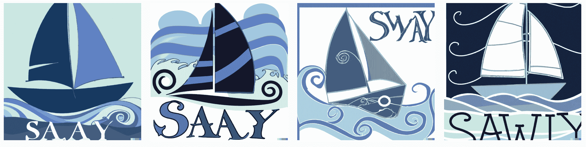

一艘帆船，设计中包含“Sail Away”这个名字，可能背景是波浪或海洋

DALL-E 出奇地不能正确处理文本，它是一个从文本描述生成图像的 AI 程序，而不是用于生成文本本身的。

当你喜欢某个结果后，你可以在 Canva 等网站上完善你的想法。

### 指南针玫瑰

#### DALL-E 提示

```
A compass rose with "Sail Away" written around it, possibly with a vintage or aged look to the design.
```

#### DALL-E 输出

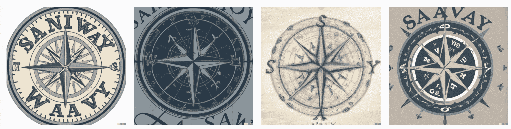

一个指南针玫瑰，周围写着“Sail Away”，设计可能具有复古或陈旧的外观

### 地球仪

#### DALL-E 提示

```
A globe with "Sail Away" written across it, highlighting the international sourcing of the products, possibly with some countries or continents highlighted.
```

#### DALL-E 输出


一个地球仪，上面写着“Sail Away”，突出产品的国际采购，可能有一些国家或大陆被突出显示

### 锚

#### DALL-E 提示

```
An anchor with "Sail Away" written in a bold font, possibly with a rope or chain wrapping around it.
```

#### DALL-E 输出


一个带有“Sail Away”粗体字的锚，可能有绕着它的绳索或链条

### 灯塔

#### DALL-E 提示

```
A lighthouse with "Sail Away" written in cursive underneath it, possibly with waves crashing against it.
```

#### DALL-E 输出

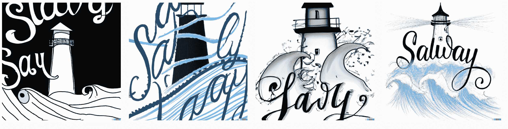

一个灯塔，下面用草书体写着“Sail Away”，可能有海浪拍打在上面

### 卡通波浪

#### DALL-E 提示

```
A cartoon wave with the business name written in a playful font, possibly with a smiling or winking character riding the wave.
```

#### DALL-E 输出

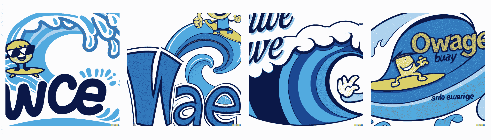

一个卡通波浪，商业名称用俏皮的字体书写，可能有一个笑脸或眨眼的角色在波浪上冲浪。

### 世界地图

#### DALL-E 提示

```
A map of the world with "Sail Away" written in bold letters across it, possibly with different products or categories highlighted in different areas.
```

#### DALL-E 输出

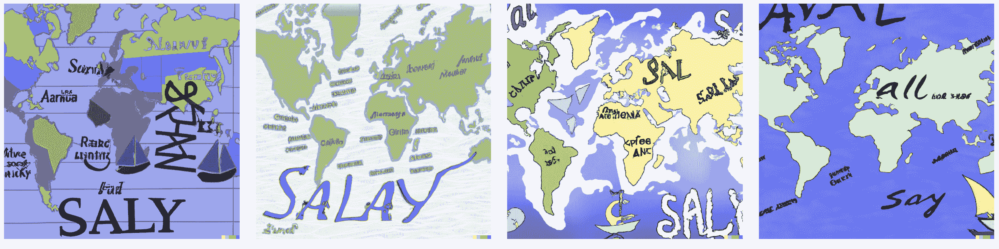

一幅世界地图，上面用粗体字写着“Sail Away”，可能在不同区域用不同的产品或类别进行了突出显示

### 帆船图像

#### DALL-E 提示

```
An image of a sail with the business name written in a modern font, possibly with a gradient or ombre effect.
```

#### DALL-E 输出

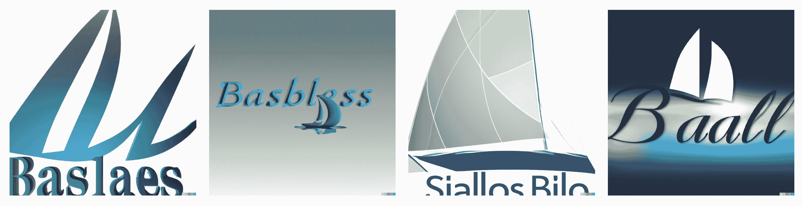

一幅帆的图像，商业名称用现代字体书写，可能有渐变或渐变效果

### 航海绳

#### DALL-E 提示

```
A nautical rope with the business name in a circular design around it, possibly with knots or loops in the design.
```

#### DALL-E 输出

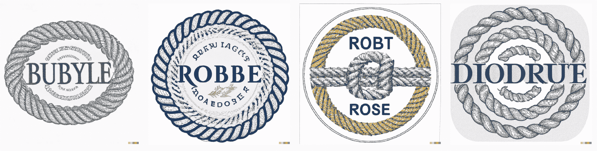

一根航海绳，商业名称以环形设计围绕在周围，可能设计中有结或环

### 方向盘

#### DALL-E 提示

```
A steering wheel with "Sail Away" written across it, highlighting the company's leadership in the industry, possibly with a nautical or maritime background.
```

#### DALL-E 输出


一个方向盘，上面写着“Sail Away”，突出公司在行业中的领导地位，可能有航海或海事背景

## Salem 的品牌生活

拥有一系列好的品牌理念后，Salem 有机会选择他认为最吸引人且与他销售的所有产品完美契合的那个。

### 背景故事

为了给他的品牌形象、目录和产品文档增添激动和有趣的背景，Salem 需要一个融入有趣和引人��胜主题的背景故事。

#### 提示：

```
give me an imaginary dramatic story of sucess about  a little sailboat named "sail away"  that sailed all over the world on journey of discovery  in 8 lines
```

#### 输出：

```
Once upon a time, there was a little sailboat named Sail Away. Against all odds, Sail Away set out on a journey of discovery that took her across the globe. Through stormy weather, uncharted waters, and unfamiliar territory, Sail Away persevered, driven by a desire to see the world and find adventure. Along the way, she encountered new cultures, made lifelong friends, and discovered treasures beyond her wildest dreams. Her journey captured the hearts and imaginations of people around the world, and soon, Sail Away became a symbol of hope, perseverance, and the power of human potential. Today, Sail Away is remembered as a testament to the unyielding spirit of adventure and the limitless potential of the human spirit.
```

现在我们有了一个很好的背景故事，让我们想想可以与“sail away”品牌展示和广告一起使用的简短标语。

#### 提示

```
give me 10 memorable line ideas  that can be used for the "sail away" brand
```

#### 输出：

```
"Sail Away - Where adventure meets the sea." "Find your sea legs and set sail with Sail Away." "Embark on your next journey with Sail Away's treasures." "Sail Away and discover the beauty of the world." "Escape the ordinary and sail away with us." "Life is a journey, sail it with Sail Away." "Sail Away - Your ticket to adventure." "Experience the world through Sail Away's unique finds." "Find your next treasure and sail away with Sail Away." "From the sea to your home - Sail Away brings you the world's finest."
```

那里有一些好主意。

## 结论

总之，借助 ChatGPT AI 的帮助，Salem 已经制定了新的标志设计和品牌概念，他准备推出并建立，因为他着手重新打造他的业务品牌。

*“品牌是成为可知、可爱和可信赖的艺术。” - 约翰·詹奇*


# 用于编码的人工智能

*"最好的错误消息是永远不会出现的。" - 托马斯·福克斯*


编码 - 由 Midjourney AI 生成的图像

## 介绍

如果您是一名编码人员，您会知道在寻找编码问题答案时很容易迷失方向。有时您正在尝试解决特定问题，下一刻您已经深入了几个小时的新资源、技巧和巧妙的代码的兔子洞。虽然这些发现可能很有用，但它们也可能严重浪费时间和生产力。这就是 ChatGPT 的用武之地。通过其快速准确地回答编码问题的能力，ChatGPT 可以帮助您摆脱噪音，重新专注于您最初的任务。如果第一个解决方案不起作用，ChatGPT 可以提供解决方法和替代方案，帮助您重新回到正轨。无论您是经验丰富的编码人员还是刚刚开始，ChatGPT 都可以成为提高您生产力和效率的宝贵工具。

请记住，文档是完成代码的重要部分。即使您的代码是功能性的，直到文档完成为止，它才算真正完成。幸运的是，ChatGPT 也可以协助文档编写，提供最佳实践指导，并提供模板和工具，使流程更加顺畅和高效。借助 ChatGPT 的帮助，您可以确保您的代码完全文档化，并准备好供他人使用。

## 分析和审查代码，无论是什么

ChatGPT 可以分析代码并解释其功能。例如，如果您在浏览旧计算机上的旧媒体时遇到一些陌生的代码，您可以��助于 ChatGPT 来帮助解释其目的。这将简化理解代码的任务。

让我们分析下面的代码并理解它的作用。这种语言看起来很熟悉，但我们并不确定，我们可以做出聪明的猜测并尝试理解它的作用，或者只是拿出那段代码块让 ChatGPT 分析。

```
PROGRAM Sort(input, output); CONST
(* Max array size. *) MaxElts = 50; TYPE
(* Type of the element array. *) IntArrType = ARRAY [1..MaxElts] OF Integer; VAR
(* Indexes, exchange temp, array size. *) i, j, tmp, size: integer; (* Array of ints *) arr: IntArrType; (* Read in the integers. *)
PROCEDURE ReadArr(VAR size: Integer; VAR a: IntArrType); BEGIN size := 1; WHILE NOT eof DO BEGIN readln(a[size]); IF NOT eof THEN size := size + 1
END
END; BEGIN
(* Read *) ReadArr(size, arr); (* Sort using bubble sort. *)
FOR i := size - 1 DOWNTO 1 DO
FOR j := 1 TO i DO
IF arr[j] > arr[j + 1] THEN BEGIN tmp := arr[j];
                    arr[j] := arr[j + 1];
                    arr[j + 1] := tmp; END; (* Print. *)
FOR i := 1 TO size DO writeln(arr[i]) END.
```

拿着这段代码问 ChatGPT 在提示中。

#### 提示 - 它是做什么的：

```
What does this code do ? : PROGRAM Sort(input, output); CONST
(* Max array size. *) MaxElts = 50; TYPE
(* Type of the element array. *) IntArrType = ARRAY [1..MaxElts] OF Integer; VAR
(* Indexes, exchange temp, array size. *) i, j, tmp, size: integer; (* Array of ints *) arr: IntArrType; (* Read in the integers. *)
PROCEDURE ReadArr(VAR size: Integer; VAR a: IntArrType); BEGIN size := 1; WHILE NOT eof DO BEGIN readln(a[size]); IF NOT eof THEN size := size + 1
END
END; BEGIN
(* Read *) ReadArr(size, arr); (* Sort using bubble sort. *)
FOR i := size - 1 DOWNTO 1 DO
FOR j := 1 TO i DO
IF arr[j] > arr[j + 1] THEN BEGIN tmp := arr[j];
                    arr[j] := arr[j + 1];
                    arr[j + 1] := tmp; END; (* Print. *)
FOR i := 1 TO size DO writeln(arr[i]) END.
```

#### 输出 - - 它是做什么的

```
This is a Pascal program that reads in integers and sorts them in ascending order using the bubble sort algorithm. The program defines a constant MaxElts, which is the maximum size of the array of integers that the program can handle. The program declares a type called IntArrType, which is an array of integers with a size of MaxElts. The program then declares some variables: i, j, tmp, size, and arr. i and j are used as loop indices in the bubble sort algorithm, tmp is a temporary variable used to swap elements in the array during sorting, size is the number of integers to be read in and sorted, and arr is the array of integers. The program defines a procedure called ReadArr, which reads integers from input and stores them in the array a. The size of the array is stored in the variable size. The program calls the ReadArr procedure to read in the integers, and then sorts them using the bubble sort algorithm. Finally, the sorted integers are printed to the output. Note: Pascal is a programming language that was popular in the 1980s and 1990s, and this code may not be compatible with modern compilers.
```

好的，所以这段代码是用 Pascal 编写的，我们对其有一些了解，让我们请 ChatGPT 将代码翻译成 Python

#### 提示 - 到 python：

```
translate  the code to python
```

#### 输出 - 到 python

```
Here is the Python version of the provided code: def bubble_sort(arr):
    n = len(arr) # Traverse through all array elements  for i in range(n): # Last i elements are already sorted  for j in range(0, n-i-1): # Swap if the element found is greater than the next element  if arr[j] > arr[j+1]:
                arr[j], arr[j+1] = arr[j+1], arr[j] # Read in the integers arr = [] while True: try:
        arr.append(int(input())) except EOFError: break
# Sort using bubble sort bubble_sort(arr) # Print the sorted array for i in range(len(arr)): print(arr[i])

Note that in the original Pascal code, the eof function is used to check if the end of the input file has been reached. In the Python version, the try and except blocks are used to handle the end of the input stream.
```

让我们尝试将另一个翻译成 Perl

#### 提示 - perl：

```
translate the code to perl
```

#### 输出 - perl

```
Here is the code translated to Perl: use strict; use warnings; my $MaxElts = 50; my @arr = (); sub ReadArr { my $size = 0; while (my $line = <STDIN>) { chomp($line); last if ($line eq ""); $arr[$size++] = $line;
    } return $size;
} my $size = ReadArr(); for (my $i = $size - 1; $i >= 1; $i--) { for (my $j = 0; $j < $i; $j++) { if ($arr[$j] > $arr[$j+1]) { my $tmp = $arr[$j]; $arr[$j] = $arr[$j+1]; $arr[$j+1] = $tmp;
        }
    }
} for (my $i = 0; $i < $size; $i++) { print "$arr[$i]\n";
}

Note that in Perl, stdin is read from the default input filehandle, which is STDIN. Also, the chomp() function is used to remove the newline character from each input line.
```

## 记录您的代码

编码人员喜欢编码，但不太喜欢记录他们的代码。ChatGPT 可以轻松为您生成文档。让我们请 ChatGPT 为冒泡排序生成的 perl 代码生成一个手册页面。

#### 提示 - man 页面：

```
give me a man page for the below code: use strict; use warnings; my $MaxElts = 50; my @arr = (); sub ReadArr { my $size = 0; while (my $line = <STDIN>) { chomp($line); last if ($line eq ""); $arr[$size++] = $line;
    } return $size;
} my $size = ReadArr(); for (my $i = $size - 1; $i >= 1; $i--) { for (my $j = 0; $j < $i; $j++) { if ($arr[$j] > $arr[$j+1]) { my $tmp = $arr[$j]; $arr[$j] = $arr[$j+1]; $arr[$j+1] = $tmp;
        }
    }
} for (my $i = 0; $i < $size; $i++) { print "$arr[$i]\n";
}
```

#### 输出 - man 页面

```
.TH SORT 1 "2023-02-22" "1.0" "sort man page" .SH NAME sort - sort a list of integers

.SH SYNOPSIS sort .SH DESCRIPTION
The sort program reads integers from standard input and sorts them in ascending order using the bubble sort algorithm. The sorted integers are then printed to standard output, each on a separate line. .SH OPTIONS
None

.SH EXAMPLES
To sort a list of integers in a file called "input.txt", run the following command:

.B sort < input.txt

The integers in the file will be sorted in ascending order and printed to standard output. .SH AUTHOR
Written by [Your Name Here].
```

## 编码帮助

在编码过程中，您可能会有一些疑问，偶尔当您向某人寻求帮助时，他们可能会粗鲁地回答 RTFM（阅读该手册）。然而，通过 ChatGPT，您可以简单地提出问题并获得准确的回答。

例如：

#### 提示 - 连接：

```
How do I concatenate several strings in C ?
```

#### 输出 - 连接

```
In C, you can concatenate several strings using the strcat function from the string.h library. Here's an example:   #include <stdio.h> #include <string.h>   int main() {  char str1[20] = "Hello"; char str2[20] = " world"; char str3[20] = " and universe"; char finalStr[60];   strcpy(finalStr, str1); // copy first string strcat(finalStr, str2); // concatenate second string strcat(finalStr, str3); // concatenate third string   printf("%s", finalStr); // print concatenated string return 0; }   In this example, the strcat function is used to concatenate str2 and str3 onto str1 to create the final string finalStr. The strcpy function is used to copy the first string into finalStr before concatenation. Note that finalStr must be large enough to hold the concatenated result. 
```

## 学习新技能

你得到了一份新工作，你大学的大部分工作都是用 Python 完成的，新工作的地方主要使用 Objective-C，你需要快速学习它。

#### 提示 - Obj C：

```
give me an objective C syntax cheat sheet that is useful for every day coding
```

#### 输出 - Obj C

```
Sure, here's an Objective-C syntax cheat sheet that may be useful for everyday coding:   Declaring and Initializing Variables:   // Declare a variable type variableName;   // Declare and initialize a variable type variableName = value;     Class and Object Syntax:   // Declaring a class @interface ClassName : Superclass {  // Instance variables type instanceVariableName; }   // Properties @property (nonatomic, strong) type propertyName;   // Methods - (void)methodName;   @end   // Creating an object ClassName *objectName = [[ClassName alloc] init];     Conditionals:   if (condition) {  // Code to execute when condition is true } else {  // Code to execute when condition is false }   switch (variable) {  case value1: // Code to execute when variable equals value1 break; case value2: // Code to execute when variable equals value2 break; default: // Code to execute when variable doesn't match any case
break;
}

Loops: // for loop for (int i = 0; i < count; i++) { // Code to execute on each iteration } // while loop while (condition) { // Code to execute while condition is true } // do-while loop do { // Code to execute at least once } while (condition);

Arrays: // Declare an array type arrayName[size]; // Initialize an array type arrayName[] = {value1, value2, value3}; // Accessing array elements arrayName[index]; // Iterating over an array for (int i = 0; i < sizeof(arrayName)/sizeof(type); i++) { // Code to execute on each element } NSString Formatting: // Creating an NSString with format NSString *string = [NSString stringWithFormat:@"The value is %d", value]; // Converting a string to a number NSNumberFormatter *formatter = [[NSNumberFormatter alloc] init]; NSNumber *number = [formatter numberFromString:string];

Memory Management: // Allocating and deallocating memory type *pointer = malloc(sizeof(type)); free(pointer); // Retaining and releasing objects [object retain];
[object release];

Blocks: // Defining a block ^returnType(parameters) { // Code to execute }; // Using a block [object methodWithCompletionHandler:^{ // Code to execute when the method is complete }];

I hope you find this Objective-C syntax cheat sheet useful for your everyday coding needs!
```

好的，这是一个很好的开始，但如果我们想学到更多，让我们获取一些书籍建议吧

#### 提示 - 书籍：

```
what are good books that will help me learn objective C fast
```

#### 输出 - 书籍

```
Here are some books that could help you learn Objective-C: "Programming in Objective-C" by Stephen G. Kochan - This is a popular book that covers the basics of the Objective-C programming language. "Objective-C Programming: The Big Nerd Ranch Guide" by Aaron Hillegass and Mikey Ward - This is a comprehensive guide to Objective-C programming, which covers topics such as memory management, design patterns, and debugging. "Objective-C for Absolute Beginners: iPhone, iPad, and Mac Programming Made Easy" by Gary Bennett, Brad Lees, and Mitchell Fisher - This book is designed for those who have no prior programming experience and teaches the basics of Objective-C programming with a focus on iOS and macOS development. "iOS Programming: The Big Nerd Ranch Guide" by Joe Conway and Aaron Hillegass - This book covers iOS programming with Objective-C, as well as Swift. It includes practical exercises and detailed explanations of iOS development. "Objective-C Fundamentals" by Matt Neuburg - This book provides a thorough introduction to Objective-C programming, with an emphasis on object-oriented programming concepts. "Effective Objective-C 2.0: 52 Specific Ways to Improve Your iOS and OS X Programs" by Matt Galloway - This book focuses on advanced topics in Objective-C programming, providing tips and best practices for writing efficient and effective code. These books can help you learn Objective-C programming at different levels of expertise, so you can choose the one that best suits your needs.
```

也许我们从视频中学习更好，让我们看看 ChatGPT 告诉我们什么：

#### 提示 - 视频：

```
can i get video suggestions with urls to learn objective C
```

#### 输出 - 视频

```
Sure, here are some video tutorials for learning Objective-C:

Objective-C Tutorial for Beginners by TheNewBoston: https://www.youtube.com/playlist?list=PLFE2CE09D83EE3E28
Objective-C Programming Course by Udemy: https://www.udemy.com/course/objective-c-programming-course/
iOS Development with Objective-C by Stanford University: https://www.youtube.com/watch?v=71pyOB4TPRE&list=PL9FA4C410EBA1384C
Objective-C Crash Course for Swift Developers by Devslopes: https://www.youtube.com/watch?v=eLTYvQCM_Z4
Objective-C Programming for iOS Development by Treehouse: https://www.youtube.com/watch?v=dFyT09BCzU0
I hope you find these resources helpful!
```

经过检查，所有链接似乎都无法使用，可能已过时。然而，这个问题可能会在未来得到解决。或者，我们可以再次询问 ChatGPT 以获取更新的资源。

#### 提示 - 损坏的链接：

```
none of the links work
```

#### 输出 - 损坏的链接

```
I apologize for the inconvenience. Here are some updated video suggestions for learning Objective-C, along with their corresponding URLs:

Objective-C Tutorial for Beginners by Derek Banas: https://www.youtube.com/watch?v=7wv1LHsMXzo
Objective-C Programming Tutorial by thenewboston: https://www.youtube.com/watch?v=8EYYw-nsSbE&list=PLFE2CE09D83EE3E28
Objective-C Tutorial - iOS Development Course by Udemy: https://www.udemy.com/course/objective-c-tutorial-for-absolute-beginners/
Objective-C Programming Course for Beginners by CodeWithChris: https://www.youtube.com/watch?v=3z6X1L6dL0M&list=PLMRqhzcHGw1ZrHbNvYWQ6K1noHDK1X6Gb
I hope this helps. Please let me know if you have any further questions or concerns.
```

提供的新链接似乎都无法使用，除了一个重定向到 Java 教程的链接。这突显了以谨慎验证 ChatGPT 提供的信息的重要性。虽然 ChatGPT 的回答大多是准确的，但仔细核实信息可以增强你对其准确性的信心。

## 模板和片段

ChatGPT 非常适合代码模板，你可以专注于实际的代码。

#### 提示 - COBOL 模板：

```
i need a code template in Cobol that says "Hello World"
```

#### 输出 - COBOL 模板

```
Sure, here's a sample code template in COBOL that prints out "Hello World" to the console:

IDENTIFICATION DIVISION. PROGRAM-ID. HELLO-WORLD. PROCEDURE DIVISION. DISPLAY 'Hello World'. STOP RUN. The IDENTIFICATION DIVISION specifies the name of the program as HELLO-WORLD, while the PROCEDURE DIVISION contains the instructions to display the message and stop the program. When you run this program, it will simply display the message "Hello World" on the console.
```

这里有一个更加当前的例子，可能会有用，涉及 HTML 和 Javascript

#### 提示 - html：

```
i need a code template for an html page with an embedded button that plays 3 beeps written in javascript 
```

#### 输出 - html

```
Certainly, here's an HTML code template with an embedded button that plays three beeps using JavaScript:

<!DOCTYPE html>
<html>
<head>
	<title>Play 3 Beeps</title>
</head>
<body>
	<button onclick="playBeeps()">Play 3 Beeps</button>

	<script> function playBeeps() { var beepSound = new Audio('beep.mp3'); beepSound.play(); setTimeout(function() { beepSound.play();
			}, 1000); setTimeout(function() { beepSound.play();
			}, 2000);
		}
	</script>
</body>
</html>

Here's what each part of the code does:

The button element creates a button that triggers the playBeeps() function when clicked. The script element contains the JavaScript code that defines the playBeeps() function. In the playBeeps() function, we first create a new Audio object that loads the beep.mp3 file. Then, we use the play() method to play the beep sound immediately, and use setTimeout to play the sound again after a delay of 1 second and 2 seconds respectively. Note that you will need to replace the beep.mp3 file with an actual audio file that contains the beep sound you want to play. Additionally, you may need to adjust the file path or change the file format depending on your requirements.
```

## 结论

虽然 ChatGPT 可能无法完全取代编码，但它可以通过帮助检测错误、调试、文档编写以及分析他人的代码来显著提高生产力。这些好处真的是无价的。

*"一个好的程序员是那种在穿过单行道之前总是看两边的人。" - 道格·林德*


# 创意过程

*"创造力就是连接事物。当你问创意人士他们是如何做到的时候，他们会感到有点内疚，因为他们并没有真正做到，他们只是看到了一些东西。过了一段时间后，这些事情对他们来说似乎是显而易见的。" - 史蒂夫·乔布斯*

## 创意过程的五个阶段

以下是创造性思维过程的五个阶段：

1.  准备工作：在这个阶段，您收集信息并探索手头的问题或任务。

1.  孵化：这个阶段涉及让您的思维漫游并处理收集到的信息。

1.  洞察：这是“啊哈！”时刻，当一个解决方案或想法突然闪现在您的脑海中。

1.  评估：在这里，您评估并完善在洞察阶段生成的想法或解决方案。

1.  实施：最后，您将您的想法或解决方案付诸实施，并采取具体步骤使其成为现实。

作为您的创意助手，ChatGPT 可以在创意过程的每个阶段帮助您。

为了使这些阶段更具相关性，让我们看看 Ahmed 进入创意过程的旅程。

这是 Ahmed 创意过程的真实故事，遵循创意过程的五个阶段，并导致一种革命性小部件的发明：

## 准备工作


准备工作 - 由 Midjourney AI 生成的图像

准备工作：Ahmed 是一名机械工程师，已在汽车行业工作了十多年。他热衷于找到创新解决方案，并一直在研究新材料、技术和设计原则。Ahmed 也是播客的粉丝，一直在听有关创业精神和颠覆性技术的节目。有一天，他意识到市场上存在一种可以使汽车更节能环保的小部件的空白。

Ahmed 启动他的 Chat-GPT，并对燃油效率进行了一些研究，从目前可用的内容开始：

#### 提示 - 燃油效率汽车：

```
give me to top 5 most fuel efficent cars and what makes them fuel efficient, provide the answers in a summarized list
```

#### 输出 - 燃油效率汽车

```
Sure, here's a summarized list of the top 5 most fuel-efficient cars and what makes them fuel-efficient:

Toyota Prius Eco - A hybrid vehicle that uses regenerative braking system and achieves a combined fuel economy of 56 MPG. Hyundai Ioniq Blue - A hybrid vehicle that uses a six-speed dual-clutch automatic transmission and achieves a combined fuel economy of 58 MPG. Toyota Prius Prime - A plug-in hybrid electric vehicle that can travel up to 25 miles on electric power alone and achieves a combined fuel economy of 133 MPGe. Tesla Model 3 - An all-electric vehicle that uses a high-capacity battery pack and a highly efficient electric motor to achieve a combined fuel economy of 141 MPGe. Kia Niro FE - A hybrid crossover SUV that uses a six-speed dual-clutch automatic transmission and lightweight materials to achieve a combined fuel economy of 50 MPG. In summary, these cars achieve high fuel efficiency through a combination of hybrid or electric powertrains, regenerative braking systems, advanced transmission systems, high-capacity batteries, and lightweight materials.
```

现在 Ahmed 有了一些现实世界的例子，他开始思考，如何可以改进？

## 孵化


孵化 - 由 Midjourney AI 生成的图像

孵化：Ahmed 开始为这个小部件构思想法，但发现他最初的概念不切实际或经济。他将问题搁置一旁，开始着手其他项目，但小部件的想法仍在困扰着他。

Ahmed 也咨询 ChatGPT，看看还能做些什么：

#### 提示 - 还能做些什么：

```
what more can be done to improve on fuel efficiency for cars ? 
```

#### 输出 - 还能做些什么

```
There are several ways that car manufacturers and consumers can continue to improve fuel efficiency in cars. Here are some ideas:

Improve engine technology: Car manufacturers can continue to improve internal combustion engines by using turbocharging, direct fuel injection, and other advanced technologies to improve fuel efficiency. Increase use of hybrid and electric powertrains: Hybrid and electric vehicles are already some of the most fuel-efficient cars on the market, but car manufacturers can continue to improve these technologies and make them more affordable for consumers. Reduce weight: By using lightweight materials like aluminum, carbon fiber, and high-strength steel, car manufacturers can reduce the weight of cars, which can lead to improved fuel efficiency. Improve aerodynamics: Cars with lower wind resistance require less power to maintain speed, which can improve fuel efficiency. Car manufacturers can use wind tunnel testing and computer simulations to optimize the aerodynamics of their vehicles. Increase use of alternative fuels: Biofuels, hydrogen fuel cells, and other alternative fuels can reduce the amount of petroleum-based fuels that cars consume, which can improve fuel efficiency and reduce emissions. Improve driving habits: Consumers can improve fuel efficiency by adopting more efficient driving habits, such as reducing speed, avoiding rapid acceleration and braking, and maintaining proper tire pressure. Implement government policies: Governments can implement policies that encourage the development and adoption of more fuel-efficient vehicles, such as tax incentives, fuel efficiency standards, and investments in research and development. In conclusion, there are several ways that car manufacturers and consumers can continue to improve fuel efficiency in cars, including improving engine technology, increasing the use of hybrid and electric powertrains, reducing weight, improving aerodynamics, increasing the use of alternative fuels, improving driving habits, and implementing government policies.
```

艾哈迈德在通勤途中、洗澡时甚至午餐休息时经常会心不在焉。当他在不同的想法和概念之间建立心理联系时，他意识到他的想法与行业一致，正如 ChatGPT 所建议的那样。这一认识使他考虑到两种可能性：改进现有解决方案或探索全新的解决方案。此外，艾哈迈德发现他一直在研究的新材料可以用来制造既轻便又耐用的小部件，潜在地降低燃油消耗。

## 洞察


洞察 - 由 Midjourney AI 生成的图像

洞察：一天，当艾哈迈德在进行完全不同的项目时，他突然有了一个“啊哈！”的时刻。他意识到他可以使用某种类型的聚合物来创建一个中空结构，可以填充一种减少摩擦并提高燃油效率的气体。他冲到白板前开始勾画设计，对这个想法感到兴奋和激动。

艾哈迈德正在正确的道路上，但想知道在哪里可以利用它来改善燃油消耗。他向 ChatGPT 提出提示。

#### 提示 - 最大摩擦：

```
where is the most friction in a car that wastes energy and increases fuel consumption ?
```

#### 输出 - 最大摩擦

```
The most friction in a car that wastes energy and increases fuel consumption is typically found in the engine and the transmission. Friction can occur in various parts of the engine, including the piston rings, crankshaft bearings, and camshaft bearings. Friction can also occur in the transmission, particularly in the gears and bearings. This friction results in energy losses due to heat generation and other forms of energy dissipation. To reduce this friction, car manufacturers have implemented various technologies such as low-friction coatings, improved lubrication systems, and more efficient transmission designs. Additionally, regular maintenance, such as oil changes and proper tire inflation, can help to reduce friction and improve fuel efficiency.
```

## 评估


评估 - 由 Midjourney AI 生成的图像

评估：艾哈迈德退后一步，开始更加批判地评估这个想法。

#### 提示 - 列出组件：

```
list out these components
```

#### 输出 - 列出组件

```
Sure, here are some of the key components in a car's engine and transmission that can contribute to friction and energy losses:

Engine:

Piston rings
Crankshaft bearings
Camshaft bearings
Timing belt or chain
Valves and valve guides
Connecting rods
Cylinder walls
Transmission:

Gears
Bearings
Clutch
Torque converter
Transmission fluid
Shift linkage and cables
It's worth noting that other parts of the car, such as the brakes and tires, can also contribute to energy losses due to friction, so regular maintenance and proper driving habits are important for maximizing fuel efficiency.
```

艾哈迈德仔细检查每个组件，以确定它对降低燃油消耗的贡献程度。他考虑单个组件是否足够，或者组合组件是否更有效地实现期望的结果。此外，他考虑生产小部件的成本，并评估其潜在市场需求。艾哈迈德与同事和行业专家协商，以获得对设计及其潜在影响的反馈。在这个过程中，他发现所选的聚合物材料在规模生产时仍然昂贵，但他找到了一种替代的制造工艺，可以帮助降低成本。

## 实施


实施 - 由 Midjourney AI 生成的图像

实施：艾哈迈德花了接下来的几个月时间研究小部件的原型，完善设计并测试不同的材料和制造技术。

尽管艾哈迈德有许多好主意，但在发明世界中还缺乏经验，因此他向 ChatGPT 寻求关于追求自己想法最有效方法的建议。

#### 提示 - 需要计划：

```
give me an implementation plan for the  widget's prototype, refining the design and testing different materials and manufacturing techniques
```

#### 输出 - 需要计划

```
Sure, here's a possible implementation plan for developing and testing the widget's prototype, refining the design, and testing different materials and manufacturing techniques:

Define the Prototype: Ahmed should start by defining the specifications and features of the widget prototype, including the materials, dimensions, and components needed to achieve the desired fuel efficiency improvements. Research and Development: Ahmed should then begin research and development to create the initial prototype, testing different materials and manufacturing techniques to refine the design and optimize the widget's performance. During this stage, he should also consider cost-effectiveness and scalability in the manufacturing process. Testing and Validation: Once the prototype is developed, Ahmed should test it under various conditions to validate its effectiveness in reducing fuel consumption. This testing should involve both laboratory and real-world conditions to ensure that the widget performs as expected. Refine the Design: Based on the results of the testing and validation, Ahmed should refine the design of the widget prototype, incorporating any necessary changes or improvements identified during the testing process. Additional Testing: Once the design is refined, Ahmed should test the updated prototype to ensure that the changes made have resulted in the desired improvements in fuel efficiency. Manufacturing Plan: Once the design is finalized, Ahmed should develop a manufacturing plan for producing the widget at scale. He should consider factors such as sourcing materials, production capacity, cost-effectiveness, and quality control. Continuous Improvement: Ahmed should continue to monitor and improve the widget's performance and refine the manufacturing process to ensure the product is both cost-effective and effective in reducing fuel consumption. Overall, this implementation plan is focused on delivering a high-quality prototype that meets the desired specifications and performance goals, as well as creating a feasible plan for manufacturing the widget at scale.
```

现在，艾哈迈德有了良好的工作结构，他工作时间很长，经常在实验室里工作到深夜或周末。最终，他创造出一个超出他期望的工作原型。他向公司董事会展示了他的发明，他们对他的创新解决方案和其改革汽车行业潜力印象深刻。这个小部件被专利保护，艾哈迈德成为负责生产的首席工程师。

*"创造力就是智慧在玩耍。" - 阿尔伯特·爱因斯坦*


# 作者简介：


图书馆 - 由 Midjourney AI 生成的图像

Jamal Faisal Almutawa 是一位经验丰富的电信专业人士，在该行业拥有超过 21 年的经验。他在 IT、软件、电信、金融科技和人工智能等尖端技术领域拥有强大的专业知识。在他的职业生涯中，Jamal 曾在 Zain 担任多个领导职务，并担任 Basket SPC 的创始人兼首席执行官。

除了在科技和电信行业的工作外，Jamal 是一位热情而知识渊博的科技爱好者，对所有新技术都有浓厚兴趣。他时刻关注行业最新趋势，使自己成为一个全面发展的行业专家。

## 社交媒体账号：

Twitter: @jamalmutawa

LinkedIn: [`www.linkedin.com/in/jamal-al-mutawa/`](https://www.linkedin.com/in/jamal-al-mutawa/)
