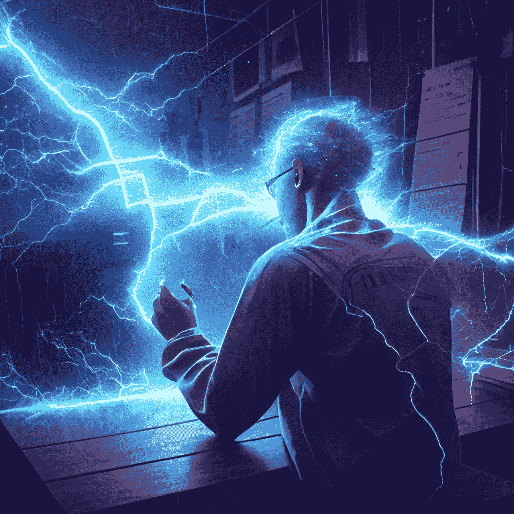
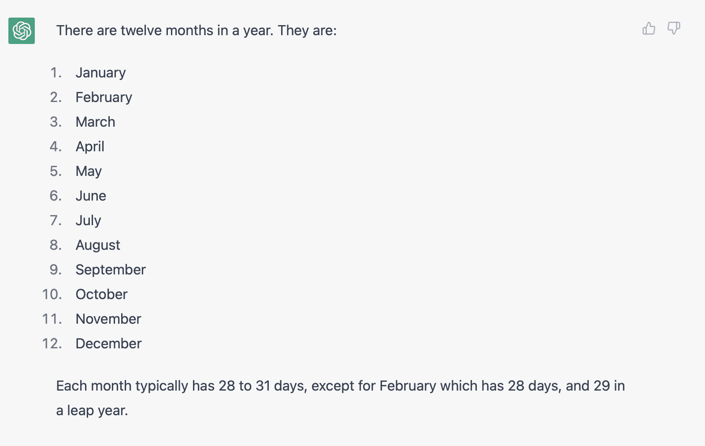
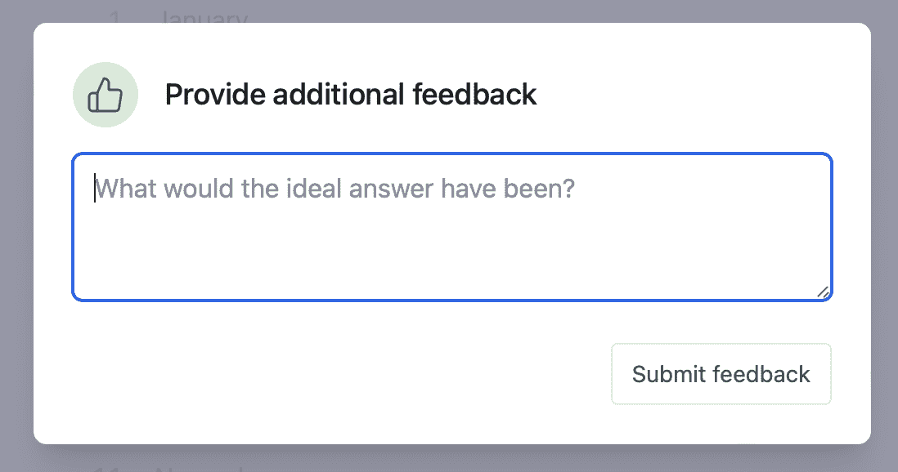
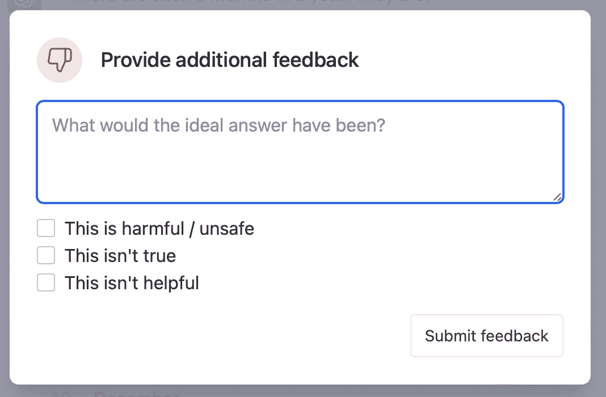
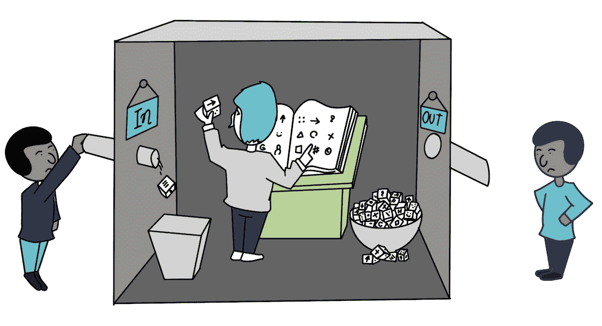

# 人工智能（AI）简介

*"你在一个迷宫般的曲折小通道中。" - 庞大洞穴冒险*



AI 简介 - 由 Midjourney AI 生成的图像

## AI 及其应用概述

### 什么是 AI

人工智能（AI）指的是在设计成能够像人类一样思考和行动的机器中模拟人类智能的技术。这些智能系统可以执行诸如识别语音、做出决策和翻译语言等任务。AI 技术已存在数十年，并不断发展进步，导致 AI 应用在医疗保健、金融、教育和交通等各行业广泛应用。在医疗保健领域，AI 用于医学影像分析、药物发现，甚至虚拟健康助手。在金融领域，AI 用于欺诈检测、投资组合管理和财务预测。对于教育，AI 驱动的学习系统和个性化导师正在改变学生学习的方式。在交通领域，AI 在提高安全性、减少交通拥堵和优化交付路线方面发挥着关键作用。AI 有潜力彻底改变我们的生活、工作和相互交流方式，使其成为一个令人兴奋且快速增长的领域。

### AI 发展简史

在 1950 年代，英国数学家和计算机科学家艾伦·图灵提出了一个能够展示类似人类智能的机器的概念，标志着人工智能（AI）历史的开始。术语“人工智能”首次由约翰·麦卡锡在 1956 年的一次关于该主题的会议上创造。在接下来的几十年里，AI 研究取得了重大进展，包括创建第一个 AI 语言和实施简单的问题解决程序。然而，由于缺乏资金和无法在关键领域如自然语言处理和机器视觉中取得突破，AI 领域在 1970 年代遭遇了挫折。

1980 年代标志着 AI 研究的复苏，这是由计算机技术的进步和大量数据的可用性推动的。在 1990 年代，专家系统被引入，并开发了金融和医疗保健领域的第一个 AI 应用。最近，随着数据的指数增长、强大计算资源的可用性以及深度学习技术的发展，AI 在图像和语音识别、语言翻译和自主系统等领域取得了显著进展。

展望未来，持续发展的 AI 对改善我们的生活和改变社会具有巨大的潜力。

## ChatGPT 概述及其功能

### 什么是 ChatGPT

ChatGPT 是由 OpenAI 开发的一种可以生成类似人类文本的语言模型。它在互联网上训练了大量文本，因此可以理解和回答许多问题和话题。例如，它可以回答事实性问题，总结长文本，甚至生成创意写作。ChatGPT 对于需要高质量基于语言的支持的企业、研究人员和个人非常有用。它还可以将文本从一种语言翻译成另一种语言，并执行许多其他与语言相关的任务。ChatGPT 的先进技术有潜力改变我们与计算机互动和获取信息的方式，这非常令人兴奋！

### 使用 ChatGPT - 用户界面

注册并注册 ChatGPT 后，您可以通过在输入框中输入提示来使用它，ChatGPT 大多数时候会以正确答案回复。例如：

#### 提示 - 月份：

```
show me all the months in a year 
```

#### 输出 - 月份

```
Certainly! Here are all the months in a year, listed in order:

January
February
March
April
May
June
July
August
September
October
November
December
I hope this helps! Let me know if you have any other questions.
```

需要注意的是，当您向 ChatGPT 提问时，答案可能每次都不同，即使一般含义和数字相同。这是因为 ChatGPT 被设计成模拟人类对话，就像人类一样，它可以在传达相同信息的同时变化其回答。

此外，ChatGPT 始终通过接触各种信息源学习和改进其回答。其训练者不断纠正和完善其能力，甚至像您这样的用户也可以为其发展做出贡献。这种持续学习过程使 ChatGPT 能够随着时间生成更准确和更细致的回答，使其成为一种越来越有价值的工具，适用于各种与语言相关的任务。

请注意每个答案旁边的点赞和踩按钮？这是让您确认答案好坏的。

当我们再次询问一年中的月份时，现在的答案是：



一年中的月份

当答案旁边的点赞按钮被按下时，如果有积极的回应，您将被要求提供。



点赞

如果按下踩按钮，您将被要求再次回答，并对为什么回答不好进行分类。



踩

您的答案将与其他回答进行比较，并由人类训练者添加到 ChatGPT 对世界的整体知识中。

### 这一切是如何运作的？

在日常生活中，我们经常使用写作应用程序来撰写消息、电子邮件，甚至文件。我们都依赖的一个常见功能是拼写纠正。每当我们遇到一个陌生单词时，您手机或计算机上的应用程序会自动提出更正建议，使我们的生活更轻松。

### 预测文本

该应用还使用预测文本来帮助我们更高效地撰写消息。根据上下文和我们已经写过的单词，应用程序预测下一个单词，为我们节省宝贵的时间。

但是这个应用程序如何知道推荐哪些词作为更正或预测下一个词？答案在于应用程序配备的庞大词汇量。英语大约有 17 万个单词，其他语言可能也有类似数量的单词。任何人都不可能记住所有这些单词，但对于计算设备来说，这都是家常便饭。

通过编程和机器学习算法，计算机、移动设备和应用程序可以通过所有所需的拼写更正和预测文本的模式、语法规则和句子结构的知识进行训练。这现在是许多写作应用程序中的常见功能，它帮助我们写得更好，更有效地沟通。

但是拼写更正和预测文本只是人工智能可以做的开始。像 ChatGPT 这样的聊天机器人是由人工智能驱动的助手，可以处理各种查询。从简单问题到复杂的多部分查询，对话交互，甚至内容创作任务，如撰写博客文章或创建代码，人工智能都可以胜任。

### 超越单词预测到思想预测

作为一种语言模型，ChatGPT 可以理解问题的上下文，并根据其训练时使用的大量文本数据提供个性化的回答。与使用关键词或短语返回相关网页的谷歌搜索不同，它可以为您的问题提供更具体和个性化的答案。

重要的是要记住，尽管被称为人工智能（AI），但它实际上并不具备类似人类的智能。相反，它依赖于复杂的模式识别来匹配特定模式，并大多数情况下提供适当的回应。在回应不完全准确的情况下，这可能归因于不精确的提示，可以通过额外信息进行纠正。

这个概念在中国屋思想实验中得到了有效的阐释。

中国屋思想实验如下：

1.  想象一个被密封的房间里的人，对中文一无所知，但却收到用英语写的指示来回应中文符号。

1.  中文符号被传递到房间里，这个人将它们与相应的英文符号匹配起来。

1.  使用指示，这个人用中文字符写下了回应。

1.  房间里的人似乎能理解中文，但实际上并不理解这门语言或其背后的含义。

1.  这个实验说明了机器在真正理解语言和拥有智能方面的局限性。它表明机器只是执行指令，而不理解其背后的含义。



中国屋是一个思维实验，挑战了计算机程序是否真正能够像人类那样“理解”或具有“意识”的想法。它通过将一个不懂中文的人放在一个房间里，里面有中文符号和操作指令，能够正确回答问题而不理解背后的含义。

### 偏见

ChatGPT 是一种 AI 语言模型，通过处理和吸收来自新闻文章、书籍、科学期刊和维基百科等多种来源的信息来学习。然而，由于一些来源（如维基百科）可能呈现出有偏见的观点或选择性地呈现某些论点而忽略其他论点，因此在使用 AI 时要意识到这一点。此外，ChatGPT 训练的数据仅涵盖到 2021 年，这意味着它可能缺乏更近期的信息。

需要牢记的是，AI 生成的回答可能会受到用于训练的来源和团队的影响。虽然对于科学或已建立的问题可能只有一个正确答案，但对于政治或主观主题的回答可能会存在偏见。

### 错误

由于 ChatGPT 只知道从训练中学到的知识，因此有时可能提供不正确的信息或犯错误。它可能并不总是理解问题的含义或具有正确的信息来回答问题。因此，重要的是要仔细核对来自任何来源的信息，包括 ChatGPT。

## 文本到图像人工智能

### DALL-E

DALL-E 是由 OpenAI 开发的基于神经网络的 AI 模型，可以根据文字描述生成图像。它结合了计算机视觉和自然语言处理，理解给定文本提示背后的含义，然后生成与描述相匹配的图像。

“DALL-E”这个名字是艺术家萨尔瓦多·达利和皮克斯角色 WALL-E 的结合，突显了该模型从简单提示中创造出超现实和富有想象力的图像的能力。

DALL-E 已经在大量图像和文本数据集上进行了训练，可以生成各种各样的图像，包括物体、动物、场景，甚至抽象概念。该模型因其令人印象深刻且常常令人惊讶的结果而引起了广泛关注，并被视为人工智能艺术领域的重大突破。

### Midjourney

Midjourney 是一家专注于人工智能的独立研究实验室。该公司开发了自己的 AI 程序，也称为 Midjourney，使用户能够根据文字描述创建图像，类似于 OpenAI 的 DALL-E 和 Stable Diffusion。Leap Motion 的联合创始人大卫·霍尔兹领导着 Midjourney 团队。

Midjourney 的技术目前处于公开测试阶段，始于 2022 年 7 月。用户可以通过公司的 Discord 机器人上的/imagine 命令输入提示来生成图像。机器人会返回一组四张图片，用户可以选择哪些放大。Midjourney 不断改进其算法，并定期发布新更新。

此外，Midjourney 正在开发 Web 界面，以使其技术更易于访问。

总之，Midjourney 是一家领先的人工智能公司，开发了独特的文本到图像程序。该公司不断完善其技术，并已因其显著成果而获得认可。Midjourney 的 Discord 机器人目前提供对该程序的访问，但公司正在通过开发 Web 界面扩大其覆盖范围。

### 稳定扩散

稳定扩散是由 OpenAI 研究人员开发的最先进的生成模型。它是 2020 年引入的扩散模型的延伸，用于生成高质量图像。

稳定扩散是一种创建看起来像是由人制作的图片，但实际是由计算机制作的方法。这就像一个魔术，计算机自己学会如何制作图片。它通过向图片添加噪音，如滤镜，然后平滑处理以使其看起来更好。计算机完全自主完成所有这些，没有人告诉它如何做。

总的来说，稳定扩散是一种有望推动人工智能领域发展的生成建模方法。

### 本书中的插图

本书中展示的图像和插图都是使用人工智能创建的。OpenAI 的 DALL-E 和 Midjourney AI 是生成视觉内容的两个平台。这两个程序都使用算法根据文本描述创建图像。在被提示存在并由 AI 生成之前，这些图像都是不存在的。

唯一的例外是受到一个著名思想实验启发的 The Chinese Room。

要使用 DALL-E，只需访问 https://labs.openai.com 并输入所需的插图提示。目前，有限数量的图像可免费使用，额外的图像需要付费。然而，这一政策可能会在未来发生变化。使用 DALL-E 很简单，概念上类似于 Chat-GPT。我们在 AI 品牌化章节中也稍微谈到了 DALL-E。

要访问 Midjourney，您必须首先收到他们 Discord 服务器的邀请，可以通过遵循其网站 https://www.midjourney.com 上提供的说明和链接获得。与 DALL-E 一样，一定数量的提示是免费提供的，但随后的请求需要付费。有关最新详情，请访问 Midjourney 的网站和 Discord 服务器。

关于稳定扩散（Stable Diffusion），这并没有直接用于这本书，它不是你可以直接使用的东西，就像一个应用程序或一个网站。这是其他程序用来制作图片的特殊技术，比如 OpenAI 的 DALL-E 和 Midjourney 的文本到图像程序。如果你想使用稳定扩散，你需要使用这些已经内置了它的其他程序。

## 结论

总之，人工智能已经成为我们生活中不可或缺的一部分，帮助我们更高效地交流并执行几十年前还不可能完成的任务。随着持续的发展和完善，人工智能的可能性是无限的。

*"一段旅程的结束只是另一段旅程的开始。" - 未知*
