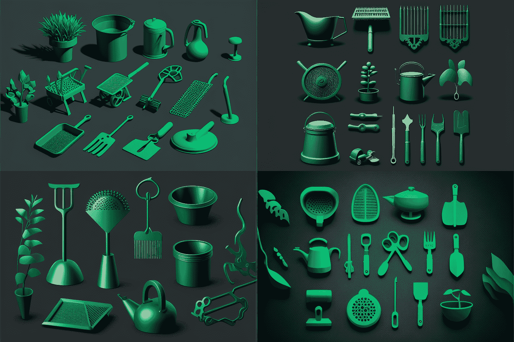

# 创意过程

*"创造力就是连接事物。当你问创意人士他们是如何做到的时候，他们会感到有点内疚，因为他们并没有真正做到，他们只是看到了一些东西。过了一段时间后，这些事情对他们来说似乎是显而易见的。" - 史蒂夫·乔布斯*

## 创意过程的五个阶段

以下是创造性思维过程的五个阶段：

1.  准备工作：在这个阶段，您收集信息并探索手头的问题或任务。

1.  孵化：这个阶段涉及让您的思维漫游并处理收集到的信息。

1.  洞察：这是“啊哈！”时刻，当一个解决方案或想法突然闪现在您的脑海中。

1.  评估：在这里，您评估并完善在洞察阶段生成的想法或解决方案。

1.  实施：最后，您将您的想法或解决方案付诸实施，并采取具体步骤使其成为现实。

作为您的创意助手，ChatGPT 可以在创意过程的每个阶段帮助您。

为了使这些阶段更具相关性，让我们看看 Ahmed 进入创意过程的旅程。

这是 Ahmed 创意过程的真实故事，遵循创意过程的五个阶段，并导致一种革命性小部件的发明：

## 准备工作


准备工作 - 由 Midjourney AI 生成的图像

准备工作：Ahmed 是一名机械工程师，已在汽车行业工作了十多年。他热衷于找到创新解决方案，并一直在研究新材料、技术和设计原则。Ahmed 也是播客的粉丝，一直在听有关创业精神和颠覆性技术的节目。有一天，他意识到市场上存在一种可以使汽车更节能环保的小部件的空白。

Ahmed 启动他的 Chat-GPT，并对燃油效率进行了一些研究，从目前可用的内容开始：

#### 提示 - 燃油效率汽车：

```
give me to top 5 most fuel efficent cars and what makes them fuel efficient, provide the answers in a summarized list
```

#### 输出 - 燃油效率汽车

```
Sure, here's a summarized list of the top 5 most fuel-efficient cars and what makes them fuel-efficient:

Toyota Prius Eco - A hybrid vehicle that uses regenerative braking system and achieves a combined fuel economy of 56 MPG. Hyundai Ioniq Blue - A hybrid vehicle that uses a six-speed dual-clutch automatic transmission and achieves a combined fuel economy of 58 MPG. Toyota Prius Prime - A plug-in hybrid electric vehicle that can travel up to 25 miles on electric power alone and achieves a combined fuel economy of 133 MPGe. Tesla Model 3 - An all-electric vehicle that uses a high-capacity battery pack and a highly efficient electric motor to achieve a combined fuel economy of 141 MPGe. Kia Niro FE - A hybrid crossover SUV that uses a six-speed dual-clutch automatic transmission and lightweight materials to achieve a combined fuel economy of 50 MPG. In summary, these cars achieve high fuel efficiency through a combination of hybrid or electric powertrains, regenerative braking systems, advanced transmission systems, high-capacity batteries, and lightweight materials.
```

现在 Ahmed 有了一些现实世界的例子，他开始思考，如何可以改进？

## 孵化


孵化 - 由 Midjourney AI 生成的图像

孵化：Ahmed 开始为这个小部件构思想法，但发现他最初的概念不切实际或经济。他将问题搁置一旁，开始着手其他项目，但小部件的想法仍在困扰着他。

Ahmed 也咨询 ChatGPT，看看还能做些什么：

#### 提示 - 还能做些什么：

```
what more can be done to improve on fuel efficiency for cars ? 
```

#### 输出 - 还能做些什么

```
There are several ways that car manufacturers and consumers can continue to improve fuel efficiency in cars. Here are some ideas:

Improve engine technology: Car manufacturers can continue to improve internal combustion engines by using turbocharging, direct fuel injection, and other advanced technologies to improve fuel efficiency. Increase use of hybrid and electric powertrains: Hybrid and electric vehicles are already some of the most fuel-efficient cars on the market, but car manufacturers can continue to improve these technologies and make them more affordable for consumers. Reduce weight: By using lightweight materials like aluminum, carbon fiber, and high-strength steel, car manufacturers can reduce the weight of cars, which can lead to improved fuel efficiency. Improve aerodynamics: Cars with lower wind resistance require less power to maintain speed, which can improve fuel efficiency. Car manufacturers can use wind tunnel testing and computer simulations to optimize the aerodynamics of their vehicles. Increase use of alternative fuels: Biofuels, hydrogen fuel cells, and other alternative fuels can reduce the amount of petroleum-based fuels that cars consume, which can improve fuel efficiency and reduce emissions. Improve driving habits: Consumers can improve fuel efficiency by adopting more efficient driving habits, such as reducing speed, avoiding rapid acceleration and braking, and maintaining proper tire pressure. Implement government policies: Governments can implement policies that encourage the development and adoption of more fuel-efficient vehicles, such as tax incentives, fuel efficiency standards, and investments in research and development. In conclusion, there are several ways that car manufacturers and consumers can continue to improve fuel efficiency in cars, including improving engine technology, increasing the use of hybrid and electric powertrains, reducing weight, improving aerodynamics, increasing the use of alternative fuels, improving driving habits, and implementing government policies.
```

艾哈迈德在通勤途中、洗澡时甚至午餐休息时经常会心不在焉。当他在不同的想法和概念之间建立心理联系时，他意识到他的想法与行业一致，正如 ChatGPT 所建议的那样。这一认识使他考虑到两种可能性：改进现有解决方案或探索全新的解决方案。此外，艾哈迈德发现他一直在研究的新材料可以用来制造既轻便又耐用的小部件，潜在地降低燃油消耗。

## 洞察


洞察 - 由 Midjourney AI 生成的图像

洞察：一天，当艾哈迈德在进行完全不同的项目时，他突然有了一个“啊哈！”的时刻。他意识到他可以使用某种类型的聚合物来创建一个中空结构，可以填充一种减少摩擦并提高燃油效率的气体。他冲到白板前开始勾画设计，对这个想法感到兴奋和激动。

艾哈迈德正在正确的道路上，但想知道在哪里可以利用它来改善燃油消耗。他向 ChatGPT 提出提示。

#### 提示 - 最大摩擦：

```
where is the most friction in a car that wastes energy and increases fuel consumption ?
```

#### 输出 - 最大摩擦

```
The most friction in a car that wastes energy and increases fuel consumption is typically found in the engine and the transmission. Friction can occur in various parts of the engine, including the piston rings, crankshaft bearings, and camshaft bearings. Friction can also occur in the transmission, particularly in the gears and bearings. This friction results in energy losses due to heat generation and other forms of energy dissipation. To reduce this friction, car manufacturers have implemented various technologies such as low-friction coatings, improved lubrication systems, and more efficient transmission designs. Additionally, regular maintenance, such as oil changes and proper tire inflation, can help to reduce friction and improve fuel efficiency.
```

## 评估


评估 - 由 Midjourney AI 生成的图像

评估：艾哈迈德退后一步，开始更加批判地评估这个想法。

#### 提示 - 列出组件：

```
list out these components
```

#### 输出 - 列出组件

```
Sure, here are some of the key components in a car's engine and transmission that can contribute to friction and energy losses:

Engine:

Piston rings
Crankshaft bearings
Camshaft bearings
Timing belt or chain
Valves and valve guides
Connecting rods
Cylinder walls
Transmission:

Gears
Bearings
Clutch
Torque converter
Transmission fluid
Shift linkage and cables
It's worth noting that other parts of the car, such as the brakes and tires, can also contribute to energy losses due to friction, so regular maintenance and proper driving habits are important for maximizing fuel efficiency.
```

艾哈迈德仔细检查每个组件，以确定它对降低燃油消耗的贡献程度。他考虑单个组件是否足够，或者组合组件是否更有效地实现期望的结果。此外，他考虑生产小部件的成本，并评估其潜在市场需求。艾哈迈德与同事和行业专家协商，以获得对设计及其潜在影响的反馈。在这个过程中，他发现所选的聚合物材料在规模生产时仍然昂贵，但他找到了一种替代的制造工艺，可以帮助降低成本。

## 实施



实施 - 由 Midjourney AI 生成的图像

实施：艾哈迈德花了接下来的几个月时间研究小部件的原型，完善设计并测试不同的材料和制造技术。

尽管艾哈迈德有许多好主意，但在发明世界中还缺乏经验，因此他向 ChatGPT 寻求关于追求自己想法最有效方法的建议。

#### 提示 - 需要计划：

```
give me an implementation plan for the  widget's prototype, refining the design and testing different materials and manufacturing techniques
```

#### 输出 - 需要计划

```
Sure, here's a possible implementation plan for developing and testing the widget's prototype, refining the design, and testing different materials and manufacturing techniques:

Define the Prototype: Ahmed should start by defining the specifications and features of the widget prototype, including the materials, dimensions, and components needed to achieve the desired fuel efficiency improvements. Research and Development: Ahmed should then begin research and development to create the initial prototype, testing different materials and manufacturing techniques to refine the design and optimize the widget's performance. During this stage, he should also consider cost-effectiveness and scalability in the manufacturing process. Testing and Validation: Once the prototype is developed, Ahmed should test it under various conditions to validate its effectiveness in reducing fuel consumption. This testing should involve both laboratory and real-world conditions to ensure that the widget performs as expected. Refine the Design: Based on the results of the testing and validation, Ahmed should refine the design of the widget prototype, incorporating any necessary changes or improvements identified during the testing process. Additional Testing: Once the design is refined, Ahmed should test the updated prototype to ensure that the changes made have resulted in the desired improvements in fuel efficiency. Manufacturing Plan: Once the design is finalized, Ahmed should develop a manufacturing plan for producing the widget at scale. He should consider factors such as sourcing materials, production capacity, cost-effectiveness, and quality control. Continuous Improvement: Ahmed should continue to monitor and improve the widget's performance and refine the manufacturing process to ensure the product is both cost-effective and effective in reducing fuel consumption. Overall, this implementation plan is focused on delivering a high-quality prototype that meets the desired specifications and performance goals, as well as creating a feasible plan for manufacturing the widget at scale.
```

现在，艾哈迈德有了良好的工作结构，他工作时间很长，经常在实验室里工作到深夜或周末。最终，他创造出一个超出他期望的工作原型。他向公司董事会展示了他的发明，他们对他的创新解决方案和其改革汽车行业潜力印象深刻。这个小部件被专利保护，艾哈迈德成为负责生产的首席工程师。

*"创造力就是智慧在玩耍。" - 阿尔伯特·爱因斯坦*
