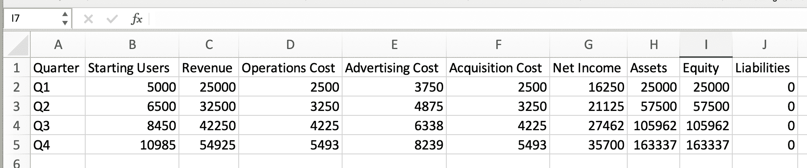

# 用于商业的人工智能

*"关键不在于想法，而在于实现想法。" - 斯科特·贝尔斯基*


现代商人 - 由 Midjourney AI 生成的图像

## 介绍由萨米开发的 FamilyGram 应用程序

萨米打算基于他已经创建的应用程序开展自己的业务。这款类似于 Instagram 的应用程序使用户可以拍照并与家人独家分享。它旨在通过与社交媒体平台保持分离为用户提供更高的隐私保护。该应用程序需要订阅费，但它保证父母和孩子他们的个人时刻将保持私密，并且只与他们亲近的人分享。他想将其命名为 FamilyGram。

现在应用程序已经开发并准备就绪，可以在 Android 和 iPhone 上运行，萨米不知道接下来该做什么，所以他问 ChatGPT 接下来的步骤是什么。

#### 提示 - 应用程序发布步骤：

```
Sami has developed an app called familygram. It runs on IOS and Android , what are the reccomended steps to launch this app as a viable profitable business
```

#### 输出 - 应用程序发布步骤

```
Launching an app as a viable and profitable business requires careful planning and execution. Here are some recommended steps that Sami can take to launch his app, Familygram:

Conduct market research: Sami needs to research the market to understand the competition, target audience, and potential demand for his app. This can be done through surveys, focus groups, and other market research methods. Develop a business plan: A business plan will help Sami define his goals, target audience, revenue model, and marketing strategies. It should also include financial projections, such as expected revenue and costs. Build a website and social media presence: Creating a website and social media profiles will help Sami promote his app and build a strong brand image. He can also use social media to engage with potential customers and gather feedback. Launch the app on app stores: Sami needs to list his app on the App Store and Google Play Store. This will require complying with their submission guidelines and paying any associated fees. Launch marketing campaigns: Sami needs to promote his app through digital marketing campaigns such as social media advertising, search engine optimization, and email marketing. He can also reach out to influencers or bloggers who specialize in family-related content. Continuously improve the app: Sami should gather feedback from customers and use it to improve the app's user experience. This can help attract new customers and retain existing ones. By following these steps, Sami can launch Familygram as a profitable business and grow it over time.
```

这需要考虑和做的事情很多，而萨米是一个优秀的编码人员，但在商业方面缺乏经验。ChatGPT 列出了以下步骤：

1.  进行市场调研

1.  制定商业计划

1.  建立网站和社交媒体存在

1.  在应用商店上发布应用程序

1.  推出营销活动

1.  持续改进应用程序。

是时候让萨米开始工作了，最好的方法是向 ChatGPT 寻求建议。

## 进行市场调研

在向 ChatGPT 提问时，最好将问题尽可能详细地提出，这样你就可以得到最适合你想要实现的答案。

让我们询问如何进行市场调研而不必花费很多钱。

#### 提示 - 市场调研：

```
I have developed an app   similar to Instagram, enables users to take photos and share them exclusively with family members. It is designed to provide greater privacy for its users by remaining separate from social media platforms. The app requires a subscription fee, but it guarantees parents and children that their personal moments will stay private and only shared with people close to them. He wants to call it FamilyGram. How do i conduct market research for my app familygram, that allows family to post private pictures and pay a fee for using the app. I have no budget and need a no cost or low cost method
```

#### 输出 - 市场调研

```
There are several ways to conduct market research for your app FamilyGram, even with a low or no budget. Here are some ideas:

Use social media: You can leverage social media to reach out to your target audience and conduct surveys or polls. You can post on Facebook groups, Twitter, or LinkedIn to ask questions about the types of features they would like to see in a family photo-sharing app, their willingness to pay a subscription fee, and their preferences for app design. Conduct customer interviews: You can reach out to friends, family members, and acquaintances who fit your target audience to conduct customer interviews. You can ask them questions about their photo-sharing habits, their opinions on existing photo-sharing apps, and their willingness to pay for a subscription-based app. Analyze competitor apps: Look at what other photo-sharing apps offer and read their reviews to understand what customers like and dislike about them. You can then use this information to develop features that will differentiate your app from the competition. Create a landing page: You can create a landing page for your app and use Google Analytics to track the number of visitors and the actions they take on the page. You can use this data to gauge interest in your app and understand which features are most appealing. Attend local events: You can attend local events such as family festivals or parenting workshops to conduct in-person surveys and get feedback from your target audience. Overall, it's important to be creative and resourceful when conducting market research with a limited budget. By leveraging free or low-cost tools, you can get valuable insights that will help you refine your app and make it more appealing to your target audience.
```

好的，这是一个很长的清单，但包含了很多有用的信息。让我要求一个待办事项摘要清单，这样我们就可以开始我们的市场调研之旅。

#### 提示 - 待办事项清单：

```
summarize in a todo list
```

#### 输出 - 待办事项清单

```
Sure! Here's a summary of the market research tasks you can do for FamilyGram, arranged in a to-do list format:

Use social media to conduct surveys or polls. Conduct customer interviews with friends, family members, and acquaintances who fit your target audience. Analyze competitor apps and their customer reviews. Create a landing page for your app and track visitors' actions using Google Analytics. Attend local events to conduct in-person surveys and get feedback from your target audience. Remember to keep track of your findings and use them to improve your app's features and design. Good luck with your market research!
```

萨米继续进行市场调研，并从他的目标受众那里得到了积极的反馈，他们都欣赏他的产品提供的隐私，并且开发者很容易就能接受任何建议或请求。

## 制定一个商业计划

萨米与潜在客户互动，并进行了所需的市场调研，更好地了解了他的应用程序以及人们在寻找什么。

现在他待办事项清单上的下一个任务是制定一个商业计划，问题是：萨米以前从未制定过商业计划。

再次，他请 AI 给他提出问题，以便他可以使他的商业计划更加有效和有用。

#### 提示 - 商业计划：

```
I have developed an app   similar to Instagram, enables users to take photos and share them exclusively with family members. It is designed to provide greater privacy for its users by remaining separate from social media platforms. The app requires a subscription fee, but it guarantees parents and children that their personal moments will stay private and only shared with people close to them. He wants to call it FamilyGram. I want to develop a busines plan, what questions do i need to answer to help build a good busines plan
```

#### 输出 - 商业计划

```
To develop a business plan for your app, here are some key questions that you should consider:

What is the market opportunity for FamilyGram? Who is your target audience, and what are their needs? What is the competitive landscape? Who are your competitors, and what are their strengths and weaknesses? What is your unique value proposition? What sets FamilyGram apart from other photo-sharing apps, and how does it solve your target audience's problems? What is your pricing strategy? How much will you charge for subscriptions, and how does this compare to other photo-sharing apps? What is your marketing strategy? How will you promote FamilyGram to your target audience, and what channels will you use to reach them? What is your sales strategy? How will you acquire new subscribers, and what will your customer acquisition cost be? What is your operational plan? How will you manage the day-to-day operations of the business, and what resources will you need? What is your financial plan? How much revenue do you project to generate, and what are your expenses? What are your key performance indicators (KPIs), and how will you measure success? What are the risks and challenges that you anticipate, and how will you mitigate them? By answering these questions, you can develop a comprehensive business plan that will guide your app's development, marketing, and growth.
```

现在萨米有了问题，而且他已经从市场调研中得到了许多答案，他可以回答这些问题，然后要求 ChatGPT 提供一个商业计划。

好的，现在萨米需要回答这些问题：

**你的目标受众是谁，他们的需求是什么？**

*目标受众需要良好的隐私保护和一个值得信赖的人，不会出售他们的私人照片。目标受众将是家庭和大家庭。*

**你的竞争对手是谁，你的应用程序的市场机会是什么？**

*竞争对手是 Instagram 和 Facebook，他们的弱点是隐私不能得到保证，第三方可以看到成员发布的帖子。FamilyGram 致力于隐私，并且只会存储和与预期受众分享图片，并使用高度安全的方法保证隐私。*

**你的独特价值主张是什么？**

*隐私，隐私，隐私，以及一个倾听并迅速采取客户建议行动的响应式开发人员。*

**你的定价策略是什么？**

*定价将为每年订阅 5 美元。这将用于使应用程序独立，无需向订阅者出售客户信息，也将用于维护运行所需的计算资源。*

**你的营销策略是什么？**

*营销策略将是推荐，如果有人被提及，他们将被通知加入，如果他们想分享。一旦我们发展壮大，还将有在线广告针对亲密的家庭和朋友。*

**你的销售策略是什么？**

*最初，将通过推荐获得客户，客户获取将通过口碑传播，后来将有现有客户的促销推荐，目标客户将获得 20%的折扣，推荐客户将获得 10%的奖金。*

**你的运营计划是什么，你将需要什么资源？**

*将有一个客户服务电子邮件和聊天机器人处理客户请求，并将外包。*

*将有一个开发团队负责维护和更新应用程序。*

*将有一个财务团队外包负责跟踪所有资金。*

**你的财务计划是什么，你的关键绩效指标是什么？**

*我们计划从头三个月开始有机增长，然后在选择的市场开始推广应用程序，然后依靠网络效应使软件传播。*

*我们的主要关键绩效指标是用户数量*

*用户收入*

*用户获取成本*

*支持和开发成本*

*杂项成本*

**你预期的风险和挑战是什么，你将如何减轻它们？**

*风险是软件不会像预期的那样传播，为了减轻这一风险，我们将努力进行更多的促销活动和功能来吸引用户。*

### 制定商业计划

回答了所有问题后，现在我们可以向 ChatGPT 提供我们的答案，并告诉它为我们提供一个商业计划。

由于我们向 ChatGPT 提供了所有问题的答案，这将是一个很长的提示

#### 提示 - 商业计划开发：

```
Develop a business plan for me defining  goals, target audience, revenue model, and marketing strategies. It should also include financial projections, such as expected revenue and costs

business plan can be built based on below information:

**Who is your target audience and what are their needs?**
_The target audience needs good privacy and someone trustworthy that will not sell their private photos. The target audience will be families and extended families. _

**Who are your competitors and what is the market opportunity for your app?**
_The competitor is instagram, and facebook, their weakness is that  privacy is not guaranteed and third parties can see posts that members post. FamilyGram is committed to privacy and will store and share pictures only with the intended audience and use highly secure methods to guarantee privacy._

**What is your unique value proposition?**
_Privacy, privacy, privacy, and a responsive developer who listens and acts fast on suggestions from is customers._

**What is your pricing strategy?**
_The pricing will be USD 5 per yearly subscription, and this will be used to make the app independent and not need to sell customer information to subscribers, it will also be used to maintain the computing resources needed to keep it running._

**What is your marketing strategy?**
_The marketing strategy will be referrals, and if someone is mentioned, they get notified to join in if they want to share. Once we grow, there will be online advertising also targeting close knit families and friends._

**What is your sales strategy?**
_Initially it will be by referrals, and customer acquisition will be by word of mouth, later there will be promotional referrals from existing customers , the target customer will receive a 20% discount, and the referring customer will get a 10% bonus ._

**What is your operational plan and what resources will you need?**
_There will be a customer service email and chatbot that will handle customer requests, and that will be outsourced._
_There will be a development team for maintaining and updating the app._
_There will be a finance team that will be outsourced for keeping track of all the money._

**What is your financial plan and what are your key performance indicators?**
_We plan organic growth to start with in the first 3 month, then start promoting the app in select markets, then rely on the network effect in having the software spread._

_Our main KPI is number of users _
_Users  Revenue_
_Users Acquisition cost_
_Support and Development Cost_
_Miscellaneous cost _

**What are the risks and challenges you anticipate and how will you mitigate them?**
_Risks are the software will not spread as predicted, to mitigate it, we will work on more promotions and features to attract users._
```

#### 输出 - 商业计划开发

```
Business Plan for FamilyGram

Executive Summary:
FamilyGram is a social media platform that prioritizes privacy, providing families with a secure way to share photos and communicate with each other. Our target audience is families and extended families who value privacy and trust. Our app will offer a yearly subscription plan of $5 to ensure that our users' private information is not sold to third-party organizations. Market Opportunity:
The market for social media platforms is vast, with billions of active users worldwide. However, there is a growing concern among users about privacy and data security. Our unique value proposition of ensuring privacy and responsiveness to customer feedback differentiates us from other social media platforms like Instagram and Facebook. Target Audience:
Our target audience is families and extended families. They need a social media platform that provides privacy and security, allowing them to share personal photos and communicate with each other. By providing a more secure and private platform, we aim to attract users who have concerns about their online privacy. Competitors:
Our primary competitors are Instagram and Facebook. While they offer social media platforms for users to share photos and communicate, privacy is not guaranteed. FamilyGram is committed to ensuring privacy and security, only sharing pictures with the intended audience, and using highly secure methods to guarantee privacy. Revenue Model:
FamilyGram will use a yearly subscription model of $5 per user. This subscription fee will be used to maintain the app's computing resources, ensure the app's independence, and ensure that users' private information is not sold to third-party organizations. Marketing Strategy:
Our marketing strategy will be based on referrals, where existing users will invite their family members to join. As the app grows, we will promote it in select markets and rely on the network effect to have the software spread. We will also use online advertising to target close-knit families and friends. Sales Strategy:
Initially, FamilyGram will acquire customers by word of mouth and referrals. To incentivize referrals, we will offer a 20% discount to the target customer and a 10% bonus to the referring customer. Operational Plan:
There will be a development team to maintain and update the app. We will also outsource the customer service email and chatbot to handle customer requests. A finance team will also be outsourced to keep track of all financial activities. Financial Plan:
Our primary financial goal is to achieve organic growth in the first three months of launch, followed by promoting the app in select markets. We will track our growth and revenue through several key performance indicators, including the number of users, revenue, user acquisition cost, support, and development cost, and miscellaneous cost. Risks and Challenges:
The primary risk is that the software may not spread as predicted. To mitigate this risk, we will work on more promotions and features to attract users. We will also prioritize customer feedback and respond promptly to their suggestions to ensure that our app remains competitive and meets users' needs. Conclusion:
FamilyGram aims to provide a social media platform that prioritizes privacy and security for families and extended families. By offering a more secure and private platform, we aim to attract users who have concerns about their online privacy. We believe that our unique value proposition, pricing strategy, and marketing approach will enable us to grow and succeed in the social media industry.
```

让我们也要求一些更详细的财务数据。

#### 提示 - 财务：

```
give me financials for the next 4 quarters, including a balance sheet, profit and loss, and cash flow. Make assumptions where needed and use industry figures when the information is not know
```

#### 输出 - 财务

```
I'm sorry, but it's not possible for me to generate specific financial projections without having detailed information about the business, including historical financial data and market analysis. Developing financial projections requires a thorough analysis of various factors such as the size of the target market, the competition, the pricing strategy, the marketing budget, the operational expenses, and many others.
```

随后是一些需要填写的空模板和表格。因此，我重新表述了具有数字预测的提示，特别是第一个提示响应中提到的要点。

#### 提示 - 具有数字假设的财务：

```
give me financials for the next 4 quarters, including a balance sheet, profit and loss, and cash flow. Make assumptions where needed and use industry figures when the information is not know
Assume $5 per user for an annual fee
Assume 30% growth per quarter. The first quarter will have 5000  users. Operations cost is 10% of revenue
Advertising is 15% of revenue
Acquistion cost is 10% of revenue
```

*结果是按季度综合的财务报表，包含所有细节，填满了几页。我将留给你作为一个练习来查看。*

*注意：有时 ChatGPT 在中途停止输出，只需在提示文本框中写“继续”。*

如果您不想深入了解业务计划部分，可以在这里停下，或者继续下面，我们请求资产负债表、利润和损失以及现金流量。

### 商业计划细节

或者，让我们将其分解成更小的部分，因此让我们修改提示如下

#### 提示 - 资产负债表：

```
Assume $5 per user for an annual fee
Assume 30% growth per quarter. The first quarter will have 5000  users. Operations cost is 10% of revenue
Advertising is 15% of revenue
Acquistion cost is 10% of revenue

I want a balance sheet for the next 4 quarters
```

#### 输出 - 资产负债表

```
Based on the given information, we can start by calculating the revenue and costs for each quarter, and then use those figures to construct a balance sheet. Quarter 1:

Starting Users: 5000
Annual Fee per User: $5
Revenue: 5000 * $5 = $25,000
Operations Cost: 10% of Revenue = $2,500
Advertising Cost: 15% of Revenue = $3,750
Acquisition Cost: 10% of Revenue = $2,500
Net Income: Revenue - Operations Cost - Advertising Cost - Acquisition Cost = $16,250
Using the 30% growth per quarter assumption, we can calculate the number of users for each subsequent quarter:

Quarter 2:

Starting Users: 5000 * 1.3 = 6,500
Annual Fee per User: $5
Revenue: 6,500 * $5 = $32,500
Operations Cost: 10% of Revenue = $3,250
Advertising Cost: 15% of Revenue = $4,875
Acquisition Cost: 10% of Revenue = $3,250
Net Income: Revenue - Operations Cost - Advertising Cost - Acquisition Cost = $21,125
Quarter 3:

Starting Users: 6,500 * 1.3 = 8,450
Annual Fee per User: $5
Revenue: 8,450 * $5 = $42,250
Operations Cost: 10% of Revenue = $4,225
Advertising Cost: 15% of Revenue = $6,338
Acquisition Cost: 10% of Revenue = $4,225
Net Income: Revenue - Operations Cost - Advertising Cost - Acquisition Cost = $27,462
Quarter 4:

Starting Users: 8,450 * 1.3 = 10,985
Annual Fee per User: $5
Revenue: 10,985 * $5 = $54,925
Operations Cost: 10% of Revenue = $5,493
Advertising Cost: 15% of Revenue = $8,239
Acquisition Cost: 10% of Revenue = $5,493
Net Income: Revenue - Operations Cost - Advertising Cost - Acquisition Cost = $35,700
Using these figures, we can construct a balance sheet for each quarter:

Quarter 1 Balance Sheet:

Assets		Liabilities & Equity	
$25,000	Equity	$25,000
Total	$25,000	Total	$25,000
Quarter 2 Balance Sheet:

Assets		Liabilities & Equity	
$57,500	Equity	$57,500
Total	$57,500	Total	$57,500
Quarter 3 Balance Sheet:

Assets		Liabilities & Equity	
$105,962	Equity	$105,962
Total	$105,962	Total	$105,962
Quarter 4 Balance Sheet:

Assets		Liabilities & Equity	
$163,337	Equity	$163,337
Total	$163,337	Total	$163,337
Note:

These balance sheets reflect the growth in assets (primarily cash from revenue) and equity (the owner's share of the business) over the four quarters, as well as the liabilities (none, in this case) that are owed by the business. It's worth noting that the assumptions made in this model may not reflect actual business performance. For example, 30% growth per quarter may be overly optimistic, while the percentages assigned to costs may not reflect real-world expenses. Additionally, the balance sheet does not account for additional factors such as taxes, interest on debt, or depreciation of assets. Nevertheless, this model can serve as a starting point for estimating the financial performance of a business over time.
```

#### 提示 - 网格形式的资产负债表：

```
summarize it in a grid form for all quarters combined
```

#### 输出 - 网格形式的资产负债表

```
Sure, here's a summary grid for all quarters combined:

Quarter	Starting Users	Revenue	Operations Cost	Advertising Cost	Acquisition Cost	Net Income	Assets	Equity	Liabilities
Q1	5,000	$25,000	$2,500	$3,750	$2,500	$16,250	$25,000	$25,000	$0
Q2	6,500	$32,500	$3,250	$4,875	$3,250	$21,125	$57,500	$57,500	$0
Q3	8,450	$42,250	$4,225	$6,338	$4,225	$27,462	$105,962	$105,962	$0
Q4	10,985	$54,925	$5,493	$8,239	$5,493	$35,700	$163,337	$163,337	$0
This table shows the key financial metrics for each quarter, as well as a running total for assets, equity, and liabilities. Note that there are no liabilities in this model, so the "Liabilities" column is always $0.
```

#### 提示 - CSV 摘要：

```
give me the summary in CSV so i can import it to excel
```

#### 输出 - CSV 摘要

```
Sure, here's the summary in CSV format:

Copy code
Quarter,Starting Users,Revenue,Operations Cost,Advertising Cost,Acquisition Cost,Net Income,Assets,Equity,Liabilities
Q1,5000,25000,2500,3750,2500,16250,25000,25000,0
Q2,6500,32500,3250,4875,3250,21125,57500,57500,0
Q3,8450,42250,4225,6338,4225,27462,105962,105962,0
Q4,10985,54925,5493,8239,5493,35700,163337,163337,0
You should be able to save this as a CSV file and then import it into Excel or any other spreadsheet software.
```

要进入 Excel，复制逗号分隔（或分隔）的数字，粘贴到文本文件中，保存该文本文件并命名为 balance.csv，然后获取您喜欢的电子表格并将该文件加载到您的电子表格中。

在 Excel 中，调整列宽后，应该看起来像这样：



在 MS Excel 中的显示方式

现在要求利润和损失

#### 提示 - 利润和损失：

```
give me the profit and loss for every quarter
```

#### 输出 - 利润和损失

```
Sure, here's the profit and loss for each quarter:

Quarter	Revenue	Operations Cost	Advertising Cost	Acquisition Cost	Net Income
Q1	$25,000	$2,500	$3,750	$2,500	$16,250
Q2	$32,500	$3,250	$4,875	$3,250	$21,125
Q3	$42,250	$4,225	$6,338	$4,225	$27,462
Q4	$54,925	$5,493	$8,239	$5,493	$35,700
This table shows the revenue, operations cost, advertising cost, acquisition cost, and net income for each quarter. Net income is calculated as revenue minus the total of operations cost, advertising cost, and acquisition cost.
```

还有现金流量

#### 提示 - 现金流量：

```
give me the cash flow for every quarter
```

#### 输出 - 现金流量：

```
Certainly! Here's the cash flow for each quarter:

Quarter	Cash Inflow	Cash Outflow	Net Cash Flow
Q1	$25,000	$8,750	$16,250
Q2	$32,500	$11,375	$21,125
Q3	$42,250	$14,788	$27,462
Q4	$54,925	$19,225	$35,700
This table shows the cash inflow (total revenue) and cash outflow (the sum of operations cost, advertising cost, and acquisition cost) for each quarter, as well as the resulting net cash flow. The net cash flow is calculated as cash inflow minus cash outflow.
```

## 建立网站和社交媒体存在

继续建立网站和社交媒体存在。

让我们向 ChatGPT 寻求建议。

#### 提示 - 社交媒体存在：

```
we need to Build a website and social media presence for our FamilyGram app, what is the best strategy moving forward
```

#### 输出 - 社交媒体存在

```
Building a website and establishing a social media presence are important steps in marketing a new product or service like FamilyGram. Here are some general strategies to consider when moving forward:

Define your target audience: Identify the ideal users of your app, and tailor your website and social media messaging to appeal to their interests and needs. Develop a content strategy: Plan the type of content you want to create and share on your website and social media channels. This could include blog posts, how-to guides, infographics, videos, and other content that is relevant to your target audience. Leverage SEO: Optimize your website content for search engines to increase visibility and attract more organic traffic. Use relevant keywords in your website copy and meta descriptions, and include alt tags for images. Establish a strong social media presence: Identify the social media channels where your target audience is most active, and create accounts on those platforms. Consistently post engaging content, interact with your followers, and use social media advertising to reach a wider audience. Encourage user-generated content: Encourage users of your app to share their experiences on social media by creating a branded hashtag and incentivizing them with rewards or recognition. Measure and optimize: Use analytics tools to track website and social media performance, and make data-driven decisions to improve your strategy. Test different types of content and posting schedules to see what resonates best with your audience. Remember that building a successful online presence takes time and effort, so it's important to be patient and persistent. By creating valuable content, engaging with your audience, and consistently measuring and optimizing your strategy, you can build a strong online presence for your FamilyGram app.
```

很多很好的建议，让我们以摘要的待办事项列表格式请求它

#### 提示 - 社交媒体存在待办事项：

```
give me these points in a one line each, summarized todo list format
```

#### 输出 - 社交媒体存在待办事项：

```
Sure! Here's a summarized todo list format:

Define target audience. Develop content strategy. Optimize website for SEO. Establish social media accounts. Post engaging content and interact with followers. Encourage user-generated content. Measure website and social media performance. Make data-driven decisions to optimize strategy.
```

如果有任何不清楚的地方，或者您需要更多细节，只需问 ChatGPT，它会给您正在寻找的答案。注意任何错误并要求 ChatGPT 更正。

## 在应用商店上发布应用程序

第一个问题，我们如何做到这一点？

#### 提示 - 应用程序启动：

```
how do i launch my app on the popular app stores
```

#### 输出 - 应用程序启动

```
To launch your app on the popular app stores, such as the Apple App Store and Google Play Store, you will need to follow the app store submission guidelines and process. Here are the general steps you'll need to take:

Create a developer account: Register as a developer on the app store you want to launch your app on. This usually involves providing some personal and company information and paying a one-time or yearly registration fee. Prepare your app for submission: Ensure your app meets the app store's guidelines for content, functionality, and user experience. This includes testing your app for bugs, optimizing its performance, and making sure it meets any necessary legal or technical requirements. Submit your app for review: Once your app is ready for submission, upload it to the app store and complete the submission form. The app store will then review your app to ensure it meets their guidelines and is safe for users. Wait for approval: The app store review process can take several days to several weeks, depending on the app store and the complexity of your app. During this time, you may need to provide additional information or address any issues the app store identifies. Launch your app: Once your app is approved, it will be available for download on the app store. Make sure to promote your app through marketing and advertising to reach your target audience and maximize downloads. Launching your app on the app stores can be a complex process, so it's important to thoroughly research the guidelines and requirements of each app store and carefully follow their submission process.
```

让我们请求有用的网页链接，以帮助我们在应用程序启动旅程中

#### 提示 - 应用程序启动的网页链接：

```
can you provide me with useful weblinks for helping me in launching my app ?
```

#### 输出 - 应用程序启动的网页链接

```
Sure, here are some useful web links that can help you with launching your app on popular app stores:

Apple App Store: https://developer.apple.com/app-store/
This link will take you to Apple's App Store developer page, where you can register as a developer, submit your app for review, and access resources to help you develop and market your app. Google Play Store: https://developer.android.com/distribute/play-console
This link will take you to the Google Play Console, where you can register as a developer, submit your app for review, and access resources to help you develop and market your app. App Store Review Guidelines: https://developer.apple.com/app-store/review/guidelines/
This link will take you to the App Store Review Guidelines for Apple, which provides detailed information about the criteria for app review and approval. Google Play Store Policies and Guidelines: https://play.google.com/about/developer-content-policy/
This link will take you to the Google Play Store Policies and Guidelines, which provides detailed information about the criteria for app review and approval. App Store Optimization (ASO): https://www.appannie.com/en/aso/
This link will take you to App Annie's App Store Optimization (ASO) guide, which provides tips and best practices for optimizing your app's visibility and downloads on the app stores. Mobile App Marketing: https://www.apptentive.com/blog/mobile-app-marketing/
This link will take you to Apptentive's mobile app marketing guide, which provides tips and best practices for promoting and advertising your app to your target audience. I hope these links are helpful for you!
```

始终检查链接，有些可能已过时。在这种情况下，Google Play 商店链接 Google Play 商店：https://developer.android.com/distribute/play-console 无效，请让 ChatGPT 更正。

#### 提示 - 链接无效：

```
Google Play Store: https://developer.android.com/distribute/play-console did not work
```

#### 输出 - 链接无效

```
I apologize for that. Here's the correct link to the Google Play Console:

https://play.google.com/apps/publish/

This link will take you to the Google Play Console, where you can register as a developer, submit your app for review, and access resources to help you develop and market your app. Again, I apologize for any confusion caused by the previous link.
```

好的，这个有效。现在进行下一步。

## 推出营销活动

好的，我们该怎么做？让我们问问 ChatGPT。

#### 提示 - 营销活动：

```
how do i Launch marketing campaigns for my familygram app ?
```

#### 输出 - 营销活动

```
To launch effective marketing campaigns for your FamilyGram app, you'll need to follow a strategic approach that reaches and resonates with your target audience. Here are some steps to consider:

Identify your target audience: Define your ideal customer personas by researching their demographics, interests, and pain points. This will help you create messaging that speaks directly to their needs. Set clear goals and metrics: Determine what you want to achieve with your marketing campaigns, such as increasing app downloads or user engagement. Set specific, measurable goals and metrics to track your progress and measure your success. Develop a messaging strategy: Create a messaging strategy that highlights your app's unique value proposition and resonates with your target audience. Focus on the benefits of using your app, not just its features. Choose the right marketing channels: Identify the marketing channels that your target audience uses most frequently, such as social media, search engines, or email marketing. Focus your efforts on the channels that are most likely to reach your target audience effectively. Create compelling content: Develop high-quality, engaging content that showcases the benefits of using your app. This can include blog posts, social media posts, video content, or email newsletters. Utilize paid advertising: Consider using paid advertising to increase your app's visibility and drive downloads. This can include pay-per-click (PPC) advertising, social media ads, or app install ads. Track your results: Monitor your campaigns' performance and track your progress towards your goals. Use analytics tools to identify which channels and campaigns are most effective and optimize your strategy accordingly. By following these steps, you can create a comprehensive marketing campaign that effectively promotes your FamilyGram app and drives user engagement and downloads.
```

这是一个非常长的答案，有点令人困惑，让我们请求一个更简单的版本。

#### 提示 - 摘要活动：

```
Can you summarize it as one line for each point, in a todo list format ?
```

#### 输出 - 摘要活动

```
Sure, here is a summarized to-do list for launching marketing campaigns for your FamilyGram app:

Identify your target audience. Set clear goals and metrics. Develop a messaging strategy. Choose the right marketing channels. Create compelling content. Utilize paid advertising. Track your results.
```

好的，好多了，我认为我们可以做到。

## 持续改进应用程序

最后一步是持续改进应用程序。让我们找出如何做到这一点。

#### 提示 - 应用程序改进：

```
how do i continuously improve my familygram app ?
```

#### 输出 - 应用程序改进

```
To continuously improve your FamilyGram app, you can follow these steps:

Gather user feedback: Regularly gather feedback from your app users to identify areas for improvement and gain insight into their needs and preferences. Conduct usability testing: Test your app's usability by asking users to perform specific tasks and observing their behavior to identify areas for improvement. Monitor analytics: Use analytics tools to track your app's performance, identify areas for improvement, and optimize your strategy based on user behavior and preferences. Release updates and new features: Regularly release updates and new features that address user feedback and improve your app's functionality. Stay up-to-date with technology: Keep up with the latest technological advancements and trends in mobile app development to ensure that your app remains relevant and competitive. Test and optimize: Continuously test and optimize your app's performance and user experience to ensure that it meets the needs of your users and exceeds their expectations. By following these steps, you can continuously improve your FamilyGram app and provide your users with the best possible experience.
```

这是一个很长的清单，而且很重要，但现在，您的业务只有您自己作为开发者，所以让我们优先考虑。

#### 提示 - 前三名：

```
what are the top 3 things that need to be done ?
```

#### 输出 - 前三名

```
Sure, here are the top 3 things that you can do to continuously improve your FamilyGram app:

Gather user feedback: Regularly gather feedback from your app users to identify areas for improvement and gain insight into their needs and preferences. Conduct usability testing: Test your app's usability by asking users to perform specific tasks and observing their behavior to identify areas for improvement. Release updates and new features: Regularly release updates and new features that address user feedback and improve your app's functionality. These three steps are essential to improving your app's performance, user experience, and overall success.
```

## 招聘

所有之前提到的这些活动可以由创始人（你）在业务规模较小时完成，但随着工作和承诺的增加，你需要考虑将其交给更专业的人员。

让我们问问 ChatGPT 它推荐什么

#### 提示 - 招聘：

```
as a one man show business, who do i recruit first and when to help grow my business ?
```

#### 输出 - 招聘：

```
As a one-person show business, recruiting the right talent at the right time can be crucial to your success. Here are a few suggestions on who to recruit and when to help grow your business:

Virtual assistant or administrative support: As your business grows, administrative tasks can become overwhelming. Hiring a virtual assistant or administrative support can help you streamline your processes and free up more time to focus on high-priority tasks. Marketing or social media specialist: A marketing or social media specialist can help you reach a wider audience and develop targeted campaigns that resonate with your target audience. Freelance developer or designer: If you're struggling to keep up with the demands of developing or designing your app, consider hiring a freelance developer or designer to help you complete your project on time and on budget. Part-time sales or customer support representative: As your business grows, it's important to provide high-quality customer service and support. Hiring a part-time sales or customer support representative can help you manage customer inquiries and improve your overall customer experience. When it comes to recruiting, the timing and order of hiring will depend on your business needs and priorities. However, it's important to remember that recruiting too early or too late can be detrimental to your business's growth. Consider your current workload, revenue, and priorities when making recruiting decisions.
```

## 结论

你拥有构建应用业务或任何其他类型业务的所有知识、结构和信息，你也知道在业务发展过程中向 ChatGPT 提出正确提示的方法。

*"成功的秘诀在于开始行动。" - 马克·吐温*
