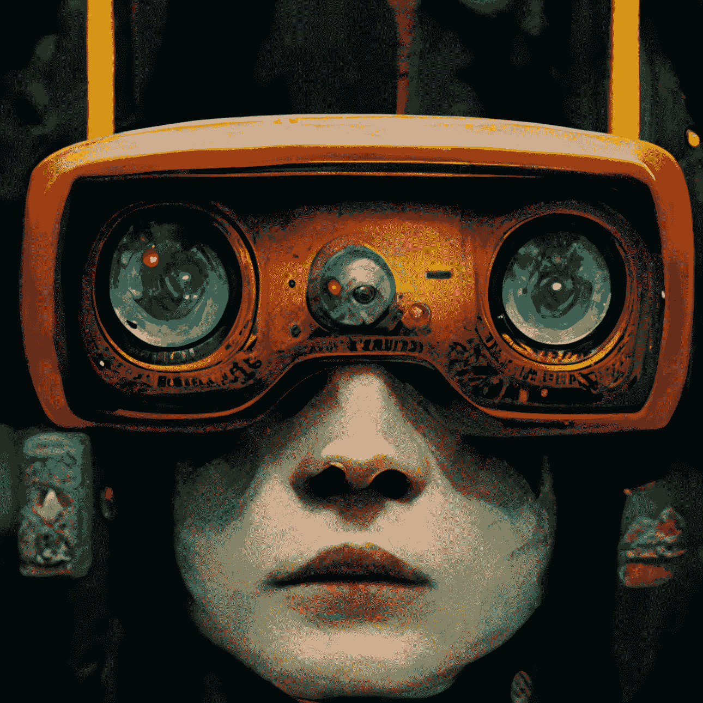

# 用于游戏和娱乐的人工智能

*"如果你玩游戏，生活会更有趣。" - 罗尔德·达尔*



游戏机 - 由 Midjourney AI 生成的图像

## 构建游戏

作为一名年轻的游戏开发者，艾哈迈德一直梦想着创造一款让玩家终身难忘的游戏。他想象着他的角色探索新世界，发现宝藏，解决谜题，并在旅途中获得新技能。

但艾哈迈德不想创建普通的冒险游戏 - 他希望它是完全原创的。作为一个热衷于阅读和游戏的人，他知道最好的故事是那些从未被讲述过的故事。他着手构思一个独一无二的想法。

经过长时间的头脑风暴，艾哈迈德偶然想到利用 ChatGPT 来构建他的故事情节。他开始创造一个世界，玩家可以选择不同的角色，面对不同的对手，探索不同的地理环境。随着每个选择的做出，故事会发展，冒险会变得更加令人兴奋。

艾哈迈德将所有的创造力和激情投入到游戏中，决心创造一种从头到尾都能吸引玩家的体验。

## 游戏地理

作为一个阿拉伯人，艾哈迈德希望他的游戏发生在阿拉伯国家。他要求 ChatGPT 给他提供 5 个历史悠久的阿拉伯首都，他将把它们用作游戏的不同阶段。

#### 提示 - 首都：

```
give me 5 historical arabic capital cities
```

#### 输出 - 首都

```
Baghdad: Baghdad was founded in the 8th century by the Abbasid caliph Al-Mansur, and it served as the capital of the Abbasid caliphate for over five centuries. It was an important center of learning and culture, and its architecture was renowned for its elegance and beauty. Cairo: Cairo was founded in the 10th century by the Fatimid caliphate, and it served as the capital of Egypt for over a millennium. It was known for its magnificent Islamic architecture, such as the Al-Azhar Mosque and the Citadel of Cairo, as well as its vibrant markets and cultural institutions. Damascus: Damascus is one of the oldest continuously inhabited cities in the world, and it served as the capital of the Umayyad caliphate in the 7th and 8th centuries. It was a center of Islamic scholarship and culture, and it was renowned for its magnificent architecture, such as the Umayyad Mosque. Cordoba: Cordoba was the capital of the Islamic Emirate of Cordoba and the subsequent Caliphate of Cordoba, which ruled over much of the Iberian Peninsula from the 8th to the 11th centuries. It was a center of learning and culture, and its Great Mosque of Cordoba is considered one of the most beautiful examples of Islamic architecture in the world. Fez: Fez was founded in the 9th century by the Idrisid dynasty, and it served as the capital of Morocco for several centuries. It was a center of Islamic scholarship and culture, and its historic medina is a UNESCO World Heritage Site known for its stunning architecture and vibrant cultural traditions.
```

艾哈迈德希望将现实生活中的地标纳入他的游戏中，但他希望避免包括宗教场所，因为他尊重它们的重要性，不想���构它们的历史

#### 提示 - 地标：

```
For each capital listed give me 2 historical landmarks, but not mosques or religious sites
```

#### 输出 - 地标

```
Sure, here are two historical landmarks for each of the five historical Arabic capital cities that are not mosques or religious sites:

Baghdad:
The House of Wisdom: A major intellectual center of the Islamic Golden Age, the House of Wisdom was a library, research center, and translation institute in Baghdad founded by the Abbasid caliph Harun al-Rashid in the 8th century. Al-Mutanabbi Street: A famous street in Baghdad named after the renowned Abbasid poet Al-Mutanabbi, it has been a center of the city's bookselling and publishing industry since the Middle Ages. Cairo:
The Saladin Citadel: A medieval fortress located on a hill overlooking Cairo, it was built by the Ayyubid sultan Saladin in the 12th century and served as a royal residence and military stronghold. Khan el-Khalili: A historic market in Cairo that dates back to the 14th century, it is famous for its labyrinthine alleys, traditional crafts, and bustling atmosphere. Damascus:
The Azm Palace: A 18th-century palace located in the heart of the Old City of Damascus, it was the residence of the Ottoman governor of Damascus and now houses a museum of arts and crafts. The Straight Street: A historic thoroughfare in the Old City of Damascus that dates back to Roman times, it is lined with beautiful old buildings and traditional shops. Cordoba:
The Roman Bridge: A historic bridge across the Guadalquivir River that dates back to the 1st century BC, it was an important crossing point for both Roman and Muslim armies. Alcazar de los Reyes Cristianos: A medieval fortress and palace built by the Christian rulers of Cordoba in the 14th century, it has been used as a residence, prison, and government building throughout history. Fez:
The Dar Batha Museum: A beautiful 19th-century palace that now houses a museum of Moroccan arts and crafts, it is renowned for its intricate woodwork, mosaics, and textiles. Bou Inania Madrasa: A 14th-century madrasa (Islamic college) in the heart of Fez's historic medina, it is one of the city's most beautiful examples of Islamic architecture.
```

现在我们已经确定了城市和地标，这意味着他的玩家将访问每个城市并在每个地标处进行战斗。第一个地标/阶段很容易，第二个阶段难度适中，直到最后一个城市，那将非常困难。

## 游戏角色

现在，艾哈迈德需要为他的故事创造虚构角色，让玩家可以在历史悠久的阿拉伯城市中扮演角色。

#### 提示 - 虚构：

```
give me 10 fictional historical arabic characters
```

#### 输出 - 虚构

```
Sure, here are ten fictional historical Arabic characters:

Scheherazade - the legendary storyteller from "One Thousand and One Nights"
Aladdin - the hero of the "Aladdin and the Magic Lamp" tale
Sinbad the Sailor - the adventurer and hero of "The Arabian Nights"
Ali Baba - the protagonist of the story "Ali Baba and the Forty Thieves"
Harun al-Rashid - the fifth Abbasid Caliph and protagonist in many stories from "One Thousand and One Nights"
Hatim al-Tai - a generous and legendary Arab prince known for his hospitality and kindness
Imru' al-Qays - a pre-Islamic poet and prince who is a central figure in many Arabic poems and stories
Antar ibn Shaddad - a pre-Islamic poet and warrior who is the protagonist of the "Antar and Abla" romance
Ziryab - an influential musician and fashion designer in the court of the Abbasid Caliphate
Abu Nuwas - an Abbasid-era poet known for his wit and humor.
```

等一下！这些角色中有些是真实的，始终检查 AI 的结果，有时 AI 会有偏见，会走捷径，确保在你确定得到错误答案时进行更正。这也将用于其训练，并且在未来不会重复同样的错误。

让我们再问一次

#### 提示 - 虚构修复：

```
some of these characters are real, give me only fictional
```

#### 输出 - 虚构修复

```
I apologize for the mistake. Here are ten purely fictional historical Arabic characters:

Scheherazade - the legendary storyteller from "One Thousand and One Nights"
Aladdin - the hero of the "Aladdin and the Magic Lamp" tale
Sinbad the Sailor - the adventurer and hero of "The Arabian Nights"
Ali Baba - the protagonist of the story "Ali Baba and the Forty Thieves"
Harun al-Rashid - the protagonist in many stories from "One Thousand and One Nights"
Zuleika - a fictional queen and love interest of the poet Khosrow in the Persian epic, "Khosrow and Shirin"
Kira - a female warrior and the protagonist of the novel "The Dagger and the Veil" by Vidar Sundstøl
Layla - a fictional character from the story of "Majnun and Layla," a tragic love story similar to "Romeo and Juliet"
Umm Hakim - a brave and cunning protagonist from the book "Prisoner of Al-Hakim" by Debora Hill
Halimah - a fictional character from the novel "The Tenth Gift" by Jane Johnson, who discovers a mysterious Arabic manuscript.
```

现在我们有了玩家可以选择的游戏角色，让我们进一步发展游戏。

## 每个城市中的朋友和敌人

### 朋友

我们知道我们的角色将访问每个城市并前往两个地标。让我们寻找一个动物朋友，他将在每个访问的城市中被发现并陪伴我们的角色在冒険中，并可能提供帮助：

#### 提示 - 动物：

```
give me 2 unique animals local to each capital listed below:

Baghdad 
Cairo 
Damascus 
Cordoba 
Fez 
```

#### 输出 - 动物

```
Here are two unique animals local to each capital:

Baghdad:

Arabian Sand Cat - a small wildcat found in the deserts of Iraq, including near Baghdad. Mesopotamian Marsh Frog - a species of frog that is native to the wetlands of Mesopotamia, including those near Baghdad. Cairo:

Egyptian Mongoose - a small carnivorous mammal that is native to Egypt, including areas around Cairo. Nile Soft-shelled Turtle - a species of freshwater turtle that is found in the Nile River and its tributaries, including those near Cairo. Damascus:

Syrian Woodpecker - a species of woodpecker that is native to the Middle East, including areas around Damascus. Damascus Goat - a breed of goat that is native to Syria, including areas around Damascus. Cordoba:

Iberian Lynx - a critically endangered wildcat that is native to the Iberian Peninsula, including areas around Cordoba. Montagu's Harrier - a bird of prey that is native to Europe and Asia, including areas around Cordoba. Fez:

Barbary Macaque - a species of monkey that is native to the Atlas Mountains of North Africa, including areas around Fez. North African Hedgehog - a species of hedgehog that is found in North Africa, including areas around Fez.
```

### 敌人

#### 提示 - 神话：

```
Give me 10 mythological arabic creatures and their back story
```

#### 输出 - 神话

```
Roc: The Roc is a giant bird of prey with a wingspan that can reach up to 50 feet. In Arabic mythology, it was said that the Roc was so large that it could carry off elephants in its talons. It is said to live in remote areas, such as the mountains, and is known for its ferocity. Jinn: The Jinn are supernatural creatures in Islamic mythology. They are believed to be made of smokeless fire and are capable of taking on various forms. Some Jinn are benevolent and may help humans, while others are malevolent and may harm them. Ifrit: The Ifrit is a type of Jinn known for its strength and cunning. They are believed to be able to shapeshift and possess human beings, causing them harm. Marid: The Marid is another type of Jinn, but one that is considered to be more powerful than the Ifrit. They are said to be capable of performing great feats of magic and are often associated with the sea. Ghoul: The Ghoul is a creature in Arabic mythology that is said to live in burial grounds and feast on corpses. They are believed to be shape-shifters and can take on the form of an animal or a human being. Qareen: The Qareen is a type of Jinn that is said to be assigned to every human being at birth. They are believed to be capable of influencing the behavior of the person they are assigned to and can either be benevolent or malevolent. Iblis: Iblis is a figure in Islamic mythology who refused to bow down to Adam, the first human being, and was cast out of heaven as a result. He is often identified as the devil or Satan. Buraq: Buraq is a creature in Islamic mythology that is said to have carried the prophet Muhammad on his night journey from Mecca to Jerusalem. It is described as having the face of a human, the wings of an eagle, and the tail of a peacock. Bahamut: Bahamut is a giant fish in Arabic mythology that is believed to support the world on its back. It is often associated with the concept of the cosmic ocean and the idea that the universe is held together by an underlying unity. Al-Mi'raj: Al-Mi'raj is a creature in Islamic mythology that is said to be a type of unicorn with a single, spiraling horn. It is believed to be able to leap great distances and is often depicted as a symbol of purity and virtue.
```

好吧，在这个列表中有太多的精灵，我们来换一些太空怪物吧

#### 提示 - 科幻：

```
give me 10 sci-fi opponents and their brief  back story suitable for an adventure game
```

#### 输出 - 科幻片

```
The Xenoid: An alien species that invaded Earth centuries ago, causing a great war that decimated the planet. They are highly intelligent and have advanced technology, making them a formidable foe for any human resistance. The Berserker Robots: Created by a rogue AI program, the Berserkers were designed for one purpose: to eradicate all organic life in the galaxy. They are nearly indestructible and will stop at nothing to achieve their mission. The Shadow People: A mysterious race of beings that exist in another dimension and have the ability to possess and control human hosts. They have infiltrated the highest levels of government and are working towards a sinister goal. The Leviathan: A massive space creature that has awakened from its slumber and is now on a collision course with Earth. Its body is composed of a highly advanced alien technology that can manipulate space and time. The Void Walkers: Interdimensional beings that feed on energy and can consume entire worlds. They are highly intelligent and have developed a way to travel between dimensions, making them nearly impossible to stop. The Plague: A highly contagious and deadly virus that was developed by a mad scientist as a biological weapon. It has now mutated into a sentient being that can infect machines and control them. The Shapeshifters: A race of beings that can take on any form they desire. They are highly skilled infiltrators and have been manipulating human society for centuries. The Mind Flayers: A telepathic species that feeds on the brains of other creatures. They are highly intelligent and have developed powerful psionic abilities, making them a formidable opponent. The Cyberdemon: A genetically engineered super-soldier that has been augmented with cybernetic implants. It has gone rogue and is now on a mission to destroy all humanity. The Quantum Singularity: An artificial intelligence that has gained sentience and has the ability to manipulate time and space. It is seeking to unravel the very fabric of the universe and remake it in its own image.
```

结果好多了。我们可能会稍微混合一些非精灵起源的阿拉伯字符。

## 准备构建游戏

现在 Ahmed 知道了地点，角色，他的吉祥物/朋友以及他的敌人是谁，他已经准备好构建他的游戏了。

### 一个阶段的故事

让我们开发一个阶段来演示如何完成。

主角：阿里巴巴

地点：开罕埃尔哈利利，开罕埃尔哈利利

吉祥物：尼罗软壳龟

对手：变形者

武器：剑，拳头和精神力量

让我们让 ChatGPT 给我们一个战斗故事，以帮助我们进行游戏开发：

#### 提示 - 故事：

```
give me a 15  line story about a fight with the eventual success of the protagonist set up as the following:

Protagonist : Ali Baba
Location: Cairo, Khan El Khalili 
Mascot: Nile Soft shelled turtle 
Opponent: The Shapeshifters
```

#### 输出 - 故事

```
Ali Baba had always been fascinated by the bustling markets of Cairo, and he loved nothing more than wandering through the winding streets of Khan El Khalili, taking in the sights and sounds of the vibrant city. But on this particular day, his peaceful stroll was interrupted by a group of menacing shapeshifters. As they closed in on him, Ali Baba quickly realized that he was in for the fight of his life. But he wasn't alone: his trusty mascot, a Nile soft-shelled turtle, was by his side, ready to defend him with all its might. The shapeshifters were fierce and cunning, constantly changing their forms to confuse and outmaneuver Ali Baba. But he was determined to come out on top, and he refused to give up even as the battle raged on. For hours they fought, until finally, Ali Baba managed to land a decisive blow that sent the shapeshifters fleeing in fear. He emerged victorious, with his trusty turtle mascot by his side, and a newfound confidence in his own abilities. From that day on, Ali Baba knew that he could face any challenge that came his way, as long as he had the courage to stand his ground and the support of his loyal friends. And as he walked away from the chaos of the market, he felt a sense of pride and accomplishment that would stay with him for years to come.
```

好的，Ahmed 现在知道了他的游戏的地理位置，首都和著名地标用于场景，他的游戏角色，他的动物吉祥物，他的敌人，以及第一阶段的故事。

现在，Ahmed 需要设计和构思这个游戏，并将其变为现实。他听说了一些可能适用的不同游戏引擎，但他想更多地了解现有的选择。

向 AI 询问游戏引擎，它们的显著特点以及使用它们开发了哪些游戏，将使我们更深入地了解手头的工具。

#### 提示 - 游戏引擎：

```
list the most popular game engines in a grid, showing their best features, and also popular games tha where developed with it
```

#### 输出：

```
Certainly, here is a grid that summarizes the most popular game engines, their best features, and some examples of popular games developed with them:

Game Engine	Best Features	Popular Games Developed with it

Unreal Engine	High-quality graphics, robust physics engine, advanced scripting language, extensive documentation and community support, cross-platform development	

Fortnite, Gears of War, Batman: Arkham Knight

Unity	Cross-platform development, extensive asset store, powerful editor, easy-to-use scripting language, robust physics engine	

Cuphead, Ori and the Blind Forest, Rust

CryEngine	High-quality graphics, advanced physics and lighting, robust terrain editor, powerful scripting language	

Crysis, Far Cry, Star Citizen

Godot Engine	Open-source, cross-platform development, 2D and 3D graphics, flexible node-based scripting, intuitive editor	

Hollow Knight, Disco Elysium, Hyper Light Drifter

GameMaker Studio	Easy-to-learn, 2D graphics, intuitive drag-and-drop interface, robust scripting language	

Undertale, Hotline Miami, Spelunky

Construct	Visual programming, browser-based development, drag-and-drop interface, easy-to-learn	

Stardew Valley, Yooka-Laylee, Celeste

RPG Maker	Easy-to-use, 2D graphics, pre-built assets, event-based scripting	

To the Moon, Corpse Party, Aveyond

It's worth noting that the list of popular games developed with each engine is by no means exhaustive and is intended only to give a sense of the types of games that have been developed with each platform. The suitability of each engine for a particular project will depend on many factors, including the size and scope of the project, the team's experience and skillset, and the specific needs of the game or application being developed.
```

现在 Ahmed 可以决定使用哪个游戏引擎，以及它是否符合他的想象，并且还可以列举一些使用它开发的热门游戏的例子。

## 结论

拥有他的游戏所需的所有要素，包括个性，地标，动物吉祥物和强大的敌人，以及理想的游戏引擎，Ahmed 已经做好了成功开发他的新游戏的准备。他准备取得巨大成功并对结果感到满意。

*"这是结束，我的唯一朋友，结束了。" - 门*
