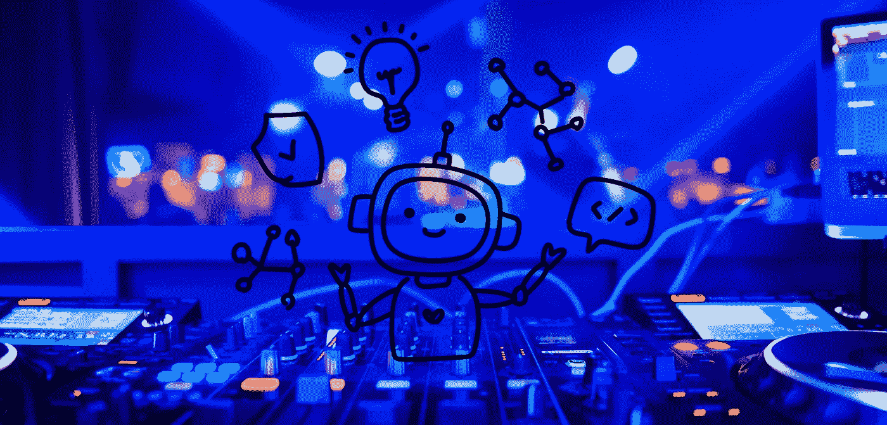

## 第一章：理解基础知识

什么是 ChatGPT？

在人工智能与人类对话相遇的数字织锦中，ChatGPT 作为一个突出的线索闪耀着，将潜力和创新编织在一起。但在我们深入探讨其深远的能力和应用之前，让我们先定义一下 ChatGPT。

ChatGPT 是由 OpenAI 开发的一个对话式人工智能模型。它属于 GPT（生成式预训练变换）家族，以根据接收到的输入生成类似人类文本而闻名。

随着时间的推移，GPT 已经有许多版本，其中 GPT-3 和 GPT-4 是当下最显著的表现。每一个版本都比以前更加流畅和先进。

这就像是看着你最喜爱的系列节目每一季都变得更好一样！

ChatGPT 的神奇之处在于它的训练。它已经被输入了大量的文本数据，使它能够以一种与人类相似的方式理解和生成语言。但它不仅仅是机械地重复信息。ChatGPT 能够理解上下文，回答查询，开发内容，甚至进行详细而动态的对话。

有几个方面使 ChatGPT 与以往的聊天机器人技术不同：知识的深度：凭借其广泛的训练数据，ChatGPT 拥有涵盖许多主题的广泛知识库。

适应性：与僵化的、基于规则的聊天机器人不同，ChatGPT 可以适应对话的细微差别，使交互更加流畅。

上下文理解：ChatGPT 能够理解并记住对话中的上下文，从而更加连贯和有意义地进行交流。

生成能力：ChatGPT 不是从预定义的回答中选择，而是可以生成答案，使每次交互都独一无二。

本质上，ChatGPT 代表了对话式人工智能的一次范式转变。它不仅仅是一个工具；它是人工智能在弥合人与机器沟通差距方面所取得的进展的一个证明。当我们探索其应用和潜力时，您会看到为什么 ChatGPT 不仅仅是一个聊天机器人——它是数字对话的未来。

开放人工智能和对话式人工智能模型的崛起在技术演进的编年史中，偶尔会出现一个实体，这个实体不仅促进了进步，而且塑造了其领域的轨迹。在人工智能领域，这个实体就是 OpenAI。

OpenAI 的创世记：

OpenAI 成立于 2015 年 12 月，起初只有一个愿景：确保通用人工智能（AGI）造福于全人类。OpenAI 的动机并非利润，而是优先考虑以安全和有益于社会的方式创造和分发人工智能。

从愿景到影响：

多年来，OpenAI 凭借开创性的项目和模型脱颖而出。虽然它的贡献跨越了各种人工智能领域，但其最为引人注目的成就无疑是在自然语言处理（NLP）领域。

对话式人工智能占据中心舞台：

在 2010 年代初出现的聊天机器人和虚拟助手标志着对话型人工智能引起了越来越多的关注。尽管创新，这些早期模型往往基于规则、范围有限，对细微的人类互动不够敏感。OpenAI 看到了革新这一领域的机会。

GPT（生成式预训练变换器）及其后续迭代的出现。这些模型，主要是从 GPT-2 开始，既具有反应性又具有生成性。它们能够制作回复、生成叙述，以及以令人惊讶的准确度模仿类似人类的对话。随着每个版本的更新，从 GPT-2 到 GPT-3 以及更高版本，这些模型理解、生成和参与的能力不断加深，标志着对话型人工智能方面的重大里程碑。

ChatGPT 与未来：

ChatGPT 基于 GPT 架构，体现了 OpenAI 致力于改进对话型人工智能的承诺。它能够进行动态对话、回答各种查询，甚至展现创造性天赋，展示了这些模型的巨大潜力。

变革的催化剂：

OpenAI 的贡献不仅仅推动了技术的发展；它们改变了行业。商业、教育工作者、开发人员和创意人士发现了这些模型的无数应用，从客户支持到内容创作、辅导和游戏等领域。

结论：

OpenAI 及其对话型人工智能模型的崛起证明了愿景与创新相结合的变革力量。我们正站在人工智能与人类协作不仅可能而且即将到来的时代的风口上，OpenAI 等实体为我们铺平道路，确保未来在技术上先进、在伦理上受到引导、在普遍上受益。
