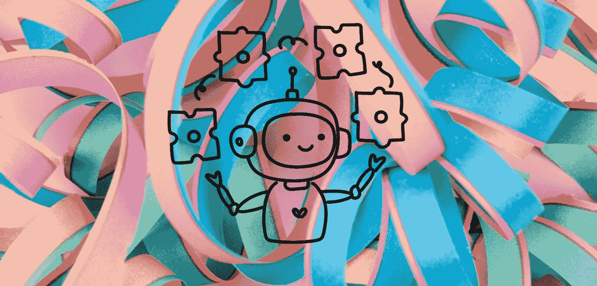

## 第五章：赚钱模式

借助 ChatGPT 强大的能力和集成潜力，可以采用各种赚钱模式来实现收入。随着数字时代的扩展和用户期望的演变，ChatGPT 可以创新地驱动收入。本章提供了您可以利用的不同策略以赚取 ChatGPT 集成的深入了解。

1\. 赚钱介绍：

+   为什么要赚钱 ChatGPT？在现代数字经济中，对话式人工智能的潜力。

+   需要考虑的因素：在选择赚钱策略之前，了解用户价值、平台动态和市场需求。

2\. 直接销售与服务：

+   聊天机器人即服务（CaaS）：为企业提供定制的 ChatGPT 解决方案，用于客户服务、销售或技术支持。

+   培训和咨询：提供有关业务集成和优化 ChatGPT 的课程、网络研讨会或咨询服务。

3\. 订阅模式：

+   免费付费模式：免费提供基本的 ChatGPT 服务，高级功能或高级功能在付费墙后。 

+   月度/年度订阅：为订阅者提供持续更新、支持和高级功能。

4\. 联盟营销：

+   产品推荐：使用 ChatGPT 推荐产品，并通过推荐链接的销售赚取佣金。

+   服务推荐：将用户推荐到服务（如托管、课程或软件）并赚取会员收入。

5\. 广告：

+   广告整合：在聊天界面内或互动过程中显示广告。

+   赞助内容：通过 ChatGPT 直接推广产品、服务或内容。

对话。

6\. 许可和转售：

+   平台许可：允许其他企业或开发人员以许可费用使用您定制的 ChatGPT 解决方案。

+   白标解决方案：创建通用的 ChatGPT 集成，其他企业可以作为自己的品牌使用。

7\.数据分析和见解：

+   市场调研：使用 ChatGPT 收集用户意见、偏好和反馈，并将这些见解出售给企业或营销人员。

+   趋势分析：根据用户互动识别市场趋势，并为一定费用提供报告或见解。

8\. 捐赠和众筹：

+   社区支持：如果您的 ChatGPT 工具或平台为社区提供了重要价值，请考虑寻求捐赠以支持开发。

+   项目众筹：像 Kickstarter 或 Indiegogo 这样的平台可以用于为雄心勃勃的项目筹集资金。

9\. 电子商务和销售辅助：

+   购物助手：ChatGPT 可以指导用户选择产品，推广销售，并增加交叉销售，从而推动更高的销售额。

+   结账协助：通过协助用户结账，解答问题，并提供折扣或激励措施，减少购物车的弃置。

10\. 高级支持和维护：

+   支持计划：为使用 ChatGPT 的企业提供高级支持、故障排除和维护服务。

+   定制和更新：根据个人业务需求收费进行定制集成、更新或功能。

11\. 与付费平台集成：

+   电子学习平台：将 ChatGPT 整合为付费课程或平台上的导师或助手。

+   游戏平台：将 ChatGPT 作为游戏角色、指南或用户支付以访问或增强的功能。

12\. 合作与伙伴关系：

+   技术合作伙伴关系：与科技公司或初创公司合作，以提供 ChatGPT 解决方案，换取收入份额或费用。

+   品牌合作：与品牌合作，为他们的受众提供独特的 ChatGPT

经验、促销或互动。

总结：

ChatGPT 的变现提供了许多途径，每种途径都具有其独特的潜力和挑战。关键在于了解您的受众、您提供的价值以及如何最好地以可持续和盈利的方式提供该价值。随着人工智能行业的发展，保持在变现策略上的灵活性和创新性将确保持续增长和成功。

直接变现 vs. 间接变现

在数字产品和服务中，特别是在利用像 ChatGPT 这样的尖端技术时，理解直接和间接变现之间的细微差别至关重要。这两种模式都有其优点，并可以根据您的产品性质、目标受众和长期目标进行战略性应用。以下是对这两种方法的深入了解：

直接变现：

定义：直接变现涉及直接从最终用户或客户那里产生收入。

这是一种简单的交易，用户支付所接收的产品、服务或功能。

例子：

1\. 付费下载：用户支付一次性费用以访问或下载您的 ChatGPT 应用程序。

2\. 订阅模式：用户定期支付（每月、每年）以访问 ChatGPT。

服务或工具。

3\. 许可：企业或个人支付使用您的 ChatGPT 软件或平台的权利。

4\. 服务费：为特定服务收费，如定制 ChatGPT 培训、集成或咨询。

优势：

+   可预测的收入：特别是在订阅模式下，更容易预测收入。

+   直接投资回报率：您可以根据用户获取和销售来轻松衡量投资回报率。

+   简化指标：用户价值直接与其财务贡献挂钩。

挑战：

+   进入壁垒：向用户收费可能会阻止一些潜在用户或客户，特别是在存在竞争的情况下。

+   期望增加：当用户付费时，他们期望更高质量、即时支持和持续更新。

间接变现：

定义：间接变现不涉及直接向用户收费。相反，收入是通过辅助渠道产生的，通常基于用户为次要利益相关者带来的价值或通过互补提供而产生。

例子：

1\. 广告：通过向 ChatGPT 用户展示广告来产生收入。

2\. 联盟营销：通过引荐用户购买产品或服务来赚取佣金。

3\. 数据变现：从用户互动中出售洞察、分析或市场研究。

4\. 赞助内容：品牌支付费用，通过您的 ChatGPT 平台传递其内容或促销活动。

优势：

+   降低用户摩擦：如果产品是免费的或不涉及直接付款，用户更有可能尝试或采用您的产品。

+   更广泛的采用：这可以实现更大的用户群，这可能有利于依赖网络效应或社区贡献的平台。

+   多样化的收入来源：可以同时采用多种间接变现策略，使收入来源多样化。

挑战：

+   变化的收入：收入可能需要更加稳定，特别是如果依赖于波动的广告费率等因素。

+   用户体验问题：广告或赞助内容如果没有谨慎实施可能会影响用户体验。

+   价值主张：说服利益相关者您的用户群或数据的价值可能具有挑战性。

结论：

在直接和间接变现之间做出选择，甚至结合两者，应该是基于您的 ChatGPT 集成的性质、目标受众和业务目标的战略决策。无论您选择哪条路线，请确保它与您的品牌价值观和您向用户提供的承诺保持一致。

订阅模式、联盟营销和 AI 咨询在考虑如何变现您的 ChatGPT 工具或任何 AI 驱动平台时，深入研究提供稳定收入流的方法，并与您的业务核心竞争力和价值主张保持一致至关重要。在众多可用的多样化变现策略中，订阅模式、联盟营销和 AI 咨询被视为独特、强大且常常互补的方法。以下是更详细的介绍：订阅模式：定义：订阅模式涉及用户定期支付费用，通常是每月或每年，以访问您的服务、工具或内容。

与 ChatGPT 的配合方式：

+   提供基本功能免费（免费增值）并收费高级功能或高级功能。

+   向企业收费，提供适用于客户支持、销售援助或其他定制功能的 ChatGPT 解决方案。

优势：

+   可预测的收入：定期付款意味着更一致的收入和更容易的财务预测。

+   客户保留：订阅模式促进与用户之间更长期的关系。

+   持续改进：定期从订阅者那里获得反馈可以指导改进和功能添加。

挑战：

+   保留努力：确保为订阅者持续提供价值对于减少流失至关重要。

+   市场饱和：订阅模式普遍存在，区分至关重要。

1\. 联盟营销：

定义：联盟营销涉及推广他人的产品或服务，并为通过您的推荐进行的每次销售或行动赚取佣金。

与 ChatGPT 的配合方式：

+   在用户互动过程中使用 ChatGPT 来上下文推荐产品或服务。

+   通过 ChatGPT 提供评论、比较或建议，并在这些互动中嵌入联盟链接。

优势：

+   passve Income: 联盟营销可以提供稳定的收入流，几乎不需要干预。

+   可扩展性：用户越多，联盟收入的潜力就越大，而且没有显著增加的成本。

+   用户价值：如果做得好，产品推荐可以通过提供相关建议来增强用户体验。

挑战：

+   可信度：如果推荐不够有帮助，过分强调销售可能会破坏用户信任。

+   依赖性：收入取决于第三方联盟计划及其佣金结构。

1. AI 咨询：

定义：提供与 AI 实施、集成和优化相关的专业建议、战略和见解。

与 ChatGPT 的配合方式：

+   企业或个人可能会寻求您利用 ChatGPT 为他们的特定需求提供专业知识。

+   提供研讨会、培训或一对一咨询，指导 AI 集成或定制解决方案。

优势：

+   高价值主张：随着人工智能的发展，对专家见解和指导的需求也在增加。

+   灵活性：咨询可以根据客户需求量身定制，从广泛概述到详细的项目特定建议。

+   品牌可信度：提供咨询建立了您的品牌作为人工智能领域的知识领导者。

挑战：

+   耗时：与被动收入流不同，咨询需要为每个客户投入主动时间和精力。

+   知识更新：人工智能的快速发展意味着您必须不断更新知识，以提供相关建议。

结论：

这些货币化策略提供了独特的优势，并满足不同的业务需求和结构。关键在于了解你的核心优势、你的受众需求以及人工智能行业的不断发展。结合这些策略还可以提供多样化的收入来源，确保在人工智能和 ChatGPT 这个充满活力的世界中稳定增长。

