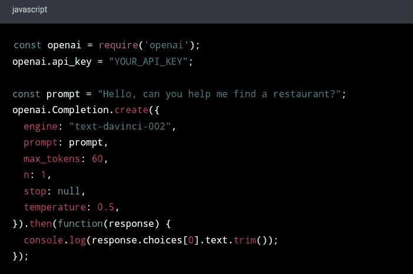
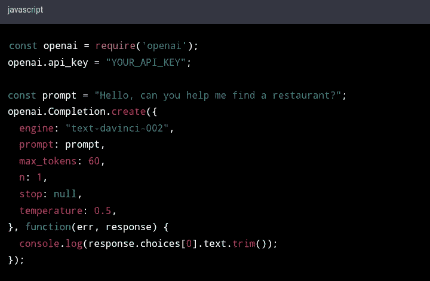

# ChatGPT 之联盟营销

> 原文：[ChatGPT for Affiliate Marketing]()
> 
> 译者：[飞龙](https://github.com/wizardforcel)
> 
> 协议：[CC BY-NC-SA 4.0](https://creativecommons.org/licenses/by-nc-sa/4.0/)

# 第二章

## 制定转化对话

制定转化对话是每个营销人员和企业所有者都应该掌握的关键技能。它涉及创建和传递引人入胜的信息，吸引您的受众并激励他们采取行动。在当今数字时代，沟通跨越各种渠道和平台进行，掌握对话艺术比以往任何时候都更为重要。

无论您是试图产生潜在客户、增加销售额还是提高品牌知名度，进行有效对话对于实现您的目标至关重要。但是，如何创建转化对话呢？一切都始于了解您的受众及其需求。通过这样做，您可以调整您的信息以与他们产生共鸣并解决他们的痛点。

制定转化对话需要一系列技能，包括积极倾听、同理心、讲故事和有说服力的沟通。这涉及找到与您的受众建立联系和建立信任的正确措辞、语气和信息。这也涉及创建鼓励您的受众与您互动并提出问题的对话。

在本章中，我们将探讨有效沟通的原则，并为您提供可操作的策略和技术，帮助您使用 ChatGPT 制定转化对话。

了解您的受众

在 ChatGPT 上制定转化对话需要深入了解您的受众。如果不清楚了解您的受众是谁，他们的需求、想法和痛点，就很难创建共鸣并激励他们采取行动的信息。在这里，我们将探讨如何在 ChatGPT 上创建转化对话时了解您的受众，并为您提供可操作的策略和技巧，帮助您创建有效信息。

了解您的受众对于制定转化对话至关重要

了解您的受众对于制定转化对话至关重要。如果没有清晰了解您的受众，您就有可能创建与他们不共鸣、无关或甚至冒犯的信息。要在 ChatGPT 上创建有效对话，您需要知道您的受众是谁，他们在寻找什么，以及他们如何更喜欢沟通。

以下是了解您的受众至关重要的几个原因：

1.  建立信任：当您了解您的受众时，您可以创建表明您了解他们需求并同情他们痛点的信息。这建立信任，并帮助与您的受众建立联系。

1.  提高参与度：当您的信息针对受众的需求和偏好时，他们更有可能与之互动。这可能导致更高的点击率、更多潜在客户，最终带来更多销售额。

1.  提高客户满意度：当您的信息提供相关和有用的信息时，您的客户更有可能对您的产品或服务感到满意。这可以导致积极的评价、推荐和重复业务。

1.  区分您的品牌：当您了解您的受众时，您可以创建与竞争对手不同的信息。这可以帮助区分您的品牌并建立独特的价值主张。

现在我们明白了为什么了解受众至关重要，让我们深入了解如何做到这一点。

进行市场调研

了解受众的第一步是进行市场调研。市场调研涉及收集关于目标受众的信息，如他们的人口统计数据、兴趣和行为。这些信息可以帮助您创建代表您理想受众的客户人物。以下是进行市场调研的几种方法：

1.  调查：调查是收集关于您受众的信息的好方法。您可以使用 SurveyMonkey 或 Google Forms 等工具创建调查，并通过电子邮件或社交媒体进行分发。确保询问关于您受众的人口统计数据、兴趣和痛点的问题。

1.  社交监听：社交监听涉及监控社交媒体渠道中提及您的品牌、产品或行业的内容。这可以帮助您了解您的受众对您的品牌的看法以及他们感兴趣的内容。

1.  竞争对手分析：分析您的竞争对手也可以为您提供有价值的见解。查看他们的社交媒体资料、网站和评价，了解他们的客户在说什么以及他们做得好的地方。

使用 ChatGPT 个性化对话

一旦您更好地了解了您的受众，您可以使用 ChatGPT 来个性化对话。ChatGPT 可以利用您收集的关于受众的信息来创建更具吸引力和相关性的回应。以下是使用 ChatGPT 个性化对话的几种方法：

1.  使用客户数据：ChatGPT 可以访问客户数据，如以前的购买记录、浏览历史和偏好，以提供个性化的推荐和回应。例如，如果客户以前购买过特定产品，ChatGPT 可以推荐配套产品或提供有关可能感兴趣的新产品的信息。

1.  调整语言和语气：ChatGPT 可以使用自然语言处理来理解您受众的语气和语言偏好。如果您的受众更喜欢正式语气，ChatGPT 可以相应调整其语言。同样，如果您的受众更喜欢幽默或随意的语言，ChatGPT 也可以适应。

1.  根据客户旅程调整信息：了解您受众的旅程可以帮助您创建在旅程的每个阶段满足其特定需求的信息。例如，如果客户处于认知阶段，ChatGPT 可以提供教育内容，帮助他们更多地了解您的品牌或产品。

使用对话营销策略

对话营销是一种利用个性化对话与客户互动并推动转化的策略。以下是一些您可以在 ChatGPT 上使用的对话营销策略，以创建有效的对话：

1.  提问：提问可以帮助您了解您受众的需求并提供个性化建议。例如，如果客户正在寻找产品推荐，ChatGPT 可以询问他们的偏好，并利用这些信息提出相关产品建议。

1.  使用表情符号和 GIF：表情符号和 GIF 可以为您的对话增添个性和幽默，使其更具吸引力和记忆力。但是，请确保适当使用它们，并符合您品牌的语气和声音。

1.  提供解决方案：为您受众的问题提供解决方案可以帮助建立信任和建立关系。ChatGPT 可以为常见问题提供解决方案，并提供资源帮助客户自行解决问题。

1.  提供相关信息：ChatGPT 可以利用您收集的关于受众的数据来提供相关信息和资源。例如，如果您的受众对特定主题或行业感兴趣，ChatGPT 可以提供与该主题相关的文章、博客文章或视频。

创建解决痛点的对话

创建转化对话最有效的方法之一是解决您受众的痛点。痛点是您的受众面临的问题或挑战，通常是他们寻求您的产品或服务的原因。通过直接解决这些痛点，您可以向您的受众展示您理解他们的需求并愿意提供帮助。以下是一些在对话中解决痛点的方法：

1.  使用同理心：在解决痛点时，使用同理心是很重要的。设身处地地站在您受众的角度，尝试理解他们的挫折和挑战。这可以帮助您创建与他们共鸣的消息，并表明您理解他们的需求。

1.  提供解决方案：一旦您确定了受众的痛点，提供解决方案来解决这些挑战。例如，如果您的受众正在与特定问题挣扎，提供关于您的产品或服务如何帮助解决该问题的信息。

1.  提供社会证明：社会证明，如证明或案例研究，可以是解决痛点的强大方式。通过展示您的产品或服务如何帮助他人克服类似挑战，您可以与您的受众建立信任和可信度。

持续测试和完善您的对话

创建转化对话是一个持续的过程。持续测试和完善您的对话以确保它们有效并与您的受众产生共鸣是很重要的。以下是一些测试和完善您的对话的方法：

1.  A/B 测试：A/B 测试涉及创建两个版本的对话，并将它们与受众的不同部分进行测试。这可以帮助您确定哪个版本更有效，并相应地进行更改。

1.  分析指标：分析点击率、参与率和转化率等指标可以提供有价值的见解，了解您的对话表现如何。利用这些数据做出明智的决策，以完善您的对话。

1.  征求反馈：向受众征求反馈也可以提供有价值的见解，帮助改进对话。使用调查或反馈表收集反馈，并用它来做出改变。

总之，在 ChatGPT 上制作能转化的对话需要对受众有深刻的理解。通过市场调研、使用 ChatGPT 进行个性化对话、使用对话营销策略，并不断测试和改进，您可以创建与受众 resonant 且推动转化的有效信息。记住始终把受众需求放在第一位，并努力在每次对话中提供价值。

### 创建引人入胜的聊天机器人对话

聊天机器人在客户服务和营销领域越来越受欢迎。它们允许企业实时与客户互动，提供支持并推动转化。然而，创建引人入胜的聊天机器人对话可能是一个挑战。在这里，我们将探讨如何使用 ChatGPT 创建引人入胜的聊天机器人对话。

以强大的介绍开始

介绍是客户与您的聊天机器人的第一次互动，它为整个对话设定了基调。一个强大的介绍应该是热情、信息丰富且个性化的。使用 ChatGPT 通过姓名问候客户，简要介绍您的品牌或产品，并提供帮助。

使用自然语言处理

自然语言处理（NLP）是一种技术，允许计算机理解人类语言。ChatGPT 是使用 NLP 技术构建的，这使得它能够解释客户的消息并以一种自然和类似人类的方式回应。使用 NLP 创建流畅且感觉像与真人对话的对话。

保持简洁而有趣

聊天机器人对话应该简洁明了。客户不想阅读长篇大论或等待回复。使用 ChatGPT 提供简明的答案，并避免使用客户可能不理解的行话或技术术语。

使用视觉和多媒体

视觉和多媒体可以为您的聊天机器人对话增添深度和趣味。使用 ChatGPT 提供图片、视频和交互元素，帮助客户更好地了解您的产品或服务。例如，如果您在销售服装，使用 ChatGPT 提供产品的不同角度的图片或提供虚拟试衣间。

个性化对话

个性化是创建引人入胜的聊天机器人对话的关键。使用 ChatGPT 访问客户数据，如浏览历史记录、购买历史记录和偏好，以创建个性化消息。例如，如果客户最近购买了一件产品，使用 ChatGPT 建议相关产品或提供售后支持。

使用对话营销策略

对话营销是一种利用个性化对话与客户互动并推动转化的策略。以下是一些可以与 ChatGPT 一起使用的对话营销策略，以创建引人入胜的对话：

1.  提问：提问可以帮助您了解客户的需求并提供个性化建议。使用 ChatGPT 询问有关客户偏好的问题，并利用这些信息建议相关产品或服务。

1.  提供解决方案：为客户的问题提供解决方案可以帮助建立信任和建立关系。使用 ChatGPT 提供常见问题的解决方案，并提供资源帮助客户自行解决问题。

提供支持

聊天机器人可以用于实时提供客户支持。使用 ChatGPT 回答常见问题，解决问题并提供指导。如果客户需要更深入的支持，使用 ChatGPT 将他们连接到现场代理。

持续测试和改进

创建引人入胜的聊天机器人对话是一个持续的过程，需要不断测试和改进。以下是一些持续测试和改进与 ChatGPT 对话的方法：

1.  分析用户反馈：收集用户与 ChatGPT 互动后的反馈是至关重要的。分析用户反馈可以提供有价值的见解，了解什么工作得很好，需要改进什么。利用这些反馈来识别模式和趋势，并相应地进行调整。

1.  监控聊天机器人的性能：定期监控 ChatGPT 的性能，确保其正常运行并提供准确的信息。您可以使用分析工具监控响应时间、完成率和用户满意度等指标。

1.  测试和完善回复：持续测试 ChatGPT 的回复，确保它们准确且与用户的问题或关注点相关。利用用户反馈完善回复，确保它们符合用户期望。

1.  定期训练 ChatGPT：由于 ChatGPT 是基于机器学习的系统，随着时间的推移学习和适应。定期使用新数据和用例训练 ChatGPT 可以帮助它在响应方面变得更加准确和有效。

1.  提供人工监督：虽然 ChatGPT 可以处理大多数用户查询和关注点，但建立一个人工监督机制至关重要。这可以帮助确保 ChatGPT 提供准确的信息并正确处理用户请求。

持续测试和改进对于保持有效的聊天机器人至关重要。通过遵循这些策略，您可以确保 ChatGPT 提供高质量的客户支持并提供积极的用户体验。

将消息个性化以针对特定受众

将消息个性化以针对特定受众是一种强大的营销策略，可以帮助您与目标客户建立联系并推动销售。当正确执行时，个性化可以营造一种相关性和紧迫感，激励潜在客户采取行动。在这里，我们将探讨个性化的好处、您可以个性化消息的不同方式以及有效个性化的一些最佳实践。

为什么个性化很重要

个性化之所以重要有几个原因。首先，它可以帮助您在竞争激烈的市场中脱颖而出。在如此多公司争夺客户的注意力时，个性化可以帮助您创建一个与目标受众共鸣并吸引他们注意力的消息。

其次，个性化可以营造一种紧迫感，激励潜在客户采取行动。当客户感觉到消息是专门针对他们定制的时，他们更有可能相信该优惠或促销是有时间限制的，并迅速采取行动来利用它。

第三，个性化可以帮助建立与客户的信任。通过展示您了解他们的需求和偏好，您正在表明您是一家关心客户并致力于提供个性化体验的公司。

个性化消息的方式

有几种个性化消息的方式，最佳方法将取决于您的业务、目标受众以及您发送的消息类型。以下是一些常见的个性化消息方式：

1.  个性化内容：个性化您的内容涉及将您的消息和营销材料定制给特定受众。这可以包括使用直接针对您的目标受众的语言，突出对他们最相关的特点或优势，或根据客户行为或购买历史定制您的消息。

1.  个性化优惠和促销活动：提供个性化折扣、优惠券或促销活动可以是激励客户采取行动的强大方式。例如，为首次客户提供折扣代码可以是激励他们购买的好方法。

1.  个性化电子邮件营销活动：电子邮件营销是个性化消息的最有效方式之一。通过将电子邮件列表分段并根据特定群体定制消息，您可以创建更有针对性的营销活动，更有可能引起受众共鸣。

1.  个性化产品推荐：根据客户行为或购买历史提供个性化产品推荐是让客户感到被看到和理解的好方法。例如，亚马逊根据客户的浏览和购买历史提供个性化产品推荐，以创建一个定制的购物体验。

1.  个性化的落地页：创建针对特定活动或受众定制的个性化落地页可以帮助提高转化率并创造更好的用户体验。

有效个性化的最佳实践

个性化是一种强大的营销策略，但重要的是要以有效和尊重客户的方式使用它。以下是一些有效个性化的最佳实践：

1.  将受众细分：根据人口统计、行为或购买历史将受众细分可以帮助您创建更有针对性和有效的信息。

1.  使用数据来指导个性化：利用来自您的网站、社交媒体和客户互动的数据来指导您的个性化策略。这可以帮助您识别可以指导您的信息和改善您的定位的模式和趋势。

1.  不要过度使用：虽然个性化可以有效，但重要的是不要过度使用。向客户发送过多个性化信息可能会让人感到不堪重负并感到侵入。适度使用个性化，只在有意义时使用。

1.  测试和迭代：像任何营销策略一样，个性化需要测试和迭代才能有效。使用 A/B 测试和其他技术来完善您的信息并确定对您的受众最有效的方法。

1.  保持透明：重要的是要透明地说明您如何使用客户数据来个性化您的信息。清楚地说明您正在收集哪些数据，如何使用它以及客户如何选择退出如果他们不想接收个性化信息。

1.  使用个性化来增强而不是取代人际互动：个性化可以是提升客户体验的好方法，但重要的是要记住它永远不应该取代人际互动。务必为客户提供与您团队互动并在需要时获得个性化支持的机会。

1.  考虑文化和语言差异：如果您的目标受众是不同国家或文化的人群，重要的是要注意文化和语言差异。在一个国家有效的个性化在另一个国家可能不会有效，因此重要的是进行研究并相应地调整您的信息。

1.  在各个渠道保持信息一致：个性化可以在多个渠道上有效，但重要的是要在各个渠道上保持信息一致。这可以帮助加强您的品牌并为客户创造一个连贯的体验。

1.  关注客户旅程：在个性化您的消息时，关注客户旅程非常重要。考虑客户在旅程中的位置，他们的需求是什么，以及您的消息如何帮助他们完成这个过程。

1.  持续分析和优化您的个性化策略：个性化不是一次性事件，而是一个持续的过程。持续分析您的数据并优化您的个性化策略，以确保其有效并满足目标受众的需求。

结论

将消息个性化以针对特定受众是一种强大的营销策略，可以帮助您与目标客户建立联系，推动销售并建立信任。通过将消息量身定制给特定群体，提供个性化促销和推荐，并创建个性化客户旅程，您可以打造一个与受众 resonates 的高效营销活动。记得要透明，使用数据来指导您的策略，并持续分析和优化您的个性化方法，以确保其有效并满足目标受众的需求。

# 第三章

## 将 ChatGPT 与联盟营销活动整合

将 ChatGPT 与联盟营销活动整合可以成为希望提升联盟营销努力的企业的改变游戏规则者。由 ChatGPT 提供动力的聊天机器人可以提供个性化推荐，实时回答客户问题，并为潜在客户提供支持，同时与您的联盟营销活动无缝整合。

通过将 ChatGPT 与您的联盟营销活动整合，您可以为客户创造更具吸引力和互动性的体验，最终可能导致销售和收入增加。聊天机器人可以根据客户的偏好和过往购买历史提供个性化推荐，从而更有可能促使他们购买。聊天机器人还可以实时回答客户问题，有助于减少客户的沮丧情绪并提高客户满意度。

此外，ChatGPT 可以通过分析客户对话并根据他们的兴趣和需求识别潜在的联盟伙伴，帮助企业扩大其联盟网络并增加其影响力。

将 ChatGPT 与联盟营销活动整合可以帮助企业为客户创造更具吸引力和个性化的体验，增加销售和收入，并扩大他们的联盟网络。在本章中，我们将讨论将 ChatGPT 与联盟营销活动整合的过程。

### 联盟营销活动的基础知识

联盟营销活动正在进行中，监控其性能以查看其表现并根据需要进行调整至关重要。使用分析工具跟踪您的活动成功情况，包括点击率、转化率和产生的收入等指标。

使用这些数据优化您的活动，并进行更改以提高其性能。您可能需要调整您的消息传达方式，针对不同的受众群体，或者为联盟伙伴提供不同的激励措施，以提高您的活动性能。

创建成功的联盟营销活动的提示

这里有一些创建成功的联盟营销活动的额外提示：

1.  选择合适的联盟伙伴：寻找拥有强大追随者和相关受众群体的联盟伙伴。这将帮助您触及目标受众群体，并增加成功的机会。

1.  提供激励措施：为联盟伙伴提供激励措施来推广您的产品或服务，例如提高佣金比例或为达到特定里程碑而提供奖金。

1.  创建高质量内容：您的内容应该信息丰富、引人入胜，并针对您的目标受众群体量身定制。使用不同类型的内容，如博客文章、社交媒体更新和视频内容，以触及您的受众群体。

1.  提供支持：为您的联盟伙伴提供他们成功所需的支持，包括培训、营销材料和持续沟通。

1.  监控您的活动：使用分析工具跟踪您活动的成功，并根据需要进行调整以提高其表现。

1.  保持透明：与您的联盟伙伴就佣金率、付款时间表和任何其他相关信息保持透明。这将有助于建立信任并建立强大的合作关系。

联盟营销可以是推广您的产品或服务并触达更广泛受众的强大方式。通过与联盟伙伴合作并开展成功的联盟营销活动，您可以增加品牌知名度，推动更多销售，并发展您的业务。

要创建成功的联盟营销活动，重要的是明确定义您的目标，确定目标受众，选择合适的联盟伙伴，制定营销计划，创建高质量内容，提供联盟支持，并监控您的活动表现。通过正确的策略和方法，您可以创建一个为您的业务带来实际结果的成功联盟营销活动。

### 将 ChatGPT 与您的联盟营销活动集成

将 ChatGPT 与您的联盟营销活动集成可以帮助您与客户互动，回答他们的问题，并提供个性化推荐。以下是您可以遵循的一些步骤将 ChatGPT 与您的联盟营销活动集成：

确定您的目标

第一步是为将 ChatGPT 与您的联盟营销活动集成定义您的目标。您想增加客户参与度吗？您想向客户提供个性化推荐吗？您想改善客户服务吗？一旦您清楚了解您的目标，您就可以制定将 ChatGPT 整合到您的联盟营销活动中的策略。

制定营销计划

接下来，您需要为 ChatGPT 集成开发营销计划。这可能包括创建社交媒体帖子、电子邮件营销活动和其他营销材料，以促进聊天机器人的使用。您还应该确定在哪些渠道上推广聊天机器人，例如您的网站、社交媒体页面和电子邮件通讯。

训练 ChatGPT

一旦您制定了营销计划，您需要训练 ChatGPT 以提供与客户查询相关的响应。这可能涉及创建一个常见问题数据库并为这些问题开发响应。您还应该训练 ChatGPT 了解客户查询的上下文，并根据他们的兴趣和偏好提供个性化推荐。

将 ChatGPT 与联盟链接集成

将 ChatGPT 与您的联盟营销活动集成的一个关键好处是，您可以使用聊天机器人向客户提供个性化推荐，并在这些推荐中包含联盟链接。例如，如果客户要求推荐一双新的跑鞋，ChatGPT 可以建议一款特定的鞋子，并包含一个购买它们的联盟链接。

监控 ChatGPT 的表现

最后，您需要监控 ChatGPT 的表现，以确保它达到您的目标并为客户提供价值。您应该跟踪参与率、转化率以及从联盟链接生成的收入等指标，以衡量集成的成功。

将 ChatGPT 与联盟营销活动集成的最佳实践

在将 ChatGPT 与您的联盟营销活动集成时，请遵循以下一些最佳实践：

提供相关的推荐

确保 ChatGPT 根据客户的兴趣和偏好提供相关的推荐。使用数据分析工具了解客户行为，并提供可能导致转化的个性化推荐。

保持透明

确保客户知道 ChatGPT 的推荐中包含联盟链接。这将有助于与客户建立信任，并避免潜在的法律问题。

定期培训 ChatGPT

定期培训 ChatGPT，以确保它了解您行业中最新的产品、服务和趋势。这将有助于确保聊天机器人为客户提供准确和相关的推荐。 

使用 ChatGPT 进行客户服务

除了提供推荐和联盟链接外，您还可以将 ChatGPT 用于客户服务。聊天机器人可以处理简单的客户服务请求，如订单跟踪或产品信息，从而使您的客服团队能够专注于更复杂的问题。通过使用 ChatGPT 进行客户服务，您可以提高响应时间并提供更好的客户体验。

测试和迭代

与任何营销活动一样，测试和迭代您的 ChatGPT 集成非常重要，以确保它达到您的目标并为客户提供价值。使用 A/B 测试来比较不同的聊天机器人响应，并监控性能指标以确定改进的方向。

将 ChatGPT 与您的联盟营销活动集成可以帮助您与客户互动，回答他们的问题，并提供个性化的推荐。通过遵循最佳实践并定期培训您的聊天机器人，您可以确保它为客户查询提供准确和相关的响应。通过制定正确的策略和营销计划，将 ChatGPT 与您的联盟营销活动集成可以帮助您提高客户参与度并促进更多的转化。

### 跟踪和分析您的聊天机器人驱动的营销活动的表现

将聊天机器人整合到营销活动中可以带来许多好处，包括增加客户参与度、个性化推荐和改善客户服务。然而，跟踪和分析基于聊天机器人的活动表现至关重要，以确保它们达到您的目标并为您的业务带来积极的投资回报（ROI）。在这里，我们将探讨跟踪和分析基于聊天机器人的活动表现的关键指标和策略。

为什么要跟踪和分析您的基于聊天机器人的活动？

跟踪和分析基于聊天机器人的活动表现至关重要，原因如下：

1.  衡量投资回报率：通过跟踪基于聊天机器人的活动表现，您可以衡量投资回报率，并确定活动是否为您的业务带来价值。

1.  发现改进的领域：分析基于聊天机器人的活动表现可以帮助您发现改进的领域，例如优化聊天机器人的回应、提高客户参与度和增加转化率。

1.  了解客户行为：跟踪和分析基于聊天机器人的活动表现可以为客户行为、偏好和兴趣提供宝贵的见解。

用于跟踪基于聊天机器人驱动的活动表现的关键指标

以下是跟踪和分析基于聊天机器人的活动表现的一些关键指标：

1.  参与度指标：参与度指标衡量客户与您的聊天机器人的互动方式，包括对话次数、发送消息数量和响应率。

1.  转化指标：转化指标衡量客户在与您的聊天机器人互动后采取行动的数量，例如购买商品或注册新闻简讯。

1.  客户满意度指标：客户满意度指标衡量客户对其与聊天机器人的体验满意程度，包括反馈评分、调查和客户评价。

1.  收入指标：收入指标衡量从基于聊天机器人的活动中产生的收入，包括归因于聊天机器人推荐和联盟链接的销售额。

分析基于聊天机器人驱动的活动表现的策略

以下是分析基于聊天机器人的活动表现的一些策略：

1.  设定明确的目标：在启动基于聊天机器人的营销活动之前，设定清晰的目标和目标。这些目标应该是具体的、可衡量的，并与您的整体营销策略保持一致。

1.  使用分析工具：使用分析工具跟踪和分析基于聊天机器人的活动表现。例如，Google Analytics 可以帮助您跟踪参与度、转化和收入指标。

1.  监控关键指标：定期监控关键指标，以识别趋势和改进的领域。建立仪表板和报告，监控参与度、转化、客户满意度和收入指标。

1.  A/B 测试聊天机器人响应：测试不同的聊天机器人响应，以确定吸引客户和推动转化的最有效策略。使用 A/B 测试比较不同的聊天机器人响应，并监控表现指标以确定最有效的方法。

1.  监控客户反馈：监控客户反馈，以识别改进领域并了解客户偏好和兴趣。利用客户调查、反馈评分和评论收集有关聊天机器人体验的反馈。

1.  持续优化：持续优化您的聊天机器人驱动的营销活动，以提高表现并实现目标。利用从分析和客户反馈中获得的见解，识别改进领域并相应地进行调整。

追踪和分析您的聊天机器人驱动的营销活动的表现对于衡量投资回报率、识别改进领域和了解客户行为至关重要。通过跟踪关键指标并使用分析工具，您可以监控参与度、转化率、客户满意度和收入指标。

通过持续优化您的聊天机器人驱动的营销活动，您可以提高表现并实现目标。通过正确的策略和方法，追踪和分析您的聊天机器人驱动的营销活动的表现可以帮助您实现更多转化并提供更好的客户体验。

# 第四章

## 最大化 ChatGPT 效果的高级策略

ChatGPT 在联盟营销领域可以是一项宝贵的资产，因为它可以帮助企业自动化和优化他们的营销工作。通过利用 ChatGPT 的高级功能，企业可以最大化其联盟营销策略的效果，并取得更好的结果。

在联盟营销中使用 ChatGPT 的主要优势之一是其分析大量数据并生成见解的能力。通过 ChatGPT，企业可以处理大量客户数据，以识别模式和趋势，然后用于开发更有针对性和有效的营销活动。

此外，ChatGPT 可用于为客户生成个性化内容，如产品推荐和促销优惠。通过根据个体客户的偏好和需求定制内容，企业可以提高客户参与度，并增加转化的可能性。

然而，要充分利用 ChatGPT 在联盟营销中的能力，重要的是要实施高级策略。这些策略可能包括在特定数据集上微调模型，使用多任务学习来提高性能，集成以减少模型偏差和错误，以及数据增强以增加可用的训练数据量。通过实施这些策略，企业可以最大化 ChatGPT 在其联盟营销工作中的效果。

在本章中，将详细讨论这些策略。

### A/B 测试和优化

A/B 测试是一种用于比较网页、应用程序或营销活动的两个版本以确定哪个表现更好的方法。它也被称为分割测试，是优化和改进营销工作的有效方式。A/B 测试是一种统计实验，允许营销人员通过将流量分为两组 A 组和 B 组来比较网站或营销活动的两个版本。

A 组展示网页或活动的原始版本，而 B 组展示相同网页或活动的修改版本。然后比较两组的表现，以确定哪个版本更有效。

A/B 测试是提高落地页、电子邮件营销和其他营销工作转化率的强大工具。它还有助于优化网站和应用的用户体验、设计和功能。

以下教学将提供 A/B 测试的深入概述，包括其好处、常见错误、最佳实践和优化技术。

A/B 测试的好处：

A/B 测试为营销人员提供了许多好处，包括：

1.  提高转化率：A/B 测试可以帮助营销人员识别导致转化率提高的变化。这可以导致销售额、收入和客户获取量的增加。

1.  降低跳出率：A/B 测试可以通过改善用户体验来降低跳出率，使访问者更有可能留在网站上并与内容互动。

1.  提高用户参与度：A/B 测试可以通过识别鼓励访问者与网站或应用程序互动更多的变化来提高用户参与度。

1.  更好的投资回报率：A/B 测试可以通过优化活动来提高市场营销投资的回报率，以在相同预算下取得更好的结果。

1.  数据驱动的决策：A/B 测试使市场营销人员能够做出数据驱动的决策，这可以导致更有效的营销策略。

A/B 测试中的常见错误

尽管 A/B 测试是一个强大的工具，但重要的是要避免常见的错误，以确保准确的结果。一些常见的错误包括：

1.  测试多个变量：A/B 测试应该专注于单个变量，比如标题或按钮颜色。同时测试多个变量可能会使确定哪个变化导致改善结果变得困难。

1.  未定义成功指标：A/B 测试需要明确的成功指标来确定哪个版本更有效。未定义成功指标可能会导致不准确的结果。

1.  测试小样本量：A/B 测试需要足够的样本量才能生成准确的结果。使用小样本量进行测试可能会导致不准确的结论。

1.  忽略统计显著性：A/B 测试需要统计显著性来确定结果是否有意义。忽略统计显著性可能会导致假阳性或假阴性，这意味着结果可能表明变化之间存在差异，而实际上并没有，反之亦然。

1.  选择偏见：选择偏见发生在用于测试的样本不代表目标人群时。如果样本不是随机选择的，或者被测试的组之间存在固有差异，就会发生选择偏见。选择偏见可能导致不准确的结论，并使结果难以推广到更广泛的人群。

1.  运行时间过短的测试：运行时间过短的测试可能会导致不准确的结果。这是因为收集的数据可能不代表长期行为。重要的是要运行足够长的时间的测试，以捕捉随时间可能出现的任何模式或趋势。

1.  过度依赖 A/B 测试：虽然 A/B 测试可以是一个强大的工具，但不应该是决策的唯一工具。A/B 测试应该与其他方法结合使用，如调查、用户反馈和定性研究，以更全面地了解用户行为和偏好。

1.  忽视次要指标：虽然 A/B 测试的主要目标通常是改善特定指标，但也很重要考虑变化对其他指标的影响。仅关注主要指标可能导致意外后果，并对其他指标产生负面影响。

1.  不考虑上下文：A/B 测试结果应始终考虑在更广泛的业务目标和目标的背景下。不考虑上下文可能导致与组织整体战略和目标不一致的决策。

使用 ChatGPT 进行 A/B 测试的样本结果

作为一个 AI 语言模型，ChatGPT 可以用于进行 A/B 测试，帮助企业做出数据驱动的决策。在这个示例中，我们将探讨使用 ChatGPT 进行的 A/B 测试过程的结果，以确定哪个版本的网站首页会导致更高的转化率。

背景：

有关网站是一家销售服装和配饰的电子商务网站。网站的首页是访问者的第一个接触点，因此对网站的成功至关重要。网站管理团队决定进行 A/B 测试，以确定哪个版本的首页会导致更高的转化率。

假设：

管理团队假设首页的 B 版本，其中包含更突出的行动号召（CTA）按钮和更清晰的设计，将导致比 A 版本更高的转化率。

测试设计：

A/B 测试旨在比较首页的 A 版本和 B 版本。网站访问者被随机分配到两个版本的首页中的一个。测试持续了一个月，以确保足够的样本量，并捕捉可能随时间出现的任何趋势或模式。

成功指标：

A/B 测试的成功指标是转化率，定义为访问网站首页后进行购买的访问者的百分比。转化率使用 Google Analytics 进行测量。

结果

A/B 测试使用了 10,000 名访问者的样本，其中 5,000 名访问者被随机分配到 A 版本，另外 5,000 名访问者被分配到 B 版本。测试结果如下：

A 版本：

访问者数量：5,000

转化率：2.5%

B 版本：

访问者数量：5,000

转化率：3.2%

A/B 测试的结果显示，首页的 B 版本导致比 A 版本更高的转化率。B 版本的转化率为 3.2%，而 A 版本为 2.5%。这意味着 B 版本是获胜版本，因为它导致更高比例的网站访问者完成所需的操作。

然而，重要的是要注意，5000 名访客的样本量可能不足以得出关于两个主页版本有效性的明确结论。理想情况下，应该在更大的样本量上进行 A/B 测试，以确保统计显著性，并减少假阳性的可能性。

此外，重要的是考虑可能导致两个版本转化率差异的其他因素。例如，每个主页版本的访问者是否代表网站的整体受众？是否存在可能影响一个或两个版本性能的技术问题或错误？

总的来说，A/B 测试可以是优化网站设计和提高转化率的有价值工具，但重要的是要以批判的眼光对待，并考虑可能影响结果的一系列因素。

### 为您的聊天机器人创建自定义工作流

随着聊天机器人变得越来越普遍，企业正在寻找方法来提高其性能并使其更加有效。实现这一目标的一种方法是使用 ChatGPT 为您的聊天机器人创建自定义工作流。自定义工作流可以帮助简化聊天机器人与用户之间的对话，使用户更容易找到所需的信息，并使聊天机器人提供相关的响应。在这里，我们将探讨创建自定义工作流的好处，并提供使用 ChatGPT 创建它们的逐步指南。

第一部分：为您的聊天机器人创建自定义工作流的好处

自定义工作流可以为您的聊天机器人带来许多好处，包括：

1.  改善用户体验：自定义工作流有助于确保用户快速轻松地获取所需信息。通过引导用户完成一系列步骤，您可以帮助他们更有效地找到他们所需的信息，而不必搜索大量信息。

1.  增加参与度：使用自定义工作流的聊天机器人往往更具吸引力。通过提供引导用户进行对话的对话体验，您可以保持用户的兴趣，并更有可能完成所需的操作。

1.  更准确的响应：自定义工作流有助于确保聊天机器人提供准确和相关的响应。通过引导用户回答一系列问题和提示，您可以更好地了解他们的需求并提供最合适的响应。

1.  更易管理：自定义工作流可能比更复杂的对话更易管理。通过将对话分解为较小的步骤，您可以更容易地跟踪用户行为并根据需要进行更改。

第二部分：使用 ChatGPT 创建自定义工作流

现在我们已经讨论了创建自定义工作流的好处，让我们深入了解使用 ChatGPT 创建它们的过程。

步骤 1：定义您的聊天机器人的目标

创建自定义工作流程的第一步是定义聊天机器人的目标。您希望用户采取什么行动？这将帮助您为用户创建一条清晰的路径，帮助他们实现该目标。

第二步：规划对话流程

一旦您定义了聊天机器人的目标，就该规划对话流程了。这涉及创建一个流程图，概述用户将采取的步骤以实现目标。流程图应包括用户可能采取的所有可能路径，包括对话中的任何决策点或分支。

第三步：使用自然语言处理

ChatGPT 的关键特性之一是其自然语言处理能力。这意味着聊天机器人可以理解并回应用户的自然语言输入。在创建自定义工作流程时，利用这一功能创建一个对用户来说感觉自然和直观的对话体验是很重要的。

第四步：使用提示和问题

为了引导用户进行对话，您可以使用提示和问题来引出特定的回答。例如，如果您的聊天机器人旨在帮助用户找到产品，您可以提示他们输入他们正在寻找的产品类型或他们愿意支付的价格范围。

第五步：使用条件逻辑

条件逻辑是一个强大的工具，允许您根据用户的回答在对话中创建决策点。例如，如果用户表示他们正在寻找特定类型的产品，您可以使用条件逻辑基于该偏好为他们提供推荐。

第六步：测试和完善

创建自定义工作流程后，重要的是与真实用户测试并根据他们的反馈进行完善。这将帮助您确定对话不清晰或用户卡住的地方，从而使您能够随着时间的推移进行改进和优化工作流程。

# 第五章

## 成功的聊天机器人驱动联盟营销的案例研究和示例

聊天机器人在联盟营销中越来越被用于自动化例行任务、与客户互动和提供个性化推荐。聊天机器人可以通过引导用户完成购买过程和提供相关产品推荐来帮助推动销售和收入。在本章中，我们将探讨成功的聊天机器人驱动的联盟营销的案例研究和示例，重点介绍企业如何利用聊天机器人改善其营销工作并推动转化。

我们还将讨论使聊天机器人在联盟营销中有效的关键特性和策略，例如个性化推荐、自然语言处理和自动化工作流程。

通过研究聊天机器人驱动的联盟营销的实际案例，我们可以深入了解如何利用聊天机器人推动联盟营销行业的销售和收入的最佳实践和策略。

### 使用 ChatGPT 进行联盟营销的企业的实际案例

聊天机器人已经成为企业与客户互动和自动化例行任务的流行工具，包括联盟营销。由 OpenAI 训练的大型语言模型 ChatGPT 驱动的聊天机器人可以提供个性化推荐、回答问题并引导用户完成购买过程。在这里，我们将探讨成功使用 ChatGPT 进行联盟营销的企业的实际案例，重点介绍使 ChatGPT 在这一背景下有效的关键特性和策略。

示例 1：Sephora 的 Color Match 聊天机器人

化妆品零售商 Sephora 利用 ChatGPT 创建了一个聊天机器人，帮助客户找到他们理想的粉底色号。Color Match 聊天机器人使用自然语言处理来理解客户的偏好和肤色，为符合其肤色的粉底色号提供个性化推荐。

该聊天机器人还提供关于如何使用粉底和其他化妆品的提示和教程。Color Match 聊天机器人帮助 Sephora 改善了客户参与度，并通过为客户提供个性化、互动体验来增加销售额。

示例 2：Domino's Pizza 聊天机器人

Domino's Pizza 已经实施了一个由 ChatGPT 驱动的聊天机器人，允许客户通过 Facebook Messenger 或其他消息应用程序订购披萨。该聊天机器人使用自然语言处理来理解客户的订单，根据他们的偏好和饮食限制提供个性化推荐。

客户还可以通过聊天机器人跟踪订单并获取有关交付状态的更新。Domino's Pizza 聊天机器人帮助公司改善了客户服务并简化了订购流程，从而增加了销售额和收入。

示例 3：H&M 的个人风格师聊天机器人

H&M，这家时尚零售商，已经创建了一个由 ChatGPT 驱动的聊天机器人，作为顾客的个人造型师。该聊天机器人利用自然语言处理来理解顾客的偏好和风格，为他们提供符合其口味的服装和配饰的个性化推荐。

顾客还可以通过聊天机器人获得造型提示和灵感。这个个人造型师聊天机器人帮助 H&M 改善了顾客参与度，并通过为顾客提供个性化、互动式的购物体验来增加销售额。

# 第六章

## 如何使用 ChatGPT 创建聊天机器人

近年来，由于人工智能和自然语言处理的进步，聊天机器人变得越来越受欢迎。聊天机器人是通过消息应用程序、网站或移动应用程序与用户交互的软件程序。它们为用户查询提供自动化响应，使企业更容易与客户互动。

ChatGPT 是由 OpenAI 开发的最先进的语言模型。它基于 GPT-3 架构，能够理解自然语言并生成类似人类的回复。在这里，我们将为您介绍使用 ChatGPT 创建聊天机器人所涉及的步骤。

第一步：设置您的开发环境

首先，您需要设置您的开发环境。您可以使用任何您选择的编程语言来开发聊天机器人，但是为了本书的目的，我们将使用 Python。

要开始，您需要在您的计算机上安装 Python。您可以从官方网站 ([`www.python.org/downloads/`](https://www.python.org/downloads/)) 下载最新版本的 Python。安装 Python 后，您可以使用 pip 软件包管理器安装创建聊天机器人所需的库。

要安装所需的库，请打开终端窗口并运行以下命令：

上述命令将安装 TensorFlow、Keras、OpenAI 和 Flask 库，这些库是使用 ChatGPT 构建聊天机器人所必需的。

第二步：创建一个 OpenAI API 密钥

在我们开始编写聊天机器人之前，我们需要为 OpenAI 创建一个 API 密钥。您可以通过在 OpenAI 网站上注册账户（[`beta.openai.com/signup/`](https://beta.openai.com/signup/)）来创建 API 密钥。

创建账户后，请登录并转到 API 密钥页面。单击“创建新的 API 密钥”按钮，并为您的 API 密钥命名。您还需要选择要使用的 API – 在这种情况下，将是 GPT-3 API。

创建 API 密钥后，您需要复制并妥善保管它，因为它将用于验证对 OpenAI API 的请求。保持 API 密钥私密并不与任何人分享非常重要，因为它可以用于代表您发出请求，这可能导致不必要的费用或数据泄露。

一旦您获得了 API 密钥，您就可以开始编写您的聊天机器人。您可以使用许多编程语言来创建与 OpenAI API 通信的聊天机器人。以下是一些示例：

Python – 您可以使用 OpenAI Python 库与 API 进行交互。使用 pip 安装库，并在您的 Python 脚本中导入它。以下是一个示例代码片段：

此代码使用 text-davinci-002 引擎生成对提示的响应。它将最大标记数设置为 60，温度设置为 0.5。响应将打印到控制台。

JavaScript – 您可以使用 OpenAI JavaScript 库与 API 进行交互。使用 npm 安装库，并在您的 JavaScript 文件中导入它。以下是一个示例代码片段：

此代码使用 text-davinci-002 引擎生成对提示的响应。它将最大标记数设置为 60，温度设置为 0.5。响应将打印到控制台。

Node.js – 您可以使用 OpenAI Node.js 库与 API 进行交互。使用 npm 安装库，并在您的 Node.js 文件中引入它。以下是一个示例代码片段：

此代码使用 text-davinci-002 引擎生成对提示的响应。它将最大标记数设置为 60，温度设置为 0.5。响应将打印到控制台。

这些只是您可以使用 OpenAI API 创建聊天机器人的几个示例。还有许多其他编程语言和库可供使用。

现在，这个过程很可能只有程序员和与软件开发相关的人才能理解。所以，就像我在书中早些时候所说的，如果这不是你能做的事情，那么最好将其外包给能做的人。

# 结论

由于人工智能和自然语言处理技术的进步，聊天机器人驱动的营销近年来变得越来越流行。随着聊天机器人变得更加复杂和智能，聊天机器人驱动的营销改变公司与客户互动方式的潜力是巨大的。在本文中，我们将探讨聊天机器人驱动的营销的未来以及其改变营销格局的潜力。

聊天机器人驱动的营销的主要好处之一是其提供个性化体验给客户的能力。通过分析客户偏好、行为和购买历史的数据，聊天机器人可以创建高度个性化的推荐、优惠和消息，以满足每位客户的需求。这种个性化水平可以带来更高的参与度和转化率，因为客户更有可能对符合他们兴趣和需求的消息做出响应。

聊天机器人驱动的营销的另一个优势是其提供全天候客户支持的能力。聊天机器人可以处理常规查询并快速回答常见问题，从而释放人工代理处理更复杂的问题。这不仅减少了响应时间，还提高了整体客户体验。聊天机器人还可以在购买过程中提供实时帮助，帮助客户快速轻松地找到合适的产品并完成交易。

除了提供个性化体验和全天候客户支持外，聊天机器人驱动的营销还有降低成本和提高效率的潜力。聊天机器人可以同时处理大量的查询和交易，减少对人工代理的需求并降低劳动成本。聊天机器人还可以被编程用于识别和确认潜在客户，从而使销售团队能够专注于成交。

展望未来，我们可以预期聊天机器人驱动的营销将变得更加先进和复杂。通过整合人工智能和机器学习能力，聊天机器人可以变得更加个性化和高效。AI 驱动的聊天机器人可以从客户互动中学习，并利用这些信息实时定制他们的回应和建议，为客户提供更加个性化的体验。

此外，聊天机器人可以与其他技术集成，如语音助手、增强现实和虚拟现实，为客户创造更加引人入胜的体验。例如，聊天机器人可以帮助客户虚拟试穿服装或化妆品，或者引导他们进行对感兴趣的房产的虚拟导览。

聊天机器人还可以在会话式商务这一不断增长的趋势中发挥关键作用，该趋势涉及使用消息应用和聊天机器人促进交易。随着社交商务和移动商务的兴起，聊天机器人可以为客户提供在消息应用或网站内直接购买商品的无缝便捷方式。

然而，随着聊天机器人技术的不断发展和进步，确保考虑到伦理问题非常重要。聊天机器人必须透明地展示其能力和局限性，并且不应用于欺骗或操纵客户。还必须考虑数据隐私和安全，以保护客户信息并防止数据泄露。

总的来说，聊天机器人驱动的营销有可能彻底改变企业与客户互动的方式，提供个性化和高效的体验，同时降低成本并提高效率。随着聊天机器人技术的不断进步，我们可以期待在未来几年看到更多令人兴奋和创新的应用场景。

作为一种语言模型，ChatGPT 可以成为寻求以更加个性化和高效的方式与受众互动的联盟营销人员的强大工具。然而，在使用 ChatGPT 进行联盟营销时，需要牢记几个重要考虑因素。

首先，确保 ChatGPT 生成的内容准确可靠非常重要。虽然 ChatGPT 能够生成高质量的内容，但并非完美无缺，有时可能会产生不准确或误导性信息。因此，联盟营销人员在与受众分享由 ChatGPT 生成的任何内容之前，应仔细审查和核实。

其次，重要的是要以增加客户体验价值的方式使用 ChatGPT，而不仅仅将其用作促销信息的工具。ChatGPT 可以用于回答客户问题，提供产品推荐，并提供个性化建议和支持。通过关注客户的需求和兴趣，而不仅仅是推广产品，联盟营销人员可以与其受众建立更强大和更信任的关系。

最后，对于在联盟营销中使用 ChatGPT，透明度是非常重要的。顾客应该知道他们正在与一个聊天机器人互动，并且任何推荐或促销都是联盟营销计划的一部分。通过对 ChatGPT 的使用坦诚和透明，联盟营销人员可以与其受众建立信任和可信度，并避免任何潜在的道德顾虑。

总的来说，对于希望以更个性化和高效的方式与其受众互动的联盟营销人员来说，ChatGPT 可以是一个强大的工具。通过遵循最佳实践并对在联盟营销中使用聊天机器人的透明度，联盟营销人员可以利用 ChatGPT 的力量与他们的客户建立更强大和更有意义的关系。
