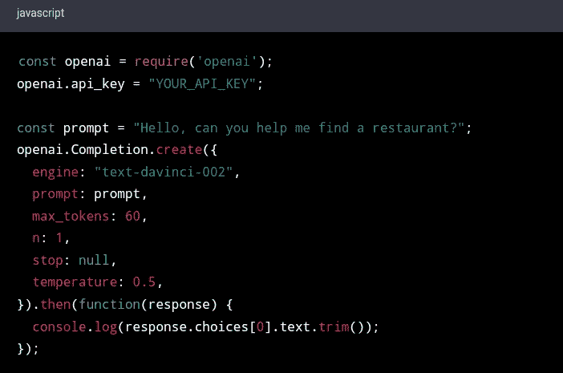

# 第六章

## 如何使用 ChatGPT 创建聊天机器人

近年来，由于人工智能和自然语言处理的进步，聊天机器人变得越来越受欢迎。聊天机器人是通过消息应用程序、网站或移动应用程序与用户交互的软件程序。它们为用户查询提供自动化响应，使企业更容易与客户互动。

ChatGPT 是由 OpenAI 开发的最先进的语言模型。它基于 GPT-3 架构，能够理解自然语言并生成类似人类的回复。在这里，我们将为您介绍使用 ChatGPT 创建聊天机器人所涉及的步骤。

第一步：设置您的开发环境

首先，您需要设置您的开发环境。您可以使用任何您选择的编程语言来开发聊天机器人，但是为了本书的目的，我们将使用 Python。

要开始，您需要在您的计算机上安装 Python。您可以从官方网站 ([`www.python.org/downloads/`](https://www.python.org/downloads/)) 下载最新版本的 Python。安装 Python 后，您可以使用 pip 软件包管理器安装创建聊天机器人所需的库。

要安装所需的库，请打开终端窗口并运行以下命令：

上述命令将安装 TensorFlow、Keras、OpenAI 和 Flask 库，这些库是使用 ChatGPT 构建聊天机器人所必需的。

第二步：创建一个 OpenAI API 密钥

在我们开始编写聊天机器人之前，我们需要为 OpenAI 创建一个 API 密钥。您可以通过在 OpenAI 网站上注册账户（[`beta.openai.com/signup/`](https://beta.openai.com/signup/)）来创建 API 密钥。

创建账户后，请登录并转到 API 密钥页面。单击“创建新的 API 密钥”按钮，并为您的 API 密钥命名。您还需要选择要使用的 API – 在这种情况下，将是 GPT-3 API。

创建 API 密钥后，您需要复制并妥善保管它，因为它将用于验证对 OpenAI API 的请求。保持 API 密钥私密并不与任何人分享非常重要，因为它可以用于代表您发出请求，这可能导致不必要的费用或数据泄露。

一旦您获得了 API 密钥，您就可以开始编写您的聊天机器人。您可以使用许多编程语言来创建与 OpenAI API 通信的聊天机器人。以下是一些示例：

Python – 您可以使用 OpenAI Python 库与 API 进行交互。使用 pip 安装库，并在您的 Python 脚本中导入它。以下是一个示例代码片段：

此代码使用 text-davinci-002 引擎生成对提示的响应。它将最大标记数设置为 60，温度设置为 0.5。响应将打印到控制台。

JavaScript – 您可以使用 OpenAI JavaScript 库与 API 进行交互。使用 npm 安装库，并在您的 JavaScript 文件中导入它。以下是一个示例代码片段：

此代码使用 text-davinci-002 引擎生成对提示的响应。它将最大标记数设置为 60，温度设置为 0.5。响应将打印到控制台。

Node.js – 您可以使用 OpenAI Node.js 库与 API 进行交互。使用 npm 安装库，并在您的 Node.js 文件中引入它。以下是一个示例代码片段：

此代码使用 text-davinci-002 引擎生成对提示的响应。它将最大标记数设置为 60，温度设置为 0.5。响应将打印到控制台。

这些只是您可以使用 OpenAI API 创建聊天机器人的几个示例。还有许多其他编程语言和库可供使用。

现在，这个过程很可能只有程序员和与软件开发相关的人才能理解。所以，就像我在书中早些时候所说的，如果这不是你能做的事情，那么最好将其外包给能做的人。

# 结论

由于人工智能和自然语言处理技术的进步，聊天机器人驱动的营销近年来变得越来越流行。随着聊天机器人变得更加复杂和智能，聊天机器人驱动的营销改变公司与客户互动方式的潜力是巨大的。在本文中，我们将探讨聊天机器人驱动的营销的未来以及其改变营销格局的潜力。

聊天机器人驱动的营销的主要好处之一是其提供个性化体验给客户的能力。通过分析客户偏好、行为和购买历史的数据，聊天机器人可以创建高度个性化的推荐、优惠和消息，以满足每位客户的需求。这种个性化水平可以带来更高的参与度和转化率，因为客户更有可能对符合他们兴趣和需求的消息做出响应。

聊天机器人驱动的营销的另一个优势是其提供全天候客户支持的能力。聊天机器人可以处理常规查询并快速回答常见问题，从而释放人工代理处理更复杂的问题。这不仅减少了响应时间，还提高了整体客户体验。聊天机器人还可以在购买过程中提供实时帮助，帮助客户快速轻松地找到合适的产品并完成交易。

除了提供个性化体验和全天候客户支持外，聊天机器人驱动的营销还有降低成本和提高效率的潜力。聊天机器人可以同时处理大量的查询和交易，减少对人工代理的需求并降低劳动成本。聊天机器人还可以被编程用于识别和确认潜在客户，从而使销售团队能够专注于成交。

展望未来，我们可以预期聊天机器人驱动的营销将变得更加先进和复杂。通过整合人工智能和机器学习能力，聊天机器人可以变得更加个性化和高效。AI 驱动的聊天机器人可以从客户互动中学习，并利用这些信息实时定制他们的回应和建议，为客户提供更加个性化的体验。

此外，聊天机器人可以与其他技术集成，如语音助手、增强现实和虚拟现实，为客户创造更加引人入胜的体验。例如，聊天机器人可以帮助客户虚拟试穿服装或化妆品，或者引导他们进行对感兴趣的房产的虚拟导览。

聊天机器人还可以在会话式商务这一不断增长的趋势中发挥关键作用，该趋势涉及使用消息应用和聊天机器人促进交易。随着社交商务和移动商务的兴起，聊天机器人可以为客户提供在消息应用或网站内直接购买商品的无缝便捷方式。

然而，随着聊天机器人技术的不断发展和进步，确保考虑到伦理问题非常重要。聊天机器人必须透明地展示其能力和局限性，并且不应用于欺骗或操纵客户。还必须考虑数据隐私和安全，以保护客户信息并防止数据泄露。

总的来说，聊天机器人驱动的营销有可能彻底改变企业与客户互动的方式，提供个性化和高效的体验，同时降低成本并提高效率。随着聊天机器人技术的不断进步，我们可以期待在未来几年看到更多令人兴奋和创新的应用场景。

作为一种语言模型，ChatGPT 可以成为寻求以更加个性化和高效的方式与受众互动的联盟营销人员的强大工具。然而，在使用 ChatGPT 进行联盟营销时，需要牢记几个重要考虑因素。

首先，确保 ChatGPT 生成的内容准确可靠非常重要。虽然 ChatGPT 能够生成高质量的内容，但并非完美无缺，有时可能会产生不准确或误导性信息。因此，联盟营销人员在与受众分享由 ChatGPT 生成的任何内容之前，应仔细审查和核实。

其次，重要的是要以增加客户体验价值的方式使用 ChatGPT，而不仅仅将其用作促销信息的工具。ChatGPT 可以用于回答客户问题，提供产品推荐，并提供个性化建议和支持。通过关注客户的需求和兴趣，而不仅仅是推广产品，联盟营销人员可以与其受众建立更强大和更信任的关系。

最后，对于在联盟营销中使用 ChatGPT，透明度是非常重要的。顾客应该知道他们正在与一个聊天机器人互动，并且任何推荐或促销都是联盟营销计划的一部分。通过对 ChatGPT 的使用坦诚和透明，联盟营销人员可以与其受众建立信任和可信度，并避免任何潜在的道德顾虑。

总的来说，对于希望以更个性化和高效的方式与其受众互动的联盟营销人员来说，ChatGPT 可以是一个强大的工具。通过遵循最佳实践并对在联盟营销中使用聊天机器人的透明度，联盟营销人员可以利用 ChatGPT 的力量与他们的客户建立更强大和更有意义的关系。
