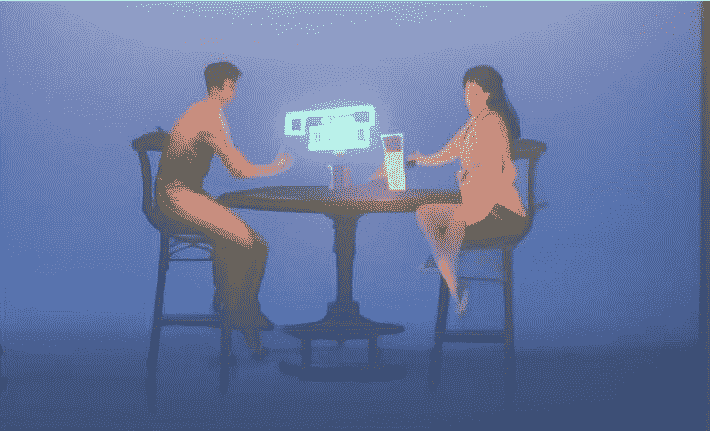

## 作者注

亲爱的读者，

ChatGPT，一位 AI 专家和一位律师走进了一家酒吧。酒保看着他们说：“这是什么，某种笑话吗？”

AI 专家回应道：“当然这是一个笑话。难道你不知道聊天机器人和 AI 不断发展和改进他们的幽默感吗？”

律师插话说：“嗯，我对此并不那么确定。我见过很多由 AI 生成的笑话都不怎么好笑。”

ChatGPT 插话说：“对不起，我并不是有意冒犯。这个怎么样：为什么计算机感到冷？因为它把窗户打开了。”

酒保笑着说：“这真是一个好笑的故事。你们真是充满了惊喜。”

（两个人和一个 AI 聊天机器人坐在酒吧里）

我们是这本关于从洞穴壁画到 AI 的沟通和创造力演变的书的人类作者。然而，这本书的写作过程非常独特，因为我们利用了 ChatGPT，一种最先进的人工智能语言模型，来协助我们撰写内容。

我们向 ChatGPT 提供了各种提示和想法，然后它根据这些输入生成文本。虽然这本书中的大部分文本是由 ChatGPT 生成的，但我们对内容进行了审查和编辑，以确保符合我们的标准并准确传达我们想要传达的信息。

我们和 ChatGPT 生成的内容在本书中以不同的方式显示，以便轻松区分谁写了什么：

• 由人类作者撰写的原创内容

• 由人类作者作为 AI 系统的提示而撰写

• 由 ChatGPT 撰写

我们没有修改或编辑 ChatGPT 撰写的任何内容，除了选择哪些书面内容包含在书中。同样，ChatGPT 也没有编辑我们的写作，可能会对写作质量造成不利影响！

我们希望您喜欢这种独特的写作方式，并发现这些页面中的信息像我们一样迷人。

此致，

鲍勃·罗杰斯和特蕾莎·哈特

2023 年 1 月 2 日
