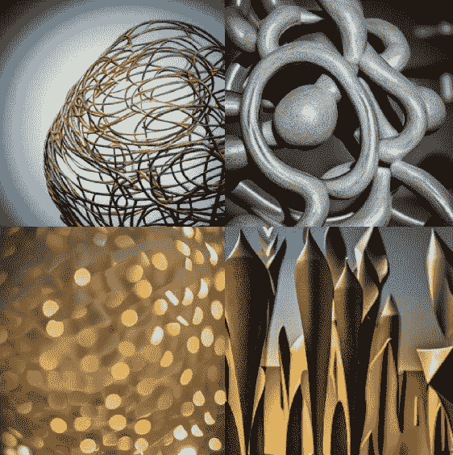
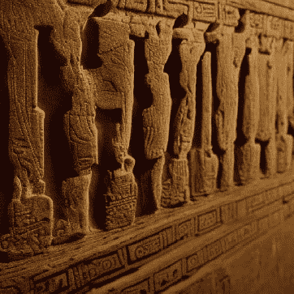

### 第四章

## 创造力在人类历史和文化中的作用

自人类诞生以来，我们就被赋予了创造力的礼物。这是一份让我们能够交流、表达自己并创造美好事物的礼物。语言创造力和艺术创造力在人类历史中发挥着至关重要的作用，并且继续塑造着我们今天生活的世界。

语言创造力是以独特和有意义的方式创造和使用语言的能力。它是每位伟大诗人、小说家和剧作家的推动力。没有语言创造力，我们将无法以他人能够理解的方式表达我们的思想和情感。

在整个历史上，语言创造力在人类文化的发展中发挥着至关重要的作用。在古代文明中，语言被用来传递知识、记录历史和创作艺术。它是主要的交流方式，让人们能够分享想法、互相学习，并建立社区。

如今，语言创造力仍然是人类生活中不可或缺的一部分。它被用来创作文学、写音乐、打造演讲并与他人交流。它是一种强大的力量，能够激发灵感、说服他人并改变世界。

艺术创造力是以独特和富有表现力的方式创作艺术的能力。它是每位伟大画家、雕塑家和音乐家的推动力。没有艺术创造力，我们将无法以视觉或美学上令人愉悦的方式表达自己。

(美丽的抽象雕塑)

在整个历史上，艺术创造力在人类文化的发展中发挥着至关重要的作用。在古代文明中，艺术被用来讲故事、记录历史和表达情感。这是人们彼此连接和探索自己创造力的一种方式。

(古代文明中，艺术被用来记录历史)

今天，艺术创造力仍然是人类生活中不可或缺的一部分。它被用来创作绘画、雕塑、音乐等。它是一种强大的力量，能够激发灵感、唤起情感并将人们聚集在一起。

所以，为什么创造力如此重要？为什么它在历史上一直受到重视，并且今天仍然受到重视？

创造力之所以重要有很多原因。它让我们能够以有意义和独特的方式表达自己。它让我们能够与他人在更深层次上连接。它让我们能够探索世界并发现新事物。它让我们能够挑战自己并成长。

创造力也很重要，因为它帮助我们理解周围的世界。当我们创造某物时，我们被迫思考它如何适应世界，它与其他事物的关系，以及如何改进它。创造力帮助我们以新的视角看待事物，以不同的方式思考事物，并提出解决问题的新方案。

创造力也很重要，因为它帮助我们找到生活的意义。当我们创造某物时，我们能够将自己的一部分投入其中。我们能够与世界分享自己的一部分。这可以让我们感到非常充实，帮助我们感到目的和归属感。

总的来说，语言和艺术创造力是人类历史的重要组成部分。它们使我们能够沟通，表达自己，并创造美好的事物。它们帮助我们理解周围的世界，找到生活的意义，并与他人建立联系。它们继续塑造我们今天生活的世界。

NLG 是否具有创造力？

NLG，即自然语言生成，是通过人工智能或计算机软件创建书面或口头语言的过程。虽然 NLG 可能涉及一定程度的创造力，但通常不被认为是与人类语言或艺术创造力相同意义上的真正创造力。这是因为 NLG 基于预先确定的算法和规则，而不是人类创造力所特征的个体表达和独创性。虽然 NLG 可能能够产生连贯和一致的书面语言，但它不具备与人类语言创造力相同水平的独创性、微妙性和情感深度。

NLG 的发展可能改变我们沟通和创造的方式，但不太可能从根本上改变上述段落中描述的生活意义。语言和艺术创造力仍然是人类历史的重要组成部分，并继续塑造我们今天生活的世界。虽然 NLG 可能为沟通和创造提供一些有用的工具，但它不具备与人类创造力相同水平的独创性和情感深度。因此，它不太可能显著影响我们找到生活意义的能力，或以与人类创造力相同方式与他人建立联系。
