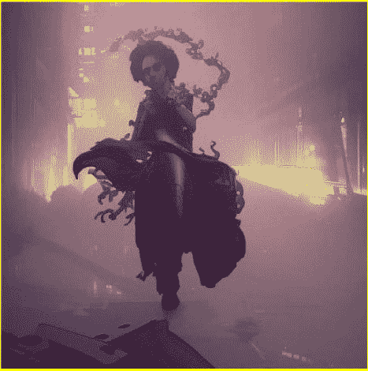

### 第五章

## 在人工智能时代保护知识产权

创造力和沟通的演变带来了一系列新挑战，其中最紧迫的之一就是在人工智能时代保护知识产权。随着技术的进步，创意作品可以被复制和传播的手段也在不断发展，导致在线盗版和盗窃的泛滥。

（在线盗版）

在过去，知识产权主要通过物理手段来保护，比如锁着的门和版权声明。但在数字时代，这些措施已经被证明是不够的。只需点击一下按钮，一个创意作品就可以被复制并分发给全世界数百万人，几乎不可能控制谁可以访问它。

这导致了许多知名案例，艺术家和创作者们的作品被盗用和传播，而没有得到他们的许可。其中一个案例涉及音乐家王子，他曾与在线音乐分享服务 Napster 展开了一场著名的法律战，因为该服务允许用户下载他的歌曲而不付费。

（王子与 Napster 之间的法律战）

但受到风险的不仅仅是个人创作者。主要的娱乐公司和出版社也不得不应对在线盗版的问题，一些估计表明，仅电影和音乐行业每年因盗版内容而损失数十亿美元。

随着人工智能的不断发展，保护知识产权的问题只会变得更加紧迫。由于 AI 技术能够生成新内容，原创和衍生之间的界限变得越来越模糊。这导致呼吁为创作者提供更大的法律保护，以及为保护创意作品而采取新技术和策略。

近年来获得关注的一个解决方案是使用区块链技术。在其核心，区块链是一个分散的账本，允许对交易进行安全和透明的跟踪。通过将创意作品嵌入到这个账本中，它变得更难以未经许可复制或分发。这使创作者能够保留对他们作品的控制，并确保他们公平获得报酬。

这种情况的一个例子是平台 Arianee，它利用区块链技术为创作者提供了一个安全和可验证的许可方式。通过这个平台，艺术家、音乐家和其他创作者可以轻松设定作品使用的条款，并确保他们得到作品使用的报酬。

另一个例子是平台 Poet，它允许创作者在区块链上为他们的作品添加时间戳和许可证。这不仅确保了作品的保护，还提供了作品创建时间的清晰记录，这在面对抄袭或版权纠纷时可能是无价的。

但区块链技术的好处不仅仅在于简单地保护知识产权。它还有潜力彻底改变我们对创造力和沟通的看法。通过创建一个去中心化和透明的系统来跟踪创意作品，区块链技术为更开放和协作的创意过程提供了可能。

例如，平台 ArtChain Global 利用区块链技术汇集来自世界各地的艺术家，并为他们的作品创建一个市场。这不仅为创作者提供更大的曝光和机会，还创造了一个更多元化和包容性的创意社区。

总之，在人工智能时代，使用区块链技术是保护知识产权的一个有前途的解决方案。通过将创意作品嵌入去中心化账本，创作者可以保留对自己作品的控制，并确保他们得到公平报酬。但除了简单地保护知识产权外，区块链技术还有潜力彻底改变我们对创造力和沟通的看法。随着越来越多的创作者转向这些平台，我们可以预期看到向更开放和协作的创意过程转变。

但即使我们努力寻找新的方法来保护知识产权，重要的是要记住创造力和沟通是人类经验的核心。从文明的早期开始，我们就利用我们的想象力和分享思想的能力来创造和创新。随着我们进入人工智能时代，我们有责任找到方法来保护丰富我们生活的创意作品，同时确保它们对所有人都是可访问的。
