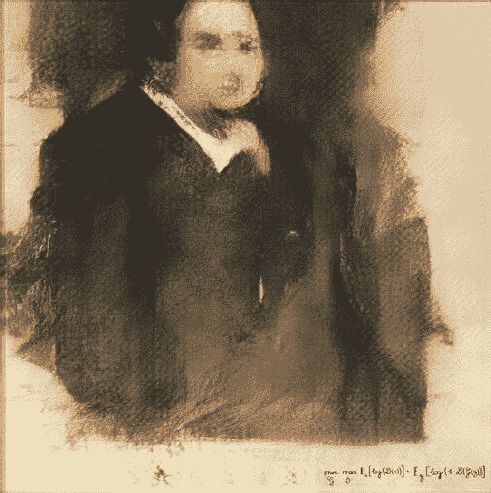
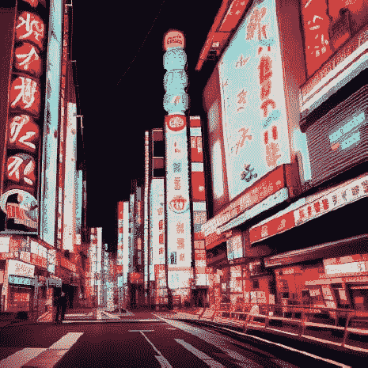
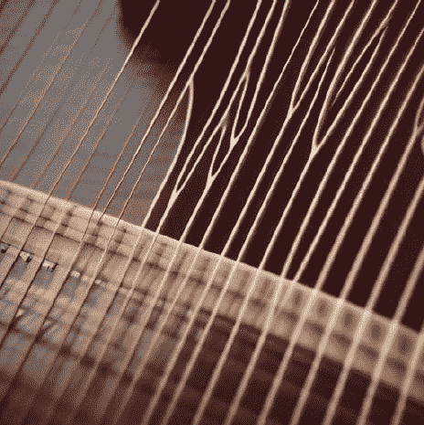

### 第六章

## 探索创造力和人工智能的共同演化：缺失的主题和未来影响

本书章节讨论了创造力和人工智能的共同演化，包括人工智能在创造过程中的作用，利用人工智能在创意努力中的潜在益处和弊端，人工智能在创造力中的伦理影响，创造力和人工智能在特定行业中的共同演化，以及人工智能对文化表达的影响。本章还考虑了创造力和人工智能的未来，包括人工智能取代或增强人类创造力的潜力，人工智能在民主化创造力中的作用，以及人工智能对创意经济的影响。本章还探讨了人工智能为创意专业人士和更广泛社会带来的挑战和机遇。

• 人工智能在创造过程中的作用：人工智能如何影响人类创作艺术、音乐和其他形式的创意表达？利用人工智能在创意努力中的潜在益处和弊端是什么？

• 创造力和人工智能的未来：人工智能将如何继续塑造我们未来创作和交流的方式？人工智能最终会取代人类创造力，还是会以新的方式增强和提升人类创造力？

• 人工智能在创造力中的伦理影响：随着人工智能在创造过程中变得更加普遍，需要考虑哪些伦理问题？我们如何确保人工智能在创造领域中被道德和负责任地使用？

• 创造力和人工智能在特定行业中的共同演化：人工智能如何影响广告、设计和音乐制作等领域的创意专业人士的工作方式？这些行业中人类与人工智能成功合作的一些例子是什么？

• 人工智能对文化表达的影响：人工智能如何影响不同文化创作和交流的方式？人工智能对世界各地创意专业人士提供了哪些独特的挑战和机会？

人工智能在创造过程中的作用：人工智能如何影响人类创作艺术、音乐和其他形式的创意表达？利用人工智能在创意努力中的潜在益处和弊端是什么？

人工智能在创造过程中的作用：

人工智能对人类创作艺术、音乐和其他形式的创意表达方式产生了重大影响。其中一个例子是人工智能在音乐创作中的应用。许多艺术家和音乐家现在正在使用人工智能算法生成新的旋律、和声和节奏。例如，软件程序 Jukedeck 允许用户输入所需的情绪或流派，然后根据这些输入生成一首独特的音乐作品。

人工智能也被用于创作视觉艺术。例如，由人工智能驱动的艺术平台 Deep Dream 允许用户输入一张照片，并基于该图像生成一幅独特的艺术作品。同样，由人工智能驱动的艺术集体 Obvious 使用算法创作了一幅肖像，该作品在拍卖会上以超过 432,000 美元的价格售出。

(Edmond Belamy 的肖像，维基百科：https://en.wikipedia.org/wiki/Edmond_de_Belamy)

除了创作新形式的艺术和音乐外，人工智能还被用来帮助人类更高效、更有效地创作。例如，像 Adobe Sensei 这样的人工智能设计软件可以分析用户的设计选择，并提出更具视觉吸引力的替代方案，为设计师节省时间和精力。

在创意工作中使用人工智能的潜在好处是多方面的。人工智能可以帮助人类更快速、更高效地生成新的想法和创意解决方案。它还可以帮助人类创作更多样化和创新的艺术作品、音乐和其他形式的创意表达。此外，人工智能还可以帮助人类扩大他们的创造产出，让他们在更短的时间内创作更多内容。

然而，在创意工作中使用人工智能也存在潜在的缺点。一个担忧是人工智能最终可能取代人类在某些创意角色中的地位，导致失业和人类创造力的下降。此外，还存在这样的风险，即人工智能生成的内容可能缺乏人类创作内容的真实性和独特性，导致创意表达的同质化。最后，还有一个伦理问题，即人工智能可能被用来创作具有偏见或误导性的内容，给社会带来负面后果。

创造力和人工智能的未来：人工智能将如何继续塑造我们未来创造和交流的方式？人工智能最终会取代人类的创造力，还是会以新的方式增强和提升它？

创造力和人工智能的未来是一个备受争议和猜测的话题。有些人认为人工智能最终会取代人类的创造力，而另一些人认为它将以新的方式增强和提升人类的创造力。

创造力和人工智能未来的一个可能性是，人工智能将成为人类在创意过程中使用的强大工具。例如，人工智能可以用于生成人类可以进一步建立和发展的新想法或概念。这在广告等领域尤其有用，那里生成新颖和创新的想法对成功至关重要。

另一种可能性是人工智能最终会超越人类的创造力，成为创意产出的主要来源。这可能导致一个世界，人类依赖人工智能来创作艺术、音乐和其他形式的创意表达。虽然这种情景确实可能发生，但也颇具争议，因为它引发了关于在一个由机器驱动创造力的世界中人类角色的问题。

最终，创造力和人工智能的未来很可能是这两种可能性的结合，人工智能在某些情况下增强和提升人类创造力，在其他情况下取代它。关键在于找到一种平衡的方式来在创意过程中使用人工智能，使其既有利于人类又有利于机器。

AI 在创造力领域的道德影响：随着 AI 在创造过程中变得更加普遍，有哪些道德考虑需要纳入考虑？我们如何确保 AI 在创造力领域的道德和负责任使用？

AI 在创造力领域的一个主要道德影响是 AI 可能取代人类工作。随着 AI 变得更加先进，它可能能够执行以前被认为是人类领域的创造性任务，比如创作音乐或创作视觉艺术。这可能导致人类创意专业人员的替代，因为公司可能选择使用 AI 而不是雇佣人类工作者。

为了确保 AI 在创造力领域的道德和负责任使用，重要的是考虑对人类工作者的潜在影响。这可能包括确保 AI 的使用方式是为了补充和增强人类创造力，而不是取代它。还可能需要考虑诸如再培训计划或其他支持措施，以帮助可能受到 AI 在其行业中使用影响的人类创意专业人员。

另一个道德考虑是 AI 可能延续数据中存在的偏见。例如，如果 AI 系统是在一个严重偏向某种种族或性别的数据集上训练的，它可能会产生以同样方式有偏见的创造性产出。为了解决这个问题，重要的是确保用于训练 AI 系统的数据集是多样化的，并代表了广泛的观点。

通信和创造力的演变在人类历史上经历了许多曲折，从最早的洞穴壁画到如今。在这一演变中，最近的一个发展是在各种场景中使用自然语言生成（NLG），包括工作场所、学校和社交媒体。

在工作场所，NLG 有潜力彻底改变我们彼此之间的沟通和协作方式。例如，NLG 可以用于生成报告、电子邮件和其他书面文件，从而为员工节省时间，让他们专注于其他任务。然而，在工作场所使用 NLG 时也需要考虑道德问题。一个问题是 NLG 可能被用来自动化目前由人类工作者执行的任务，可能导致工作岗位的替代。此外，如果没有得到适当监控和监管，NLG 可能被用来产生有偏见或误导性内容。

在学校中，自然语言生成（NLG）可以用于帮助学生生成书面作业和项目，让他们更多地专注于批判性思维和分析，而不是花时间在单调的写作任务上。然而，在教育中使用 NLG 时也有道德方面的考虑。一个关注点是学生可能过于依赖 NLG，失去在写作中创造性和有效表达的能力。此外，学生可能利用 NLG 作弊，这可能会破坏教育系统的完整性。

在社交媒体上，NLG 可以用于生成对评论和消息的自动回复，使个人和组织能够跟上高交互量。然而，在这种情况下使用 NLG 时也有道德方面的考虑。一个关注点是 NLG 可能被用于传播错误信息或宣传，特别是如果没有得到适当的监控和监管。此外，NLG 可能被用于冒充其他个人或组织，这可能会导致混淆和不信任。

总的来说，人工智能在创造性方面的道德影响是复杂而多方面的，对于创意产业的利益相关者来说，认真考虑这些问题将是至关重要的，因为人工智能在创造过程中变得更加普遍。

在特定行业中创造性和人工智能的共同演化：人工智能如何影响了广告、设计和音乐制作等领域的创意专业人士的工作方式？这些行业中人类与人工智能成功合作的一些例子是什么？

（未来主义广告东京霓虹灯）

创造性和人工智能的共同演化对包括广告、设计和音乐制作在内的各个行业产生了重大影响。在广告行业，人工智能已被用于分析消费者数据和创建定向广告。例如，人工智能算法可以分析在线行为和购买历史，创建更可能有效的个性化广告。在设计行业，人工智能已被用于自动化某些任务，更快速、更高效地创建设计。例如，人工智能算法可以根据特定的输入标准生成标志或布局，让设计师有更多时间专注于更复杂的任务。

在音乐行业，人工智能已被用于创作和制作音乐。例如，人工智能算法可以分析不同的音乐风格，并根据这些风格创作原创作品。人工智能也被用于分析消费者数据，预测哪些歌曲可能会受欢迎，帮助唱片公司和艺术家更明智地决定发布和推广哪些歌曲。

在这些行业中，人类与 AI 之间有许多成功的合作。例如，在广告行业，人类创意团队与 AI 算法合作创建了针对性强、个性化的广告，极大地推动了消费者参与度。在设计行业，人类设计师与 AI 算法合作自动化某些任务，更高效地创建设计，使他们能够专注于更复杂的任务。在音乐行业，人类音乐家与 AI 算法合作创作和制作音乐，产生了广受欢迎的原创作品。总的来说，创意与 AI 的共同演进使这些行业的创意专业人士能够更高效、更有效地工作，产生更成功和创新的成果。

AI 对文化表达的影响：AI 如何影响不同文化创作和交流方式？AI 对世界各地创意专业人士提出了哪些独特挑战和机遇？

AI 对文化表达的影响因特定文化及其如何将 AI 融入创意实践而异。在某些情况下，AI 被用于增强和提升传统文化表达，例如通过创建古代文本或乐器的数字版本。例如，AI 被用于转录和翻译古梵文文本，使其更易于学者和普通大众获取。AI 还被用于创建传统乐器的数字版本，如古筝，使音乐表演更加灵活多样。

（数字古筝）

另一方面，AI 也被用于创造全新形式的文化表达，如 AI 生成的音乐或艺术。例如，一种名为 AIVA（人工智能虚拟艺术家）的 AI 系统已被用于创作各种流派的原创音乐，包括古典和电子音乐。AI 还被用于生成原创绘画和雕塑，一些 AI 生成的艺术品已在画廊展出并以高价售出。

AI 对世界各地创意专业人士提出的独特挑战之一是 AI 有可能取代创意产业中的人力。这在创意产业是主要就业和经济活动来源的国家尤为重要。例如，AI 生成的音乐或艺术有可能取代人类音乐家或艺术家，导致失业和创意经济的衰退。

另一方面，AI 也为世界各地的创意专业人士提供了独特的机会。例如，AI 可以用于自动化创作过程中的某些任务，从而节省时间和资源用于更具创意性的工作。AI 还可以用于扩大创意作品的影响力，通过使其在不同语言或格式中可用。通过这种方式，AI 可以帮助世界各地的创意专业人士吸引新的观众和市场。

人工智能（AI）显著影响了人类创作艺术、音乐和其他形式的创造性表达方式，既通过生成新内容又通过增强人类在创作过程中的效率。虽然利用 AI 在创意工作中存在潜在的好处，比如产生新想法和增加产出，但也存在着对工作岗位的担忧、创意表达的同质化以及伦理问题。创意和 AI 的未来是不确定的，但很可能 AI 在某些情况下会增强和提升人类的创造力，在其他情况下会取代人类的创造力。在创意中使用 AI 时的伦理考虑包括偏见、问责制和对社会可能产生负面后果的潜力。对于在创作过程中使用 AI 的个人和组织来说，考虑这些伦理影响并确保道德和负责任地使用 AI 是非常重要的。
