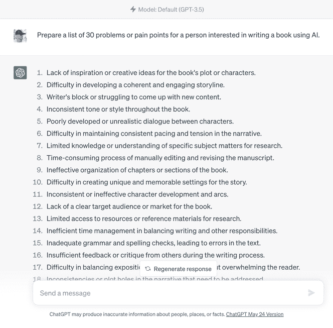
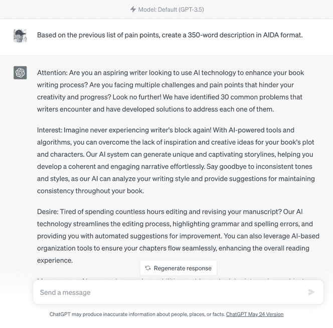
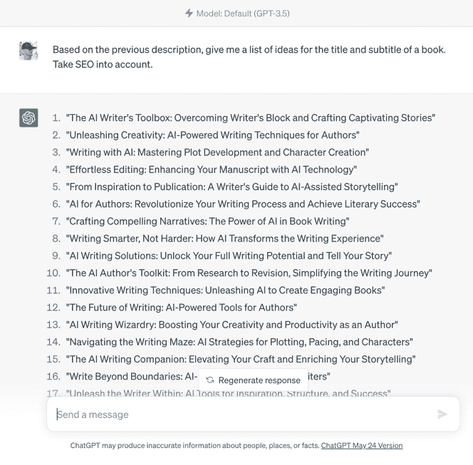
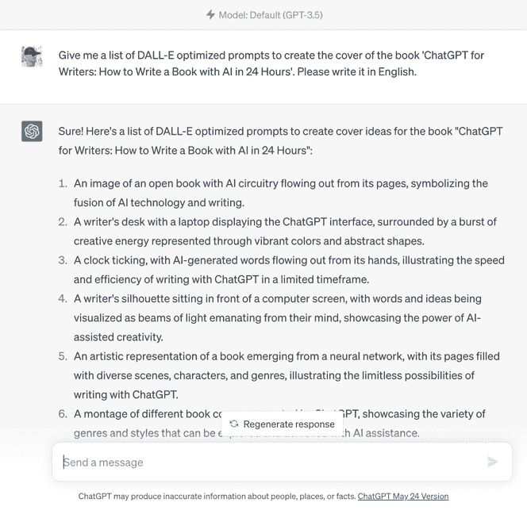
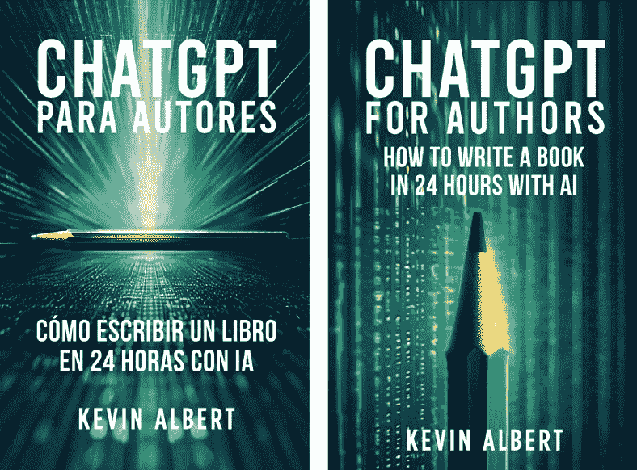

# （一）

介绍我坐在电脑前几个小时，盯着一张空白的 Word 文档。文字就是无法流畅地表达出来。这并不是什么新鲜事；称之为写作障碍，称之为缺乏灵感，称之为- 我不知道- 星期一……无论如何。关键是我被困住了。而且很生气。怎么可能有能够从头到尾清洁你的房子，或者开着卡车行驶数百英里的机器人，却没有一个能帮助我写书的？即使只是一点点。在那一刻，我几乎无法想象接下来会发生什么。而且它将会改变世界。欢迎来到一个新的现实！人工智能（AI）和 ChatGPT 的现实。一个现实，终于，机器可以写书。而且不只是一点点。我不是说的是数百个机器人坐在工厂生产线前面的打字机。不，事实既不那么戏剧性，又更加革命性。当我们谈论写作领域的 AI 时，我们谈论的是可以生成内容、编辑、校正甚至帮助你销售书籍的技术。我们谈论的是 ChatGPT。简单来说，ChatGPT 是一个经过大量信息训练的 AI 工具，旨在理解你的问题并提供相关的连贯答案。一个虚拟助手，你可以向它提问，请求帮助完成不同的任务，或者只是进行对话。就像一个超级记者，可以以疯狂的速度写作，质量让许多人只能梦寐以求，而且它不需要休息伸展腿，看看冰箱里有什么，或者查看它最新的 ins 帖子获得了多少赞。这就是许多人开始冷汗淋漓的地方。这是否意味着我们作家将被这种新技术取代？就我个人而言，我不这么认为。至少，还没有。目前，ChatGPT 存在着缺陷：它可能会给出错误的答案，缺乏创造力和主观性，它的上下文理解能力有限，知识也不是最新的。但不要低估它的潜力。只需将 AI 视为需要训练的小狗。如果给它正确的指导和指令，那么可能性是无限的。我们需要教它礼貌，阻止它咬邻居。你可能会想：“又要学习如何使用另一个工具？我已经没有耐心了！”。但不用担心- 恰恰相反。一方面，要充分利用 ChatGPT，你不需要成为 ChatGPT 专家。记住，它被设计来理解你，虽然你可能随着时间和实践而变得更加熟练，但你可以从第一分钟开始利用它。另一方面，ChatGPT 将成为优化你时间的强大盟友，照顾最繁琐的任务，加快流程，让你把时间专注于真正对你重要的事情。或者你想做什么。当 ChatGPT 决定逗号和撇号放在哪里时，为什么不看一集 Netflix 呢？我不认为 AI 来取代我们的工作。至少不是我们所有人。如果我们能够适应并充分利用它，它将帮助我们改善我们的职业，进而提高我们的生活质量。把它看作是你的新���作助手，就像一个热情的实习生，不需要咖啡，也不需要弄清楚他们的工作与生活的平衡。所以，无论你是畅销书作家还是渴望成为一名作家，或者你只是喜欢将技术和写作结合起来的想法……做好准备！你即将踏上一段激动人心的旅程，在这里你将发现人工智能将如何改变我们所知道的世界。也许我们已经到达了历史上一个写作好不再足以在文学界取得胜利的时刻。也许，正如演化向我们展示了数百万年一样，胜出并赢得战斗的不是最优秀的人，而是最能适应变化的人。不要被抛在后面。让我们开始吧！

第一章 ChatGPT：作家的最佳盟友正如我在[自助出版秘诀](https://soykevinalbert.com/sps)中所解释的，每位作家，无论是纽约时报畅销书作家还是刚入行的新手，都会面临或将面临一系列共同的障碍：创作瓶颈、冒名顶替综合症、缺乏时间或动力……问题不胜枚举。如果我告诉你，你不再需要独自面对这些可怕的障碍了呢？想象一下：你在工作中度过了漫长的一天，大脑筋疲力尽。你最不想做的事情就是坐下来写作。但你向自己承诺过，或向编辑承诺过，如果不想晚上床上感觉自己像个失败者，或者更糟糕的是，因为没能按时完成任务而失去工作。你盯着闪烁的光标，内心尖叫：“我希望有人能帮帮我！”。那么，欢迎你的新朋友和同事，ChatGPT。无论你决定清晨起床还是熬夜写作，ChatGPT 都将是你的闪亮骑士。你只需写几个字，人工智能就会开始工作，为你写出前几段或提出一系列启发你的想法，让你摆脱困境。这就像有了个私人教练，只是这个教练不会一直让你做俯卧撑。但假设你的文字写得很顺利，写得足够多以取得良好进展。即便如此，你仍然觉得有些地方不对劲。你写、删除、修改，反复无常。欢迎来到我“最喜欢”的障碍：完美麻痹。我的同样完美主义者，深呼吸。ChatGPT 来拯救你了。对某段落或章节不满意？没问题。请 ChatGPT 为你重写，直到它提出一个最终让你内心的完美主义者安静下来的版本。已经读了二十遍以上你的书，寻找错误或拼写错误？试着让 ChatGPT 检查你的文本。你会惊讶于它能够纠正和发现即使是最有经验的编辑也难以发现的小错误。不信？把你已经出版且认为“完美”的书放到 ChatGPT 中，告诉我你的想法。我们不能忘记我在客户中看到的最常见的障碍之一：冒名顶替综合症。这种认为自己是骗子的信念，无论是因为对自己写作技能的不安全感，还是因为质疑自己作品的质量。也许 ChatGPT 可以帮助你摆脱内心的怀疑（尽管这可能是心理教练或心理学家的工作），但它肯定可以以多种不同的方式帮助你继续写作过程：

+   提供即时反馈：ChatGPT 可以对你的写作提供即时评论。这可以帮助你找出需要改进的地方或作品的优点，增加你的信心和技能。

+   协助编辑和核对：编辑和核对是任何写作过程中至关重要的步骤。ChatGPT 可以帮助你完善你的作品，确保你的写作清晰连贯。

+   信息核实：ChatGPT 可以成为一个很好的事实核查工具 1。如果你对信息的准确性有疑问，你可以使用 ChatGPT 来核实事实，并确保你的写作得到准确、最新的信息支持。

+   打破对天赋的信念：ChatGPT 可以帮助你理解写作是一个可以通过练习和奉献学习和完善的技能，而不是只有少数特权人士才拥有的天赋。

最后，我们都在与之抗争的一件事情——不仅仅是在写作时——就是缺乏时间或动力。我知道，特别是当你不是以写作为生计时，找到时间来写作可能会带来真正的挑战。以前，我可能会同意你的观点：在一天中抽出你所拥有的少许空闲时间坐在电脑前，最终却写得寥寥无几会让任何人感到沮丧。但现在，有了 ChatGPT，就没有借口了。以前两个小时都做不到的事情，现在你可以轻松在半小时内完成，让你有时间做你真正想做的事情。此外，每天花两个小时盯着空白屏幕不同于看着你的书在你眼前逐渐成形。我向你保证，从中获得的动力会让你想花更多时间写作，即使你不必这样做。简而言之，把 ChatGPT 看作是你的同事、副驾驶员或在对抗写作挑战时的秘密武器。就像任何好的同事一样，它不是来取代你的。相反：它在这里支持你，补充你，也许在你需要时给你一点踢屁股的动力。记住，作为作家最好的事情就是……写作。所以让我们让这个过程变得更加愉快、有趣，比以往任何时候都更容易。

第二章 通过 ChatGPT 加速和优化你的写作现在，我们清楚了 ChatGPT 如何帮助你克服各种问题和障碍，这些问题和障碍或多或少都是所有作家面临的。但帮助我们克服障碍并让你写作是一回事，而提高你所写内容的质量则是另一回事。让我们直奔主题：ChatGPT 真的能帮助你释放内心的莎士比亚吗？毫无疑问。记住，写作成功更多地取决于应用有效的系统和方法，而不是一些“天赋”。这些可能包括：在开始写作之前的研究过程，制作思维导图和详细计划，或使用特定的角色或情节发展技巧等。与作家的障碍不同，优化和加速写作过程的策略在虚构和非虚构作家之间有很大差异。前者面临的最大挑战在于发展角色和故事，而后者的成功关键在于良好的研究和信息组织。因此，我们将分别看看 ChatGPT 如何帮助我们两者。虚构作家的 10 个惊人的 ChatGPT 提示对于虚构作家，主要挑战在于赋予角色生命。他们需要行走、说话、爱、恨，并经历与手持书籍的读者一样真实而深刻的转变。情节需要像蜘蛛网一样错综复杂，每根线都需要引导读者走向故事的核心。这就是 ChatGPT 的用武之地。AI 不仅可以帮助你构建叙事和对话，还可以帮助探索你角色的不同面貌。把它想象成你自己的个人西拉诺·德·贝尔杰拉克，耳边低语着优雅的对话：

1.  情节创意：ChatGPT 就像一盒巧克力：“你永远不知道会得到什么。”向它要点子，它可能告诉你一个关于恐龙之魂回归统治地球的故事，或者关于一个能将物体变成食物引发全球经济危机的女人的故事。这是 ChatGPT 刚刚从简单提示“给我两个关于一本书情节的疯狂想法，每个最多二十个字”的真实例子。

1.  角色发展：在为角色塑造形象方面遇到困难？ChatGPT 可以成为你的选角导演。给它一些你角色的特征，比如勇敢、聪明或冲动，然后就大功告成。ChatGPT 会比罗宾·威廉姆斯的即兴表演更快地提供角色背景。

1.  对话创作：你的角色不想聊天？没问题。只需指定他们的特征和当前情况，让 ChatGPT 为他们提供声音。不再尴尬的沉默！

1.  不同写作风格的运用：是否曾想过像海明威一样写作，但发现自己无法摆脱狄更斯式的冗长？ChatGPT 来拯救你。给它一个句子，让它用不同的风格重写。你会看到你的句子如何变成文学变色龙。

1.  生成场景和描绘：闭上眼睛。想象一下你身处月光下的森林，脚下的叶子在哗哗作响，远处有猫头鹰在呼唤。你是否觉得很难进入状态？向 ChatGPT 要求用文字描绘场景，你会感觉自己就在那片森林中。真的，试试看。这是魔幻的。

1.  宇宙构建：如果你在构建你的宇宙时比霍比特人在末日山还要迷茫，ChatGPT 可以成为你的甘道夫。只需给它基本细节，如类型、气候、文化，它将创造一个拥有自己历史、地理和神话的世界。

1.  子情节的发展：一个好故事就像一个交响乐团。乐器越多，旋律越丰富。但协调它们可能会很困难。向 ChatGPT 询问一些基于主要情节的子情节建议，让你的读者沉醉在交响乐中。

1.  情节转折和悬念：有时，我们的想象力需要一点推动来跳出可预测性的悬崖。ChatGPT 可以成为那个小推动力。向它要求根据你当前情节的转折，看看它如何颠覆你的故事，让你的读者目瞪口呆。

1.  替代结局：你是否曾想过如果“罗密欧与朱丽叶”最终私奔到拉斯维加斯会是什么样子？我相信 ChatGPT 可以为你想象出来。告诉它你的故事，并要求一个不同的结局。谁知道，你可能会得到一个续集！

1.  Beta 读者模拟：ChatGPT 可以成为你的个人 Beta 读者，检查你的草稿，寻找不一致或情节漏洞。它可能不会在你悲惨的结局时哭泣，但我相信它会告诉你，如果你的主角在连续三章中把名字改成你前任的名字。

非虚构作家的 10 个惊人 ChatGPT 提示对于非虚构作家，挑战在于基于大量信息构建连贯、有说服力的叙述。他们的成功取决于他们勤奋研究和组织发现的能力。这就是 ChatGPT 在雾夜中如灯塔般闪耀的地方。它帮助你组织你的想法，以清晰易懂的方式呈现信息，并确保你没有漏掉任何关键点：

1.  自动化研究：你是否害怕花费数小时在谷歌上搜索和比较信息的想法？ChatGPT 将成为你的个人福尔摩斯。问它任何问题，它将立即给你详细的答案。你需要为下一部浪漫小说记录维京时代的生活吗？没问题！

1.  确定目标受众：了解你写作的对象是至关重要的，以确保你的内容相关且吸引人。如果你不确定你的目标受众是谁，ChatGPT 可以帮助你根据你的书籍内容、人口模式和市场行为来定义。

1.  结构建议：您是否曾感觉自己在章节中玩“探戈”？不知道在哪里插入关于您的宠物的巧妙轶事？ChatGPT 可以帮助您。就像拥有一位专业编辑一样。告诉它您想要实现什么，您将看到它如何帮助您为您的书籍制定一个合理的结构。

1.  总结或扩展信息：您的书的某一章比其他章节长得多，但您不知道如何减少字数？请 ChatGPT 帮助您总结。您甚至可以告诉它您希望有多少字数。您是否有另一章需要添加以达到所需长度？ChatGPT 将帮助您扩展它至您想要的程度。

1.  示例和案例研究：您是否发现很难找到相关、有说服力的例子来支持您的论点？ChatGPT 可以为您生成与您主题相关的案例研究的想法和大纲。确保您要求它牢记您工作的背景和目的。

1.  参考和可靠来源：您是否担心没有足够的时间找到并验证您的来源？ChatGPT 可以编制一份对您的书有用的来源列表。尽管如此，请记住要亲自验证和批准您的所有来源。

1.  练习和活动：如果您的书具有教育性质，您可能需要活动来吸引读者并帮助他们应用所学知识。ChatGPT 可以帮助您设计创造性和有意义的练习，丰富您的内容。就像拥有一位教授一样！

1.  生成吸引人的标题和副标题：您是否发现很难创建那个完美代表您的书并引起读者兴趣的标题？ChatGPT 可以准备一系列吸引人的想法。您甚至可以要求它牢记您的目标受众或告诉它不要忘记 SEO！

1.  封面和插图的想法：虽然它不能为您绘制插图，但 ChatGPT 可以帮助您根据您的书和目标市场当前的偏好想出封面设计的想法，或者最适合每一章的插图。

1.  促销文案：您知道书籍成功的主要因素之一是推广文案吗？与其局限于撰写一个乏味、无聊的描述，即使是您的母亲也会犹豫购买您的书，不如请 ChatGPT 创建一个吸引读者兴趣的描述。尝试要求它按照特定结构撰写，如文案撰写或说服性写作，比如：AIDA！

正如您所看到的，ChatGPT 不仅是一种写作工具：在写书时，它是您自己的超能力。这种超能力将帮助您达到新的生产力、创造力和速度水平。

第三章人性化你的手稿我们已经看到 ChatGPT 如何帮助你克服典型的写作障碍，优化和加速你的写作过程，让你成为一个常规的“类固醇莎士比亚”。太棒了。但是，信不信由你，快速而优秀地写作可能还不够。我相信你不止一次仅仅因为是谁写的而购买了一本书。对吧？因为当一个作者能让我们爱上他们的风格或个性时，他们就永远赢得了我们的心。这就是为什么给你的文本增添人情味如此重要，如果可能的话，还要有独特的声音。那么，你该如何做到这一点？如何确保你的作品保持人性化？让我们从基础开始：语调、节奏和词汇。这些的结合将定义你的风格，并以正确的比例混合，将与你的读者建立情感联系，吸引他们并让他们回头阅读更多。首先，我们有语调。你的写作语调就像电影场景中的背景音乐。它营造氛围。如果你是一位写作励志自助书籍的非虚构作家，你可能希望有一个积极、建设性的语调。如果你是一位小说作家，你可能更喜欢浪漫、神秘的语调。关键是确保 ChatGPT 理解你想要的语调。为此，给它一些以该语调写成的文本示例。然后，我们有节奏。你文学交响乐的节拍。有些人喜欢快速而间歇性的，像惊悚片。其他人更喜欢温和、流畅的风格，像文学杰作的宁静之美。无论如何，一旦你明确了你希望你的作品具有的节奏，只需询问 ChatGPT，它将根据你的指示生成文本。最后，我们有词汇：你最喜欢的词或最能代表你的词。好或坏，ChatGPT 还不能读懂你的思想（但愿）。但是，当然，你可以训练它。在提示和指示中明确使用你最喜欢的词，或直接要求它分析你写的文本或你试图模仿的作者写的文本的摘录。但请记住，尽管语调、节奏和词汇是赋予你的文本人性化的关键元素，但有一些更深层次的东西你不能忘记：你的创造灵魂。你的经历、思想和感情才是真正赋予你的写作生命的东西。ChatGPT 可以提供文字，但其背后的本质和意义来自于你。为了帮助你的写作助手了解你的内心世界，不要犹豫与它分享你的想法、思想和最深层的情感。别担心，ChatGPT 被编程保护你的数据的机密性。因为人性化你的书不仅仅是赋予你的写作个性化的语调、节奏和词汇，而是将你的灵魂融入你选择的文字和决定分享的思想中。ChatGPT 是这个旅程中的强大盟友，但永远记住它只是一个工具：真正的作者永远是��。最重要的是你与读者建立的关系。让他们在阅读每个字时感受到你，让他们了解你，并在每一行和每一个想法中认出你。这样，你不仅仅是在写作——你正在与世界分享自己的一部分。不要害怕脆弱、真实、人性化。因为这才是真正将作家与文本生成器区分开的东西。当你的读者阅读你的文字时，让他们看到你，而不仅仅是纸页上的字母。让他们看到你内心的火花。

第四章使用人工智能创建独特封面想象一下，借助 ChatGPT 的帮助，你终于完成了你的杰作。情节、人物、情感...一切都被完美地设计和构建了。但封面呢？你忘了吗？记住，一个好的封面可以决定一本书的成功与失败。无论我们如何努力避免，无论伤害有多深，事实是我们无法不以貌取书。如果 ChatGPT 在帮助你在短时间内写出一部真正的杰作后，还能帮助你处理这个重要元素，那岂不是太神奇了？毕竟，一本没有封面的书是一本未完成的书。然而，正如我们在第二章看到的，ChatGPT“只能”为你的封面提供想法。它不能设计封面本身。但你可以要求它为每个想法准备描述或详细提示，然后你可以使用其他令人惊叹的人工智能工具来设计你的封面。我说的是最近变得如此流行的 AI 图像生成程序：DALL-E、Midjourney、必应图像创作者...名单还在继续。你所要做的就是复制 ChatGPT 为你生成的封面描述，粘贴到这些图像生成程序中的一个，然后 - 就像魔术一样 - 你的封面将在不到五秒钟内准备好。对第一个结果不满意？回到 ChatGPT，告诉它你不喜欢什么，并要求它生成一个新的描述。或者你可以尝试使用它准备的其他想法。此外，我建议你用不同的 AI 图像生成程序重复这个过程。你可能会喜欢其中一个用于设计逼真封面，而发现另一个更适合插图儿童书籍。如果一开始，你的尝试更像是毕加索的抽象阶段，而不是你心目中的专业封面，不要担心。就像对待 ChatGPT 一样，要想从这些 AI 图像生成程序中获得最佳结果，你需要一点练习。记住，人工智能只是一个工具：达到目的的手段。你是那个给它方向、意义和目的的人。因此，不要害怕尝试，尝试不同的组合，打破常规。要勇敢！为每一幅毕加索画感到自豪。因为每一幅画都让你离那本书的完美封面更近一步。

第五章 ChatGPT 的道德和专业使用点击“生成文本”并在屏幕上立即看到一个完美书写和结构化的段落，你所获得的激励是惊人的。我知道。ChatGPT 的力量真的像魔法一样。但是，正如蜘蛛侠所说，“伴随着强大的力量而来的是巨大的责任”。因此，本章专门讨论了 ChatGPT 在写作世界中的道德和专业使用。让我们首先谈谈与读者的透明度。你的读者信任你，你应该向他们保持诚实。就像你认可编辑、插图师或翻译员的宝贵贡献一样，你应该承认 AI 对你的工作所做出的贡献。为什么呢？因为诚实不仅是最好的政策，而且是唯一的政策，尤其是在专业写作方面。你不需要在封面上写上“使用 ChatGPT 写作”。在致谢、前言或致谢部分简单地提及即可。我相信你的读者会欣赏你的透明度。他们甚至可能会觉得这个想法很迷人。让我们来看看责任。当你使用 AI 创作故事时，让 ChatGPT 掌舵是很容易的。但作为作者，你有责任保证信息的真实性，确保内容与你的道德价值观一致，并在你的工作中保持高水平的质量。如果你发现文本中有错误、错误的信息、冒犯性或歧视性内容，或者与你的信息不符合的内容，那么你有责任进行审查和更正。记住，你，只有你，是你的船长。最后，我们不要忘记版权和知识产权。这是一个敏感的领域，因为法律跟不上新技术。虽然 ChatGPT 很不可能会字面上复制受版权保护的材料，但你应该记住并确保你的书籍不会抄袭任何先前发表的作品，即使是部分抄袭也不行。话虽如此，由 ChatGPT 生成的内容往往被认为是新的和独特的，因此你可以将其视为自己的作品。但请记住，如果有疑问，最好的做法是寻求法律建议。作为一个通则：尊重他人的创造性工作，就像你希望别人尊重你自己的工作一样。简而言之，使用 AI 写作意味着进入未知领域，这需要作者承担一种新类型的责任。诚实地对待你的读者，承担创造性责任和尊重版权是这个 AI 辅助写作新时代的基本方面。如果你坚持这些原则，你可以充分利用这项强大的技术，而不会失去作为作者的诚信。亲爱的作者，这应该是你的最终目标。

第六章被动收入和 ChatGPT

结论我们已经到达了旅程的终点。这是一段令人兴奋的旅程，在这里我们分析了人工智能的影响以及在写作领域的实际用途。在这段旅程中，我们看到了 ChatGPT 如何帮助你克服每位作家在文学生涯中所面临的障碍，以及如何改善和加快你的写作过程。我们惊叹于你如何能够在每段自动生成的文字中注入自己的声音和风格（或者你最喜欢的作家的声音和风格），并学会了如何用几次点击创建独特的书籍封面。此外，你知道如何利用这项新技术通过自助出版来创造和增加 passsive income。而且所有这些都是在道德、专业的前提下，尊重版权。没有人知道这项新技术会带来什么，以及它将如何改变我们的生活。它可能不会对每个人产生相同的影响，而一些人会知道如何充分利用它并享受其无数的优势，而其他人可能无法适应并遭受后果。幸运的是，你手中拿着这本书意味着你是第一批人中的一员：那些正在准备、积极主动并预见变化而不是害怕变化的人。而这，我的朋友，让你处于一个特权地位，能够利用和享受这场地震般的技术变革即将在我们所知的现实中释放的奇迹。我们即将在人类故事中写下新的篇章。你将扮演什么角色取决于你。4 月 25 日 - 晚上 10:00

如何在 24 小时内使用 ChatGPT 写书什么？我们还没完成吗？我把章节搞混了吗？用《蝗虫卡布林》6 的话来说：“冷静！别慌！”。一切都在掌控之中。一切都在它应该在的地方。这本书是我喜欢做的那些实验之一。我不喜欢简单地告诉你事情，或者仅仅限于给出我的观点或总结你可以轻松在谷歌上找到的东西。因为你迄今为止读到的一切都是由 ChatGPT 写的。你是否想知道书的开头和这一章的日期和时间是什么意思？我想知道你是否开始串联起来了。实际上，它们是我开始写这本书和完成它的日期和时间，就像我一天前决定的那样。让我解释。几周来，我一直在阅读和听取许多自我出版专家告诉他们的追随者，ChatGPT 没问题，但他们无需担心；它对作家没有威胁。怎么回事？它可能对每个作家都不构成威胁，但当然，对许多人来说会构成威胁。特别是那些安于现状，不与时俱进的人。我没有在社交媒体上进行辩论，试图反驳他们的论点，而是想到了创作这本书……并证明它。整天都在脑海中盘旋着这个想法，4 月 24 日晚上，当我已经躺在床上准备睡觉时，我转向我的女朋友玛雅，说：“明天我会在你起床时醒来。”第二天，玛雅将在早上 6 点准备上班，直到晚上才回家。所以我决定在她回家前的 10 点之前起床写一本书，并出版！- 使用 ChatGPT。你手中拿着的这本书就是那个实验的结果。你能想到一个更好的方式来展示 ChatGPT 的潜力以及不要落后的重要性吗？既然你已经读到了这本书的这一部分，我猜你至少觉得它还算可以（这是目标），所以我将向你解释我是如何做到的，一步一步地，这样你也可以在不到二十四小时内写作、出版和销售（是的，销售！）一本书。让我们开始吧。这个过程非常简单，几乎和我跟随所有其他书籍的步骤一样——只是这一次，是 ChatGPT 跟随我的 10 个出版书籍步骤之一：

1.  研究（15 分钟）

1.  描述（15 分钟）

1.  标题（15 分钟）

1.  封面（1 小时）

1.  出版物 1/2（15 分钟）

1.  目录（15 分钟）

1.  写书（1 小时）

1.  编辑（5 小时）

1.  布局（1 小时）

1.  出版物 2/2（5 分钟）

研究（15 分钟）与我第一本书[品牌秘诀](http://soykevinalbert.com/bs)不同，其研究过程持续了几年，这次只花了我十五分钟。考虑到我的书的主题已经很明确（否则，我可以向 ChatGPT 寻求想法），我需要做的第一件事是研究市场并了解我的目标客户或潜在读者。为此，我只需要让 ChatGPT 准备一个包含三十个关于使用人工智能写书的人的问题或痛点的清单，然后从中选择我认为最有力和相关的十五个。就是这样。我能深入研究吗？毫无疑问，可以更深入。但对于这本书的目标来说，我已经足够了。记住，一本非虚构书的成功在于其能够兑现承诺：解决读者的问题或减轻他们的痛苦。通过这简单的研究，我知道 ChatGPT 可以解决十个问题。当然，除了教你如何在二十四小时内用 AI 写书。请记住，如果没有 ChatGPT，我建议进行的最低限度研究是阅读关于你想写的主题的三本畅销书，所以我们刚刚节省了几天或几周的密集阅读。描述（15 分钟）基于我想让这本书解决的十五个问题的选择，我让 ChatGPT 按照 AIDA 格式创建了一个 350 字的描述。我只需要在得到的结果中添加问题清单的格式：“如果您是这样的人，这本书适合您……”，三个问题作为标题，以及一个最终的号召行动，我也让 ChatGPT 提供。这样，不到十五分钟，我就得到了一篇用完美的说服性语言写成的描述，能够吸引我的潜在读者的兴趣，并使用与我其他书相同的格式。不错。标题（15 分钟）获取书名和副标题的想法清单就像礼貌地问 ChatGPT 一样容易，它会立即为您提供您需要的任意数量和变体，直到您找到喜欢的组合。但不要让这个过程的速度和简单性减损其重要性，因为一本书的成功始于其标题。记住完美标题的公式 7：FPT = 关键词（SEO）+ 解决方案（痛点）+ 个性+ 时间限制。牢记这一切，在获得最初几个结果后，我只需要要求它给我一个新的清单，这次考虑 SEO。通过这简单的提示，我找到了带您来到这本书的标题，除了个性可能有例外，它符合完美标题的公式的所有要求。封面（1 小时）一旦我选择了一个标题，我让 ChatGPT 给我提供一份书籍封面想法清单，同时优化为 DALL-E8。然后，我复制了这些提示，并将它们粘贴到我在前几天一直在尝试的两个图像生成器中：DALL-E 和必���图像创建器。我最喜欢的结果是由必应图像创建器生成的。有了这个设计，我去了 Photoshop（如果你喜欢，也可以使用 Canva），添加了标题、副标题和作者。考虑到我推荐的下一个最佳选择（性价比）是在[Freelancer](https://www.freelancer.com/)平台上举办一场比赛，大约需要五十美元，持续七天，我们刚刚省下了一些钱和很多等待时间，可以用来销售我们的书。因为一旦你的封面准备好了……您就可以开始销售您的书籍！出版 1/2（15 分钟）甚至还没到上午 9 点，我就出版了我的书！因为使用亚马逊 KDP，在发行日期前最多一年，您只需要：一个标题、一个描述和一个封面。我们在不到三个小时内就实现了这一切。将书籍预售有什么优势？

1.  在完成书籍之前开始产生收入。

想象一下，由于某种原因，你花了一年的时间来完成写作你的书。这是你错过的很多钱（如果读者喜欢你的想法的话）。

1.  验证你下一本书的想法。

你甚至可以使用按点击付费广告（例如亚马逊广告）来监控真实兴趣。小心！如果最终决定不出版，亚马逊将惩罚你，不允许你再次提前预售一本书整整一年。

1.  激励你完成你的书。

激励你，强迫你……你可以怎么称呼。但它确实有效。这也是（不是唯一的）我决定提前预售这本书的主要原因。因为一旦上线，就没有回头的余地。不管发生了什么更重要的事情，事情变得困难，或者我改变了主意……一旦提前预售，我绝不会让亚马逊在任何情况下惩罚我。目录（15 分钟）！根据描述，我让 ChatGPT 为一本 10,000 字的书创建目录。为什么是 10,000 字？因为已经证明，每本 10 到 15 千字的非虚构书籍（也被称为“短篇读物”）都受到欢迎并运作良好。小心！目前，ChatGPT 在处理数字方面并不是很好。再加上，目前它在回答方面有约五百字的限制，你可能会因试图获得你想要的书籍长度而感到沮丧。我是吃了苦头才明白的。专业提示：与其要求 ChatGPT 准备 X 字数的书籍目录，不如要求它准备 X 章或小节的书籍目录。有多少？很简单。你只需将你想要的书籍字数除以五百（最大回答长度）。例如，如果你想让 ChatGPT 写一本 10,000 字的书，目录应该总共有二十章或小节：10,000/500 = 20 考虑到这一点，对于这本 10,000 字的书，你可以要求各种组合：一本有 20 章但没有小节的书。

+   第一章

+   第二章

+   ...

+   第二十章

一本有 10 章，每章有 2 个小节的书。

+   第一章

+   第 1 点

+   第 2 点

+   第二章

+   第 1 点

+   第 2 点

+   ...

+   第十章

+   第 1 点

+   第 2 点

一本有 5 章，每章有 4 个小节的书。

+   第一章

+   第 1 点

+   第 2 点

+   第 3 点

+   第 4 点

+   第二章

+   第 1 点

+   第 2 点

+   第 3 点

+   第 4 点

+   ...

+   第五章

+   第 1 点

+   第 2 点

+   第 3 点

+   第 4 点

你明白了吧。你所要做的就是决定你喜欢的书籍内容格式。写书（1 小时）！当该写书的时候，我所要做的就是让 ChatGPT 逐章发展，从头开始。所以，在我创建内容的聊天中，我只需提示：“请发展介绍”。如此循环往复。如果我喜欢这一章的内容，太好了。如果不喜欢，我只需要求它根据一些额外的指示重写，或者简单地点击“重新生成响应”，我就会得到一个全新版本，而无需做任何事情。此外，我可以无限次点击此按钮，查看所有已生成的版本，以便比较并选择我喜欢的版本。你知道，除了要求它在已达到 500 字限制的情况下延长章节外，你可以要求它任何你想要的：“用 X 个字总结一下”，“给我一个例子”，“将关键点编号为结论”，“找到支持这些信息的研究”，等等。通过为每一章重复这个过程，我在几分钟内完成了我的书。专业提示：如果你希望 ChatGPT 在写作时使用你的风格或你最喜欢的作者的风格，现在就是告诉它的时候。只需粘贴一个具有你想要复制的风格的代表性摘录，并要求 ChatGPT 分析它。你知道：语调、节奏和词汇。例如，如果分析说文本是以对话、直接和激励的方式编写的，当你要求 ChatGPT 写每一章时，不要忘记告诉它你想要那种风格。当我达到这一点时，我就这样做了。我粘贴了我一本书的片段，要求 ChatGPT 分析它，然后要求它模仿那种风格写每一章。你认为这样行得通吗？对我来说，我觉得笑话有点太多了。或者可能是因为当我没有写它们时，它们就不那么有趣。现在我想想……这就解释了为什么几乎所有负面评论都集中在我身上而不是内容上。糟糕！编辑（5 小时）尽管我得到的结果已经非常好了（我认为 ChatGPT 写得比我好得多），但我花了大部分时间来编辑这本书，原因有两个：首先，验证它所说的一切是否属实，是否没有错误。你知道，作为作者，我们是唯一对我们发布的内容负责的人，即使是由 ChatGPT 写的。其次，通过任何人工智能检测器的测试 9。为什么？难道向读者透明地使用它不够吗？从道德上讲，是的。但由于亚马逊仍未就人工智能发表声明（而谷歌已经发表了支持它的声明），目前最好还是小心为好。因此，在将你的书上传到 KDP 或任何其他平台之前，请确保你了解该平台关于使用人工智能的政策。如果像亚马逊一样，他们尚未明确表态，最好让你的书通过人工智能检测器的测试，而不引起怀疑。布局（1 小时）我相信你从我的其他书中知道，你说的内容和你展示的方式（布局）同样重要。一个好的布局不仅会帮助你的书变得好，还会让它看起来好。因此，当是时候动手时，我尽可能地简化了这个过程，使用了一个布局模板。使用一个好的模板可以将你花在书的布局上的时间从几天减少到几分钟。这样，我在不到一个小时内就完成了我的书。送给你的礼物：如果你喜欢这本书的布局，给我发电子邮件至 books@soykevinalbert.com，我会发送给你我的模板。出版 2/2（5 分钟）所以，我们到这里了。我的女朋友还没回家，我的书几乎完成了，编辑、布局都准备就绪，只剩下上传到亚马逊了。我上传了这本书……点击！任务完成：一天写一本书！还不错。如果我告诉你，我不只是出版了一本书，而是两本：一本西班牙语，一本英语？或者说那一天，我卖出了三本书？我想我可以毫无疑问地说这个实验取得了巨大的成功，你同意吗？

发布后记得我告诉过你，亚马逊允许你在书籍发布前一年进行预售吗？我将出版日期设定为 30 天后。有几个很好的理由，但主要原因是书籍在出版之前应该由专业编辑审查。这一点非常重要。无论是你写的、ChatGPT 写的还是史蒂芬·金写的都无关紧要。我建议你在 Upwork 上寻找，如果你时间有限但预算有限，或者在[城市作家](https://soykevinalbert.com/tuw)上，如果你想要心安和快速、专业的结果。当然，你也可以利用这段额外的时间将你的书交给你的测试读者，并尽可能多地获得反馈。尽管自我出版在亚马逊等平台的一个很大的优势是，如果你在发布后发现任何错误或想要做出改变，你可以立即做出调整，但这并不意味着不要让读者收到的第一版尽可能高的质量。当然，你也不一定要首先选择自我出版的路线；你可以先将书稿交给编辑，一旦他们将其带回给你并进行了修正，就可以直接发布。但...为什么不充分利用这些日子来启动你的 passsive income 机器并开始在读者中产生兴趣呢？注意：我还利用了那 30 天来优化封面（确保它与我的其他书籍的视觉识别相一致），使用了一个 Freelancer 竞赛。下面，我将展示我在发布时使用的 Bing Image Creator 创建的第一批封面。其中有两个版本：一个是西班牙语版本，另一个是英语版本。

保持专注你是否觉得很奇怪，我们的书快要结束了，我还没有提到插件、扩展或作家最好的提示？我的意思是，我甚至没有告诉你我是用 ChatGPT 3.5 还是 4 来创建这本书。我忘了吗？没有。简单来说，这并不必要。这本书不是关于那些的。让我解释一下。我写这本书的初衷从来不是要让你成为 ChatGPT 专家。恰恰相反。目的是向你展示，你并不需要成为 ChatGPT 专家才能充分利用其惊人的潜力，并帮助你克服对这项新颖和革命性技术的恐惧。这就是为什么我不想使用任何外部的“配件”。即使我可以使用 ChatGPT 4，我还是用 ChatGPT 3.5 写这本书——而且它是免费的。如果你使用插件或外部扩展，是否可以获得更好的结果或在更短的时间内写一本书？我毫无疑问地认为可以。但这是必要的吗？不是。不要忘记你的最终目标。我想，既然你正在阅读这本书而不是其他书，那是因为你的目标不仅仅是“只是”写得更多更好，而是通过你的书实现财务自由。换句话说，逃离“老鼠赛跑”！为此，你并不需要成为 ChatGPT 专家。用五分钟或五个小时写一本书并不会有什么区别。真正会产生区别的是你的行动能力。记住，采取行动才是唯一的秘诀。希望这本书能为你提供那种我们经常需要的一点推动力，让你开始行动。这就是目标。

结语好了，现在我真的要说再见了。我希望你喜欢我的书，喜欢我组织它的方式来给你惊喜，特别是它是否实现了教会你，并向你展示，用 ChatGPT 在不到二十四小时内写书是可能的。不要害怕我们正在经历的这场令人难以置信的技术革命，最重要的是不要害怕将其利用到你和你的读者的优势上。莎士比亚有他的羽毛笔，海明威有他的打字机，而你，我的朋友，有 ChatGPT。给你们拥抱，凯文·艾伯特我需要你的帮助为了让我的书能帮助其他像你一样的读者，您的意见非常重要。如果您能花几分钟时间留下亚马逊评论告诉我您的想法，我将非常感激：

+   有什么你觉得缺失的吗？

+   你喜欢这个转折吗？

+   有什么你想要添加或移除的吗？

+   ...

甚至简单的“我喜欢它”都会对我有很大帮助。用手机扫描以留下您的评论。凯文·艾伯特的其他书籍注释[←1]事实核查是评估陈述、声明或新闻准确性和真实性的过程。[←2]SEO 代表搜索引擎优化。[←3]AIDA 是广泛应用于营销中的沟通模型的首字母缩写：Attention - Interest - Desire - Action[←4]您可以尝试使用 AI 语音生成器，或将您的书上传到 ACX 并选择您最喜欢的叙述者：如果您选择分享您的利润，您可以在不投资一分钱的情况下做到这一点。[←5]DTP：分割 - 翻译 - 推广。一种每本书保证$600 的方法。在《自助出版秘密》中有详细解释。[←6]来自七八十年代传奇墨西哥系列的长受折磨的“超级英雄”，我们四十多岁的人怀念他。他是我们的没有金钱袋的蝙蝠侠。[←7]在《自助出版秘密》中详细分析。[←8]DALL-E 是由 OpenAI 创建的 AI 图像生成器，这些人也创建了 ChatGPT。[←9]我推荐使用 Orininality.AI[←10]您可以使用代码“SOYKEVINALBERT”获得 5%的折扣[←11]在《自助出版秘密》中有详细解释。
