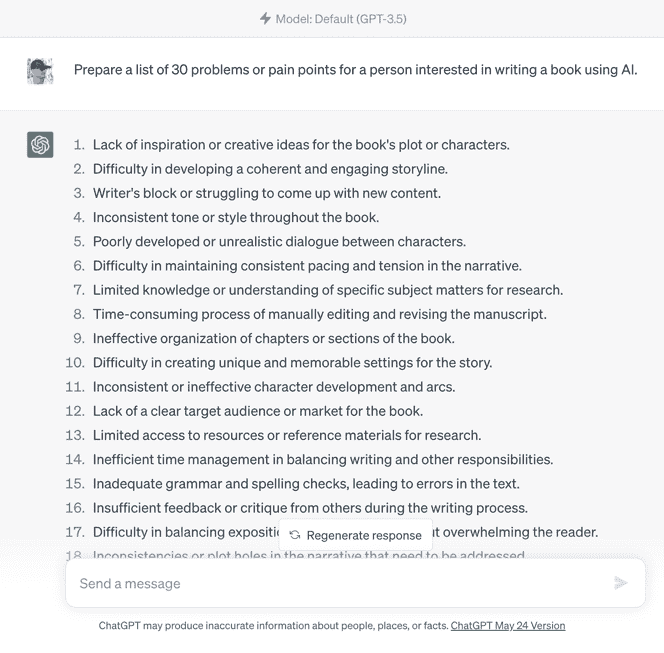
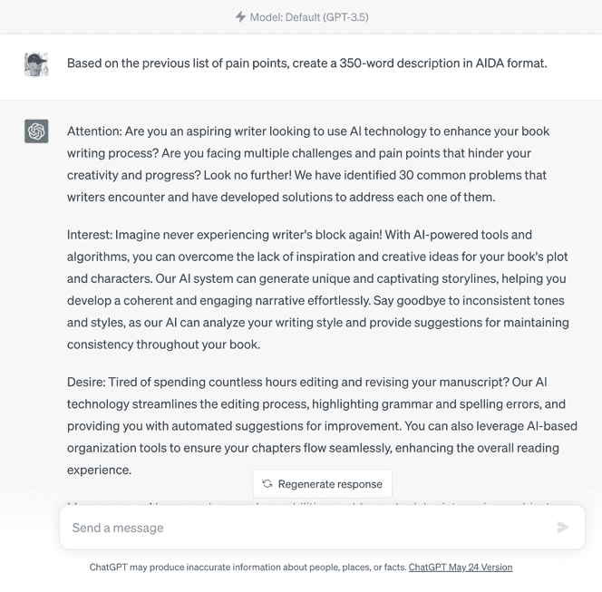
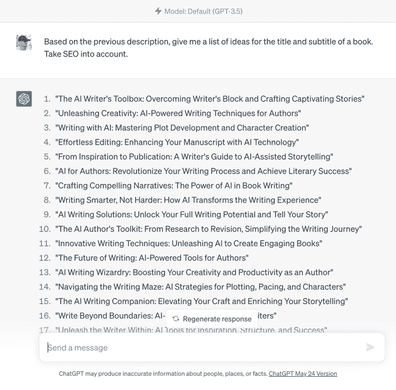
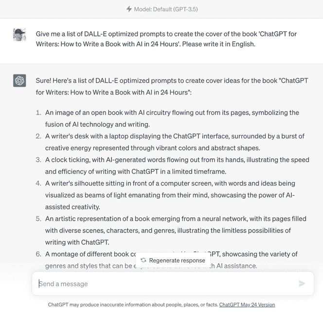

如何在 24 小时内使用 ChatGPT 写书什么？我们还没完成吗？我把章节搞混了吗？用《蝗虫卡布林》6 的话来说：“冷静！别慌！”。一切都在掌控之中。一切都在它应该在的地方。这本书是我喜欢做的那些实验之一。我不喜欢简单地告诉你事情，或者仅仅限于给出我的观点或总结你可以轻松在谷歌上找到的东西。因为你迄今为止读到的一切都是由 ChatGPT 写的。你是否想知道书的开头和这一章的日期和时间是什么意思？我想知道你是否开始串联起来了。实际上，它们是我开始写这本书和完成它的日期和时间，就像我一天前决定的那样。让我解释。几周来，我一直在阅读和听取许多自我出版专家告诉他们的追随者，ChatGPT 没问题，但他们无需担心；它对作家没有威胁。怎么回事？它可能对每个作家都不构成威胁，但当然，对许多人来说会构成威胁。特别是那些安于现状，不与时俱进的人。我没有在社交媒体上进行辩论，试图反驳他们的论点，而是想到了创作这本书……并证明它。整天都在脑海中盘旋着这个想法，4 月 24 日晚上，当我已经躺在床上准备睡觉时，我转向我的女朋友玛雅，说：“明天我会在你起床时醒来。”第二天，玛雅将在早上 6 点准备上班，直到晚上才回家。所以我决定在她回家前的 10 点之前起床写一本书，并出版！- 使用 ChatGPT。你手中拿着的这本书就是那个实验的结果。你能想到一个更好的方式来展示 ChatGPT 的潜力以及不要落后的重要性吗？既然你已经读到了这本书的这一部分，我猜你至少觉得它还算可以（这是目标），所以我将向你解释我是如何做到的，一步一步地，这样你也可以在不到二十四小时内写作、出版和销售（是的，销售！）一本书。让我们开始吧。这个过程非常简单，几乎和我跟随所有其他书籍的步骤一样——只是这一次，是 ChatGPT 跟随我的 10 个出版书籍步骤之一：

1.  研究（15 分钟）

1.  描述（15 分钟）

1.  标题（15 分钟）

1.  封面（1 小时）

1.  出版物 1/2（15 分钟）

1.  目录（15 分钟）

1.  写书（1 小时）

1.  编辑（5 小时）

1.  布局（1 小时）

1.  出版物 2/2（5 分钟）

研究（15 分钟）与我第一本书[品牌秘诀](http://soykevinalbert.com/bs)不同，其研究过程持续了几年，这次只花了我十五分钟。考虑到我的书的主题已经很明确（否则，我可以向 ChatGPT 寻求想法），我需要做的第一件事是研究市场并了解我的目标客户或潜在读者。为此，我只需要让 ChatGPT 准备一个包含三十个关于使用人工智能写书的人的问题或痛点的清单，然后从中选择我认为最有力和相关的十五个。就是这样。我能深入研究吗？毫无疑问，可以更深入。但对于这本书的目标来说，我已经足够了。记住，一本非虚构书的成功在于其能够兑现承诺：解决读者的问题或减轻他们的痛苦。通过这简单的研究，我知道 ChatGPT 可以解决十个问题。当然，除了教你如何在二十四小时内用 AI 写书。请记住，如果没有 ChatGPT，我建议进行的最低限度研究是阅读关于你想写的主题的三本畅销书，所以我们刚刚节省了几天或几周的密集阅读。描述（15 分钟）基于我想让这本书解决的十五个问题的选择，我让 ChatGPT 按照 AIDA 格式创建了一个 350 字的描述。我只需要在得到的结果中添加问题清单的格式：“如果您是这样的人，这本书适合您……”，三个问题作为标题，以及一个最终的号召行动，我也让 ChatGPT 提供。这样，不到十五分钟，我就得到了一篇用完美的说服性语言写成的描述，能够吸引我的潜在读者的兴趣，并使用与我其他书相同的格式。不错。标题（15 分钟）获取书名和副标题的想法清单就像礼貌地问 ChatGPT 一样容易，它会立即为您提供您需要的任意数量和变体，直到您找到喜欢的组合。但不要让这个过程的速度和简单性减损其重要性，因为一本书的成功始于其标题。记住完美标题的公式 7：FPT = 关键词（SEO）+ 解决方案（痛点）+ 个性+ 时间限制。牢记这一切，在获得最初几个结果后，我只需要要求它给我一个新的清单，这次考虑 SEO。通过这简单的提示，我找到了带您来到这本书的标题，除了个性可能有例外，它符合完美标题的公式的所有要求。封面（1 小时）一旦我选择了一个标题，我让 ChatGPT 给我提供一份书籍封面想法清单，同时优化为 DALL-E8。然后，我复制了这些提示，并将它们粘贴到我在前几天一直在尝试的两个图像生成器中：DALL-E 和必���图像创建器。我最喜欢的结果是由必应图像创建器生成的。有了这个设计，我去了 Photoshop（如果你喜欢，也可以使用 Canva），添加了标题、副标题和作者。考虑到我推荐的下一个最佳选择（性价比）是在[Freelancer](https://www.freelancer.com/)平台上举办一场比赛，大约需要五十美元，持续七天，我们刚刚省下了一些钱和很多等待时间，可以用来销售我们的书。因为一旦你的封面准备好了……您就可以开始销售您的书籍！出版 1/2（15 分钟）甚至还没到上午 9 点，我就出版了我的书！因为使用亚马逊 KDP，在发行日期前最多一年，您只需要：一个标题、一个描述和一个封面。我们在不到三个小时内就实现了这一切。将书籍预售有什么优势？

1.  在完成书籍之前开始产生收入。

想象一下，由于某种原因，你花了一年的时间来完成写作你的书。这是你错过的很多钱（如果读者喜欢你的想法的话）。

1.  验证你下一本书的想法。

你甚至可以使用按点击付费广告（例如亚马逊广告）来监控真实兴趣。小心！如果最终决定不出版，亚马逊将惩罚你，不允许你再次提前预售一本书整整一年。

1.  激励你完成你的书。

激励你，强迫你……你可以怎么称呼。但它确实有效。这也是（不是唯一的）我决定提前预售这本书的主要原因。因为一旦上线，就没有回头的余地。不管发生了什么更重要的事情，事情变得困难，或者我改变了主意……一旦提前预售，我绝不会让亚马逊在任何情况下惩罚我。目录（15 分钟）！根据描述，我让 ChatGPT 为一本 10,000 字的书创建目录。为什么是 10,000 字？因为已经证明，每本 10 到 15 千字的非虚构书籍（也被称为“短篇读物”）都受到欢迎并运作良好。小心！目前，ChatGPT 在处理数字方面并不是很好。再加上，目前它在回答方面有约五百字的限制，你可能会因试图获得你想要的书籍长度而感到沮丧。我是吃了苦头才明白的。专业提示：与其要求 ChatGPT 准备 X 字数的书籍目录，不如要求它准备 X 章或小节的书籍目录。有多少？很简单。你只需将你想要的书籍字数除以五百（最大回答长度）。例如，如果你想让 ChatGPT 写一本 10,000 字的书，目录应该总共有二十章或小节：10,000/500 = 20 考虑到这一点，对于这本 10,000 字的书，你可以要求各种组合：一本有 20 章但没有小节的书。

+   第一章

+   第二章

+   ...

+   第二十章

一本有 10 章，每章有 2 个小节的书。

+   第一章

+   第 1 点

+   第 2 点

+   第二章

+   第 1 点

+   第 2 点

+   ...

+   第十章

+   第 1 点

+   第 2 点

一本有 5 章，每章有 4 个小节的书。

+   第一章

+   第 1 点

+   第 2 点

+   第 3 点

+   第 4 点

+   第二章

+   第 1 点

+   第 2 点

+   第 3 点

+   第 4 点

+   ...

+   第五章

+   第 1 点

+   第 2 点

+   第 3 点

+   第 4 点

你明白了吧。你所要做的就是决定你喜欢的书籍内容格式。写书（1 小时）！当该写书的时候，我所要做的就是让 ChatGPT 逐章发展，从头开始。所以，在我创建内容的聊天中，我只需提示：“请发展介绍”。如此循环往复。如果我喜欢这一章的内容，太好了。如果不喜欢，我只需要求它根据一些额外的指示重写，或者简单地点击“重新生成响应”，我就会得到一个全新版本，而无需做任何事情。此外，我可以无限次点击此按钮，查看所有已生成的版本，以便比较并选择我喜欢的版本。你知道，除了要求它在已达到 500 字限制的情况下延长章节外，你可以要求它任何你想要的：“用 X 个字总结一下”，“给我一个例子”，“将关键点编号为结论”，“找到支持这些信息的研究”，等等。通过为每一章重复这个过程，我在几分钟内完成了我的书。专业提示：如果你希望 ChatGPT 在写作时使用你的风格或你最喜欢的作者的风格，现在就是告诉它的时候。只需粘贴一个具有你想要复制的风格的代表性摘录，并要求 ChatGPT 分析它。你知道：语调、节奏和词汇。例如，如果分析说文本是以对话、直接和激励的方式编写的，当你要求 ChatGPT 写每一章时，不要忘记告诉它你想要那种风格。当我达到这一点时，我就这样做了。我粘贴了我一本书的片段，要求 ChatGPT 分析它，然后要求它模仿那种风格写每一章。你认为这样行得通吗？对我来说，我觉得笑话有点太多了。或者可能是因为当我没有写它们时，它们就不那么有趣。现在我想想……这就解释了为什么几乎所有负面评论都集中在我身上而不是内容上。糟糕！编辑（5 小时）尽管我得到的结果已经非常好了（我认为 ChatGPT 写得比我好得多），但我花了大部分时间来编辑这本书，原因有两个：首先，验证它所说的一切是否属实，是否没有错误。你知道，作为作者，我们是唯一对我们发布的内容负责的人，即使是由 ChatGPT 写的。其次，通过任何人工智能检测器的测试 9。为什么？难道向读者透明地使用它不够吗？从道德上讲，是的。但由于亚马逊仍未就人工智能发表声明（而谷歌已经发表了支持它的声明），目前最好还是小心为好。因此，在将你的书上传到 KDP 或任何其他平台之前，请确保你了解该平台关于使用人工智能的政策。如果像亚马逊一样，他们尚未明确表态，最好让你的书通过人工智能检测器的测试，而不引起怀疑。布局（1 小时）我相信你从我的其他书中知道，你说的内容和你展示的方式（布局）同样重要。一个好的布局不仅会帮助你的书变得好，还会让它看起来好。因此，当是时候动手时，我尽可能地简化了这个过程，使用了一个布局模板。使用一个好的模板可以将你花在书的布局上的时间从几天减少到几分钟。这样，我在不到一个小时内就完成了我的书。送给你的礼物：如果你喜欢这本书的布局，给我发电子邮件至 books@soykevinalbert.com，我会发送给你我的模板。出版 2/2（5 分钟）所以，我们到这里了。我的女朋友还没回家，我的书几乎完成了，编辑、布局都准备就绪，只剩下上传到亚马逊了。我上传了这本书……点击！任务完成：一天写一本书！还不错。如果我告诉你，我不只是出版了一本书，而是两本：一本西班牙语，一本英语？或者说那一天，我卖出了三本书？我想我可以毫无疑问地说这个实验取得了巨大的成功，你同意吗？
