# （一）

内容

介绍

1.1\. 书籍大纲的力量

1.2\. ChatGPT：您的人工智能研究和写作助手

第二章：了解有利可图书籍主题的市场

2.1\. 分析当前趋势和热门话题

关键要点

2.2\. 辨识常青的利基

考虑永恒的话题

关键要点

2.3\. 探索有利可图的子流派和格式

辨识���门子流派

考虑新兴子流派

探索不同的格式

关键要点

第三章：使用 ChatGPT 研究高需求主题

3.1\. 为市场研究设置 ChatGPT

适用的 ChatGPT 计划

访问和使用 ChatGPT

测试和提示

3.2\. 为主题发现制定有效的提示

使用具体和清晰的提示

提出开放性问题

包含背景和限制条件

重复和完善

3.3\. 评估和优先考虑潜在主题

主题相关性和盈利能力

评估相关性和盈利能力的因素

使用 ChatGPT 进行竞争分析

更多 ChatGPT 协助的提示：

评估和排名潜在主题

测试你的想法

完善你选择的主题

第四章：使用 ChatGPT 创建高质量、事实性大纲

4.1\. 确保准确性和最新信息

4.2\. 避免抄袭和版权问题

什么是抄袭和侵犯版权？

ChatGPT 内容中的抄袭行为

如何避免抄袭和侵犯版权

保护你的作品免受抄袭和侵权

4.3\. 用 ChatGPT 制定一个简单的 10 分钟执行计划生成书籍大纲

第 1 步：确定大纲的目标（1 分钟）

第 2 步：研究和事实核实（3 分钟）

第 3 步：组织信息（1 分钟）

第 4 步：生成和组织大纲（2 分钟）

第 5 步：格式化大纲（1 分钟）

在 10 分钟内制定大纲的技巧

每个步骤的示例提示：

第五章：打造你书籍的结构

5.1\. 确定你的中心主题和目标��众

定义你的中心主题

确定你的目标受众

使用 ChatGPT 辅助

5.2\. 确定关键点和子主题

头脑风暴关键点

组织子主题

使用 ChatGPT 完善你的想法

5.3\. 组织章节和部分

规划你的章节

章节内的大纲部分

使用 ChatGPT 优化你的书籍大纲

关键注释

第六章：调整你的大纲以达到最大影响

6.1\. 确保一致性和连贯性

使用清晰简洁的语言

逻辑组织你的想法

使用平行结构

保持简洁

保持灵活

关键注释

6.2\. 与 ChatGPT 合作获取反馈和建议

与 ChatGPT 获得个性化反馈

书籍大纲的 ChatGPT 协助

6.3\. 修订和完善你的想法

检查相关性

使用 ChatGPT 完善内容

完善你的书籍大纲

将主题分解为子主题的提示

收集信息和交叉检查

你的目标受众

关键要点

更多 ChatGPT 提示

第七章：将你的大纲翻译成手稿

7.1\. 从大纲到草稿

草稿

主要部分

示例提示

修订和编辑

用新鲜的眼光再看一遍

采用系统化方法

语法和结构

7.2\. 保持专注和动力

建立一个常规

向 ChatGPT 寻求灵感

休息并充电

设定具体目标

更多 ChatGPT 提示

找一个负责伙伴

你还能做什么？

奖励自己

7.3\. 使用 ChatGPT 克服写作障碍

提供写作提示和创意

提供反馈和支持

关键要点

第八章：实际示例和案例研究

8.1\. 示例 1：创建非小说书籍大纲

第一步：研究并找到你的书籍主题

第二步：生成基本大纲

第三步：提出问题并交叉检查你的大纲

第四步：撰写章节摘要并组织你的大纲

关键要点

8.2\. 示例 2：打造小说书籍大纲

第一步：选择你的流派并确定你故事的核心要素

第二步：发展你的角色及其发展

第三步：创建情节结构

第四步：将你的故事分解成章节

第五步：完善和组织你的大纲

8.3\. 示例 3：制作操作指南大纲

第一步：选择操作指南主题

第二步：确定目标受众群体

第三步：将流程分解为可管理的步骤

第四步：提供详细说明和示例

第五步：组织和完善大纲

结论

拥抱人工智能在写作旅程中的力量

自动化繁琐任务

生��想法和内容

提升写作技能

为受众个性化内容

平衡人工智能和人类创造力

附录 A：ChatGPT 资源和教程

官方 ChatGPT 文档

在线教程和课程

社区论坛和讨论板块

更多资源…

附录 B：其他 AI 写作工具和应用

顶部

附录 C：ChatGPT-3.5 vs. ChatGPT-4

创造力

更安全的回复

上下文窗口

关键注释

附录 D：快速参考提示和步骤

第一步：确定书籍的目的和结构

第二步：发展主要观点和支持点

第三步：创建书籍内容大纲

第四步：完善大纲并添加细节

第五步：审查和修订大纲

# 介绍

您是否在为您想要写的书籍制定大纲时遇到困难？我理解您的困境，因为我也曾经历过。制定大纲需要大量时间和专注力，特别是当您的想法到处都是时。

在这本书中，我将为您提供所有提示和可操作的建议，以使用 ChatGPT 创建坚实的书籍大纲。

## 1.1\. 书籍大纲的力量

让我们谈谈为什么您需要一个好的书籍大纲。在今天快节奏的书籍和出版世界中，仅仅出一本书是不够的。最好是制作一本经过深思熟虑的书籍，与您的目标受众产生共鸣。

一个大纲有助于实现这一目标以及更多。它让您能够在纸上或电子表格上组织您的思绪。大纲还将帮助您确定应包含在您的书籍或指南中的最相关部分。

《哈利·波特》的作者 J.K.罗琳说：“大纲至关重要。它可以节省很多时间。当你有了大纲，你就知道自己要去哪里，可以看到整个画面。”

乔治·R·R·马丁也喜欢他的大纲：“我总是提前写好大纲。这是组织我的思绪和找出故事整体结构的一种方式。我无法想象开始一本书而没有大纲。”

有了清晰的大纲，您在写作时更加专注和一致。大多数作者，包括我在内，需要帮助每天坐下来写书籍内容。大纲将您的想法的大块分解为更易管理的部分和章节。

一个好的大纲将确保在编辑和修订阶段花费更少的时间，并帮助您创建一个能够吸引您受众的强大叙事。

制作有价值的大纲的一些重要提示是：

● 研究您目标受众的趋势、偏好和兴趣。● 探索与您领域相关的热门书籍，了解读者喜欢什么。● 制定一个清晰独特的主题，将您的书籍联系在一起。● 将您的想法和思路分解为更小、更易管理的部分，并以有序的方式排列它们。● 在收集更多见解时持续修订和完善您的大纲。

经历大纲的这些阶段需要辛勤工作。当您在收集数据时，如果您的思绪飘忽不定，这可能会特别具有挑战性。

因此，让我们让创建大纲的过程更加简单。您只需要您的信任的 AI 机器人 ChatGPT 来实现！

## 1.2\. ChatGPT：您的人工智能研究和写作助手

ChatGPT 是由 OpenAI 提供支持的人工智能（AI）语言模型，作者可以使用它创建出色且易于遵循的书籍大纲。ChatGPT 是一个信息数据库。与其他数据库不同，ChatGPT 被编程为以有序的方式提供有关您查询的相关信息。

随着人工智能技术的兴起和 ChatGPT 的出现，许多作者正在使用这一神奇工具快速有效地创建书籍大纲。

布雷特·席克勒使用 ChatGPT 撰写了一本关于投资和储蓄的儿童书籍。借助这一人工智能工具，他在几个小时内就准备好了 Kindle 出版的书籍。

ChatGPT 可以帮助您：

+   协作写作：凭借其庞大的数据库，ChatGPT 可以帮助您构思想法，填补空白或情节漏洞，并完善您的主题。

+   市场研究：利用 ChatGPT 的庞大数据库来识别热门话题，并探索流行的利基和子利基。在进行研究时，您应该使用具体的提示。

+   内容创作：ChatGPT 可以帮助您创建高质量的内容，比如整本书的大纲分成各个部分、章节、章节摘要等。

+   修订和编辑：如果您的手稿还没有准备好交给编辑，您可以使用 ChatGPT 作为智能编辑。它将提供相关建议，并提供建设性的反馈和改进。

ChatGPT 是进行书籍研究和创建良好大纲的完美工具。要充分利用这个工具，您必须学会如何创建正确的提示。

您的提示必须具体，并始终为搜索或生成内容提供清晰的指示。您不能指望 ChatGPT 知道您的想法，因此您必须提供关于您希望它执行的任务的准确信息。

在这本书中，我将为您提供使用 ChatGPT 创建书籍大纲所需的所有必要知识。您将获得可操作的提示，有效的提示以及有关 ChatGPT 的更多信息，以及它如何帮助您实现书籍梦想。

# 第二章：了解盈利书籍主题的市场

## 2.1\. 分析当前趋势和热门主题

找到盈利书籍主题涉及查看当前趋势和热门主题。通过跟踪流行和需求旺盛的内容，你可以使你的主题符合目标读者的需求，并提高成功的机会。

以下是查看热门主题和当前趋势的一些方法：

+   寻找新兴趋势：留意出版业中的新兴趋势，如读者偏好的变化、新兴流派和新技术。这些趋势可以帮助你发现新的创新书籍主题的机会。

+   关注热门媒体：留意媒体中流行的内容，如电影、电视节目和社交媒体。例如，如果某个特定的电视节目引起了很多关注，可能有机会写一本探索类似主题或话题的书籍。

+   监控畅销书榜单：跟踪你选择的流派和所有流派中销售良好的书籍。保持信息灵通可以帮助你识别流行的主题和流派，你可能想进一步探索。

+   使用社交监听工具：社交监听让你追踪人们在社交媒体上对特定主题或趋势的讨论。你可以获得有价值的见解，了解当前流行的内容以及读者所追求的。

一旦你确定了当前趋势和热门主题，你可以调整你的书籍主题以满足目标读者的需求。以下是一些如何做到这一点的示例：

+   新鲜视角：对流行主题或趋势提供新的视角。例如，如果正念是一个热门话题，你可以为忙碌的专业人士提供新的正念观点。

+   探索利基主题：专注于更广泛问题中的特定利基。例如，不要写一本关于营养的一般书籍，你可以专注于运动员或患有特定医疗条件的人的营养。

+   及时性：写一本当前相关或及时的主题书籍。如果某个社会问题引起了很多讨论，你可以写一本深入探讨该问题的书籍。

### 关键要点

查看当前趋势和热门主题对于找到好的书籍主题至关重要。通过跟踪流行内容，你可以使你的主题符合目标读者的需求，并提高成功的机会。你可以写一本吸引目标读者并脱颖而出于类似书籍的书，通过提供新的观点，探索利基主题和保持更新。

## 2.2\. 辨识长青利基市场

长青利基是指无论出版业变化或当前趋势如何，仍然受欢迎和需求的主题。

要了解长青利基，你可以浏览在线商店，如亚马逊 Kindle、苹果书店、巴诺斯和贵族、Kobo 等。你也可以在谷歌上搜索。

你也可以使用 ChatGPT 进行研究，通过询问以下提示：

1.  我可以考虑哪些长青的利基市场来写我的书？

1.  列出随时间仍然受欢迎的热门常青领域。

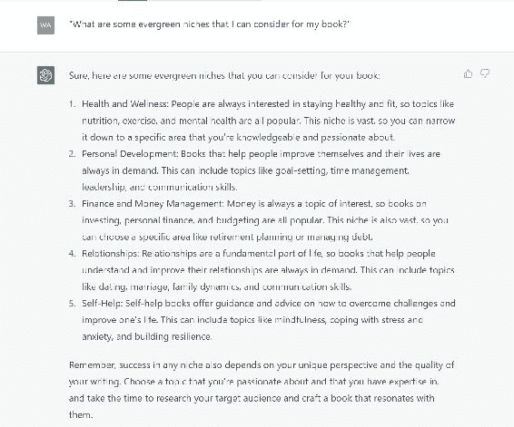

以下是一些识别常青领域的提示。

### 考虑永恒的主题

自助、个人理财和人际关系等几十年来一直受欢迎的主题很可能会保持受欢迎。这些主题吸引了读者的需求和欲望，并将保持相关性。

在 ChatGPT 上使用的提示：

1.  有哪些几十年来一直受欢迎的永恒主题？

1.  哪些主题被认为是永恒的并具有持久的吸引力？

#### 寻找具有广泛吸引力的主题

吸引广泛受众的主题更有可能是常青的，如健康与健康、个人发展和爱好。

在 ChatGPT 上使用的提示：

1.  你能推荐一些对广泛受众具有广泛吸引力的书籍主题吗？

1.  哪些主题由于其广泛吸引力而有可能是常青的？

#### 考虑具有持续相关性的主题

持续相关的主题，如商业和创业，很可能会保持受欢迎。人们总是想要开始和经营有利可图的企业。

在 ChatGPT 上使用的提示：

1.  有哪些具有持续相关性并且随着时间流逝仍然受欢迎的主题？

1.  哪些书籍主题（小说和非小说）仍然与当前趋势无关，仍然受到关注和需求？请列出[number]个主题。

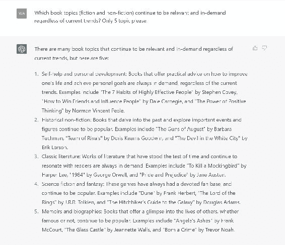

#### 研究经典作品

查看经受时间考验的书籍，如经典文学，并确定导致它们持久受欢迎的因素。这些书籍可能会提供关于什么使一个主题常青的见解。

在 ChatGPT 上使用的提示：

1.  什么因素导致经典文学持久受欢迎？

1.  如何通过研究经典文学来确定常青书籍的主题？

#### 提供更具体的建议

一旦确定了常青领域，你可以调整你的书籍主题以满足目标受众的需求。以下是一些如何做到这一点的示例：

专注于特定领域或主题

与撰写一本关于个人理财的通用书籍不同，你可以专注于面向千禧一代或退休人士的个人理财。

在 ChatGPT 上使用的提示：

1.  如何将一个常青主题缩小到一个特定的领域？

1.  在受欢迎的常青主题中有哪些特定领域的例子？

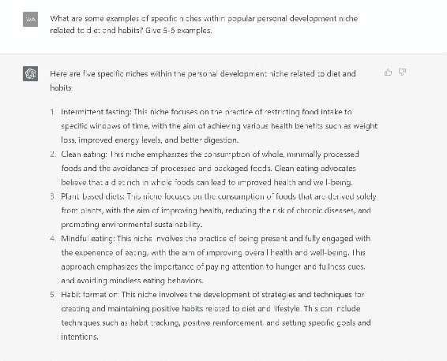

提供独特的观点

对常青主题提供新颖的观点。例如，由于有许多关于冥想的书籍，你可以撰写一本针对忙碌的专业人士或运动员的冥想书籍。

在 ChatGPT 上使用的提示：

1.  如何在一个常青主题上提供独特的观点？

1.  有哪些方法可以使我的书在相同的常青领域中与其他书区分开来？

提供实用建议

提供读者可以应用于自己生活的实用建议和工具。例如，如果你正在写一本关于时间管理的书，提供读者可以用来提高生产力的有用提示和策略。

在 ChatGPT 上使用的提示：

1.  我如何在我的书中融入关于长青主题的实用建议？

1.  一本关于[主题]的书有哪些有用的提示和策略的例子？

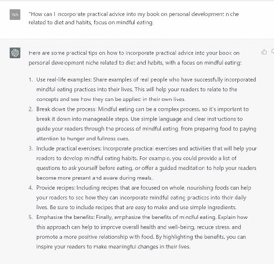

### 关键要点

找到永远有需求的利基是找到有利可图的书籍创意的关键。通过写关于广泛人群感兴趣且仍然重要的主题的书籍，你可以写一本保持流行的书。

通过将主题定制为目标读者，提供独特的观点和实用建议，写一本能够吸引目标读者并在竞争激烈的市场中脱颖而出的书��

## 2.3\. 探索有利可图的子流派和格式

探索有利可图的子流派和格式是识别好书籍主题的另一个关键步骤。子流派是更广泛类型中的具体类别，而格式指的是书籍的呈现或结构方式。

通过探索流行的子流派和格式，你可以找到吸引读者并在竞争激烈的市场中脱颖而出的书籍创作机会。

### 识别流行的子流派

寻找当前流行的你选择的类型中的特定类别。使用亚马逊筛选器，通过网站获取信息，或使用 ChatGPT 找到子流派。

在 ChatGPT 上使用的提示：

1.  我可以考虑哪些有利可图的子流派和格式来写书？

1.  你能列出[类型]类别中一些流行和新兴的子流派吗？

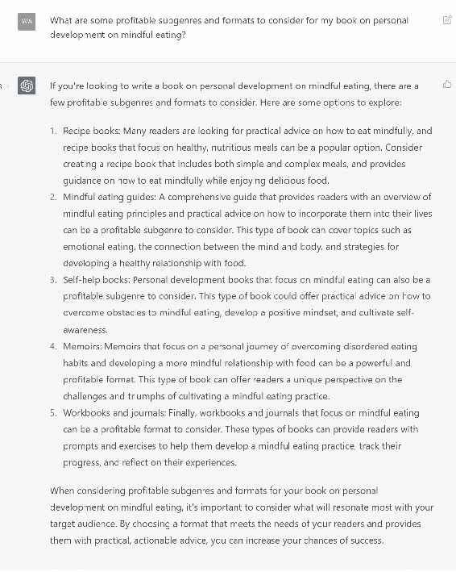

### 考虑新兴子流派

寻找正在流行的新兴子流派，比如生态惊悚或末日浪漫。这些子流派可能为新颖和创新的书籍主题提供机会。

在 ChatGPT 上使用的提示：

1.  [类型]类别中流行的子流派有哪些？

1.  我如何找到我选择的类型中流行的子流派？

### 探索不同的格式

考虑不同的书籍呈现格式，比如图像小说，互动书籍或有声书。这些格式可能吸引那些喜欢不同阅读体验的读者。

在 ChatGPT 上使用的提示：

1.  我可以考虑哪些不同的书籍格式？

1.  我如何决定最佳的书籍呈现格式？

#### 更具体的提示

一旦你确定了潜在的子流派和格式，你可以通过以下方式进一步调整你的书籍主题：

专注于特定子流派

不要写一本一般的言情小说，而是专注于特定的子流派，比如历史或超自然言情。

在 ChatGPT 上使用的提示：

1.  我如何将我的书籍主题调整为专注于我选择的类型中的特定子流派？

1.  在[类型]类别中专注于特定子流派的例子有哪些？

尝试不同的格式

考虑尝试各种不同的格式来呈现你的书，比如交互式电子书或图文并茂的改编小说。

在 ChatGPT 上使用的提示：

1.  我如何尝试不同的格式来呈现我的书？

1.  将我的书以不同格式呈现的好处是什么，比如交互式电子书或图文并茂的改编小说？

结合次类型和格式

考虑结合不同的次类型和格式，创作一本独一无二在市场中脱颖而出的书。例如，你可以写一本图文并茂的舒适悬疑小说。

在 ChatGPT 上使用的提示：

1.  如何通过结合不同的次类型和格式创作一本独特的书？

1.  有哪些成功结合次类型和格式的书的例子？

### 关键笔记

如果你想找到好的书题材，研究有利可图的次类型和格式。通过考虑新颖和流行的次类型以及不同的格式，你可以写一本读者喜欢且在拥挤市场中脱颖而出的书。

# 第三章：使用 ChatGPT 研究高需求主题

在使用 ChatGPT 制作书籍大纲之前，你需要了解关于这个 Open AI 的一切。本章将向你展示如何入门，最有效的提示以及如何缩小你的书籍主题。

## 3.1\. 为市场研究设置 ChatGPT

### 适当的 ChatGPT 计划

随着 ChatGPT 的当前热度，你可以免费使用 ChatGPT 账户。这个免费版本包括 ChatGPT-3.5，并且在创造力、准确性和相关性方面功能有限。

Open AI 还提供 ChatGPT Plus。升级计划每月仅需 20 美元，包括一系列出色和高级功能。Open AI 还推出了 ChatGPT 4，具有出色的推理和简洁性，但速度相对较慢。Plus 版本的 ChatGPT-3.5 也比免费版本更快更准确。

假设你认真考虑创建一个强大的书籍大纲。在这种情况下，我建议使用 ChatGPT 4 的 Plus 计划，因为它提供更相关、创新和描述性的答案。

如果你负担不起，你可以尝试使用 ChatGPT-3.5。这个版本在小说甚至非小说方面表现出色，因为你需要想法才能构建你的大纲。然而，你将不得不与它密切合作，以制定一个畅销的大纲。

### 访问和使用 ChatGPT

当你决定了适当的书籍大纲计划后，你可以通过 Web 应用访问 ChatGPT（适用于大多数浏览器）。虽然 ChatGPT 也有 API，但你只需要 Web 应用来创建和完善书籍大纲。

### 测试和提示

你可以尝试不同的提示，看看 ChatGPT 的响应如何（ChatGPT 4 不会让你失望！）。设置好 ChatGPT 后，一切都取决于提示。

## 3.2\. 为主题发现制定有效的提示

通过有效的提示，你可以使用 ChatGPT 获得有价值的回应。

### 使用具体和清晰的提示

ChatGPT 是一个 AI 模型，所以你需要清晰、简洁和具体才能得到相关的回应。

不要问模糊的问题，比如“写作的流行流派是什么？”AI 会给出杂乱、无组织和冗长的答案，反映了问题本身。

相反，问具体的问题，比如：

1.  2023 年小说书籍中畅销的前三大流派是什么？

1.  [主题]的主要特征是什么？

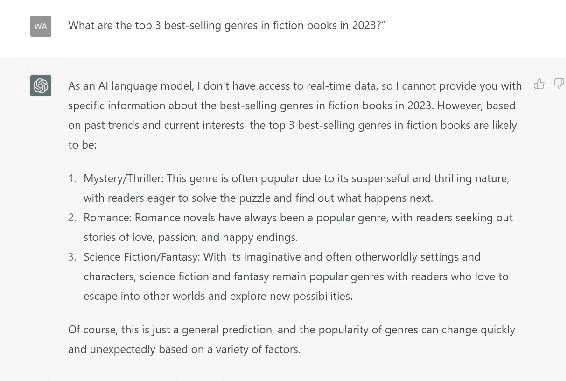

上面的截图澄清了两个问题之间的明显差异。记住，ChatGPT 不知道你在想什么，所以你需要解释清楚。

### 提出开放式问题

通过开放式问题，ChatGPT 将提供更详细的回应和关于你的查询的想法。因为开放式问题没有简单的“是”或“否”的回应，它们迫使 AI 模型利用知识并给出详细的回应。这些问题遵循为什么、如何、什么或描述模式。

让我们看看开放式问题如何与 ChatGPT-3.5 配合，以及它们与封闭式问题的比较：

想象你是一位小说悬疑作家，想知道写作一本悬疑小说的所有步骤，因为你卡住了。你在想，悬疑小说需要大纲吗？

但这个提示不会给出正确答案。相反，请使用下面给出的开放式提示。

正确的提示：解释为悬疑小说创建引人入胜大纲所涉及的步骤。

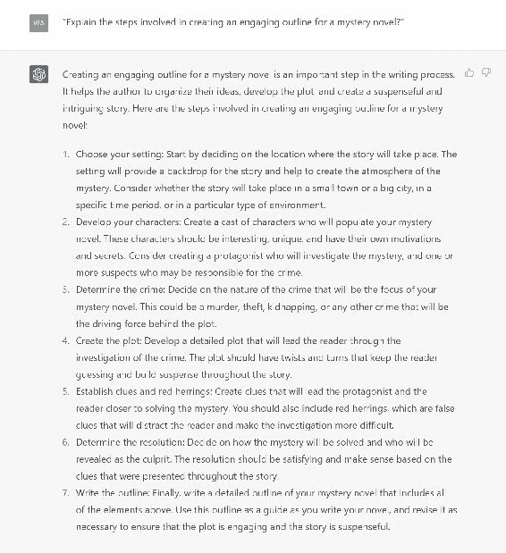

开放式问题提供更多信息、方向和细节，为书籍大纲提供了一个焦点。其他开放式问题的例子包括：

1.  一个关于[主题]的有效非虚构书籍大纲的基本组成部分是什么？

1.  作家如何为设定在[历史小说/流派]书籍中的[历史时期/事件]的引人入胜大纲？

1.  作者可以使用什么策略来为[主题]书籍创建一个引人入胜的大纲？

### 包括上下文和限制

列出具体的上下文和限制，以确保 ChatGPT 给出你想要的回答。如果你不添加限制并提供关于你想要从主题���得到什么的背景信息，ChatGPT 将生成一个不符合你主题的一般性大纲。

具有上下文和限制的提示示例

提示 1：建议 5 个与城市居民可持续生活相关的书籍主题，所有这些主题都侧重于实用技巧和日常习惯。

上下文：

● 城市居民● 实用技巧● 日常习惯

限制：

● 5 本书的主题

提示 2：描述一个设定在充满魔法的世界中的科幻小说女主角的详细描述。她是一个邪恶/古怪/狡猾的主角，喜欢惹麻烦、混乱和谋杀。

上下文：

● 女主角● 科幻小说● 充满魔法的世界

限制：

● 主角必须具有邪恶/古怪/狡猾的性格。● 该角色喜欢惹麻烦、混乱和谋杀。

提示 3：列出过去 5 年内出版的对个人成长和生产力专注的前 4 本最具影响力的自助书籍。

上下文：

● 自助书籍● 个人成长● 生产力

限制：

● 前 4 本具有影响力的书籍● 出版时间在过去五年内（ChatGPT 的数据截至 2021 年，所以过去五年意味着 2017-2021 年）

### 重复和完善

在这本书中测试提示，并根据你的需求调整它们。如果 ChatGPT 对任何提示给出了一般性答案，请用上下文和限制使你的提示更具体，然后再次测试。不断测试并询问不同的提示，直到它给出令你满意的答案。

当提问时，你需要发挥创造力，从不同角度看问题。

## 3.3\. 评估和优先考虑潜在主题

### 主题相关性和盈利性

在使用 ChatGPT 生成目标领域的潜在主题后，现在是时候交叉检查这些主题是否与你的领域相关，并且它们是否具有畅销潜力。

### 评估相关性和盈利能力时的因素

+   竞争：为了你的书籍成功，你应该检查市场上是否有类似的书籍，并评估它们的表现。你可以查看亚马逊 Kindle 等热门在线商店。

+   市场需求：在检查竞争因素后，看看你的书籍理念是否会在市场上引起轰动。通过社交媒体、在线商店等途径搜索，了解读者是否喜欢[你的理念]书籍。只有在有足够的受众时，你的书籍才会销售。

+   领域潜力：每个主题都有一个领域，所以你需要确定你的书籍理念是否有潜力成为其领域的畅销书。你可以扫描谷歌或亚马逊，看看是否有类似你的主题的书籍在其领域中流行。

### 使用 ChatGPT 进行竞争分析

为了节省自己进行竞争分析的时间，你可以要求 ChatGPT 通过使用提示来完成：

● 列出过去两年中关于[主题]的畅销书籍前 10 名。● 识别[主题]领域中的 5 位成功作者。

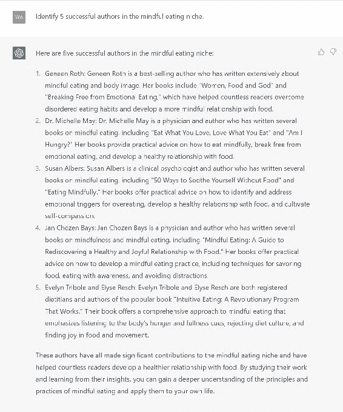

### ChatGPT 协助的更多提示：

1.  分析使[竞争对手的书名]在[主题]领域成功的关键因素。

1.  比较[主题]流派中前 3 位作者的写作风格。

1.  提供[主题]类别畅销书籍目标受众的概述。

1.  前 5 本关于[主题]的畅销书籍中有哪些共同主题和元素？

### 评估和排名潜在主题

在收集关于你潜在主题的数据后，你需要根据一些因素对它们进行排名：

盈利能力：问问自己哪些主题有最高的销售潜力。什么能让我的名字家喻户晓？

● [流派]中当前畅销的主题是什么，它们为什么成功？请提供例子和它们受欢迎的原因。

热情和专业知识：你对该主题是否有真正的兴趣或���业知识？

主题类型：该主题是长青的，还是短期趋势？

● 在撰写关于长青主题与短期趋势的书籍时，优缺点是什么？请讨论受众兴趣、竞争和长期潜力等因素。

### 测试你的想法

在确定主题之前，通过小众群体测试你的想法，以评估他们的反应和兴趣。你可以使用社交媒体、电子邮件调查或在线论坛收集反馈。

向 ChatGPT 寻求帮助：

1.  你对阅读关于[主题]的书籍感兴趣吗？

1.  你对学习[主题]的哪些方面最感兴趣？

1.  你在[主题]方面遇到了哪些挑战或障碍？你对阅读解决这些挑战并提供解决方案的书籍感兴趣吗？

### 完善你选择的主题

根据你的反馈，调整你选择的主题，以更好地符合目标受众的需求和偏好。使用 ChatGPT 帮助你进行头脑风暴和完善你的理念。

你可以使用提示如下：

1.  为[主题]的一本书提出一个独特的角度。

1.  在关于 [主题] 的书籍中需要涵盖哪些关键子主题？

1.  人们在尝试学习或应用 [主题] 时通常会面临哪些挑战？

1.  如何使我的关于 [主题] 的书籍在竞争中脱颖而出？

1.  关于 [主题] 文献中当前存在哪些空白？

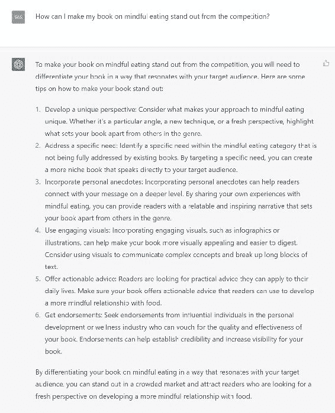

总之，通过评估和优先考虑潜在的书籍主题，专注于最有前景的想法。使用 ChatGPT 协助进行竞争分析，通过小众群体测试你的想法，并完善你选择的主题，以创作一本能吸引目标读者的书籍。

你将在附录 D: 快速参考的提示和步骤中找到所有这些提示。

# 第四章：使用 ChatGPT 创建高质量、事实性的大纲

## 4.1\. 确保准确性和最新信息

在线信息量无限，很难辨别真假。一旦掌握了识别可靠信息的窍门，你就能快速判断你所阅读的内容是否准确。

创建高质量、事实性的大纲需要确保准确性和最新信息。准确性指的是所呈现信息的真实性和可靠性，而最新信息意味着使用关于该主题的最新和最新研究、数据和信息。

在创建大纲时确保最新和最准确信息的一些方法包括：

+   使用可信赖的来源：在为你的大纲进行研究时，使用可信赖的来源，如学术期刊、书籍、声誉良好的新闻来源和政府网站。可信赖的来源提供可由该领域专家验证的可靠信息。

+   交叉核实信息：从各种来源获取的信息进行交叉核实以确保一致性。具体来说，检查事实或信息是否与其他来源一致，或请教该领域的专家。

+   检查出版日期：始终检查每个来源的出版日期。过时的信息可能导致不准确，并潜在地误导读者。

在 ChatGPT 上使用的提示：你能提供关于 2023 年 JavaScript 的数据/信息吗？

+   考虑背景：有些主题可能需要比其他主题更近期的数据，而其他主题可能需要几年前的信息以提供历史背景。对于最新数据，通过在线数据库搜索而不是使用 ChatGPT。但你仍然可以将 ChatGPT 作为指南。

+   避免偏见：在处理问题时要客观，并公正地呈现所有观点。查阅多个来源，并以中立的方式呈现证据。

+   谨慎使用语言：避免夸大、夸张或误导性统计数据。坚持以清晰简洁的方式呈现事实信息。

通过确保准确性和最新信息，你可以创建一个高质量的大纲，为读者提供可信赖的信息。

## 4.2\. 避免抄袭和版权问题

对于任何内容创作者，无论是作家、学生还是博客作者，抄袭和侵犯版权都可能是一个大问题。这些问题可能导致法律诉讼、声誉受损，甚至收入损失。

在本节中，我们将定义抄袭和侵犯版权，如何避免它们，以及如何保护自己的作品免受抄袭或侵权。

## 什么是抄袭和侵犯版权？

抄袭是将他人的作品或想法呈现为自己的行为，而未经授权使用他人的受版权作品则是侵犯版权。抄袭可能发生在学术写作、新闻报道，甚至创意写作中。侵犯版权可能导致法律诉讼和经济处罚。

抄袭包括从源中复制粘贴文本而不引用、改写而不承认原始来源，甚至使用他人的想法而不给予他们信用。

侵犯版权可能包括使用照片或图像、复制他人的文字，或未经许可使用他人的音乐或视频。

## ChatGPT 内容中的抄袭

在使用 ChatGPT 创建大纲或内容时，要注意意外抄袭的可能性。

ChatGPT 中抄袭可能发生的一种方式是通过使用现有内容作为生成新内容的起点。

例如，假设用户将现有文章或大纲输入 ChatGPT 作为提示。那么生成的内容可能与源材料过于相似，这可能被视为抄袭。

在 ChatGPT 上使用的提示：使用上述大纲，并从介绍部分撰写 400 字的内容。同时使用以下文本/数据：[从互联网复制粘贴的数据]

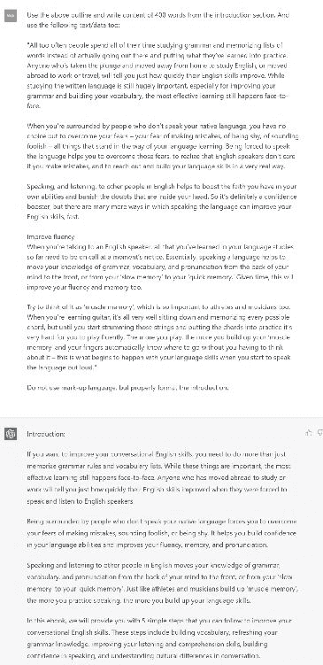

根据 Grammarly，上述文本包含 26% 的抄袭内容。

另一种 ChatGPT 中可能发生的抄袭方式是通过生成的内容与现有内容非常相似但未经适当引用。ChatGPT 可能生成包含与现有作品相似短语或句子的内容，而未明确引用原始来源，导致意外抄袭。

此外，工具可以帮助检测抄袭，例如在线抄袭检测器如 Grammarly 抄袭检测器、Turnitin 和 Copyscape。这些平台可以验证使用 ChatGPT 生成的任何内容的原创性。

通过采取措施避免抄袭并确保所有来源得到适当引用，用户可以利用 ChatGPT 创作原创且引人入胜的内容，同时保持学术和道德标准。

### 如何避免抄袭和侵犯版权

使用适当的引用：在使用他人的作品或想法时，请确保给予他们信用。在您的写作中使用适当的引用来指示信息的来源。例如，您可以在文中引用、脚注或尾注中加入引用。

谨慎改写：在改写他人作品时，要大幅改变措辞，使其与原作不太相似。始终要给予原作者以信用。

使用抄袭检测工具：使用 Turnitin 或 Grammarly 检查您的作品是否存在抄袭。这些工具可以将您的作品与其他作品的广泛数据库进行比较，以识别任何相似之处。

获得许可：如果您想使用他人的作品，请先获得他们的许可。获得许可可以包括请求使用照片或图像的许可，或复制他人的文字。

### 保护您的作品免受抄袭和侵权

注册版权：在您所在国家的版权办公室注册您的作品。这样可以提供法律保护，并使您更容易采取法律行动，如果您的作品被抄袭或侵犯。

使用水印：在您的图片或照片上使用水印，以使他人未经许可难以使用。

监控网络：使用工具，如 Google Alerts，监控网络上未经许可使用您作品的情况。如果发现抄袭或侵权行为，请采取行动将内容移除。

## 4.3\. 使用 ChatGPT 生成书籍大纲的简单 10 分钟执行计划

使用 ChatGPT 制定一个简单的、10 分钟的执行计划可以确保大纲高效有效地完成。这个计划包括六个步骤，每个步骤都有特定的时间分配，帮助你保持在正确的轨道上。

### 第一步：确定大纲的目标（1 分钟）

确定你的书的主题和目标读者，形成大纲的目标。为了进一步了解，分析同类书籍的内容、风格和营销策略。

假设一本面向初学者的烘焙面包的书集中讨论技巧、成分和设备。

在 ChatGPT 上使用的提示：一个专门针对初学者和对学习各种技巧和掌握设备感兴趣的人的烘焙面包书籍的主要目标是什么，覆盖面包制作过程的所有关键方面？请用两句简洁的话提供主要目标。

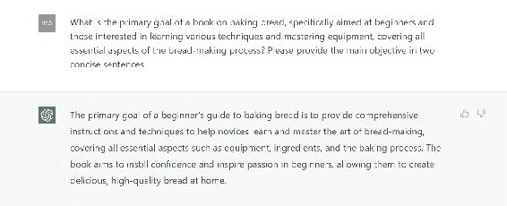

### 第二步：研究和事实核实（3 分钟）

研究和事实核实对于创建一个完美的大纲至关重要。将每日执行计划的一部分用于研究书籍主题并通过可靠来源验证信息。

例如，在亚马逊 Kindle、Kobo 等平台上浏览类似的烘焙面包书籍，找到章节想法和子主题。你会发现子主题如下：

● 成分● 关键术语● 流程概述● 制作面包的多种方法● 设备● 开始前需要了解的事项● 温度计算

使用 ChatGPT 协助你的研究和事实核实，提供提示，比如：

● 给我提供一份关键烘焙面包技巧的摘要。● 列出世界各地流行的面包类型。● 查找讨论面包制作中不同类型面粉的可靠来源。

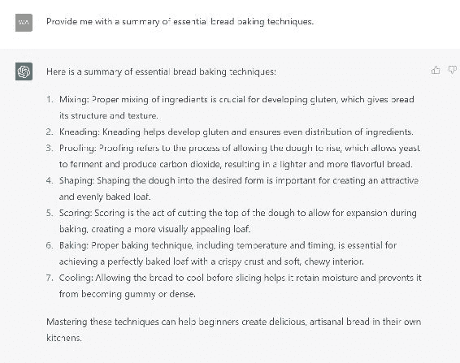

### 第三步：组织信息（1 分钟）

对研究的信息进行排序和分类，建立一个层次结构，选择一个系统，标记数据以创建一个有组织的结构。

对于烘焙面包主题，你可以将信息组织成技巧、成分、设备、食谱等部分。你可以从亚马逊上出版的书籍中获取灵感。

### 第四步：生成和组织大纲（2 分钟）

使用 ChatGPT 根据研究数据和主题生成一份书籍大纲。将适当的部分组合在一起，创建一个连贯的大纲。

下面的提示将生成一个大纲并组织信息/章节。如果你不喜欢 ChatGPT 返回的内容，只需给出一个更具体的提示来组织数据。

### 第五步：格式化大纲（1 分钟）

使用项目符号、副标题和视觉吸引力元素格式化大纲，使其易于阅读。对于烘焙面包的电子书，确保各个部分和子主题可区分并且组织良好。

生成大纲后，你可以自行格式化，或者请 ChatGPT 为你格式化。下面的截图介绍了如何生成大纲、创建结构和格式。

在 ChatGPT 上使用的提示：为一本关于烘焙面包的电子书创建一个包括技巧、配料、设备和食谱部分的大纲。

逻辑地组织各部分，并将它们分类到适当的部分中。重新表述章节和部分名称以提高可读性。

以读者友好的格式呈现一本书的大纲，使用清晰的标题、副标题和视觉吸引力设计元素。

### 制作 10 分钟大纲的技巧

使用计时器

为每个步骤设定一个计时器以保持进度。使用手机或物理计时器为每个任务分配特定时间。

练习和重复

通过使用 ChatGPT 练习创建大纲的次数越多，你就会越擅长快速有效地制作大纲。随着经验的积累，不断迭代和改进你的流程。

遵循这个简单的 10 分钟执行计划，你将创建高质量、事实性的书籍大纲。

### 每个步骤的示例提示：

#### 第一步：确定大纲的目标（1 分钟）

● 关于专注于[主题]的书籍的主要目标和目标受众是什么？请用两句简洁的话提供主要目标。● 确定关于[主题]的书籍的关键主题和预期读者。用两句简短的话总结主要目标。

#### 第二步：研究和事实核实（3 分钟）

● 为我提供关于[主题]最重要方面的概述。● 列出关于[主题]的关键事实、统计数据和专家意见。

#### 第三步：组织信息（1 分钟）

● 将关于[主题]的研究信息分类和组织成一个逻辑结构。● 整理收集到的关于[主题]的数据，并创建一个清晰的层次结构以便更好地理解。

#### 第四步：生成和组织大纲（2 分钟）

● 为一本关于[主题]的书籍创建一个包括[子主题]部分的大纲。将各部分逻辑地组织起来，重新表述章节和部分名称以提高可读性。● 为一本关于[主题]的书籍制定一个全面的大纲，包括与[子主题]相关的部分。确保有条理的组织，并改进章节和部分名称以增强清晰度。

#### 第五步：格式化大纲（1 分钟）

● 使用项目符号、副标题和视觉吸引力元素格式化关于[主题]的书籍大纲，使其易于阅读。● 以读者友好的格式呈现一本关于[主题]的书籍的大纲，使用清晰的标题、副标题和视觉吸引力设计元素。

# 第五章：打造你的书籍结构

## 5.1\. 确定你的中心主题和目标受众

所以，你决定写一本书，但需要帮助确定从哪里开始？别担心！我们在这里帮助你确定中心主题和目标受众，这将为创建一个出色的书籍结构奠定基础。

### 确定你的中心主题

首先，让我们谈谈你的中心主题。你想在整本书中传达核心信息或想法。你的主题是支撑一切的支柱，所以花些时间考虑你热衷的事情以及你希望读者从你的书中带走什么。

在定义你的中心主题时，尽量具体。这样做将指导你的写作，并确保你的书保持专注。

例如，如果你正在写一本关于个人理财的书，你的中心主题可能是“帮助年轻人在投资和为退休储蓄的世界中导航”。

1.  帮我确定关于[主题]的书的中心主题。

1.  帮我确定一个关于个人理财的中心主题，重点是年轻人。

1.  针对年轻人的个人理财书籍的独特而引人入胜的角度是什么？

### 确定你的目标受众

现在你已经确定了中心主题，是时候弄清楚你要为谁写作了。确定目标受众是必不可少的，因为它可以帮助你根据受众的喜好和需求来调整你的写作风格、语气和内容。

要确定你的目标受众，考虑那些最能从你书籍的中心主题中受益的人群。考虑年龄、性别、职业、兴趣和地理位置。

例如，如果你的书的中心主题是关于年轻人投资，你的目标受众可能是年龄在 18-30 岁、对个人理财感兴趣的人群。

1.  谁是关于[主题]的书的目标受众？

1.  谁是针对年轻人的个人理财书籍的目标受众？

1.  哪个具体人群会从针对年轻人的个人理财书籍中受益最多？

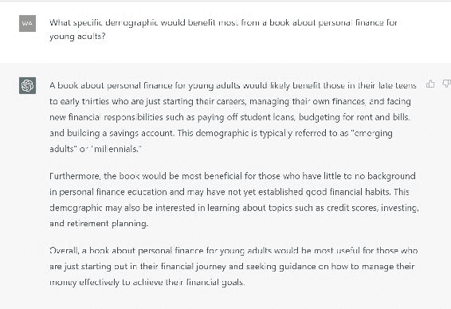

### 使用 ChatGPT 进行协助

如果你需要帮助确定你的中心主题或目标受众，不要担心！ChatGPT 在这里帮忙。这个强大的人工智能工具可以提供建议和想法，帮助你保持在任务上。

要开始，尝试使用这些提示与 ChatGPT 交流：

1.  帮我确定关于[主题]的书的中��主题。

1.  我的关于[主题]的书应该以什么为主要焦点？

1.  谁是关于[主题]的书的目标受众？

1.  哪个人群会从关于[主题]的书中受益最多？

通过完成这些步骤，你将在创建一个具有扎实中心主题的书籍的道路上走得很顺利。在继续制定书籍结构时，请记住这些信息。记得享受这个过程！

## 5.2\. 确立关键要点和子主题

在确定中心主题和目标受众之后，现在是时候深入挖掘并确定你将在书中涵盖的关键点和子主题。这一步将帮助你完成书的结构，并确保你包含了中心主题的所有重要方面。

### 头脑风暴关键点

拿起一支笔和纸，或者你喜欢的笔记应用程序，对你的中心主题的最重要方面进行头脑风暴。这些关键点将作为你的书的主要支柱，以逻辑和引人入胜的方式引导读者了解你的主题。

例如，如果你的中心主题是帮助年轻人在投资世界中导航，一些关键点可能包括以下内容：

1.  理解不同类型的投资

1.  如何制定投资计划

1.  风险管理和分散投资

1.  退休规划策略

在 ChatGPT 上使用的关键点提示：

1.  我在关于年轻人个人理财的书中应该涵盖哪些关键点？

1.  年轻人需要了解的个人理财的基本方面是什么？

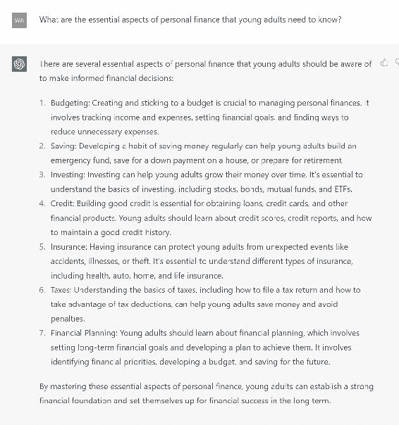

在 ChatGPT 上使用的子主题提示：

1.  为年轻人个人理财书的预算和储蓄提出一些子主题建议。

1.  我在个人理财书中的关键点“为年轻人投资”下应该包括哪些子主题？

### 组织子主题

现在你有了关键点，是时候将它们细分为更小的子主题了。这些子主题将提供更深入的信息、例子和解释，让你的读者对你的中心主题有一个具体的理解。

例如，如果你的一个关键点是“理解不同类型的投资”，一些子主题可能包括：

● 股票● 债券● 共同基金● 交易所交易基金（ETF）● 房地产

在 ChatGPT 上使用的提示：

1.  我应该如何最好地为年轻人结构我的个人理财书，包括关键点和子主题？

1.  为年轻人个人理财书提供一个建议的大纲，包括关键点和子主题。

通过将你的子主题组织在每个关键点下，你将为你的书创建一个清晰而逻辑的结构，使读者更容易消化信息。

### 使用 ChatGPT 完善你的想法

如果你需要帮助处理关键点和子主题，ChatGPT 可以再次出手相助！它可以帮助你生成额外的子主题，完善你现有的主题，或者识别内容中潜在的空白。

要充分利用 ChatGPT，尝试使用以下提示：

1.  我在关于[主题]的书中应该涵盖哪些关键点？

1.  在关于[主题]的书中需要解决哪些基本方面？

1.  为[关键点]提出一些子主题建议。

1.  我在关于[主题]的书中应该在[关键点]下包括哪些子主题？

遵循这些步骤并利用 ChatGPT 将为您的书籍创建一个全面的结构，有效地涵盖您的中心主题。请记住，在写作过程中重新审视和完善您的关键要点和子主题至关重要，确保最终产品对目标受众具有连贯性和吸引力。

## 5.3\. 组织章节和部分

现在您已经确定了中心主题、目标受众、关键要点和子主题，是时候将它们组织成一个实用的结构了。这个过程将涉及将您的关键要点安排到章节中，并将每个章节分成部分。

这样做将创建一个逻辑流程，引导读者浏览您的书籍，使其成为一本愉快且信息丰富的阅读材料。

### 规划您的章节

首先确定您的书籍将有多少章节。长度将取决于您的主题的复杂性以及您想要涵盖的信息量。一旦确定了章节数，将每个关键要点分配到一个章节。因此，您将围绕中心主题构建您的书籍结构，使读者更容易跟随和理解。

例如，如果您的书籍的中心主题是帮助年轻人在投资世界中导航，您可以将章节组织如下：

1.  第一章：理解不同类型的投资

1.  第二章：制定投资计划

1.  第三章：风险管理和分散投资

1.  第四章：退休规划策略

在 ChatGPT 上使用的提示：

1.  我应该如何为我关于年轻人个人理财的书籍组织章节？

1.  在关键要点和子主题的基础上，如何最好地为年轻人个人理财书籍结构章节？

### 在章节内部概述部分

是时候将您的章节分解为部分了。每个部分应涵盖一个子主题，提供详细信息、示例和解释。

使用我们的投资示例，第一章中的部分如下：

1.1\. 股票

1.2\. 债券

1.3\. 共同基金

1.4\. 交易所交易基金（ETF）

1.5\. 房地产

这种方法使您的读者更容易吸收信息并找到他们想要的具体内容。此外，它还帮助您在整本书中保持无缝的结构。

在 ChatGPT 上使用的提示：

1.  为[章节]建议一个逻辑流程

1.  为“预算和储蓄”章节在年轻人个人理财书籍中建议一个逻辑流程

1.  在个人理财书籍中“年轻人投资”章节提供章节概要。

### 使用 ChatGPT 优化您的书籍大纲

如果您需要对章节和部分组织进行澄清或寻找改进方法，ChatGPT 将在此处提供帮助。通过提供建议和反馈，ChatGPT 可以帮助您完善书籍结构，确保其引人入胜且易于理解。

尝试使用这些提示与 ChatGPT：

1.  我应该如何为我的关于[主题]的书籍组织章节？

1.  在关于[主题]的书籍中，考虑关键要点和子主题，最佳的章节结构方式是什么？

1.  为[章节]内的部分提出一个逻辑流程建议。

1.  在关于[主题]的书籍中，为[章节主题]的章节提供一个部分大纲。

### 关键要点

仔细组织你的章节和部分将为你的书籍创造一个坚实的结构，有效传达你的中心主题，并吸引你的目标读者。记得在写作过程中根据需要重新审视和完善你的书籍结构，确保最终成品精致而连贯。

# 第六章：为最大影响调整你的大纲

## 6.1\. 确保一致性和连贯性

在为任何写作，无论是研究论文、论文还是文章，创建大纲时，为了最大程度地产生影响，对其进行微调可以确保你的最终产品清晰而引���入胜。

以下是一些帮助你完善大纲的提示：

### 使用清晰简洁的语言

你的大纲应该易于阅读和理解。使用简单的词语和语言，避免可能让读者困惑的专业术语。

你可以选择内容的特定部分并向 ChatGPT 提问。例如，我为我的关于正念饮食的书写了一个粗略段落。“什么是正念饮食？”但我不喜欢听起来的感觉，所以我让 ChatGPT 用提示重新表达我的观点：“我如何重新表达这一点，使其更清晰易懂？”

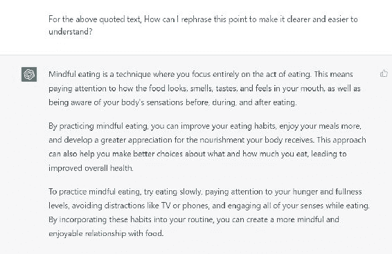

### 逻辑组织你的想法

你的大纲应该从一个点逻辑地流向下一个点。确保所有的想法都以有意义且易于理解的方式排列。

一旦你有了一个扎实的大纲，将相关的想法分组在一起。通过这样做，你将确保所有的观点得到最有效地处理，并且你的写作保持在正确的轨道上。

例如，我的内容是关于正念饮食——好处和需要注意的事项——但我想要顺利过渡这两个部分。

在 ChatGPT 上使用的提示：帮助我在这两个部分之间创建一个流畅的过渡：[部分 A] 和 [部分 B]。

### 使用平行结构

在列出想法时，使用平行结构使你的大纲更具视觉吸引力和连贯性。例如，如果你在一个标题下列出要点，对每个要点使用相同的语法结构。

确保一致性和连贯性的另一个关键方面是在整个大纲中使用相同的语言和格式。这些操作有助于读者理解你的思维过程并理解你的想法之间的联系。

假设你正在使用项目符号。你必须确保它们大小和形状都相同。如果你正在使用标题，请确保它们都是相同的字体和大小。

### 保持简洁

你的大纲应该简洁明了。专注于你想传达的关键思想，避免被细节困扰。

确保你的大纲反映了你的目标。你希望通过写作实现什么？确保大纲中的每一点都支持你的整体论点或论证，并且你包含的所有内容都与你的目标相关。

### 灵活处理

你的大纲应该是一个可以随着写作过程进行修订的流动文档。在写作和完善想法时要愿意做出改变。

确保大纲一致性和清晰性的最佳方法之一是仔细审查和完善它。首先看看你列出的每一点，问问自己它是否必要，是否符合你写作的整体主题，以及在你的作品背景下是否合乎逻辑。

删除任何不合适的观点，并为那些需要的观点添加更多细节。

在 ChatGPT 上使用的提示：首先查看上述主题中列出的每个观点，并问自己它是否必要，是否与主题和背景的整体主题相契合。删除任何不合适的观点，并为那些需要的观点添加更多细节。列出任何你认为不相关且不符合背景的观点。只需给我发送一个需要删除的观点列表。

遵循这些建议，你可以创建一个有效的大纲，帮助你制作出有影响力的最终产品。

### 关键要点

在微调你的大纲时，最重要的考虑之一是确保整个作品始终保持一致性和连贯性。一致性意味着在整个大纲中使用相同的语言、格式和结构。

另一方面，连贯性意味着确保所有观点在逻辑上相互契合。在进行过程中，愿意修改和重新审视你的大纲。你的大纲是灵活的，有些观点可能需要比你最初想象的更多或更少的关注。

通过对变化持开放态度，并愿意根据需要进行调整，你可以为你的写作创建一个清晰而实用的路线图，帮助你在读者中产生最大的影响。

# 6.2\. 与 ChatGPT 合作获得反馈和建议

当时间紧迫时，获得关于你写作的质量反馈和建议可能令人望而生畏。然而，有了像 ChatGPT 这样的技术，编辑你的写作就不那么具有挑战性，而且会为你提供宝贵的反馈和建议。

与 ChatGPT 合作是完善你的大纲的绝佳方式。ChatGPT 可以帮助你处理写作的各个方面，如句子结构、语法、词汇和整体连贯性。

此外，它还可以提供改善大纲清晰度的建议。

在 ChatGPT 上使用的提示：你有任何关于改善我的大纲流畅性的建议吗？

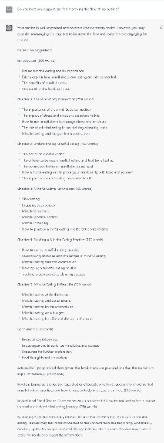

要与 ChatGPT 合作，你需要提供你的大纲。ChatGPT 将分析你的大纲，并就其优点和缺点提供详细反馈。

它还会提供改善你的大纲的建议，比如重新安排某些部分、改写句子和使用更好的词汇。

### 与 ChatGPT 的个性化反馈

与 ChatGPT 合作的最大优势之一是它能够提供个性化反馈。ChatGPT 可以作为语言模型学习和适应你的写作风格，并为你的需求提供量身定制的反馈。

这种定制的高质量反馈可以帮助你提高写作技巧，并创建更有效的大纲。不要犹豫与 ChatGPT 合作，将你的写作提升到新的水平！

在 ChatGPT 上使用的提示：我们需要提供更多细节的地方吗？如果是的话，你会推荐什么证据？

### ChatGPT 协助书籍大纲

1.  你能提出让我的大纲更具连贯性的方法吗？

1.  我可以添加哪些额外信息或研究来支持我的论点？

1.  我的大纲中是否有任何多余的信息需要删除？

1.  你能推荐具体的例子或轶事来说明我的要点吗？

1.  你有关于构建我的大纲以使其更具吸引力的观众的建议吗？

1.  你有什么建议让我的大纲更具视觉吸引力吗？

1.  如何让我的大纲更简洁而不失重要细节？

## 6.3\. 修改和完善你的想法

一旦你为写作项目制定了大纲，就是时候修改和完善你的想法了。这一最后一步让你澄清你的想法，并确保它们组织良好、逻辑清晰地呈现。

在 ChatGPT 上使用的提示：你能提出让我的大纲更具连贯性的方法吗？

### 检查相关性

修改你的大纲的第一步是审查你最初的想法，并评估它们与项目的相关性。

你的一些想法可能需要更好地符合你的项目范围。在这种情况下，从你的大纲中删除这些想法，并专注于更相关的想法是必要的。

在 ChatGPT 上使用的提示：这些信息如何与正念饮食相关？

### 使用 ChatGPT 完善内容

1.  这些信息是否直接与所提出的问题相关？

1.  这些信息是否提供了有意义的见解？

1.  我的大纲中是否有任何多余的信息需要删除？

1.  你能推荐具体的例子或轶事来说明我的要点吗？

1.  你有没有关于如何构建我的大纲，使其对我的受众更具吸引力的建议？

1.  你能提出一些建议，使我的大纲更具视觉吸引力吗？

1.  如何使我的大纲更简洁，而不失去重要细节？

### 完善你的书籍大纲

通过创建更详细的大纲，你可以完善你的想法。这个过程涉及将你的思维分解为更小、更易管理的部分，以便更全面地理解你的主题。

这个过程可能涉及添加子主题或将更广泛的想法细分为更小的部分。

### 将主题分解为子主题的提示

1.  一个明确定义的大纲的关键要素是什么，你如何确保你的大纲符合这些标准？

1.  在完善���的大纲时，有哪些常见错误要避免？你如何确保你的大纲既详细又灵活？

1.  你可以使用什么策略来完善你的大纲，确保它有效地传达你的想法和写作项目的结构？

1.  你如何利用他人的反馈来完善你的大纲，确保它满足你预期受众的需求？

### 收集信息和交叉检查

完善你的想法的另一个策略是收集额外信息或进行进一步研究。这些行动可以帮助你澄清你的想法，并确保它们得到证据支持。此外，你可能会想到以前没有考虑过的新想法。

### 你的目标受众

在修订你的想法时，请牢记你的核心受众。考虑你的读者是谁，以及他们可能已经对你的主题了解多少。你的写作将更具吸引力和意义，当你将你的想法和表达风格调整到你的受众时。

### 关键注释

修订和完善你的想法对于创建一个有效的大纲至关重要。审查你最初的想法可以创建一个更专注、更有影响力的大纲。你还可以通过将各个部分细分为更小的部分、进行进一步的研究并考虑你的受众来制作一个更好的大纲。

花时间修订和完善你的想法，你将成功地创建一个写作项目！

### ChatGPT 的更多提示

1.  我的大纲中是否有任何多余的信息需要删除？

1.  你能推荐具体的例子或轶事来说明我的要点吗？

1.  你有没有关于如何构建我的大纲，使其对我的受众更具吸引力的建议？

1.  你能提出一些建议，使我的大纲更具视觉吸引力吗？

1.  如何使我的大纲更简洁，而不失去重要细节？

# 第七章：将大纲翻译成手稿

## 7.1\. 从大纲到草稿

将您的大纲翻译成手稿可能会有困难，但通过正确的规划和执行，可以顺利进行。

### 草稿

首先，您需要使用大纲来创建一份草稿手稿。在这份草稿中，您会详细阐述您的想法，并在大纲的基础上进行扩展。

在创建草稿时，请记住这只是一个起点。您的手稿在完成之前可能会经历几次修订，所以不要担心第一次就做到完美。

初稿的目的是将您的想法记录下来，为最终手稿打下基础。

### 主要部分

在开始草稿时，从大纲的主要部分开始，填写细节。考虑手稿的整体结构以及每个部分如何融入更大的画面。

开始写作时，不要担心语法和标点符号。专注于将您的想法从头脑中写到纸上。您可以稍后进行修订和编辑。设定每日字数目标也是有帮助的，这样您可以跟踪进度并保持动力。

您还可以要求 ChatGPT 总结您的书籍或一个中心部分，以帮助您开始撰写内容。

### 示例提示

提示 1：写出您使用的时间管理策略以及它如何帮助您更有效地写作。

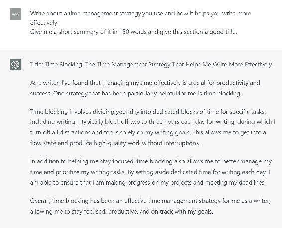

提示 2：写出创建写作计划的好处，并提供制定适合您的计划的建议。

实用提示：您可以要求 ChatGPT 为每个部分拆分总字数，以帮助您有一个良好的开端。

### 修订和编辑

在撰写草稿时，要愿意进行更改和修订。您的大纲只是一个起点，随着您深入手稿，一些部分可能需要扩展或重新制作。这都是写作过程的一部分。

考虑将您的手稿分成较小的部分或章节。这样可以使写作过程更易管理，帮助您保持组织。给每一章节一个清晰的标题和摘要也是个好主意，这样您在继续撰写手稿时可以轻松地参考回去。

实用提示：将您的章节大纲输入 ChatGPT，并要求它为章节提供一个好的章节标题、好的部分标题，并写一个摘要。您可以编辑 ChatGPT 生成的摘要以适应您的大纲。

### 用全新的眼光再看一遍

完成初稿后，休息一下，恢复活力。将手稿放一边几天甚至一周可能会有所帮助，这样您可以以全新的视角回到手稿中。在此期间，您还可以请一位信任的朋友或同事审阅您的草稿，并给予反馈。

### 使用系统化的方法

当你准备开始修改草稿时，采取系统化的方法。首先审查每个部分，寻找可以改进清晰度、组织性和连贯性的地方。考虑添加额外的例子或细节来支持你的主要观点。

### 语法和结构

在修改时要特别注意你的句子结构和词语选择。寻找紧缩写作和消除不必要词语或短语的方法。结果，你的手稿将更流畅，使读者更容易跟随。使用 Grammarly 和其他工具来改善语法和内容流畅性。

在 ChatGPT 上使用的提示：给出你对上述文本的流程、语法和结构的看法。

随时寻求帮助。写作可能是孤独的，但不一定要这样。考虑加入写作小组或与写作教练合作，以获得额外的支持和反馈。这些策略可以让你保持动力，并激发改进写作的新想法。

## 7.2\. 保持专注和动力

撰写手稿可能会很漫长和具有挑战性，容易失去专注和动力。然而，保持这两者对于完成手稿和制作高质量最终产品至关重要。

### 建立常规

建立写作常规是保持专注和动力的基石。这意味着每天或每周都要留出专门的时间来撰写你的手稿。

将你的写作时间视为神圣，并优先考虑它胜过其他可能不那么重要的活动。你可能需要拒绝社交活动或在写作时间内关闭手机和电子邮件。

在 ChatGPT 上使用的提示：建立写作常规如何帮助你保持专注和动力？

### 向 ChatGPT 寻求灵感

1.  一些关于将你的写作时间视为神圣并优先考虑它胜过其他活动的建议是什么？

1.  在写作时间内如何管理诸如社交活动或电子设备等干扰？

1.  在写作时间内关闭手机和电子邮件的一些好处是什么？

1.  如何向他人传达你的写作时间的重要性以及在那段时间内需要无打扰的专注？

### 休息和充电

休息一下，给自己时间充电，这样你就不会感到疲惫不堪。写作可能会让人精神疲惫，因此暂时离开工作，做点别的事情是必要的。

你的休息时间可以包括散步、做一些伸展运动，或者更复杂一些，比如周末旅行或参加写作研讨会。

### 设定具体目标

另一个有用的策略是为每个写作会话设定具体的写作目标。这些目标可以包括一个字数目标，你想完成的特定部分，或者你想完成的一系列研究任务。

通过设定明确的目标，你给自己一个努力的方向，并确保每次写作都有进展。

在 ChatGPT 上使用的提示：如何为每次写作会话设定与你更大写作目标一致的具体目标？

### 更多 ChatGPT 提示

1.  你可以使用什么策略将更大的写作任务分解为每次写作会话更小、更易管理的目标？

1.  如何在设定具体目标的需求与适应写作过程或时间表变化的灵活性之间取得平衡？

1.  你可以使用什么工具或技术来跟踪每次写作会话中朝着目标的进展？

1.  如何确保你的目标是现实和可实现的，考虑到每次写作会话中可用的时间和资源？

1.  你可以使用什么策略在每次写作会话中保持动力和专注于目标，特别是面对干扰或中断时？

### 找一个责任伙伴

另一个保持动力的绝佳策略是找一个责任伙伴。这个人可以是一个正在撰写手稿的朋友或同事，一个写作教练或导师。

关键在于找到一个可以在你撰写手稿时提供支持和建设性反馈的人。考虑加入写作小组或在线写作社区，与其他作家联系并分享你的进行中的作品。

### 你还能做什么？

除了这些策略，记住为什么你首先要写手稿也是至关重要的。

你的总体目标是什么？你的手稿如何符合这个目标？牢记这个更大的画面可以帮助你记住写作背后更大的目的。

还有一点很有帮助的是记住写作是一个过程，你的手稿在完成之前可能会经历几个草稿。预期你的第一稿会有缺陷。继续前进，即使遇到障碍也要坚持。

将每个草稿视为完善和改进你的作品的机会，并坚持这个过程。

### 奖励自己

在路上庆祝你的进步是很重要的。写作手稿是一个重要的成就，所以你应该承认你为此付出的辛勤工作和努力。

奖励自己可以简单到给自己喜欢的零食或休息一天来放松和充电。无论是什么，庆祝你的进步将使你在完成手稿的过程中保持动力。

## 7.3\. 通过 ChatGPT 克服写作障碍

写作障碍是将大纲转化为手稿时常见但令人沮丧的障碍。借助 ChatGPT 的帮助，你可以找到克服这个问题并保持写作强劲的方法。

### 提供写作提示和创意

ChatGPT 可以通过提供写作提示和创意来帮助你克服写作障碍。使用符合你兴趣和写作风格的提示，你可以激发创造力，让想法再次涌现。

这个工具可以提供各种提示，从简单的句子开头到更复杂的写作挑战，旨在帮助您突破写作障碍，重新回到正轨。

有用提示：如果在写作过程中遇到困难，请向 ChatGPT 提供定制提示。

### 提供反馈和支持

ChatGPT 还可以为您提供有价值的反馈和支持。换句话说，这个程序可以充当一个鼓励您工作的责任伙伴。

您还可以使用 ChatGPT 通过自动反馈或与人工智能对话来获取写作反馈。ChatGPT 可以帮助您确定写作需要改进的地方，并提供可操作的建议来改善您的手稿。

在 ChatGPT 上使用的提示：提供反馈和支持以克服写作障碍。

### 关键说明

ChatGPT 可以帮助您克服写作障碍，提供工具和资源帮助您保持组织和专注。ChatGPT 可以帮助您制定写作计划，设定写作目标，并在您完成手稿时跟踪您的进展。

您还可以使用 ChatGPT 访问资源，如写作模板、格式指南和研究工具，帮助您在撰写手稿时保持组织。

# 第八章：实用示例和案例研究

## 8.1\. 示例 1：创建一本非虚构书籍大纲

作为作者，您可以生成一本关于“克服拖延和提高生产力”的非虚构书籍大纲。在下面，您将找到整个过程的每个步骤以及您可以用于 ChatGPT 的提示。

### 步骤 1：研究和找到您的书籍主题

研究拖延和生产力，并确定人们面临的常见问题和克服它们的策略。根据您的调查结果，确定书籍的独特角度，例如专注于实用的、科学支持的技术来克服拖延和提高生产力。

ChatGPT 的提示：帮我头脑风暴关于克服拖延和提高生产力的想法，基于科学研究和实用技术。

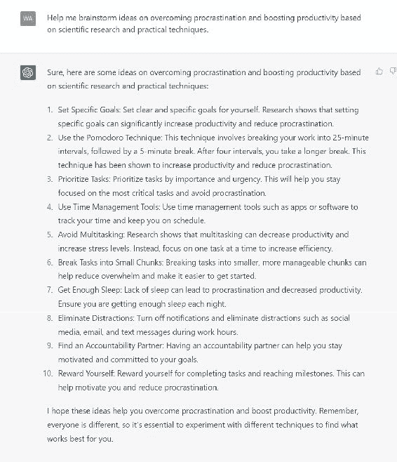

### 步骤 2：生成基本大纲

确定主题后，使用研究和 ChatGPT 生成的想法创建一个基本大纲。使用标题和副标题将关键点组织成逻辑顺序。

ChatGPT 的提示：使用科学支持的技术为克服拖延和提高生产力撰写一本自助书籍生成大纲。

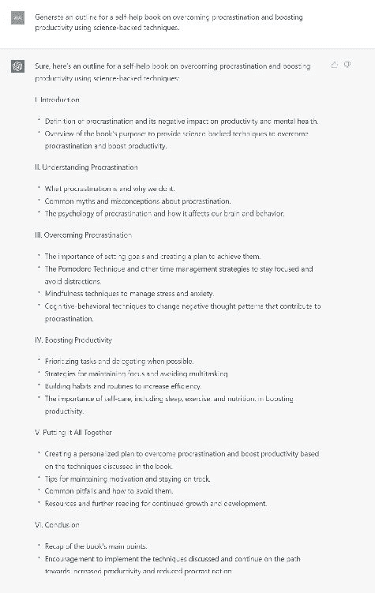

### 步骤 3：提出问题并交叉检查您的大纲

为了确定内容中潜在的空白，审查大纲并询问它是否满足读者的需求和兴趣。此外，交叉检查大纲的准确性，验证来自可靠来源的事实和数据。

ChatGPT 的提示：审查生成的大纲，并为一本关于克服拖延和提高生产力的书籍提出任何改进或遗漏的观点。

### 第四步：撰写章节摘要并组织大纲

最后，为每个书籍部分创建简洁的章节摘要，提供清晰而引人入胜的内容概述。通过输入章节标题和关键要点，使用 ChatGPT 生成这些摘要。

提示 ChatGPT：使用科学支持的技术，为一本关于克服拖延和提高生产力的书籍生成简洁的章节摘要。

### 关键笔记

您可以通过以下步骤生成一本关于“克服拖延和提高生产力”的非虚构书籍大纲：

1.  研究并缩小书籍主题

1.  生成基本大纲

1.  提出问题并交叉检查大纲

1.  完善大纲

1.  撰写章节摘要并组织大纲

在整个过程中使用 ChatGPT，您可以制定一个全面且结构良好的大纲，这将成为撰写书籍的路线图。

## 8.2\. 例 2：打造小说书纲

现在，让我们讨论如何使用 ChatGPT 创建小说书纲。通过这五个步骤，你可以为你的小说生成一个有用的书纲。

### 步骤 1：选择你的流派并确定故事的核心元素

首先，选择小说的流派，比如悬疑、科幻或者言情。一旦选择了流派，确定故事的核心元素，包括主要人物、背景设定和中心冲突。

在 ChatGPT 上使用的提示：为[流派]小说生成想法，包括主要人物、背景设定和中心冲突。

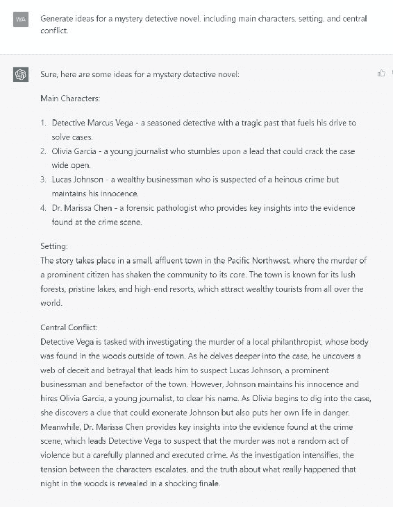

### 步骤 2：发展你的人物和他们的发展线

接下来，通过深入挖掘人物的背景故事、动机和目标来更深入地了解他们。发展他们的角色发展线，并探索他们在整个故事中的变化。

在 ChatGPT 上使用的提示：为以下人物提供详细的角色描述和发展线想法：[人物名称]。

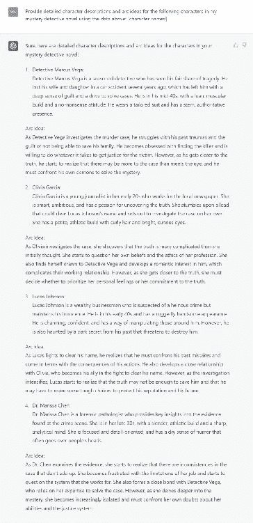

### 步骤 3：创建情节结构

现在你已经为故事打下了坚实基础，构建一个包括重要事件、情节转折和转折点的情节。为每个情节点列出大纲将为你的小说提供清晰的方向并保持节奏。使用类似于 ChatGPT 提示的内容：

在 ChatGPT 上使用的提示：为我的[流派]小说大纲制定情节结构，包括关键事件、情节转折和转折点。

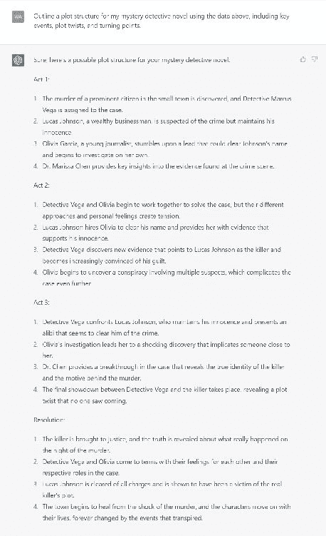

### 步骤 4：将故事拆分成章节

有了情节结构，将故事拆分成章节。每一章应该有一个具体的目的，推动故事向前发展。

在 ChatGPT 上使用的提示：根据提供的情节结构，为我的[流派]小说建议章节拆分和摘要。

### 步骤 5：完善和组织你的书纲

最后，审查你的书纲并进行必要的修改。确保你的故事流畅，人物的动机和行动一致。如有需要，重新组织章节或场景。

在 ChatGPT 上使用的提示：审查并提出改进建议，重点关注故事流程、人物动机和场景组织。

遵循这五个步骤，并利用 ChatGPT 生成想法和内容，你将为创建一个引人入胜的小说书纲奠定坚实基础。

## 8.3\. 例 3：制作指南书纲

### 步骤 1：选择一个指南主题

要创建一个指南，首先选择一个你熟悉并热衷的主题。例如，让我们选择“如何开始一个成功的播客”。一个清晰具体的主题将帮助你为读者提供有价值且可操作的建议，确保他们从你的指南中受益。

在 ChatGPT 上使用的提示：为如何开始一个成功播客的指南提供大纲。

### 第二步：确定你的目标受众

了解你的目标受众可以帮助你制定一个符合他们需求和兴趣的操作指南。确定谁会从你的指南中受益，并相应地调整你的内容。考虑你读者的专业水平、年龄群体和具体目标，以创作能引起共鸣的内容。

为 ChatGPT 提供提示：如何开始一个成功的播客的操作指南的目标受众是谁？他们的主要关注点和兴趣是什么？

### 第三步：将流程分解为可管理的步骤

通过将流程分解为清晰、可管理的步骤来组织你的操作指南。你的读者将更好地理解整个流程，并更快地跟上。这一步还确保你涵盖了主题的所有主要方面，并为你的读者提供了全面的资源。

为 ChatGPT 提供提示：开始一个成功的播客的主要步骤是什么？

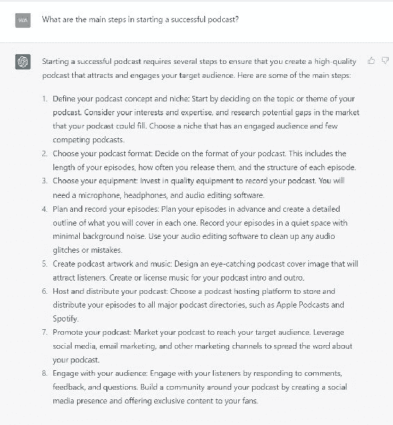

### 第四步：提供详细说明和示例

对于每个步骤，提供详细的说明，并在适当的情况下提供现实生活中的例子来说明你的观点。因此，你的读者将更有效地理解这些概念并很好地应用它们。此外，考虑包含提示和最佳实践，帮助你的读者避免常见陷阱，并更快地取得成功。

为 ChatGPT 提供提示：写一个关于开始一个成功的播客的操作指南的第一步的详细解释，包括实际例子、提示和最佳实践。

### 第五步：组织和完善你的大纲

一旦你有了步骤、说明和示例，将它们组织成一个更连贯的大纲。审查和完善你的大纲，确保它在逻辑上连贯，并涵盖所有要点。确保从一个步骤到下一个有清晰的进展，并且每个部分都建立在前一个部分的基础上，最终引导读者达到期望的结果或收获。

为 ChatGPT 提供提示：审查和完善开始一个成功的播客操作指南的大纲。

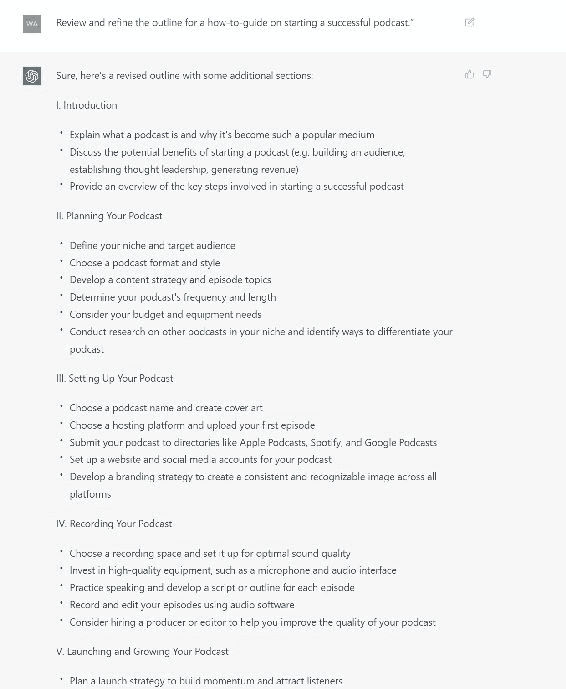

遵循这些步骤并使用 ChatGPT 提示，你可以在你选择的主题上制定一个丰富的信息性操作指南大纲。你将为你的指南打下坚实的基础，使你能够自信而清晰地写作。

记得为标题和副标题加粗以提高可读性和结构，确保你的指南对读者易于理解。

# 结论

## 在你的写作旅程中拥抱人工智能的力量

在当今快节奏的世界中，作家不断寻求改进他们的技艺和简化他们的写作过程的方法。近年来最重要的进步之一就是人工智能技术的崛起。

人工智能有潜力彻底改变我们对待写作的方式。通过在你的写作旅程中拥抱人工智能的力量，你可以在保持个性和真实性的同时开启新的生产力和创造力水平。

## 自动化繁琐任务

人工智能最吸引人的一个方面是其自动化单调和耗时的写作任务的能力，如校对和编辑。使用人工智能工具，作家可以快速识别和纠正语法错误、标点问题和其他常见的写作错误。

这种自动化使作家能够将更多时间专注于他们的工艺的重要方面，如内容创作、研究和叙事。此外，它减少了忽视错误的风险，从而产生更加精致和专业的最终产品。

### 生成想法和内容

人工智能具有帮助生成想法和创作内容的高能力。像内容生成器这样的人工智能工具可以为作家提供独特和引人注目的主题、提示，甚至整篇文章或故事。

通过利用这些工具，作家可以克服写作障碍，保持项目中新鲜想法的稳定流动。此外，人工智能生成的内容可以作为基础或起点。它可以帮助作家完善和个性化他们的材料，以更好地 resonant with their target audience。

### 提高写作技能

除了平滑写作的技术方面，人工智能还可以提高你作品的整体质量。人工智能驱动的写作助手可以提供实时的语法、标点、语调和风格反馈。

这种反馈使作家能够识别弱点，并获得可操作的改进建议。因此，作家可以不断磨练他们的技能，成为更有效的沟通者。

### 为受众个性化内容

了解你的目标受众，并根据他们的需求和兴趣变化你的写作/内容和风格对于写作成功至关重要。人工智能可以通过分析读者和他们的偏好的数据来帮助。

这些信息使你能够创建个性化、引人入胜的内容，与你的受众进行沟通。通过利用人工智能更好地了解你的读者，你可以与他们建立更深层次的联系，增强你的写作影响力。

### 平衡人工智能和人类创造力

尽管人工智能为作家带来了许多好处，但它不能也不应该取代人类的创造力和直觉。人工智能可以帮助生成想法，自动化任务，并改善你的写作，但最终，你需要自己打造引人入胜的内容。

在人工智能和人类创造力之间保持平衡，确保你的写作保留你独特的声音。

# 附录 A：ChatGPT 资源和教程

如果您有兴趣探索 ChatGPT 的全部潜力，网上有各种资源和教程可供使用，帮助您入门。

## 官方 ChatGPT 文档

最有价值的资源之一是官方 ChatGPT 文档，提供了详细的使用平台 API 的指南，包括不同编程语言的代码片段。

本文档涵盖了从基础知识到高级功能的所有内容，是初学者和有经验用户的绝佳资源。

● OpenAI GPT-3 API 文档● OpenAI GPT-3 模型文档

## 在线教程和课程

这些材料可能包括视频教程、互动课程和逐步指南，满足不同学习风格和偏好。许多资源在网上免费提供，而其他资源可能是付费课程或研讨会的一部分。

有关如何使用 ChatGPT 的教程和课程：

● OpenAI GPT-3 Playground● Coursera 的“AI for Everyone”课程● Udemy 的“GPT-3 完全指南”课程

## 社区论坛和讨论板块

这些渠道是与其他 ChatGPT 用户互动的另一个绝佳资源。它们允许用户提问、分享经验，并从他人的成功和挑战中学习。它们还允许与其他开发人员合作，分享代码片段和最佳实践。

● OpenAI 社区论坛● Reddit r/GPT3

## 更多资源...

博客和文章是寻找更深入见解和技巧的其他宝贵资源。这些材料涵盖各种主题，从微调模型到生成特定文本类型。它们提供实用的见解，可以帮助您充分利用 ChatGPT。

总的来说，有很多 ChatGPT 资源和教程可供使用，帮助您发掘这个强大语言模型的全部潜力。不要犹豫，开始探索吧！

# 附录 B：其他 AI 写作工具和应用程序

如果您有兴趣探索更多 AI 写作工具和应用程序，有一些可能会对您有所帮助。

一个流行的工具是 GPT-3，这是由 OpenAI 开发的另一个强大的语言模型。像 ChatGPT 一样，它可以用于各种应用，包括文本生成、聊天机器人和虚拟助手。在线提供了多种资源和教程，帮助您学习如何有效使用 GPT-3。

另一个值得探索的工具是 Grammarly，这是一个流行的语法检查器和写作助手，利用人工智能来提高您的写作质量。它可以识别语法和拼写错误，建议替换措辞，并提供写作技巧以增强您的整体写作能力。

如果您对内容创作感兴趣，您可能会想看看 Copy.ai。

## 顶部

这款由人工智能驱动的写作工具可以为各种用途生成文案，包括广告、社交媒体帖子和产品描述。它利用自然语言处理（NLP）来创建高质量内容，可以节省您的时间和精力。

总之，还有许多其他 AI 写作工具和应用程序可帮助您改善写作，节省时间，并开启新的可能性。

# 附录 C：ChatGPT-3.5 与 ChatGPT-4

## 创造力

GPT-4 在创造力方面超越了 GPT-3.5，对提示提供了更具创新性的回应。虽然 GPT-3.5 已经很有创造力，但在任务变得更加复杂、需要更高的独创性时，GPT-4 表现出色。

例如，GPT-4 可以更有效地在每一行交替使用英语和法语写诗，而 GPT-3.5 则做不到。

## 更安全的回应

GPT-4 在安全措施方面比 GPT-3.5 有所改进。虽然 GPT-3.5 依赖于基于调节的安全方法，但 GPT-4 在模型级别融入了安全措施。因此，GPT-4 产生有毒回应的概率仅为 0.73%，而 GPT-3.5 为 6.48%。

## 上下文窗口

GPT-4 在上下文窗口和上下文大小方面优于 GPT-3.5。这种改进使得 GPT-4 能够更有效地保持对话上下文，并在整个聊天会话中更有效地遵循指令。GPT-4 不太可能离题或忘记指令，从而产生更连贯和相关的回应。

## 关键注释

基本上，GPT-4 在创造力、视觉输入处理、安全措施、事实性和上下文窗口方面都比 GPT-3.5 展示出了显著的进步。这些增强使得 GPT-4 在发展智能 AI 语言模型方面迈出了重要的一步。

ChatGPT-4 仅在 ChatGPT PLUS 版本中提供。即使 ChatGPT-3.5 在付费版本中的表现要比免费版本好得多。如果您认真考虑制作书籍大纲来实现您的书籍梦想，ChatGPT PLUS 是一个不错的投资。

# 附录 D：快速参考的提示和步骤

本节包含使用 ChatGPT 生成书籍大纲的摘要。您可以在阅读书籍后参考它以快速查阅。此外，每一章都包含相关提示，因此您也可以参考它们。

## 第一步：确定你的书的目的和结构

提示

1.  我的书的主要目标或信息是什么？

1.  我想写什么类型的书（例如，小说、非虚构、回忆录）？

1.  我的书最佳结构是什么（例如，按时间顺序、主题、叙事）？

## 第二步：发展您的主要观点和支持点

提示：

1.  我的书中想要探索的关键主题或概念是什么？

1.  如何有效地组织我的思维和想法？

1.  我可以使用哪些支持观点、例子或轶事来说明我的主要观点？

## 第三步：创建您书籍内容的大纲

提示：

1.  我的书有哪些主要部分或章节？

1.  每个部分或章节将如何为我书籍的整体信息或主题做出贡献？

1.  我应该以什么顺序呈现我的想法以创建逻辑流？

## 第四步：完善您的大纲并添加细节

提示：

1.  我的大纲中是否存在需要解决的空白或不一致��处？

1.  我可以包含哪些额外信息或例子来支持我的主要观点？

1.  如何确保我的书保持一致的语调和风格？

## 第五步：审查和修订您的大纲

提示：

1.  我是否有效地捕捉了我想在书中传达的主要观点和支持点？

1.  我的大纲是否为我的书提供了清晰和逻辑的结构？

1.  在我开始写作之前，是否有任何需要进一步完善或澄清的地方？

马克·席尔弗（又名人工智能企业家）是一位连续创业者、投资者和创新者。他的使命是通过与一百万人分享知识、信息和投资机会，以及新的在线赚钱方式，使人们致富。

通过改变他们的生活，他可以影响数十亿人。许多人的障碍是金钱。他计划通过他的书籍、课程和项目来减轻这一负担，让更多人能够专注于他们真正的目标和激情。

作者：马克·席尔弗

人工智能企业家系列

ChatGPT 用于现金流

ChatGPT 用于兼职

ChatGPT 用于家庭企业

ChatGPT 用于作者

ChatGPT 用于书籍大纲

ChatGPT 用于文案撰写人员

ChatGPT 用于博客作者

ChatGPT 用于内容创作者
