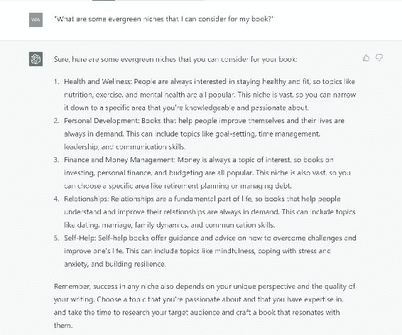
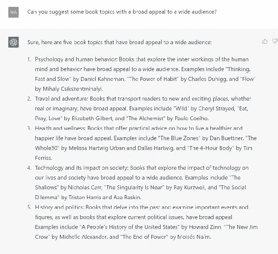
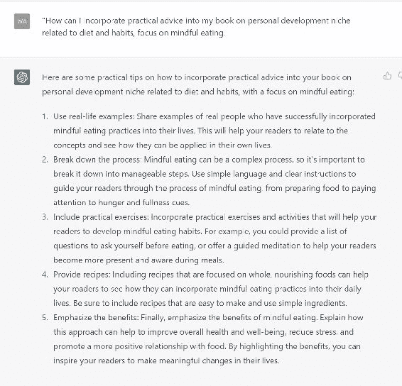
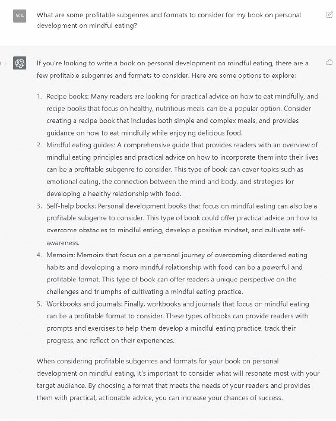
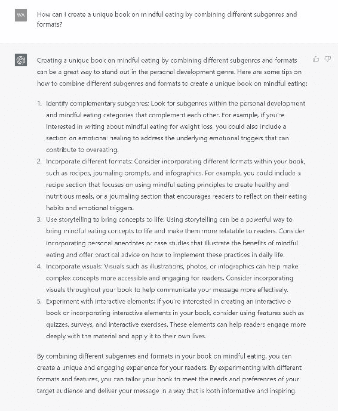

# 第二章：了解盈利书籍主题的市场

## 2.1\. 分析当前趋势和热门主题

找到盈利书籍主题涉及查看当前趋势和热门主题。通过跟踪流行和需求旺盛的内容，你可以使你的主题符合目标读者的需求，并提高成功的机会。

以下是查看热门主题和当前趋势的一些方法：

+   寻找新兴趋势：留意出版业中的新兴趋势，如读者偏好的变化、新兴流派和新技术。这些趋势可以帮助你发现新的创新书籍主题的机会。

+   关注热门媒体：留意媒体中流行的内容，如电影、电视节目和社交媒体。例如，如果某个特定的电视节目引起了很多关注，可能有机会写一本探索类似主题或话题的书籍。

+   监控畅销书榜单：跟踪你选择的流派和所有流派中销售良好的书籍。保持信息灵通可以帮助你识别流行的主题和流派，你可能想进一步探索。

+   使用社交监听工具：社交监听让你追踪人们在社交媒体上对特定主题或趋势的讨论。你可以获得有价值的见解，了解当前流行的内容以及读者所追求的。

一旦你确定了当前趋势和热门主题，你可以调整你的书籍主题以满足目标读者的需求。以下是一些如何做到这一点的示例：

+   新鲜视角：对流行主题或趋势提供新的视角。例如，如果正念是一个热门话题，你可以为忙碌的专业人士提供新的正念观点。

+   探索利基主题：专注于更广泛问题中的特定利基。例如，不要写一本关于营养的一般书籍，你可以专注于运动员或患有特定医疗条件的人的营养。

+   及时性：写一本当前相关或及时的主题书籍。如果某个社会问题引起了很多讨论，你可以写一本深入探讨该问题的书籍。

### 关键要点

查看当前趋势和热门主题对于找到好的书籍主题至关重要。通过跟踪流行内容，你可以使你的主题符合目标读者的需求，并提高成功的机会。你可以写一本吸引目标读者并脱颖而出于类似书籍的书，通过提供新的观点，探索利基主题和保持更新。

## 2.2\. 辨识长青利基市场

长青利基是指无论出版业变化或当前趋势如何，仍然受欢迎和需求的主题。

要了解长青利基，你可以浏览在线商店，如亚马逊 Kindle、苹果书店、巴诺斯和贵族、Kobo 等。你也可以在谷歌上搜索。

你也可以使用 ChatGPT 进行研究，通过询问以下提示：

1.  我可以考虑哪些长青的利基市场来写我的书？

1.  列出随时间仍然受欢迎的热门常青领域。

以下是一些识别常青领域的提示。

### 考虑永恒的主题

自助、个人理财和人际关系等几十年来一直受欢迎的主题很可能会保持受欢迎。这些主题吸引了读者的需求和欲望，并将保持相关性。

在 ChatGPT 上使用的提示：

1.  有哪些几十年来一直受欢迎的永恒主题？

1.  哪些主题被认为是永恒的并具有持久的吸引力？

#### 寻找具有广泛吸引力的主题

吸引广泛受众的主题更有可能是常青的，如健康与健康、个人发展和爱好。

在 ChatGPT 上使用的提示：

1.  你能推荐一些对广泛受众具有广泛吸引力的书籍主题吗？

1.  哪些主题由于其广泛吸引力而有可能是常青的？

#### 考虑具有持续相关性的主题

持续相关的主题，如商业和创业，很可能会保持受欢迎。人们总是想要开始和经营有利可图的企业。

在 ChatGPT 上使用的提示：

1.  有哪些具有持续相关性并且随着时间流逝仍然受欢迎的主题？

1.  哪些书籍主题（小说和非小说）仍然与当前趋势无关，仍然受到关注和需求？请列出[number]个主题。

#### 研究经典作品

查看经受时间考验的书籍，如经典文学，并确定导致它们持久受欢迎的因素。这些书籍可能会提供关于什么使一个主题常青的见解。

在 ChatGPT 上使用的提示：

1.  什么因素导致经典文学持久受欢迎？

1.  如何通过研究经典文学来确定常青书籍的主题？

#### 提供更具体的建议

一旦确定了常青领域，你可以调整你的书籍主题以满足目标受众的需求。以下是一些如何做到这一点的示例：

专注于特定领域或主题

与撰写一本关于个人理财的通用书籍不同，你可以专注于面向千禧一代或退休人士的个人理财。

在 ChatGPT 上使用的提示：

1.  如何将一个常青主题缩小到一个特定的领域？

1.  在受欢迎的常青主题中有哪些特定领域的例子？

提供独特的观点

对常青主题提供新颖的观点。例如，由于有许多关于冥想的书籍，你可以撰写一本针对忙碌的专业人士或运动员的冥想书籍。

在 ChatGPT 上使用的提示：

1.  如何在一个常青主题上提供独特的观点？

1.  有哪些方法可以使我的书在相同的常青领域中与其他书区分开来？

提供实用建议

提供读者可以应用于自己生活的实用建议和工具。例如，如果你正在写一本关于时间管理的书，提供读者可以用来提高生产力的有用提示和策略。

在 ChatGPT 上使用的提示：

1.  我如何在我的书中融入关于长青主题的实用建议？

1.  一本关于[主题]的书有哪些有用的提示和策略的例子？

### 关键要点

找到永远有需求的利基是找到有利可图的书籍创意的关键。通过写关于广泛人群感兴趣且仍然重要的主题的书籍，你可以写一本保持流行的书。

通过将主题定制为目标读者，提供独特的观点和实用建议，写一本能够吸引目标读者并在竞争激烈的市场中脱颖而出的书��

## 2.3\. 探索有利可图的子流派和格式

探索有利可图的子流派和格式是识别好书籍主题的另一个关键步骤。子流派是更广泛类型中的具体类别，而格式指的是书籍的呈现或结构方式。

通过探索流行的子流派和格式，你可以找到吸引读者并在竞争激烈的市场中脱颖而出的书籍创作机会。

### 识别流行的子流派

寻找当前流行的你选择的类型中的特定类别。使用亚马逊筛选器，通过网站获取信息，或使用 ChatGPT 找到子流派。

在 ChatGPT 上使用的提示：

1.  我可以考虑哪些有利可图的子流派和格式来写书？

1.  你能列出[类型]类别中一些流行和新兴的子流派吗？

### 考虑新兴子流派

寻找正在流行的新兴子流派，比如生态惊悚或末日浪漫。这些子流派可能为新颖和创新的书籍主题提供机会。

在 ChatGPT 上使用的提示：

1.  [类型]类别中流行的子流派有哪些？

1.  我如何找到我选择的类型中流行的子流派？

### 探索不同的格式

考虑不同的书籍呈现格式，比如图像小说，互动书籍或有声书。这些格式可能吸引那些喜欢不同阅读体验的读者。

在 ChatGPT 上使用的提示：

1.  我可以考虑哪些不同的书籍格式？

1.  我如何决定最佳的书籍呈现格式？

#### 更具体的提示

一旦你确定了潜在的子流派和格式，你可以通过以下方式进一步调整你的书籍主题：

专注于特定子流派

不要写一本一般的言情小说，而是专注于特定的子流派，比如历史或超自然言情。

在 ChatGPT 上使用的提示：

1.  我如何将我的书籍主题调整为专注于我选择的类型中的特定子流派？

1.  在[类型]类别中专注于特定子流派的例子有哪些？

尝试不同的格式

考虑尝试各种不同的格式来呈现你的书，比如交互式电子书或图文并茂的改编小说。

在 ChatGPT 上使用的提示：

1.  我如何尝试不同的格式来呈现我的书？

1.  将我的书以不同格式呈现的好处是什么，比如交互式电子书或图文并茂的改编小说？

结合次类型和格式

考虑结合不同的次类型和格式，创作一本独一无二在市场中脱颖而出的书。例如，你可以写一本图文并茂的舒适悬疑小说。

在 ChatGPT 上使用的提示：

1.  如何通过结合不同的次类型和格式创作一本独特的书？

1.  有哪些成功结合次类型和格式的书的例子？

### 关键笔记

如果你想找到好的书题材，研究有利可图的次类型和格式。通过考虑新颖和流行的次类型以及不同的格式，你可以写一本读者喜欢且在拥挤市场中脱颖而出的书。
