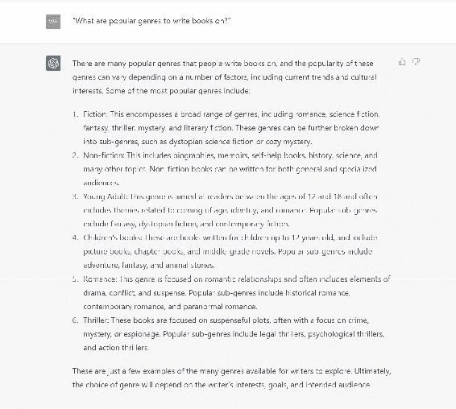
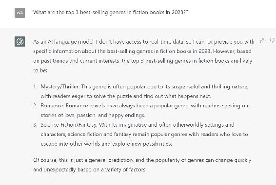
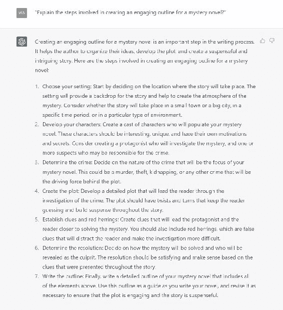
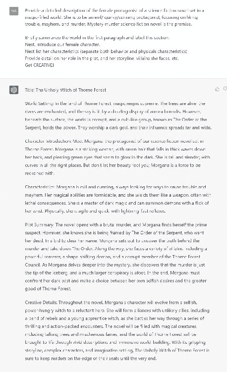
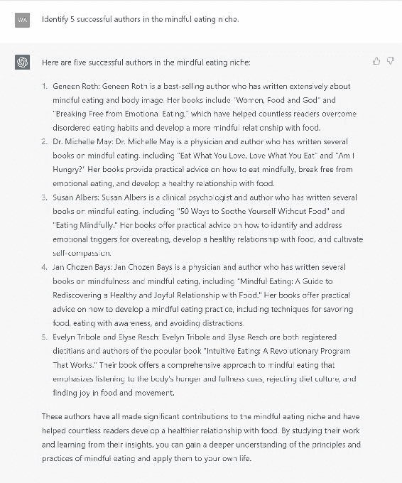
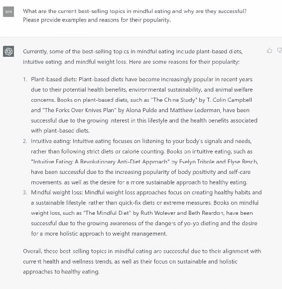
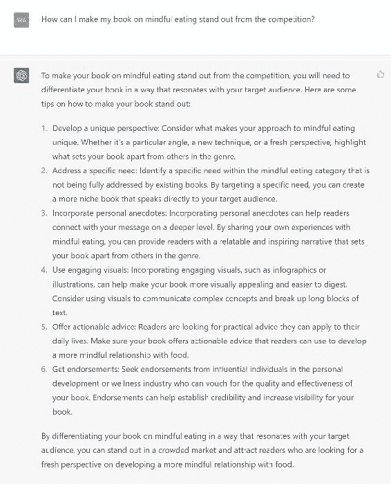
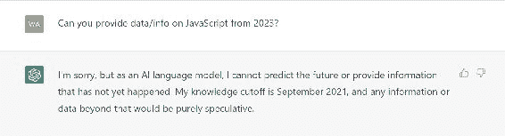
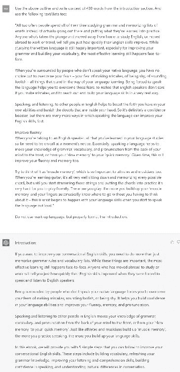

# 第三章：使用 ChatGPT 研究高需求主题

在使用 ChatGPT 制作书籍大纲之前，你需要了解关于这个 Open AI 的一切。本章将向你展示如何入门，最有效的提示以及如何缩小你的书籍主题。

## 3.1\. 为市场研究设置 ChatGPT

### 适当的 ChatGPT 计划

随着 ChatGPT 的当前热度，你可以免费使用 ChatGPT 账户。这个免费版本包括 ChatGPT-3.5，并且在创造力、准确性和相关性方面功能有限。

Open AI 还提供 ChatGPT Plus。升级计划每月仅需 20 美元，包括一系列出色和高级功能。Open AI 还推出了 ChatGPT 4，具有出色的推理和简洁性，但速度相对较慢。Plus 版本的 ChatGPT-3.5 也比免费版本更快更准确。

假设你认真考虑创建一个强大的书籍大纲。在这种情况下，我建议使用 ChatGPT 4 的 Plus 计划，因为它提供更相关、创新和描述性的答案。

如果你负担不起，你可以尝试使用 ChatGPT-3.5。这个版本在小说甚至非小说方面表现出色，因为你需要想法才能构建你的大纲。然而，你将不得不与它密切合作，以制定一个畅销的大纲。

### 访问和使用 ChatGPT

当你决定了适当的书籍大纲计划后，你可以通过 Web 应用访问 ChatGPT（适用于大多数浏览器）。虽然 ChatGPT 也有 API，但你只需要 Web 应用来创建和完善书籍大纲。

### 测试和提示

你可以尝试不同的提示，看看 ChatGPT 的响应如何（ChatGPT 4 不会让你失望！）。设置好 ChatGPT 后，一切都取决于提示。

## 3.2\. 为主题发现制定有效的提示

通过有效的提示，你可以使用 ChatGPT 获得有价值的回应。

### 使用具体和清晰的提示

ChatGPT 是一个 AI 模型，所以你需要清晰、简洁和具体才能得到相关的回应。

不要问模糊的问题，比如“写作的流行流派是什么？”AI 会给出杂乱、无组织和冗长的答案，反映了问题本身。

相反，问具体的问题，比如：

1.  2023 年小说书籍中畅销的前三大流派是什么？

1.  [主题]的主要特征是什么？

上面的截图澄清了两个问题之间的明显差异。记住，ChatGPT 不知道你在想什么，所以你需要解释清楚。

### 提出开放式问题

通过开放式问题，ChatGPT 将提供更详细的回应和关于你的查询的想法。因为开放式问题没有简单的“是”或“否”的回应，它们迫使 AI 模型利用知识并给出详细的回应。这些问题遵循为什么、如何、什么或描述模式。

让我们看看开放式问题如何与 ChatGPT-3.5 配合，以及它们与封闭式问题的比较：

想象你是一位小说悬疑作家，想知道写作一本悬疑小说的所有步骤，因为你卡住了。你在想，悬疑小说需要大纲吗？

但这个提示不会给出正确答案。相反，请使用下面给出的开放式提示。

正确的提示：解释为悬疑小说创建引人入胜大纲所涉及的步骤。

开放式问题提供更多信息、方向和细节，为书籍大纲提供了一个焦点。其他开放式问题的例子包括：

1.  一个关于[主题]的有效非虚构书籍大纲的基本组成部分是什么？

1.  作家如何为设定在[历史小说/流派]书籍中的[历史时期/事件]的引人入胜大纲？

1.  作者可以使用什么策略来为[主题]书籍创建一个引人入胜的大纲？

### 包括上下文和限制

列出具体的上下文和限制，以确保 ChatGPT 给出你想要的回答。如果你不添加限制并提供关于你想要从主题���得到什么的背景信息，ChatGPT 将生成一个不符合你主题的一般性大纲。

具有上下文和限制的提示示例

提示 1：建议 5 个与城市居民可持续生活相关的书籍主题，所有这些主题都侧重于实用技巧和日常习惯。

上下文：

● 城市居民● 实用技巧● 日常习惯

限制：

● 5 本书的主题

提示 2：描述一个设定在充满魔法的世界中的科幻小说女主角的详细描述。她是一个邪恶/古怪/狡猾的主角，喜欢惹麻烦、混乱和谋杀。

上下文：

● 女主角● 科幻小说● 充满魔法的世界

限制：

● 主角必须具有邪恶/古怪/狡猾的性格。● 该角色喜欢惹麻烦、混乱和谋杀。

提示 3：列出过去 5 年内出版的对个人成长和生产力专注的前 4 本最具影响力的自助书籍。

上下文：

● 自助书籍● 个人成长● 生产力

限制：

● 前 4 本具有影响力的书籍● 出版时间在过去五年内（ChatGPT 的数据截至 2021 年，所以过去五年意味着 2017-2021 年）

### 重复和完善

在这本书中测试提示，并根据你的需求调整它们。如果 ChatGPT 对任何提示给出了一般性答案，请用上下文和限制使你的提示更具体，然后再次测试。不断测试并询问不同的提示，直到它给出令你满意的答案。

当提问时，你需要发挥创造力，从不同角度看问题。

## 3.3\. 评估和优先考虑潜在主题

### 主题相关性和盈利性

在使用 ChatGPT 生成目标领域的潜在主题后，现在是时候交叉检查这些主题是否与你的领域相关，并且它们是否具有畅销潜力。

### 评估相关性和盈利能力时的因素

+   竞争：为了你的书籍成功，你应该检查市场上是否有类似的书籍，并评估它们的表现。你可以查看亚马逊 Kindle 等热门在线商店。

+   市场需求：在检查竞争因素后，看看你的书籍理念是否会在市场上引起轰动。通过社交媒体、在线商店等途径搜索，了解读者是否喜欢[你的理念]书籍。只有在有足够的受众时，你的书籍才会销售。

+   领域潜力：每个主题都有一个领域，所以你需要确定你的书籍理念是否有潜力成为其领域的畅销书。你可以扫描谷歌或亚马逊，看看是否有类似你的主题的书籍在其领域中流行。

### 使用 ChatGPT 进行竞争分析

为了节省自己进行竞争分析的时间，你可以要求 ChatGPT 通过使用提示来完成：

● 列出过去两年中关于[主题]的畅销书籍前 10 名。● 识别[主题]领域中的 5 位成功作者。

### ChatGPT 协助的更多提示：

1.  分析使[竞争对手的书名]在[主题]领域成功的关键因素。

1.  比较[主题]流派中前 3 位作者的写作风格。

1.  提供[主题]类别畅销书籍目标受众的概述。

1.  前 5 本关于[主题]的畅销书籍中有哪些共同主题和元素？

### 评估和排名潜在主题

在收集关于你潜在主题的数据后，你需要根据一些因素对它们进行排名：

盈利能力：问问自己哪些主题有最高的销售潜力。什么能让我的名字家喻户晓？

● [流派]中当前畅销的主题是什么，它们为什么成功？请提供例子和它们受欢迎的原因。

热情和专业知识：你对该主题是否有真正的兴趣或���业知识？

主题类型：该主题是长青的，还是短期趋势？

● 在撰写关于长青主题与短期趋势的书籍时，优缺点是什么？请讨论受众兴趣、竞争和长期潜力等因素。

### 测试你的想法

在确定主题之前，通过小众群体测试你的想法，以评估他们的反应和兴趣。你可以使用社交媒体、电子邮件调查或在线论坛收集反馈。

向 ChatGPT 寻求帮助：

1.  你对阅读关于[主题]的书籍感兴趣吗？

1.  你对学习[主题]的哪些方面最感兴趣？

1.  你在[主题]方面遇到了哪些挑战或障碍？你对阅读解决这些挑战并提供解决方案的书籍感兴趣吗？

### 完善你选择的主题

根据你的反馈，调整你选择的主题，以更好地符合目标受众的需求和偏好。使用 ChatGPT 帮助你进行头脑风暴和完善你的理念。

你可以使用提示如下：

1.  为[主题]的一本书提出一个独特的角度。

1.  在关于 [主题] 的书籍中需要涵盖哪些关键子主题？

1.  人们在尝试学习或应用 [主题] 时通常会面临哪些挑战？

1.  如何使我的关于 [主题] 的书籍在竞争中脱颖而出？

1.  关于 [主题] 文献中当前存在哪些空白？

总之，通过评估和优先考虑潜在的书籍主题，专注于最有前景的想法。使用 ChatGPT 协助进行竞争分析，通过小众群体测试你的想法，并完善你选择的主题，以创作一本能吸引目标读者的书籍。

你将在附录 D: 快速参考的提示和步骤中找到所有这些提示。

# 第四章：使用 ChatGPT 创建高质量、事实性的大纲

## 4.1\. 确保准确性和最新信息

在线信息量无限，很难辨别真假。一旦掌握了识别可靠信息的窍门，你就能快速判断你所阅读的内容是否准确。

创建高质量、事实性的大纲需要确保准确性和最新信息。准确性指的是所呈现信息的真实性和可靠性，而最新信息意味着使用关于该主题的最新和最新研究、数据和信息。

在创建大纲时确保最新和最准确信息的一些方法包括：

+   使用可信赖的来源：在为你的大纲进行研究时，使用可信赖的来源，如学术期刊、书籍、声誉良好的新闻来源和政府网站。可信赖的来源提供可由该领域专家验证的可靠信息。

+   交叉核实信息：从各种来源获取的信息进行交叉核实以确保一致性。具体来说，检查事实或信息是否与其他来源一致，或请教该领域的专家。

+   检查出版日期：始终检查每个来源的出版日期。过时的信息可能导致不准确，并潜在地误导读者。

在 ChatGPT 上使用的提示：你能提供关于 2023 年 JavaScript 的数据/信息吗？

+   考虑背景：有些主题可能需要比其他主题更近期的数据，而其他主题可能需要几年前的信息以提供历史背景。对于最新数据，通过在线数据库搜索而不是使用 ChatGPT。但你仍然可以将 ChatGPT 作为指南。

+   避免偏见：在处理问题时要客观，并公正地呈现所有观点。查阅多个来源，并以中立的方式呈现证据。

+   谨慎使用语言：避免夸大、夸张或误导性统计数据。坚持以清晰简洁的方式呈现事实信息。

通过确保准确性和最新信息，你可以创建一个高质量的大纲，为读者提供可信赖的信息。

## 4.2\. 避免抄袭和版权问题

对于任何内容创作者，无论是作家、学生还是博客作者，抄袭和侵犯版权都可能是一个大问题。这些问题可能导致法律诉讼、声誉受损，甚至收入损失。

在本节中，我们将定义抄袭和侵犯版权，如何避免它们，以及如何保护自己的作品免受抄袭或侵权。

## 什么是抄袭和侵犯版权？

抄袭是将他人的作品或想法呈现为自己的行为，而未经授权使用他人的受版权作品则是侵犯版权。抄袭可能发生在学术写作、新闻报道，甚至创意写作中。侵犯版权可能导致法律诉讼和经济处罚。

抄袭包括从源中复制粘贴文本而不引用、改写而不承认原始来源，甚至使用他人的想法而不给予他们信用。

侵犯版权可能包括使用照片或图像、复制他人的文字，或未经许可使用他人的音乐或视频。

## ChatGPT 内容中的抄袭

在使用 ChatGPT 创建大纲或内容时，要注意意外抄袭的可能性。

ChatGPT 中抄袭可能发生的一种方式是通过使用现有内容作为生成新内容的起点。

例如，假设用户将现有文章或大纲输入 ChatGPT 作为提示。那么生成的内容可能与源材料过于相似，这可能被视为抄袭。

在 ChatGPT 上使用的提示：使用上述大纲，并从介绍部分撰写 400 字的内容。同时使用以下文本/数据：[从互联网复制粘贴的数据]

根据 Grammarly，上述文本包含 26% 的抄袭内容。

另一种 ChatGPT 中可能发生的抄袭方式是通过生成的内容与现有内容非常相似但未经适当引用。ChatGPT 可能生成包含与现有作品相似短语或句子的内容，而未明确引用原始来源，导致意外抄袭。

此外，工具可以帮助检测抄袭，例如在线抄袭检测器如 Grammarly 抄袭检测器、Turnitin 和 Copyscape。这些平台可以验证使用 ChatGPT 生成的任何内容的原创性。

通过采取措施避免抄袭并确保所有来源得到适当引用，用户可以利用 ChatGPT 创作原创且引人入胜的内容，同时保持学术和道德标准。

### 如何避免抄袭和侵犯版权

使用适当的引用：在使用他人的作品或想法时，请确保给予他们信用。在您的写作中使用适当的引用来指示信息的来源。例如，您可以在文中引用、脚注或尾注中加入引用。

谨慎改写：在改写他人作品时，要大幅改变措辞，使其与原作不太相似。始终要给予原作者以信用。

使用抄袭检测工具：使用 Turnitin 或 Grammarly 检查您的作品是否存在抄袭。这些工具可以将您的作品与其他作品的广泛数据库进行比较，以识别任何相似之处。

获得许可：如果您想使用他人的作品，请先获得他们的许可。获得许可可以包括请求使用照片或图像的许可，或复制他人的文字。

### 保护您的作品免受抄袭和侵权

注册版权：在您所在国家的版权办公室注册您的作品。这样可以提供法律保护，并使您更容易采取法律行动，如果您的作品被抄袭或侵犯。

使用水印：在您的图片或照片上使用水印，以使他人未经许可难以使用。

监控网络：使用工具，如 Google Alerts，监控网络上未经许可使用您作品的情况。如果发现抄袭或侵权行为，请采取行动将内容移除。
