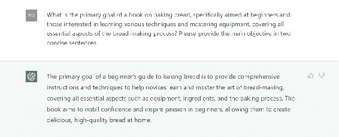
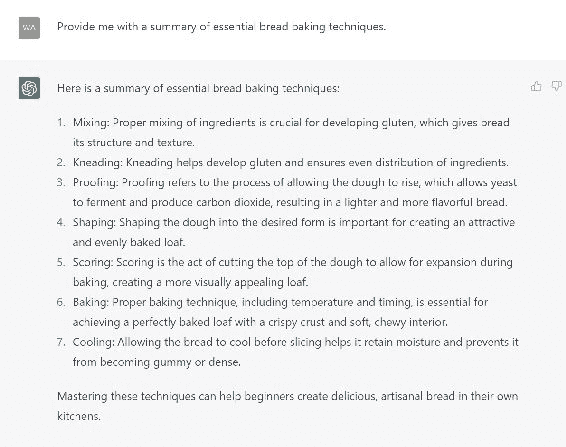
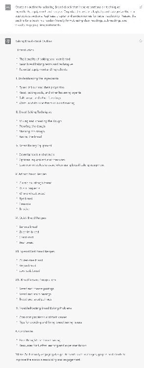

## 4.3\. 使用 ChatGPT 生成书籍大纲的简单 10 分钟执行计划

使用 ChatGPT 制定一个简单的、10 分钟的执行计划可以确保大纲高效有效地完成。这个计划包括六个步骤，每个步骤都有特定的时间分配，帮助你保持在正确的轨道上。

### 第一步：确定大纲的目标（1 分钟）

确定你的书的主题和目标读者，形成大纲的目标。为了进一步了解，分析同类书籍的内容、风格和营销策略。

假设一本面向初学者的烘焙面包的书集中讨论技巧、成分和设备。

在 ChatGPT 上使用的提示：一个专门针对初学者和对学习各种技巧和掌握设备感兴趣的人的烘焙面包书籍的主要目标是什么，覆盖面包制作过程的所有关键方面？请用两句简洁的话提供主要目标。

### 第二步：研究和事实核实（3 分钟）

研究和事实核实对于创建一个完美的大纲至关重要。将每日执行计划的一部分用于研究书籍主题并通过可靠来源验证信息。

例如，在亚马逊 Kindle、Kobo 等平台上浏览类似的烘焙面包书籍，找到章节想法和子主题。你会发现子主题如下：

● 成分● 关键术语● 流程概述● 制作面包的多种方法● 设备● 开始前需要了解的事项● 温度计算

使用 ChatGPT 协助你的研究和事实核实，提供提示，比如：

● 给我提供一份关键烘焙面包技巧的摘要。● 列出世界各地流行的面包类型。● 查找讨论面包制作中不同类型面粉的可靠来源。

### 第三步：组织信息（1 分钟）

对研究的信息进行排序和分类，建立一个层次结构，选择一个系统，标记数据以创建一个有组织的结构。

对于烘焙面包主题，你可以将信息组织成技巧、成分、设备、食谱等部分。你可以从亚马逊上出版的书籍中获取灵感。

### 第四步：生成和组织大纲（2 分钟）

使用 ChatGPT 根据研究数据和主题生成一份书籍大纲。将适当的部分组合在一起，创建一个连贯的大纲。

下面的提示将生成一个大纲并组织信息/章节。如果你不喜欢 ChatGPT 返回的内容，只需给出一个更具体的提示来组织数据。

### 第五步：格式化大纲（1 分钟）

使用项目符号、副标题和视觉吸引力元素格式化大纲，使其易于阅读。对于烘焙面包的电子书，确保各个部分和子主题可区分并且组织良好。

生成大纲后，你可以自行格式化，或者请 ChatGPT 为你格式化。下面的截图介绍了如何生成大纲、创建结构和格式。

在 ChatGPT 上使用的提示：为一本关于烘焙面包的电子书创建一个包括技巧、配料、设备和食谱部分的大纲。

逻辑地组织各部分，并将它们分类到适当的部分中。重新表述章节和部分名称以提高可读性。

以读者友好的格式呈现一本书的大纲，使用清晰的标题、副标题和视觉吸引力设计元素。

### 制作 10 分钟大纲的技巧

使用计时器

为每个步骤设定一个计时器以保持进度。使用手机或物理计时器为每个任务分配特定时间。

练习和重复

通过使用 ChatGPT 练习创建大纲的次数越多，你就会越擅长快速有效地制作大纲。随着经验的积累，不断迭代和改进你的流程。

遵循这个简单的 10 分钟执行计划，你将创建高质量、事实性的书籍大纲。

### 每个步骤的示例提示：

#### 第一步：确定大纲的目标（1 分钟）

● 关于专注于[主题]的书籍的主要目标和目标受众是什么？请用两句简洁的话提供主要目标。● 确定关于[主题]的书籍的关键主题和预期读者。用两句简短的话总结主要目标。

#### 第二步：研究和事实核实（3 分钟）

● 为我提供关于[主题]最重要方面的概述。● 列出关于[主题]的关键事实、统计数据和专家意见。

#### 第三步：组织信息（1 分钟）

● 将关于[主题]的研究信息分类和组织成一个逻辑结构。● 整理收集到的关于[主题]的数据，并创建一个清晰的层次结构以便更好地理解。

#### 第四步：生成和组织大纲（2 分钟）

● 为一本关于[主题]的书籍创建一个包括[子主题]部分的大纲。将各部分逻辑地组织起来，重新表述章节和部分名称以提高可读性。● 为一本关于[主题]的书籍制定一个全面的大纲，包括与[子主题]相关的部分。确保有条理的组织，并改进章节和部分名称以增强清晰度。

#### 第五步：格式化大纲（1 分钟）

● 使用项目符号、副标题和视觉吸引力元素格式化关于[主题]的书籍大纲，使其易于阅读。● 以读者友好的格式呈现一本关于[主题]的书籍的大纲，使用清晰的标题、副标题和视觉吸引力设计元素。
