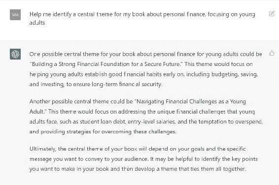
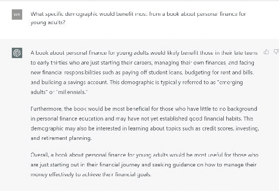
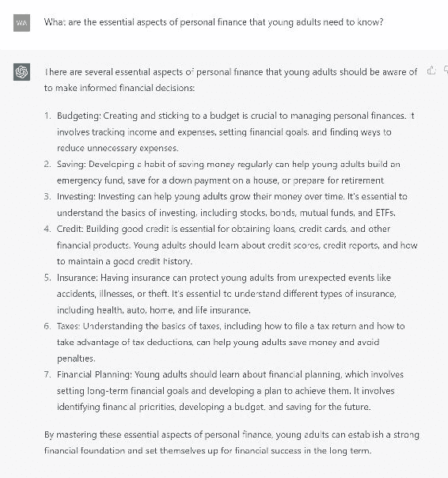
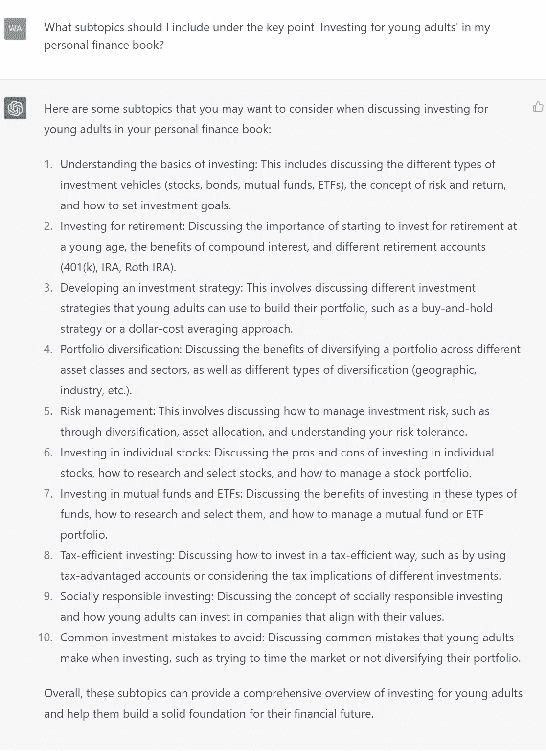
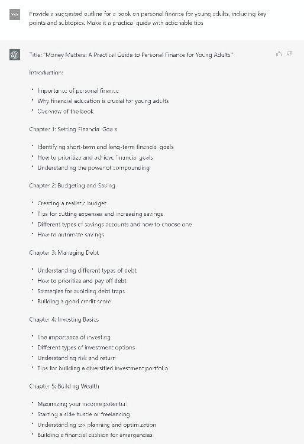
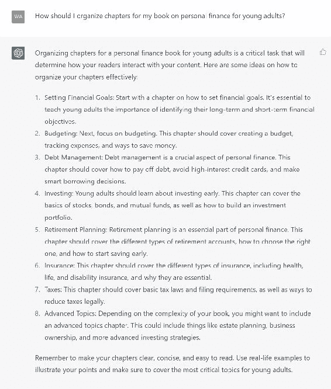
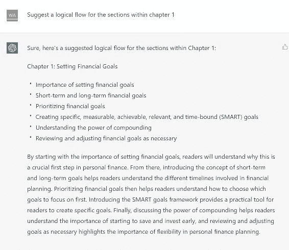

# 第五章：打造你的书籍结构

## 5.1\. 确定你的中心主题和目标受众

所以，你决定写一本书，但需要帮助确定从哪里开始？别担心！我们在这里帮助你确定中心主题和目标受众，这将为创建一个出色的书籍结构奠定基础。

### 确定你的中心主题

首先，让我们谈谈你的中心主题。你想在整本书中传达核心信息或想法。你的主题是支撑一切的支柱，所以花些时间考虑你热衷的事情以及你希望读者从你的书中带走什么。

在定义你的中心主题时，尽量具体。这样做将指导你的写作，并确保你的书保持专注。

例如，如果你正在写一本关于个人理财的书，你的中心主题可能是“帮助年轻人在投资和为退休储蓄的世界中导航”。

1.  帮我确定关于[主题]的书的中心主题。

1.  帮我确定一个关于个人理财的中心主题，重点是年轻人。

1.  针对年轻人的个人理财书籍的独特而引人入胜的角度是什么？

### 确定你的目标受众

现在你已经确定了中心主题，是时候弄清楚你要为谁写作了。确定目标受众是必不可少的，因为它可以帮助你根据受众的喜好和需求来调整你的写作风格、语气和内容。

要确定你的目标受众，考虑那些最能从你书籍的中心主题中受益的人群。考虑年龄、性别、职业、兴趣和地理位置。

例如，如果你的书的中心主题是关于年轻人投资，你的目标受众可能是年龄在 18-30 岁、对个人理财感兴趣的人群。

1.  谁是关于[主题]的书的目标受众？

1.  谁是针对年轻人的个人理财书籍的目标受众？

1.  哪个具体人群会从针对年轻人的个人理财书籍中受益最多？

### 使用 ChatGPT 进行协助

如果你需要帮助确定你的中心主题或目标受众，不要担心！ChatGPT 在这里帮忙。这个强大的人工智能工具可以提供建议和想法，帮助你保持在任务上。

要开始，尝试使用这些提示与 ChatGPT 交流：

1.  帮我确定关于[主题]的书的中��主题。

1.  我的关于[主题]的书应该以什么为主要焦点？

1.  谁是关于[主题]的书的目标受众？

1.  哪个人群会从关于[主题]的书中受益最多？

通过完成这些步骤，你将在创建一个具有扎实中心主题的书籍的道路上走得很顺利。在继续制定书籍结构时，请记住这些信息。记得享受这个过程！

## 5.2\. 确立关键要点和子主题

在确定中心主题和目标受众之后，现在是时候深入挖掘并确定你将在书中涵盖的关键点和子主题。这一步将帮助你完成书的结构，并确保你包含了中心主题的所有重要方面。

### 头脑风暴关键点

拿起一支笔和纸，或者你喜欢的笔记应用程序，对你的中心主题的最重要方面进行头脑风暴。这些关键点将作为你的书的主要支柱，以逻辑和引人入胜的方式引导读者了解你的主题。

例如，如果你的中心主题是帮助年轻人在投资世界中导航，一些关键点可能包括以下内容：

1.  理解不同类型的投资

1.  如何制定投资计划

1.  风险管理和分散投资

1.  退休规划策略

在 ChatGPT 上使用的关键点提示：

1.  我在关于年轻人个人理财的书中应该涵盖哪些关键点？

1.  年轻人需要了解的个人理财的基本方面是什么？

在 ChatGPT 上使用的子主题提示：

1.  为年轻人个人理财书的预算和储蓄提出一些子主题建议。

1.  我在个人理财书中的关键点“为年轻人投资”下应该包括哪些子主题？

### 组织子主题

现在你有了关键点，是时候将它们细分为更小的子主题了。这些子主题将提供更深入的信息、例子和解释，让你的读者对你的中心主题有一个具体的理解。

例如，如果你的一个关键点是“理解不同类型的投资”，一些子主题可能包括：

● 股票● 债券● 共同基金● 交易所交易基金（ETF）● 房地产

在 ChatGPT 上使用的提示：

1.  我应该如何最好地为年轻人结构我的个人理财书，包括关键点和子主题？

1.  为年轻人个人理财书提供一个建议的大纲，包括关键点和子主题。

通过将你的子主题组织在每个关键点下，你将为你的书创建一个清晰而逻辑的结构，使读者更容易消化信息。

### 使用 ChatGPT 完善你的想法

如果你需要帮助处理关键点和子主题，ChatGPT 可以再次出手相助！它可以帮助你生成额外的子主题，完善你现有的主题，或者识别内容中潜在的空白。

要充分利用 ChatGPT，尝试使用以下提示：

1.  我在关于[主题]的书中应该涵盖哪些关键点？

1.  在关于[主题]的书中需要解决哪些基本方面？

1.  为[关键点]提出一些子主题建议。

1.  我在关于[主题]的书中应该在[关键点]下包括哪些子主题？

遵循这些步骤并利用 ChatGPT 将为您的书籍创建一个全面的结构，有效地涵盖您的中心主题。请记住，在写作过程中重新审视和完善您的关键要点和子主题至关重要，确保最终产品对目标受众具有连贯性和吸引力。

## 5.3\. 组织章节和部分

现在您已经确定了中心主题、目标受众、关键要点和子主题，是时候将它们组织成一个实用的结构了。这个过程将涉及将您的关键要点安排到章节中，并将每个章节分成部分。

这样做将创建一个逻辑流程，引导读者浏览您的书籍，使其成为一本愉快且信息丰富的阅读材料。

### 规划您的章节

首先确定您的书籍将有多少章节。长度将取决于您的主题的复杂性以及您想要涵盖的信息量。一旦确定了章节数，将每个关键要点分配到一个章节。因此，您将围绕中心主题构建您的书籍结构，使读者更容易跟随和理解。

例如，如果您的书籍的中心主题是帮助年轻人在投资世界中导航，您可以将章节组织如下：

1.  第一章：理解不同类型的投资

1.  第二章：制定投资计划

1.  第三章：风险管理和分散投资

1.  第四章：退休规划策略

在 ChatGPT 上使用的提示：

1.  我应该如何为我关于年轻人个人理财的书籍组织章节？

1.  在关键要点和子主题的基础上，如何最好地为年轻人个人理财书籍结构章节？

### 在章节内部概述部分

是时候将您的章节分解为部分了。每个部分应涵盖一个子主题，提供详细信息、示例和解释。

使用我们的投资示例，第一章中的部分如下：

1.1\. 股票

1.2\. 债券

1.3\. 共同基金

1.4\. 交易所交易基金（ETF）

1.5\. 房地产

这种方法使您的读者更容易吸收信息并找到他们想要的具体内容。此外，它还帮助您在整本书中保持无缝的结构。

在 ChatGPT 上使用的提示：

1.  为[章节]建议一个逻辑流程

1.  为“预算和储蓄”章节在年轻人个人理财书籍中建议一个逻辑流程

1.  在个人理财书籍中“年轻人投资”章节提供章节概要。

### 使用 ChatGPT 优化您的书籍大纲

如果您需要对章节和部分组织进行澄清或寻找改进方法，ChatGPT 将在此处提供帮助。通过提供建议和反馈，ChatGPT 可以帮助您完善书籍结构，确保其引人入胜且易于理解。

尝试使用这些提示与 ChatGPT：

1.  我应该如何为我的关于[主题]的书籍组织章节？

1.  在关于[主题]的书籍中，考虑关键要点和子主题，最佳的章节结构方式是什么？

1.  为[章节]内的部分提出一个逻辑流程建议。

1.  在关于[主题]的书籍中，为[章节主题]的章节提供一个部分大纲。

### 关键要点

仔细组织你的章节和部分将为你的书籍创造一个坚实的结构，有效传达你的中心主题，并吸引你的目标读者。记得在写作过程中根据需要重新审视和完善你的书籍结构，确保最终成品精致而连贯。
