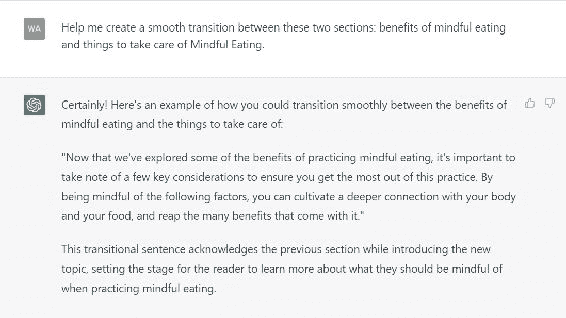

# 第六章：为最大影响调整你的大纲

## 6.1\. 确保一致性和连贯性

在为任何写作，无论是研究论文、论文还是文章，创建大纲时，为了最大程度地产生影响，对其进行微调可以确保你的最终产品清晰而引���入胜。

以下是一些帮助你完善大纲的提示：

### 使用清晰简洁的语言

你的大纲应该易于阅读和理解。使用简单的词语和语言，避免可能让读者困惑的专业术语。

你可以选择内容的特定部分并向 ChatGPT 提问。例如，我为我的关于正念饮食的书写了一个粗略段落。“什么是正念饮食？”但我不喜欢听起来的感觉，所以我让 ChatGPT 用提示重新表达我的观点：“我如何重新表达这一点，使其更清晰易懂？”

### 逻辑组织你的想法

你的大纲应该从一个点逻辑地流向下一个点。确保所有的想法都以有意义且易于理解的方式排列。

一旦你有了一个扎实的大纲，将相关的想法分组在一起。通过这样做，你将确保所有的观点得到最有效地处理，并且你的写作保持在正确的轨道上。

例如，我的内容是关于正念饮食——好处和需要注意的事项——但我想要顺利过渡这两个部分。

在 ChatGPT 上使用的提示：帮助我在这两个部分之间创建一个流畅的过渡：[部分 A] 和 [部分 B]。

### 使用平行结构

在列出想法时，使用平行结构使你的大纲更具视觉吸引力和连贯性。例如，如果你在一个标题下列出要点，对每个要点使用相同的语法结构。

确保一致性和连贯性的另一个关键方面是在整个大纲中使用相同的语言和格式。这些操作有助于读者理解你的思维过程并理解你的想法之间的联系。

假设你正在使用项目符号。你必须确保它们大小和形状都相同。如果你正在使用标题，请确保它们都是相同的字体和大小。

### 保持简洁

你的大纲应该简洁明了。专注于你想传达的关键思想，避免被细节困扰。

确保你的大纲反映了你的目标。你希望通过写作实现什么？确保大纲中的每一点都支持你的整体论点或论证，并且你包含的所有内容都与你的目标相关。

### 灵活处理

你的大纲应该是一个可以随着写作过程进行修订的流动文档。在写作和完善想法时要愿意做出改变。

确保大纲一致性和清晰性的最佳方法之一是仔细审查和完善它。首先看看你列出的每一点，问问自己它是否必要，是否符合你写作的整体主题，以及在你的作品背景下是否合乎逻辑。

删除任何不合适的观点，并为那些需要的观点添加更多细节。

在 ChatGPT 上使用的提示：首先查看上述主题中列出的每个观点，并问自己它是否必要，是否与主题和背景的整体主题相契合。删除任何不合适的观点，并为那些需要的观点添加更多细节。列出任何你认为不相关且不符合背景的观点。只需给我发送一个需要删除的观点列表。

遵循这些建议，你可以创建一个有效的大纲，帮助你制作出有影响力的最终产品。

### 关键要点

在微调你的大纲时，最重要的考虑之一是确保整个作品始终保持一致性和连贯性。一致性意味着在整个大纲中使用相同的语言、格式和结构。

另一方面，连贯性意味着确保所有观点在逻辑上相互契合。在进行过程中，愿意修改和重新审视你的大纲。你的大纲是灵活的，有些观点可能需要比你最初想象的更多或更少的关注。

通过对变化持开放态度，并愿意根据需要进行调整，你可以为你的写作创建一个清晰而实用的路线图，帮助你在读者中产生最大的影响。
