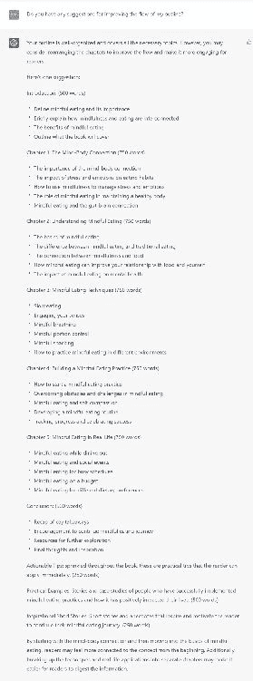
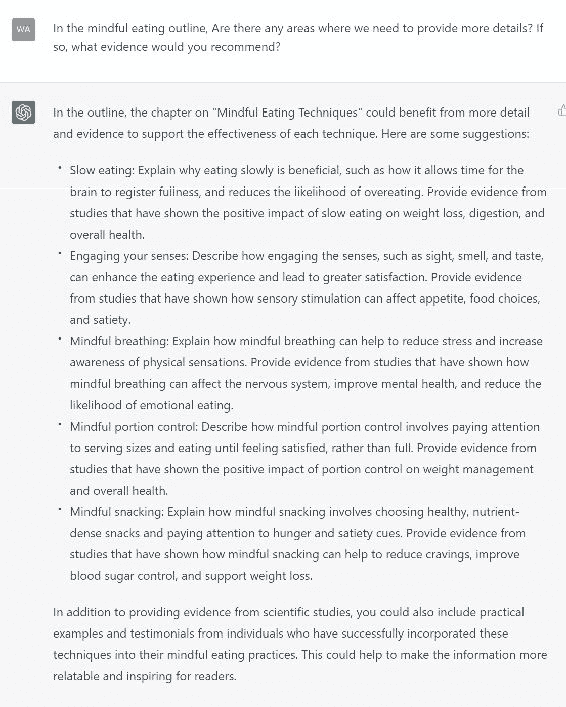
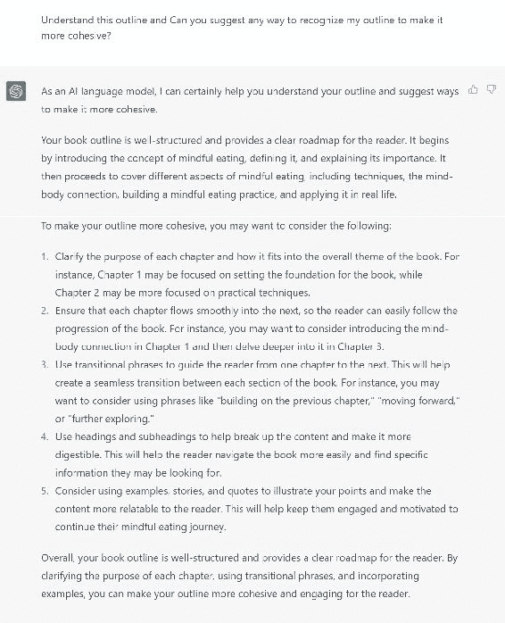
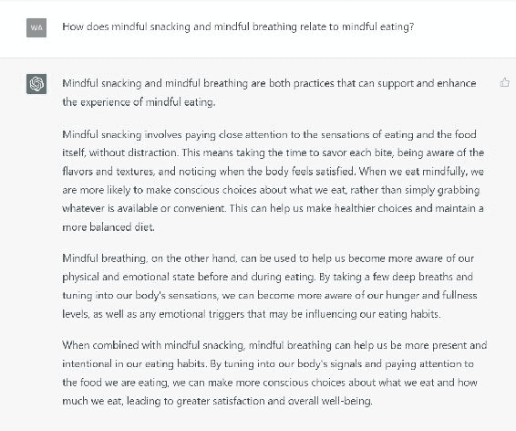

# 6.2\. 与 ChatGPT 合作获得反馈和建议

当时间紧迫时，获得关于你写作的质量反馈和建议可能令人望而生畏。然而，有了像 ChatGPT 这样的技术，编辑你的写作就不那么具有挑战性，而且会为你提供宝贵的反馈和建议。

与 ChatGPT 合作是完善你的大纲的绝佳方式。ChatGPT 可以帮助你处理写作的各个方面，如句子结构、语法、词汇和整体连贯性。

此外，它还可以提供改善大纲清晰度的建议。

在 ChatGPT 上使用的提示：你有任何关于改善我的大纲流畅性的建议吗？

要与 ChatGPT 合作，你需要提供你的大纲。ChatGPT 将分析你的大纲，并就其优点和缺点提供详细反馈。

它还会提供改善你的大纲的建议，比如重新安排某些部分、改写句子和使用更好的词汇。

### 与 ChatGPT 的个性化反馈

与 ChatGPT 合作的最大优势之一是它能够提供个性化反馈。ChatGPT 可以作为语言模型学习和适应你的写作风格，并为你的需求提供量身定制的反馈。

这种定制的高质量反馈可以帮助你提高写作技巧，并创建更有效的大纲。不要犹豫与 ChatGPT 合作，将你的写作提升到新的水平！

在 ChatGPT 上使用的提示：我们需要提供更多细节的地方吗？如果是的话，你会推荐什么证据？

### ChatGPT 协助书籍大纲

1.  你能提出让我的大纲更具连贯性的方法吗？

1.  我可以添加哪些额外信息或研究来支持我的论点？

1.  我的大纲中是否有任何多余的信息需要删除？

1.  你能推荐具体的例子或轶事来说明我的要点吗？

1.  你有关于构建我的大纲以使其更具吸引力的观众的建议吗？

1.  你有什么建议让我的大纲更具视觉吸引力吗？

1.  如何让我的大纲更简洁而不失重要细节？

## 6.3\. 修改和完善你的想法

一旦你为写作项目制定了大纲，就是时候修改和完善你的想法了。这一最后一步让你澄清你的想法，并确保它们组织良好、逻辑清晰地呈现。

在 ChatGPT 上使用的提示：你能提出让我的大纲更具连贯性的方法吗？

### 检查相关性

修改你的大纲的第一步是审查你最初的想法，并评估它们与项目的相关性。

你的一些想法可能需要更好地符合你的项目范围。在这种情况下，从你的大纲中删除这些想法，并专注于更相关的想法是必要的。

在 ChatGPT 上使用的提示：这些信息如何与正念饮食相关？

### 使用 ChatGPT 完善内容

1.  这些信息是否直接与所提出的问题相关？

1.  这些信息是否提供了有意义的见解？

1.  我的大纲中是否有任何多余的信息需要删除？

1.  你能推荐具体的例子或轶事来说明我的要点吗？

1.  你有没有关于如何构建我的大纲，使其对我的受众更具吸引力的建议？

1.  你能提出一些建议，使我的大纲更具视觉吸引力吗？

1.  如何使我的大纲更简洁，而不失去重要细节？

### 完善你的书籍大纲

通过创建更详细的大纲，你可以完善你的想法。这个过程涉及将你的思维分解为更小、更易管理的部分，以便更全面地理解你的主题。

这个过程可能涉及添加子主题或将更广泛的想法细分为更小的部分。

### 将主题分解为子主题的提示

1.  一个明确定义的大纲的关键要素是什么，你如何确保你的大纲符合这些标准？

1.  在完善���的大纲时，有哪些常见错误要避免？你如何确保你的大纲既详细又灵活？

1.  你可以使用什么策略来完善你的大纲，确保它有效地传达你的想法和写作项目的结构？

1.  你如何利用他人的反馈来完善你的大纲，确保它满足你预期受众的需求？

### 收集信息和交叉检查

完善你的想法的另一个策略是收集额外信息或进行进一步研究。这些行动可以帮助你澄清你的想法，并确保它们得到证据支持。此外，你可能会想到以前没有考虑过的新想法。

### 你的目标受众

在修订你的想法时，请牢记你的核心受众。考虑你的读者是谁，以及他们可能已经对你的主题了解多少。你的写作将更具吸引力和意义，当你将你的想法和表达风格调整到你的受众时。

### 关键注释

修订和完善你的想法对于创建一个有效的大纲至关重要。审查你最初的想法可以创建一个更专注、更有影响力的大纲。你还可以通过将各个部分细分为更小的部分、进行进一步的研究并考虑你的受众来制作一个更好的大纲。

花时间修订和完善你的想法，你将成功地创建一个写作项目！

### ChatGPT 的更多提示

1.  我的大纲中是否有任何多余的信息需要删除？

1.  你能推荐具体的例子或轶事来说明我的要点吗？

1.  你有没有关于如何构建我的大纲，使其对我的受众更具吸引力的建议？

1.  你能提出一些建议，使我的大纲更具视觉吸引力吗？

1.  如何使我的大纲更简洁，而不失去重要细节？
