# 第七章：将大纲翻译成手稿

## 7.1\. 从大纲到草稿

将您的大纲翻译成手稿可能会有困难，但通过正确的规划和执行，可以顺利进行。

### 草稿

首先，您需要使用大纲来创建一份草稿手稿。在这份草稿中，您会详细阐述您的想法，并在大纲的基础上进行扩展。

在创建草稿时，请记住这只是一个起点。您的手稿在完成之前可能会经历几次修订，所以不要担心第一次就做到完美。

初稿的目的是将您的想法记录下来，为最终手稿打下基础。

### 主要部分

在开始草稿时，从大纲的主要部分开始，填写细节。考虑手稿的整体结构以及每个部分如何融入更大的画面。

开始写作时，不要担心语法和标点符号。专注于将您的想法从头脑中写到纸上。您可以稍后进行修订和编辑。设定每日字数目标也是有帮助的，这样您可以跟踪进度并保持动力。

您还可以要求 ChatGPT 总结您的书籍或一个中心部分，以帮助您开始撰写内容。

### 示例提示

提示 1：写出您使用的时间管理策略以及它如何帮助您更有效地写作。

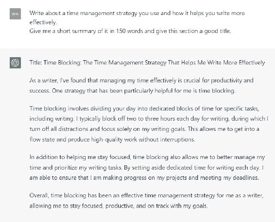

提示 2：写出创建写作计划的好处，并提供制定适合您的计划的建议。

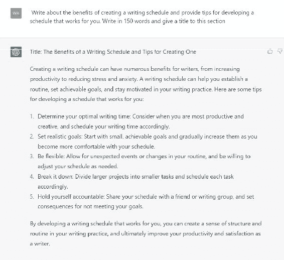

实用提示：您可以要求 ChatGPT 为每个部分拆分总字数，以帮助您有一个良好的开端。

### 修订和编辑

在撰写草稿时，要愿意进行更改和修订。您的大纲只是一个起点，随着您深入手稿，一些部分可能需要扩展或重新制作。这都是写作过程的一部分。

考虑将您的手稿分成较小的部分或章节。这样可以使写作过程更易管理，帮助您保持组织。给每一章节一个清晰的标题和摘要也是个好主意，这样您在继续撰写手稿时可以轻松地参考回去。

实用提示：将您的章节大纲输入 ChatGPT，并要求它为章节提供一个好的章节标题、好的部分标题，并写一个摘要。您可以编辑 ChatGPT 生成的摘要以适应您的大纲。

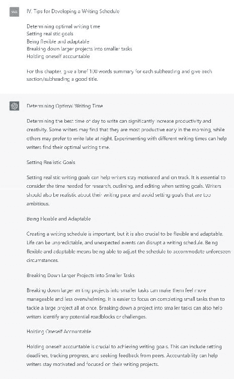

### 用全新的眼光再看一遍

完成初稿后，休息一下，恢复活力。将手稿放一边几天甚至一周可能会有所帮助，这样您可以以全新的视角回到手稿中。在此期间，您还可以请一位信任的朋友或同事审阅您的草稿，并给予反馈。

### 使用系统化的方法

当你准备开始修改草稿时，采取系统化的方法。首先审查每个部分，寻找可以改进清晰度、组织性和连贯性的地方。考虑添加额外的例子或细节来支持你的主要观点。

### 语法和结构

在修改时要特别注意你的句子结构和词语选择。寻找紧缩写作和消除不必要词语或短语的方法。结果，你的手稿将更流畅，使读者更容易跟随。使用 Grammarly 和其他工具来改善语法和内容流畅性。

在 ChatGPT 上使用的提示：给出你对上述文本的流程、语法和结构的看法。

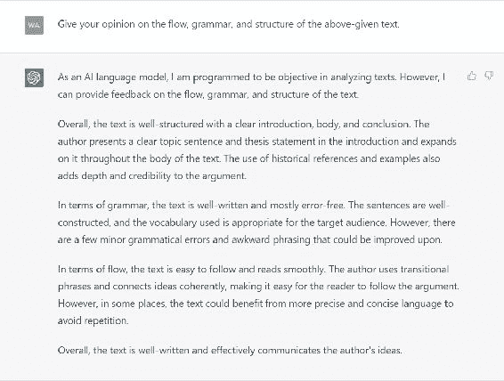

随时寻求帮助。写作可能是孤独的，但不一定要这样。考虑加入写作小组或与写作教练合作，以获得额外的支持和反馈。这些策略可以让你保持动力，并激发改进写作的新想法。

## 7.2\. 保持专注和动力

撰写手稿可能会很漫长和具有挑战性，容易失去专注和动力。然而，保持这两者对于完成手稿和制作高质量最终产品至关重要。

### 建立常规

建立写作常规是保持专注和动力的基石。这意味着每天或每周都要留出专门的时间来撰写你的手稿。

将你的写作时间视为神圣，并优先考虑它胜过其他可能不那么重要的活动。你可能需要拒绝社交活动或在写作时间内关闭手机和电子邮件。

在 ChatGPT 上使用的提示：建立写作常规如何帮助你保持专注和动力？

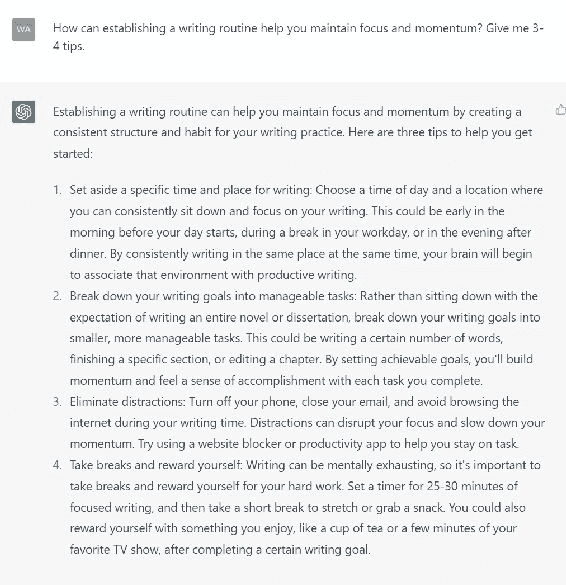

### 向 ChatGPT 寻求灵感

1.  一些关于将你的写作时间视为神圣并优先考虑它胜过其他活动的建议是什么？

1.  在写作时间内如何管理诸如社交活动或电子设备等干扰？

1.  在写作时间内关闭手机和电子邮件的一些好处是什么？

1.  如何向他人传达你的写作时间的重要性以及在那段时间内需要无打扰的专注？

### 休息和充电

休息一下，给自己时间充电，这样你就不会感到疲惫不堪。写作可能会让人精神疲惫，因此暂时离开工作，做点别的事情是必要的。

你的休息时间可以包括散步、做一些伸展运动，或者更复杂一些，比如周末旅行或参加写作研讨会。

### 设定具体目标

另一个有用的策略是为每个写作会话设定具体的写作目标。这些目标可以包括一个字数目标，你想完成的特定部分，或者你想完成的一系列研究任务。

通过设定明确的目标，你给自己一个努力的方向，并确保每次写作都有进展。

在 ChatGPT 上使用的提示：如何为每次写作会话设定与你更大写作目标一致的具体目标？

### 更多 ChatGPT 提示

1.  你可以使用什么策略将更大的写作任务分解为每次写作会话更小、更易管理的目标？

1.  如何在设定具体目标的需求与适应写作过程或时间表变化的灵活性之间取得平衡？

1.  你可以使用什么工具或技术来跟踪每次写作会话中朝着目标的进展？

1.  如何确保你的目标是现实和可实现的，考虑到每次写作会话中可用的时间和资源？

1.  你可以使用什么策略在每次写作会话中保持动力和专注于目标，特别是面对干扰或中断时？

### 找一个责任伙伴

另一个保持动力的绝佳策略是找一个责任伙伴。这个人可以是一个正在撰写手稿的朋友或同事，一个写作教练或导师。

关键在于找到一个可以在你撰写手稿时提供支持和建设性反馈的人。考虑加入写作小组或在线写作社区，与其他作家联系并分享你的进行中的作品。

### 你还能做什么？

除了这些策略，记住为什么你首先要写手稿也是至关重要的。

你的总体目标是什么？你的手稿如何符合这个目标？牢记这个更大的画面可以帮助你记住写作背后更大的目的。

还有一点很有帮助的是记住写作是一个过程，你的手稿在完成之前可能会经历几个草稿。预期你的第一稿会有缺陷。继续前进，即使遇到障碍也要坚持。

将每个草稿视为完善和改进你的作品的机会，并坚持这个过程。

### 奖励自己

在路上庆祝你的进步是很重要的。写作手稿是一个重要的成就，所以你应该承认你为此付出的辛勤工作和努力。

奖励自己可以简单到给自己喜欢的零食或休息一天来放松和充电。无论是什么，庆祝你的进步将使你在完成手稿的过程中保持动力。

## 7.3\. 通过 ChatGPT 克服写作障碍

写作障碍是将大纲转化为手稿时常见但令人沮丧的障碍。借助 ChatGPT 的帮助，你可以找到克服这个问题并保持写作强劲的方法。

### 提供写作提示和创意

ChatGPT 可以通过提供写作提示和创意来帮助你克服写作障碍。使用符合你兴趣和写作风格的提示，你可以激发创造力，让想法再次涌现。

这个工具可以提供各种提示，从简单的句子开头到更复杂的写作挑战，旨在帮助您突破写作障碍，重新回到正轨。

有用提示：如果在写作过程中遇到困难，请向 ChatGPT 提供定制提示。

### 提供反馈和支持

ChatGPT 还可以为您提供有价值的反馈和支持。换句话说，这个程序可以充当一个鼓励您工作的责任伙伴。

您还可以使用 ChatGPT 通过自动反馈或与人工智能对话来获取写作反馈。ChatGPT 可以帮助您确定写作需要改进的地方，并提供可操作的建议来改善您的手稿。

在 ChatGPT 上使用的提示：提供反馈和支持以克服写作障碍。

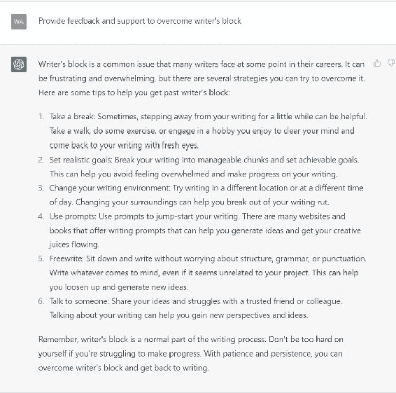

### 关键说明

ChatGPT 可以帮助您克服写作障碍，提供工具和资源帮助您保持组织和专注。ChatGPT 可以帮助您制定写作计划，设定写作目标，并在您完成手稿时跟踪您的进展。

您还可以使用 ChatGPT 访问资源，如写作模板、格式指南和研究工具，帮助您在撰写手稿时保持组织。

# 第八章：实用示例和案例研究

## 8.1\. 示例 1：创建一本非虚构书籍大纲

作为作者，您可以生成一本关于“克服拖延和提高生产力”的非虚构书籍大纲。在下面，您将找到整个过程的每个步骤以及您可以用于 ChatGPT 的提示。

### 步骤 1：研究和找到您的书籍主题

研究拖延和生产力，并确定人们面临的常见问题和克服它们的策略。根据您的调查结果，确定书籍的独特角度，例如专注于实用的、科学支持的技术来克服拖延和提高生产力。

ChatGPT 的提示：帮我头脑风暴关于克服拖延和提高生产力的想法，基于科学研究和实用技术。

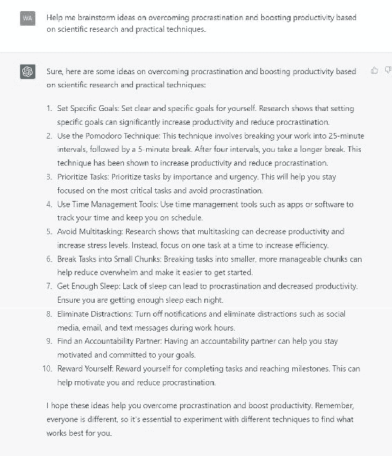

### 步骤 2：生成基本大纲

确定主题后，使用研究和 ChatGPT 生成的想法创建一个基本大纲。使用标题和副标题将关键点组织成逻辑顺序。

ChatGPT 的提示：使用科学支持的技术为克服拖延和提高生产力撰写一本自助书籍生成大纲。

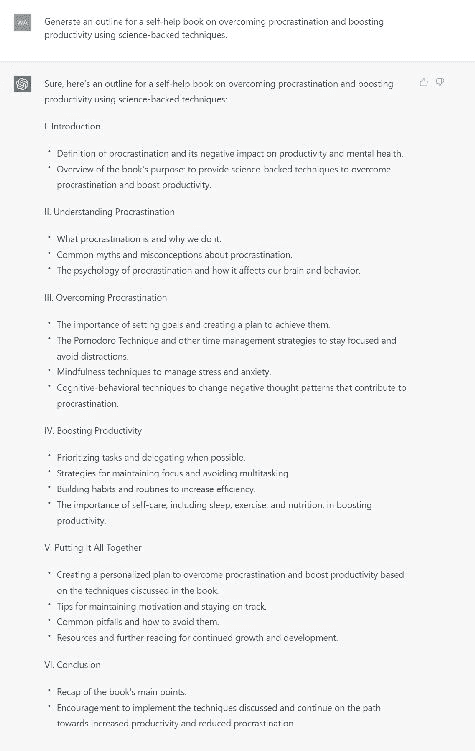

### 步骤 3：提出问题并交叉检查您的大纲

为了确定内容中潜在的空白，审查大纲并询问它是否满足读者的需求和兴趣。此外，交叉检查大纲的准确性，验证来自可靠来源的事实和数据。

ChatGPT 的提示：审查生成的大纲，并为一本关于克服拖延和提高生产力的书籍提出任何改进或遗漏的观点。

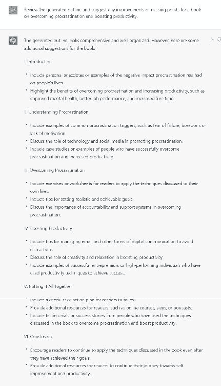

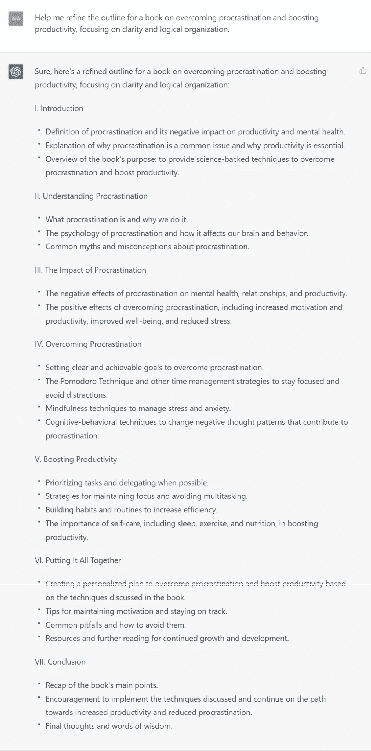

### 第四步：撰写章节摘要并组织大纲

最后，为每个书籍部分创建简洁的章节摘要，提供清晰而引人入胜的内容概述。通过输入章节标题和关键要点，使用 ChatGPT 生成这些摘要。

提示 ChatGPT：使用科学支持的技术，为一本关于克服拖延和提高生产力的书籍生成简洁的章节摘要。

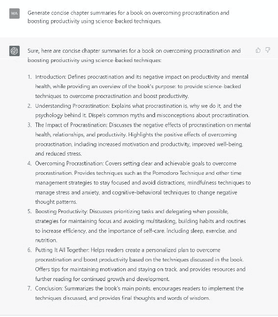

### 关键笔记

您可以通过以下步骤生成一本关于“克服拖延和提高生产力”的非虚构书籍大纲：

1.  研究并缩小书籍主题

1.  生成基本大纲

1.  提出问题并交叉检查大纲

1.  完善大纲

1.  撰写章节摘要并组织大纲

在整个过程中使用 ChatGPT，您可以制定一个全面且结构良好的大纲，这将成为撰写书籍的路线图。
