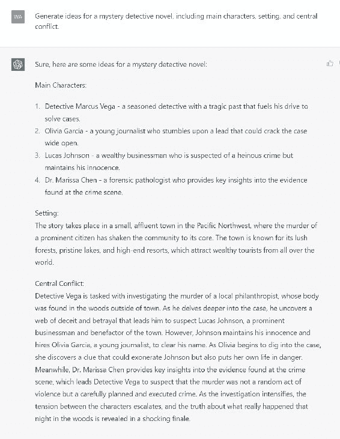
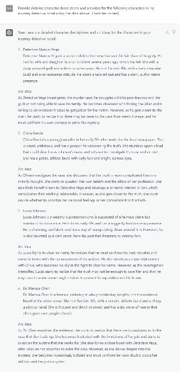
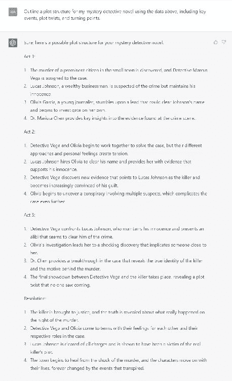
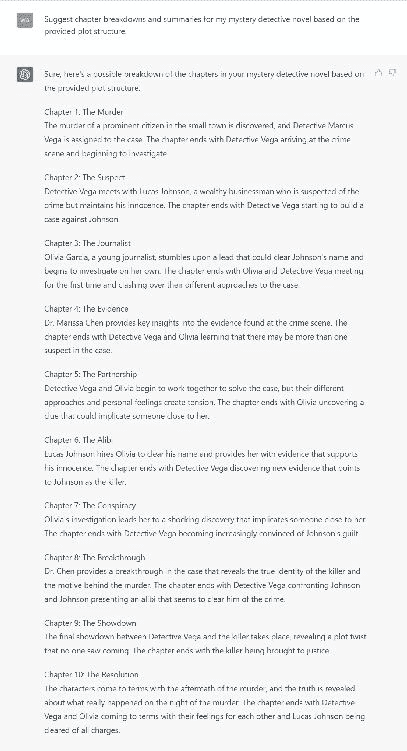
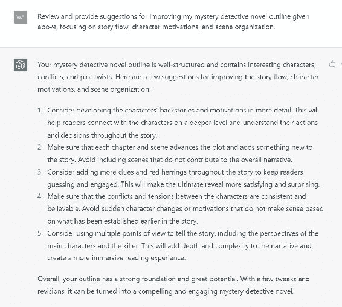
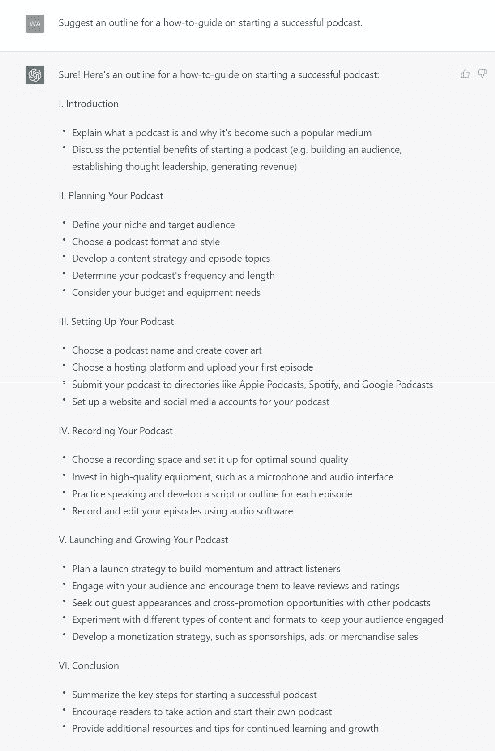
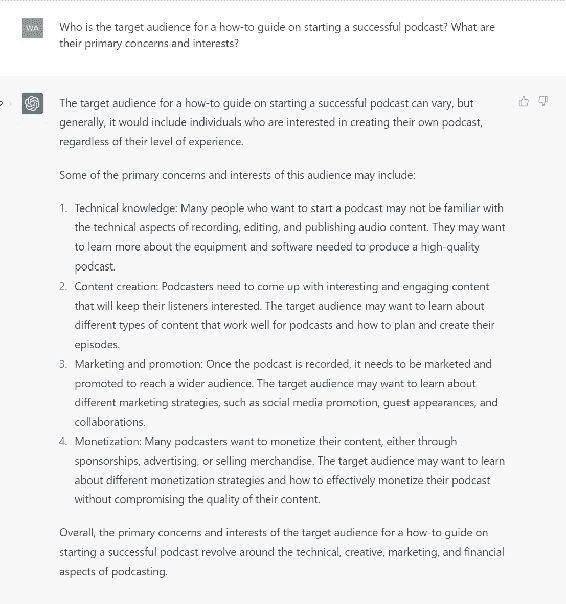
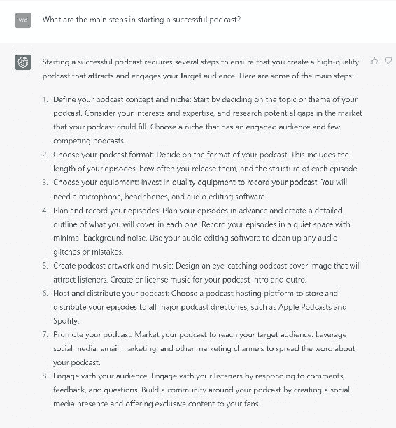
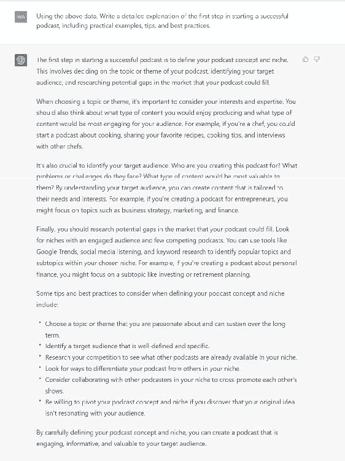
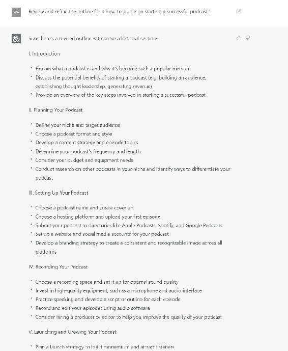

## 8.2\. 例 2：打造小说书纲

现在，让我们讨论如何使用 ChatGPT 创建小说书纲。通过这五个步骤，你可以为你的小说生成一个有用的书纲。

### 步骤 1：选择你的流派并确定故事的核心元素

首先，选择小说的流派，比如悬疑、科幻或者言情。一旦选择了流派，确定故事的核心元素，包括主要人物、背景设定和中心冲突。

在 ChatGPT 上使用的提示：为[流派]小说生成想法，包括主要人物、背景设定和中心冲突。

### 步骤 2：发展你的人物和他们的发展线

接下来，通过深入挖掘人物的背景故事、动机和目标来更深入地了解他们。发展他们的角色发展线，并探索他们在整个故事中的变化。

在 ChatGPT 上使用的提示：为以下人物提供详细的角色描述和发展线想法：[人物名称]。

### 步骤 3：创建情节结构

现在你已经为故事打下了坚实基础，构建一个包括重要事件、情节转折和转折点的情节。为每个情节点列出大纲将为你的小说提供清晰的方向并保持节奏。使用类似于 ChatGPT 提示的内容：

在 ChatGPT 上使用的提示：为我的[流派]小说大纲制定情节结构，包括关键事件、情节转折和转折点。

### 步骤 4：将故事拆分成章节

有了情节结构，将故事拆分成章节。每一章应该有一个具体的目的，推动故事向前发展。

在 ChatGPT 上使用的提示：根据提供的情节结构，为我的[流派]小说建议章节拆分和摘要。

### 步骤 5：完善和组织你的书纲

最后，审查你的书纲并进行必要的修改。确保你的故事流畅，人物的动机和行动一致。如有需要，重新组织章节或场景。

在 ChatGPT 上使用的提示：审查并提出改进建议，重点关注故事流程、人物动机和场景组织。

遵循这五个步骤，并利用 ChatGPT 生成想法和内容，你将为创建一个引人入胜的小说书纲奠定坚实基础。

## 8.3\. 例 3：制作指南书纲

### 步骤 1：选择一个指南主题

要创建一个指南，首先选择一个你熟悉并热衷的主题。例如，让我们选择“如何开始一个成功的播客”。一个清晰具体的主题将帮助你为读者提供有价值且可操作的建议，确保他们从你的指南中受益。

在 ChatGPT 上使用的提示：为如何开始一个成功播客的指南提供大纲。

### 第二步：确定你的目标受众

了解你的目标受众可以帮助你制定一个符合他们需求和兴趣的操作指南。确定谁会从你的指南中受益，并相应地调整你的内容。考虑你读者的专业水平、年龄群体和具体目标，以创作能引起共鸣的内容。

为 ChatGPT 提供提示：如何开始一个成功的播客的操作指南的目标受众是谁？他们的主要关注点和兴趣是什么？

### 第三步：将流程分解为可管理的步骤

通过将流程分解为清晰、可管理的步骤来组织你的操作指南。你的读者将更好地理解整个流程，并更快地跟上。这一步还确保你涵盖了主题的所有主要方面，并为你的读者提供了全面的资源。

为 ChatGPT 提供提示：开始一个成功的播客的主要步骤是什么？

### 第四步：提供详细说明和示例

对于每个步骤，提供详细的说明，并在适当的情况下提供现实生活中的例子来说明你的观点。因此，你的读者将更有效地理解这些概念并很好地应用它们。此外，考虑包含提示和最佳实践，帮助你的读者避免常见陷阱，并更快地取得成功。

为 ChatGPT 提供提示：写一个关于开始一个成功的播客的操作指南的第一步的详细解释，包括实际例子、提示和最佳实践。

### 第五步：组织和完善你的大纲

一旦你有了步骤、说明和示例，将它们组织成一个更连贯的大纲。审查和完善你的大纲，确保它在逻辑上连贯，并涵盖所有要点。确保从一个步骤到下一个有清晰的进展，并且每个部分都建立在前一个部分的基础上，最终引导读者达到期望的结果或收获。

为 ChatGPT 提供提示：审查和完善开始一个成功的播客操作指南的大纲。

遵循这些步骤并使用 ChatGPT 提示，你可以在你选择的主题上制定一个丰富的信息性操作指南大纲。你将为你的指南打下坚实的基础，使你能够自信而清晰地写作。

记得为标题和副标题加粗以提高可读性和结构，确保你的指南对读者易于理解。
