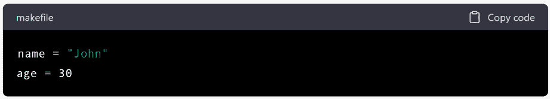
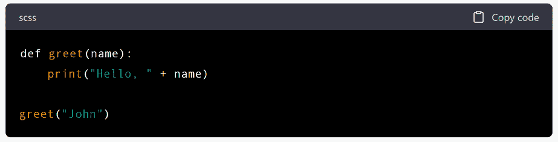
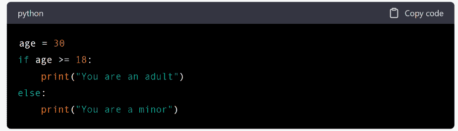
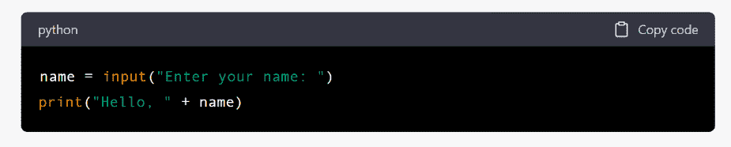
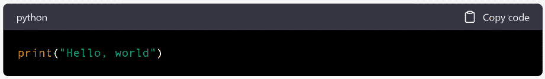
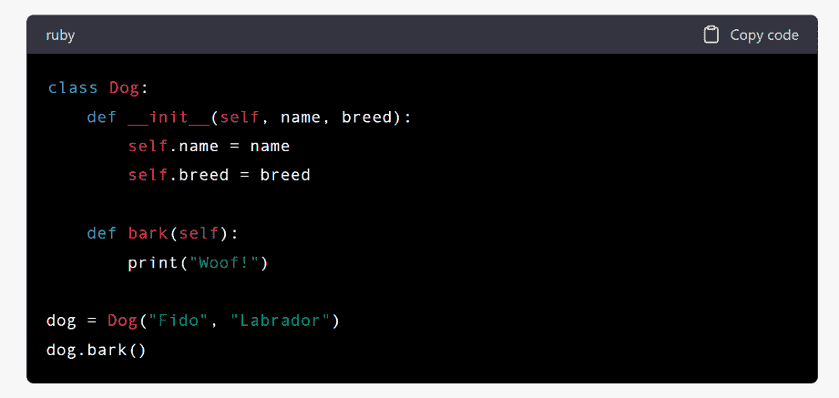
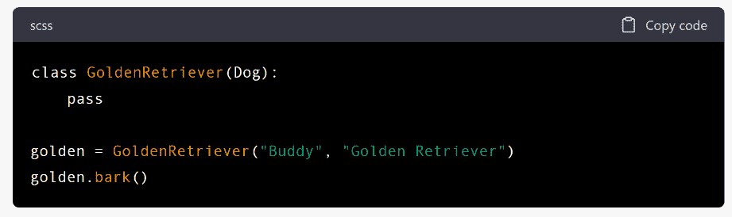
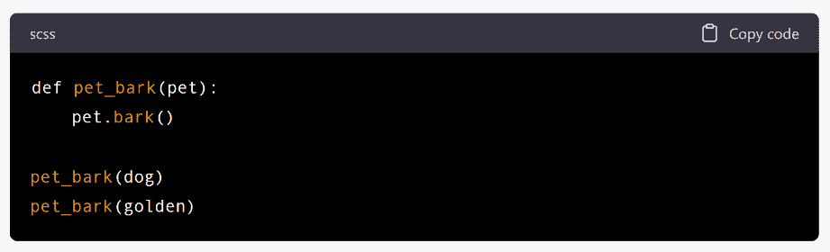

# 面向程序员的 ChatGPT

> 原文：[ChatGPT for Coders](https://annas-archive.org/md5/46ffcfc1454e5703d94be0e05dc2f48f)
> 
> 译者：[飞龙](https://github.com/wizardforcel)
> 
> 协议：[CC BY-NC-SA 4.0](https://creativecommons.org/licenses/by-nc-sa/4.0/)

# **ChatGPT 简介**

近年来，编码和编程领域经历了一场重大革命，而在这一变革中的重要参与者之一就是 ChatGPT。这一尖端技术为程序员和开发人员提供了一种新颖而迷人的方法来解决困难的编码难题并简化他们的工作流程。由于其出色的自然语言处理能力和阅读和解释代码的能力，ChatGPT 是程序员的理想问题解决工具。

ChatGPT 是完美的伙伴，可以帮助您解决问题，调试代码，并产生新的想法。无论您是在处理一个小脚本还是一个大型软件项目，它都可以帮助您完成所有这些活动。ChatGPT 是您一直在等待的解决方案，无论您是想将自己的能力提升到下一个水平的开发人员，还是只是在寻找一种新颖而有创意的方法来解决编码难题。无论如何，ChatGPT 都是您一直在寻找的答案。

## 什么是 ChatGPT？

OpenAI 创建了一个名为 ChatGPT 的先进语言模型。该模型能够生成看起来像是由人类撰写的文本，基于大量数据。其设计使其能够执行各种自然语言处理任务，如语言翻译，文本摘要，问题回答和代码生成。它是在从互联网获取的大量文本数据集上进行训练的，这使其能够完成这些任务。这个系统被称为“Chat 生成预训练变换器”（简称“ChatGPT”），因为它能够生成文本以及实现变换器架构，这是深度神经网络的一个子类。

由于其生成代码和找到解决困难编码挑战的能力，ChatGPT 在开发人员和程序员中广受欢迎。这使得它成为软件开发和其他与编程相关的工作的无价工具。

## 了解 ChatGPT 在编码中的能力

由于其众多功能和功能，ChatGPT 是编程和软件创建的非常有用的工具。

以下是 ChatGPT 提供的一些最重要的编码技能列表：

+   代码生成是 ChatGPT 具有的最重要技能之一，也是其最显著的特点之一。由于其先进的自然语言处理能力，ChatGPT 能够理解代码片段，然后根据这些片段生成新的代码。因此，它是一个快速开发新概念或创建可包含在更广泛项目中的代码片段的有效工具。

+   调试：ChatGPT 还可以通过检查代码样本并识别可能的故障或问题来协助代码调试。由于其对编程语言和编码最佳实践的了解，ChatGPT 能够提出提高代码质量和解决错误的建议。

+   解决问题：ChatGPT 还可以帮助程序员和开发人员找到解决复杂编码挑战的方法。如果您遇到特定问题或需要帮助提出新想法，ChatGPT 可以为您提供有用的见解和解决方案，帮助您摆脱困境。

+   与其他工具集成：ChatGPT 可以与其他工具和框架结合，用于创建和开发代码。这些工具和框架包括集成开发环境（IDE）和代码编辑器。这使开发人员可以利用 ChatGPT 的功能，同时保持其当前的工作流程。

+   理解语言：ChatGPT 能够理解各种编程语言，包括 Python、Java、JavaScript 等知名语言。因此，对于在各种语言和领域工作的程序员来说，它是一个适应性强的工具。

+   个性化：ChatGPT 可以根据特定的编程语言或开发领域进行调整，使程序员能够根据自己的需求个性化模型。

+   自然语言处理：由于其广泛的自然语言处理功能，ChatGPT 是处理软件开发中自然语言数据的有用工具。这可能包括诸如语言翻译、文本摘要或问题回答等活动。

ChatGPT 的编码功能使其成为程序员和开发人员的宝贵工具，因为它使他们能够简化工作流程、找到解决困难问题的方法并提出创新想法。无论程序员的专业水平如何，或者他们是刚开始职业生涯，软件开发社区的每个人都可以从使用 ChatGPT 中受益。

## 使用 ChatGPT 进行编码的好处

在编码和软件创建方面，利用 ChatGPT 具有许多优势，包括以下内容：

+   提高生产力：ChatGPT 可以通过自动化重复流程（如代码生成）来帮助程序员和开发人员提高生产力。这使他们能够专注于需要更高创造力和解决问题技能的高级工作。

+   提高代码质量：ChatGPT 可以帮助改善代码质量，指出可能存在的问题并提供更改建议。由于它帮助程序员避免频繁错误，因此程序员产生的代码整体质量可能会得到提高。

+   解决困难更快：ChatGPT 可能加快程序员和开发人员找到解决困难挑战的过程，提供有益的见解和想法。由于这一点，发现困难编码问题的答案所需的时间可能会减少。

+   与现有流程集成：ChatGPT 可以与各种工具和框架进行耦合，用于代码生成和开发，如集成开发环境（IDE）和代码编辑器。这使得 ChatGPT 可以与现有工作流程一起使用。这使程序员能够在当前工作流程中利用 ChatGPT 的功能，而无需学习新工具或过渡到新环境，从而消除了培训的需要。

+   ChatGPT 具有理解多种编程语言的能力，这使其成为在各种语言和领域工作的程序员的灵活工具。

+   个性化：ChatGPT 可以根据特定的编程语言或开发领域进行调整，使程序员能够根据自己的需求个性化模型。

+   提高创造力：ChatGPT 可能帮助程序员和开发人员产生新想法，并提出创新解决方案，这可能导致整体创造力的增加。这有助于他们提高整体创造力，并导致更具想象力的问题解决方法。

总的来说，利用 ChatGPT 进行编码所带来的优势使其成为程序员和开发人员的重要工具。它使他们更加高效，提高了他们编写的代码质量，并帮助他们提出新想法。无论是作为程序员的专业水平还是刚开始职业生涯，软件开发社区中的每个人都可以从使用 ChatGPT 中受益。

# 使用 ChatGPT 进行编码基础

## 基本编码概念介绍

编码是为计算机创建执行特定任务的指令的行为。这是开发软件的基本能力，指的是过程本身。在使用 ChatGPT 进入编码世界之前，有必要对一些基本编码原则有基本的了解。

以下是需要牢记的一些最重要的想法：

+   编码可以使用多种编程语言进行，例如 Python、Java 和 JavaScript 等。这些语言用于创建计算机程序。每种编程语言的语法、结构和特性都是独特的，选择适合特定项目的语言可能会对最终代码的效率和成功产生重大影响。

+   编码严重依赖于变量的概念，它们只是为数据指定的存储位置。变量是编码过程中的重要部分。在程序中，数据可以以数字、字符串或对象的形式保存在变量中，这些变量也可以用于数据操作。变量可以赋予值。

+   数据结构是一种在程序内部安排数据的方式，并通过这个术语来引用。数组、列表、字典和树都是常见类型的数据结构的示例。选择数据结构可能会影响代码的整体效力和效率。

+   在计算机编程中，函数是可以从程序的各个位置访问的可重复使用的代码块。函数能够接受输入参数，在这些参数上执行操作，然后返回这些操作的结果。

+   循环：循环是一种重复执行一组指令的方法，取决于某个条件的存在与否。最常见的循环类型是 for 循环、while 循环和 do-while 循环。

+   条件语句用于确定是否应根据某种情况执行一段代码。如果条件不满足，则将执行一个单独的代码块；否则，将执行第一个代码块。

+   “算法”一词指的是必须遵循的一组预定步骤，以完成某项特定活动。通过它们可以解决问题、自动化活动，并执行复杂的流程。

+   调试是查找并纠正引入代码中的错误的过程。编码人员可以使用调试工具来帮助他们定位和纠正诸如语法错误、逻辑缺陷和运行时故障等问题。

总的来说，这些基本编码概念对于了解如何使用 ChatGPT 编写和调试程序至关重要。它们也对软件开发过程至关重要，这就是为什么它们在这里被介绍。

## 数据类型和变量

在编码中，数据类型和变量是必不可少的概念，因为它们是构成计算机基本组成部分的基本元素，负责存储和处理数据。

数据类型是可以保存在变量中的许多种信息。数据类型的示例包括布尔值、文本值和数值。整数、浮点数、字符串、布尔值和其他类型是常见数据类型的示例。每种编程语言都有其独特的数据类型集合；选择适当的数据类型对于确保代码准确和有效非常重要。

“变量”一词指的是程序中用于存储数据并可能用于存储数据和更改数据的指定存储区域。变量用于存储和操作数据。变量可以设置值，并且在程序执行过程中这些值可以更改。

例如，以下是在 Python 中定义变量的一种方式：

在这个特定的例子中，name 变量是一个字符串变量，其值为"John"。age 变量是一个整数变量，其值为 30。

学习如何处理数据类型和变量对于编码和软件开发至关重要。变量是编码中的基本概念，了解如何使用它们是至关重要的。由于变量使他们能够执行所有这些操作，编码人员能够开发可以存储和修改数据、对数据执行操作，并根据数据生成输出的程序。

## 函数和控制结构

编码所需的构建块包括函数和控制结构，用于设计既高效又有组织的程序。

+   函数：函数是可重复使用的代码块，可以从程序的不同部分调用。函数可以接受参数，在其上执行操作，并返回结果。函数允许编码人员编写一次代码并多次重用，使代码更有组织和高效。

例如，以下是在 Python 中创建函数的一种方式：

在这个例子中，“greet”函数接受一个参数“name”，并使用“name”的值打印问候语。该函数可以多次调用，使用不同的“name”值，从而实现代码的重用。

+   控制结构：控制结构用于控制程序的流程，允许编码人员根据特定条件执行不同的代码块。常见的控制结构包括“if”语句、“for”循环和“while”循环。

在这个例子中，“if”语句检查“age”的值，并根据结果打印消息。这使得程序可以根据数据做出决策，使代码更加灵活和动态。

总的来说，函数和控制结构对于编码和软件开发至关重要，用于创建高效、有组织和动态的程序。通过使用函数和控制结构，编码人员可以创建易于维护、调试和扩展的代码。

## 输入和输出操作

输入和输出操作是编码中的基本概念，用于与用户和其他系统进行交互。

1.  输入操作：输入操作允许程序从用户或其他系统接收数据。常见的输入操作包括从键盘读取数据、从文件读取数据或通过网络连接接收数据。

例如，在 Python 中，您可以如下使用‘input’函数从键盘读取数据：

在这个例子中，‘input’函数被用来从键盘读取数据，并将结果存储在‘name’变量中。程序然后使用‘name’的值打印问候语。

1.  输出操作：输出操作允许程序向用户或其他系统显示数据。常见的输出操作包括将数据打印到屏幕上，将数据写入文件，或通过网络连接发送数据。

例如，在 Python 中，您可以如下使用‘print’函数将数据输出到屏幕上：

在这个例子中，‘print’函数被用来将字符串“Hello, world”输出到屏幕上。

总的来说，输入和输出操作对于编码和软件开发至关重要，用于创建交互式和动态程序。通过使用输入和输出操作，编码人员可以创建能够接收用户或其他系统数据并根据数据生成输出的程序。

## 面向对象编程

面向对象编程（OOP）是一种基于“对象”概念的编程范式。对象是类的实例，类是代表真实世界对象或概念的可重用代码块。

1.  类：类是 OOP 的构建块，定义对象的属性和行为。类可以包含变量（称为属性或属性）和函数（称为方法）。

例如，在 Python 中，您可以如下定义一个类：

在这个例子中，‘Dog’类被定义为具有两个属性‘name’和‘breed’以及一个方法‘bark’。创建一个类的实例并将其存储在‘dog’变量中，然后在实例上调用‘bark’方法。

1.  继承：继承是 OOP 的一个特性，允许一个类继承另一个类的属性和行为。这使得编码人员可以创建类的层次结构并重用代码。

例如，在 Python 中，您可以如下定义一个子类：

在这个例子中，‘GoldenRetriever’类被定义为‘Dog’类的子类，这意味着它继承了‘Dog’类的属性和方法。创建一个‘GoldenRetriever’类的实例并将其存储在‘golden’变量中，然后在实例上调用‘bark’方法。

1.  多态性：多态性是 OOP 的一个特性，允许不同类的对象响应相同的方法调用。这使得编码人员可以编写能够以通用方式处理不同类对象的代码。

例如，在 Python 中，您可以如下使用多态性：

在这个例子中，‘pet bark’函数接受一个‘pet’参数，该参数可以是‘dog’类或‘GoldenRetriever’类的实例。函数调用‘pet’实例的‘bark’方法，而不管其类别。

总的来说，面向对象编程（OOP）是一种重要的编程范式，它使得编码者能够创建有组织、高效和可重用的代码。通过使用 OOP，编码者可以在他们的代码中建模真实世界的对象和概念，使其更容易理解、维护和调试。

## 设计模式和最佳实践

设计模式和最佳实践是解决软件开发中常见问题的成熟解决方案。

1.  设计模式：设计模式是软件开发中常见问题的可重用解决方案。它们是解决特定问题的模板，并且可以适应不同的情况。

有几种流行的设计模式，包括以下内容：

+   工厂模式：一种提供创建对象的方式，而无需指定将创建的对象的确切类的模式。

+   观察者模式：一种允许对象注册并接收有关其他对象更改的通知的模式。

+   单例模式：一种将类限制为单个实例并提供对该实例的全局访问点的模式。

1.  最佳实践：最佳实践是编写代码的已建立准则，被广泛接受为良好的编程技术。

它们包括以下内容：

+   代码可读性：编写易于理解、维护和调试的代码。

+   代码重用：尽可能重用代码，以减少所需的工作量并提高代码质量。

+   测试：编写自动化测试来验证代码的行为是否符合预期，并在开发过程中尽早捕获错误。

+   文档编写：编写文档来解释代码的目的和行为，使其他人更容易理解和使用。

使用设计模式和最佳实践可以帮助编码者编写更好、更高效和更易于维护的代码。通过遵循已建立的模式和准则，编码者可以减少在调试上花费的时间，并提高其代码的质量。

# 使用 ChatGPT 调试代码

## 了解调试

调试是识别和修复计算机软件中的错误（也称为错误）的过程。调试是软件开发过程的关键部分，因为它有助于在最终产品中引起问题之前识别和解决代码中的问题。

ChatGPT 可用于辅助调试，提供解决错误的建议，生成修复问题的代码片段，并帮助开发者理解问题的根本原因。

调试代码的一些常见技巧包括：

+   打印调试语句：将变量、数据结构和其他信息打印到控制台，以帮助理解代码中发生的情况。

+   使用调试器：一种工具，允许开发者暂停代码执行，检查变量和数据结构，并逐行查看代码以找到并解决问题。

+   进行代码审查：与其他开发者一起审查代码，以识别潜在的错误和问题。

+   测试：编写和运行自动化测试以验证代码行为并识别错误。

+   性能分析：分析代码性能以识别缓慢或引起问题的区域。

通过理解和使用这些调试技术，开发人员可以更快速有效地解决代码中的问题。ChatGPT 的使用可以通过提供额外的建议和代码片段来增强这些调试工作。

## 常见编码错误及其解决方法

编码错误或错误是软件开发中常见的问题。这些错误可以从简单的语法问题到更复杂的逻辑问题。

这里是一些最常见的编码错误以及如何解决它们：

+   语法错误：这些错误发生在代码不遵循编程语言的正确语法时。例如，在代码行末尾忘记分号。这些错误通常由编译器检测到，并将阻止代码运行。要解决语法错误，开发人员需要审查代码并纠正任何不正确的语法。

+   类型错误：这些错误发生在变量使用了错误的数据类型时。例如，使用整数变量而期望的是字符串。要解决类型错误，开发人员需要验证变量的正确使用以及使用正确的数据类型。

+   逻辑错误：这些错误发生在代码不按预期行为时。例如，使用错误的数学运算符来比较两个值。要解决逻辑错误，开发人员需要审查代码并确定是什么导致了意外行为。他们可能需要添加额外的调试语句或使用调试器来帮助识别问题。

+   空指针异常：这些错误发生在代码尝试访问具有空值的对象时。例如，访问尚未实例化或初始化的对象。要解决空指针异常，开发人员需要验证对象已正确实例化和初始化，并且代码不会尝试访问空对象。

+   索引超出范围异常：这些错误发生在代码尝试访问不存在的数组索引时。例如，尝试访问只有四个元素的数组的第五个元素。要解决索引超出范围异常，开发人员需要验证数组的正确访问以及代码不会尝试访问超出数组范围的索引。

+   未处理异常：这些错误发生在代码抛出未被 try-catch 块处理的异常时。例如，尝试除以零。要解决未处理异常，开发人员需要添加 try-catch 块来处理异常，并确保代码不会抛出未被处理的异常。

+   内存泄漏：这些是代码未正确管理内存时发生的错误，导致内存在不再需要时仍被保留。例如，未关闭文件或释放数据库连接。要解决内存泄漏问题，开发人员需要审查代码，确保所有资源在不再需要时得到正确管理和释放。

通过了解这些常见的编码错误以及如何解决它们，开发人员可以编写更健壮、无 bug 的代码。除了这些错误之外，ChatGPT 还可以提供额外的建议和代码片段，帮助解决问题，提高代码质量。

总之，编码错误是软件开发过程中不可避免的一部分。然而，通过了解常见错误以及如何解决它们，开发人员可以编写更好的代码，减少调试时间。ChatGPT 可以通过提供额外的建议和代码片段来帮助解决问题，提高代码质量。

顶部

## 使用 ChatGPT 调试代码

通过自然语言处理，ChatGPT 可以用于调试代码，找出缺陷并提供可能修复的建议。为了使用 ChatGPT 进行调试，您首先需要提供适用的代码和您想要看到的输出。然后 ChatGPT 会分析代码，并将结果与预期输出进行比较。这使 ChatGPT 能够找出可能导致错误的任何差异。

ChatGPT 使用自然语言处理来分析文本并识别错误。一旦完成，它会提供可行的修复方案。它能够提供线索，提出修复建议，并提供有关可能导致问题的因素的信息。例如，如果它识别出不当的函数调用，它可以提供建议使用哪个函数。

此外，ChatGPT 还能提供关于编码风格、最佳实践以及与编码相关的各种其他主题的建议。这有助于提高代码质量，预防未来可能出现的问题。

一般来说，使用 ChatGPT 进行调试可以帮助程序员减少遇到的烦恼，加快调试过程，并节省时间。对于寻求快速准确答案而不需要手动查看代码的开发人员来说，这是一个很棒的工具。

## 有效使用 ChatGPT 进行调试的提示

+   提问要具体：向 ChatGPT 提供清晰简洁的错误描述。提供的信息越多，ChatGPT 的回答就会更准确。

+   保持代码片段简洁：在向 ChatGPT 提供代码时，保持代码片段简洁且与您尝试调试的问题相关。这将有助于 ChatGPT 快速识别问题并提供更有效的解决方案。

+   牢记您的环境：在使用 ChatGPT 进行调试时，请确保使用正确的库、依赖项和编程语言。

+   与其他调试工具结合使用 ChatGPT：ChatGPT 可以作为其他调试工具（如打印语句、调试器和记录工具）的一个很好的补充工具。

+   验证 ChatGPT 的建议：在实施 ChatGPT 的建议之前，始终验证 ChatGPT 的建议。ChatGPT 经过大量数据训练，但它仍然是一个 AI 模型，可能并不总是提供最准确或高效的解决方案。

+   提供反馈：当 ChatGPT 提供有用的解决方案或者它本可以提供更好的解决方案时，请告诉 ChatGPT。这些反馈将有助于改进 ChatGPT 在未来调试中的准确性和有效性。

遵循这些提示，您可以有效地使用 ChatGPT 进行高效调试，并快速准确地解决编码错误。

## 调试工具和技术

调试工具和技术是软件开发过程中不可或缺的一部分。它们用于识别和解决代码中的错误和问题，确保最终产品按预期工作。

开发人员可以使用各种调试工具和技术，包括：

+   打印语句：这是一种简单直接的调试技术，涉及向您的代码添加打印语句，以在代码的特定点显示变量的值或计算结果。

+   调试器：调试器是交互式工具，允许开发人员逐行查看代码，检查变量值、调用堆栈和其他信息，以便在代码执行时进行。

+   记录：记录是在运行时记录应用程序行为信息的过程。开发人员可以使用日志跟踪应用程序的流程，识别问题并诊断问题。

+   断点：断点允许开发人员在代码的特定点暂停执行，使他们能够检查应用程序的状态并确定为什么它以某种方式行为。

+   性能分析器：性能分析器是提供有关应用程序性能的信息的工具，包括在特定函数中花费多少时间、内存使用情况和其他性能指标。

+   测试驱动开发（TDD）：TDD 是一种软件开发过程，涉及在编写代码之前编写测试，确保每个功能按预期工作。这有助于在开发过程的早期发现错误，使调试更容易。

+   代码审查：代码审查是一种重要的调试技术，涉及其他开发人员审查您的代码以识别错误，提出改进建议，并确保代码可维护。

需要注意的是，调试没有一种适用于所有情况的解决方案。最佳方法将取决于您项目的具体情况以及您最熟悉的工具和技术。

总的来说，使用调试工具和技术的组合可以帮助您更有效地识别和解决代码中的错误和问题。通过使用这些工具和技术，您可以确保您的代码是正确的、可靠的和可维护的，这可以节省您长期的时间和精力。

# 使用 ChatGPT 进行高级编码技术

## 与数据库和 API 一起工作

数据库和应用程序编程接口（API）是当代软件开发的两个重要组成部分。数据库用于存储数据并为用户提供访问权限，而应用程序编程接口（API）旨在允许各种程序相互连接并共享数据。

在与数据库和 API 结合使用时，ChatGPT 可以自动化编码过程，使其更加高效。

在处理数据库时，ChatGPT 可以用于创建用于设计数据库模式、访问和操作数据库以及迁移数据库的代码。例如，ChatGPT 可以用于生成数据库查询的代码，以及用于插入、更新和删除记录的代码。ChatGPT 还可以帮助生成特定于数据库的代码。这种代码的示例包括用于构建和维护索引、存储过程和数据库触发器的代码。

与应用程序编程接口（API）一起工作的 ChatGPT 可以用于生成用于开发 REST API 的代码。这些 API 为各种应用程序提供了一种在互联网上共享数据的方式。可以使用 ChatGPT 创建代码来实现组成 REST API 的不同组件。这些组件包括路由、控制器、模型和中间件。

ChatGPT 不仅可以用于生成代码，还可以用于调试和测试 API 和数据库的代码。例如，ChatGPT 可以用于生成用于验证数据库和 API 代码的测试用例，从而确保代码的正常运行。此外，ChatGPT 还可以用于调试数据库和 API 的代码，创建可分析错误和故障的代码，然后进行修复。

总的来说，ChatGPT 在处理 API 和数据库时提供了一个强大且多功能的工具。当开发人员使用 ChatGPT 生成、测试和调试数据库和 API 代码时，他们可以节省时间和精力，并集中精力处理软件开发过程中的其他关键领域。ChatGPT 允许开发人员执行所有这些操作。

## 编写算法和数据结构

计算机科学和软件工程领域共享许多基本概念，其中最重要的是算法和数据结构。数据结构是组织和存储数据的技术，而算法是解决问题的逐步过程。算法用于解决问题。

由于其在生成算法和数据结构方面的能力，ChatGPT 是软件开发人员的有益工具。

例如，ChatGPT 可以用来生成标准算法的代码，如排序算法（例如快速排序和归并排序）、搜索算法（例如二分查找和线性查找）以及图算法（例如迪杰斯特拉算法和广度优先搜索）。ChatGPT 还可以用来生成更高级的算法的代码，如遗传算法、机器学习算法和动态规划算法等。

在数据结构方面，ChatGPT 能够生成各种标准数据结构的代码，包括数组、链表、栈、队列、树和图。哈希表、堆和尝试是一些更复杂的数据结构，可以在 ChatGPT 的帮助下自动生成。

ChatGPT 的许多用途不仅包括生成代码，还包括测试和调试各种算法和数据结构。例如，ChatGPT 可以用来生成测试用例，以验证算法和数据结构。这有助于确保算法和结构的正常运行。

ChatGPT 还可以通过生成代码来调试算法和数据结构，以评估和修复缺陷和缺陷。ChatGPT 的代码生成功能使这一功能成为可能。

总的来说，ChatGPT 是对从事算法和数据结构创建的软件工程师有帮助的工具。在软件开发过程中，开发人员可以通过使用 ChatGPT 生成、测试和调试算法和数据结构来节省时间和精力。这使开发人员可以将注意力集中在流程的其他关键领域上。

## 使用 ChatGPT 进行 Web 开发

Web 开发是创建新网站以及维护现有网站的过程。这包括从设计用户界面到实现网站后端操作的一切。创建网站可以通过多种方式包括 ChatGPT。

ChatGPT 可以用来创建用于应用程序前端的 HTML、CSS 和 JavaScript 代码。例如，ChatGPT 能够生成负责构建网站布局的 HTML 代码，负责为页面应用样式的 CSS 代码，以及负责为页面添加交互和动态行为的 JavaScript 代码。这些代码可以根据用户的自然语言输入由 ChatGPT 生成，这使开发人员可以专注于网站布局而不是正在编写的代码的具体细节。

除了用于前端，ChatGPT 还可用于客户端和服务器端编程。例如，ChatGPT 能够生成应用程序编程接口（API）、Web 服务器和数据库的代码。ChatGPT 可以生成与数据库和 API 交互的代码。这包括用于向数据库插入、更新和检索数据的代码，以及用于执行 API 查询并处理从这些请求接收到的结果的代码。此外，ChatGPT 还能够创建用于设置和操作 Web 服务器的代码。这包括可以管理 HTTP 请求和响应的代码。

调试是另一个可能受益于使用 ChatGPT 的 Web 开发领域，因为它的多功能性。可以利用 ChatGPT 生成用于分析和修复 Web 应用程序中的故障和缺陷的代码。例如，ChatGPT 能够编写记录有关应用程序状态的信息的代码，这可能有助于确定问题的根本原因。ChatGPT 还可以生成用于通过生成验证程序功能的测试用例来测试应用程序的代码。

此外，在线应用程序的性能是另一个 ChatGPT 可以用来增强的领域。例如，ChatGPT 可以编写代码来优化数据库查询或前端，以实现更快的页面加载时间。它还可以改进数据库查询。ChatGPT 还能够生成用于以多种不同方式优化后端的代码，包括并行化操作和使用缓存来减少 API 查询量。

总之，ChatGPT 也可以用于自动化涉及网页开发中的单调过程。例如，ChatGPT 可以生成代码来执行重复操作，如启动新项目、编写样板代码或生成代码片段。这类任务的其他示例包括：通过创建用于将 Web 应用程序部署到云平台的代码，ChatGPT 也可以用于自动化部署等操作，这是一个常见的示例。

总之，对于设计网站的人来说，ChatGPT 是一个有用的工具。Web 开发人员可以通过使用 ChatGPT 生成、调试和优化他们的 Web 应用程序来节省时间和精力。这使他们能够将注意力集中在 Web 开发过程的其他关键领域上。ChatGPT 还具有自动化重复过程的能力，这可能进一步提高生产力并加快软件开发过程。

## 使用 ChatGPT 进行机器学习

机器学习是人工智能领域的一个重点，专注于开发能够从数据中学习然后利用该学习进行预测或判断的系统。使用 ChatGPT 的开发人员可以利用模型的自然语言处理功能来协助自动化机器学习的各个领域。在机器学习的背景下，ChatGPT 的一些应用包括以下内容：

+   数据预处理：ChatGPT 可用于执行诸如数据清洗、归一化和转换等活动，这使得开发人员更容易处理原始数据并为机器学习算法的使用做准备。

+   模型选择：ChatGPT 可用于根据输入数据和要求选择最适合的机器学习算法来解决特定问题。这是通过分析问题和分析数据来实现的。

+   ChatGPT 可用于自动化调整机器学习模型的超参数的过程，这可以显著提高模型的整体性能。这个过程被称为“超参数调整”。

+   评估机器学习模型的性能：ChatGPT 可用于评估机器学习模型的性能并提供进一步改进性能的建议。

+   预测建模：ChatGPT 可以用于基于输入数据开发预测模型，随后可用于进行预测或自动化决策过程。这些模型还可用于自动化决策过程。

总之，ChatGPT 在帮助开发人员进行各种与机器学习相关的努力方面具有巨大的潜力。开发人员可以利用模型的自然语言处理能力来自动化机器学习工作流程的许多部分。这不仅节省了开发人员的时间和精力，还使他们能够集中精力处理更复杂的任务。

## 使用 ChatGPT 进行自然语言处理

人工智能已经衍生出许多子领域，其中之一被称为自然语言处理（NLP），它专注于计算机与人类语言之间的交互。它涵盖了诸如评估情感、分类文本、翻译语言和回答问题等活动，涉及研究、理解和生成人类语言。

OpenAI 已经创建了一种名为 ChatGPT 的最先进语言模型，可用于各种自然语言处理工作。以下是 ChatGPT 可用于 NLP 的一些方式的列表：

+   文本生成：ChatGPT 可用于生成类似于给定输入的文本。这使得可以通过生成类似于输入的文本来创建新闻报道、诗歌甚至完整的书籍等内容成为可能。

+   情感分析：ChatGPT 可用于评估文本的情感，判断其是积极的、消极的还是中性的，并同时提供关于公众对某一主题看法的见解。

+   文本分类 ChatGPT 可用于根据文本内容以及文本所处的上下文将文本分类为几个类别，例如新闻文章、产品评论或社交媒体上的帖子。

+   语言翻译：ChatGPT 可用于将一种语言的文本翻译成另一种语言，使讲多种语言的个人之间更直接地交流成为可能。

+   回答问题 ChatGPT 可用于准确回答以自由形式提出的英文问题，例如“法国首都的名字是什么？”或“说自然语言处理是什么意思？”

总之，ChatGPT 在自然语言处理应用中具有巨大的潜力。由于其接受了大量数据和训练，该模型能够正确执行复杂的自然语言处理任务，使其成为在这一领域工作的开发人员和学者的重要工具。

## 使用 ChatGPT 进行游戏开发

游戏开发指的是生成视频游戏的过程，这需要在编程、艺术和设计等领域具有专业知识。以下是 ChatGPT 可能作为辅助工具用于创建视频游戏的一些方式：

+   ChatGPT 可用于创意游戏理念和概念的创建，以及在设计游戏时编写游戏脚本和对话。

+   ChatGPT 可用于生成游戏的关卡设计和布局，有助于节省时间并提高游戏开发过程的效率。关卡设计

+   角色创作：ChatGPT 可用于生成角色的想法和设计，如姓名、个性、背景故事和外貌。也可以使用 ChatGPT 创建角色。

+   游戏逻辑和机制 ChatGPT 可用于构建游戏逻辑和机制，包括规则、目标和算法。

+   游戏测试 ChatGPT 可用于测试游戏并找出需要解决的错误和其他问题。

+   需要牢记的是，虽然 ChatGPT 可能在游戏创作的上述要素中提供帮助，但它并不能取代只有人类才能提供的独创性和知识。ChatGPT 的结果仍需要经验丰富的游戏开发人员检查和改进。

总之，ChatGPT 并非一刀切的解决方案；然而，它是一个有潜力对游戏创作有益的工具。每个项目的个体需求和要求，以及开发团队的能力和经验，将决定 ChatGPT 在视频游戏制作中的使用有多大的益处。

# 将 ChatGPT 与其他工具和框架集成

## 代码生成和开发工具概述

将 ChatGPT 与其他工具和框架集成可以增强 ChatGPT 在代码生成和开发方面的能力。有许多不同的代码生成和开发工具和框架可用，每种都有其优点和缺点。

一些常见的代码生成工具和框架包括：

+   集成开发环境（IDE）：IDE 是提供全面的编码、测试和调试环境的软件应用程序。它们通常包括代码编辑器、编译器、调试器和其他工具。

+   代码生成器：代码生成器是根据特定输入或模板自动生成代码的工具。ChatGPT 可以与这些工具集成，以更高效地生成代码。

+   代码库：代码库是预先编写的代码集合，可用于开发项目。ChatGPT 可以帮助找到并使用适当的代码库。

+   API 开发框架：API 开发框架提供构建和管理 API 的结构。ChatGPT 可以与这些框架集成，以自动化 API 开发。

+   机器学习框架：机器学习框架提供用于构建和训练机器学习模型的工具和库。ChatGPT 可以与这些框架集成，以提高代码生成的准确性和效率。

通过将 ChatGPT 与这些和其他工具和框架集成，开发人员可以提高其效率和生产力，减少代码生成和开发所需的时间，并提高其代码的质量。

## 将 ChatGPT 与其他代码生成工具集成

通过将 ChatGPT 与其他生成代码的工具集成，可以显著提高 ChatGPT 生成高质量代码的能力。以下是通过将 ChatGPT 与生成代码工具结合使用可能获得的一些优势列表：

+   提高生产力：由于 ChatGPT 和其他代码生成工具相互补充得很好，开发人员能够以更快速和更高效的方式生成代码。ChatGPT 可以用自然语言提供输入和输出，而代码生成工具可以自动化重复操作并为常见代码模式提供模板。ChatGPT 还可以用自然语言提供输入和输出。

+   提高准确性：将 ChatGPT 与其他生成代码的工具集成可能有助于确保生成的代码是正确的，并满足可能存在的任何标准。ChatGPT 可以针对特定的编码模式和标准进行培训，而代码生成工具可以使这些模式和标准在生成代码时得到遵守。

+   减少重复：代码生成工具可以自动化重复的流程，并为典型的代码模式提供模板。这导致了必须执行的重复量的减少。当这些技术与 ChatGPT 集成时，开发人员能够缩短编码生产所需的时间，并降低出错的可能性。

+   ChatGPT 生成的质量稳定的代码 由于代码生成工具具有强制执行编码标准和最佳实践的能力，ChatGPT 生成的代码具有可靠的质量。

+   提高生产力：将 ChatGPT 与代码生成工具集成可能有助于提高开发人员的生产力，释放出原本用于进行重复活动或需要大量手动劳动的时间和精力。

为了让开发人员将 ChatGPT 与代码生成工具连接起来，他们需要了解各个工具以及这些工具提供的 API。此外，他们还需要定义项目的独特需求，并根据这些规格培训 ChatGPT。如果使用适当的工具和培训，将 ChatGPT 与代码生成技术集成可能会显著提高代码创建的效率、精度和整体质量。

## 安装和配置所需的库

将 ChatGPT 与其他工具和框架集成以进行代码生成和开发的过程需要许多步骤，其中之一是安装和配置库。在本章中，您将学习安装和配置为您即将开展工作的特定项目所需的库的过程。

完成项目的第一个任务是根据项目的独特需求确定所需的库。在官方网站上，您将发现与 ChatGPT 兼容并可与之一起使用的库列表。确定所需的库后，您需要下载并安装这些库到您的计算机上。

下一步将需要您设置库，使其与 ChatGPT 兼容。这个过程可能因您使用的库和操作系统而异。例如，如果您要使用 Python 库，您可能需要使用 pip 包安装该库，然后在 Python 环境中设置库路径。

需要牢记的是，不同的库可能对操作系统有不同的需求。因此，在安装和配置库之前，您应该查阅其文档，以确定它是否对操作系统有任何特殊要求。

此外，一些库可能需要进一步的设置，比如建立登录凭据或与外部数据库建立连接。必须仔细遵循库的文档，以获得适当配置的库。

总之，在将 ChatGPT 与其他代码生成和开发工具和框架集成的过程中，最重要的步骤之一是安装和配置必要的库。如果正确配置库并仔细遵循库附带的说明，您将能够确保项目平稳有效地运行。

## 理解代码生成的输入和输出格式

根据先前建立的模板、算法或模型自动生成新代码的实践被称为代码生成。将 ChatGPT 与其他代码生成工具集成，可以自动化编码活动，减少所需的人力工作量，并提高生产力。

代码生成的输入格式可能会因使用的工具和框架而有所不同；然而，它们通常包含对所需代码的某种描述或规范。这可能以普通语言、伪代码、领域特定语言，甚至是所需生成的代码样本的形式存在。

通常，用于代码创建的输出格式是包含在较大代码库中的编程语言或专门的代码片段。ChatGPT 生成的代码可以用多种编程语言编写，包括但不限于：Python、JavaScript、C++、Java 等。

为了成功利用 ChatGPT 进行这项活动，必须对代码生成的输入和输出格式有扎实的理解。如果你对即将出现的输入和输出有很好的把握，就可以帮助确保生成的代码符合必要的要求，并且能够很好地与代码库的其余部分集成。

## 为特定编程语言微调 ChatGPT

调整模型的参数和用于训练的数据，以改善模型在特定编程语言本地代码生成任务上的性能，这就是为特定编程语言"微调"ChatGPT 的含义。这有助于提高生成的代码的正确性和相关性。

以下是为特定编程语言微调 ChatGPT 需要采取的一些步骤：

1- 收集用所要学习的语言编写的大量代码片段。

2- 对代码样本进行一些初步处理，整理和格式化它们。

3- 使用语料库将训练集与验证集分开。

4- 使用训练集，通过对预训练的 ChatGPT 模型进行最后一轮调整，对模型的参数进行任何必要的调整。

5- 通过使用验证集评估经过微调的版本，确定模型的正确性和性能。

6- 再次执行步骤 4-5，直到模型的性能符合所需标准。

7: 在执行特定于目标语言的代码生成活动时，请使用经过微调的模型。

需要牢记的是，对 ChatGPT 这样的大型语言模型进行微调需要大量的计算资源，可能需要几个小时甚至几天的时间。尽管如此，ChatGPT 独有的代码生成速度提升有时可能会使这种投资变得更加值得。

# ChatGPT 在编码中的实际应用

## ChatGPT 在软件开发中

由于 ChatGPT 的实时代码生成、代码建议和代码调试能力，程序员们在效率和生产力方面取得了新的水平，这在软件开发领域引起了一场革命。作为软件工程师的重要工具，ChatGPT 已经成为必不可少的工具。

ChatGPT 在软件开发领域中自动生成代码是其最重要的用途之一。ChatGPT 能够根据特定需求生成代码片段，从而使编码过程更快速、更有效。在开发人员编写代码时，ChatGPT 还可以提供代码片段的建议，节省他们的时间和精力。在处理像在 Web 开发中看到的复杂代码模式时，这个功能非常有帮助，因为它能简化流程。

调试过程是另一个 ChatGPT 产生重大影响的领域。借助 ChatGPT 的帮助，开发人员可以快速定位和修复代码问题，从而大大减少纠正问题所需的时间和精力。由于 ChatGPT 能够阅读代码，开发人员可以向模型提问有关他们自己代码的问题，从而快速找到并解决问题。

ChatGPT 的代码补全和建议功能也被用来提高软件开发的效率。通过利用 ChatGPT 对代码的复杂理解，编码过程可以变得更快速、更有效，它能够提出和完成代码片段。此外，ChatGPT 还能推荐编码模式和最佳实践，帮助开发人员编写更干净、更有效的代码。

另一个 ChatGPT 显示出用途的领域是自动化测试和持续集成。ChatGPT 能够协助自动化测试过程，确保代码正常运行，并减少手动测试所需的时间和精力。开发人员可以专注于开发代码和进行更改，因为 ChatGPT 有能力代表他们构建和执行测试，从而使测试过程由模型处理。

近年来，利用 ChatGPT 的 AI 和机器学习项目数量也大幅增加。借助 ChatGPT，可以构建预测模型，从而减少训练和测试所需的时间和精力。此外，ChatGPT 还能推荐新颖的算法和数据结构，使开发人员更容易确定为特定挑战提供最佳结果的方法。

总的来说，ChatGPT 通过为程序员引入新的效率和生产力水平，在软件开发领域做出了重要贡献。由于其生成、提出和调试代码的能力，ChatGPT 已经发展成为对于希望简化编写代码流程的程序员来说不可或缺的工具。

## ChatGPT 在数据科学和分析中的应用

在数据科学和分析领域，ChatGPT 可以用于各种活动，其中一些例子包括数据准备、特征工程和模型选择。ChatGPT 有能力自动化许多与数据科学相关的繁琐和耗时的程序，因为它以简单的语言方式接受输入。例如，它可以用于生成清洁和转换数据的代码；也可以根据当前数据开发新特征；还可以通过比较几种方法的结果来进行模型选择。

还可以利用 ChatGPT 生成报告和演示文稿，使数据科学家能够更简单地向非技术人员传达他们的结果。由于其在自然语言生成方面的出色技能，ChatGPT 能够以人类可理解的方式提供见解和建议。这有助于通过使更多人能够访问数据科学项目，提高数据科学项目的影响力和相关性。

在数据科学领域，ChatGPT 在不同机器学习模型的选择和评估方面可能会证明有所帮助。ChatGPT 能够帮助数据科学家确定特定数据集和挑战的最佳模型，通过编写代码和测试多种不同方法。还可以利用它进行特征选择和修改超参数，这两者都有助于进一步提高所选模型的性能。

总之，ChatGPT 在提升生产力和增强数据科学和分析领域效率方面具有巨大的潜力。它使数据科学家能够将注意力集中在工作中更重要和更有创意的领域，通过自动化他们负责的大部分单调工作。

## ChatGPT 在人工智能和机器人领域

ChatGPT 在涉及人工智能和机器人的应用中有很大的潜力。这是因为 ChatGPT 是一个语言模型，已经在大量与人工智能和机器人相关的文本数据中进行了训练。因此，它对各种人工智能和机器人原理有深刻的理解，以及编写将这些概念付诸实践的代码的能力。

在人工智能领域，ChatGPT 可以用来为各种机器学习方法创建代码。这些算法的一些示例包括决策树、随机森林和神经网络。此外，ChatGPT 还可以用于执行自然语言处理活动，如文本分类、情感分析和实体识别。这些都是自然语言处理任务的示例。在这种情况下，可以对 ChatGPT 进行微调，以处理特定数据集，以确保生成的代码对手头的问题尽可能高效。

在机器人领域，ChatGPT 可以用于为各种活动创建代码，包括操作机器人手臂、检测环境中的物体和导航等。还可以利用 ChatGPT 为更复杂的应用程序生成代码，如机器视觉系统和自动驾驶汽车。在这些情况下，ChatGPT 可以被修改以与特定的机器人硬件和软件平台一起运行，如 ROS（机器人操作系统）。

总之，ChatGPT 与应用人工智能和机器人技术的结合有可能在上述学科领域取得重大进展。ChatGPT 有可能缩短创建人工智能和机器人系统所需的时间，同时降低相关费用。它可以快速准确地生成代码。此外，它能够理解和应用与人工智能和机器人技术相关的复杂思想，使其成为在这些领域工作的开发人员和研究人员的理想工具。

## ChatGPT 在网络安全领域的应用

ChatGPT 在网络安全领域有多种应用。例如，它可以用于进行安全日志分析和识别可能的危险，生成报告和警告，并帮助应对事件。此外，通过调整软件的设置，ChatGPT 可以被微调以识别和应对特定的网络攻击，如 SQL 注入或跨站脚本攻击，从而生成代码来阻止或减轻此类攻击。此外，通过提供常见安全漏洞的建议和解决方案，它能够协助创建安全的代码。总的来说，ChatGPT 有潜力成为增强网络安全活动效率和效果的非常有用工具。

## ChatGPT 在科学计算和模拟中的应用

在科学计算和模拟领域，ChatGPT 可用于自动化创建模型和编写程序的过程。可以配置 ChatGPT 以便它能够创建特定编程语言（如 Python 和 MATLAB）的代码，这些语言在科学计算和模拟中经常使用。如果与这些领域中使用的库和工具集成，ChatGPT 可以帮助进行数值计算、可视化和数据分析等活动。此外，ChatGPT 还可以通过生成数学模型、物理模型和统计模型的代码来自动化创建模拟模型的过程。因此，创建模型所需的时间和精力可能会减少，使研究人员有更多时间集中精力在研究的其他部分上。

# 在使用 ChatGPT 编码时需要避免的最佳实践和陷阱

## 优化代码效率的技巧

优化代码效率对于确保程序运行顺畅高效至关重要。在使用 ChatGPT 编码时，有一些最佳实践和需要避免的陷阱可以帮助提高代码性能。

+   避免使用不必要的代码：ChatGPT 可以生成大量代码，但并非所有代码都是必要的。重要的是仔细审查由 ChatGPT 生成的代码，以确保它仅使用必要的组件。

+   使用适当的数据结构：ChatGPT 可以生成使用数组、列表和其他数据结构的代码，但重要的是针对手头的任务使用适当的数据结构。例如，如果您需要进行快速查找，哈希表可能比数组更好。

+   最小化函数调用：函数调用在时间和内存方面可能很昂贵，因此重要的是最小化代码调用的函数数量。一种方法是避免将大型数据结构作为参数传递。

+   使用惰性评估：惰性评估是一种技术，只有在需要其值时才评估表达式。这可以帮助减少所需的处理量，并提高代码的效率。

+   避免使用全局变量：全局变量可能导致意外结果，并且通常被认为是不良实践。相反，使用局部变量，并根据需要在函数之间传递值。

+   避免硬编码值：在代码中硬编码值可能会使将来更改或更新代码变得困难。相反，使用变量和常量存储可能需要更改的值。

+   彻底测试您的代码：ChatGPT 可以生成大量代码，但重要的是彻底测试以确保其按预期工作。使用各种测试用例验证代码，并确保它正确处理边缘情况。

遵循这些提示，您可以帮助确保您的代码运行高效，并在使用 ChatGPT 编码时避免常见陷阱。

## 避免常见的编码错误和陷阱

在使用 ChatGPT 编码时，重要的是注意可能出现的常见错误和陷阱。

这里是一些最常见的错误以及如何避免它们：

+   过度依赖 ChatGPT：虽然 ChatGPT 可以是编码的有用工具，但它并不完美，可能生成不正确或低效的代码。始终验证和测试 ChatGPT 生成的代码非常重要。

+   不正确的输入格式：ChatGPT 依赖正确格式化的输入以生成所需的代码。如果输入格式不正确，生成的代码可能不正确或低效。

+   缺乏对基础代码的理解：虽然 ChatGPT 可以生成代码，但用户必须对基础概念和编程语言有很好的理解，以有效地使用和调试生成的代码。

+   不充分的测试和验证：非常重要的是彻底测试和验证 ChatGPT 生成的代码，以确保其正确和高效。

通过注意这些常见错误和陷阱，您可以在编码项目中有效且高效地使用 ChatGPT。

## 与 ChatGPT 一起工作的最佳实践

与 ChatGPT 一起工作的最佳实践包括以下内容：

+   为您的项目定义明确和具体的目标：在使用 ChatGPT 之前，重要的是要清楚地了解您想要实现的目标。心中有明确的目标将帮助您确定要向 ChatGPT 提供什么样的输入数据以及您应该期望什么类型的输出。

+   使用高质量的训练数据集：ChatGPT 生成的输出质量取决于其训练数据的质量。确保使用高质量、多样化和结构良好的训练数据集。

+   为您的特定用例微调模型：ChatGPT 是一个通用的语言模型，但您可以为您的特定用例进行微调。微调模型可以提高其在您特定领域的准确性和效率。

+   使用适当的输入和输出格式：ChatGPT 接受自然语言输入，并以文本形式生成输出。确保为您的特定用例使用适当的输入和输出格式。

+   监控输出以检查错误和不一致性：即使有高质量的训练数据，ChatGPT 可能会生成错误或不一致的输出。重要的是监控由 ChatGPT 生成的输出，并进行必要的更正或改进。

+   与其他工具和技术一起使用 ChatGPT：ChatGPT 是一个强大的工具，但并非万能药。与其他工具和技术一起使用可以帮助提高代码的准确性和效率。

+   保持与新发展和更新的同步：OpenAI 不断改进和更新 ChatGPT。保持与最新发展和更新同步，以确保您使用的是 ChatGPT 的最佳和最有效版本。

遵循这些最佳实践，您可以充分利用 ChatGPT，并实现高质量、高效和准确的代码。

## 代码审查和协作指南

代码审查和协作是软件开发中确保代码质量和可维护性的重要方面。在与 ChatGPT 一起工作时，遵循一些指南以使代码审查和协作过程更加有效至关重要。以下是一些关键指南：

+   明确定义项目的范围和目标：在开始代码审查之前，请确保项目中的每个人都了解项目的范围和目标。这有助于确保代码与项目要求一致。

+   使用版本控制系统：使用像 Git 这样的版本控制系统来管理代码并跟踪更改。这使得在需要时更容易恢复更改，并确保项目中的每个人都可以访问最新的代码。

+   使用清晰和描述性的提交消息：在提交代码更改时，请确保使用清晰和描述性的提交消息。这有助于理解代码更改的目的，并使代码审查变得更容易。

+   定期进行代码审查：安排定期的代码审查会议，以确保代码质量高，符合项目要求。

+   鼓励开放和诚实的反馈：在代码审查过程中，鼓励所有团队成员提供开放和诚实的反馈。这有助于改进代码并避免常见的编码错误。

+   文档化代码：确保对代码进行彻底的文档化，包括注释和文档。这有助于使代码更易于理解和维护。

+   彻底测试代码：在提交代码之前，请确保对其进行彻底测试，以确保其符合项目要求并且不包含任何错误。

遵循这些准则，您可以确保在使用 ChatGPT 时代码审查和协作过程高效且有效。

# 结论和 ChatGPT 在编码中的未来

## 本书涵盖的关键概念总结

在本书中，我们涵盖了与 ChatGPT 及其在编码中的应用相关的以下关键概念。

+   ChatGPT 的介绍，其能力以及对编码的好处

+   基本编码概念，数据类型和变量，函数和控制结构，输入和输出操作，面向对象编程，设计模式和最佳实践

+   使用 ChatGPT 调试代码，常见编码错误以及高效调试的技巧

+   使用 ChatGPT 的高级编码技术，包括 Web 开发，机器学习，自然语言处理，游戏开发以及与数据库和 API 的工作

+   将 ChatGPT 与其他工具和框架集成以进行代码生成和开发

+   ChatGPT 在软件开发、数据科学、人工智能、网络安全和科学计算中的实际应用

+   在使用 ChatGPT 进行编码时应遵循的最佳实践和要避免的陷阱，包括优化代码效率的技巧，避免常见的编码错误，以及代码审查和协作的准则。

这些关键概念全面介绍了 ChatGPT 在编码中的力量和潜力，以及其在各个领域的应用。

## ChatGPT 在编码中的未来

AI 技术的持续快速增长和进步，预示着 ChatGPT 在计算机编程领域有着极其光明的未来。更复杂和强大的 AI 语言模型的发展，如 ChatGPT，有潜力彻底改变软件构建的过程，并在各个领域提高运营效率。

代码创建和自动化是 ChatGPT 的可能用例之一。在这种用例中，ChatGPT 可能被用来生成单独的代码片段甚至完整的软件程序。开发人员可能会因此节省时间和资源，从而使他们能够集中精力进行更高级别的工作。

ChatGPT 在机器学习和数据科学领域的另一个可能用途是帮助进行各种活动，包括数据清洗和预处理，模型选择以及参数调整。

一般来说，ChatGPT 在编码领域的未来似乎是光明的，预计在未来几年内，它将在软件开发和数据分析过程中扮演越来越重要的角色。

## 对于使用 ChatGPT 进行编码的最终想法和建议。

总之，ChatGPT 有潜力成为程序员和开发人员的宝贵工具，帮助他们提高生产力、效率和解决问题的能力。无论您是从头开始开发代码，微调现有代码，还是与其他开发人员合作，ChatGPT 都能提供重要的帮助。了解 ChatGPT 的能力和最佳实践是为了充分利用其为编码提供的优势。此外，了解可能存在的任何潜在危险和限制也很重要。此外，如果您希望项目取得最成功的结果，不断评估和改进编码过程至关重要。这应包括与其他开发人员进行协作，并进行代码审查。
