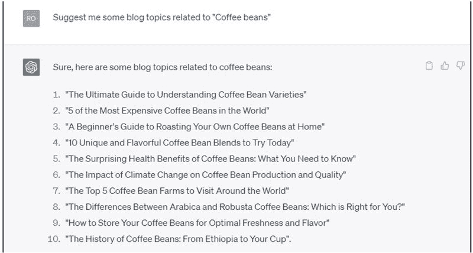
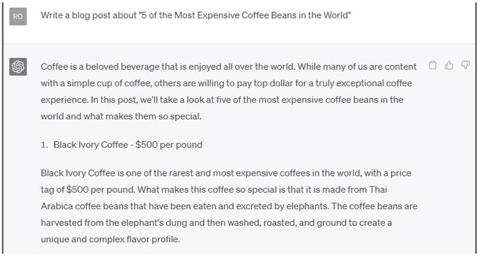
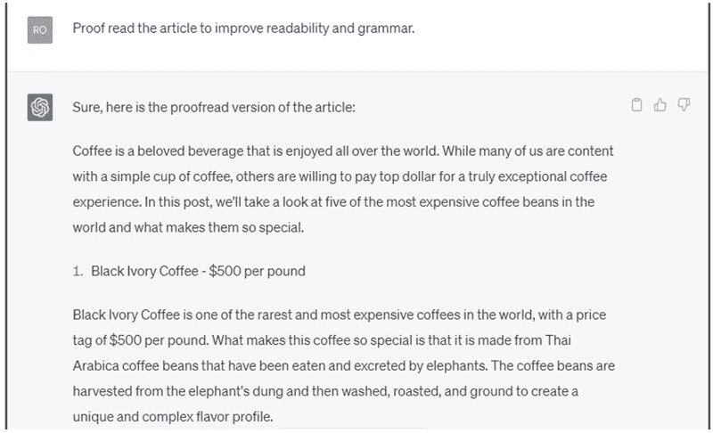

1

# 使用 ChatGPT 为博客和网站撰写内容

在本章中，我们将讨论为博客和网站撰写内容如何成为一个有利可图的兼职，并介绍 ChatGPT 如何协助研究和写作。我们还将介绍如何找到客户和推广您的服务，以及提供最大化收入潜力的建议。

# 作为兼职写作博客和网站

为博客和网站撰写内容是一个出色的兼职选择，原因有几个。

首先，对高质量内容有很高的需求。企业和个人都需要撰写精心的文章来吸引他们的受众，提高他们的搜索引擎排名，并建立自己的专业知识。

其次，自由撰稿提供灵活性，让您可以按照自己的时间表工作，并选择与您的兴趣和专业知识相符的项目。

最后，它需要很少的前期投资，只需一台计算机和互联网连接即可开始。

自由撰稿的优缺点

好处

+   灵活性：按照您的时间表工作并设定您的工作时间。

+   地点独立性：只需有互联网连接，就可以随时随地写作。

+   多样化项目：选择各种主题和行业，保持趣味性。

+   技能发展：提高您的写作技能并了解新的主题。

缺点

+   收入不稳定：每月的收入可能有所不同。

+   寻找客户：建立客户群可能具有挑战性。

+   自律：保持动力和有效管理时间至关重要。

自由撰稿作家可以赚多少钱？

自由撰稿的收入可能会因经验、领域和客户群等因素而有很大差异。一般来说，初学者可能每篇文章赚取 25-50 美元，而经验丰富的作家可以每篇收费 100-500 美元甚至更多。一些作家也可能按小时或按字收费。

# 如何使用 ChatGPT 协助研究和写作

ChatGPT 可以协助自由撰稿作家完成各种任务，如研究主题、生成文章大纲、提出内容创意，甚至撰写草稿。

ChatGPT 对自由撰稿作家的特点和优��

特点

+   研究协助：快速收集各种主题的信息。

+   内容生成：生成大纲、想法或草稿，启动您的写作。

+   语言优化：通过建议更好的词汇选择或措辞来改善您的写作。

好处

+   节省时间：简化您的研究和写作流程。

+   提升创造力：为您的内容生成新鲜的想法和观点。

+   提高生产力：在更短的时间内产生更多高质量内容。

如何使用 ChatGPT 简化您的写作流程

+   从提示开始：给 ChatGPT 一个具体的问题或主题进行研究。

+   审查和完善输出：将生成的内容作为起点，并根据您的语气和风格进行调整。

+   优化您的写作：利用 ChatGPT 的建议来提高文本的清晰度和可读性。

# ChatGPT 的应用示例

使用以下提示从 ChatGPT 获取博客主题创意：

使用以下提示与 ChatGPT 生成文章：

使用以下提示与 ChatGPT 校对文章：

# 博客和内容写作兼职的提示

+   撰写一篇关于正念冥想对心理健康的益处的博客文章。

+   为一系列新的护肤产品创建产品评论，并将它们与市场上其他知名品牌进行比较。

+   为初学者撰写一个成功的小型企业社交媒体策略的指南。

+   创建一个关于 2023 年前十大旅行目的地的排行榜，以及为什么它们应该在您的愿望清单上的文章。

+   撰写一篇关于在当今数字时代在家办公的挑战和回报的个人散文。

+   为环保产品创建购买指南，介绍选择可持续选项的好处。

+   撰写一篇关于素食主义兴起及其对食品行业影响的专题文章。

+   撰写一个关于我们页面，讲述您公司的故事以及您创办公司的原因。

+   为新产品或服务创建一个展示其特点和优势的落地页。

+   撰写一个常见问题解答页面，回答有关您公司、产品和服务的常见问题。

+   创建一个突出公司专业知识和行业知识的博客页面。

+   撰写一个产品页面，提供关于每个产品的详细信息，包括定价和规格。

+   创建一个展示客户评论和反馈的推荐页面。

+   撰写一个概述您公司价值观和使命宣言的页面。

+   创建一个列出职位空缺并描述公司文化的招聘页面。

+   ��写一个包含联系表单、电话号码和电子邮件地址以供客户查询的联系页面。

+   创建一个资源页面，为您的受众提供有用的文章、指南和资源。

# 找客户和推广您的服务

如何作为自由撰稿人找到客户

+   招聘板块：在 Upwork、Freelancer 和 ProBlogger 等平台上搜索自由撰稿机会。

+   冷投：联系您所在领域的企业或出版物，提供您的写作服务。

+   社交网络：参加行业活动，加入在线社区，并与其他作家建立联系，以发现潜在客户。

建立作品集和社交网络的重要性

作品集展示了您的写作技巧和专业知识，帮助潜在客户评估您是否适合他们的项目。要创建一个有效的作品集，包括一系列您最好的作品，最好是在您选择的领域内。

您还可以创建个人网站或使用像 Medium 或 Journo Portfolio 这样的作品集平台来展示您的写作样本。

社交网络对于找到客户和建立长期关系至关重要。通过在线论坛、社交媒体平台和 LinkedIn 等专业社交网站与其他作家、编辑和内容经理建立联系。

通过与行业内其他人互动，您不仅会发现潜在客户，还会学到宝贵的见解，并了解行业趋势。

# 有效营销您的服务的技巧

+   建立个人品牌：通过突出您独特的声音和专业知识，使自己与其他作家区分开来。

+   利用社交媒体：在 Twitter、LinkedIn 和 Facebook 等平台上分享您的工作并与目标受众互动。

+   撰写客座文章：为您所在领域内的知名博客和网站撰写客座文章，以获得曝光和信誉。

+   提供价值：在您的行业内分享有价值的内容、见解和提示，以吸引潜在客户。

# 最大化您的收入潜力

提高您的收费和赚更多的策略

+   专注于一个利基：具有专业知识的作家通常可以因其专业知识而收取更高的费用。

+   提升您的技能：通过课程、研讨会和书籍投资于专业发展，成为更好的作家并增加您的价值。

+   为相关服务提供增值：提供额外服务，如内容编辑、SEO 优化或社交媒体管理，以增加您的收入。

+   获得保留协议：与需要定期内容的客户建立持续的关系，提供稳定的收入来源。

如何与客户谈判

+   了解您的价值：研究行业价格并了解您的技能和专业知识的价值。

+   充满信心：清晰地传达您的价值主张，并通过您的工作和成果的示例来证明您的收费。

+   提供分层定价：为客户提供多种定价选项，让他们选择适合其需求的服务水平。

+   灵活应对：愿意进行谈判，但要了解自己的底线，并准备在项目条件不符合您要求时退出。

设定目标和跟踪进展的重要性

设定清晰的目标有助于您在自由撰稿业务中保持专注和动力。建立短期和长期目标，如月收入目标或您想要获取的客户数量。定期跟踪您的进展，并根据需要调整您的策略，以确保朝着目标的方向前进。

通过正确的方法，为博客和网站撰写文章可以成为一项有利可图的副业。通过利用 ChatGPT 的力量并遵循这些提示，您可以建立一个成功的自由撰稿业务，并实现您的财务目标。保持坚持，不断完善您的技能，并有效地营销您的服务，以释放您作为自由撰稿人的全部潜力。
