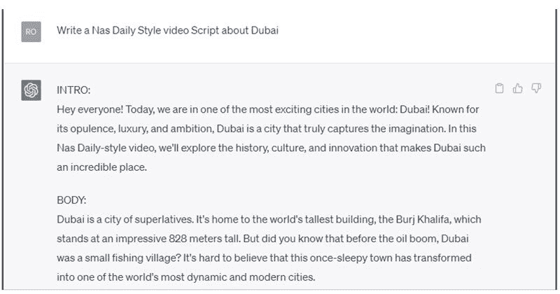

2

# 使用 ChatGPT 进行视频脚本和描述撰写

在数字媒体时代，视频内容对于企业、影响者和个人变得越来越重要。因此，对于熟练的视频脚本和描述撰写者的需求也在增长。

本章将概述视频脚本和描述撰写作为副业的情况，解释 ChatGPT 如何协助您在这一领域，指导您如何找到客户并推广您的服务，并提供最大化收入潜力的建议。

# 视频脚本和描述撰写作为副业

A. 视频脚本撰写

视频脚本撰写涉及为各种类型的视频内容（如商业广告、教程、产品评论、纪录片等）制作引人入胜且信息丰富的脚本。有效的脚本不仅传达预期的信息，还与目标观众建立联系。

B. 视频描述撰写

视频描述撰写侧重于创建视频内容的简洁准确摘要。这些描述帮助观众在观看视频之前了解视频内容，并且对于搜索引擎优化（SEO）至关重要。

为什么视频脚本和描述撰写是一个很好的副业选择？

视频内容在受欢迎度上蓬勃发展，企业和个人正在利用它进行营销、教育和娱乐。撰写视频脚本和描述是一个极好的副业选择，因为它需要创造力、注重细节和讲故事的技巧。此外，这是一种令人兴奋和引人入胜的写作形式，让您可以展现创造力。

视频脚本和描述撰写的优缺点

优点

+   创意表达：撰写引人入胜和令人信服的故事。

+   灵活性：根据自己的时间表工作，并选择与自己兴趣和专长相符的项目。

+   持续需求：对高质量视频内容的需求正在增长。

+   可能需要长期项目：客户可能需要持续的视频内容。

缺点

+   需要一些技术知识：您可能需要了解视频制作和编辑，以撰写引人入胜的脚本和描述。

+   可能难以进入：在行业中建立自己可能需要时间和努力。

作为视频脚本和描述撰写者，您可以赚取多少？

与任何自由撰稿工作一样，费率可能会根据经验、领域和项目范围而有所不同。一般来说，初学者可能会每分钟视频内容赚取 50-100 美元，而经验丰富的作家可以每分钟收费 200 美元或更多。

# ChatGPT 如何协助研究和撰写

ChatGPT 如何帮助研究和撰写

ChatGPT 可以协助视频脚本和描述撰写者进行各种任务，如研究主题、生成视频大纲、提出内容创意，甚至撰写草稿。

ChatGPT 为视频脚本和描述撰写者提供的特点和优势

特点

+   研究协助：快速收集各种主题的信息。

+   内容生成：生成大纲、想法或草稿，启动您的视频写作。

+   语言优化：通过建议更好的词语选择或措辞来改善您的写作。

益处

+   节省时间：简化您的研究和写作流程。

+   提升创造力：为您的视频内容生成新的想法和视角。

+   提高生产力：在更短的时间内生产更多高质量的视频内容。

如何使用 ChatGPT 简化您的写作流程

+   从提示开始：给 ChatGPT 一个具体的问题或主题进行研究。

+   审查和完善输出：将生成的内容作为起点，并根据您的声音和风格进行调整。

+   优化您的写作：利用 ChatGPT 的建议来提高您脚本的清晰度和节奏。

# ChatGPT 的应用

使用以下提示生成 Nas Daily 风格的 YouTube 视频：

使用以下提示生成 Mr. Beast 风格的 YouTube 视频：

# 视频脚本和描述撰写提示

+   为展示新健身追踪器功能和优势的产品发布视频创建视频脚本和描述。

+   为突出可持续时尚品牌历史和使命的品牌故事视频编写视频脚本和描述。

+   为教程视频创建视频脚本和描述，教导观众如何制作 DIY 家居装饰项目。

+   为解释气候变化科学原理及其对环境影响的解说视频编写视频脚本和描述。

+   为推广新旅游目的地并突出其独特景点的宣传视频创建视频脚本和描述。

+   为教导观众如何从头开始烹饪新食谱的视频编写视频脚本和描述。

+   为探索特定类型音乐的历史和文化意义的教育视频创建视频脚本和描述。

+   为客户见证视频编写视频脚本和描述，展示真实客户分享他们对产品或服务的体验和反馈。

+   为邀请专业领域专家分享知识和见解的访谈视频编写视频脚本和描述。

+   为记录特定行业专业人士一天生活的 vlog 风格视频编写视频脚本和描述。

# 寻找客户并推广您的服务

如何作为视频脚本和描述撰写者找到客户

+   自由职业网站：在流行的自由职业网站上创建个人资料，如 Upwork、Fiverr 和 Freelancer，展示您的技能和作品集。

+   冷推销：联系企业或视频制作公司，提供您的写作服务。

+   社交网络：参加行业活动，加入在线社区，并与其他视频创作者联系，发现潜在客户。

+   社交媒体：加入 Facebook、LinkedIn 和 Reddit 等平台上的特定利基群组和论坛，并参与对话，展示你的专业知识。

+   推荐：向你现有的客户索要推荐或推荐信，口碑营销可以是扩大客户群的有效方式。

建立作品集和社交网络的重要性

作品集展示了你的视频撰写技能和专业知识，帮助潜在客户评估你是否适合他们的项目。为了创建一个有效的作品集，包括你最好的作品的各种样本，最好是在你选择的利基领域内。你也可以创建个人网站或使用像 Contently 或 Journo Portfolio 这样的作品集平台来展示你的视频剧本和描述样本。

社交网络对于找到客户和建立长期关系至关重要。通过在线论坛、社交媒体平台和 LinkedIn 等专业社交网站与其他视频创作者、制片人和内容经理建立联系。通过与行业内其他人互动，你不仅会发现潜在客户，还会学到宝贵的见解，并保持行业趋势的最新动态。

有效营销你的服务的技巧

+   建立个人品牌：通过突出你独特的风格和专业知识，使自己与其他视频撰写者区分开来。

+   利用社交媒体：在 Twitter、LinkedIn 和 Facebook 等平台上分享你的作品，并与目标受众互动。

+   提供价值：在你的行业内分享有价值的视频内容、见解和技巧，吸引潜在客户。

+   展示你的专业知识：提议在会议或活动上演讲，并撰写客座文章，展示你的视频撰写技能和知识。

# 最大化你的收入潜力

提高收费和赚更多的策略

+   在一个利基领域专攻：具有专业知识或专长的视频撰写者通常可以收取更高的费用。

+   附加销售相关服务：提供额外的服务，如视频编辑、配音解说或音乐创作，以增加你的收入。

+   签订保留协议：与需要定期视频内容的客户建立持续关系，提供稳定的收入来源。

+   打包交易：提供一揽子视频撰写服务，如剧本撰写、视频描述和社交媒体标题，以增加你的收入和整体价值。

如何与客户谈判

+   了解自己的价值：调查行业收费标准，了解你的技能和专业知识的价值。

+   保持自信：清晰地传达你的价值主张，并通过你的工作和成果的例子来证明你的收费标准。

+   提供分层定价：为客户提供多种定价选项，让他们选择适合自己需求的服务水平。

+   灵活应对：愿意进行谈判，但要知道自己的底线，并准备在项目条件不符合要求时退出。

设定目标和跟踪进展的重要性

设定清晰的目标有助于您在视频写作业务中保持专注和动力。建立短期和长期目标，如月收入目标或您想要获得的客户数量。定期跟踪您的进展，并根据需要调整策略，以确保朝着目标的方向前进。

通过遵循这些步骤并利用 ChatGPT 的能力，您可以成功地在视频剧本和描述写作方面建立一个有利可图的兼职业务。保持专注于您的目标，不断学习和改进，并适应不断变化的数字环境，以确保长期成功。

随着您在 ChatGPT 辅助下进行视频剧本和描述写作兼职业务的进展，始终将客户满意度置于首位，并保持最高质量的工作。通过持续提供一流的内容并与客户建立良好的关系，您不仅将确保再次获得业务，还将在行业内建立积极的声誉。
