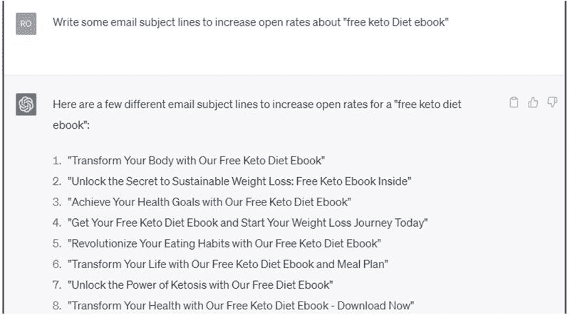

3

# 使用 ChatGPT 进行文案写作服务

使用 ChatGPT 进行文案写作是一种兼职，您可以利用 ChatGPT 的高级语言能力为各种平台（如网站、广告、社交媒体帖子和电子邮件营销）创建具有说服力、吸引力和有效性的营销文案。

作为利用 ChatGPT 进行文案写作服务的兼职者，您可以提高生产力并扩大服务范围，从而满足不同行业的更广泛客户需求。

# 使用 ChatGPT 进行文案写作：为您的客户撰写内容

文案写作是为了广告或营销产品、服务或理念而撰写文本的行为。文案写作的目标是说服读者采取特定行动，例如购买产品、订阅服务或注册电子报。

ChatGPT 可以以各种方式为您的客户撰写内容。以下是一些示例：

+   生成标题和标语：标题和标语是有效广告和营销的关键组成部分。使用 ChatGPT，您可以输入与客户业务或产品相关的关键词或短语，它将为您生成标题和标语，您可以在文案中使用。

+   撰写社交媒体帖子：社交媒体是一个强大的营销工具，但为社交媒体创建内容可能会耗费时间。使用 ChatGPT，您可以输入与客户社交媒体目标相关的提示和问题，它将生成您可以在社交媒体帖子中使用的内容。

+   制作电子邮件营销活动：电子邮件营销是与客户目标受众联系的有效方式。使用 ChatGPT，您可以输入与客户电子邮件营销活动目标相关的提示，它将为您的电子邮件生成内容。

+   创建落地页：落地页旨在将网站访问者转化为潜在客户或客户。使用 ChatGPT，您可以输入与客户落地页目标相关的提示，它将为您的落地页生成内容。

虽然 ChatGPT 可以为您的客户生成内容，但关键是要定制内容以匹配客户的品牌语气和语调。还要确保根据需要测试和完善内容的有效性。

# 作为 ChatGPT 文案撰稿人赚钱

作为文案撰稿人，您可以赚取多少？

作为自由撰稿人或从事文案写作兼职的人，您的收入可能会根据您的经验、领域、与客户合作的类型以及您承担的工作量而有显著变化。以下是自由撰稿人或兼职文案撰写人的潜在收入的一般概述。

1.  初学文案撰稿人：作为初学者，您可以在建立作品集和积累经验的同时收取较低的费率。根据项目，您可以预期每小时赚取 25-50 美元或每字几分到 0.10 美元不等。

1.  中级文案撰写师：有了一些经验后，你可以提高收费标准并吸引付费更高的客户。在这个阶段，你可能会每小时收费在$50-$100 之间，或每字收费在$0.10-$0.50 之间。

1.  经验丰富的文案撰写师：作为经验丰富的自由职业文案撰写师，你可以收取高级收费，通常每小时在$100-$150 或更高，或每字在$0.50-$1 或更高。

请记住这些数字是近似值。你的实际收入可能会因具体情况而异。作为自由职业者或兼职者，你的收入很大程度上取决于你拥有的客户数量、你的收费标准以及你承担的工作量。要增加收入，考虑专攻一个有利可图的领域、通过社交网络寻找新客户，并始终提供高质量的工作以建立良好的声誉。

要作为 ChatGPT 文案撰写师赚钱，请遵循以下步骤。

+   确定你的利基：选择一个你在市场上有知识和兴趣的特定行业或主题，这将帮助你脱颖而出，并更容易找到需要专业文案撰写服务的客户。

+   建立作品集：创建一个展示你的作品的作品集，包括你借助 ChatGPT 撰写的营销文案。这些样本将让潜在客户了解你的写作风格和能力。

+   设定你的收费标准：根据你提供的价值、每个项目所花费的时间以及类似服务的市场价格确定你的定价结构。

+   推广你的服务：通过社交媒体、内容平台和自由职业工作板块推广你的文案撰写服务。与行业内其他人建立联系也可以帮助你找到潜在客户。

+   创造独特的卖点：为了在竞争激烈的市场中脱颖而出，创造一个突出你的 ChatGPT 文案撰写服务优势的独特卖点（USP）至关重要。这些优势可以基于你的专业知识、经验、交付时间或定价��构。 

+   整合增值服务：为了将你的 ChatGPT 文案撰写服务与市场上其他服务区分开，考虑提供增值服务，如 SEO 优化、内容策略咨询或社交媒体管理。这些附加服务可以帮助你吸引寻找全方位服务提供商的客户。

# CHATGPT 的应用

使用以下提示生成电子邮件主题行：

使用以下提示生成商业口号：

# 使用 ChatGPT 进行文案撰写服务的提示

标题和口号

+   为新产品发布生成标题和口号。

+   为商业口号想出一个吸引人的标语。

+   为博客文章创建一个引人注目的标题。

社交媒体帖子

+   撰写一篇社交媒体帖子推广促销活动。

+   为产品发布生成社交媒体内容。

+   撰写一篇社交媒体帖子与客户的粉丝互动。

电子邮件营销活动

+   撰写一封电子邮件主题行以提高开启率。

+   创建一个电子邮件营销活动来推广新产品。

+   为新订阅者创建欢迎电子邮件的内容。

着陆页

+   为一个服务推广的着陆页撰写文案。

+   创建一个着陆页的内容，以促进转化。

+   为一个限时优惠活动的着陆页生成文案。

# 寻找客户

要找到您的 ChatGPT 辅助文案撰写服务的客户，请考虑这些策略。

+   冷推销：研究您所在领域的企业或个人，并向他们发送个性化的电子邮件，概述您的服务以及如何帮助他们改善营销工作。

+   招聘板块：定期浏览并申请在 Upwork、Freelancer 和 Fiverr 等招聘板块上的文案撰写工作。

+   社交媒体：加入 Facebook、LinkedIn 和 Reddit 等平台上的特定领域群组和论坛，参与对话，展示您的专业知识。

+   推荐：向您当前的客户索取推荐或推荐，口碑营销可以是扩大客户群的有效方式。

+   LinkedIn 推广：使用 LinkedIn 联系潜在客户并提供您的服务。您还可以使用 LinkedIn Sales Navigator 来识别和定位潜在潜在客户。

+   内容营销：制定一个强大的内容营销策略，展示您的专业知识，吸引潜在客户。这种策略可以包括创建博客文章、社交媒体内容或视频。

+   合作：与您所在领域的其他专业人士或企业合作，提供联合服务或合作。这些合作关系可以帮助您扩大影响力，吸引新客户。

+   付费广告：考虑在 Google Ads 或 Facebook Ads 等平台上投资付费广告，以扩大受众群体，吸引潜在客户。

# 成功的提示

1.  了解营销原则：熟悉营销基础知识、消费者心理学和说服技巧，以创作能够产生结果的引人注目的文案。

1.  适应客户的品牌语调：学会以不同的风格和语调写作，以匹配每个客户独特的品牌语调。

1.  了解行业趋势：跟上文案撰写和数字营销的最新趋势和最佳实践，确保您的文案保持相关性。

1.  与客户合作：与客户密切合作，了解他们的目标和目标受众，确保您的文案与他们的营销目标一致。

1.  了解 ChatGPT 的进展：定期检查 ChatGPT 模型的更新和改进，因为它们可能会提高您的生产力和工作质量。

1.  多样化您的服务：提供与文案撰写相关的额外服务，如内容策略咨询或社交媒体管理，以增加您的收入潜力。

通过遵循这些步骤并利用 ChatGPT 的能力，您可以在文案撰写服务中建立一个有利可图的兼职。保持专注于您的目标，不断学习和改进，并适应不断变化的数字景观，以确保长期成功。

在你进行 ChatGPT 辅助的文案副业时，始终要记得优先考虑客户满意度，并保持最高质量的工作。通过持续提供一流内容并与客户建立良好关系，你不仅能够确保再次合作，还能在行业内建立积极声誉。
