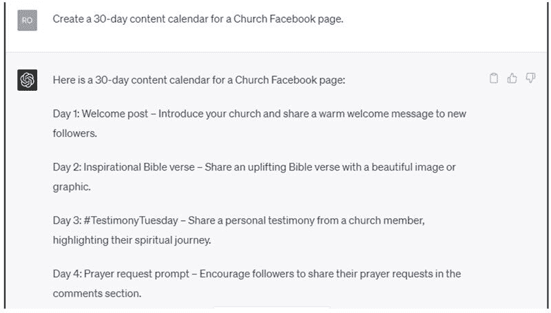
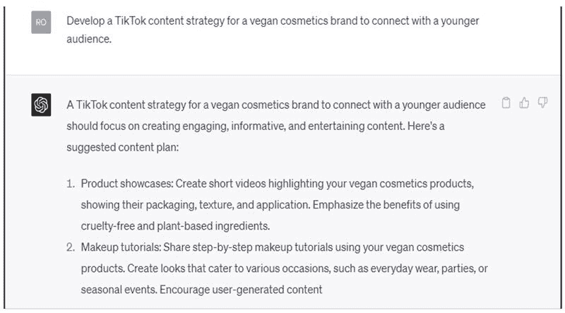

4

# 利用 CHATGPT 将社交媒体管理作为兼职

在当今数字时代，社交媒体管理已成为各种规模的企业与目标受众联系、建立品牌知名度和增加销售的重要工具。因此，对于能够帮助企业应对社交媒体平台不断变化的技能社交媒体经理的需求正在增长。

在本章中，我们将探讨社交媒体管理作为一个有利可图的兼职，并介绍 ChatGPT 如何协助你进行内容创作、定时发布、寻找客户以及最大化你的收入潜力。

# 社交媒体管理作为一个兼职

社交媒体管理涉及在社交媒体平台上创建、定时发布、分析和互动的内容，如 Facebook、Instagram、Twitter、LinkedIn 和 Pinterest。作为社交媒体经理，你将负责：

+   制定并实施社交媒体策略。

+   为各种平台创建引人入胜的内容。

+   定时发布内容和管理内容日历。

+   监控并回复评论和消息。

+   分析指标并相应调整策略。

这个兼职非常适合具有良好沟通技巧、创造力和对社交媒体趋势和平台算法的理解的人。它还提供灵活的工作时间表和远程工作的能力，使其成为许多人理想的兼职。

作为兼职社交媒体经理，你可以赚取多少？

作为社交媒体自由职业者或兼职者，你的收入将取决于你的经验、领域、提供的服务以及与之合作的客户数量。

一般来说，你可以预期从社交媒体管理、内容创作和策略服务中每小时赚取 $30 到 $75 或更多。请记住，这些是大致数字。你的实际收入可能会根据具体情况和你为客户提供的价值而有所不同。

为了增加收入，考虑专攻特定平台或行业、建立强大的作品集，并通过社交网络寻找新客户。

# CHATGPT 如何协助内容创作和定时发布

由 OpenAI 开发的强大语言模型 ChatGPT 可以成为社交媒体经理的宝贵工具。它可以帮助你：

+   生成内容创意：ChatGPT 可以为博客帖子、社交媒体标题和其他类型的内容提供针对你客户的领域和目标受众量身定制的建议。

+   起草内容：使用 ChatGPT 起草引人入胜的社交媒体帖子，节省你在内容创作过程中的时间和精力。

+   校对和编辑：ChatGPT 可以帮助你识别语法和标点错误，确保你的内容得到精心打磨和专业化。

+   定时发布内容：将 ChatGPT 与社交媒体定时发布工具（如 Buffer 或 Hootsuite）集成，自动化发布过程，让你可以专注于其他任务。

# CHATGPT 的应用

使用以下提示创建社交媒体内容日历：

使用以下提示创建社交媒体内容日历：

# 社交媒体管理兼职的提示

1.  为健身品牌生成 10 个引人注目的 Instagram 标题创意。

1.  2023 年企业社交媒体的前 5 大趋势是什么？

1.  为一家小面包店的 Facebook 页面创建一个 30 天的内容日历。

1.  如何增加 LinkedIn 上的参与度的最佳实践是什么？

1.  旅行社如何有效地利用 Pinterest 吸引更多客户？

1.  为非营利组织起草一系列宣传即将举办的慈善活动的 5 条推文。

1.  为成功的 Instagram 营销活动跟踪的关键指标是什么？

1.  建议 3 种改善时尚品牌 Instagram 页面视觉美学的方法。

1.  房地产经纪如何利用社交媒体产生潜在客户和增加销售？

1.  制定社交媒体策略，以增加本地餐厅的在线存在感并吸引更多客户。

1.  对于科技评论业务，增加 YouTube 频道的最有效技巧是什么？

1.  为一家兽医诊所生成 10 条 Facebook 帖子创意。

1.  个人理财博客如何利用 Twitter 增加受众参与度？

1.  在 Instagram 上成功的影响营销活动的关键元素是什么？

1.  为一家环保化妆品品牌制定 TikTok 内容战略，以吸引年轻受众。

1.  建议 5 种优化 LinkedIn 公司页面以获得更好可见性和参与度的方法。

1.  一档播客如何利用社交媒体平台增加听众？

1.  为激励演讲者创建 10 个 Instagram Story 创意，以激励他们的追随者。

1.  处理社交媒体上负面评论和反馈的最佳实践是什么？

1.  一家本地书店如何利用社交媒体营造社区感和增加实体店客流量？

# 如何找到客户并推广您的服务

建立客户群对于成功的社交媒体管理兼职至关重要。以下是一些帮助您找到客户并推广服务的策略。

+   制作作品集：创建一个展示您社交媒体管理技能的作品集，包括您创建的内容示例、您管理的账户以及任何相关的分析数据。

+   网络：参加本地商业活动，加入与您领域相关的在线论坛和社交媒体群组，并在 LinkedIn 上与潜在客户建立联系。

+   提供免费或折扣服务：向朋友、家人或当地企业提供免费或折扣服务，以建立您的作品集并获得推荐。

+   使用自由职业平台：注册自由职业网站，如 Upwork，Fiverr 或 Freelancer，寻找寻找需要社交媒体管理服务的客户。

+   在社交媒体上推广您的服务：为您的兼职创建社交媒体资料，并通过定期发布和互动与潜在客户互动。

# 最大化收入潜力的提示

要充分利用您的社交媒体管理兼职，请遵循以下提示。

+   提升技能：保持对社交媒体趋势和平台更新的了解。投资学习新技能，如平面设计、摄影或文案撰写，以增强您的服务。

+   提供套餐：创建分层服务套餐，以满足不同需求和预算的客户。推销额外服务，如内容创作、分析报告或广告管理。

+   专注于一个利基：专注于特定行业或利基可以帮助您脱颖而出，吸引付费更高的客户。

+   设定清晰期望：与客户建立明确的期望，包括工作范围、时间表和交付内容，以确保顺畅合作，减少误解。

+   及时响应：通过迅速回复客户的询问并解决可能出现的任何问题或疑虑，提供优质客户服务。

+   寻求推荐：鼓励满意的客户将您的服务推荐给他们的网络，并考虑提供折扣或成功推荐的免费服务等激励措施。

+   优化工作流程：简化流程，利用 ChatGPT 和社交媒体排程平台等工具提高效率，让您能够接受更多客户并增加收入。

社交媒体管理是一个有潜力获得可观收入和灵活性的兼职。通过利用 ChatGPT 进行内容创作和排程，采用有效策略找到客户并推广您的服务，并遵循提供的提示最大化您的收入，您可以建立一个成功的社交媒体管理兼职，并享受在快速发展的数字领域工作的好处。
