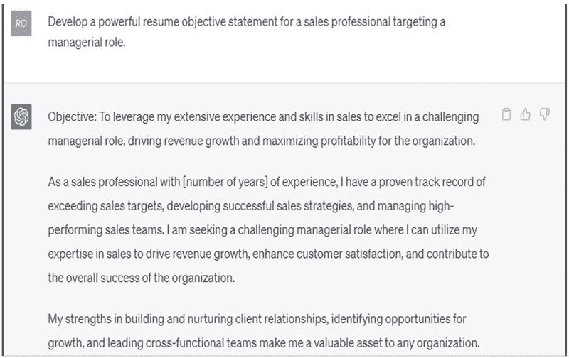

5

# 利用 CHATGPT 在 Fiverr 上写简历和个人简介作为兼职

在当今竞争激烈的就业市场中，一份精心制作的简历和专业个人简介对求职者和希望推动职业发展的专业人士来说至关重要。因此，对于能够帮助个人以最佳方式展示他们的技能、经验和成就的熟练简历和个人简介作家存在着巨大需求。

在本章中，我们将探讨在 Fiverr 上写简历和个人简介作为兼职的过程，ChatGPT 如何协助您进行此过程，寻找客户以及最大化收入潜力。

# 在 Fiverr 上写简历和个人简介作为兼职

Fiverr 是一个受欢迎的在线自由职业服务市场，个人可以在各个领域提供自己的技能，包括简历和个人简介撰写。作为一名简历和个人简介作家，您将负责：

+   了解客户的背景、技能和目标。

+   制作组织良好且视觉吸引力强的简历。

+   为各种平台编写引人注目的专业个人简介。

+   将内容定制给特定行业和职位。

+   校对和编辑以确保文档无误。

这份兼职非常适合具有较强写作、沟通和组织能力，以及对不同行业和工作要求有一定了解的个人。

在 Fiverr 上作为简历和个人简介作家可以赚多少钱？

作为在 Fiverr 上写简历和个人简介的兼职者，收入取决于经验、质量和客户量。初学者可能每个项目收费$5-$25，中级作家$25-$75，有经验的作家$75-$200 或更多。

请记住 Fiverr 收取 20%的佣金。为增加收入，建立强大的作品集，获得积极的评价，并推广您的服务。

# CHATGPT 如何协助撰写简历和个人简介

由 OpenAI 开发的强大语言模型 ChatGPT 可以成为简历和个人简介作家的宝贵工具。它可以帮助您：

+   生成内容：ChatGPT 可以提供建议，帮助打造引人注目的简历部分和专业个人简介，确保内容符合客户的需求和行业。

+   起草和编辑：使用 ChatGPT 起草和编辑简历和个人简介，节省您在写作过程中的时间和精力。

+   校对：ChatGPT 可以帮助您识别语法和标点错误，确保您的文件经过精心打磨且专业。

+   保持更新：ChatGPT 可以提供有关当前简历趋势和最佳实践的见解，使您能够创建在就业市场中脱颖而出的简历和个人简介。

# CHATGPT 的应用

使用以下提示为网���撰写个人简介：

使用以下提示为网站撰写个人简介：

# 撰写简历和个人简介的提示

1.  为具有 5 年经验的市场经理生成引人注目的专业总结。

1.  列出 10 个动词，以有效描述简历中的成就。

1.  为一位计算机科学学士的应届毕业生起草一个 LinkedIn 个人简介。

1.  建议 5 个简历格式化技巧，以创建一个视觉吸引人且易于阅读的文档。

1.  为自由职业平面设计师的网站撰写一个引人入胜的个人简介。

1.  如何有效展示可转移技能在职业转变简历中？

1.  创建在撰写客户简历或个人简介之前询问客户的 5 个问题的清单。

1.  为一个以管理角色为目标的销售专业人士制定一个强有力的简历目标陈述。

1.  提供优化 LinkedIn 个人资料以增加可见性并吸引招聘者的提示。

1.  为一位有抱负的作者在社交媒体平台上撰写一个引人注目的个人简介。

# 如何找到客户并推广您的服务

建立客户群对于您在 Fiverr 上的简历和个人简介撰写兼职的成功至关重要。以下是一些帮助您找到客户并推广服务的策略。

+   创建引人注目的服务：制定一个展示您的简历和个人简介撰写服务的 Fiverr 服务，突出您的专业知识、经验和独特卖点。

+   建立作品集：创建一个展示您写作技能的作品集，包括您为不同行业和职位制作的简历和个人简介示例。

+   收集推荐信：向满意的客户请求评论和推荐信，以建立与潜在客户的信誉和信任。

+   推广您的服务：在社交媒体平台、LinkedIn 和相关���线论坛上分享您的 Fiverr 服务，以扩大受众群体。

+   提供折扣或促销：通过提供限时折扣或促销活动鼓励新客户尝试您的服务。

# 最大化收入潜力的技巧

要充分利用您在 Fiverr 上的简历和个人简介撰写兼职，遵循以下提示。

+   提升技能：保持了解简历趋势和最佳实践。投资学习与简历和个人简介撰写相关的新技能，如平面设计或搜索引擎优化（SEO）。

+   提供附加服务：提供额外服务，如求职信撰写、LinkedIn 个人资料优化或职业指导，以增加您的收入潜力。

+   专注于一个利基：专注于特定行业或职能可以帮助您脱颖而出，吸引付费更高的客户。

+   保持高质量标准：确保您的工作始终高质量，满足或超出客户期望，以获得积极的评论和重复业务。

+   保持响应：通过及时回复客户的询问并解决可能出现的任何问题或疑虑，提供优质的客户服务。

+   优化您的服务：定期更新和优化您的 Fiverr 服务，使用相关关键词和引人注目的图片来提高其可见性并吸引更多客户。

+   设定清晰的期望：与客户建立明确的期望，包括工作范围、时间表和可交付成果，以确保顺畅合作并减少误解。

+   高效管理您的时间：简化流程，利用 ChatGPT 等工具提高效率，让您能够接待更多客户并增加收入。

在 Fiverr 上撰写简历和个人传记是一项有潜力获得可观收入和灵活性的副业。通过利用 ChatGPT 进行内容创作和编辑，采用有效的策略找到客户并推广您的服务，并遵循提供的提示来最大化您的收入，您可以建立一个成功的简历和个人传记写作副业，并享受在不断发展的自由职业市场中工作的好处。
