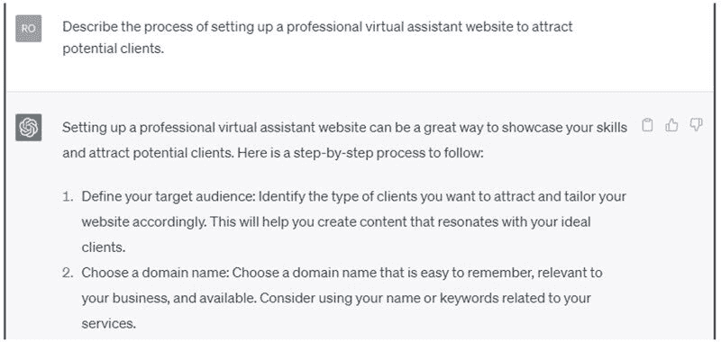
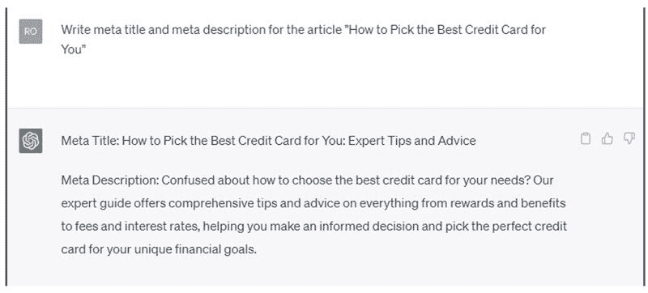

6

# 使用 ChatGPT 作为兼职虚拟助理

远程工作的增长趋势和企业管理各种任务的需求推动了对虚拟助理的需求。作为虚拟助理，您可以在家中为客户提供广泛的行政和支持服务。

在这一章中，我们将探讨虚拟助理作为兼职以及 ChatGPT 如何协助您处理行政任务、寻找客户并最大化收入潜力。

# 作为兼职的虚拟助理

虚拟助理（VA）是一名为客户提供远程行政支持的自由职业者，如企业家、小企业所有者或繁忙的专业人士。虚拟助理可能处理的一些常见任务包括：

+   日历和电子邮件管理

+   数据输入和组织

+   社交媒体管理

+   客户服务

+   研究和内容创作

这个兼职非常适合具有强大组织和沟通能力，以及能够独立工作和有效管理时间的个人。

作为虚拟助理，你可以赚多少钱？

虚拟助理的收入可能会因经验、地点、技能和与客户合作的类型而有所不同。一般来说，虚拟助理可以期望每小时赚取$10-$50 或更多。

这是一个大致的分解：

1.  初级虚拟助理：每小时$10-$20。

1.  中级虚拟助理：每小时$20-$35。

1.  经验丰富的虚拟助理：每小时$35-$50+。

这些数字仅供参考，实际收入可能有所不同。要增加作为虚拟助理的收入，专注于发展专业技能，在特定领域或行业获得经验，并通过始终如一的高质量工作与客户建立良好声誉。

# ChatGPT 如何协助处理行政任务

由 OpenAI 开发的强大语言模型 ChatGPT 可以成为虚拟助理的宝贵工具。它可以帮助您：

+   起草和编辑电子邮件：ChatGPT 可以帮助您为客户起草、编辑和校对电子邮件，确保专业和精心的沟通。

+   内容创作：利用 ChatGPT 为博客文章、社交媒体更新和其他客户需求生成引人入胜的内容。

+   研究：使用 ChatGPT 收集各种主题的信息，帮助您节省时间并向客户提供准确的数据。

+   记笔记和总结：ChatGPT 可以帮助您记录会议或文件的笔记并创建摘要，为客户提供简洁有序的信息。

+   任务管理：获取帮助以组织任务、设置优先级并创建待办事项列表，以保持工作量的掌控。

# ChatGPT 的应用

使用以下提示为虚拟助理编写专业网站：

使用以下提示作为虚拟助理：

# 作为兼职的虚拟助理的提示

1.  列出每个成功的虚拟助理都应具备的 10 项基本技能。

1.  作为虚拟助理如何管理多个客户和任务的最有效策略是什么？

1.  描述建立专业虚拟助理网站的过程，以吸引潜在客户。

1.  虚拟助理如何利用社交媒体扩大他们的网络并有效推广他们的服务？

1.  讨论在远程位置作为虚拟助理工作的好处和挑战。

1.  提供 5 个可以帮助虚拟助理保持组织和高效的工具和应用程序的列表。

1.  定价虚拟助理服务时需要考虑的关键因素是什么？

1.  虚拟助理如何建立与客户的良好工作关系并确保清晰沟通？

1.  描述作为虚拟助理确定利基或专业领域的过程及其对收入的潜在影响。

1.  概述为虚拟助理兼职创建有效营销计划的步骤。

# 如何找到客户并推广你的服务

建立客户群对于你的虚拟助理兼职的成功至关重要。以下是一些帮助你找到客户并推广你的服务的策略。

+   创建专业网站：开发一个展示你的虚拟助理服务、技能、经验和你可以处理的任务范围的网站。

+   在社交媒体和 LinkedIn 上建立网络：与潜在客户建立联系，并参与相关群组和讨论，展示你的专业知识并吸引客户。

+   在自由职业平台注册：注册 Upwork、Freelancer 或 Belay 等平台，这些平台连接虚拟助理和客户。

+   提供免费试用或折扣服务：鼓励新客户通过提供限时免费试用或折扣价格来尝试你的服务。

+   请求推荐和推荐信：请满意的客户向他们的网络推荐你，并提供推荐信以建立可信度和信任。

# 最大化收入潜力的提示

要充分利用你的虚拟助理兼职，遵循以下提示。

+   专注于一个利基：专注于特定行业或专业领域可以帮助你脱颖而出，吸引付费更高的客户。

+   提升技能：学习新技能，如平面设计、项目管理或社交媒体管理，以扩大你的服务范围并增加收入潜力。

+   设定清晰的期望：与客户建立清晰的期望，包括工作范围、时间表和交付内容，以确保顺畅合作，减少误解。

+   及时响应：通过迅速回复客户的询问并解决可能出现的任何问题或问题，提供优质客户服务。

+   有效管理时间：使用时间管理技巧和工具如 ChatGPT 提高效率，让你接受更多客户并增加收入。

虚拟助理可以是一份报酬丰厚且灵活的兼职工作。你可以利用 ChatGPT 来帮助处理行政任务，通过推广你的服务找到客户，并通过遵循给定的建议赚取更多的钱。

提供不同的服务、不断学习工作内容并提升技能以保持领先是非常重要的。拥有成功的虚拟助理业务，你可以在家工作并成为零工经济的一部分。
