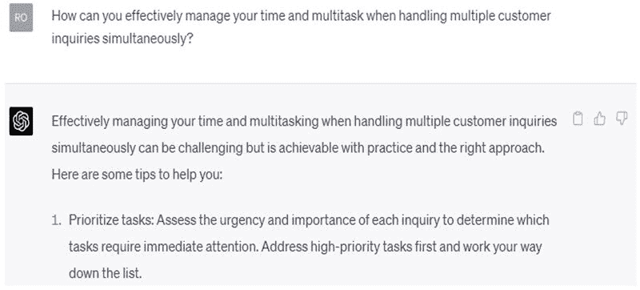

9

# 在线客户支持作为一种兼职使用 ChatGPT

为那些喜欢帮助他人并具有出色沟通技巧的人，提供在线客户支持是一种受欢迎的兼职。

在本章中，我们将探讨在线客户支持作为一种兼职，ChatGPT 如何帮助您处理客户服务任务，如何找到客户并推广您的服务，以及最大化收入潜力的建议。

# 在线客户支持作为一种兼职

作为在线客户支持代表，您将通过聊天、电子邮件或电话协助客户解答问题、解决疑虑和问题。任务可能包括：

+   解决客户投诉。

+   提供产品或服务信息。

+   处理订单、退货或退款。

+   故障排除技术问题。

+   提供建议和建议。

这项兼职适合具有较强问题解决能力、同理心和耐心的个人。

通过在线客户支持作为一种兼职可以赚取多少？

通过在线客户支持兼职，您可以预计每小时赚取$10-$35 不等的收入，具体取决于您的经验、工作的复杂性和所在公司。

然而，收入可能有所不同，对于具有专业技能或在某些行业中的人来说，收入可能更高。

# ChatGPT 如何协助客户服务任务

由 OpenAI 开发的强大语言模型 ChatGPT 可以成为在线客户支持代表的宝贵工具。它可以帮助您：

+   起草专业回复：使用 ChatGPT 生成结构良好、富有同理心的回复，确保客户体验积极。

+   故障排除协助：ChatGPT 可以帮助您找到常见技术问题或问题的解决方案，从而为客户提供高效支持。

+   知识库：利用 ChatGPT 快速获取产品或服务信息、政策和指南，以更好地帮助客户。

+   语言协助：ChatGPT 可以帮助您与说不同语言的客户沟通，让您支持更多不同背景的客户。

+   时间管理：ChatGPT 可以通过提供即时、相关的信息和建议来帮助您节省时间，让您处理更多客户互动并增加您的收入潜力。

# CHATGPT 的实际应用

使用以下提示来获取改进客户支持兼职的建议：

# 作为在线客户支持兼职的提示

1.  在基于聊天的环境中提供优秀在线客户支持的最佳实践是什么？

1.  在同时处理多个客户查询时，如何有效管理时间和多任务处理？

1.  讨论在在线互动中与客户建立个人和专业关系的策略。

1.  通过聊天、电子邮件和电话提供客户支持的主要区别是什么，以及如何相应调整您的沟通风格？

1.  在为国际客户提供在线客户支持时，如何有效处理语言障碍和文化差异？

1.  描述在线客户支持中跟踪和衡量关键绩效指标（KPI）的过程，以确保服务质量的一致性。

1.  有哪些常见的客户支持场景，以及如何为其提供快速帮助做好准备？

1.  讨论及时了解公司政策、产品更新和行业新闻的重要性，以向客户提供准确和相关的支持。

1.  如何在高压在线客户支持环境中管理和减轻压力？

1.  提供发展成长心态并不断学习和改进作为在线客户支持代表的技巧。

# 如何找到客户并推广你的服务

要找到客户并推广你的在线客户支持服务，请按照以下步骤进行。

+   创建专业档案：在 Upwork、Freelancer 或 PeoplePerHour 等自由职业平台上开发个人资料，突出你的客户支持技能、经验和可用性。

+   社交网络：加入与客户支持和你所在行业相关的在线论坛、社交媒体群组和 LinkedIn 社区，与潜在客户和同行专业人士建立联系。

+   提供特定服务：专注于特定行业或类型的客户支持（例如技术支持、电子商务），以区别于竞争对手并吸引有特定需求的客户。

+   联系当地企业：向可能需要客户支持但缺乏全职员工资源的当地企业或初创企业提供你的服务。

+   展示你的专业知识：撰写博客文章或制作视频，展示你对客户支持最佳实践、工具和策略的了解，建立信誉并吸引客户。

# 最大化收入潜力的技巧

要充分利用你的在线客户支持兼职工作，考虑以下建议。

+   发展专业技能：投资学习专业技能，如技术支持、客户成功或 CRM 软件专业知识，以增加你对客户的价值并要求更高的费率。

+   提供多种沟通渠道：通过聊天、邮件和电话提供支持，以满足不同客户偏好，扩大客户群。

+   设定明确边界：确定你的工作时间和可用性，保持健康的工作与生活平衡，同时管理你的兼职工作。

+   寻找长期客户：努力与客户建立长期关系，因为持续的工作可以带来增加的收入和兼职工作的稳定性。

+   持续改进：定期向客户和顾客寻求反馈，找出改进的领域，提升你的客户支持技能。

网上客户支持可以成为具有良好沟通和解决问题能力的个人的有益且有利可图的兼职。这种兼职涉及通过聊天、电子邮件或电话协助客户解决问题和查询。

ChatGPT 可以帮助起草回复，解决问题，提供知识，语言协助和时间管理。要找到客户，创建专业档案，建立人际关系，提供特定服务，联系当地企业，并展示您的专业知识。

为了最大化收入，发展专业技能，提供多种沟通渠道，设定明确界限，寻找长期客户，并持续改进。
