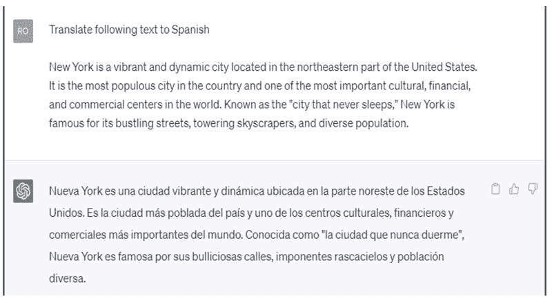

10

# 使用 ChatGPT 作为兼职语言翻译服务

由于企业和个人在我们日益全球化的世界中寻求弥合沟通障碍，语言翻译服务需求量很大。

在本章中，我们将探讨语言翻译作为兼职工作，ChatGPT 如何协助翻译任务，如何找到客户和推广服务，以及最大化收入潜力的建议。

# 语言翻译服务作为兼职

作为自由职业翻译者，你将把一种语言的书面内容转换为另一种语言，同时保持原意和语境。翻译服务在各行各业都需要，包括：

+   法律文件

+   医疗记录

+   营销材料

+   技术手册

+   网站和博客

这种兼职工作非常适合精通两种或两种以上语言并具有较强书面沟通能力的个人。

语言翻译服务可以赚取多少？

作为兼职语言翻译服务的收入可能会根据语言对、行业专长、专业水平和文件复杂性而有显著差异。以下是不同类型翻译在兼职工作中的潜在收入一般分布。

1.  法律文件：作为兼职翻译法律文件通常需要高水平的专业知识和法律术语的了解。你可以预期每字收费在$0.10 至$0.25 之间，随着经验的积累可能会有更高的收入。

1.  医疗记录：作为兼职工作，医疗翻译需要专业知识，可能会很赚钱。收费根据文件复杂性和你的经验在每字$0.10 至$0.25 之间变化。

1.  营销材料：作为兼职翻译营销材料通常需要创造力和对目标受众文化的理解。营销翻译的收费一般在每字$0.08 至$0.20 之间。

1.  技术手册：作为兼职翻译技术手册通常涉及复杂术语和对主题的深刻理解。收费根据行业和所需专业水平在每字$0.10 至$0.25 之间变化。

1.  网站和博客：作为兼职翻译网站内容可能不需要太专业，但仍需要较强的语言能力和文化理解。网站和博客翻译的收费一般在每字$0.05 至$0.15 之间。

请记住这些收费是大致的，可能会根据你的地点、经验和具体项目要求而有所不同。此外，一些翻译者收取按小时费率或项目费用，而不是按每字收费。随着经验的积累和在工作中建立良好声誉，你可能会为翻译服务赚取更多。

# ChatGPT 如何协助翻译任务

ChatGPT 对自由职业翻译者来说是一种宝贵的工具。它可以帮助你处理：

+   起草翻译：使用 ChatGPT 生成文本的初始翻译，然后进行审查和修改，以确保准确性和适当的上下文。

+   校对：ChatGPT 可以帮助您识别翻译中的语法错误、不一致或笨拙的短语，确保最终产品精益求精。

+   研究辅助：ChatGPT 可以提供有关特定术语、短语或文化参考的背景信息和上下文，帮助您产生更准确和恰当的翻译。

+   语言辅助：ChatGPT 支持多种语言，对于与各种语言配对工作的翻译人员来说是一个有用的工具。

# ChatGPT 的应用

使用以下提示将英文文本翻译成西班牙文：

# 语言翻译服务提示

1.  在语言翻译服务行业取得成功所需的关键技能和素质是什么？

1.  讨论在提供语言翻译服务时文化意识和敏感性的重要性。

1.  解释翻译、本地化和创意翻译之间的区别，以及如何确定哪种服务最适合特定项目。

1.  描述创建强大作品集的过程，以展示您的翻译技能并吸引潜在客户。

1.  在翻译领域如何保持与语言趋势、行业新闻和最佳实践的最新信息？

1.  自由职业翻译人员面临的一些常见挑战是什么，如何克服它们？

1.  讨论翻译软件和工具在翻译过程中的作用，以及如何在人类专业知识和技术辅助之间取得平衡。

1.  在处理多个翻译项目和截止日期时，如何有效管理您的时间和工作量？

1.  什么策略可以帮助您建立一个强大的客户和翻译伙伴网络，以支持您的兼职工作？

1.  提供与客户谈判费率和合同的技巧，以确保翻译服务的公平报酬和明确期望。

# 如何找到客户并推广您的服务

要找到客户并推广您的翻译服务，请按照以下步骤进行。

+   创建专业档案：在 Upwork、Freelancer 或 ProZ 等自由职业平台上开发档案，突出您的语言技能、翻译经验和专业领域。

+   网络：加入与翻译和您的语言配对相关的在线论坛、社交媒体群组和 LinkedIn 社区，与潜在客户和同行专业人士建立联系。

+   提供一种利基服务：专注于特定行业或类型的翻译（例如法律、医学、技术），以区别于竞争对手并吸引有特定需求的客户。

+   建立作品集：创建翻译作品样本的作品集，展示您的技能并向潜在客户展示您的专业知识。

+   利用现有关系：联系个人和专业网络，让他们知道你提供翻译服务，并寻求推荐。

# 最大化收入潜力的提示

要充分利用您的翻译兼职，考虑以下建议。

+   发展专业技能：投资学习专业技能，如法律或医学翻译，以增加对客户的价值并获得更高的费率。

+   提高语言能力：通过正规教育、沉浸式体验或自学不断提升语言技能，以提供更高质量的翻译。

+   设定明确界限：建立您的工作时间和可用性，以保持健康的工作与生活平衡，同时管理您的兼职。

+   寻找长期客户：努力与客户建立长期关系，因为持续的工作可以带来增加的收入和兼职的稳定性。

+   持续改进：定期向客户和其他翻译人员寻求反馈，找出改进的空间，提升翻译技能。

语言翻译服务对于具有强大语言能力和希望弥合沟通障碍的人来说，可以成为一项有益且有利可图的兼职。任何人都可以借助 ChatGPT 将自己的语言技能转化为有利可图的兼职。您可以通过遵循本书中概述的提示和策略，在翻译行业或其他前十大兼职中建立成功的兼职业务。
