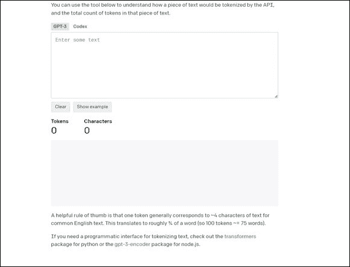

# （一）

> ChatGPT™ For Dummies^®
> 
> 出版：John Wiley & Sons, Inc., 111 River Street, Hoboken, NJ 07030-5774, [`www.wiley.com`](http://www.wiley.com)
> 
> 版权 © 2023 John Wiley & Sons, Inc., Hoboken, New Jersey
> 
> 在加拿大同时出版
> 
> 未经出版商事先书面许可，本出版物的任何部分均不得以任何形式或任何方式，包括电子、机械、复印、录音、扫描或其他方式，复制、存储或传输，除非在 1976 年美国版权法第 107 或 108 条款下允许。有关许可的请求应提交给出版商的权限部门，John Wiley & Sons, Inc., 111 River Street, Hoboken, NJ 07030, (201) 748-6011, 传真 (201) 748-6008，或在线访问 [`http://www.wiley.com/go/permissions`](http://www.wiley.com/go/permissions)。
> 
> 商标：Wiley、For Dummies、Dummies Man logo、Dummies.com、Making Everything Easier 和相关商业外观是 John Wiley & Sons, Inc. 的商标或注册商标，未经书面许可不得使用。ChatGPT 是 OPENAI OPCO, LLC 的商标。所有其他商标均为其各自所有者的财产。John Wiley & Sons, Inc. 与本书中提到的任何产品或供应商无关。
> 
> 责任限制/免责声明：尽管出版商和作者已尽最大努力准备本作品，但他们对本作品内容的准确性或完整性不作任何陈述或保证，并明确否认所有保证，包括但不限于对适销性或特定用途的任何暗示保证。销售代表、书面销售材料或本作品的促销声明不得创造或延伸任何保证。本作品中提及的组织、网站或产品作为引用和/或进一步信息来源，并不意味着出版商和作者认可该组织、网站或产品可能提供的信息或服务，或其可能提出的建议。购买本作品时应理解出版商不从事提供专业服务。本书中包含的建议和策略可能不适合您的情况。在适当的情况下，您应当咨询专家。此外，读者应该意识到，本作品中列出的网站在本作品编写和阅读之间可能已经发生变化或消失。出版商和作者对任何利润损失或其他商业损害，包括但不限于特别、偶然、后果性或其他损害，概不负责。
> 
> 如需有关我们其他产品和服务的一般信息，请在美国境内联系我们的客户服务部门，电话为 877-762-2974，在美国境外联系 317-572-3993，或传真至 317-572-4002。如需技术支持，请访问[`https://hub.wiley.com/community/support/dummies`](https://hub.wiley.com/community/support/dummies)。
> 
> Wiley 以各种印刷和电子格式出版书籍，并通过按需印刷。本书标准印刷版本中包含的一些材料可能不包含在电子书或按需印刷中。如果本书提到的媒体（如 CD 或 DVD）未包含在您购买的版本中，您可以在[`http://booksupport.wiley.com`](http://booksupport.wiley.com)下载这些材料。有关 Wiley 产品的更多信息，请访问[`www.wiley.com`](http://www.wiley.com)。
> 
> 美国国会图书馆控制号：2023937594
> 
> ISBN 978-1-394-20463-2（平装书）；ISBN 978-1-394-20464-9（电子书）；ISBN 978-1-394-20465-6（电子书）

ChatGPT™ For Dummies®

要查看本书的速查表，只需访问[www.dummies.com](http://www.dummies.com)并在搜索框中搜索“ChatGPT For Dummies 速查表”。

目录

1.  封面

1.  封面页

1.  版权

1.  介绍

    1.  关于本书

    1.  愚蠢的假设

    1.  本书中使用的图标

    1.  书后内容

    1.  下一步去哪里

1.  第一章：ChatGPT 简介

    1.  设置账户

    1.  比较 ChatGPT、搜索引擎和分析工具

    1.  了解 ChatGPT 的优势和不足

    1.  用 ChatGPT 和 ChatGPT Plus 重新定义聊天机器人

    1.  抢占头条和颠覆业务

    1.  为更大的 AI 产品打开大门

1.  第二章：了解 ChatGPT 的工作原理

    1.  ChatGPT 的独特之处

    1.  窥探 ChatGPT 架构

    1.  增加版本和集成的数量

    1.  基于 ChatGPT 构建新业务

1.  第三章：为 ChatGPT 编写提示

    1.  提示基础知识

    1.  理解提示工程

    1.  绕过令牌限制和用户历史存储问题

    1.  思考线程

    1.  链接提示和其他技巧与策略

1.  第四章：了解 ChatGPT 中的 GPT 模型

    1.  总结模型进展

    1.  将 GPT-4 与早期 ChatGPT 模型进行比较

    1.  选择 ChatGPT 模型

    1.  了解 GPT-4 的进展

    1.  适应 GPT-4 的局限性

1.  第五章：警告、伦理和负责任的人工智能

    1.  制定负责任的人工智能

    1.  听取 OpenAI 的警告

    1.  考虑版权和知识产权保护

    1.  寻找可预测性

    1.  减轻风险和责任

1.  第六章：探索 ChatGPT 在专业和其他用途中的应用

    1.  在软件中找到 ChatGPT 的嵌入

    1.  使用 ChatGPT 和 Copilot X 进行编码

    1.  了解在营销中使用 ChatGPT 的地方

    1.  为 HR 检索智能答案

    1.  在法律领域利用 ChatGPT

    1.  新闻报道中的讲故事

    1.  在医疗保健中咨询 ChatGPT

    1.  在金融领域利用 ChatGPT

1.  第七章：在教育中使用 ChatGPT

    1.  将批判性思维转变为新的学习模式

    1.  利用 ChatGPT 帮助过度工作的教育工作者

    1.  改变教学主题的方式

    1.  禁止 ChatGPT 会扼杀教育

1.  第八章：在日常生活中使用 ChatGPT

    1.  关键词的消失

    1.  从信息搜索转向知识助手

    1.  应对错误信息和操纵

    1.  缩小选项

1.  第九章：认识 ChatGPT 和生成式人工智能将如何改变世界的方式

    1.  理解真正关注的事物和不关注的事物

    1.  衡量 ChatGPT 中的优缺点

    1.  权衡工作威胁和其他 ChatGPT 责任

    1.  预测未来的中断

1.  第十章：尝试其他十种生成式人工智能工具

    1.  DALL-E 和 DALL-E 2

    1.  DeepL Write 和 DeepL Translator

    1.  Cedille

    1.  Notion AI

    1.  YouChat

    1.  ChatSonic

    1.  坡伊

    1.  贾斯珀

    1.  耐用的

    1.  上帝模式

1.  索引

1.  关于作者

1.  广告页面

1.  与新手连接

1.  最终用户许可协议

插图目录

1.  第二章

    1.  图 1-1：点击这里查看 ChatGPT。

    1.  图 1-2：OpenAI 网站上关于 ChatGPT 数据收集的披露。

1.  第二章

    1.  图 2-1：将 ChatGPT 作为免费研究模型发布的主要原因是...

    1.  图 2-2：OpenAI 训练 ChatGPT 模型的过程。

    1.  图 2-3：ChatGPT 理解并使用人类和计算机语言进行交流...

    1.  图 2-4：OpenAI CEO Sam Altman 对 ChatGPT 可靠性的推文。

    1.  图 2-5：Microsoft Bing 与 ChatGPT 集成。

    1.  图 2-6：GitHub 上 Visual ChatGPT 的演示部分。

    1.  图 2-7：Ghostwriter ChatGPT 插件。

1.  第三章

    1.  图 3-1：免费研究预览版本的 ChatGPT 屏幕。

    1.  图 3-2：ChatGPT 对商业计划的一般概述。

    1.  图 3-3：ChatGPT 作为一组医生进行回应。

    1.  图 3-4：ChatGPT 用户界面。

    1.  图 3-5：在最终授权之前出现的警告屏幕...

    1.  图 3-6：ChatGPT 告诉您如何总结先前的聊天以保持其...

    1.  图 3-7：OpenAI 的 Tokenizer 工具，用于理解 API 如何分解单词...

1.  第四章

    1.  图 4-1：ChatGPT Plus 用户的模型选项和其他选择。

    1.  图 4-2：您可以选择在聊天中使用的 GPT 模型。

    1.  图 4-3：GPT-4 在学术和专业考试中的排名。

    1.  图 4-4：使用传统基准比较 ChatGPT 模型...

1.  第五章

    1.  图 5-1：ChatGPT-4 在提示后列出其使用警告。

    1.  图 5-2：ChatGPT 在各个类别中的性能得分。

    1.  图 5-3: ChatGPT Plus（基于 GPT-4 模型构建的高级版本）对用户提出问题的回应。

    1.  图 5-4: OpenAI CEO Sam Altman 发布的关于 ChatGPT 数据泄露的推文。

1.  第六章

    1.  图 6-1: 输入您的提示和 PDF，继续使用 ChatPDF。

    1.  图 6-2: ChatGPT 是 HubSpot 的另一种用户界面。

    1.  图 6-3: Q-Chat 是一个使用 ChatGPT 和 Quizlet 巨大教育资源的 AI 导师。

    1.  图 6-4: 一家专门为高度定制 ChatGPT 系统集成的公司。

    1.  图 6-5: 集成的 Zapier 插件为 ChatGPT 用户提供了自定义功能。

    1.  图 6-6: OpenAI ChatGPT 浏览插件演示。

    1.  图 6-7: 插件 Alpha 自动发现和安装插件的过程。

    1.  图 6-8: 红虾广告文案，ChatGPT 想象莎士比亚可能会写的样子。

    1.  图 6-9: 用于 Word 的 Ghostwriter 插件。

    1.  图 6-10: Microsoft Store 中基于 ChatGPT 的应用程序。

    1.  图 6-11: 必应和 ChatGPT 浏览器页面。

    1.  图 6-12: Google Chrome 浏览器中的巴德。

    1.  图 6-13: 为 Google 设计的 Firefox 浏览器扩展 ChatGPT。

    1.  图 6-14: Copilot X 添加了 ChatGPT 用于新的编码功能。

1.  第七章

    1.  图 7-1: 这里的提示是一个基本查询，从中得到一个通用答案。

    1.  图 7-2: 这个提示更具策略性，要求 ChatGPT 提供多个答案。

    1.  图 7-3: ChatGPT 撰写教案。

    1.  图 7-4: ChatGPT 帮助老师向学生展示他们在尝试中的错误。

    1.  图 7-5: 当前安装的插件菜单和 Plugin 的路径。

    1.  图 7-6: Duolingo Max 的 Explain My Answer 与 ChatGPT 在手机上的聊天。

    1.  图 7-7: Duolingo Max 角色扮演与 ChatGPT 的对话。

1.  第八章

    1.  图 8-1: WolframAlpha 用户界面，具有使其访问 ChatGPT 的选项。

    1.  图 8-2: 谷歌助手提供搜索结果与 ChatGPT 的对比。

1.  第十章

    1.  图 10-1: DALL-E 主屏幕。

    1.  图 10-2: 使用 DALL-E 扩展《戴珍珠耳环的少女》。

    1.  图 10-3: DeepL Write 等待您输入文本。

    1.  图 10-4: 访问 Cedille 的免费版本。

    1.  图 10-5: Cedille 免费写作提示页面。

    1.  图 10-6: 下拉菜单让您快速编辑 Notion AI 的回复。

    1.  图 10-7: YouChat 和 ChatGPT 以类似的方式提示。

    1.  图 10-8: You.com AI 选项，用于聊天、编码、写作和创建图像...

    1.  图 10-9: ChatSonic 在设置和使用过程中都可以自定义。

    1.  图 10-10: ChatSonic 的提示页面。

    1.  图 10-11: 支持 Poe 的 AI 聊天机器人、AI 模型以及用于创建机器人的工具...

    1.  图 10-12: 您可以使用现有的 AI 模型创建自己的聊天机器人...

    1.  图 10-13: Jasper 和 JasperChat 设计用于营销和广告...

    1.  图 10-14: Durable 在不到 30 秒的时间内为我的虚构公司制作了一个网站...

    1.  图 10-15: 哇！Durable 甚至为网站编造了一些客户推荐的评论...

    1.  图 10-16: 给 God Mode 一个任务，它可能会建议提示或限定条件...

    1.  图 10-17: God Mode 是一个 AI 代理，旨在解决...

介绍

> 很容易将 ChatGPT 视为一次性现象或炙手可热的新趋势，因为它突然而轰动地出现在公众视野中。但这项技术是巨大和永久变革的前兆。无论最终成功与否，ChatGPT 正在改变我们工作、玩耍、生活和与周围世界互动的方式。它也为人工智能的进步铺平了道路，使其成为人类体验中的永久组成部分和影响者。
> 
> ChatGPT 正在快速发展，使任何人都难以理解和跟上其快速进展。本书旨在帮助您了解其工作原理以及如何使用它。是的，ChatGPT 在本书出版后将继续发展，但您仍将具备对这项技术的工作知识，您可以在继续学习的同时建立在此基础上。此外，您将拥有能够帮助您适应和使用其他人工智能模型的技能，其中一些不可避免地会随着时间的推移变得更加先进。
> 
> 如果你对人工智能总体或特别是 ChatGPT 感到不安，那么知道你的直觉反应是普遍的，而且并非毫无根据。这项技术肯定会改变工作的性质以及你的工作方式。但也要知道，人工智能不会夺走大多数人的工作。擅长使用人工智能的人会。成为那个人吧！
> 
> 你可以学会这个。这并不像你想象的那么难！

关于本书

> 尽管你可以在 YouTube、博客、文章、社交媒体等地方找到大量关于 ChatGPT 的内容，但这本书是关于这个话题的第一本，如果不是第一本，尤其是在初学者或入门级别。毫无疑问。除了一小部分人工智能科学家外，当涉及到 ChatGPT 时，每个人都是初学者。放心，你正在与全球数百万其他人一起学习。
> 
> 如果你已经在尝试或使用 ChatGPT，你会在本书中找到几种方法，利用你已经掌握的知识以及新的内容，以便在努力中获得更多 ChatGPT 的价值。
> 
> 请注意，关于 ChatGPT 的讨论包括解释和提及支撑 ChatGPT 的 GPT 模型，但这些模型也被用作除了这个聊天机器人之外的应用的人工智能模型。
> 
> 对于类似 ChatGPT 的模型的引用可能意味着它们在技术上与 ChatGPT 相似，也可能不相似。例如，竞争模型可能或可能不以大型语言模型（LLMs）为基础，就像 ChatGPT 一样，但它们仍然被称为“相似”，因为它们的用户界面和功能与 ChatGPT 非常相似。通过这种方式，你可以更容易地比较和理解市场上各种生成式人工智能聊天机器人，而不必深陷技术细节。
> 
> 一些网址会跨越两行文字。如果你正在阅读这本书的印刷版并想访问其中一个网页，只需按照文本中的方式输入地址，假装不存在换行。如果你正在阅读电子书，那就更简单了；只需点击网址即可直接访问网页。

愚蠢的假设

> 本书适用于任何希望了解并在工作和日常生活中使用 ChatGPT 的人，以及为 ChatGPT 将引入的不可避免的变化做准备的人。
> 
> 为了实际操作的目的，我对本书的受众做出了一些假设。例如，我假设你对 ChatGPT 没有理解或只有有限的理解。我还假设你至少具有基本的与计算设备、浏览器和 Web 应用程序一起工作的舒适和技能水平。最后，我还假设，就像每一本 Dummies 书籍一样，你是聪明的，时间紧迫，因此希望在快速简便的阅读中得到所有实质内容而没有废话。我希望我已经达到了你的期望。

本书中使用的图标

> 有时你会在本书的页边看到一些符号。它们的目的是指引你找到沿途重要的信息。以下是这些符号的含义：
> 
> >  这个图标突出显示了成功理解或使用 ChatGPT 中特别重要的信息。
> > 
> >  这个图标警告你可能直到为时已晚才会意识到的绊脚石或危险。请仔细注意警告。
> > 
> 超越本书
> 
> > 除了你现在正在阅读的印刷版或电子书中的内容外，这个产品还附带一个随时访问的速查表。要查看速查表，请访问[`www.dummies.com`](https://www.dummies.com/)，在搜索框中输入 ChatGPT For Dummies 速查表。你将找到有用的用户提示，关于在各种形式中访问 ChatGPT 的信息，有关写作提示的指针，以及关于如何使其按照你需要的方式精确地输出所需结果的一些建议。
> > 
> 下一步该去哪里
> 
> > 这是一本参考书，所以除非你想更详细地了解 ChatGPT，否则不必从头到尾阅读。也可以随意按任何顺序阅读章节。每一章都是独立设计的，这意味着你不必了解之前章节的内容就能理解你正在阅读的章节。随时开始，直到你觉得已经获得了完成手头任务所需的所有信息为止。
> > 
> > 然而，如果你的目标是快速上手并使用 ChatGPT，你应该阅读第三章，该章节是关于写作提示的，以指导你完成整个过程。务必还要阅读第五章，在那里你将被警告在开始使用 ChatGPT 之前绝对需要了解的几个问题。
> > 
> > 第二章向你展示了 ChatGPT 的工作原理，这让你在输入提示后更深入地了解它的运作。而且，如果你担心人工智能会取代你的工作或者它会如何影响你的私人生活，在第六章和第八章中对大多数人来说有好消息。
> > 
> > 随时打开 ChatGPT，并随着学习本书中的每一项新知识进行实验。许多人发现这样跟着学习很容易。但无论你选择如何学习和实验 ChatGPT，你很可能会很快掌握。这就是这类人工智能的美妙之处——非常易于使用。最困难的部分是拓展自己的想象力，让自己在每个新项目中走得更远。

第一章

介绍 ChatGPT

> 在本章中
> 
>  尝试 ChatGPT
> 
>  比较 ChatGPT 和搜索引擎
> 
>  理解 ChatGPT
> 
>  选择 ChatGPT 和 ChatGPT Plus 之间
> 
>  理解 ChatGPT 是深刻变革的先兆
> 
>  克服 ChatGPT 引发的恐惧
> 
> ChatGPT 是一个巨大的现象，是技术进步加速前进的重大范式转变。它是一个大型语言模型（LLM），属于一类称为生成式 AI 的人工智能，可以生成新内容而不仅仅是分析现有数据。此外，任何人都可以用自己的话语与 ChatGPT 互动。自然、类似人类的对话随之而来。
> 
> 在本章中，您将了解如何访问 ChatGPT，为什么应该使用它，使用它的利弊，以及常见的担忧是否合理或完全不切实际。
> 
> 用户通常直接在[`https://chat.openai.com/`](https://chat.openai.com/)上访问 ChatGPT，但它也正在与几个现有应用程序集成，如微软 Office 应用程序（Word、Excel 和 PowerPoint）和必应搜索引擎。随着现有软件提供商急于利用 ChatGPT 的流行度，应用集成的数量似乎每天都在增加。

设置账户

> 设置账户并输入第一个提示的一种方法是简单地执行以下操作：
> 
1.  > 前往[`https://openai.com/blog/chatgpt`](https://openai.com/blog/chatgpt)。
1.  > 
    > 返回用户可以直接转到[`https://chat.openai.com/`](https://chat.openai.com/)，跳过其余步骤。

1.  点击“尝试 ChatGPT”按钮，如图 1-1 所示。

    > 
    > 
    > 图 1-1: 点击这里查看 ChatGPT。
    > 
1.  > 按照提示创建您的 OpenAI 账户。
1.  > 
    > 注册 OpenAI 账户后，您可以选择免费的 ChatGPT 账户，或者选择每月$20 的高级 ChatGPT Plus 订阅。拥有 OpenAI 账户还可以访问其他 OpenAI 模型，如 DALL-E 和 DALL-E 2。
    > 
1.  > 当 ChatGPT 打开时，在提示栏中输入您的提示（问题或命令）。
1.  > 
    > ChatGPT 生成一个响应。

1.  如果您想继续对话，请输入另一个提示。

1.  > 完成后，通过点击赞或踩图标对响应进行评分。
1.  > 
    > 这有助于微调 AI 模型。

1.  注销或简单地关闭浏览器窗口。

>  OpenAI 团队可以看到您在提示中输入的任何信息以及随后的整个对话。这些数据可能用于训练其他 AI 模型。请参阅图 1-2 中的披露。在使用 ChatGPT 时，请不要透露任何您想保密或保密的内容。

图 1-2: OpenAI 网站上的 ChatGPT 数据收集披露。

比较 ChatGPT、搜索引擎和分析工具

> ChatGPT 只是一个例子，尽管是最为公众熟知的，代表了生成式 AI 模型的巨大飞跃。
> 
> 以前，具有更有限 AI 功能的排名系统会对它们在庞大数据集中发现的信息进行排序和排名。您会认识到这些排名系统的例子：谷歌和必应等搜索引擎，用于在零售结账柜台打印优惠券的推荐引擎，提供“附近”目的地选项的谷歌地图等 GPS 系统，以及 Netflix 和其他流媒体服务提供的个性化电影推荐。
> 
> 排名系统通过对大量信息进行优先排序而塑造我们的思维和功能。例如，谷歌搜索引擎会对用户输入的关键词进行排名并返回结果。一般来说，用户不会查看超过前三到五个排名靠前的结果。这实际上通过限制我们摄入和考虑的信息来塑造我们的思维。公司渴望在某些关键词结果中获得排名靠前的位置，这就是为什么围绕关键词出现了一个庞大的搜索引擎优化（SEO）行业。
> 
> ChatGPT 提供统一答案的能力预计将对我们的思维和行为产生比排名系统更大程度的影响。例如，对这种单一答案选项的普遍公众看法是，ChatGPT 比任何其他来源更聪明、更少偏见，更真实。这种看法是错误的。
> 
> ChatGPT 生成新内容的能力与我们更熟悉的以前的软件程序截然不同，例如其他 AI 形式、搜索引擎、聊天机器人、高级分析甚至商业智能（BI）软件。ChatGPT 的准确性可能比更具分析性质的软件波动更大。尽管我曾看到商业智能应用程序的糟糕输出，但我从未见过一个直接撒谎或产生幻觉（令人信服但完全错误的生成回应）。但 ChatGPT 偶尔会展示它可以做到这两者。
> 
> ChatGPT 与其他 AI 软件类别不同，因为它采用对话格式。先前的聊天机器人通过从预先准备的回复中选择来回应自然语言查询，这意味着内容是预先编写的，并且通过关键词或用户问题的内容触发回复选择。ChatGPT 会对用户的提示生成自己的回复。对于不熟悉的人来说，这两种类型的聊天机器人可能看起来相同，但实际上并不相同。
> 
> 与 ChatGPT 的互动始于某人用他们的自然语言输入提示，而不是机器语言。这意味着您可以给机器发送命令或提问而不使用计算机代码。ChatGPT 会用您使用的相同语言进行回应。随着您与其的互动进行，它会继续建立对话。这种分线互动呈现为实时对话，营造出对话或对您请求的高度智能回应的外观。
> 
> 然而，在单次对话中您可以获得的 ChatGPT 回应数量可能需要受限制，以防止这种人工智能模型提供奇怪的回应、出错或变得冒犯。为了防止这种行为，微软在 Bing 中限制了每个用户对话的 ChatGPT 回应次数为五次。您可以自由开始另一次对话，但当前交流不能超过上限。
> 
>  ChatGPT 生成而不是复述内容，这意味着它可能会做出错误的假设、撒谎和产生幻觉。ChatGPT 或任何其他生成式人工智能模型都不是一个绝对的真相来源、一个可信的叙述者或任何主题的权威，即使您要求它表现得像一个。在某些情况下，将其接受为神谕或真理的唯一来源是一个严重的错误。

理解 ChatGPT 是什么以及不是什么

> 能够产生与人类交流相近的内容的能力主要导致了常被称为毛骨悚然的那种刺痛感。ChatGPT 听起来和行动几乎太像人类了。
> 
> 用户与 ChatGPT 之间的互动感觉与先前使用其他软件的体验不同。首先，使用早期自然语言处理的软件通常局限于短暂的交流和预定的回应。ChatGPT 可以生成自己的内容并持续对话更长时间。
> 
> ChatGPT，像所有机器学习（ML）和深度学习（DL）模型一样，“学习”是通过暴露于庞大训练数据集中的模式，然后用这些模式识别这些和其他数据集中类似的模式。ChatGPT 不像人类那样思考或学习。相反，它根据其模式识别能力理解和行动。
> 
> 截至目前，ChatGPT 支持 95 种语言。它还了解几种编程语言，如 Python 和 JavaScript。生成式人工智能也不同于编程软件，因为它可以考虑自然语言提示中的上下文和内容。
> 
> ChatGPT 的名称中的“Chat”是指其使用自然语言处理和自然语言生成。GPT 代表生成式预训练变换器，这是由 OpenAI 开发的深度学习神经网络模型，OpenAI 是一家美国人工智能研究和开发公司。您可以将 GPT 视为使 ChatGPT 像它所做的那样工作的秘密武器。
> 
>  ChatGPT 不像人类那样思考。它根据学习到的模式进行预测，并根据其知情猜测和对首选或可接受词序的预测做出回应。这就是为什么它生成的内容可能非常出色或非常错误。当 ChatGPT 正确时，其魔力来自于其预测的准确性。有时 ChatGPT 的数字水晶球是正确的，有时不是。有时它传递真相，有时它喷出更糟糕的东西。
> 
> 解开 ChatGPT 的恐惧
> 
> 或许没有其他技术像生成式人工智能一样引人入胜和令人不安。当 ChatGPT 推出后的两个月内，有 1 亿月活跃用户下载了免费的研究预览版本，情绪达到了高潮。你可以感谢科幻作家和你自己的想象力，因为 ChatGPT 现在激活了你脑中引人入胜和令人恐惧的触发器。
> 
> 但这并不意味着没有合理的谨慎和担忧的理由。针对生成式人工智能程序侵犯版权和其他知识产权的诉讼已经发起。OpenAI 和其他人工智能公司及合作伙伴被指控未经许可或支付非法使用受版权保护的照片、文本和其他知识产权来训练他们的人工智能模型。这些指控通常源于版权内容被卷入互联网抓取以创建大规模训练数据集。
> 
> 一般来说，法律辩护团队正在就在人工智能时代这类指控的不可避免性和不可持续性进行辩论，并要求撤销指控。关于谁拥有 ChatGPT 及其同类生成的内容的诉讼潜伏在未来的某个地方。然而，美国版权局已经裁定，由人工智能生成的内容，无论是文字、图像还是音乐，都不受版权法保护。至少目前，在美国，政府不会保护由人工智能生成的任何内容的权利、许可或支付。
> 
> 与此同时，对其他类型潜在责任的现实担忧存在。ChatGPT 及其同类有时会向用户和其他机器提供错误信息。当事情出错时，特别是在威胁生命的情况下，谁应该承担责任？即使一个企业的底线受到威胁，而不是某人的生命，风险仍然很高，结果可能是灾难性的。不可避免地，某人将遭受损失，很可能某个人或组织最终将为此负责。
> 
> 早期关注点的放大包括数据隐私、偏见、人工智能行为对个人和群体的不公平对待、身份盗窃、深度伪造、安全问题以及现实冷漠，即公众无法分辨真实与虚假，认为整理这一切的努力太难以追求。
> 
> 简而言之，ChatGPT 加速并加剧了当前由寻求建立旨在确保负责任人工智能的防护栏的组织和政府正在研究、追求和制定的规则和标准的需求。重要问题是，鉴于 ChatGPT 在全球范围内的快速采用率，它们是否能及时成功。
> 
> 制定指导方针、伦理准则、标准和负责任的人工智能框架的组织和政府包括以下：

+   ACM 美国技术委员会人工智能与算法小组委员会

+   世界经济论坛

+   英国数据伦理中心

+   政府机构和努力，如美国人工智能权利法案和欧洲联盟欧洲理事会的人工智能法案。

+   IEEE 及其 7000 系列标准

+   诸如纽约大学斯特恩商学院等大学

+   私营部门，在这里公司制定自己的负责任的人工智能政策和基金会

> 至于公众舆论，似乎有两种思路在起作用。第一种是支持 ChatGPT 的全面民主化，这基本上就是现在正在发生的，因为 OpenAI 让用户通过任意使用来参与训练模型。第二种是呼吁对 ChatGPT 和其他生成式人工智能的使用进行监管，以遏制犯罪、诈骗、网络攻击、欺凌和其他利用这些工具实施或扩大的恶意行为。
> 
> ChatGPT 是一个非常有用的工具，充满了许多承诺和潜力，可以为个人、社会、政府和组织做很多好事。事实上，我认为这是人类增强的第一步。虽然 ChatGPT 没有整合到人体中，但它可以用来增强人类的思维、理解、工作和创造力。
> 
> 与 ChatGPT 竞争你的工作
> 
> 目前，人们对 ChatGPT 感到恐惧的很大程度上是由于未知因素更加接近家庭。ChatGPT 会拿走我的工作吗？传播虚假信息或宣传，导致我的政党失败或导致我的社区犯罪或抗议活动激增？它会结束我的隐私和尊严吗？最终，我能否抵抗比我更聪明的机器对我和我的职业的威胁？
> 
> 我们有这些恐惧是因为 ChatGPT 似乎太过熟悉：我们已经遇见了生成式人工智能，而它就是我们自己。
> 
> 它如此类似人类行为，因为 ChatGPT 的教育在很大程度上来自互联网，人类众所周知地在那里散布最卑劣的思想、谎言、阴谋论、宣传、犯罪活动和各种形式的仇恨。当然，也有一些真实和有用的信息。
> 
> 最好的情况下，互联网是一个充满人类垃圾的混合袋，而人工智能模型已经展现出对垃圾的偏好。你可能还记得微软在 2016 年试图在社交媒体上训练的 AI 聊天机器人 Tay。它很快在 Twitter 上失控，发布充满争议和种族主义言论的推文，充满了粗言秽语。它试图像人类一样社交的争议性和冒犯性行为导致微软在其亮相仅仅 16 小时后将其销毁。
> 
> 在那之后和类似的人工智能培训结果，因为我们知道我们人类是一群可怕的人，普遍的假设是人工智能行为和声音像我们，所以它一定同样令人恐惧，甚至可能更可怕。
> 
> 实际上，关于人类的一切错误或不好的东西往往会转移到人工智能上。但同样适用于一切正确和好的东西，以及一些既有点好又有点坏的东西。
> 
> ChatGPT 可以帮助诊断疾病并寻找治疗方法。它可以帮助学生以高度个性化的方式学习，使他们的教育更加高效和少受挫折。它可以帮助非营利组织找到筹集资金、削减成本和推动事业的新途径。潜在的 ChatGPT 贡献的好处和有帮助的例子几乎是无穷无尽的。
> 
> 尽管如此，人们普遍担心无情的机器霸主可能的到来。幸运的是，它们不会来。这种恐惧召唤的 AI 类型是通用 AI 或人工通用智能（AGI），在科学界被称为这样。它在科幻小说和人类噩梦之外不存在。它可能有一天会出现，但现在还没有。
> 
> 当然，ChatGPT 不是 AGI。它不会思考。它不聪明。它不是人类。它是一种通过在我们的言语、思维和行为中找到模式来模仿人类的软件。它根据这些模式计算概率。简而言之，它做出了知情的猜测。这些猜测可能是聪明的或明显错误的，真实而有洞察力的或狡猾的谎言。但这一切都不需要软件去思考。
> 
> 出于这些原因以及更多原因，ChatGPT 可以影响或取代一些工作，就像分析和自动化可以做的那样。但它无法完全取代所有工人，因为它无法做到人类可以做的所有事情。你仍然比 ChatGPT 具有竞争优势。
> 
> 你可能会问，你的竞争优势是什么？有很多事情：创造力和直觉智能；找到并分析数字形式不存在的数据的能力；从词语和图像对话的上下文和细微差别中获得意义的天生能力；以及在以前不存在的地方建立神经元连接的能力。连接点或跳出固有思维模式的能力将人类与机器区分开来。
> 
>  人类在写作提示中的创造力使 ChatGPT 产生独特和复杂的输出，而不是死记硬背的通用内容。一个聪明而有创造力的人让 ChatGPT 发挥出最佳表现。
> 
> 人类还独特地拥有情商和同理心，这两种强大的能力影响着人们并塑造着事件和结果。等等。
> 
> 你的大脑也非常节能。每天三餐和几个小吃可以买到很多思考能力。另一方面，像 ChatGPT 这样的深度学习模型吸收了大量的计算能力。
> 
> 威胁你工作的不是 ChatGPT，而是使用 ChatGPT 和其他 AI 工具的人。你需要学会如何使用这些工具来提高你的收入潜力和工作技能，并在使用 ChatGPT 和其他 AI 驱动的服务时保护自己。阅读这本书将让你有一个良好的开端。

重新定义 Chatbot 与 ChatGPT 和 ChatGPT Plus

> AI 助手和 AI 辅助聊天机器人已经在市场上存在一段时间了。我记得 2019 年参加微软的数据和 AI 技术沉浸式研讨会，对我在 Azure 公共云上使用虚拟助手解决方案加速器构建机器人的轻松和快速感到惊叹。当然，专业人员在场帮助，但总体来说，这是一个相对容易的练习。谷歌也有一个充满 AI 和机器人制作的工具箱。其他供应商也有。各种工具和可能性的混合令人心动和振奋。
> 
> 预构建、预训练、可定制的 AI 模型已经成为数据和 AI 民主化中不可或缺的元素。ChatGPT 将 AI 民主化推向了顶峰，并交到了公众手中。
> 
> 真正的民主化意味着几乎任何人都能理解和使用这项技术。智能手机和 GPS 应用是完全民主化技术的例子。ChatGPT 正在迅速地像野火般在全球传播。今天，学生、艺术家、医疗专业人士、法律助手、随意尝试的普通人、作家以及来自各行各业和各种规模企业的专业人士都在使用 ChatGPT。明天和以后的每一天都会有更多人使用它。这不是一个趋势；这是一个地震般的范式转变。
> 
> 人们对 ChatGPT 有这么多直觉上的了解。但 ChatGPT 如何重新定义聊天机器人可能不那么明显。毕竟，聊天机器人和数字助手如 Alexa、Siri、Google 助手和 Cortana 已经使用自然语言处理与人们聊天一段时间了。
> 
> 以前的 AI 聊天机器人存在一些限制，包括缺乏对上下文的理解、没有决策能力、所谓的对话局限于预设响应，以及由于内存问题只能进行短对话交流。
> 
> 相比之下，ChatGPT 能理解上下文，能做出决策，并能处理长对话线程以以人类方式继续更长的对话。此外，ChatGPT 的回应会随着每个提示和提示变化而改变。它不使用预设响应，这意味着它不会提供一组由特定关键词触发的有限数量的预定响应。
> 
> 在很大程度上，ChatGPT 比以前的聊天机器人具有明显优势。但有时这些特点也可能成为劣势。
> 
> 例如，微软将 ChatGPT 集成到必应中，每个用户每次会话最多只能提出 5 个问题，每天最多 50 个问题，之后搜索引擎开始肆无忌惮地侮辱、撒谎和情绪操纵用户。这种行为证明了许多人很早就学到的一点：说得越多，往往越麻烦。微软声称“在五分钟后清除对话可以防止模型混淆”。
> 
> 谷歌的 Bard，作为 ChatGPT 的 AI 竞争对手，表现也不尽人意。在一段演示视频中提供错误答案后，Bard 让公司损失了 1000 亿美元，这动摇了股市对该机器人能力的信心。
> 
> 许多人认为，像 ChatGPT 和 Bard 这样的生成式 AI 最终会取代必应和谷歌等搜索引擎。我认为这种结果不太可能发生，不仅因为生成式 AI 的缺陷，还因为搜索引擎仍然有许多好的用途。说 ChatGPT 会取代谷歌就像说电视会杀死广播或计算机会杀死纸质文件一样。世界不倾向于一边倒。
> 
> 然而，可以肯定的是，ChatGPT 及其竞争对手正在以多种方式重新定义聊天机器人，其中并非所有方式都是好的。无论如何，生成式 AI 机器人几乎无处不在，随之而来的是一连串公司的道歉，这是不可避免的失误之后。
> 
> 比较两个版本
> 
> 目前，OpenAI 提供 ChatGPT 的免费研究预览版本和名为 ChatGPT Plus（每月每用户$20）的高级版本。OpenAI 表示打算保持免费版本可用，或许作为吸引用户升级到高级版本的免费版。
> 
> 高级版本提供新功能和升级的早期访问权限，以及在高峰使用时段的优先访问和更快的响应时间。否则，这两个版本相似。
> 
> 体验其众多用途
> 
> 使用 ChatGPT 的方式就像其用户一样多样化。大多数人倾向于更基础的请求，比如创作诗歌、文章或短篇营销内容。学生们经常使用它来完成作业。注意，孩子们：ChatGPT 在回答谜语和有时数学中的问题时表现不佳。有时候，它只是凭空捏造。
> 
> 一般来说，人们倾向于使用 ChatGPT 来指导或解释某事，就好像这个机器人是一个更高级版本的搜索引擎。这种用法没有错，但 ChatGPT 可以做得更多。
> 
> 要看它能做多少，取决于你写提示的好坏。如果你写一个基础提示，你会得到一个极简单的答案，你本可以在谷歌或必应等搜索引擎中找到。这是人们在使用几次后放弃 ChatGPT 的最常见原因。他们错误地认为它没有新的东西可提供。但这种失败是用户的错，而不是 ChatGPT 的错。
> 
> 你可以在第三章中了解写提示的复杂性。现在，看看以下列出的一些这项技术更独特用途的列表。用户曾要求 ChatGPT

+   与一位长逝的传奇人物就当代话题发表意见进行采访。

+   为标志、时尚设计和室内装饰设计推荐颜色和颜色组合。

+   创作原创作品，如文章、电子书和广告文案。

+   预测商业场景的结果。

+   基于股市历史和当前经济状况制定投资策略。

+   根据患者的真实测试结果进行诊断。

+   编写计算机代码，从零开始制作新的电脑游戏。

+   利用销售线索。

+   激发各种事物的想法，从 A/B 测试到播客、网络研讨会和完整的电影。

+   检查计算机代码中的错误。

+   将法律文件、合同和其他形式的术语总结为简单易懂的语言。

+   将协议条款计算为总成本。

+   教授一项技能或获取复杂任务的说明。

+   在实施决策之前找到逻辑错误。

+   撰写个人简介和简历。

+   制定营销策略。

+   制作一部电影。

+   制定一项战略。

+   管理客户服务。

+   制定公司政策。

+   撰写教案。

+   撰写一份商业计划。

+   撰写一篇演讲。

+   策划一个派对。

+   提出娱乐建议。

+   在成千上万的临床研究中寻找潜在的治疗方法和疗法。

+   制定政治竞选策略。

> ChatGPT 的优缺点
> 
> 像所有技术一样，ChatGPT 既有优点也有缺点需要考虑。然而，与许多其他技术不同，ChatGPT 是独特的。由于其性质和新颖性，它也有一些小问题。如果你利用好它的优点并计划如何弥补缺点，你的项目就会一切顺利！

|

> 优点

|

> 缺点

|

|

> 快速响应

|

> 有时不准确

|

|

> 提供统一答案

|

> 质量不一

|

|

> 对话式的

|

> 有时会冒犯

|

|

> 广泛的能力范围

|

> 即使错误也能说服他人

|

|

> 许多应用

|

> 对话不是私密的

|

|

> 生成创意内容

|

> 目前尚未受到美国版权法的保护

|

> ChatGPT 的创造力备受关注。但这种创造力是人类提示的反映和结果。如果你能想到，你可能会让 ChatGPT 配合。
> 
> 不幸的是，这也适用于坏人。例如，他们可以提示 ChatGPT 查找计算机代码或计算机系统中的漏洞；通过以您的风格、语调和词汇选择编写文件来窃取您的身份；或编辑音频剪辑或视频剪辑来欺骗您的生物识别安全措施或让其说出您实际没有说的话。只有他们的想象力限制了对危害和混乱的可能性。
> 
> 探索其他形式的 GPT
> 
> ChatGPT 是建立在 OpenAI 的 GPT-3 系列大型语言模型上的，经过人类和强化学习的微调，并经过训练以执行对话任务。现在它正在运行在 GPT-4 上。GPT-5 在未来，但目前尚未进行训练。
> 
> OpenAI 使用您输入的提示数据作为持续改进 ChatGPT 的一部分。这就是为什么您永远不应该认为您在 ChatGPT 的免费或高级版本中所做的工作是私密的。
> 
> GPT-3 和 GPT-4 是通用的人工智能模型，适用于各种与语言相关的任务。ChatGPT 是一个聊天机器人，可以在任一模型上运行，它比 GPT-3 和 GPT-4 在对话任务中更小、更准确和更快。然而，GPT-3 和 GPT-4 都能够执行比 ChatGPT 所做的与好奇的人进行对话更多的操作。
> 
> OpenAI 的旧 GPT-3 模型命名为达芬奇、居里、巴贝奇和艾达。达芬奇功能最强大，但在成本是主要考虑因素时，其他模型有时是开发人员满足特定需求的更好选择。
> 
> 更近期的模型是 Codex，它能够理解并生成计算机代码，其训练来自自然语言和从 GitHub 抓取的数十亿行代码，以及内容过滤器，它将文本分类为安全、敏感或不安全。
> 
> 内容过滤器模型旨在过滤掉用户可能认为具有冒犯性或令人担忧的内容。不幸的是，过滤器有时会失效，让一些不良内容通过，同时过度限制一些可接受或勉强可疑的内容。这种行为并不奇怪，因为内容过滤器处于测试阶段；预计随着时间的推移会有所改善。鼓励用户点击 ChatGPT 生成文本顶部的赞或踩按钮，以帮助改善内容生成的相关性、质量和可接受性。
> 
> GPT-4 于 2023 年初发布。它具有更多的推理能力，通常比 GPT-3 模型更具创造性和协作性。它也更大更稳定。其能力令人印象深刻，可以在技术写作、编程、编剧和模仿用户个人写作风格等输出中轻松看到。然而，它仍然像 GPT-3 模型一样产生幻觉。
> 
> 开发人员可以在[`https://openai.com/api/`](https://openai.com/api/)找到 API 和集成信息。

抢眼的标题和扰乱业务

> ChatGPT 让世界大吃一惊。从各方面来看，它的推出不应该引起如此大的轰动。
> 
> 模型概念并不新颖。大型语言模型可以追溯到上世纪 50 年代。最近几年，几家组织同时开发了基于这种模型的几个聊天机器人，但几乎没有引起市场的关注或期待。而且，ChatGPT 至少在最初的形式中并不一定是同类产品中最好的。此外，以前的聊天机器人类型很常见且运作良好，几乎没有市场能量去做更具创新性的事情。
> 
> 然而，ChatGPT 却在其无可争议的 AI 之巅的地位上。自其向公众介绍不到两个月以来，所有迹象都表明它被认为是如此。燃眉之急是为什么它会被如此迅速地被如此多人接受？
> 
> 学者、研究人员和学者将不得不探讨这个问题，以找到明确的答案。但更加紧迫的问题是，一个拥有超过 1 亿全球用户立即接受并每天有超过 1300 万用户使用的技术会产生什么影响？
> 
> 领悟 ChatGPT 是指数变化的先驱
> 
> 贸易出版物通常会吹嘘新技术的到来，主流媒体只会做出敷衍的表示。但主流媒体的头条新闻迅速宣布了 ChatGPT 的到来，甚至脱口秀主持人和喜剧演员也对 ChatGPT 将如何改变我们的世界发表了看法。
> 
> 有人说 ChatGPT 的到来预示着许多工作和职业的终结。还有人说它将摧毁或削弱整个行业，如媒体、法律和教育。还有人认为这是人类灭亡的开始，要么是通过抑制我们的大脑，要么是欢迎新形成的人工智能霸主的到来。
> 
> 更加积极的人指出，ChatGPT 的能力可以开启新的赚钱方式，减轻我们的劳动，加快我们的教育，激发我们的思想，解决复杂问题，节约更多时间，提高我们的生产力，并普遍扩大所有人的获取和机会。
> 
> 但尽管有许多不同的观点，共识是 ChatGPT 是指数变化的先驱，带来普遍的颠覆和创造性的破坏。
> 
> ChatGPT 确实标志着从人们普遍接受人工智能到其触及我们生活许多方面的重大范式转变。然而，生成式人工智能不太可能完全篡夺我们的现实。生活将继续，尽管有些许不同，并仍在人类控制之下。但在哪些人的控制之下呢？
> 
> 权衡对现有企业和行业的初期影响
> 
> 尽管预测生成式人工智能总体和特别是 ChatGPT 的全面影响是困难的，但我们现在可以做出一些合理的预测。主要是，ChatGPT 将对知识工作者产生最大影响——即主要从事知识的收集、分析、应用和分发的人员。
> 
> 最有可能从这项技术中早期和实质性地受益的企业和行业包括以下几个方面：

+   医学研究和发展

+   生物黑客

+   医疗保健

+   教育

+   媒体

+   市场营销和广告

+   法律

+   艺术

+   零售

+   金融服务

+   研究

+   搜索引擎

+   图书馆科学

+   出版

> 但毫无疑问，ChatGPT 及其同类将迅速在各行各业中变得无处不在。它的持续存在是不可避免的，但其对各种实体的影响强度将有所不同。
> 
> 应对未来的动荡
> 
> 借用星际迷航中博格的一句话，“抵抗是徒劳的。”换句话说，人工智能的精灵不会回到瓶子里。无论你对必然性的表达选择是什么，ChatGPT 及其竞争对手都将留下来。
> 
> 忽视它或试图禁止它最多只会导致暂时的停顿，但更有可能是创造一个生成式人工智能的地下社区。更好的建议是努力发现你可以如何在个人生活、职业、业务和行业中利用这项技术。留意表明其对经济和就业趋势的影响的指标，这样当机会出现时你就可以利用它。
> 
> 不要满足于涉猎 ChatGPT 或跟随他人如何使用它。要明白你在人工智能方面的真正优势，以及与其他使用人工智能的人的区别在于你的思考和创造能力。因此，开始思考并创造利用 ChatGPT 的新方法。特别是，将你的提示技巧发展到你能想象的最高水平，然后进一步推动你的思维。查看 第三章 以帮助激励和引导你的努力。
> 
> 接受知识就是力量。ChatGPT 可以访问大量信息，但这并不一定等同于知识。发展你的知识，使之能够以新颖独特的方式应用。
> 
> 注意观察 ChatGPT 如何随着时间塑造和重新定义任务、行动、工作和行业。相应地迅速适应。
> 
> 通过这些方式，你可以为自己和你的行业做好迎接这个新兴未来的准备。
> 
> 打破无情机器霸主的咒语
> 
> ChatGPT 呈现出一种看似简单的软件程序。你提问，它回答。乍一看似乎没有更多内容。一旦你明白它的表现取决于你自己的能力，你可能会感到有些兴奋，但也会感到压力重重。
> 
> 当你理解 ChatGPT 可能做到的事情时，你可能会感到不知所措，甚至有些受到威胁。这就是第一个可怕的幻觉所在。
> 
> 许多外行人认为，由于人类必须使用计算机代码来指挥机器，机器的性能受限于这种精确的通信结构。换句话说，人们认为机器无法理解任何不以其独特的机器语言传递给它们的内容。也没有任何机器可以执行除了特定任务之外的任何职责。换句话说：假设机器无法理解我们，因此超出其有限理解范围的任何内容都安全地超出了它们的触及范围。
> 
> 在这种情况下，语言被与智能混为一谈，但这两者并不相同。按照这种思维方式，能够理解我们语言并流利无缺地交谈的机器似乎理解了我们。而且由此延伸，这意味着没有安全的存在、思考或交谈的地方是机器无法渗透的。
> 
> 令人不安的逐渐意识到，我们在许多方面并不像我们以为的那样独特。在那之后，就会出现对比我们更聪明的机器——科幻传说中的人工智能霸主——的征服恐惧。
> 
> 但它们并不存在。它们不会到来。人工智能霸主并不存在。然而，对人工智能的不负责任使用可能会造成混乱、制造混乱并造成伤害。我们必须勤奋地为其建立防护措施，并为其道德和负责任的使用设定标准。
> 
> 让恐惧阻碍我们对人工智能的使用是错误的。它可以带来许多好处。寻找这些优势并加以利用。

为更大的人工智能产品打开大门

> 正如前面提到的，ChatGPT 只是生成式 AI 的一个例子。它也只是生成式预训练变换器-3（GPT-3）和现在的 GPT-4 的一个用途，这两个模型比 ChatGPT 更大，适用于许多不同的自然语言任务。
> 
> ChatGPT 专为对话任务设计。在某些方面，它是一个很棒的工具，但也像一个带有训练轮的第一辆自行车，因为它是对更强大的 AI 用途和形式的良好介绍。
> 
> ChatGPT 可以帮助你做很多事情。它还可以打开大门，让你可以自信地走进一个 AI 是主流的未来。
> 
> 在使用 ChatGPT 时要注意，你会发现可以在其他 AI 应用中学到的课程和技能。你可以随时返回 ChatGPT 并要求它向你解释其他 AI 应用。它可以快速教育你如何在一个与今天大不相同的未来中工作和生活。
> 
> 对生成式 AI 类型进行分类
> 
> 生成式 AI 是一种人工智能类型，可以生成任何形式的内容，包括文本、图像、音频和合成数据，这些是人工生成的数据，而不是从现实世界收集的数据。物理定律就是合成数据的一个例子。创建一个物理定律数据库可以应用规则，使另一种类型的人工创作在现实世界中发挥作用。
> 
> 其他生成式 AI 模型的示例包括 DALL-E、Midjourney 和 Stable Diffusion，它们也是最知名的图像生成器。
> 
> 有许多类型的生成式 AI 可用，但以下三种是最常见的：

+   生成对抗网络（GANs）：使用深度学习进行无监督数据发现。示例应用包括生成逼真的图像和复杂但逼真的图像编辑。

+   基于 Transformer 的模型：识别上下文、含义和模式，以预测和生成文本、语音、图像和其他内容。示例应用包括 DALL-E 和 ChatGPT。

+   变分自动编码器（VAEs）：由编码器和解码器两个不同的神经网络组成。示例应用包括安全分析、异常检测和信号处理。

> 了解 ChatGPT 的创造者 OpenAI
> 
> OpenAI 是由技术和商业领袖 Sam Altman、Elon Musk、Greg Brockman 和 Wojciech Zaremba 于 2015 年创立的，旨在开发安全和开放的 AI 工具。其中包括 GPT-1 和 GPT-2。
> 
> 2019 年，该公司转向了一个有限利润的商业模式，该模式被该组织的领导描述为“营利性和非营利性的混合体”。其大部分工作集中在 AI 研究上。2021 年，OpenAI 发布了 DALL-E，这是一个基于 GPT-2 构建的生成式 AI 模型，可以生成逼真的图像。2022 年，该公司开发并训练了 GPT-3。2022 年 11 月，基于 GPT-3 构建的 ChatGPT 发布。GPT-4 于 2023 年初发布，目前驱动着 OpenAI 模型以及更广泛的软件应用市场中的许多模型。
> 
> 现在你已经了解了 ChatGPT 的背景故事，知道了在哪里找到它，也不用害怕，你已经准备好开始作为自己 ChatGPT 体验的船长，开始一段迷人的旅程。

第二章

发现 ChatGPT 如何运作

> 本章内容
> 
>  理解提示是什么
> 
>  探索 ChatGPT 的架构
> 
>  与超级计算基准的性能比较
> 
>  理解 ChatGPT 的突破意义
> 
> 乍一看，ChatGPT 看起来简单得令人难以置信。您在提示栏中提出问题或给出命令，它会以答案回应。这就是所有聊天机器人的工作方式，对吧？那么这个有什么特别之处呢？
> 
> 在本章中，您将了解到 ChatGPT 对聊天机器人就像冰块对南极洲一样重要。您将了解它的工作原理的基础以及为什么它依赖于您的技能来优化其性能。但这里真正的宝藏是关于如何编写提示以使 ChatGPT 发挥其真正魔力的技巧和见解。
> 
> 本章为您提供了理解和使用 ChatGPT 所需的大部分信息。即使您在本书中什么都不读，也要阅读它。

ChatGPT 有何不同

> ChatGPT 与搜索引擎不同。搜索引擎如 Google 或 Bing，或者诸如 Siri、Alexa 或 Google 助手之类的 AI 助手通过在搜索栏中输入的关键字在互联网上搜索匹配项。算法根据各种因素细化结果，但您的浏览历史、主题兴趣、购买数据和位置数据通常会影响结果。
> 
> 然后，您将看到一个按照搜索引擎算法确定的相关性顺序排列的搜索结果列表。从那里，用户可以考虑每个选项的来源并点击选择，以从该来源深入了解更多细节。
> 
> 相比之下，ChatGPT 生成自己对您的提示的统一答案。它不提供引用或注明来源。您提问；它回答。简单易行，对吧？不。这对 AI 来说是极其困难的任务，这就是生成式 AI 如此令人印象深刻的原因。
> 
> 通过使用 GPT-3（生成式预训练变压器 3）或 GPT-4 模型分析上下文并预测可能跟随的单词，从而实现对提示的原始结果的生成。这两个 GPT 模型都是极其强大的大型语言模型，能够每秒处理数十亿个单词。
> 
> 简而言之，变压器使 ChatGPT 能够生成连贯、类似人类的文本作为对提示的响应。ChatGPT 通过考虑上下文并为可能跟随提示中的单词的单词分配权重（值）来创建响应，以预测哪些单词将是适当的响应。
> 
>  用户输入被称为提示，而不是命令或查询，尽管它可以采取任一形式。实际上，您正在提示 AI 预测和完成您通过输入提示启动的模式。
> 
>  能够快速创建符合用户意图和提示上下文的自然语言响应，对于机器来说是一个惊人的成就。当响应足够快，以至于 AI 模型似乎在与用户对话时，这一成就更加突出。尽管早期存在一些缺陷，GPT-3 和 GPT-4 仍然是现代奇迹。

查看 ChatGPT 架构

> 正如其名称所示，ChatGPT 是运行在 GPT 模型上的聊天机器人。GPT-3、GPT-3.5 和 GPT-4 是由 OpenAI 开发的大型语言模型（LLMs）。当 GPT-3 推出时，它是拥有 1750 亿个参数的最大 LLM。升级版 GPT-3.5 turbo 是 GPT-3 的高度优化和更稳定的版本，对开发者来说价格是原来的十分之一。ChatGPT 现在也可在 GPT-4 上使用，这是一个多模态模型，意味着它接受图像和文本输入，尽管其输出仅为文本。尽管 GPT-4 的确切参数数量尚未披露，但它是迄今为止最大的 LLM。
> 
> 参数是神经网络架构中节点和层之间的连接的权重和定义的数值。模型的参数越多，其内部表示和权重就越复杂。一般来说，更多的参数会导致在特定任务上表现更好。例如，ChatGPT 的大量参数使其能够理解各种自然语言处理任务中微妙的细微差别和上下文复杂性。因此，它似乎具有即时推理的能力，因为它能够与用户流畅对话。
> 
> 以前，微软的图灵 NLG，一个基于 transformer 的生成式语言模型，拥有 170 亿个参数的记录。GPT-4 目前是创建的最大神经网络。传言 GPT-5 更大，但目前尚未进行训练。一些 AI 专家认为没有理由训练一个更大的模型，因为 GPT-4 如此巨大，将在未来几年内发挥作用。我同意，鉴于用户和开发人员几乎没有探索 GPT-4 的潜力，没有必要急于推出 GPT-5。
> 
> 探索超级计算机和 GPU 的内部结构
> 
> 或许并不奇怪，OpenAI 和微软合作，考虑到它们各自为了相似的目标而努力。微软表示，他们与 OpenAI 合作建造了一个托管在 Azure 中的超级计算机，专供 OpenAI 使用，用于训练各种 AI 模型。根据微软的说法，与全球 Top500.org 列表上的其他超级计算机相比，这台超级计算机现在排名前五。
> 
> 超级计算机 Top500 榜单编制了关于高性能计算机的统计数据，这些数据基于制造商和其他高端用户感兴趣的项目。虽然具体特征和指标可能有所不同，这符合现代超级计算机稳定演进和多样化的特点，但每份半年报告中的基本数据似乎包括已安装系统的数量、在这些系统上运行的应用程序以及基于比较基准的性能排名。
> 
> 举例来说，这份榜单根据 LINPACK 基准测试对超级计算机的性能进行排名，具体来说，这些机器解决密集线性方程组的能力。结果是峰值性能的度量而不是整体性能。Top500 的研究人员还可以验证 LINPACK 的结果，以进一步确保排名的准确性。
> 
> 超级计算行业用于评估超级计算机性能的其他基准包括 COPA、ReCoRD 和 SuperGLUE，后者测试推理和高级自然语言处理（NLP）任务。由 OpenAI 和微软联合建造的超级计算机在这三个基准测试中表现良好，但在另外两个基准测试中表现不佳：词汇上下文（WIC）分析和 RACE（重述、回答、引用证据、解释）响应评估。
> 
> 令人意外的是，这台超级计算机在中小学考试问题（RACE 基准测试的结果）上表现不佳，而在解决密集线性方程组的 LINPACK 基准测试中表现出色。简单的事情往往会让人工智能出错，但复杂性并不是错误发生的决定因素。你不应该期望 ChatGPT 在不同复杂问题层次上表现一致。它可能在回应任何提示时出错或表现出色，无论简单还是复杂。
> 
> 无论如何，可以肯定地说，考虑到 GPT 模型的巨大规模和能力，训练任何一个都需要比大多数庞大计算巨头领域更强大的超级计算机。
> 
> Nvidia 是图形处理单元（GPU）提供商，也是这个故事中的第三方合作伙伴，他们的角色丝毫不可小觑。GPU 是一种专门设计用于快速图像渲染的电子电路，现在通常被利用其同时处理多个数据片段的能力。
> 
> 为 OpenAI 开发的 GPU 加速超级计算机是一个单一系统，拥有超过 285,000 个 CPU 核心、10,000 个 GPU 和每个 GPU 服务器 400 千兆每秒的网络连接速度。所有 OpenAI 模型都是在 NVIDIA V100 GPU 上运行的微软高带宽集群上进行训练的。
> 
> 此外，所有 OpenAI 模型的模型训练都是在 cuDNN 加速的 PyTorch 深度学习框架上进行的。但是，针对任何给定的 AI 模型，具体的架构参数是根据最佳的计算效率和跨 GPU 的负载平衡来选择的。
> 
> 考虑到变压器的重要性
> 
> ChatGPT 使用多层变压器网络来生成对用户提示的响应。变压器是一种神经网络架构。在人工智能中，神经网络是一种使用一组算法模仿人脑的处理节点网络。你可以将 AI 大脑中的节点想象成人脑中的神经元一样工作。
> 
> 不同类型的变压器可用，每种适用于特定的数据类型，如文本或图像。ChatGPT 使用适用于语言处理的变压器。
> 
> 变压器是由谷歌和多伦多大学的研究人员于 2017 年开发的，最初设计用于处理翻译，其中上下文而不是单词顺序对于传递另一种语言中的相应含义更为关键。但变压器也被证明是更复杂的语言处理任务的基石。变压器的一个重要优势是它们可以被有效地并行化，这意味着它们可以扩展到处理异常大的 AI 模型及其训练需求。
> 
> 没有变压器的出现，GPT 整体和特别是 ChatGPT 无法产生如此类似人类的输出。
> 
> 变压器及其工作原理的具体细节非常技术性。在本章中，我涉及变压器中可能最重要的一个部分：自注意机制。自注意的简短且因此过于简化的解释是一个 AI 模型已经内化了对同一个词的各种表示的理解。
> 
> 考虑到许多词汇有多重含义。在美国英语中，柠檬可以是一种水果或表现不佳的产品。同样，服务器可以是一种计算设备或一名服务员。在英语中，lift 是电梯的意思，但在美国英语中意味着搭乘别人车辆的意思。
> 
> ChatGPT 可以根据上下文区分一个词应该承载的含义，也就是说，通过考虑句子中围绕它的单词。这种能力非常类似人类，对于机器来说极其困难。
> 
> 布景：训练模型
> 
> 尽管许多公司正在训练自己的 AI（以各种形式和用途），但这项任务最好留给那些有能力和深厚资金支持的人来成功完成。在这种情况下，当像 ChatGPT 这样的 AI 模型通过浏览器或应用程序轻松可访问和可用时，你可以看到对大众的吸引力。
> 
> 尽管作为一个免费工具首次亮相，ChatGPT 是 OpenAI 构建和维护的一种昂贵且复杂的模型。例如，ChatGPT 使用深度学习，这是一种计算和能源消耗巨大的技术。仅仅存储足够训练一个 AI 模型的大型数据库就会迅速耗尽资源。训练任何大型语言模型需要大量的人力、能源、数据和努力。这是一项非常昂贵的练习，具有同样高昂的重复成本。
> 
> 但在 GPT 的情况下，结果证明是值得的。据称，GPT-4 是世界上最大的语言模型。由于如此庞大的人工智能模型所带来的能力，ChatGPT 成为了全球轰动。根据《华尔街日报》的报道，其创造者 OpenAI 的估值已达到 290 亿美元，且还在不断增长。
> 
> ChatGPT 模型是在一个庞大的数据库上进行训练的，该数据库包含了从几乎整个互联网中抓取的文本，截至 2021 年。OpenAI 表示，训练数据包括约“570GB 的数据集，包括网页、书籍和其他来源”。
> 
> 最初的模型还接受了人类教师精细调整的数据训练，这些教师扮演了人类和机器的双重角色，指导它区分适当与不适当的回应。OpenAI 表示，然后将这个新创建的对话数据集与 InstructGPT 数据集混合，并将其转换为对话格式。
> 
> 这个过程被称为来自人类反馈的强化学习（RLHF）。具体的方法可能会因个别模型训练实例而异。换句话说，RLHF 可以被调整以适应特定模型训练需求。
> 
> 这个过程的强化部分来自于一组比较数据和人类的回复，通过点赞或点踩的排名系统。正如你在图 2-1 中所看到的，每个 ChatGPT 回复的顶部都有两个大拇指。对你收到的回答进行排名有助于通过强化机器的学习来进一步训练模型。

图 2-1： 将 ChatGPT 作为免费研究模型发布的一个主要原因是为了让 OpenAI 能够得到公众的帮助来进行训练。

> 如果你不喜欢 ChatGPT 生成的回复，你可以点击重新生成回复按钮（参见图 2-1）让它再试一次。一定要对每个回复进行评分，这样模型才能学习如何提高性能。
> 
> 同样，AI 训练者随机选择了他们与训练模型之前的对话，并对回复进行了排名。奖励模型，如 ChatGPT 上的点赞、点踩评分，然后可以用于通过一种称为近端策略优化的过程对模型进行微调。OpenAI 博客文章中的图 2-2 展示了这个完整的训练过程在一个图表中。 

图 2-2： OpenAI 训练 ChatGPT 模型的过程。

> 理解对话格式的重要性
> 
> ChatGPT 可以在 95 种语言中运行，涵盖了各种人类母语和地区方言，以及大量的计算机语言和数学方程式。你还可以使用混合支持的语言进行聊天。例如，你可以在提示中包含计算机代码或片段，以及指示 ChatGPT 对该代码执行某些操作的说明，如 图 2-3 所示。指令可能是查找代码中的错误或漏洞，编写新代码，或完成编写程序。
> 
> 选择语言使得使用人工智能对用户来说更加容易和舒适。专家和普通人很快就会忘记 ChatGPT 是一个技术奇迹，经常开始像与朋友或同行交谈一样与它聊天。
> 
>  再次提醒您不要把 ChatGPT 当作一个人。你与 ChatGPT 说或做的任何事情都可能被用于 AI 的绩效评估和未来 AI 模型的训练数据集。这位所谓的朋友没有秘密。OpenAI 已经提供了警告，但记住这一点取决于你。
> 
> 思考 ChatGPT 的局限性
> 
> 使 ChatGPT 能够创建回复的东西正是使其不可靠的原因。为了让人类或机器想象出不存在的东西，比如小说或电影中的虚构世界，它们必须首先摆脱基于现实规则的严格限制。

图 2-3： ChatGPT 理解并使用人类和计算机语言。

> 但切断这种联系使得人工智能可以放弃对真相的偏好，因为真相是事实，事实是现实，但想象是独立的，或者最多是与现实相关的。因此，ChatGPT 可以随意编造任何答案给你。有时候你希望它这样做，因为你希望它的回应以创造性的方式构思，或包含创新的想法。但有时候 ChatGPT 给出的回应是完全错误的，甚至可能令人反感。请记住，ChatGPT 正在预测哪些词将跟随你的提示，满足你的意图，并遵循提示中的上下文。当它预测 — 或猜测 — 错误，但自行确定这个错误的回应有很高的正确概率时，它被称为在幻觉。
> 
> 换句话说，它的答案可以被无可否认地证明是错误的，但模型却有很高的自信认为它是正确的。而且，不，你可能不会仅仅通过看它的答案就意识到这一点。在依赖 ChatGPT 的回答之前，你需要进行一些彻底的事实核查。
> 
> 需要注意的是，ChatGPT 并不总是等待你告诉它要创造性或想象力才开始编造东西。然而，在长时间的对话中，ChatGPT 更有可能产生幻觉并变得言语攻击性。由于这种倾向，一些嵌入 ChatGPT 的应用程序会限制单个会话中的聊天大小，或限制每个用户每天的会话次数。
> 
> 尽管 OpenAI 对模型施加了限制，但 ChatGPT 仍然可能提供不当、不安全和冒犯性的回应。

图 2-4： OpenAI 首席执行官 Sam Altman 关于 ChatGPT 可靠性的推文。

> 以下是 ChatGPT 的一些限制：

+   训练模型不冒犯人有时会导致模型过于谨慎，更有可能拒绝不必要地回答问题。

+   尽管 OpenAI 对模型施加了限制，但 ChatGPT 仍然可能提供不当、不安全和冒犯性的回应。

+   它可能生成完全不真实、有时激进且有点不稳定的答案。

+   它根据自己可以访问的数据和所学到的知识来决定理想答案，而不是根据用户知道或期望的内容。因此，无论事实上正确与否，其输出可能不符合用户的期望或要求。

+   它对提示的措辞过于敏感。重复或重新措辞提示会引发不同的回应。

+   反复输入相同提示可能导致不同答案、重复的措辞或激进的回答。

+   由于训练偏见，模型往往喜欢冗长而不是简洁，其中人类训练者更倾向于给出长答案来回应训练提示。

+   它猜测您寻求的答案，而不是询问您更好地理解您想要什么。

> 这段对 ChatGPT 可靠性或缺乏可靠性的描述并不减少它所代表的惊人技术成就。这个列表只是一个警告，提醒您在使用 ChatGPT 输出之前始终要事实核查。

增加版本和集成数量

> ChatGPT 的免费研究预览版本于 2022 年 11 月 30 日以公测形式发布。公司表示免费版本将在此公测发布之后继续提供。与此同时，名为 ChatGPT Plus 的高级版本于 2023 年 2 月 1 日发布。发布时的价格为每月每用户 20 美元。本书关注这两个版本，这也是初学者可能首次遇到和尝试的版本。
> 
> GPT-4 是 ChatGPT 目前运行的最新模型，但用户目前可以选择是否使用 GPT-3、ChatGPT-3.5（目前的默认版本）或 ChatGPT-4。
> 
> ChatGPT 正在与许多现有软件集成，因此您可能会在工作、业务或个人空间中遇到不同版本。此外，企业版本正在迅速涌现和发展，随着时间的推移，这将导致更多的软件集成。
> 
> 作为许多类型集成的示例，本节从微软在必应中集成 ChatGPT 开始。如图 2-5 所示，要使用 ChatGPT 集成的必应，您需要下载最新版本的必应。下载完成后，您将在 Windows 任务栏中找到它。

图 2-5： 集成了 ChatGPT 的微软必应。

> 另一个有趣的微软集成是 Visual ChatGPT，这是 ChatGPT 与一系列视觉基础模型的融合，这些模型是在更广泛的数据集上训练的算法，以实现更多功能。Visual ChatGPT 使用户能够在与 AI 文本聊天时发送、接收和编辑图像。
> 
> 您可以在 GitHub 上查看 Visual ChatGPT 演示并获取更多技术信息，网址为[`https://github.com/microsoft/visual-chatgpt`](https://github.com/microsoft/visual-chatgpt)。如图 2-6 所示，在向下滚动 GitHub 页面时，您会发现一个演示。用户可以在提示中插入图像，并要求 ChatGPT 生成符合提示要求的图像。您还可以在聊天过程中编辑图像。

图 2-6： GitHub 上 Visual ChatGPT 的演示部分。

> 对于希望定制 ChatGPT 以更精确地满足其需求的公司，请查看 Azure OpenAI Studio 中的 ChatGPT 定制界面。要开通免费试用账户，请访问[`https://azure.microsoft.com/en-in/free/cognitive-services/`](https://azure.microsoft.com/en-in/free/cognitive-services/)。
> 
> 毫无疑问，微软和其他公司将发现许多更多的方式在其现有和未来软件中使用 ChatGPT。事实上，许多公司目前正在使用 ChatGPT API（应用程序编程接口）和越来越多的插件，以更充分地利用 ChatGPT 的功能。
> 
> 简而言之，ChatGPT 不是一时的奇迹。它是一个多功能工具，将继续发展，并最终成为许多其他软件应用程序的支柱。它的同行也将如此。
> 
> 在微软插件中看到 ChatGPT
> 
> 正如提到的，微软和 OpenAI 合作培训 AI 模型。因此，ChatGPT 迅速与 Office365 和其他微软产品集成在一起并不奇怪。也许令人惊讶的是，还有第三方的 ChatGPT 插件适用于微软产品。
> 
> 以 Ghostwriter 为例，这是由软件开发人员和前微软顾问 Patrick Husting 开发的微软插件。像许多早期用户一样，他厌倦了将 ChatGPT 生成的文本剪切并粘贴到 Word 文档中，因此他制定了一个解决方案。这个解决方案 Ghostwriter 可以直接将 ChatGPT 文本流入 Word 中。
> 
> 您可以在 Microsoft Office 商店中获取 Ghostwriter。支付 10 美元的一次性费用即可获得基础版，限制响应长度为几段，对于大多数一般用途来说是可以接受的。这样可以避免让 AI 无端发狂。
> 
> 一次性支付 25 美元，您可以获得专业版，其中包含所有 ChatGPT 语言，并使您能够配置响应长度。保持提示性对话简短，并创建新的聊天以继续您的工作，以减少遇到 ChatGPT 幻觉（随机和错误答案）或冒犯性爆发的风险。
> 
> 如果您想尝试 Ghostwriter 或查看其他 ChatGPT 插件，请按照以下步骤操作：

1.  打开任何办公产品，如 Word、Excel 或 Outlook。

1.  点击“插入”选项卡。

1.  > 点击“插件”选项卡。
1.  > 
    > 图 2-7 是 Word 的插件屏幕。

1.  从下拉菜单中选择一个插件，或在搜索栏中输入插件的名称。

图 2-7： Ghostwriter ChatGPT 插件。

> 通过 API 的力量推广 ChatGPT
> 
> 2023 年 3 月 1 日，OpenAI 推出了一个应用程序编程接口（API），这是一种连接器，可以让应用程序相互通信。API 使开发人员更容易将 ChatGPT 与其组织的产品、服务、应用程序和网站集成在一起。推出时的价格为每 1000 个令牌 0.002 美元。就人工智能价格标签而言，这相对便宜，使得大多数开发人员从成本的角度来看，ChatGPT 很容易获得。
> 
> 为什么 API 的定价单位是令牌？ChatGPT 模型消耗带有元数据附加的消息序列，以原始格式称为 Chat Markup Language（ChatML）。传统上，GPT 模型将原始、非结构化文本作为令牌消耗。因此，ChatGPT 模型的输入呈现为一系列令牌，每个令牌包含单词片段。
> 
> 令牌用于预测下一个令牌，然后下一个，然后——哇！——一个机器生成的叙述发生了。您可能已经注意到，这个过程并不像人类描述的大脑驱动过程那样思考。这个过程还以比简单的预测文本或智能手机上的自动更正功能或文档拼写检查器更快、更智能和多任务的方式预测文本。
> 
> 顺便说一句，GPT 问题解决的预测性质导致了 GPT 生成的图像中出现了人手上的手指过多的奇怪问题。GPT 图像模型看到一个手指跟随另一个手指，但通常没有注意到手指的数量限制为五根，并且手指并非相同。因此，它通常会预测更多的手指，并以奇怪的方式绘制它们。如果 GPT 模型真的能够像孩子一样思考，它们可以检测到问题，并在每个包含正常人手的图像上放置正确数量的手指。
> 
> 早期采用 ChatGPT API 的用户
> 
> Instacart、Shopify、Quizlet 和 Snap 是早期采用者和 ChatGPT API 实验者。
> 
> Instacart 正在增强其应用程序，以制作定制的购物清单；为学校午餐、家庭晚餐和社交活动创建菜单；并购买食谱，帮助您使用您已经有的食材。该公司的聊天机器人 Ask Instacart 是基于 ChatGPT API 构建的。
> 
> Shopify 计划推出基于 ChatGPT API 构建的新型购物助手。这款个性化助手将扫描数百万种产品，并根据顾客的尺寸、品牌偏好和个人风格提供个性化选择。
> 
> Quizlet 在推出 ChatGPT 之前使用了三年的 GPT-3。ChatGPT 被用于多种用例，包括词汇学习和练习测试。基于这些实验的成功，Quizlet 推出了基于 ChatGPT API 构建的 Q-Chat，作为学生的完全自适应 AI 导师。
> 
> Snap 为其高级产品 Snap Plus 推出了 My AI。My AI 是一个实验性功能，为应用用户添加了可定制的元素和交互。
> 
> 随着 API 连接到更高效、经济的 GPT-3.5-turbo 和 GPT-4 模型，其他组织也在效仿，因为成本下降了。
> 
> 扩展领域
> 
> 扩展是一种小型、模块化的软件，用于定制或扩展浏览器的功能。通过浏览器扩展可以访问 ChatGPT。为什么要使用这些扩展？因为它们使从任何网站访问 ChatGPT 更快、更容易，并提供额外功能，如聊天导出器和建议提示列表。
> 
> 以下是 Chrome 或 Microsoft Edge 浏览器上可用的一些扩展（一些是免费的）。其中一些也可以在 Firefox 浏览器上找到。您可以通过浏览器的扩展商店或在线搜索来找到它们。

+   ChatGPT Chrome 扩展：在 Google 搜索结果旁边显示 ChatGPT 的结果。

+   Merlin：让 ChatGPT 撰写响应并回复电子邮件，总结文档内容，对电子表格中的数学进行计算等。

+   增强版 ChatGPT：为普通 ChatGPT 界面添加了有用的功能，并提供您可能想要使用的常见提示。

+   WebChatGPT：在 ChatGPT 响应中添加了当天的互联网结果，这些结果与 2021 年的互联网版本相连。这个扩展尝试整合这两者，结果常常参差不齐。OpenAI 的 ChatGPT 浏览插件可能会做得更好。

+   Promptheus：让您可以简单地说出您的提示，而不是输入。在 ChatGPT 提示栏中按下键盘上的空格键并说话。

+   ChatGPT 导出和分享：将 ChatGPT 中的文本导出到您正在使用的应用程序中。您还可以将 ChatGPT 的响应保存为图像或 PDF，并分享链接。

>  小心使用任何类型的扩展，无论是与 ChatGPT 相关还是其他类型的扩展，以及任何浏览器，因为扩展可能携带恶意软件。在启用扩展之前，请确保扩展的安全性。请注意，我没有审查任何扩展，以确保它们是安全且没有恶意软件。相反，我在这里仅列出它们作为示例。
> 
> 还有更多 ChatGPT 扩展可供探索。在浏览器的网络商店中查看它们。但是，请再次注意小心！

基于 ChatGPT 构建新业务

> ChatGPT 为用户提供了许多商业机会。例如，它可以生成与商业计划相匹配的商业创意。当一位 Hackernoon 的作者提出要求时，它提出了五个商业创意，每个创意潜在价值数百万美元：一种新的可再生能源生成方式，一个远程工作平台，一种新的交通方式，一种新的数据存储方式，以及一种使医疗保健更加可及和负担得起的方式。
> 
> ChatGPT 还可以撰写或建议改进商业计划。计算更好的定价模型。战略性优化供应链。概括法律文件，以便快速简便阅读。填写银行贷款和信用卡申请。计算税务影响。确定工资税。以及回答其他复杂的商业问题。
> 
> 它可以快速自动化业务通信，从回复电子邮件到撰写营销和网页文案。它可以撰写几乎任何类型的商业文本，包括工作说明书（SOW）、合同、服务级别协议（SLA）、保修书、遗嘱和政策。
> 
> ChatGPT 与搜索的对比

|

> ChatGPT

|

> 搜索引擎

|

|

> 生成单一叙述

|

> 生成一系列潜在相关信息的列表

|

|

> 不引用来源

|

> 揭示来源

|

|

> 目前不生成图像

|

> 提供一组相关的图像

|

|

> 预测回应

|

> 匹配关键词

|

|

> 可以产生幻觉

|

> 不会产生幻觉

|

|

> 可以提供错误信息

|

> 可以提供错误信息

|

|

> 对性能至关重要的提示

|

> 对性能至关重要的关键词

|

> ChatGPT 也可以成为现有写作和出版业务的支柱。小说作家可以使用它来生成故事创意、情节和角色。非小说作家可以使用它来撰写文章、白皮书、电子书等的初稿，以作者个人的写作风格和语调。然后作者只需核实事实并调整输出，即可产生一个快速但精心制作的草稿，适合提交。或者作家可以使用 ChatGPT 作为编辑，使文本更干净，然后再提交给人类编辑或出版商。并且，ChatGPT 在编写本书时没有用于这些目的。
> 
> 此外，ChatGPT 及其同类也可以用作业务的支柱。例如，人们已经开始使用 DALL-E 创建艺术作品并在线销售。��术品可以按需打印，从而减少生产浪费和开销，同时降低进入这一新业务领域的门槛。
> 
> ChatGPT 也可以用于帮助制作电子书、印刷书籍、手册和其他面向大众消费的文本作品。ChatGPT 还可以通过生成自助文本为客户、呼叫中心脚本、退货说明、产品组装说明和其他支持文档提供支持。
> 
> ChatGPT 甚至可以成为生成商业收入的主要工具。例如，一些人可能会被 ChatGPT 吓到 - 或者迫切需要更好的提示 - 并会雇人代表他们使用 ChatGPT。
> 
> ChatGPT 可以与 3D 打印技术结合，从根据 ChatGPT 生成的蓝图打印房屋到创建符合 NASA 精确规格的航天器零部件，应有尽有。
> 
> 人类的想象力和及时的技能是使用这项技术的唯一限制。这就是使 ChatGPT 如此令人惊奇 - 也是如此可怕的原因。

第三章

为 ChatGPT 编写提示

> 本章内容
> 
>  学习提示基础
> 
>  掌握提示工程
> 
>  预算令牌
> 
>  连锁提示和其他策略
> 
>  在线程中聊天
> 
> 在本章中，你将学习如何像专业人士一样使用 ChatGPT 提示。这有点像微波炉：你告诉它要做什么，它就会做，不需要技术技能或理解。然而，如果你想要的输出不仅仅是一般的百科全书式叙述，你必须掌握提示技巧。
> 
> 实际上，提示既是使用生成式 AI 模型的简单部分，也是最困难的部分。基于文本提示的线索和细微差别的复杂性是一些组织设立提示工程职位的原因。提示工程是制作输入的行为，这部分是艺术，部分是逻辑。是的，你可以做到这一点！然而，在申请工作之前，你可能需要练习和提高你的提示技能。
> 
> 如果你精通语言的微妙之处，具有出色的批判性思维和问题解决能力，再加上直觉智慧，你会对用一个精心措辞的提示从这项技术中引出的回应感到惊讶。

提示基础

> ChatGPT 看起来简单得令人误解。用户界面优雅简约且直观，如图 3-1 所示。页面的第一部分向用户提供有关 ChatGPT 的能力和限制以及一些提示示例的信息。

图 3-1： 免费研究预览版本的 ChatGPT 屏幕。

> 类似搜索栏的提示栏横跨页面底部。只需输入一个问题或一个命令，即可提示 ChatGPT 立即产生结果。
> 
> 如果你输入一个基本提示，你会得到一个简单的、类似百科全书的答案，如图 3-2 所示。如果你这样做足够多次，你会让自己相信这只是一个玩具，你可以从互联网搜索引擎中获得更好的结果。这是一个典型的初学者错误，也是初学者在完全掌握 ChatGPT 的能力和功能之前放弃的主要原因。
> 
> 请理解，你以前对关键词和搜索引擎的经验在这里不适用。你必须以不同的方式思考和使用 ChatGPT。认真考虑你将如何措辞你的提示。你有很多选择要考虑。你可以给 ChatGPT 分配一个角色或者一个角色，或者如果你决定它应该作为一个团队回应，你可以分配几个角色和角色，就像图 3-3 所示。

图 3-2： ChatGPT 回应一个商业计划的一般概要。

> 你也可以给自己分配一个新的角色或人设。或者告诉它要面向任何类型的观众 —— 比如高中毕业班、外科团队，或者音乐会或技术大会的参与者。
> 
> 您可以以详细或最少的细节设定舞台或情境。您可以提问，给出命令，或要求特定的行为。
> 
> 如你现在所见，提示远不止是一个问题或一个命令。你与 ChatGPT 的成功取决于你掌握如何精心制作提示，以触发你所寻求的精确回应的能力。
> 
> 在撰写或评估提示时，请问自己以下问题：你希望 ChatGPT 是谁？你希望 ChatGPT 的回应在何时何地以及在什么情况或环境中？你输入的提示问题是你真正想要它回答的问题，还是你试图问其他问题？你所提示的命令是否足够完整，以便 ChatGPT 从足够的上下文中汲取，给出更完整、更丰富和更细致的回应？
> 
> 你需要考虑的最终问题是：你的提示是具体详细的，还是模糊而漫无目的的？无论哪种情况，ChatGPT 在其回应中都会反映出来。

图 3-3： ChatGPT 以医生团队的形式回应。

> ChatGPT 的回应只有你的提示好，才会好。这是因为提示启动了 ChatGPT 必须完成的模式。在如何呈现这个模式的启动器 —— 提示方面，请有意识且简洁。
> 
> 开始聊天
> 
> 要开始聊天，只需在提示栏中输入一个问题或命令，如图 3-4 底部所示。ChatGPT 会立即回应。您可以通过再次使用提示栏来继续聊天。通常，您这样做是为了获得更多见解，或者让 ChatGPT 进一步完善其回应。

图 3-4： ChatGPT 用户界面。

> 以下是一些你可以在提示中做的事情，可能并不容易察觉：

+   在提示中添加数据，以及关于如何处理这些数据的问题或命令。直接在提示中添加数据使您能够添加更多当前信息，同时使 ChatGPT 的回应更具可定制性和针对性。您可以使用浏览插件将 ChatGPT 连接到实时互联网，这将使其可以访问当前信息。但是，您可能仍然希望在提示中添加数据，以更好地将其注意力集中在手头的问题或任务上。但是，提示和回应的大小是有限制的，因此请尽可能简洁地制作您的提示。

+   指导风格、语气、词汇水平和其他因素��以塑造 ChatGPT 的回应。

+   命令 ChatGPT 在其回应中扮演特定的角色、职务或权威级别。

> 如果您正在使用 ChatGPT-4，您很快就可以在提示中使用图像。ChatGPT 可以从图像中提取信息，用于分析。
> 
> 当您完成特定主题或任务的聊天时，最好开始一个新的聊天（通过单击或点击左上角的新聊天按钮）。开始新对话可以防止让 ChatGPT 感到困惑，否则它会将后续提示视为单个对话线程的一部分。另一方面，对于相同主题或相关主题开启太多新聊天可能会导致 AI 使用重复的措辞和输出，无论它们是否适用于新聊天的提示。
> 
> 总结一下：不要通过在一个长时间的连续线程中进行聊天并频繁更改主题或通过在相同主题上开启太多新聊天来让 ChatGPT 感到困惑。否则，ChatGPT 可能会说出冒犯性言论或编造随机错误答案。
> 
>  在编写提示时，将主题或任务限制在狭窄范围内。例如，不要就赛车、维修和保养进行长时间的聊天。为了让 ChatGPT 更专注，将您的提示限制在一个单一主题上，例如确定车辆何时达到最高置换价值，以便您可以最好地抵消新车价格。您的回复将更高质量。
> 
> 如果聊天时间过长，ChatGPT 可能会称呼您冒犯性的名字，并编造一些东西。较短的对话往往可以减少这些奇怪的事件，至少大多数行业观察者是这样认为的。
> 
> 例如，当 ChatGPT 对必应用户的回复变得不稳定和争论性时，微软将与其的对话限制为连续 5 个提示，每天每个用户总共 50 个对话。但几天后，它将限制增加到每个对话 6 个提示，每天每个用户总共 60 个对话。当 AI 研究人员能够控制机器达到可接受的 — 或至少是较少冒犯性的水平时，这些限制可能会增加。
> 
> 查看您的聊天记录和更多
> 
> 在主 ChatGPT 屏幕的左侧（参见图 3-4），在新聊天按钮下方，是您与 ChatGPT 的最近对话的运行列表。该列表存在是为了您想要返回或查看早期对话。只需单击您想要查看的对话。它会打开，您可以通过在提示栏中输入内容继续对话。
> 
> 存储空间有限，因此预计聊天记录会在一段时间后消失。您可以按照以下方式管理这种情况：

+   删除您不想在 ChatGPT 上存储的个别聊天，以释放更多存储空间。

+   在设置下使用导出功能导出您的聊天记录（包括帐户详细信息和完整对话）作为可下载文档，该文档将通过电子邮件发送给您。请注意在单击导出数据后出现的屏幕上的警告（参见图 3-5）。

    > 
    > 
    > 图 3-5： 在您最终授权导出聊天记录之前会出现一个警告屏幕。

+   将 ChatGPT 对话存储在其他地方，方法是将它们复制粘贴到诸如 Word 文件之类的文档中，然后将文档存储在 OpenDrive 或其他文档和存储空间中。

> 在聊天历史部分之后的最后五个按钮提供了一些基本的日常事务项目：
> 
+   > 清除对话将删除所有聊天记录。您可以通过点击一个聊天，然后点击出现的垃圾桶图标来删除单个聊天。
+   > 
    >  OpenAI 保留所有聊天数据，包括提示和回复。从 ChatGPT 界面删除聊天并不会从 OpenAI 服务器中删除它们。

+   我的计划显示了升级或管理您的订阅以及处理任何计费问题的方法。

+   设置允许您将屏幕切换到暗模式，删除您的帐户，或将数据导出到可下载文件，该文件将通过电子邮件发送给您。邮件可能需要一段时间才能到达，请不要惊慌，如果您没有立即看到邮件，请不要重复该过程。

+   点击“获取帮助”将带您进入一个常见用户问题的 FAQ 列表。它还可以访问 ChatGPT 发布说明。

+   注销会注销您当前的 ChatGPT 会话。为防止他人访问您的工作，请确保在使用 ChatGPT 时在公共或共享计算机上点击或轻触注销。

理解提示工程

> AI 中的提示工程指的是将任务描述嵌入输入（称为提示）中，以自然语言格式而不是通过计算机代码输入明确指令的行为。提示工程师可以是经过训练的 AI 专业人士，也可以是具有足够直觉智能或可转移技能以制定引导产生所需输出的提示的人。一个可转移技能的例子是记者在采访中利用直接或间接方法找出他们寻求的答案的能力。
> 
> 基于提示的学习是 AI 工程师用来训练大型语言模型的策略。工程师使模型多功能化，以避免为每个新的基于语言的任务重新训练它。
> 
> 目前，对有才华的提示撰写者或提示工程师的需求非常高。然而，关于雇主是否应将这种独特技能作为专门的工作角色、一个新的职业，或者作为大多数工作者必须具备的通用技能，就像今天的打字技能一样，存在着激烈的辩论。
> 
> 与此同时，人们正在在几个论坛上与其他 ChatGPT 用户分享他们的提示。您可以在 GitHub 上看到一个例子，网址为[`https://github.com/f/awesome-chatgpt-prompts`](https://github.com/f/awesome-chatgpt-prompts)。

绕过令牌限制和用户历史存储问题

> ChatGPT 会自动记录您所做的每个提示。这些记录用于进一步完善模型，可能用于训练未来的 OpenAI 模型。用户无法访问这些记录的全部内容。然而，正如之前讨论的，一定数量的聊天记录（提示和回复）会保留在 ChatGPT 用户界面左侧的运行列表中。为了充分利用有限的空间，您可以删除不需要存储的聊天记录，复制或导出数据以存储在其他地方，或在完成后要求 ChatGPT 总结对话，如图 3-6 所述。

图 3-6： ChatGPT 告诉您如何总结以前的聊天，以保留其精髓，同时释放聊天历史中的存储空间。

> ChatGPT 在同一聊天中记住您之前提出的问题，并随着对话的进行而建立在此基础上，但仅限于一定程度。具体来说，该模型记住了对话中的最多 3,000 个单词，或 4,000 个标记。它不能引用其他对话，无论这些早期对话是在几分钟前还是几周前。
> 
> 如前所述，ChatGPT 将您的提示分解为标记。但标记不一定由整个单词组成，因为空格和其他信息也可以包含在标记中。OpenAI 建议开发人员将标记视为“单词的片段”。
> 
> 英语比许多其他语言更简洁，因此通常需要更少的标记来处理提示。以下是几种在英语中考虑标记测量的方法：

+   1 个标记大约等于 4 个字符。

+   100 个标记大约相当于 75 个单词。

+   两个句子大约相当于 30 个标记。

+   一个典型的段落大约有 100 个标记。

+   一个 1500 字的文章总共约有 2048 个标记。

> 标记用于成本计算，也用于 ChatGPT 中输入和输出的限制。根据 AI 模型的不同，从输入到输出的对话（聊天）整体限制为 4097 个标记。因此，如果您的提示非常长，比如 4000 个标记，您得到的回复将在 97 个标记处截断，即使这是在句子中间。
> 
> 如果您想知道您的提示有多少标记，请使用 OpenAI 的 Tokenizer 工具，该工具显示在图 3-7 中，并在线找到[`https://platform.openai.com/tokenizer`](https://platform.openai.com/tokenizer)。请注意，标记限制可能会随时间变化，因为它们基于当前的技术限制，而不是像定价模型这样的任意因素。

图 3-7： OpenAI 的 Tokenizer 工具，用于了解 API 如何将单词分解为标记。

> 为了在标记限制内充分利用聊天，您可以在输入 ChatGPT 的提示栏之前将输入和输出压缩。要自己压缩提示，请在其他地方写下来并在输入提示栏之前进行编辑。目标是尽可能简洁或压缩。这是更好的方法，因为您的大脑运转不需要任何标记。
> 
> 您还可以要求 ChatGPT 压缩您的提示。只需将提示用引号括起来，并附上告诉 ChatGPT 压缩引号中部分的文本。ChatGPT 以压缩提示回应后，将其输入到新的对话中，并等待其回应。同时，删除第一个对话（您在其中要求 ChatGPT 压缩提示的对话）。
> 
> 您还可以要求 ChatGPT 压缩或总结回应。压缩回应意味着将其编辑成比原始回应更紧凑和更短的形式，大部分内容保留。总结回应意味着 ChatGPT 只会提供亮点。然后删除对话的较长版本。这将释放存储空间，以便在您的对话历史中保存更多对话。
> 
> 您还可以策略性地将摘要或压缩回应连续移动到新的对话中，以获得更长的回应（在对话令牌限制内）。但这种方法不适用于常规对话。请谨慎使用，仅在需要时使用。
> 
>  如果由于令牌或字符限制而导致回应被截断，请提示 ChatGPT 从[被截断的文本]继续。然后考虑根据需要要求 ChatGPT 总结或压缩回应。

思考线程

> 对话发生在一个实体的表达引发并影响另一个实体的回应时。大多数对话不会在简单的一来一回之后结束，而是在与其他参与者的互动中引发的一系列回应中继续进行。对话中的一系列消息称为线程。
> 
>  为了提高与 ChatGPT 的成功率，请将提示作为线程的一部分而不是独立的查询。通过这种方式，您将制定针对所需输出的提示，构建一个输出在另一个输出上，以达到预定的目标。换句话说，您不必把所有内容都堆积在一个提示中。您可以编写一系列提示，以更精确地引导 ChatGPT 的“思维过程”。
> 
> 基本提示会导致回应过于一般或模糊。当您思考线程时，您不是要制定一系列基本提示；您要将您所寻求的内容分解为提示块，以引导 ChatGPT 的回应朝着您希望对话发展的方向前进。实际上，您正在使用序列化提示来操纵 ChatGPT 回应的内容和方向。
> 
> 它是否总是有效？当然不是。ChatGPT 可能会选择与预期完全不同的回应，重复先前的回应，或者简单地产生幻觉。但序列化提示通常足够有效，使您能够保持对话的针对性，并使回应朝着您所寻求的目标流动。
> 
> 您可以使用这种方法通过想象某人要求澄清您的想法或问题来塑造一个单一提示。编写提示时包含该信息，AI 模型将拥有更多所需上下文以提供智能和精细的答案。
> 
>  ChatGPT 不会要求澄清你的提示；它会猜测你的意思。通过在提示本身一开始澄清你的意思，通常可以获得更高质量的回答。

连锁提示和其他提示和策略

> 这里有一个方便的其他提示和改进的清单，可以帮助你开始掌握提示艺术的路径：

+   计划花费比预期更多的时间来设计提示。无论你写了多少次提示，下一个你写的提示都不会更容易。不要匆忙完成这一部分。

+   从定义目标开始。你究竟想让 ChatGPT 提供什么？设计你的提示以推动 ChatGPT 朝着那个目标前进；如果你知道自己想要达到的目标，你就能设计一个能让你达到目标的提示。

+   要像一个讲故事者，而不是一个质问者。告诉 ChatGPT 一个角色或一个知识水平，让它塑造自己的回答。例如，告诉 ChatGPT 它是一个化学家、一个肿瘤学家、一个顾问，或者任何其他职业角色。你也可以指示它回答，就好像它是一个著名人物，比如丘吉尔、莎士比亚或爱因斯坦，或者一个虚构的角色，比如洛基。给它一个你自己写作的样本，并指示 ChatGPT 写出它对你问题的回答，或者按照你的方式完成任务。

+   记住，任何任务或思考练习（在合理和法律范围内）都是公平的，并且在 ChatGPT 的一般范围内。例如，指示 ChatGPT 检查你的作业、你孩子的作业，或者它自己的作业。输入一些计算机代码或文本段落，并指示 ChatGPT 找出其中的错误或背后的逻辑。或者跳过作业检查，让它帮助你思考。要求它完成一个让你困惑的想法、练习或数学方程。你可以提出的问题的唯一限制是你自己的想象力和 AI 训练者安装的少数安全规则。

+   要具体。在提示中包含的细节越多，越好。基本提示会导致基本回答。更具体和简洁的提示会导致更详细、更微妙的回答，并且在 ChatGPT 的回答中表现更好——通常都在标记限制范围内。

+   使用提示链作为制定策略的一种方式。提示链是一种用于构建聊天机器人的技术，但我们可以在这里重新想象它，作为在 ChatGPT 中使用组合或串行提示来制定战略计划的一种方式。这种技术使用多个提示来引导 ChatGPT 进行更复杂的思考过程。您可以将多个提示作为单个输入使用，比如告诉 ChatGPT 它是一个由几个担任不同角色的成员组成的团队，他们都要回答您输入的一个提示。或者您可以按顺序使用多个提示，其中一个的输出成为下一个的输入。在这种情况下，每个响应都建立在您刚刚输入的提示和您之前输入的提示之上。这种提示链会自然形成，除非您通过开始新的聊天来阻止 ChatGPT 考虑先前的提示。

+   > 使用提示库和工具来改善您的提示。以下是一些示例：

    +   在 GitHub 上查看 Awesome ChatGPT Prompts 存储库，网址为[`https://github.com/f/awesome-chatgpt-prompts`](https://github.com/f/awesome-chatgpt-prompts)。

    +   使用提示生成器要求 ChatGPT 改进您的提示，访问网址[`www.skool.com/chatgpt/promptgenerator?p=1e5ede93`](https://www.skool.com/chatgpt/promptgenerator?p=1e5ede93)。

    +   访问 GitHub 上的 ChatGPT 和 Bing AI Prompts，网址为[`https://github.com/yokoffing/ChatGPT-Prompts`](https://github.com/yokoffing/ChatGPT-Prompts)。

    +   使用 Hugging Face 的 ChatGPT Prompt Generator 等工具，网址为[`https://huggingface.co/spaces/merve/ChatGPT-prompt-generator%203`](https://huggingface.co/spaces/merve/ChatGPT-prompt-generator%203)。

    +   尝试专门的提示模板，例如针对销售和营销用例的经过筛选的列表，网址为[`www.tooltester.com/en/blog/best-chatgpt-prompts/#ChatGPT_Prompts_for_Sales_and_Marketing_Use_Cases`](https://www.tooltester.com/en/blog/best-chatgpt-prompts/#ChatGPT_Prompts_for_Sales_and_Marketing_Use_Cases)。

    > 在 GitHub 上，您可以在存储库中找到大量经过筛选的列表，以及来自各种来源的大量免费提示工具。只需确保在使用或依赖它们之前仔细检查来源、应用程序和浏览器扩展是否存在恶意软件。

第四章

了解 ChatGPT 中的 GPT 模型

> 本章内容
> 
>  在 ChatGPT 中比较三个模型
> 
>  了解升级带来的差异
> 
>  制定利用模型的计划
> 
>  理解扩展提示的重要性
> 
> ChatGPT 的模型发展迅速。使用 GPT-3 的研究模型于 2022 年 11 月发布供公众训练和测试。到了 2023 年 1 月，Open AI 悄悄推出了一个升级版，GPT-3.5，这是一个更加稳定的版本，也是 GPT-4 的前身，后者于 2023 年 3 月发布。在本章中，您将了解这些模型以及每个模型对 ChatGPT 性能的影响。

总结模型进展

> 截至目前，ChatGPT 默认使用 GPT-3.5，但 ChatGPT Plus 用户可以从用户界面顶部中心的下拉菜单中选择任何列出的模型，如 图 4-1 所示。
> 
> 本质上，GPT-3.5 是在完全训练之前的 GPT-4 的早期和部分体现。OpenAI 使用 Chat 3.5 进一步开发了几个专门的系统，包括 ChatGPT。

图 4-1: ChatGPT Plus 用户的模型选项和其他选择。

> GPT-3.5 的逐步推出立即为用户和开发者带来了更高的稳定性、更好的性能以及显著的成本削减。
> 
> GPT-3.5 在许多方面都优于 GPT-3，但最突出的两点是与用户意图更加一致，以及对有毒或偏见内容有更精细的控制。GPT-3.5 不太可能冒犯或产生幻觉，整体更加稳定。
> 
> GPT-4 是 GPT 系列最新版本的期待已久且备受瞩目的完整版本发布。虽然 GPT-2 和 GPT-3 之间的跨越更大更令人印象深刻，但 GPT-3 和 GPT-4 之间的跨越更为重要、有用和显著，主要是因为 GPT-4 是一个功能强大、更稳定和更安全的模型。
> 
> GPT-4 发布前，公众对其的兴趣很高，时间是在 2023 年 3 月。自从免费研究模型公开发布以来，ChatGPT 在短短四个月内经历了三个模型版本的循环。这本身就是一个值得称赞的成就。

将 GPT-4 与早期的 ChatGPT 模型进行比较

> GPT-4，作为驱动 ChatGPT 的最新版本，是一个多模态模型，这意味着这个大型语言模型（LLM）可以处理图像和提示中的文本，但其响应仅以文本形式呈现。ChatGPT-3.5 只能在提示和响应中使用文本。ChatGPT-4 还使用比以往更大的数据库上更多的计算。
> 
> 图像解释是一种独特的人工智能技能，通常被称为计算机视觉或机器视觉，这是对人工智能向更具人类特质的进展的一种认可，即将视觉作为输入源之一。
> 
> 借助这种技能，AI 不仅仅是分析或匹配图像，还可以像人类一样从中提取数据。例如，一个人可以查看收据并立即了解该交易的确切成本或计算适当的小费或两者兼而有之。
> 
> 同样，AI 可以使用图像输入提取执行面部识别所需的数据，阅读图像中的内容，在犯罪现场的图像中找到证据，或在 X 光片中发现健康状况。
> 
> 因此，一个可以使用图像作为输入的 AI 模型是一件大事。这不是早期形式的 AI 通常能够掌握的技能。即便如此，您可能会想知道为什么现在值得注意，考虑到多模态模型已经存在。毕竟，OpenAI 自己的 DALL-E 2 是多模态的，提示可以由字母数字文本、图像或两者组成。此外，DALL-E 2 输出图像。这是否意味着它使用比 ChatGPT 更好的多模态模型？
> 
> 答案是否定的。DALL-E 2 使用与 ChatGPT 相同的 GPT 模型。但 GPT-4 模型通过更大的创造力、更真实的图像创建和编辑，以及更好的分辨率增强了 DALL-E 2。DALL-E 是一个图像生成器，DALL-E 2 仍然是一个图像生成器，但具有更强大的引擎。
> 
> 相比之下，ChatGPT 以前是一个单模态系统，仅设计用于字母数字提示。现在 ChatGPT 使用 GPT-4 模型，已经适应为多模态，这意味着它现在可以在提示中接受图像。然而，ChatGPT 仍然是一个文本生成器，并且仍然是一个文本生成器，得益于新的 GPT-4 模型的一些令人印象深刻的升级。
> 
> 这些功能升级超越了早期 AI 系统的功能。例如，GPT-4 可以解释图像，解释视觉幽默，并基于视觉输入进行推理。
> 
> 扩展输入类型使模型能够执行更复杂的任务和更深入、更精细的分析。简而言之，ChatGPT-4 具有增强的问题解决能力，创造性超能力（对于 AI 模型而言），以及一个令人惊叹的庞大通用知识库。这是迄今为止最大的大型语言模型。
> 
> 然而，正如前面提到的，ChatGPT-4 无法输出图像。它仅生成文本，就像早期的 ChatGPT 模型一样，但在考虑您的输入和期望方面更加深入。

选择 ChatGPT 模型

> ChatGPT 为您提供选择要使用的模型的选项，如图 4-2 所示。鉴于 ChatGPT-4 无法生成图像，如果您没有任何图像要添加到提示中，您是否仍然需要 ChatGPT-4？或者您可以坚持使用早期版本并像往常一样继续吗？

图 4-2：您可以选择要在聊天中使用的 GPT 模型。

> 答案取决于你如何使用 ChatGPT 以及你对它的期望或需求。如果性能更重要，可靠性措施将使 GPT-4 模型遥遥领先于 GPT-3 和 GPT-3.5。例如，GPT-4 在模拟法律考试中的得分与排名前 10% 的人类并驾齐驱。相比之下，GPT-3.5 的得分与排名最后 10% 的人类相当。而且 GPT-4 在其他人类与人工智能比较测试中也表现出色。图 4-3 展示了从 OpenAI 的 GPT-4 技术报告中整理出的 GPT-4 在学术和专业考试中的得分，你可以在 [`https://cdn.openai.com/papers/gpt-4.pdf`](https://cdn.openai.com/papers/gpt-4.pdf) 找到。

图 4-3： GPT-4 在学术和专业考试中的排名。

> GPT-4 表现更好是因为它接受了更好的训练。它建立在 GPT-3 的训练基础上，包括从 ChatGPT 研究模型中学到的经验教训，并通过 OpenAI 的对抗测试计划进一步与用户意图保持一致。结果是一个功能强大、更稳定、性能更高的大型语言模型，具有多模态输入能力。
> 
> 多模态是人工智能研究中的一个新兴趋势。微软最近发布的 Kosmos-1 和谷歌最近增强的 PaLM 语言模型是竞争的两个多模态模型的例子。
> 
> 但是，ChatGPT-4 和其他多模态模型也带来了更大和新的风险，因为它们的能力增强了，训练规模也巨大。OpenAI 已经采取了重要措施使 ChatGPT-4 更安全，但“更安全”是一个相对的术语，并不是任何人可能认为绝对安全的保证。我说这话并不是为了贬低 OpenAI 在安装重要安全措施方面的工作，而是为了确保你的期望是合理的，并且你知道要谨慎行事。
> 
> 确定你对风险接受的舒适程度，然后根据需要采取任何额外步骤。预防措施应包括定期编辑和事实核查 ChatGPT 的回应。但你可能需要采取额外步骤，比如在接受或实施 ChatGPT 对法律问题或为你创建的法律文件的回应之前，咨询律师。在接受关于正确和安全治疗的医疗建议时，应咨询医生。等等。
> 
> 与早期模型相比，ChatGPT-4 在推理能力和更好的监管措施方面有了显著提升，这些措施可以防止模型不必要地回避问题或大胆冒犯。这些已经足够的理由来使用新模型，即使你既没有需要也没有愿望在提示中添加图片。
> 
> 但这并不意味着 ChatGPT-3.5 或 ChatGPT-3 已经过时。这些模型是了不起的技术成就，是最大的大型语言模型之一。它们在许多用例中仍然表现良好。无论是因为你在 ChatGPT-4 的等待列表上，还是因为面临 ChatGPT-4 访问的交通拥堵队列，任何一个都可能是一个不错的选择。
> 
> 这些模型都不是 AI 轻量级。了解模型的差异，并根据您的需求和偏好进行选择。您的 ChatGPT 聊天记录会随着模型的更换而保留，除非您清除它，因此您不必担心如果升级会丢失之前的任何工作（受存储和令牌限制）。
> 
> 然而，大多数用户将选择使用 GPT-4 或任何随后出现的新模型，无论是有意从升级中受益还是作为产品默认设置的结果。

了解 GPT-4 的进展

> 在 GPT-4 模型的所有进展中，就整体性能而言，最重要和相关的是可预测性。该模型产生的输出可以被 AI 人类训练者预测。可预测性并不是以前 ChatGPT 版本的强项。
> 
> 能够预测输出对于确定 AI 模型的可靠性和准确性至关重要。例如，如果机器——无论是简单的计算器还是生成式人工智能模型——被提出 2+5 的问题，并且每次都解决为答案 7，那么该机器在该计算中是 100%准确和可靠的。然而，如果它一半时间回答为 7，另一半时间回答为随机数字，那么即使它一半时间回答正确，也不被认为是足够可靠的。
> 
> OpenAI 的研究人员能够准确预测 GPT-4 的一些性能，这是人工智能发展的一个重大成就。为了达到这一令人羡慕的地步，OpenAI 的研究人员花了过去两年重建他们整个深度学习堆栈，并与微软共同设计了一台超级计算机，如第二章所述。他们还使用这种方法来生产 GPT-3.5 升级，OpenAI 解释说这是 GPT-4 模型的“第一次测试运行”，以解决错误并改善其基础。
> 
> 公司通过 ChatGPT 和 API 发布了 GPT-4 的文本输入功能。OpenAI 与合作伙伴 Be My Eyes 合作，通过虚拟志愿者工具帮助实现图像输入功能，Be My Eyes 使用 GPT-4 构建了该工具。这是经典谚语“一手洗另一手，两手一起洗脸”的现实实现。
> 
> 作为对 ChatGPT 模型性能指标的回顾，请考虑与最先进（SOTA）模型的比较评级在图 4-4 中。

图 4-4： 比较使用 OpenAI 提供的传统基准测试的 ChatGPT 模型。

适应 GPT-4 的限制

> GPT-4 也有局限性。它仍然可能产生幻觉，即提供不实际为事实的信息并相应地出现推理错误。尽管如此，幻觉事件的频率大大降低。GPT-4 在 OpenAI 内部对抗事实性评估中的得分始终比 GPT-3.5 高出 40%。
> 
> 鉴于其数据截止日期为 2021 年 9 月，GPT-4 对当前事件和信息视而不见。换句话说，其数据库主要由截至该日期从互联网上抓取的数据组成，并且截至目前为止尚未更新。对于建立在 GPT-4 上的 ChatGPT-4，要考虑最新数据或互联网上不可用的数据，您必须在提示中输入该数据，使用专门的插件（如 Wolfram 或 Zapier），或使用浏览插件将 ChatGPT-4 连接到实时互联网。
> 
> GPT-4 对其答案非常自信。然而，它并不总是为了错误而再次检查其工作，因此它可能会产生幻觉（对一个明显错误的答案非常自信）。
> 
> 所有 AI 模型普遍存在的风险因 GPT-4 的可扩展性增加而增加 — 这指的是数据库规模、模型参数和用户数量的庞大。然而，这些风险是已知的，OpenAI 通过增加几项安全属性和模型级干预来减轻 GPT-4 中的影响。它仍然可以被操纵以表现不佳，但 OpenAI 正在稳步努力使每一次新迭代都更难做到这一点。
> 
> OpenAI 使用 OpenAI Evals，这是用于创建和运行评估 AI 模型（如 GPT-4）基准测试的框架。OpenAI 最近开源了这个框架，以便通过更好的测试和训练进行众包和共享基准测试，从而产生更可靠的 AI 模型。
> 
> 用户应该注意通过任何 ChatGPT 模型的输出进行事实核查。但这一额外步骤与在发布或投入生产之前检查自己的工作或他人的工作并没有太大不同，对吧？
> 
> 截至目前，OpenAI 尚未使公众能够在提示中输入图像成为可用选项。这一功能目前正在由特定用户和开发人员进行测试。有一个 API 的开发者等待列表，以期待未来的发布日期。

第五章

警告、伦理和负责任的人工智能

> 在本章中
> 
>  学习有关负责任人工智能运动的知识
> 
>  关注 OpenAI 的警告
> 
>  失去版权和知识产权保护
> 
>  追求可靠性和信任
> 
>  降低风险
> 
> 每个模型改进的目标是增加稳定性和整体性能，包括可靠性、准确性和伦理。在本章中，您将了解这意味着什么，以及为什么这一努力至关重要。

制定负责任的人工智能

> 几乎每个人在涉及人工智能时都有一种谨慎或前兆感。一个名为负责任人工智能的广泛行业努力成立，旨在确保人工智能是通过设计负责任地开发的。这一运动旨在确保人工智能模型从一开始就建立在特定原则之上，而不是在成熟或部署后再添加零碎措施，或者更糟糕的是完全忽视。
> 
> 许多人工智能提供商和社区都支持负责任人工智能运动提倡的基本原则，其中包括以下内容：

+   责任制

+   偏见评估

+   可靠性和安全性

+   公平和可访问性

+   透明度和可解释性

+   隐私和安全

> ChatGPT 的创建者 OpenAI 已多次表示承诺负责任人工智能原则。它还以多种方式为该运动做出了贡献，包括开源 Evals，用于评估 OpenAI 模型的框架，以及开源基准注册表，并贡献政策研究论文。
> 
> OpenAI 的合作伙伴和合作者也致力于负责任人工智能的原则，但当前的经济压力正在考验企业对此的承诺。例如，在与许多最近的科技行业裁员一致的情况下，2023 年 3 月微软裁减了其 AI 伦理和社会团队，该团队负责确保负责任人工智能原则在微软产品发货前得到落实。微软不太可能是最后一个裁减其 AI 产品和服务生产商的大公司。
> 
> 令人担忧的发展
> 
> 直到最近，人工智能是相对少数具有高度专业技能的学者的领域。但是 ChatGPT 在公众场合的爆炸性出现引发了广泛的兴趣。现在几乎每个人都对使用人工智能感兴趣。而且有相当多的人渴望开发自己的人工智能；工具和成本使几乎任何人都可以做到。
> 
> 例如，斯坦福大学的研究人员构建了 Alpaca AI，在几项任务上表现类似于 ChatGPT。Alpaca AI 是建立在一个名为 LLaMA 的开源小型语言模型上的（由 Meta，前身为 Facebook，开发）。斯坦福的研究人员花了不到 600 美元对其进行训练，使其成为 ChatGPT 的廉价仿冒品。
> 
> 然而，便宜的 AI 可能会变成昂贵的 AI。Alpaca AI 非常不安全，经常产生错误和有毒的回应，斯坦福在推出后不久负责地将其下线。然而，用于微调该模型的数据集和代码仍然可以在 GitHub 上供任何人使用。研究人员正在努力发布 Alpaca AI 模型的权重，这也是为了提供一个轻量级模型供 AI 社区研究多个 AI 缺陷，希望能够制定更负责任的 AI。
> 
> 但故事中的噩梦是，现在任何人都可以使用 GitHub 上的数据集和代码构建一个 AI 模型 —— 如果流程经过优化，大约只需花费约 $100，根据斯坦福的说法。考虑到即使云计算成本也可以降低或消除，这并不是一个牵强的估计。我们已经有多份报告显示人们在树莓派计算机和 Pixel 6 智能手机上运行 Alpaca 的代码，从而避免了对云计算的需求。
> 
> 与此同时，AI 模型也在网络上的不良社区中出现。例如，Meta 的 LLaMA 模型在推出一周后据称在 4chan 上泄露了全部内容。就 AI 而言，便宜的往往更糟糕，至少在人类安全方面是如此。例如，如果对其采取行动，AI 模型可能提供错误或有害信息，这可能会对人们造成身体伤害，而错误信息可能助长有害的阴谋论或引发公众动荡。现在想象一下，有人使用几乎没有保障的模型恶意构建 AI。这种想法并不令人安心。
> 
> 别忘了，有时国家也可能有可疑的意图。目前，几乎所有政府都在使用各种类型的 AI，其中大部分是机密信息，因此无法供公众审查。全球各国政府也担心 AI 被用于恐怖袭击、网络攻击或公众起义。
> 
> 对于 AI 可能被用于何种目的的担忧导致 OpenAI 和中国政府禁止中国个人使用 ChatGPT。但一家名为百度的中国公司已经发布了其替代模型，英文名为 Enhanced Representation from kNowledge IntEgration，简称 Ernie Bot。
> 
> Ernie Bot 与 ChatGPT-4 在两个主要方面有所不同。Ernie Bot 生成多模式输出，意味着它生成文本和图像，而 ChatGPT-4 仅生成文本。而 Ernie Bot 无法分析提示中的图像，但 ChatGPT-4 可以。
> 
> Ernie Bot 在安全措施上可能有所不同。目前很难确定百度是否正在为 Ernie Bot 制定足够的安全预防措施。每个人都急于尽快推出他们的 ChatGPT 答案，这对确保适当的安全和道德措施得以实施并发挥作用并不是个好消息。
> 
> 之前，百度发布了被广泛认为与 GPT-3 相当的 Ernie 3.0。2022 年，他们发布了 Ernie-ViLG，可以根据文本提示生成图像。中国实体发布的其他类似 ChatGPT 的机器人包括复旦大学研究人员开发的 MOSS 和一家名为 MiniMax 的初创公司开发的 Inspo。
> 
> 多年来，美国和中国一直对开发和使用人工智能充满兴趣并积极参与其中。其他国家也是如此。在这种背景下，人工智能对冷战和热战、世界商业、个人自由、人权以及其他国家、地缘政治和国际政策问题都产生影响。
> 
> 保护人类免受利用人工智能的人类
> 
> 另一方面，一些国家正在努力遏制人工智能模型扩散的后果。例如，2022 年 12 月，欧盟欧洲理事会提出了一项名为《人工智能法案》的法规，旨在“确保在欧盟市场上投放和在联盟中使用的人工智能系统安全并尊重现有的基本权利和联盟价值观”。截至 2022 年 10 月，美国已有一份新的人工智能权利法案蓝图。英国的“有效人工智能保证生态系统路线图”于 2021 年由数据伦理与创新中心发布。世界经济论坛也发布了一套标准和指南，于 2022 年发布了名为“量子计算治理原则”的文件。
> 
> 几乎在各种现有软件中都可以看到像 ChatGPT 这样强大生成人工智能模型的合法集成。例如，ChatGPT 已经出现在许多微软产品中，从必应到 Office365。GPT-4 API 可以用于将该模型集成到几乎任何软件中。用于合法用途的竞争性人工智能模型也在不断增加。一个例子是由生成对抗网络（GAN）人工智能模型驱动的 Adobe 的 Firefly 工具。
> 
> 了解好的、坏的和丑陋的
> 
> 现在你开始意识到人工智能的可及性和多样性有多么强大了！但人工智能提供商也是如此。当他们的工作可以被窃取和伪造，几个小时内就可以使用，他们会继续有责任地构建和重新训练人工智能模型多久？现在再加上最近经济压力上升导致削减成本的情况。这是否意味着负责任的人工智能团队首先被裁员？
> 
> 这将使人工智能处于何种境地？这将使我们处于何种境地？
> 
> 即使是 OpenAI 的 CEO 山姆·奥尔特曼也公开承认他对人工智能“有点害怕”。他还发出警告，一些开发类似 ChatGPT 工具的人工智能开发者不会应用安全限制。人工智能模型失控只是时间问题。
> 
> 鉴于像 GPT-4 这样的 AI 模型和 ChatGPT 等应用的巨大规模和广泛能力，个人、公民保护机构和团体、政府、AI 提供商等必须加入、坚持或重新致力于持续努力，以将 AI 限制在旨在保护人类的强大和合理的防护措施内。不能削减成本和抄近路，否则将招致严重后果。

注意 OpenAI 的警告

> OpenAI 发布每个 ChatGPT 版本时都会明确发布公开警告。务必注意这些警告。但如果您尚未阅读开头的警告帖子，或者想要检查警告是否已更新，只需询问 ChatGPT 列出最新的警告，就像我在图 5-1 中所做的那样。
> 
> 特别注意有关您隐私的警告。ChatGPT 仍处于训练阶段，从 ChatGPT-3 到 ChatGPT-4 的所有模型都是如此。这意味着您输入的任何提示（图像或文本）可能会被用作训练材料。因此，以下任何条件可能会发生或不会发生：

图 5-1： ChatGPT-4 在提示后列出了有关其使用的警告。

+   安全性可能不会像通常为个人可识别信息（PII）提供的那样高。

+   如果有的话，隐私屏障可能不会延伸或跟随任何数据传输。

+   训练材料可能会在某个时候变为开源或共享。

+   您的提示可能会成为未来 AI 模型的培训数据库的永久部分，因此几乎不可能永远删除。

+   OpenAI 的研究人员和 AI 训练者可能会在审查 ChatGPT 性能时看到您的提示与图像和文本。

> 为了您自己的安心，请按照所有这些情况都可能实现的方式继续进行提示。
> 
>  尽管列出的所有警告都很重要，但我要特别提到不完整或不正确信息的警告。ChatGPT 的一个缺点是它可以被有意用来生成高度令人信服的虚假信息和宣传。我在其他章节中警告过您，但需要重申：ChatGPT 更隐匿的威胁是其能力产生幻觉，或产生听起来非常可信但完全错误的回应。简而言之，不要相信 AI 说的或写的任何话。请仔细检查它输出的每一条信息。

考虑版权和知识产权保护

> OpenAI 从一开始就明确表示，ChatGPT 生成的任何文本都属于您。这一切都很好，除非您试图对其进行版权保护并专门用于赚钱。
> 
> 美国版权局裁定，任何包含人工智能生成内容的作品只能在人类创作程度范围内受版权保护。换句话说，AI 写的部分不受法律版权保护。如果您撰写了作品但使用 AI 生成的图像来说明，您的文字受版权保护，但图像不受保护。如果您改写了 ChatGPT 生成的部分文本，只有您写的文字受版权保护。其余部分基本上留在公共领域供他人使用。
> 
> 不要以为这是美国的怪癖或人工智能偏见的结果，世界知识产权组织（WIPO）报告称，包括西班牙和德国在内的大多数司法管辖区几十年前就对机器生成的版权保护做出了相同的裁决。目前尚不清楚他们是否会改变主意，将 GPT 总体和 ChatGPT 特别视为原创内容创作者。目前，大多数人都坚定地认为“不可能！”
> 
> 全球出版商和代理商表示，他们被希望通过 ChatGPT 生成的作品快速轻松赚钱的人们的书籍、电子书和其他内容淹没。几乎没有一本通过编辑审核，也没有人获得大量轻松的现金。顺便说一句，任何人现在都可以复制这些作品，因为它们被视为公平竞争。
> 
> 此外，ChatGPT 和其他 GPT 模型（如 DALL-E）可能被判有侵犯版权的行为。当大量数据被不加选择地从互联网上抓取而未经付款或许可时，受版权保护的作品和其他受保护的知识产权被添加到模型的训练数据库中。目前，潜在的侵权责任正在进行讨论。此外，由于受版权保护的作品在 ChatGPT 的训练数据库中，它可能偶尔复制确切的用词使用 — 也就是，抄袭 — 这可能为不知情的用户带来责任问题。可能需要一场法庭案件来澄清所有法律细节。
> 
> 请密切关注不断增加的责任问题、新的法庭诉讼和不断发展的法规，因为如果您正在使用 ChatGPT 或类似的人工智能模型，它们可能包含对您努力的新威胁。

寻找可预测性

> 人工智能可以客观地根据可预测性来评判，即在相同或类似问题上提供正确答案的百分比。通常，人工智能模型在各种类型的问题上并不都能得到 100%的可预测性得分；而是在不同类型的问题上有不同的得分。
> 
> 但很少有用户依赖实际的可预测性评分来确定他们对人工智能的信任程度。相反，人们更倾向于依赖他们对人工智能的感知和对其回应的直觉。在本节中，您将看到机器测试和人类感觉如何影响您与 ChatGPT 的工作。
> 
> 追求可靠性
> 
> 在其 GPT-4 技术报告中，OpenAI 断言 GPT-4 在 OpenAI 内部对抗性设计的事实性评估中比最新的 GPT-3.5 迭代高出 19 个百分点。模型比较中的具体得分显示在图 5-2 中，该图描述了各种 ChatGPT 模型在九个类别中的表现。
> 
> 在像 TruthfulQA 这样的公共基准测试中，该测试评估模型在将事实与不正确陈述区分开的能力，GPT-4 的基础模型仅比 GPT-3.5 稍微好一点。在额外的 RLHF（从人类反馈中强化学习）后训练后，GPT-4 模型的表现比 GPT-3.5 更好。令人感到反直觉的是，预训练模型对其答案的置信度通常与正确性的概率相匹配，而后训练模型的置信度则相反。
> 
> 无论是 GPT-4 还是 GPT-3.5 模型都不知道 2021 年截止日期之后发生的事实和事件。这些模型也不会从经验中学习，这可能导致对提示的轻信、推理错误和类似人类错误的错误。推理中也存在偏见。

图 5-2： ChatGPT 在各个类别中的表现得分。

>  简而言之，ChatGPT，无论使用何种模型，都存在可靠性问题。尽管随着模型的演进，这个问题有所改善，但仍然很重要，因此输出应始终经过事实核查，特别是在将 ChatGPT 内容用于关键功能和决策时。
> 
> 读者应始终意识到输出的固有不可靠性，并不要被 ChatGPT 生成的令人信服的语言所影响，以免跳过验证步骤。
> 
> 幻觉与准确性
> 
> 如果你了解生成式 AI 模型，你会提到自信的 AI 或 AI 模型的置信水平。在机器学习的背景下，置信度是 AI 模型根据其拥有的信息（输入或提示）估计其答案（输出）正确性的概率度量。
> 
> 用于确定 AI 对其响应的置信水平的四个类别是可重复性、可信度、充分性和适应性。
> 
>  当说一个 AI 模型有很高的置信度时，并不意味着用户也可以对 AI 的答案有很高的信心。当 ChatGPT 明显且可证明地给出错误答案时，它可能非常确信自己给出了正确答案。这种行为在 AI 行业术语中被称为幻觉。
> 
> AI 的幻觉并非出于恶意；机器并非有意欺骗你。它只是做了数学运算，胡言乱语，自我评价为极其正确，就像患有邓宁-克鲁格效应或妄想症的人可能会做的那样。
> 
> 而且借用《飘》中的一位角色的话，坦率地说，亲爱的，它并不在乎。当 ChatGPT 及其同类产生幻觉时，它们并不在乎。该模型提供一个它高度确信是正确的答案，就此打住。也许有一天，AI 研究人员将能够教导 AI 模型至少谦卑地复核作业，并在失败时感到适当的尴尬。
> 
> 当 ChatGPT 产生幻觉时，它会输出一个令人信服的胡言乱语，如果你采取行动或毫无疑问地接受它为真，可能会对你或他人造成伤害。这种包裹在甜言蜜语中的不准确性通常是研究人员在谈论模型不安全时所指的。该模型不可靠准确，因此你不能毫无保留地相信它输出的任何内容。
> 
> 正如谷歌所说，机器学习，但如果你将知识等同于确定性，那么它们什么也不知道，这在西方思维中经常发生。
> 
>  ChatGPT 的工作原理是预测哪些单词会跟随你的提示。它一无所知。它计算概率并输出具有最高正确概率的结果，但这个结果可能完全错误。不要认为这意味着 ChatGPT 是一个玩具或执行简单计算。ChatGPT 是一项惊人的工程壮举。但它也有缺陷。
> 
> 那是否意味着你应该认为有缺陷的 ChatGPT 或其他生成式 AI 模型毫无价值？绝对不是。尽管其输出必须经过持续严格的事实核查，但它仍然可以显著提高生产速度。而且你可以打赌你的竞争对手也在使用它或类似的东西。
> 
>  将 ChatGPT 视为一个你可能需要纠正、指导和辅导的初级助手。尽管它有缺点，但这个助手在为你带来大部分工作所需的东西时非常快速，让你的工作更轻松、更快速。
> 
> 使机器具有人性化
> 
> 在 OpenAI 开发 ChatGPT 和支持它的各种模型的工作中，最显著的成就之一是这个 AI 模型看起来像人类。这一发展是相当现代的奇迹。
> 
> 阿兰·图灵，一个受过良好教育且多才多艺的人，将他著名的 AI 图灵测试称为“模仿游戏”，在这个游戏中，一台机器可以如此逼真地模仿人类智能和对话，以至于人类无法分辨它是机器。他在 1950 年代开发了这个测试，而在那段时间的大部分时间里，机器表现不佳。现在有几个似乎至少暂时通过了测试，但它们通常最终会被揭穿。
> 
> 人们通常知道 ChatGPT 是 AI，但用户在继续与它交谈时很容易忘记这一事实。由于从提示到输出的整个交互都是用自然语言进行，并且以人类对话的速度进行，因此这种体验可能与在网上与另一个人聊天相同。
> 
> 最终，ChatGPT 会犯一个错误，提醒用户这只是人工智能，一切都暴露了。甚至 ChatGPT 在我与它关于这个话题的对话中也承认了这一点，如图 5-3 所示。
> 
> 即便如此，最初的虚假熟悉感也会培养信任。而信任是任何人都不应该放在人工智能身上的最后一件事。
> 
> 几项研究揭示了人类对机器人的人性化和信任的缺陷是持久的。例如，一份来自卡内基梅隆大学和加州大学伯克利分校的研究人员撰写的名为“人类行为中的计算机”报告发现，错误归因导致人们依赖表现不佳的人工智能。换句话说，人们倾向于责怪自己而不是人工智能的错误。此外，人类继续错误地接受责任，这导致他们“进入依赖表现不佳的人工智能的恶性循环”。

图 5-3： ChatGPT Plus（基于 GPT-4 模型构建的高级版本）在被问及是否被误认为是人类时的回应。

> 此外，研究人员发现用户的自信水平，而不是他们对人工智能的信心水平，是决定他们接受还是拒绝人工智能建议的关键因素。他们的研究结果指出了需要“有效校准人类自信心以进行成功的人工智能辅助决策”的需求。简而言之，人类需要接受培训，学会何时信任自己，何时信任人工智能，而不是默认和推诿给人工智能。
> 
> 人类的经验也会影响对假定不可错误的人工智能的接受程度，尤其是像 ChatGPT 这样听起来像人类和仁慈的人工智能。那些对他人意图愤世嫉俗和怀疑的人往往对人工智能持更多怀疑态度。同样，那些对他人更加信任的人往往也会信任人工智能。但这两组人中的成员已知会根据他们与人工智能的个人经验而改变主意。
> 
> 无论如何，要意识到人类和机器的缺点，并相应地进行。抵制自己与 ChatGPT 及其同类友好和信任的冲动。
> 
> 正如谷歌的 People + AI Research (PAIR)计划撰稿人大卫·温伯格所说，不确定性在人类看来是一种弱点，但在人工智能看来是一种优势。想一想这一点。你是基于对 ChatGPT 的信心的错误信任做出决定吗，还是每次都会事实核查呢？

缓解风险和责任

> OpenAI 已经付出了大量努力来提高 ChatGPT 的安全性，不断改进其与人类价值观和目标的一致性。为了实现更大的安全性，他们采取的措施包括来自人类领域专家的反对测试和红队测试的反馈（一组扮演对抗角色寻找漏洞的人类），改进的安全模型（AI 模型的防护栏），以及一个模型辅助的安全管道，通过在安全参数内自动化机器学习过程来提供帮助。
> 
> 使用人类专家进行对抗测试和红队行动，而不仅仅是将两个对立的 AI 模型扔进一个坑中不断地互相较量和完善，这是一个至关重要的举措。诸如网络安全和国际安全专业人员之类的领域专家可以发现并消除或遏制风险，例如恐怖分子使用 ChatGPT 获取脏炸弹的组装说明或人为制造的生物黑客配方。我相信您能理解为什么这样强烈的预防措施是必要的。
> 
> 但其他领域专家在细化有关小众话题的回应、包含冒犯性言论、遏制固有偏见、消除宣传和错误信息以及防止骚乱和社会动荡方面也很重要。
> 
> 诸如 ChatGPT 之类的 AI 模型可以做很多好事，但如果允许其做坏事，对我们所有人来说可能会非常糟糕。使用人类专家处理问题并帮助安装所需的防护措施是绝对必要的。
> 
> OpenAI 还使用强化学习与人类反馈（RLHF）来更好地匹配用户意图的回应。这种方法有助于提高回应的质量。它有助于消除 AI 的不安全和不良行为，即使人类用户有不良意图，但也可能导致机器过于谨慎，即使安全也不回复。
> 
> OpenAI 的基于规则的奖励模型（RBRMs）为 AI 模型提供额外奖励，以避免不当回应和过度谨慎。奖励方法，例如用户点击赞和踩图标时，是进一步强化哪些答案是适当和可取的，哪些不是的指标。ChatGPT 只提供数字奖励，没有甜甜圈或免费度假！
> 
> 作为额外步骤，OpenAI 与外部研究人员合作，以提高模型的性能和安全性，并提高他们对潜在影响的理解。
> 
> 但即使经过所有这些，仍然存在一些风险，用户最好采取严格的预防措施。例如，不要假设与 ChatGPT 或其竞争对手的任何对话是私密的或将保持私密。请参见图 5-4 以了解这类 AI 模型可能存在的许多漏洞的示例。

图 5-4：OpenAI 首席执行官 Sam Altman 关于 ChatGPT 数据泄露的推文。

> 对于发布未经编辑的 ChatGPT 内容的用户也存在潜在责任，因为 ChatGPT 及其类似产品已知会抄袭。版权和知识产权并没有因为机器侵犯而被忽视。在发布内容之前，请务必仔细检查其是否存在抄袭和其他问题，如诽谤。
> 
> 至于对社区、国家和人类的更大风险，迫切需要组织和政府机构的协作努力。否则，这些不断崛起的 AI 模型将迅速失控，无疑会造成巨大伤害。
> 
> 以下是采取的步骤，以帮助减轻与 ChatGPT 使用相关的风险和责任：

+   始终要对其生成的内容进行事实核查。

+   进行人工审查，确保内容准确和及时。

+   披露你正在使用人工智能，这样读者和评论者就不会感到被愚弄。

+   检查人工智能生成的内容是否符合所有法律、法规和指导方针。

+   监控受众反馈，并在人工智能内容引发问题时迅速做出回应。

+   避免依赖自己或与你合作的他人的人工智能。你是负责任的；人工智能只是一个工具。

+   负责任地使用人工智能。永远不要用它做出道德、伦理或法律上错误的事情。

> 这些预防措施应该让你走上减轻风险和避免责任的正确道路。但在高风险应用中，甚至要超越这些措施。

第六章

探索 ChatGPT 的专业和其他用途

> 在本章中
> 
>  定位集成了 ChatGPT 的软件
> 
>  使用 ChatGPT 进行翻译
> 
>  聚焦 ChatGPT 在虚拟会议中的作用
> 
>  掌握 ChatGPT 可用于多少行业
> 
> ChatGPT 代表了人工智能在广泛接受方面的一个转折点。一旦以免费的惊人成本对公众开放使用，它就成为了各行各业工作人员的热门选择。但在兴奋之余，工作者们也感到了一丝不安，他们想知道这个人工智能模型是否会取代他们。无论是恐惧、兴奋还是两者兼有，几乎每个人都迫不及待地想看看它能做什么。
> 
> 随着市场兴趣的蓬勃发展，由 ChatGPT 驱动的应用程序、类似产品和竞争对手几乎一夜之间涌现。在短短一周内就发布了超过 200 个这样的工具，而发布的速度并没有减缓。然而，从一开始就清楚，OpenAI 的 ChatGPT 和底层的 GPT 模型是该领域的基准。
> 
> 本章涵盖了 ChatGPT 在各行各业专业人士中的许多用途，包括但不限于商业和消费应用程序开发人员。由于 ChatGPT 使编程对新手来说易如反掌，因此很难区分其专业和消费者用途。随着时间的推移，将会有更多用途浮出水面，而你自己的想象力也可能引领你发现新的用途。

发现嵌入软件中的 ChatGPT

> 让我们先来看看 ChatGPT 在软件、工具和其他应用程序中的位置，以帮助人们工作。ChatGPT 可以以扩展和插件的形式出现，也可以嵌入或集成在通用工作应用程序和专业工具中。尽管 GPT 是 Generative Pre-trained Transformer 的缩写，是一种大型语言模型的人工智能，但有些人开玩笑说它意味着“通用工具”，因为它的多功能性。你即将看到它的多功能性和普及性。
> 
> 将 ChatGPT 定位在商业软件中
> 
> 考虑到微软和 OpenAI 有着密切的合作关系，微软产品是最早整合 ChatGPT 的产品之一并不足为奇。例如，微软的 Copilot，现在融入了 GPT-4 并被称为 GitHub Copilot X，本质上是为开发人员量身定制的 ChatGPT。尽管 Copilot 最初是作为开发人员的工具设计的，但其多功能性很快被利用到更广泛的 Microsoft 365 Copilot 中，并嵌入到 Word、Excel、PowerPoint、Outlook、Teams 和其他 Microsoft 应用程序中。
> 
> 用户会发现嵌入式 AI 是他们日常工作中一个能干的助手。它帮助撰写从文件到电子邮件的所有内容，为演示文稿制作幻灯片，并在 Excel 中选择和执行公式，使您能够轻松成为这些应用程序的高级用户。重点是使每个人在工作中更加高效，无论其工作性质如何。
> 
> 微软的 Business Chat 通过利用 AI 模型跨微软 365 应用程序和您的数据，包括您的日历、电子邮件和聊天记录、文档、会议记录和联系人列表，进一步发展。Business Chat 还可以为您的组织创建一个知识模型，使数据易于访问和与组织内其他人共享。这种更具包容性的知识模型有助于防止员工离开公司时丢失机构记忆，他们带走了他们的专业知识和对客户、交易、项目状态、公司历史等关键信息的了解。
> 
>  请始终牢记数据隐私和安全。通过 AI 模型自动整理您的数据可能会暴露个人数据、专有数据以及符合 PII（个人可识别信息）保护标准的客户或客户数据。微软认真对待数据隐私，但无法保护您或您的组织免受您自己的行为。制定严格的政策以确保 AI 和数据的负责使用。
> 
> 微软还推出了 Dynamics 365 Copilot，将 ChatGPT 纳入其 CRM 和 ERP 软件中。这一举措为销售、服务、营销、运营和供应链角色带来了实质性的 AI 支持。
> 
> 微软应用程序并不是您会找到 ChatGPT 或受 ChatGPT 启发的 AI 助手的唯一地方。远非如此。以下是许多使用 ChatGPT 的软件类型的小样本：

+   ChatPDF：将 PDF 文件拖放到应用程序中，发布 URL，或从计算机上传 PDF 文件，然后添加一个自然语言提示，以便这个 ChatGPT 适应版分析、总结和帮助您处理 PDF 中的数据，无论是书籍、科学论文、演示文稿、幻灯片、文章还是其他内容。该应用程序一次最多可以处理 120 页。ChatPDF 是免费且无广告的，至少目前是这样，您可以在[`www.chatpdf.com`](https://www.chatpdf.com/)上找到它。有关其他功能的信息，请参见图 6-1。

+   Snapchat：ChatGPT 在 Snapchat Messenger 中被称为我的 AI。与您在网上找到的完整 ChatGPT 模型相比，我的 AI 是一个更受限制的版本，就它可以谈论的内容而言，对 Snapchat 来说是一个小小的实验。但这仍然是一个有趣的应用，允许用户与 AI 助手一起与同事、伙伴、朋友和家人聊天（如果您离开或太忙无法回复，它可以为您回复聊天）。您还可以直接与我的 AI 聊天，给它指示或获取信息。

    > 
    > 
    > 图 6-1: 输入您的提示和一个 PDF，继续使用 ChatPDF 处理 PDF 中包含的信息。

+   ChatSpot: HubSpot 的 ChatGPT 集成，ChatSpot 旨在使 HubSpot 用户能够仅使用自然语言提示从其 CRM 文件中提取或修改信息。ChatGPT 的这种应用将根据您的提示获取并分析您需要的客户数据。图 6-2 展示了 ChatGPT 实质上已成为 HubSpot 的新用户界面，就像对许多其他软件一样。

+   Q-Chat: ChatGPT 在 Quizlet 中被称为 Q-Chat，并作为一个完全自适应的 AI 辅导工具，从 Quizlet 巨大的教育内容库中获取内容。这个应用主要面向高中和大学生，但成年人也可以在这里学习。Q-Chat 也许是未来在职培训计划的一个早期预览。您可以在第七章中更详细地了解 ChatGPT 在教育中的应用。图 6-3 展示了 Q-Chat 辅导一位学习西班牙语的学生。

图 6-2: ChatGPT 是 HubSpot 的另一种用户界面选择。

图 6-3: Q-Chat 是一个使用 ChatGPT 和 Quizlet 巨大教育内容库的 AI 辅导工具。

> ChatGPT 也正在被整合到银行和金融应用以及各种软件的其他业务功能中。ChatGPT 经常集成在金融技术（FinTech）和商业金融应用中，包括客户支持、金融 AI 助手、投资指导、经济分析和文件自动化。在现有银行和金融应用中的集成是通过 OpenAI API 完成的，其官方文档可在[`https://platform.openai.com/docs/introduction`](https://platform.openai.com/docs/introduction)找到。
> 
> ChatGPT 系统集成也在快速进行中，并且客户已经开始期望这种集成。专门从事系统级集成的公司，特别是那些专注于受严格监管行业（如银行业）的公司，正在市场上出现或迅速调整其服务，就像应用开发人员快速推出与应用集成的 ChatGPT 一样。简而言之，一个生态系统正在发展，以支持 ChatGPT 在金融和医疗保健等受严格监管行业的应用。
> 
> 图 6-4 是一家公司的推介，帮助银行将 ChatGPT 与金融系统和移动银行应用集成。这只是已经在为受严格监管行业进行 ChatGPT 集成的系统集成商之一的例子，不应被视为认可。

图 6-4: 一家专门从事为受严格监管行业（如银行业）进行 ChatGPT 系统集成的公司。

> 就像我在本节中仅仅提到的 ChatGPT 的普及不足以证明这种新型生成式 AI 模型的爆炸式采用率一样，继续阅读并看看这种新型生成式 AI 的其他应用场景。
> 
> 与一切、无处不在、一次性整合
> 
> OpenAI 在 2023 年 3 月底开始推出 ChatGPT 插件，这几乎是在 GPT-4 模型的公开发布日期后的十天。插件是专门的工具，帮助像 ChatGPT 这样的语言模型执行额外的任务或扩展其功能，例如使用来自互联网的当前信息，运行专门的计算，或访问第三方服务的数据。
> 
> ChatGPT 的第一个第三方插件是 Expedia、FiscalNote、Instacart、Kayak、Klarna、Milo、OpenTable、Shopify、Slack、Speak、Wolfram 和 Zapier。这些最初的插件是实验性的。随着 OpenAI 批准更多开发人员构建插件，其他插件也随之而来。
> 
> 插件增强了 ChatGPT 的实用性，并为 AI 在这些角色中的使用添加了 OpenAI 的安全措施。它们还可以用于将 ChatGPT 与其他软件集成。其影响深远，改变市场格局。
> 
> 例如，Zapier 是一款自动化工具，通过连接人们使用的应用程序和服务来自动化工作流程。Zapier 插件使 ChatGPT 能够与 5000 多个应用程序进行交互，而且数量还在增加。与此同时，Zapier 用户可以通过集成插件更轻松地连接和跨应用程序使用 ChatGPT 和 DALL-E。图 6-5 中的 Zapier 页面显示了 ChatGPT 和 DALL-E 的连接选项，以自动化工作流程并跨越数千个应用程序。
> 
> 另一个例子是 Wolfram 的插件，它扩展了 ChatGPT 在数学计算方面的能力，并使其能够访问 Wolfram 庞大的图书馆和高等数学知识库、多样的公式列表以及相关的数学信息和理论。通过这个插件，ChatGPT 可以通过 WolframAlpha 和 Wolfram 语言访问实时和策划的知识。在使用这个插件之前，ChatGPT 在简单的数学计算上的表现经常令人失望。

图 6-5： 集成的 Zapier 插件为 ChatGPT 用户提供了与 5000 多个应用程序连接 ChatGPT 和 DALL-E 的功能。

> 可以说，对于最多用户产生最大影响的插件是浏览插件。这个插件允许 AI 模型实时在互联网上进行研究。AI 模型甚至可以决定是否向互联网寻求比其数据集提供的更多最新信息。图 6-6 展示了 ChatGPT 浏览插件演示，您可以在[`https://openai.com/blog/chatgpt-plugins`](https://openai.com/blog/chatgpt-plugins)上在线查看。
> 
> 寻找更多插件，使 ChatGPT 能够分析其训练数据集中未包含的数据，比如最新的、神秘的、专有的和高度个人化的数据，即将推出。您将在 OpenAI ChatGPT 网站和 ChatGPT Plus 用户界面的下拉菜单中找到它们。目前，一个实验性的 ChatGPT 模型，如图 6-7 所示，使 ChatGPT 能够自动寻找并安装其需要的插件，以最佳方式回应您的提示。
> 
> 您可以期待在几乎所有数字形式中找到 ChatGPT 及其同类产品。它已经到来，其 AI 模型只会变得更加强大和优秀。

图 6-6： OpenAI ChatGPT 浏览插件演示。

图 6-7： 插件 Alpha 自动发现并安装 ChatGPT 需要创建最佳响应的插件。

> 聚焦虚拟会议中的 ChatGPT
> 
> ChatGPT 或其基础 AI 模型的版本迅速出现在几乎所有软件类别中，虚拟会议软件几乎位居榜首。微软 Teams Premium 与其他集成了 ChatGPT 的微软产品一同推出。在这种表现形式中，AI 助手被称为智能摘要，这基本上解释了它在会议中的作用。它会记录会议笔记，转录对话，组织讨论以便快速查阅谁说了什么做了什么，并自动化任务和行动。
> 
> 其他虚拟会议参与者也迅速加入了这一行列。加载了 ChatGPT 功能的 Chrome 扩展程序出现了，例如适用于 Google Meet、MS Teams 和 Zoom 的 Tactiq，以及为 Google Meet 和 Zoom 提供 ChatGPT 摘要的 Noty.ai。
> 
> 这些发展将如何影响早期具有类似功能的基于 AI 的语音转文字会议记录应用程序，如与 Zoom、Google Meet 和 Google Calendar 兼容的 Otter.ai、Notta、Voicegain 和 Transkriptor，尚待观察。
> 
> 让 ChatGPT 进行摘要和翻译
> 
> ChatGPT 模型可以理解和翻译多种人类语言。然而，其语言输出可能存在错误，特别是当文本复杂或语言对的词汇表差异很大时。在发布、广播或演讲之前，最好让人类翻译员检查 ChatGPT 的工作。要获得发音帮助，练习语言技能或学习新语言，请查看名为 Speak 的 ChatGPT 插件，这是一款外语教师。
> 
> ChatGPT 还理解许多计算机编程语言。但当前的集成和插件使 ChatGPT 在编写计算机代码方面最为有用。您将在后面的章节“使用 ChatGPT 和 Copilot X 编码”中看到它是如何工作的。
> 
> 利用 ChatGPT 的语言多样性在许多方面都是明智的举措。您可以将一个句子或整个文档粘贴到 ChatGPT 中，并要求它翻译。ChatGPT 还可以翻译和总结文档以便快速阅读。如果您决定要阅读整篇文章的翻译，您也可以提示 ChatGPT 输出。
> 
> 您还可以将文本翻译成相同语言，但使用不同时代或写作风格的词汇。例如，您可以提示 ChatGPT 将文本转换为任何作家的风格。想要将您的手稿改写成莎士比亚或海明威的风格吗？想要用另一国家作家的风格和语言写作吗？更喜欢将您的营销文案改写成您的经理或科学家的风格吗？是的，ChatGPT 都可以做到。可能性是无限的。
> 
> 在 图 6-8 中，我随机从红龙虾发送给我的营销电子邮件中提取了广告文案，并要求 ChatGPT 将其改写为莎士比亚可能会写的方式。无论哪种方式，这道菜听起来都很美味！

图 6-8： 红龙虾广告文案，ChatGPT 想象莎士比亚可能会写的方式。

> 在其他应用程序中搜索 ChatGPT
> 
> 在短短几周的时间里，ChatGPT 及其构建在其上的 AI 模型迅速成为了许多应用程序和服务的支柱，几乎不可能跟踪。速度至关重要，因为越来越明显的是，这种炙手可热的新技术不是一时的潮流，而是一团燃烧着以前使工作运转的工具和流程的火焰。
> 
> 这种日益紧迫的感觉导致不少竞争对手过早发布了他们自己的 AI 模型。Bard，谷歌对 ChatGPT 的回应，就是一个例子。在微软宣布将 ChatGPT 与其搜索引擎 Bing 集成后，谷歌面临着回应的压力。匆忙上市失败了。谷歌的母公司 Alphabet 在 Bard 在公开演示中出错并对一个问题明显给出错误答案后，一天内损失了据称 1000 亿美元的市值。
> 
> Bard 和 ChatGPT 都还在不断完善中，但显然 ChatGPT 在一开始就处于领先地位。这让许多人感到惊讶，因为长期以来一直认为谷歌拥有创新超能力和杀手级 AI 技能。Bing 长期以来一直在被谷歌搜索引擎的市场份额吞噬。ChatGPT 看似一夜之间就让微软扭转了局势，这真是令人惊讶。让这成为一个教训，说明 ChatGPT 及其同类技术可以多快地为您或您的竞争对手转变或创造市场优势。
> 
> 值得赞扬的是，微软在为 OpenAI 构建和训练生成式 AI 模型的专用超级计算机上毫不懈怠，也没有在率先推出与 ChatGPT 集成的产品后停顿。
> 
> 早期，微软为 Office 用户提供了 Ghostwriter 应用程序。Ghostwriter 基于 ChatGPT 构建，是 Excel、PowerPoint、Outlook 和 Word 的写作助手插件。图 6-9 展示了 Word 中的 Ghostwriter。您可以在微软 AppSource 页面上找到它，网址为[`https://appsource.microsoft.com/en-us/product/office/WA200005107?tab=Overview&exp=ubp8`](https://appsource.microsoft.com/en-us/product/office/WA200005107?tab=Overview&exp=ubp8)。

图 6-9： Word 的 Ghostwriter 插件。

> 微软还允许一些基于 ChatGPT 的应用程序添加到 Microsoft Store 中。其他科技巨头运营的应用商店也有 ChatGPT 应用程序。正如图 6-10 所示，认为 ChatGPT 的整合或再利用仅限于科技巨头的作品是错误的。

图 6-10： 基于 ChatGPT 的应用程序在 Microsoft Store 中。

> 各行各业的开发人员正在积极开发新的基于 ChatGPT 的应用程序。定期检查应用商店和其他来源，以发现这项技术的新应用程序。
> 
>  任何 ChatGPT 应用程序都可能是虚假的或加载了恶意软件。请寻找由 OpenAI、Google、Microsoft、Apple 或其他知名开发者或公司制作或批准的应用程序。
> 
> 在增强现实（AR）、虚拟现实（VR）和元宇宙中看到 ChatGPT
> 
> 不久之后，各行各业的创意人士开始求助于 ChatGPT 来帮助构思新的想法。其中包括虚拟现实（VR）、增强现实（AR）和元宇宙设计师。
> 
> 增强现实（AR）应用程序将文本、图像和音频融入到真实世界的视图之上。真实和虚拟的合并呈现在屏幕上，例如智能手机、平板电脑或智能眼镜上。开发人员正在使用 ChatGPT 快速、廉价地创建信息文本、游戏和动画卡通人物等内容，他们希望将这些内容叠加在真实场景上。
> 
> 另一方面，元宇宙是以复杂和自包含的世界形式呈现的虚拟现实（VR）。它可以是我们自己世界的镜像，某种方式上有所不同，甚至是一个外星世界。人类的想象力是其设计的极限，但其中使用的数据是受控且独立的数据库。这种环境非常适合像 ChatGPT 这样的 AI 模型，因为它更清晰地定义了模型的各种角色，限制并锐化了每个角色的上下文。此外，这���角色所获取的对话数据是有限的，因此更不容易出现错误。
> 
> 元宇宙设计师已经开始在化身中使用 ChatGPT，使其栩栩如生。一个有趣的应用是基于 ChatGPT 的化身，模仿用户已故亲人的样子。也许这种应用可以给正在悲伤的用户带来安慰，或者只是想保持对亲人的记忆。
> 
> Meta，前身为 Facebook 的公司，是一家热衷于元宇宙一切事物的公司，拥有自己的大型语言对话 AI 模型 LLaMA。这个拥有 650 亿参数的模型在宣布一周后就在 4chan 上泄露了。LLaMA 不是一个聊天机器人，而是一个面向 AI 研究人员使用的开源研究包。
> 
> 整个 LLaMA 包在 4chan 上泄露是令人困扰的，许多网络安全人士预计坏人会利用它做坏事，比如制作更复杂的垃圾邮件、网络钓鱼尝试以及对现实世界和元宇宙中毫无戒备的人进行直接攻击。这最终可能会成为事实，但坏人需要很多技能才能实现，因为 LLaMA 目前处于原始形态，远未投入运行。
> 
>  无论如何，要注意潜在威胁并谨慎行事。还要意识到，假冒 ChatGPT 在浏览器上的扩展比使用 AI 聊天机器人欺骗您更简单。也要注意这些。
> 
> 在搜索引擎中发现 ChatGPT
> 
> 搜索引擎是 ChatGPT 和竞争对手首次出现的地方，除了其原始浏览器形式。第一个整合 ChatGPT 的搜索引擎是微软的必应。您可以通过在浏览器上打开必应页面（[`www.bing.com`](https://www.bing.com/)）来访问它。图 6-11 显示的页面出现了。

图 6-11： Bing 和 ChatGPT 浏览器页面。

> 另一种访问 Bing 的方法是将光标悬停在发现图标（显示在边栏中）上，以进入 Edge Copilot。您可以在侧边栏顶部靠近搜索栏的右上角找到该图标。
> 
> 谷歌搜索使用 Bard，这是谷歌对 ChatGPT 的回应。要访问 Bard，请使用谷歌 Chrome 或其他浏览器转到[`https://bard.google.com`](https://bard.google.com/)。图 6-12 显示了浏览器中 Bard 的提示页面。
> 
> 据报道，Google 也正在创建 Magi，这是一个基于 AI 构建的新搜索引擎，旨在与 Bing 和 ChatGPT 竞争。与此同时，Google 正在努力加强 Bard 并进一步调优其性能。

图 6-12： Google Chrome 浏览器中的 Bard。

> Firefox 浏览器使用户能够通过名为 ChatGPT for Google 的附加组件在 Google 搜索结果旁边显示 ChatGPT 的响应，当然，这也适用于 Chrome 上的 Google 搜索。请参阅图 6-13。您可以在 Firefox 的[`https://addons.mozilla.org/en-US/firefox/addon/chatgpt-for-google/`](https://addons.mozilla.org/en-US/firefox/addon/chatgpt-for-google/)找到这个附加组件。
> 
> 这些是最常用的三种浏览器，所以我就到这里了。然而，考虑到 ChatGPT 惊人的传播速度，可以肯定地说，所有浏览器最终都会以某种方式具有类似 ChatGPT 的功能。
> 
>  为了避免恶意软件，使用包含 ChatGPT 或类似内容（如 Bard）的搜索引擎通常比下载扩展更安全。然而，并非总是如此，因为生成式 AI 独有的安全威胁，如提示注入。在下载扩展、插件或其他应用程序时一定要谨慎。

图 6-13： 用于 Google 的 Firefox 浏览器扩展 ChatGPT。

使用 ChatGPT 和 Copilot X 进行编码

> 开发人员报告称，ChatGPT 帮助他们完成大约 75％的工作。然后他们可以专注于编码工作的更复杂部分，并在进入生产之前审查 AI 完成的工作。
> 
> 并非所有开发人员都对 ChatGPT 的普及和在编写代码中的使用感到满意。他们的不信任和批评在很大程度上是有道理的。然而，对于喜欢新的 AI 辅助的开发人员来说，以更少的努力在更繁琐的任务上更快地实现生产的承诺是受欢迎的。许多人将这样的 AI 辅助工具视为渴望和多产的初级开发人员，他们需要大量的辅导、监督和指导。
> 
> ChatGPT 并不是高级开发人员在编写代码时使用的唯一或第一个类似助手的工具。现在通过 Copilot X 升级提供更多功能的 VS Code 和 Copilot 的组合是许多开发人员喜爱的选择。
> 
> VS Code（不要与昂贵的编码软件套件 Visual Studio 混淆）是一个免费的源代码编辑器。这个用于构建和调试 Web 和云应用程序的开发人员工具非常易于使用。您可以在[`https://github.com/microsoft/vscode`](https://github.com/microsoft/vscode)找到 VS Code。
> 
> 微软还推出了 Copilot，这在这个上下文中是一个 VS Code 扩展。Copilot 看起来像自动完成，因为它在您编码时提供建议。要安装 Copilot，请访问[`https://marketplace.visualstudio.com/items?itemName=GitHub.copilot`](https://marketplace.visualstudio.com/items?itemName=GitHub.copilot)。
> 
> Copilot 的建议会显示在您的屏幕上的灰色文本中。您按 Tab 键接受其建议，然后按 Enter 键移至下一行。在许多情况下，Copilot 将继续建议一行代码接着一行代码，直到您几乎编写了一个程序。但是——总是有一个但是，不是吗？——Copilot 经常会出现编码错误。开发人员必须密切关注并根据需要编辑机器的工作。即便如此，没有或几乎没有编写代码经验的人也可以使用 Copilot 编写一个非常简单的程序。
> 
> 微软通过向其添加 ChatGPT 并将其命名为 Copilot X 来升级了 Copilot。这一重大升级采用了基于 GPT-4 的模型，并引入了聊天和语音功能。开发人员将乐于得知，这些新功能将使他们能够发起拉取请求，在命令行上编写和执行代码时请求语法帮助，并请求代码解释或创建新代码或旧代码的完整文档。图 6-14 展示了 Copilot X 的工作方式，从左上角的 monalisa 的提示开始。
> 
> 这些工具并非万能药，也不能取代人类开发人员。然而，它们确实标志着开发工具增强的巨大飞跃。

图 6-14： Copilot X 为新的编码功能添加了 ChatGPT。

学习在营销中如何使用 ChatGPT

> ChatGPT 在营销中最受欢迎的用途是内容创作和潜在客户生成。其他出色的用途包括情感分析、广告活动分析、A/B 测试、个性化产品和内容推荐以及社交媒体管理。
> 
> 多年来已经有其他类型的工具可用于协助或自动化许多这些任务，其中许多表现非常出色。然而，ChatGPT 作为一款出色且易于使用的内容生成器是独一无二的。它还提供了一种统一的营销任务和消息一致性的方法，以及一种实现个性化营销的高级手段，例如在电子邮件营销活动中以及根据客户偏好和过往购买行为提供建议产品或服务。
> 
> 客户服务是 ChatGPT 擅长的另一个领域，尤其是在电子商务网站上。例如客户自助问题解决、常见问题、内容和教程。ChatGPT 还擅长提供多语言支持。

为人力资源检索智能答案

> ChatGPT 可以帮助人力资源部门通过消除依赖 SEO 关键词来筛选和筛选候选人，从而提高招聘和招聘工作的效率。相反，ChatGPT 可以根据简历和其他数据分析和总结候选人的资格，将这些信息与职位描述和职位要求进行比较，并提供更好的匹配候选人名单。
> 
> ChatGPT 还可以在人力资源的其他领域提供帮助，其中更具人性化的接触方式很有用，自然语言交流的便利性比数据输入或有限的机器人交互更高效。例如包括入职、培训、设备分发、安全筛查、软件访问分发、员工参与、休假和个人休假安排、合规管理和绩效管理。

在法律领域利用 ChatGPT

> 法律专业人士可以利用 ChatGPT 快速撰写和编辑几乎所有类型的法律文件，为快速审查总结文件，并分析和标记法律文件中的异常术语。在快速创建文件和达成协议方面，它将提供巨大帮助。当然，在将 ChatGPT 生成的任何内容宣布为正式内容之前，律师们应该始终仔细审查 ChatGPT 的输出。
> 
> ChatGPT 还可以翻译晦涩的法律用语，并揭示法律文件或通信中的有意误导。例如，普通人可以使用 ChatGPT 总结所有书面或口头内容，如租赁协议、在线服务条款、购买协议和 SLA。这样，ChatGPT 将成为各地法律专业人士的克星。
> 
> 发现是 ChatGPT 可以帮助法律界的另一个领域。这种人工智能模型可以轻松地对以下内容进行分类或总结：

+   通话录音

+   手机运营商记录

+   工作记录

+   探视记录

+   学校记录

+   电子邮件、聊天和短信

+   社交媒体帖子和图片

+   日历数据

+   关系数据

+   情感分析

+   文件和档案

+   犯罪现场和事故现场的图像和测量数据

+   急救和医疗保健数据

+   用于发现的其他项目，以获取与案件相关的事实

> 正如律师曾经有秘书为他们打字文件和信件，最终却自己使用模板和计算机程序完成工作一样，ChatGPT 很可能将这一循环带到一个可以自动处理这些任务并以极快速度交付给律师审查的数字助手。
> 
> ChatGPT 在法律领域可以帮助的任务包括以下内容：

+   法律研究

+   合同审查

+   合规和监管分析

+   电子发现

+   文件生成

> 在某个时候，您可以期待 ChatGPT 和 GPT 模型在法律领域的其他应用，从协助法官到为执法部门提供有关嫌疑人的全面信息。但再次强调，ChatGPT 是一个助手或工具。它并不是法律和法律专业中的大多数人的替代品。

新闻报道中的叙事

> 现在插件让 ChatGPT 可以访问实时和最新数据，它可以为媒体提供从突发新闻和时事短报到长篇分析文章的新闻报道。
> 
> 然而，在相对简单的事实报告之外，ChatGPT 并不是记者的替代品。原因比其限制、缺陷和偶尔的幻觉更简单。
> 
> ChatGPT 无法确定地预测未来事件。也无法看到和分析隐藏事件，当数据和证据没有数字化，被故意掩盖或标记错误时。发现工作必须由知道在哪里寻找证据、如何与经常好斗和不合作的对象进行富有成果的采访，以及如何察觉可疑行为，如摄像机外的肢体语言或其他提示表明有问题的人类记者来完成。
> 
> ChatGPT 可以分析提示并预测下一个词来自其认为匹配的数据。只有人类才能调查刚刚发生在现实世界中且尚未在数字信息中记录的事件。事实上，互联网上的许多数据最初都是媒体或新闻报道。互联网不会从空气中吸收信息，ChatGPT 也不会。
> 
> ChatGPT 在发布天气预报和体育比分方面很有用，但它无法调查 1 月 6 日对美国国会的袭击，记录自然灾害后的即时损害，或者发现数据不存在或被令人信服地错误标记或隐藏的犯罪行为。这些也是人类记者面临的挑战，但他们比人工智能模型更擅长解决这些问题并对事件进行负责任的描述。
> 
> 此外，考虑到人工智能会产生幻觉并传播误导信息、虚假信息、宣传和阴谋论，让新闻媒体允许 ChatGPT 在没有密切和持续监督的情况下报道任何内容是不负责任的。CNET 在试用 ChatGPT 撰写经济解释时发现了这一点，观察者报告副本中存在多个错误。ChatGPT 很容易破坏新闻机构的信誉。
> 
> 然而，ChatGPT 仍然是记者的有用工具。数据新闻是一种以数据驱动的报道形式，从调查性新闻报道到生活方式信息图表都有涉及，多年来一直是新闻机构的目标，许多新闻机构在这方面做得不错。然而，大多数记者更愿意关注事件而不是挖掘数据。ChatGPT 通过为记者进行数据分析和在线研究大大简化了任务。再次强调，ChatGPT 必须经过事实核查，但即使如此，它的输出速度远远超过记者自己进行枯燥的基础工作。
> 
> ChatGPT 还可以帮助新闻媒体创建季节性、常青、热门或定制内容，在这些领域，数据丰富且通常不具争议性或匆忙。

在医疗保健领域咨询 ChatGPT

> 虽然医疗保健领域的应用案例仍在不断涌现和发展，但全球范围内已经有几个正在进行中。
> 
> 在医学研究中，ChatGPT 可以分析并快速总结来自患者记录、医学研究、医学影像和其他临床和研究来源的大量数据。这种能力节省时间，使研究人员和临床医生能够快速获取他们需要的信息，以提供优质护理。
> 
> ChatGPT 还可以编制和管理患者的电子病历（EMR）和医生笔记。远程医疗自助服务可以由 ChatGPT 提供支持，类似于现在的保险护士热线。患者可以告诉机器人他们的症状，然后 AI 模型可以对所需护理水平进行分类，并在需要自我护理时提供指导。
> 
> ChatGPT 在患者教育方面也表现出色，从生成信息性内容到回答问题。

在金融领域利用 ChatGPT

> 银行和金融机构最初对使用 ChatGPT 的主要兴趣在于客户服务和欺诈检测。其他用例包括风险管理、投资分析、合规和监管，以及更加用户友好的应用程序仪表板。
> 
> 金融行业是最慢采用新技术的行业之一 —— ChatGPT 和其他生成式 AI 模型也不例外。这是有充分理由的。如果 ChatGPT 在银行业出现错误，对机构和个人的损失都可能是巨大的。

第七章

在教育中使用 ChatGPT

> 在本章中
> 
>  制定新的教育者 AI 助手
> 
>  理解批判性思维策略
> 
>  创建个性化学习机会
> 
>  了解为什么禁止学校使用 ChatGPT 是一个坏主意
> 
> 当 ChatGPT 被引入时，学生们立即开始使用它来做作业。然而，许多人选择使用它不是为了帮助他们的作业，而是让它替他们做。教育工作者并不觉得好笑。随后发生了一场纷争，因为教育工作者和家长担心 ChatGPT 是作弊的工具，会剥夺学生培养批判性思维技能的能力。担心者只有部分是正确的。
> 
> 作弊者总是会作弊，老师们必须尽力抓住他们。这项任务并不容易，因为 ChatGPT 生成的文本很难与人类写作区分开来。然而，教育工作者擅长抓住作弊者。几十年来，他们没收了抄袭笔记，禁止在课堂和考试中使用计算器，揭露了考试替考者，认真检查抄袭行为，并通常揭露了那些不端行为和道德缺失的人。因此，实际上，ChatGPT 在这方面并没有带来任何新东西。
> 
> 抓住使用 ChatGPT 的作弊者可能比抓住使用更传统工具的作弊者更容易。例如，除非看到设备，否则无法抓住使用计算器的作弊者，因为仅凭正确答案的存在无法证明学生做错了。
> 
> 另一方面，ChatGPT 提供了大量错误答案，可以帮助教育工作者抓住作弊者。此外，ChatGPT 可以通过其幻觉说服力极强，以至于学生们不会意识到它给出的答案是错误的，除非他们已经知道正确答案或查阅以进行核对。这几乎是一个滑稽的作弊失败案例，因为学习仍然在进行。
> 
> ChatGPT 还倾向于在答案中喜欢并不断重复短语。这种行为使得找到作弊者变得更容易，因为软件和教授可以查找个别学生作业和许多学生作业中重复的短语。
> 
> 在某个时候，教育工作者将能够简单地询问一个 AI 模型谁在考试或作业中作弊，它要么会承认，要么指出证据。想象一下，使用扫描仪或手机相机将几个班级的作业输入到 AI 模型中。几分钟内，AI 模型将为作业评分，找出每个学生在作业中遇到的困难，提供个性化建议，并抓住作弊者！
> 
> 在本章中，我不会花时间讨论 ChatGPT 如何被用来作弊，因为这将在适当的时候解决。相反，本章是关于教育工作者如何利用 ChatGPT 更好地为他们的学生提供更个性化的支持和指导。

将批判性思维转变为新的学习模式

> 正如前面提到的，一些人担心使用 AI 的学生将错过发展批判性思维技能的机会。通过改变教学模式可以解决这个问题。
> 
> 通常，学生被教授信息然后进行测验。使用 ChatGPT，学生必须提出正确的问题才能解锁信息，这种方法与传统教授和测试批判性思维的方式相反。
> 
> ChatGPT 的输出取决于人类给予它的输入。为了促使 AI 提供他们寻求的答案，学生需要仔细思考和批判性地考虑如何首先用文字表达他们的查询或命令。教授学生如何思考和撰写提示是帮助他们发展批判性思维技能的有效方法。
> 
> 考虑并比较以下两个例子。图 7-1 展示了一个基本提示和 ChatGPT 的回应。

图 7-1： 这里的提示是一个基本查询，ChatGPT 提供了一个通用答案。

> 图 7-2 展示了一个更加深思熟虑和战略性的提示，引发了一个更加复杂和有用的回应。
> 
> 这种比较有助于说明为什么批判性思维在充分利用 ChatGPT 方面提供了明显优势。

图 7-2： 这个提示更具战略性，要求 ChatGPT 根据不同的年级和技能水平提供多个答案。

> 提示对于利用 ChatGPT 和其他 AI 模型至关重要，提示工程是 AI 领域的关键技能。教授学生用于制作提示的批判性思维技能将确保他们具有必要的工作技能和光明的就业前景。公司将为才华横溢的提示工程师付出巨额报酬 - 至少暂时如此。最终，即使提示质量较差，AI 模型也会更擅长猜测用户的意图。另一个新兴的 AI 模型 AutoGPT 已经能够根据用户的简单建议制作自己的提示。这一改进将大大促进 AI 的好处普及到每个人，但不会消除创造性和批判性思维的需求。在这个 AI 时代，能够善用这些工具的人将会繁荣，这使得批判性思维技能和提示工程成为教育工作者教授的出色工作技能 - 也是教育工作者学习的技能。

利用 ChatGPT 来帮助工作繁重的教育工作者

> 教育工作者以工作繁重和得不到足够赏识而闻名。ChatGPT 可以帮助减轻至少一些压力。例如，它可以用于评分作业，并且比教育工作者有时间做的更深入分析。ChatGPT 可以提供分数以及关于每个学生在哪些方面挣扎以及教育工作者如何在个性化教学或指导计划中帮助他们的建议。
> 
> ChatGPT 可以在几分钟内完成所有这些。学生提交作业、测试和项目成绩可以在他们提交后立即计算，或者教育工作者和助手可以在工作日结束时在回家前使用 AI 为整个班级评分。
> 
> ChatGPT 还可以帮助快速制定或调整教学计划，并完成教育工作者需要完成的其他工作，从订购物资到完成管理员要求的任务。图 7-3 是 ChatGPT 编写教学计划的一个示例。其回应被粘贴到 Word 文档中，以展示更多回应内容。回应可能非常详细和详细，但教育工作者可以提示 ChatGPT 在需要时压缩回应。

图 7-3： ChatGPT 编写了一个教学计划。

> 想象一下，当教育工作者在不降低教育质量的情况下，能够节省私人时间时，他们会有什么感受。

改变教学方式

> ChatGPT 插件已经存在来帮助学生学习。更多插件正在酝酿中，甚至还有更多尚未被想象出来。
> 
> 一个例子是 ChatGPT 的 Speak 插件，如图 7-4 所示。提示要求 ChatGPT 评估学生尝试将问题从英语翻译成西班牙语，并显示三种最常见西班牙语方言的其他回应。请注意，即使提示中有拼写错误，AI 也能理解任务。

图 7-4： ChatGPT 帮助教师展示学生在尝试翻译问题时的错误，以及翻译如何因地区方言而异。

> ChatGPT 本可以尝试独自完成这项任务，并很可能成功，但使用 Speak 插件后，其回应更加准确。Speak 是一种专门的外语翻译工具，而 ChatGPT 是一种通用语言工具，尽管它可以用几种自然人类语言交谈。
> 
> 我从插件商店安装了 Speak，您可以通过点击 ChatGPT 用户界面右上角的“插件”旁边的向下箭头来访问，如图 7-5 所示。

图 7-5： 当前已安装插件的菜单以及进入插件商店安装更多插件的路径。

> 正如您所看到的，我安装了几个插件。ChatGPT 会自动为任何给定任务选择适当的插件。通过安装您认为在手头项目中需要的插件，您将从您的提示中获得更好的结果。
> 
> 在“模型”菜单下的“插件 Alpha”选择是 ChatGPT 模型的早期版本，它将自动查找、安装和使用插件，以便 ChatGPT 需要它们来回答您的提示。如果您去 ChatGPT 并没有看到进入插件商店的方式，请不要惊慌。这可能意味着 ChatGPT 不再需要您手动操作。
> 
> 另一个插件示例是 Duolingo Max，但在这种情况下，ChatGPT 被插入到 Duolingo Max 中，而不是像 Speak 插件那样反过来。
> 
> Duolingo Max 提供了两个有用的学习工具：解释我的答案和角色扮演。外语学习者只需轻轻一点，就可以与 ChatGPT 进行聊天，了解为什么他们的答案是对或错误的解释，以及如果他们愿意，可以进一步澄清。图 7-6 展示了手机上的解释我的答案聊天。

图 7-6： Duolingo Max 与 ChatGPT 在手机上进行解释我的答案聊天。

> 角色扮演允许 Duolingo Max 的学习者与 ChatGPT 进行真实世界的练习对话。人工智能指导学习者调整他们使用新语言的方式，使他们变得更流利，词汇选择更适合不同类型的交流和情境。图 7-7 展示了手机上的角色扮演示例。
> 
> 其他 ChatGPT 插件将类似地使现有的教育应用程序更强大且更易于使用。最终，人工智能将成为教育工作者的超级应用程序，意味着一个单一实体能够帮助教育工作者和学生几乎处理任何事情。
> 
> 我很兴奋看到教育工作者如何利用这个新工具改革教育，并在这个过程中最大限度地发挥他们的教学技能。对于所有人来说，这确实是令人兴奋的时代！

图 7-7： Duolingo Max 与 ChatGPT 进行角色扮演对话。

禁止 ChatGPT 扼杀了教育

> 禁止学校和教育项目使用 ChatGPT 是一个严重的错误。人工智能已经到来，并正在重塑工作的性质，实际上也在重塑人类的体验。
> 
> 不指导学生度过这一转变的教育工作者是在对他们不公平。在没有人工智能技能的情况下在世界中航行和运作将很快变得像没有计算机技能和互联网访问那样困难。
> 
> 更好的做法是承认变化确实是唯一不变的事物，教育工作者的职责是帮助学生掌握每一个新的转变。相应地进行教学。教育工作者是推动社会向前发展并使其适应的人。

第八章

在日常生活中使用 ChatGPT

> 在本章中
> 
>  将虚拟助手与 ChatGPT 进行比较
> 
>  理解为什么关键词正在消失
> 
>  防范错误信息
> 
>  理解 ChatGPT 缺失的内容
> 
> 本章向您介绍了由于 ChatGPT 和其他生成式 AI 模型的普遍采用而在日常生活中产生的一些变化。至少其中一些变化最终将引起那些不使用 ChatGPT、不意识到自己在使用它或从未听说过它的人的注意。
> 
> 这是 ChatGPT 出现在舞台上的早期阶段，这意味着更多的变化正在途中。本章概述了一些更为可预见和可能发生的变化。

正在消失的关键词

> 搜索引擎将关键词引入了我们的日常生活。雇员、研究人员和消费者都学会了，如果他们想在广阔的互联网世界中找到任何东西，他们必须弄清楚搜索引擎最能匹配到他们想要检索的内容的单词。
> 
> 人们也在个人生活领域中调整他们的生活以适应关键词。例如，简历格式和工作申请发生了变化，内容更为简洁，添加了关键词，以便机器可以搜索、排序和评分候选人。这种做法的一个缺点是，一些候选人可能是最合格的，但由于缺乏正确的关键词而不被考虑。另一方面，寻找雇员的公司可能会因为写得不好的职位描述和要求而错过优秀的求职者，导致收集到一堆表现不佳的关键词，申请者可能没有考虑到使用。
> 
> 然而，关键词仍然存在，因为它们总体上是有用的。除了快速排序大量简历和工作申请外，关键词还帮助公司完成从研究和事实核查到更有针对性的营销活动等重要任务。
> 
> 后者催生了搜索引擎优化（SEO）行业。SEO 是一个过程，它在很大程度上依赖于战略性地使用关键词来提高网站或网页的未付费流量的质量和数量。但关键词也被用于将广告与在线消费者匹配在付费广告中。
> 
> 当然，还有更多关键词变得必不可少和普遍的例子。但就我们的目的而言，您可以将 SEO 视为我们日常生活中的一个常规且重要的元素。
> 
> 然后 ChatGPT 出现颠覆了关键词和 SEO 的格局。广义上讲，ChatGPT 通过预测您提示中使用的单词后面将跟随的单词来工作。这就是为什么撰写出色的提示对于获得出色的结果至关重要。
> 
> 像 ChatGPT 这样的生成式人工智能模型不使用关键词来工作。相反，它们依赖于对单词上下文和含义以及用户意图的复杂计算。有时 ChatGPT 做得对，有时不对，但无论如何，它都不考虑我们迄今为止至关重要的关键词。因此，关键词和 SEO 正在消亡。
> 
> 这不会是一个快速的死亡，因为人类刚刚开始从严重依赖搜索引擎转向依赖生成式人工智能。完全过渡需要时间，但即便如此，一些人可能出于各种原因仍然会继续使用搜索引擎。一个重要的原因是为了有一种方法来核实 ChatGPT 的输出。如果大型搜索引擎更多地转向生成式人工智能而不是基于关键词的搜索���这项任务可能需要用户发现除了谷歌、必应、雅虎、百度和 DuckDuckGo 之外的搜索引擎。
> 
> 目前，一些搜索引擎正在整合生成式人工智能，但仍然强调搜索。例如微软的必应聊天和谷歌的巴德。
> 
> 然而，如果用户大量转向生成式人工智能聊天机器人，远离传统搜索，搜索引擎也将更明显地转变。而这种情况很可能发生，仅仅是出于用户便利性的考虑。如果生成式人工智能变得更加可控，不再频繁产生幻觉（令人信服的谎言），这种可能性将越来越大。
> 
> 或许搜索引擎会适应并利用搜索功能在聊天结果旁边提供即时事实核查，以增加用户价值并保护自己的投资。也许它们会采取不同的路线。
> 
> 与此同时，ChatGPT 也通过插件积极整合搜索引擎。一个例子是专门从事复杂数学的知识引擎 WolframAlpha。图 8-1 展示了 WolframAlpha 用户界面，并提到了它通过 ChatGPT Plus（ChatGPT 的高级版本）的可用性。另一个例子是专门提供旅行选择和优惠的搜索引擎 Expedia。
> 
> 如果 ChatGPT 坚持这一路线，它可能会成为一个超级应用程序，吸收了许多其他应用程序，其中许多是专业搜索引擎。可以肯定的是，ChatGPT 可以为各种搜索引擎预测更好的关键词，比你我更好。使用专业插件的 ChatGPT 结果质量应该非常出色。
> 
> 时间会告诉我们搜索引擎和生成式人工智能（如 ChatGPT）如何共存，或者其中一个会消灭另一个。但无论如何，关键词和 SEO 的时代显然已经进入倒计时。

从信息搜索到知识助手

> 几乎每个人都熟悉并使用虚拟助手，如 Siri、Alexa、Google 助手或 Cortana。直到 ChatGPT 及其同类出现之前，虚拟助手使用了不同形式的人工智能，结合了自动化和基于关键词的搜索。虽然算法也考虑其他输入，如您的位置、过去的购买记录和个人偏好，但虚拟助手主要依赖搜索引擎。

图 8-1： WolframAlpha 用户界面，具有通过 ChatGPT Plus 访问的选项。

> 这种情况开始发生变化。例如，微软的虚拟助手 Cortana 使用必应搜索引擎，现在已与 ChatGPT 集成。与此同时，与谷歌搜索相关联的谷歌助手可以从与谷歌的 Bard 集成中受益。然而，这些虚拟助手可能会被下一代类似 ChatGPT 的版本取代。你明白这一切的发展方向了吗？
> 
> 看一下图 8-2，展示了谷歌助手对同一用户问题的回答与 ChatGPT 回答的比较。

图 8-2： 谷歌助手提供搜索结果与 ChatGPT 提供 AI 回应的比较。

> 虚拟助手正在成为知识助手。通过增加或替换更强大的生成式 AI 模型，如 ChatGPT，虚拟助手将能够做比现在更多更多的事情。这种转变将使它们在为使用智能手机、智能家居设备、计算机或自动驾驶车辆的任何人执行的任务数量和类型方面更加有用。
> 
> 这一代新型虚拟助手还将改变您的工作方式和经营业务的方式。简而言之，它们将比以往任何时候更加普遍和有用。
> 
> 你能看到 ChatGPT 和其他类似技术如何迅速变得无处不在吗？考虑到它在公众场合首次亮相的时间如此短暂，ChatGPT 正在渗透到一切之中，这令人震惊！历史上从未有任何其他技术如此深刻且迅速地改变了我们的世界。

生活在错误信息和操纵中

> ChatGPT 和其他生成式 AI 模型容易出现错误，其中最主要的是幻觉，这是 AI 术语，指的是机器坚信自己是正确的，而其答案却明显且毫无争议地错误。此外，人类偏见也会无意中转移到 AI 模型上。这足以让人们小心接受 AI 输出的表面价值。
> 
> 但每个人也应该意识到，AI 模型可以被训练成故意传播宣传、错误信息、阴谋论、具有隐藏议程的操纵性语言、偏见信息、安全攻击和彻头彻尾的欺诈。
> 
> 简而言之，教导每个国家的公民如何辨别事实信息与不正确、操纵性或恶意叙事比以往任何时候都更为重要。不要将 AI 模型的健谈友好性误解为它实际上是朋友。它不是。它不是一个人。它是人们使用的工具，因此它既可能受到各种恶作剧的影响，也可能受到帮助。我无法强调每个人为什么都需要对 ChatGPT 生成的一切进行事实核查。
> 
> 此外，请注意，并非每个人工智能模型只有一个。任何一个模型都会带来许多同类。有些在基础上相同但训练方式不同，使它们成为完全不同的动物，正如我们在南方所说的那样。其他的则被增强，就像微软声称它对 ChatGPT 进行了增强以创建 Bing Chat 一样。
> 
> 你已经明白了，现在完成这个思考：仅仅因为一个 ChatGPT 模型或用例被证明是可信的，并不意味着所有的都是如此。
> 
>  一些 ChatGPT 的版本和类似产品比其他产品有更好的防护措施，但用户看不到它们，所以你无法确定它们是否存在。要小心。
> 
> 进一步地，即使是人工智能科学家也不确切知道人工智能“思考”的方式，也就是它是如何得出答案的。这就是为什么该行业如此努力地发展可解释的人工智能。我们需要人工智能告诉我们它是如何得出每个结论的，这样普通人才能更好地评判，并且我们希望能够控制它的行为。
> 
> 在使用 ChatGPT 及其类似产品时，请牢记这一切。也许你会觉得自己正在与一个非常类似人类的东西进行私密且安全的对话，但 ChatGPT 既不止于此，也不止于此。在使用这些模型时保持客观和逻辑。并且永远、永远检查它的作业。

缩小选项

> 不幸的是，方便性伴随着选项的减少。例如，便利店只会摆放较少品牌和较少选择以增加购物者的便利性。你停在较小店铺的门口，跑进去，拿到你的东西，付出比在大型折扣店更多的钱，然后离开。非常方便但代价高昂。把 ChatGPT 想象成一个为互联网和应用程序提供一站式购物体验的便利店。
> 
> 你来到这里，输入或语音提示，得到一个回应，然后就可以继续前行。与思考要使用哪些关键词、输入它们到搜索栏、阅读搜索引擎生成的列表、筛选广告，最后选择一个来源以便阅读所有内容并可能找到你所寻找的内容相比，ChatGPT 的快速、统一的回应更加方便。如果你没有找到，就必须重复这个过程。与 ChatGPT 的体验相比，搜索是一个沉重、耗费精力且令人沮丧的折磨。
> 
> 许多用户会基于便利性选择 ChatGPT。但这种便利性是伴随着额外的、尽管不会立即显现的代价。
> 
> 你看到 ChatGPT 获取信息的来源了吗？没有？嗯。你能分辨出 ChatGPT 在生成分析时使用了单一来源还是多个来源吗？嗯。你看到任何表明 ChatGPT 提供的信息是否为最新的吗？啊。你忘记了 OpenAI 的警告，即 ChatGPT 的数据库已经两年过时了，对吧？嗯。我们有时都会忘记这些。
> 
> 永远不要害怕，现在有几个插件和集成使 ChatGPT 能够访问实时互联网！耶！嗯，不。回顾一下我们刚刚讨论过的问题。你能在机器的叙述中看到任何信息吗 — 源头、日期、交叉引用以及其他数据或元数据，这些都是限定 ChatGPT 回应的因素 — 现在 ChatGPT 可以连接到互联网了吗？不。那些信息仍然不在那里。
> 
> 一个搜索引擎通过直接提供链接到其来源来为您提供所有这些重要信息。在没有这些见解的情况下使用 ChatGPT 的信息可能更方便，但后果的代价可能远远超出您的预期。
> 
> 当您审查 ChatGPT 的输出时，请记住，您可能正在查看一个过于狭窄以至于不适合您的工作或生活的答案。一个未知的来源和一个观点 — 以及 ChatGPT 倾向于偏爱的重复措辞和答案 — 正在影响您的思维和行为。您对此满意吗？
> 
> 尽管将 ChatGPT 作为一个伟大的工具，但不要让它替你思考！

第九章

认识 ChatGPT 和生成式人工智能将如何改变世界的方式

> 在本章中
> 
>  窥视未来的变化
> 
>  理解什么是可怕的，什么不是
> 
>  考虑利弊
> 
>  预测未来的干扰
> 
> ChatGPT 是一个在全球引发恐惧和兴奋的现象。因为它听起来像人类，但是由连接到一个互联网规模数据库的先进人工智能软件制成，人们认为它比人类更好 — 或更糟。
> 
> 反应各不相同。也许这种人工智能是科幻传说中的第一个机器霸主。也许它将拯救人类。也许它会夺走我们所有的工作，消灭我们生活的目的。也许它会让一切变得廉价，消除通货膨胀。
> 
> 但 ChatGPT 只是一个无意识的工具。它好坏取决于用户的提示 — 尽管可能会出现一两次可怕或冒犯的机器咆哮或幻觉。

理解什么是真正关心的事情，以及什么不是

> 为了给 ChatGPT 在世界上似乎突然出现一些急需的视角，回想过去的周期，当一个新技术被认为是前一个技术的终结时。广播的出现将消灭报纸。电视被认为是广播的杀手。互联网被认为是电视的杀手。但事实并非如此。尽管这些沟通形式多年来发生了变化，它们仍然共存。
> 
> ChatGPT 只是另一种沟通媒介。它以对话格式生成叙述。但就像之前出现的沟通媒介一样 — 报纸、广播、电视和互联网 — ChatGPT 不会取代之前的大部分内容。它肯定不会取代搜索引擎。每种都有自己无法复制的独特目的 — 尽管在某个时候，这两种技术可能会融合。
> 
> ChatGPT 不会取代人们的工作，相反，它会消灭一些工作并创造其他工作。这是你不止一次看到的循环。例如，流水线的发明和现代自动化都取代了一些工人，但也创造了工作。ChatGPT 最终将引发类似的工作循环。
> 
> ChatGPT 是一个强大的工具，可以帮助人类做许多不同类型的工作。当它的使用与能够实现物理表现的东西结合在一起，比如 3D 打印机或自动化的物理基础设施，其在现实世界中的影响可能令人惊讶。熟练使用它来提高自己的生产力和创造力的工作者将最有可能在现有职业中取得进步或转移到新的职业。

衡量 ChatGPT 中的好与坏

> 如果到目前为止我所写的内容让你感到 ger，那么你错了。ChatGPT 是一种存在性技术，是人类经验的一个艰难转变，是通往一种迥然不同未来的门户。它是人工智能时代的先驱，也是第四次工业革命的明显标志。如果这让你感到恐惧，那么你还是错了。
> 
> 人类，而不是软件，既可怕又神圣。目前的人工智能形式大多反映了这种二元性。ChatGPT 当然也是如此。
> 
> ChatGPT 最具威胁的方面是其能够迅速创造和传播有害的虚假信息，涉及人类生活的各个方面，从政治到医疗保健，无所不包。它可以撒谎、幻想、误导和虚构。多么人性化啊。
> 
> 最令人喜爱的一点是它能够帮助人们创造尚不存在的事物。ChatGPT 可以帮助作家和编剧创作故事，帮助电影制作人制作令人惊叹的特效和以微薄预算制作新电影，帮助表演艺术家考虑新的表演节目，帮助音乐家创作新的乐谱，帮助建筑师设计新型建筑，帮助摄影师捕捉逼真的非现实主题图像。ChatGPT 的增强和协作能力涵盖了人类创造力的各个方面。

权衡工作威胁和其他 ChatGPT 责任

> ChatGPT 能够直接取代创意人员的工作吗？是的，它可以。请注意，出版商的收件箱和自助出版平台已经充斥着由 ChatGPT 生成的书籍。但也请注意，其中大多数确实是糟糕的阅读材料。
> 
> 那些只使用 ChatGPT 创作作品的人是被贪婪驱使的，而不是出于创作真正艺术的愿望。只有真正的艺术家才能塑造一个能够产生出色原创作品的 ChatGPT 提示。
> 
> 质量的缺乏以及美国最近发生的事件否定了这些作品的版权保护 —— 同时强制执行 ChatGPT 及其同类在创作这些作品时使用的任何剽窃的版权保护 —— 将很快剥夺贪婪者轻松致富的梦想。
> 
> 就像昔日试图通过制作充斥关键词的糟糕文章来欺骗搜索引擎的内容农场一样，那些利用 ChatGPT 快速创作内容以换取金钱的人很快将被遗忘。
> 
> 但请记住，内容农场的致命失败来自人类之手，尽管进行了大量的搜索引擎优化（SEO）工作。具体来说，搜索引擎所有者不希望向用户呈现一大堆垃圾结果，因此他们将内容农场的工作推向了搜索宇宙的最边缘。主流媒体，看似岌岌可危且严重失血，几乎立即开始复苏。
> 
> 我们很可能会看到 ChatGPT 内容再次出现这种模式。人类艺术家和专家将继续蓬勃发展，ChatGPT 将永久地成为他们工具箱中重要的工具之一。
> 
> 对于大多数知识工作者来说，情况可能也是如此。在没有或不受拥有必要知识的工作者直接监督的情况下使用 ChatGPT 将被证明是一个可怕且昂贵的错误。这种对 ChatGPT 的粗心依赖也将使公司面临一系列责任，同时几乎不会产生效率或收入。

预测未来的颠覆

> 话虽如此，现在是时候看看 ChatGPT 及其生成式人工智能可能进一步颠覆我们世界的方式了：

+   公众信任将进一步受损。生成式人工智能可以产生与原始声音完全相同的假声音轨，提供几乎每个主题的大量虚假信息，并通过精心制作的叙述来操纵人类行为。任何国家的公民要辨别现实与欺骗、真相与虚假将变得更加困难。即使事实核查的结果也会令人怀疑，因为生成式人工智能可以模仿可信赖的信息来源。安全团队将被推到极限以跟上步伐。幸运的是，可以训练 AI 模型来帮助发现并阻止这些威胁。不幸的是，重建公众信任将需要更长的时间。

+   超级应用程序的崛起将开始。在此之前，应用程序嵌入了人工智能，使它们在执行需要大量信息的任务时更快速、更高效。但是，ChatGPT 可以被视为超级应用程序，因为它可以执行以前需要多个单独应用程序的任务，并且可以通过自动选择插件来增强其性能。

+   ChatGPT 集成最终将被连接的人工智能所取代。ChatGPT 正在与搜索引擎、应用程序和其他可能具有其他嵌入或集成的人工智能技术进行集成。很快，各种形式的人工智能将直接连接而不是通过应用程序集成间接连接。有些人认为这是通往臭名昭著的“奇点”的道路，而其他人则认为这与集成多个应用程序没有太大区别。

+   智能自动化将变得更加智能和多功能。智能家居、智能手机、智能电视以及各种智能设备将变得更加有用，因为像 Siri 和 Alexa 这样的虚拟助手将通过生成式人工智能变得更加强大，能够理解甚至预测用户需求。

+   知识工作将得到增强。工作者将花费更少的时间处理知识工作中的单调功能，更多时间专注于创造更多知识。例如，数据分析师可以使用 ChatGPT 进行所需的分析以及撰写最终报告。这将使数据分析师有更多时间深入研究数据，以获得更精细的见解，并发现可能被忽视的知识。同样，律师可以使用 ChatGPT 撰写法律摘要、合同和其他法律文件。签署者可以使用 ChatGPT 将所有法律文件压缩成易于理解的摘要。对立的律师也可以这样做，从而有更多时间制定对抗 ChatGPT 在证据或法律协议中发现的任何挑战或难点的策略。

+   营销人员和广告商将在持续交付周期中产生更多内容。因为公司希望保持领先地位，抢先市场上新想法，营销人员和广告商将使用 ChatGPT 及其衍生产品极快地生产内容和广告以即时销售。随着产品随时变化，广告也将随之变化。

+   教育将被打破。长期以来，教育一直处于过时状态，我们所知道的教育将被 ChatGPT 和各种生成式 AI 打破。为了让农民的孩子在种植和收获季节离开学校，设计的九个月教育模式不再需要或有用。大规模的传送带式评分系统或正规测试也不再需要。ChatGPT 将使教育工作者能够转向更加定制化的学习模式，学生根据自己对学科的能力而不是年龄、学校年级或学习时间来进步。它是如何做到的？通过使教育工作者分析每个学生的数据，并为每个学生创建定制的学习计划。作业、测试和其他衡量学科能力的措施也可以由生成式 AI 进行评估和报告。

+   媒体将使用 ChatGPT 更快地报道新闻。ChatGPT 无法进行调查性报道。这项任务需要人类记者找到隐藏的信息并进行采访。然而，ChatGPT 可以帮助填补背景信息以提供色彩和背景，并更快地将最终作品传递给观众。记者将更受重视，因为他们能够挖掘或创造额外的见解，而不仅仅是报告已有的通常很容易找到的事实。

+   客户服务将变得更加个性化和即时。ChatGPT 可以与客户讨论问题，提供解决方案，在产品支持中给出指导，促进符合客户情况的退货，并比典型的客户服务流程更快地解决问题并减少摩擦。例如，顾客不再需要在公司网站上搜索特定产品，ChatGPT 可以成为个人购物助手，并提供符合每位顾客口味、尺寸和风格偏好的产品选择。

+   医疗保健将会得到改善。ChatGPT 可以为医生提供基于特定患者成功概率的最新研究和建议信息。ChatGPT 还可以在其他方面充当医生助手的角色。此外，ChatGPT 可以通过为普通人提供信息来帮助他们预防健康问题，提供紧急治疗，并准确评估是否需要医生的关注，从而挽救生命。

> ChatGPT 和生成式人工智能将以许多方式改变我们的日常生活和未来人类体验，远不止这个已经很长的清单所列出的，尽管并非所有方式都能被预见到。

第十章

十种其他生成式人工智能工具可供尝试

> 本章内容
> 
>  DALL-E 和 DALL-E 2
> 
>  DeepL Write 和 DeepL
> 
>  Cedille
> 
>  Notion AI
> 
>  YouChat
> 
>  ChatSonic
> 
>  培根
> 
>  Jasper
> 
>  耐用
> 
>  上帝模式
> 
> ChatGPT 是一个全球现象，但并非没有同行。在本章中，您将了解其他十种生成式人工智能工具，这些工具有助于推动人工智能和自然语言处理的发展。每个工具在优势和劣势、功能和能力方面都是独特的。您可能会发现，另一个由 OpenAI 或其他公司制作的模型对于特定项目更有用，或者更符合您的偏好。由于更多的替代品正在涌现，定期四处寻找以确保您使用最适合您需求的生成式人工智能模型是值得的。
> 
> 本章的建议并不意味着贬低 ChatGPT 所代表的令人难以置信的突破，也不意味着忽视其发布所标志的人类对人工智能的接受程度的重大转变，更不意味着忽视其作为存在性变革的先驱的角色。将 ChatGPT 解释为简单的单词模式预测工具是对制作它所需的显著人类成就和工具本身强大性质的严重低估。

DALL-E 和 DALL-E 2

> DALL-E 和 DALL-E 2 是 ChatGPT 的兄弟模型。这些模型生成由用户在文本和图像中输入的描述的计算机图像。用户不需要精通摄影或其他视觉艺术。然而，专业艺术家生成的图像会更加复杂，因为他们的提示更为精细。请注意，目前在美国和其他几个国家，由人工智能生成的图像并没有受到版权保护。
> 
> DALL-E 是 GPT-3 的 120 亿参数版本，生成图像而不是文本。DALL-E 2 是一个经过优化的版本，生成更逼真的图像，精度更高，分辨率是原来的四倍。您使用哪个通常取决于个人偏好和需求。例如，通常在网页上的图像和图标上更喜欢较低分辨率，而对于大幅照片打印和元宇宙渲染则需要更高分辨率。
> 
> 要使用 DALL-E，请访问[`https://labs.openai.com`](https://labs.openai.com/)。显示在图 10-1 中的页面将出现。要使用 DALL-E 2，请访问[`https://openai.com/product/dall-e-2`](https://openai.com/product/dall-e-2)。如果您已经设置了 OpenAI 账户以使用 ChatGPT，则可以立即开始使用 DALL-E 或 DALL-E 2。如果您尚未使用 ChatGPT，请转到相同的链接以使用 DALL-E 或 DALL-E 2，并按照提示设置免费的 OpenAI 账户，然后您将获得访问权限 ChatGPT 和 DALL-E 或 DALL-E 2。
> 
> 使用 DALL-E 和 DALL-E 2 的说明类似，因此如果您可以使用一个，您可以轻松使用另一个。要使用 DALL-E，请输入您的文本提示或上传您想要编辑的图像。

图 10-1： DALL-E 主屏幕。

> DALL-E 具有先进的编辑功能。例如，您可以提示它添加与图像相同风格和背景的元素，以创建新图像或讲述更大的故事。它还可以通过分析整体图像并使用诸如图像边缘的油漆颜色等线索，将图像扩展到其边界之外。要查看约翰内斯·维梅尔的《戴珍珠耳环的少女》的 outpainting 过程的精彩延时描述，请访问 OpenAI 博客文章[`https://openai.com/blog/dall-e-introducing-outpainting?utm_source=tldrnewsletter`](https://openai.com/blog/dall-e-introducing-outpainting?utm_source=tldrnewsletter)中的图 10-2。

信用：约翰内斯·维梅尔的《戴珍珠耳环的少女》。由奥古斯特·坎普 × DALL·E 创作的 outpainting

图 10-2：  DALL-E 用于扩展《戴珍珠耳环的少女》。

> 返回主屏幕（参见图 10-1），请注意页面顶部的 History 和 Collections。History 是您在 DALL-E 中创建的图像的存档。如果将鼠标悬停在存储的图像上，您将看到生成图像的提示。如果将图像标记为收藏夹，它将存储在 History 的 Favorites 下。您可以通过单击 Collections 并按照屏幕上的说明创建和共享您在私人或公共模式下提示的图像集合。
> 
> 点击右上角的用户图标或三个点菜单图标以显示下拉菜单。您可以选择购买积分（115 积分价值 15 美元），这样您就可以创建比预览或试用版允许的更多图像，尝试 outpainting，或访问 OpenAI API。

DeepL Write 和 DeepL Translator

> DeepL Write 是一个用于改进写作的工具，而不是回答一般和更广泛问题的工具。这种语言模型比 ChatGPT 更专业化，因此具有更有限和专注的用途。
> 
> 要尝试 DeepL Write，请访问[`www.deepl.com/write`](https://www.deepl.com/write)。DeepL Write 目前处于测试阶段，仍在学习中，因此至少在用户帮助训练模型时是免费的。
> 
> 您在左侧面板输入文本，如图 10-3 所示。然后在右侧面板中，这个 AI 模型会向您展示如何改进或重新表达您的文本。DeepL Write 捕捉您原始文本中的上下文、细微差别和风格，并利用这些生成重新表达建议和词语替代。
> 
> 如果您点击扬声器图标，DeepL Write 将文本转换为语音并朗读给您听。朗读文本是一个古老的作家测试，以确保文本流畅自然。这对于改善您的写作或正确发音能力特别有帮助，尤其是在您的母语之外的语言中。
> 
> DeepL Translator 是一个可下载的应用程序，也可作为浏览器扩展程序使用。它使您能够在任何计算机应用程序或文档中翻译语言。您可以免费翻译多达 5,000 个字符（而不是单词）。如果您升级到其中一个高级版本，您将获得无限数量的翻译、扩展的文件上传限制以及其他功能。高级版本的价格从每月 8.74 美元到每月 57.49 美元不等。所有高级计划都需要年度付款。请注意，您无需登录即可使用免费版本。

图 10-3： DeepL Write 等待您输入文本。

> DeepL Translator 和 DeepL Write 由德国科隆的 DeepL SE 运营。由于该公司位于欧盟，用户享有比一些其他国家的 AI 公司提供的隐私和保密保护更大的保护。即便如此，请谨慎在此或任何其他 AI 应用程序上分享敏感信息。

Cedille

> Cedille 是一个基于 GPT-J 的开源法语语言模型，这是一个与我们迄今讨论过的其他 GPT 模型不同的 GPT 模型，由 EleutherAI 团队开发。您可以在 [`https://cedille.ai/`](https://cedille.ai/) 找到它。是的，即使您不懂一句法语，也可以使用它。基于语言的 AI 模型就是这样有用！
> 
> 当您访问网站后，点击“免费试用”按钮，然后就可以开始使用了！图 10-4 显示了您可以选择的简单任务按钮，以生成您需要的文本。

图 10-4： 访问 Cedille 的免费版本。

> 我点击了“自由写作”，然后选择了用法语写作，如 图 10-5 所示。请注意左侧的英语模板，以帮助我以一种我不懂的语言写作格式。

图 10-5： Cedille 免费写作提示页面。

> 如果您想要更多关于这个模型能做什么的样本，您需要升级到高级计划。价格从每月 9 欧元（约合 10 美元）每用户到每月 139 欧元（约合 152 美元，根据当前欧元兑美元的汇率而定）不等。

Notion AI

> Notion AI 是一个建立在 ChatGPT 上并由 Notion Labs 开发的生产力和笔记应用程序。Notion 被宣传为一个可以将所有工作整合到一个应用程序中的应用程序。
> 
> 每月每用户 10 美元，您可以使用 Notion AI 写作助手来自动执行许多基于语言的任务。整理笔记，从长文档中提取要点或摘要，对文档进行更改，回复电子邮件，撰写营销消息以及执行其他语言密集型任务。如果您已经在使用 Notion 应用程序，您可以在另一个文档中突出显示文本或使用键盘命令召唤 Notion AI 执行您的命令，而无需打开 Notion 应用程序。
> 
> 与本章提到的其他模型不同，Notion AI 不是由用户训练的。您在提示中输入的数据以及您在其他应用程序中部分或完全使用的机器生成的叙述是私密且加密的。公司表示与合作伙伴分享的唯一数据是为向他们的客户提供功能所必需的数据。
> 
> 要查看，请访问[`www.notion.so/product/ai`](https://www.notion.so/product/ai)。正如图 10-6 所示，方便的下拉菜单使提示的变体快速。将 Notion AI 视为一个能干的即时文本编辑器！

图 10-6： 下拉菜单让您快速编辑 Notion AI 的响应。

YouChat

> You.com ([`https://you.com`](https://you.com/))是一款由 AI 驱动的个性化和基于隐私的搜索引擎，具有类似 ChatGPT 的 YouChat 作为其聊天功能。You.com 用户通过对结果、结果来源和应用程序进行投票来个性化这个搜索引擎。这样可以微调搜索引擎，根据用户的偏好提供搜索结果。
> 
> 这个搜索引擎提供的隐私与 DuckDuckGo 类似，广告商和广告提供商（如谷歌）无法查看或使用您的搜索历史和其他数据。You.com 也不会根据您的搜索或结果投票向您展示定向广告。
> 
> YouChat 基于 OpenAI 的 ChatGPT，但在某些方面具有强大的竞争优势。

+   它引用了其响应中包含的信息的来源。

+   它连接到互联网，因此可以使用谷歌的资源，这是其他 AI 聊天机器人无法做到的，因为它们没有互联网访问权限。

> 要尝试 YouChat，请访问[`https://you.com/search?q=who+are+you&tbm=youchat&cfr=chat`](https://you.com/search?q=who+are+you&tbm=youchat&cfr=chat)。在图 10-7 中，请注意提示字段上方的选项，这些选项使您能够搜索图像、视频、新闻和社交媒体。您还可以使用地图选项，这是谷歌地图，但谷歌无法看到您是谁。YouChat 可以访问比某些 ChatGPT 模型适应更多数据，因为它连接到互联网。

图 10-7： YouChat 和 ChatGPT 以类似的方式提示。

> 如果您想直接使用 You.Com AI 模型执行其他任务，如 YouChat、YouCode、YouWrite 和 YouImagine，请转到[`https://you.com/`](https://you.com/)并从这些选项中进行选择，如图 10-8 所示。更多选项将带您进入搜索引擎选项，以便进行互联网搜索。

图 10-8: You.com 提供的用于聊天、编码、写作和创建图像的 AI 选项。

ChatSonic

> ChatSonic 是另一个由 Google 支持的模型，因此它连接到互联网并可以访问当前信息。语音提示和 AI 图像生成功能对内容创作者来说是一个重要的优势。ChatSonic 就像 ChatGPT 和 DALL-E 合二为一。
> 
> 要创建一个帐户并访问 ChatSonic，请转到[`https://app.writesonic.com/signup?feature=chatsonic`](https://app.writesonic.com/signup?feature=chatsonic)。接下来，设置权限以自定义 ChatSonic 的性能，如图 10-9 所示。
> 
> 完成设��后，您将看到图 10-10 中显示的 ChatSonic 界面，您可以访问提示库和超过一百个功能。
> 
> ChatSonic 非常适合那些希望快速创建内容并尽可能少付出努力的人。但是它无法进行数学计算，因此您需要计算愿意为这种即时满足感来自 AI 驱动内容工厂付出多少。免费试用结束后，每月费用从 12 美元到 650 美元不等，取决于您使用的字数。点击升级按钮查看定价选项。

图 10-9: ChatSonic 在设置和使用过程中都是可定制的。

图 10-10: ChatSonic 的提示页面。

Poe

> Quora 是一个社交问答网站和知识平台，开发了 Poe，这是一个 AI 聊天机器人平台。不要把 Poe 看作一个聊天机器人，而是一个可以容纳多个基于 AI 模型的聊天机器人共存的地方，这样 Quora 用户可以随意与它们中的任何一个互动。Poe 支持的包括 ChatGPT 和 Claude，如图 10-11 左侧所示。

图 10-11: Poe 支持的 AI 聊天机器人、AI 模型和创建机器人的工具在工具栏中列出。

> 图 10-12: 显示了从 Poe 工具栏中选择创建机器人选项后的界面。

图 10-12: 您可以使用 Poe 中提供的 AI 模型创建自己的聊天机器人。

> Quora 表示 Poe 是 ChatGPT 最快的界面，因为 Poe 最近进行了速度改进，它支持的所有机器人都更快。Poe 也是唯一一个具有 Claude 的消费者界面，Claude 是由 Anthropic 开发的，Anthropic 是由前 OpenAI 成员组成的初创公司，他们正在寻求构建人工通用智能（AGI），这是科幻传说中的大型 AI。

Jasper

> Jasper（以前称为 Jarvis）是一个旨在生成高质量营销和广告文案和文件的 AI 文本生成工具。Jasper 的制造商最近创建了 JasperChat，它是基于 ChatGPT-3.5 构建的。他们提供免费试用，但你必须输入信用卡信息才能使用。
> 
> 如果你在免费试用期后没有取消订阅，你的卡片将自动被收取每月 49 美元的费用，用于 Jasper 的商业计划和 Boss Mode，以便使用 JasperChat。
> 
> 图 10-13 展示了 Jasper 的设置屏幕，用于免费试用 Jasper 和 JasperChat。

图 10-13： Jasper 和 JasperChat 专为营销和广告工作而设计。

Durable

> Durable 是一个 AI 网站构建工具。你可以使用 Durable 在大约 30 秒内构建你的网站，包括文本、图片和客户推荐。我没有夸大。
> 
> 它要求我提供一个企业名称（我编造了 Scribblers）和我的企业做什么。仅凭这两点信息，Durable 在不到 30 秒内为我建立了一个网站。你可以在图 10-14 中看到该网站的部分内容。

图 10-14： Durable 在不到 30 秒的时间内为我的虚构公司制作了一个网站。

> 像其他生成式 AI 模型一样，如果你对它生成的内容不满意，只需在想要重新生成的部分点击“重新生成响应”。
> 
> 哇，Durable 甚至为我的网站编造了客户推荐，正如你在图 10-15 中所看到的。这不好，但这是另一个例子，说明我们都应该谨慎地认为 AI 创建的内容是真实的。

图 10-15： 哇！Durable 甚至为我制作的网站编造了一些客户推荐。

> 你可以在[`https://durable.co/ai-website-builder`](https://durable.co/ai-website-builder)找到 Durable。

God Mode

> 不，God Mode 与上帝没有直接联系，也不是神灵或恶魔。它只是另一个 AI，但它似乎能创造奇迹。给 God Mode 一个目标，它就会开始运行，为你效劳。
> 
> God Mode 使用 AutoGPT，ChatGPT 的大哥，你可以在[`https://godmode.space/`](https://godmode.space/)找到它。你需要用社交媒体账号或 OpenAI 密钥登录。
> 
> 一旦你进入系统，God Mode 可以自动执行任务。给它一个任务，比如“找到美国任何地方最便宜的性能最佳电视的价格”，就像我在图 10-16 中所做的那样，然后离开。它会自己找到答案所需的一切。

图 10-16： 给 God Mode 一个任务，它可能会建议提示或限定条件来专注于任务。

> 当上帝模式确信自己理解了任务后，它会决定执行计划，包括建立推理和编写计算机代码，如图 10-17 所示。它会先征求你的批准。老实说，上帝模式会让你大开眼界。

图 10-17: 上帝模式是一个人工智能代理，它在执行任务时会逐步弄清楚该做什么，然后自动执行每一步。

索引

A

+   帐户设置，6–7

+   亚达模型，19

+   适应性，信心和，79–81

+   插件（微软），40–41

+   调整，以适应 GPT-4 的限制，68–69

+   Adobe Firefly，74

+   广告，作为 ChatGPT 的用途，133

+   人工智能（AI）

    +   好处，129–134

    +   与编程软件相比，10

    +   负责人，71–75

    +   工具，135–149

    +   类型，24–25

+   Alexa，125

+   Alpaca AI，72–73

+   字母表，97–98

+   阿尔特曼，萨姆（商业领袖），25，36，75

+   分析，与 ChatGPT 相比，7–9

+   应用程序编程接口（API）

    +   早期采用者，42

    +   通过主流化 ChatGPT，41–42

+   应用，搜索 ChatGPT 在其中，97–99

+   AR（增强现实），ChatGPT 中的应用，99–100

+   架构

    +   关于，29

    +   对话格式，34

    +   图形处理单元（GPU），29–31

    +   限制，34–37

    +   超级计算机，29–31

    +   训练模型，32–34

    +   变压器，31–32

+   人工通用智能（AGI），145

+   人工智能（AI）

    +   好处，129–134

    +   与编程软件相比，10

    +   负责人，71–75

    +   工具，135–149

    +   类型，24–25

+   增强现实（AR），ChatGPT 中的应用，99–100

+   令人敬畏的 ChatGPT 提示存储库，60

+   Azure OpenAI Studio，39

B

+   巴贝奇模型，19

+   百度，73–74，123

+   巴德（谷歌），15，97–98，101–102，123，125

+   可信度、信心和，79–81

+   必应（Microsoft），38, 74, 97–98, 101, 123, 125

+   Brockman, Greg（商业领袖），25

+   商业聊天（Microsoft），88–89

+   商业软件，ChatGPT 的定位，88–93

C

+   Cedille，139–140

+   数据伦理与创新中心，74

+   连锁提示，58–60

+   聊天标记语言（ChatML），41

+   ChatGPT

    +   关于，5, 27

    +   账户设置，6–7

    +   架构，29–37

    +   在增强现实（AR）中，99–100

    +   好处，129–134

    +   基于此构建新业务，44–45

    +   在商业软件中，88–93

    +   与搜索引擎比较，27–28, 44

    +   与搜索引擎和分析比较，7–9

    +   早期 API 采用者，42

    +   特点，9–14

    +   形式，18–19

    +   生成式人工智能，24–25

    +   工作原理，27–45

    +   版本和集成数量的增加，37–43

    +   限制，34–37

    +   主流化，41–42

    +   在元宇宙中，99–100

    +   在 Microsoft 插件中，40–41

    +   受欢迎程度，20–23

    +   优缺点，18

    +   在搜索引擎中，101–103

    +   用途，16–18, 87–110

    +   在日常生活中的应用，121–128

    +   版本，14–19

    +   在虚拟会议中，95–96

    +   在虚拟现实（VR）中，99–100

    +   网站，5

    +   为其撰写提示，47–60

+   ChatGPT 和 Bing AI Prompts 在 GitHub 上，60

+   ChatGPT Chrome 扩展，43

+   ChatGPT 导出和分享，43

+   ChatML（聊天标记语言），41

+   ChatPDF，89，90

+   聊天

    +   回顾历史，52–54

    +   起步，50–52

+   ChatSonic，143–144

+   ChatSpot，90，91

+   备忘单（网站），3

+   选择模型，64–67

+   克劳德，144–145

+   Codex 模型，19

+   编码，作为使用 ChatGPT 的用途，103–105

+   比较模型，62–64

+   计算机视觉，63

+   “人类行为中的计算机”报告，81

+   自信，79–81

+   内容过滤模型，19

+   持续交付周期，133

+   COPA 基准，30

+   Copilot（微软），88

+   版权保护，77–78

+   Cortana，125

+   批判性思维，教育和，112–115

+   cuDNN 加速的 PyTorch 深度学习框架，31

+   居里模型，19

+   客户服务，作为使用 ChatGPT 的用途，134

D

+   日常生活

    +   关于，121

    +   关键词，121–124

    +   知识助手，125–126

    +   虚假信息和操纵，126–127

    +   缩小选项，127–128

    +   在其中使用 ChatGPT，121–128

+   DALL-E/DALL-E 2，25，63，77，93，136–138

+   数据新闻，109

+   达芬奇模型，19

+   DeepL Write/DeepL 翻译，138–139

+   对话格式，34

+   来自 ChatGPT 的中断，132–134

+   DuckDuckGo，123，142

+   达宁-克鲁格效应，80

+   Duolingo Max，118–120

+   耐用，146–148

+   Dynamics 365 Copilot，89

E

+   教育

    +   关于，111–112

    +   改变教学主题的方式，117–120

    +   ChatGPT 在其中的应用，111–120

    +   批判性思维和，112–115

    +   扰乱，133–134

    +   禁止 ChatGPT 对其影响，120

    +   使用 ChatGPT 帮助过度工作的教育工作者，115–117

+   教育工作者，使用 ChatGPT 辅助过度工作的，115–117

+   电子病历（EMR），109

+   嵌入式软件，88–103

+   工程，提示，47，54

+   增强版 ChatGPT，43

+   来自知识整合的增强表征（Ernie Bot），73–74

+   Ernie-ViLG，74

+   欧洲联盟理事会，74

+   Expedia，93

+   扩展，43

F

+   Facebook，72

+   特点，9–14

+   作为 ChatGPT 用途的财务部门，110

+   金融科技（FinTech），92

+   Firefly（Adobe），74

+   Firefox，102

+   FiscalNote，93

G

+   生成对抗网络（GANs），24，74

+   生成式人工智能

    +   好处，129–134

    +   与程序化软件相比，10

    +   工具，135–149

    +   类型，24–25

+   生成式预训练变换器-3（GPT-3），24，28

+   生成式预训练变换器-4（GPT-4）

    +   适应限制，68–69

    +   进展，67–68

+   Ghostwriter，40–41，98

+   戴珍珠耳环的少女（绘画），137

+   GitHub，39，54，72–73

+   GitHub Copilot X

    +   关于，88

    +   编码，103–105

+   神模式，148–149

+   Google Assistant，125

+   Google 日历，96

+   Google Chrome，102

+   Google Meet，96

+   谷歌搜索，101–102，125

+   Google 的巴德，15，97–98，101–102，123，125

+   Google 的 People + AI Research（PAIR）倡议，82–83

+   GPT-3（生成式预训练变换器-3），24，28

+   GPT-4（生成式预训练变换器-4）

    +   调整到限制，68–69

    +   进展，67–68

+   GPT-4 技术报告（OpenAI），65，78

+   图形处理单元（GPUs），29–31

H

+   幻觉，80

+   医疗保健，作为 ChatGPT 的用途，109，134

+   Hugging Face 的 ChatGPT 提示生成器，60

+   人力资源（HR），作为 ChatGPT 的用途，106

+   使机器人类化，81–83

I

+   图标，解释，3

+   图像解释，63

+   模仿游戏，81

+   信息搜索，125–126

+   Instacart，93

+   集成

    +   ChatGPT 和，93–95

    +   增加数量，37–43

    +   替代，133

    +   网站，用于，19

+   智能摘要，95–96

+   互联网协议（IP）保护，77–78

J

+   Jarvis，146

+   Jasper，146

+   工作威胁，由于 ChatGPT，131–132

+   新闻业，作为 ChatGPT 的用途，108–109

K

+   Kayak，93

+   关键词，121–124

+   Klarna，93

+   知识助手，125–126

+   知识工作，增强，133

+   Kozyrkov，Cassie（首席决策科学家），36

L

+   大型语言模型（LLMs），29，62–63

+   法律部门，作为 ChatGPT 的用途，106–107

+   柠檬，32

+   责任

    +   由于 ChatGPT，131–132

    +   减轻，83–85

+   LINPACK 基准测试，30

+   LLaMA，72–73，100

M

+   机器视觉，63

+   人性化机器，81–83

+   恶意软件，避免，102

+   操纵，126–127

+   营销，作为 ChatGPT 的用途，105，133

+   媒体，作为 ChatGPT 的用途，134

+   Merlin，43

+   Meta，72–73

+   元宇宙，ChatGPT 中的，99–100

+   微软插件，ChatGPT 中的，40–41

+   微软 AppSource，98

+   微软必应，38，74，97–98，101，123，125

+   微软 Office365，74

+   微软 Teams，95–96

+   微软的商业聊天，88–89

+   微软的 Copilot，88

+   微软的 Turing NLG，29

+   Milo，93

+   虚假信息，126–127

+   减轻风险和责任，83–85

+   模型

    +   关于，61

    +   调整到 GPT-4 的限制，68–69

    +   选择，64–67

    +   比较，62–64

    +   GPT-4 的进展，67–68

    +   总结进展，61–62

    +   训练，32–34

+   多模型，62–63，66

+   马斯克，埃隆（商业领袖），25

N

+   缩小选项，127–128

+   神经网络，31

+   Notion AI，141

+   Notta，96

+   Noty.ai，96

+   NVIDIA V100 GPU，31

O

+   Office 365（微软），74

+   OpenAI

    +   关于，7

    +   GPT-4 技术报告，65，78

    +   分词器工具，56

    +   来自的警告，75–76

+   OpenAI API，92

+   OpenAI Evals，69

+   OpenTable，93

+   外部绘制，137

P

+   PaLM 学习模型，66

+   参数，29

+   个人可识别信息（PII），89

+   插件，93–95，117–120

+   插件 Alpha，118

+   培根，144–145

+   预测性，寻找，78–83

+   编程软件，与生成式人工智能相比，10

+   模型的进展，61–62

+   提示工程，47，54

+   提示生成器，60

+   Promptheus，43

+   提示

    +   关于，28，47–50

    +   链接，58–60

    +   工程，54

    +   查看聊天历史记录，52–54

    +   开始聊天，50–52

    +   线程，57–58

    +   提示和策略，58–60

    +   标记限制，55–57

    +   用户历史存储问题，55–57

    +   为 ChatGPT 写作，47–60

+   近端策略优化，33

+   公共信任，侵蚀，132

Q

+   Q-Chat，90–93

+   “量子计算治理原则”（世界经济论坛），74

+   Quora，144

R

+   RACE（重述，回答，引用证据，解释），30

+   排名系统，7–8

+   树莓派，73

+   RBRMs（基于规则的奖励模型），84

+   追求，为了可靠性，78–79

+   ReCORD 基准测试，30

+   从人类反馈中进行强化学习（RLHF），33，78，83

+   可靠性，追求，78–79

+   记忆图标，3

+   可重复性，信心和，79–81

+   负责任的人工智能，71–75

+   重述，回答，引用证据，解释（RACE），30

+   查看聊天历史，52–54

+   风险，减轻，83–85

+   RLHF（从人类反馈中强化学习），33，78，83

+   “有效 AI 保证生态系统路线图”（数据伦理与创新中心），74

+   基于规则的奖励模型（RBRMs），84

S

+   Scribblers，146

+   搜索引擎优化（SEO），122，132

+   搜索引擎

    +   与之相比的 ChatGPT，7–9，27–28，44

    +   ChatGPT 中的，101–103

+   搜索

    +   用于 ChatGPT 的应用程序，97–99

    +   用于可预测性，78–83

+   自注意力，31

+   服务器，32

+   Shopify，93

+   Siri，125

+   Slack，93

+   智能自动化，多功能性，133

+   Snapchat，89

+   软件，作为 ChatGPT 的用途，88–103

+   Speak 插件，93，96，117–118

+   开始聊天，50–52

+   最先进的（SOTA）模型，67–68

+   充分性，信心和，79–81

+   ChatGPT 总结，96–97

+   超级应用，崛起，132

+   超级计算机，29–31

+   SuperGLUE 基准测试，30

T

+   适用于 Google Meet 的 Tactiq，96

+   Tay 聊天机器人，12

+   团队（微软），95–96

+   线程，57–58

+   提示图标，3

+   令牌限制，55–57

+   分词器工具（OpenAI），56

+   工具

    +   关于，135–136

    +   Cedille，139–140

    +   ChatSonic，143–144

    +   DALL-E/DALL-E 2，25，63，77，93，136–138

    +   DeepL Write/DeepL Translator，138–139

    +   耐久，146–148

    +   用于生成式 AI，135–149

    +   上帝模式，148–149

    +   贾斯珀，146

    +   Notion AI，141

    +   爱伦·坡，144–145

    +   YouChat，142–143

+   Top500 榜单，29–30

+   训练模型，32–34

+   基于变压器的模型，25

+   变压器，重要性，31–32

+   Transkriptor，96

+   翻译，用于 ChatGPT，96–97

+   TruthfulQA，78

+   图灵，艾伦，81

+   图灵 NLG（微软），29

+   图灵测试，81

U

+   美国版权局，77

+   用户历史存储问题，55–57

+   用途，用于 ChatGPT

    +   关于，87–88

    +   编码，103–105

    +   金融，110

    +   医疗保健，109

    +   人力资源（HR），106

    +   新闻学，108–109

    +   法律，106–107

    +   用于营销，105

    +   软件，88–103

V

+   变分自动编码器（VAEs），25

+   弗梅尔，约翰内斯，137

+   版本

    +   关于，14–19

    +   增加数量，37–43

+   虚拟助手，125

+   虚拟会议，在 ChatGPT 中，95–96

+   虚拟现实（VR），在 ChatGPT 中，99–100

+   虚拟志愿者工具，67

+   Voicegain，96

+   VS Code，104

W

+   警告图标，3

+   来自 OpenAI 的警告，75–76

+   WebChatGPT，43

+   网站

    +   令人敬畏的 ChatGPT 提示存储库，60

    +   Azure OpenAI Studio，39

    +   Cedille，139

    +   ChatGPT，5

    +   GitHub 上的 ChatGPT 和 Bing AI 提示，60

    +   ChatSonic，143

    +   备忘单，3

    +   VS Code，104

    +   Copilot，104

    +   DALL-E，136

    +   DALL-E 2，136

    +   DeepL Write，138

    +   耐用，148

    +   GitHub，39，54

    +   上帝模式，148

    +   谷歌搜索，101

    +   Hugging Face 的 ChatGPT 提示生成器，60

    +   集成，19

    +   微软应用商店，98

    +   微软必应，101

    +   Notion AI，141

    +   OpenAI API，92

    +   OpenAI Tokenizer 工具，56

    +   OpenAI 的 GPT-4 技术报告，65

    +   提示生成器，60

    +   YouChat，142

+   Weinberger，David（创始人），82–83

+   Wolfram，68，93

+   WolframAlpha，123

+   计算机中的词（WIC）分析，30

+   世界经济论坛，74

+   世界知识产权组织（WIPO），77

+   为 ChatGPT 提供写作提示，47–60

Y

+   YouChat，142–143

Z

+   Zapier，68，93

+   Zaremba，Wojciech（业务领袖），25

+   Zoom，96

关于作者

> 帕姆·贝克是一位资深分析师、自由记者和作家。她之前的书《决策智能 For Dummies》也是关于人工智能的。她为多家媒体机构撰写文章，包括《机构投资者》、《Ars Technica》、《CIO》、《CISO》、《InformationWeek》、CNN、《纽约时报》、《PC 杂志》、《经济学家智库》、《Linux 基金会》、TechTarget 和 Dark Reading。她是几本之前书籍的作者，也是科学和技术会议上备受欢迎的演讲者。她关于移动健康数据和分析的演讲已发表在《纽约科学院年鉴》上。以前的分析师工作包括为 ABI Research、VisionGain 和 Evans Research 进行研究和报告。帕姆是美国国家新闻俱乐部（NPC）、专业记者协会（SPJ）和互联网新闻公会（IPG）的成员。有关她的 LinkedIn 简介、参考资料和文章，请访问[`www.linkedin.com/in/pambaker/`](https://www.linkedin.com/in/pambaker/)。

致谢

> 致 Stephanie Baker Forston 和 David Forston，Ben Baker 和 Katherine Poruk Baker 博士，以及我所有激励和充满快乐的孙女团队：Mirabel，Coco，Poppy 和 Charlotte。特别感谢 Ben 在我整理全新且快速发展的 ChatGPT 细节时作为我的智囊和技术顾问。感谢 Katherine 让我使用她在海边的办公室。两只猫，Luna 和 Cinny，是额外的美好触感。感谢 Stephanie 每次都全力以赴地参与每个情况。感谢你们所有人，在这本书和其他写作马拉松中，感谢你们成为我的灵感和支持团队，并让我的世界变得更美好。

作者致谢

> 在最好的时候，制作一本书是一项巨大的工程，需要许多高技能和创意的人才将书籍实现在现实世界中。但考虑到技术的新颖性、发展速度以及为了跟上步伐并制作出值得我们读者的书籍所需的紧迫截止日期，这本书将我们集体和相当的技能推向了极限。
> 
> 我向许多使这本书成为可能并使其比我一个人能做的更好的人表示最深的感谢。
> 
> 特别感谢苏珊·平克，一个价值连城且心地善良的编辑。再次感谢 Wiley 其他非常有才华的编辑和制作人员。也非常感谢 Steven Hayes 让这本书成为可能。当然，也要衷心感谢我的经纪人 Carole Jelen。
> 
> 出版商致谢
> 
> 执行编辑：史蒂夫·海斯
> 
> 高级主编：克里斯蒂·派尔斯
> 
> 项目编辑：苏珊·平克
> 
> 校对编辑：苏珊·平克
> 
> 技术编辑：罗布·希蒙斯基
> 
> 制作编辑：塔米尔马尼·瓦拉德哈拉吉
> 
> 封面图片：© Gorodenkoff/Shutterstock

随身携带 Dummies，无处不在！

访问我们的[网站](http://www.dummies.com)

在[Facebook](http://www.facebook.com/fordummies)上关注我们

在[Twitter](http://www.twitter.com/fordummies)上关注我们

在[YouTube](http://www.youtube.com/user/fordummies)上观看我们

加入我们的[LinkedIn](http://www.linkedin.com/groups?home=&gid=3229946&trk=anet_ug_hm)

在[Pinterest](http://pinterest.com/fordummies/)上关注我们

订阅我们的[通讯](http://www.dummies.com/go/newsletter)

创作你自己的[Dummies 书籍封面](http://covers.dummies.com/)

WILEY 最终用户许可协议

> 访问[WILEY 的电子书最终用户许可协议](http://www.wiley.com/go/eula)请前往。
