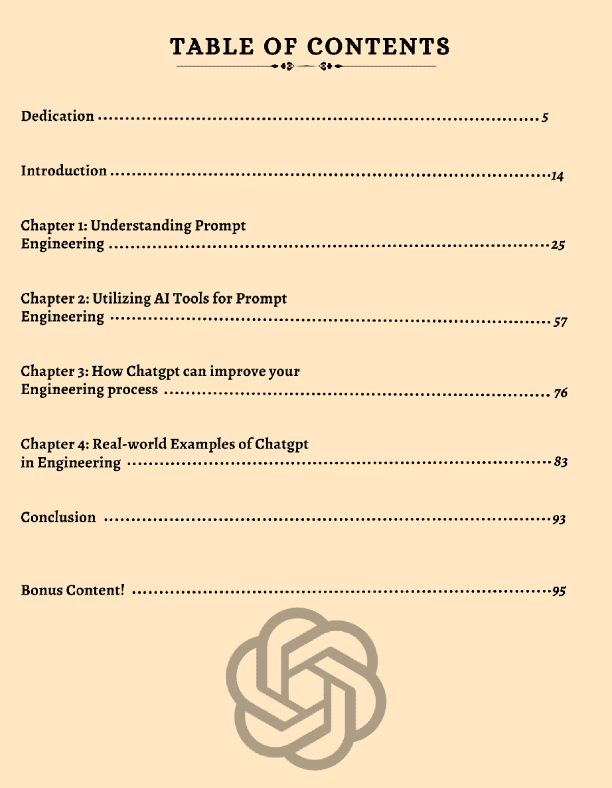

# 介绍

* * *

在当今这个时代，设计和人工智能工具对于企业在不断发展的市场中蓬勃发展至关重要。ChatGPT 为探索一系列可能性提供了机会，这些可能性可以帮助将您的设计项目提升到一个新的水平。本电子书将指导您如何利用 ChatGPT 的力量优化您的设计流程并最大化生产效率。

人工智能（人工智能）技术在设计任务中的协调已经改变了企业处理简报设计的方式。随着强大的自然语言处理（NLP）工具的出现，例如 ChatGPT，企业现在可以利用人工智能驱动的对话专家来优化流程，提高效率并改善协作。

这本名为“ChatGPT Engages Your Brief Designing with man-made intelligence Devices - Releasing Limitless Potential outcomes”的电子书探讨了企业如何利用 ChatGPT 的力量改变他们的设计任务。从自动化例行任务到实现更好的导航，该电子书为将 ChatGPT 整合到设计工作流程中提供了全面指南。

涵盖了一系列主题，包括在设计项目中利用 ChatGPT 的好处，整合人工智能工具的最佳实践，使用 ChatGPT 的企业的真实案例以及围绕在设计中使用人工智能的道德考虑。

在这本电子书的结尾，读者将对 ChatGPT 如何与模拟智能工具结合起来推动简报设计有着坚实的理解，并且了解其中无限的可能性。
