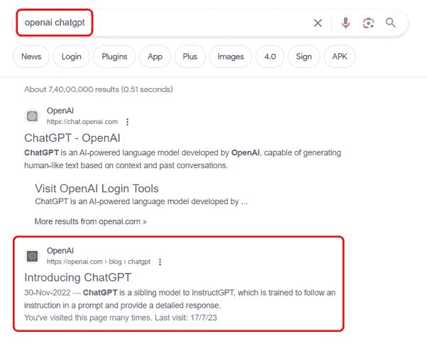
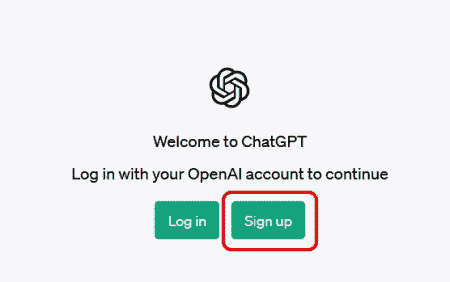
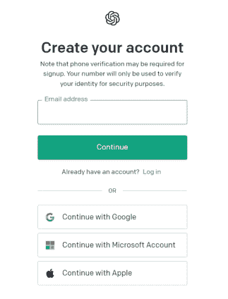
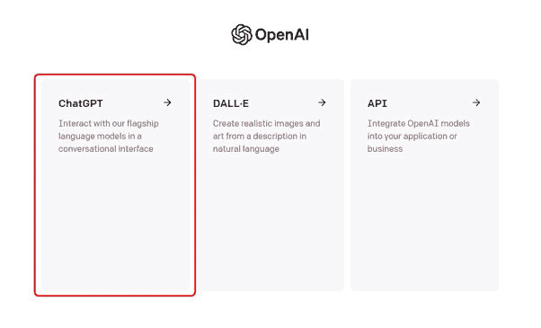
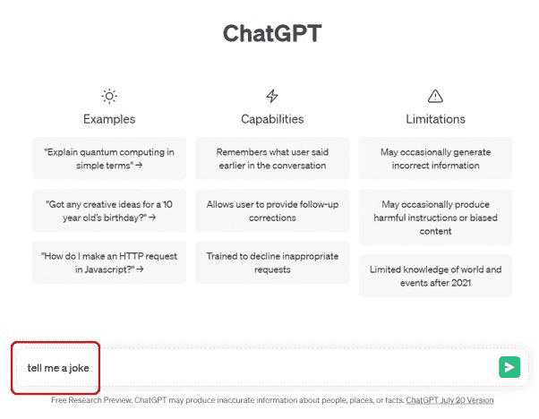
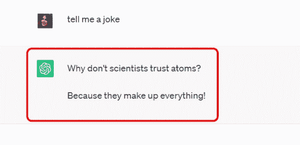
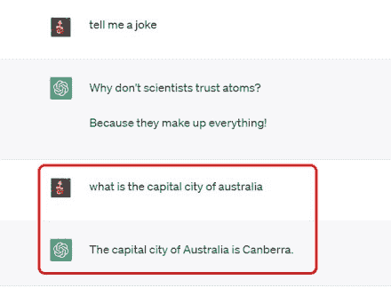
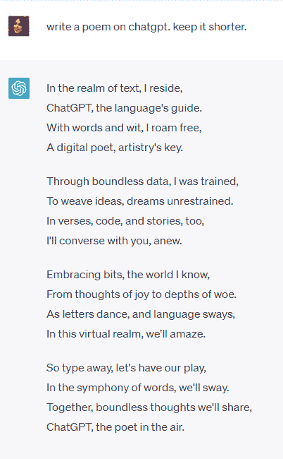

# 开始使用 ChatGPT？

首先在您偏好的搜索引擎上搜索“OpenAI ChatGPT”。点击名为“介绍 ChatGPT”的链接。

点击“注册”按钮创建账户。

填写必要信息，如您的姓名、电子邮件地址和密码。按照任何额外步骤，如同意条款和条件。用户还可以通过 Google、Microsoft 或 Apple 账户登录。

成功创建账户后，返回 OpenAI 网站并点击“登录”按钮。输入您注册的电子邮件地址和密码以访问您的账户。登录后，它将给您三个选项供选择，点击 ChatGPT

现在是时候写下你的第一个提示了！！！开始测试你的提示并与 ChatGPT 互动。优化和迭代你的提示以达到期望的结果。尝试不同的问题、场景或对话风格，探索 ChatGPT 的能力。

在搜索框中，请输入文本“告诉我一个笑话”并检查输出（如下面截图 screen1 和 screen2 所示）

屏幕 1

屏幕 2

现在，输入文本“澳大利亚的首都是哪里”并检查输出（如下面截图 screen3 所示）

屏幕 3

现在，输入文本“在 chatgpt 上写一首诗。保持简短。”并检查输出（如下面截图 screen4 所示）

屏幕 4

继续尝试不同的问题、场景或对话风格，探索 ChatGPT 的能力！！！
