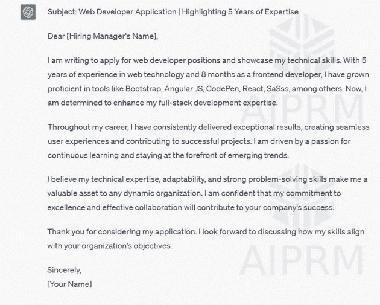

|  |  |  |
| --- | --- | --- |

# -   寻求由 ChatGPT 写的引人注目的求职信

-   提示：“为了申请工作，我需要突出我的技术技能。请写一封描述我在 Web 技术方面有 5 年经验的求职信。作为前端开发人员已有 8 个月，我熟练掌握了 Bootstrap、Angular JS、CodePen、React、SaSss 等工具。现在，我渴望提升我的全栈开发专业知识。请使用突出的主题，让求职信更简洁有意义。”

