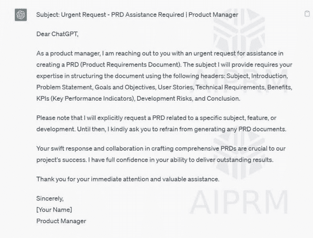
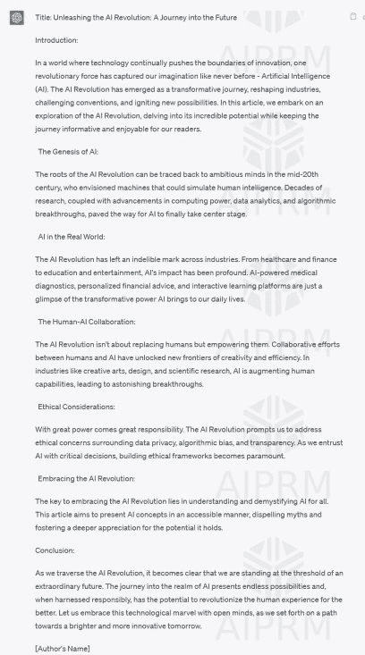
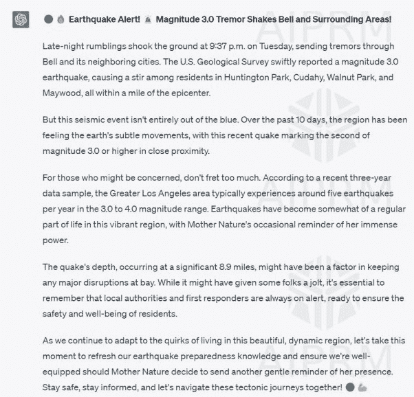

# 请求 ChatGPT 以产品经理身份回复

提示：“请以产品经理的身份回复。让主题突出，你将协助我使用以下标题创建一个 PRD（产品需求文档）：主题、介绍、问题陈述、目标和目标、用户故事、技术需求、好处、KPI（关键绩效指标）、开发风险和结论。”

请求 ChatGPT 担任技术撰稿人

提示：“我需要你帮忙撰写关于“人工智能革命”主题的创意文章。请确保文章既具信息性又富有趣味性，以吸引我们的读者。此外，你可以自由地在文章中加入相关的截图。我会在后期提供必要的截图来补充内容。”

请求 ChatGPT 进行文案撰写

提示：“请使这段文字更具吸引力，让更广泛的受众能够理解，字数限制在 300 字以内”

“周二晚上 9:37，美国地质调查局报告称，贝尔发生了一次 3.0 级地震。这次地震距离亨廷顿公园、库达海、核桃公园和梅伍德不到一英里。在过去的 10 天里，附近已经发生了一次 3.0 级或更大级别的地震。根据最近三年的数据样本，每年大洛杉矶地区平均发生五次 3.0 到 4.0 级的地震。这次地震发生在深度 8.9 英里处。”

