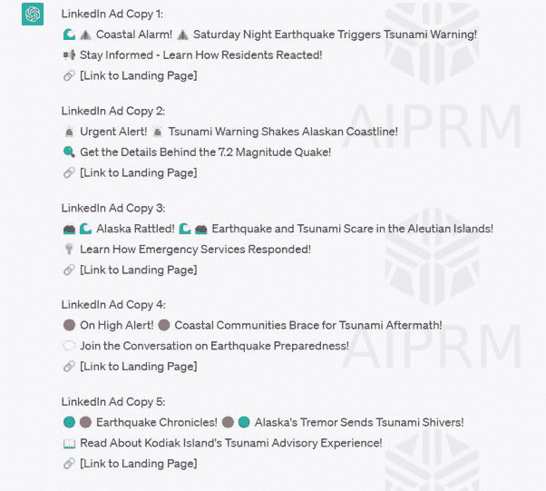

|  |  |  |
| --- | --- | --- |

# 引人注目的 LinkedIn 广告文案

提示：“根据此登陆页内容，撰写五个引人注目的 LinkedIn 广告文案”

登陆页文本的来源网站：[`www.nationalfisherman.com/alaska/alaska-earthquake-triggered-alerts-brief-tsunami-warning`](https://www.nationalfisherman.com/alaska/alaska-earthquake-triggered-alerts-brief-tsunami-warning)

“周六晚上，阿拉斯加海岸发生地震，引发当地紧急警报和短暂的海啸警报，导致一些沿海社区的居民准备可能需要疏散。

震中位于阿拉斯加桑德波因特以南 65 英里处的 7.2 级地震在阿留申群岛、阿拉斯加半岛和库克入口地区广泛感受到，根据阿拉斯加大学费尔班克斯分校的阿拉斯加地震中心。

地震发生在周六晚上 10:48，最初报告为 7.4 级，但不久后降级为 7.2 级。

美国国家气象局发布海啸警报称地震发生在 13 英里（21 公里）深处。一个小时后取消了警报。

布里斯托尔湾未受影响，但为科迪亚克岛和包括奇格尼克地区社区在内的阿拉斯加半岛发布了海啸警报，据迪林汉姆的 KDLG 公共广播电台报道。

当地社区，包括桑德波因特、奇格尼克地区和科迪亚克，响起了警报，官员敦促居民寻找高地。海啸警报后来降级为警告，并在周日凌晨 1 点完全取消。

在取消警报之前，阿拉斯加安克雷奇的国家气象局在其 Twitter 账号上建议海啸警报适用于从奇格尼克湾到尤尼马克海峡的阿拉斯加沿海地区，但科迪亚克岛和肯尼半岛不会受到影响。

阿拉斯加海啸警报后不久，夏威夷紧急管理局表示对岛屿没有威胁。”

最终结果：

