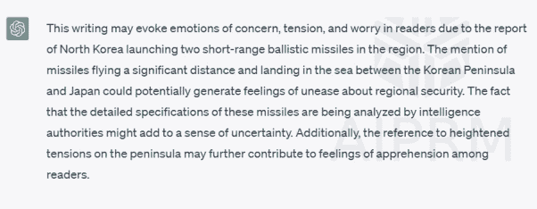

# 请求 ChatGPT 关于情绪

提示：这篇文章会让读者产生什么样的情绪？“据韩国联合参谋本部称，朝鲜发射了两枚短程弹道导弹，落在朝鲜半岛和日本之间的海域。这些导弹是从朝鲜的顺安地区发射的，联参说，当地时间周三清晨发射。每枚导弹飞行约 550 公里后落入海中，它补充道。‘这些导弹的详细规格正在韩国和美国情报机构进行分析，’联参表示。日本政府也在一份声明中描述了这两枚导弹，称它们落在其专属经济区之外。这次发射发生在半岛局势紧张的时期。”

