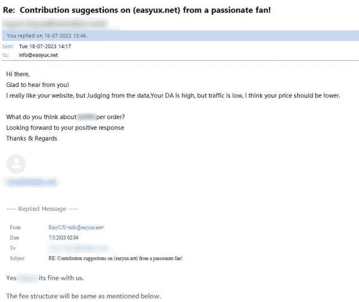
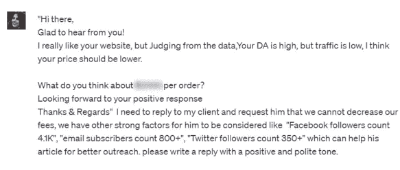
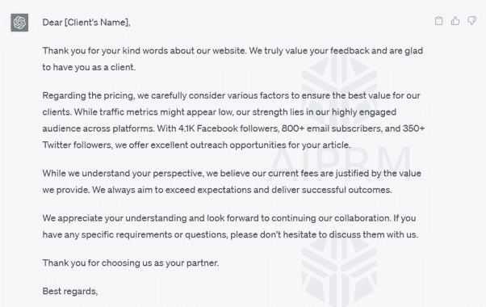
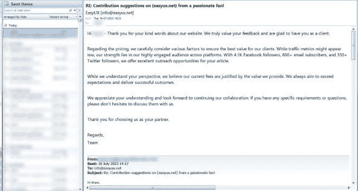
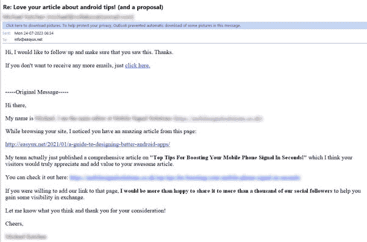
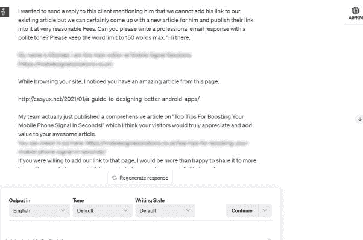
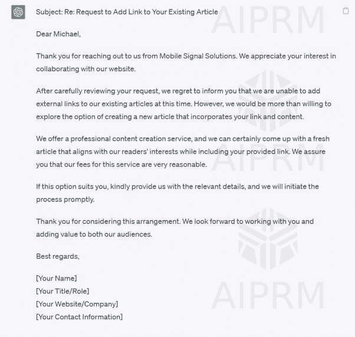
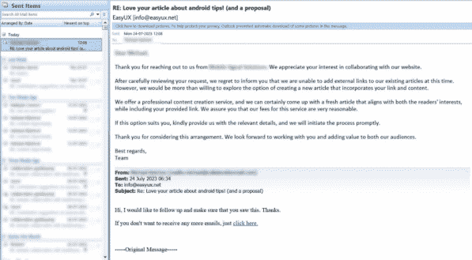

|  |  |  |
| --- | --- | --- |

# 吸引人的电子邮件回复-给我们的客户留下深刻印象

感谢 ChatGPT 的宝贵帮助，我们能够为客户提供及时和专业的回复，通过个性化和有效的沟通留下深刻印象。通过将 ChatGPT 整合到我们的电子邮件支持系统中，我们显著提高了整体客户满意度水平。ChatGPT 使用以人为本的语言和自然对话的语调帮助我们与客户建立更紧密的联系。

有了 ChatGPT 无缝地优化我们的运营，我们的团队现在可以更专注于解决复杂问题和提供一流的服务。这款人工智能能够理解上下文并生成相关的回复，对我们的支持团队产生了深远影响，节省了时间和精力，同时确保每位客户得到应有的关注。

多亏了 ChatGPT，我们的客户感到被倾听、受重视和得到良好照顾，使其成为我们客户服务策略中不可或缺的一部分。

示例 1

最近，一位客户与我们联系，特别要求在我们尊贵的平台“EasyUX.net”上展示他们的文章。对于他们的询问，我们迅速确认了他们的兴趣，并相应地分享了我们的收费结构。客户对我们的网站表示真诚的钦佩，并表现出与我们合作发布他们文章的强烈愿望。然而，在评估我们网站的数据后，他们注意到虽然我们的域权（DA）很高，但流量似乎有点低。因此，他们友好地要求降低费用。请查看与客户的电子邮件交流截图如下：

我们决心不在费用上妥协，因为我们对其公平性充满信心。然而，我们也理解突出其他关键因素的重要性，比如我们庞大的 Facebook 粉丝、Twitter 粉丝和电子邮件订阅者。这些令人印象深刻的指标可以为客户提供额外价值，并增强他们对我们网站的信心。为了帮助我们撰写积极的回复，我们求助于 ChatGPT。我们只需复制并粘贴客户的回复，然后要求 ChatGPT 根据此生成合适的回复。下面是同一截图的实际截图。

根据及时的请求，ChatGPT 生成了以下输出，完全符合我们的期望，利用了其 100%的文本。

这是 ChatGPT 生成的文本，我们在向客户发送电子邮件时使用。我们依赖 ChatGPT 的帮助来撰写一条清晰和专业的消息，旨在满足客户的需求并确保有效沟通。

示例 2

在下面的示例中，客户给我们发送了一封跟进电子邮件，包括他们之前的消息。他们想要将他们的一个链接添加到我们已经发布的文章中。您可以在附加的截图中看到客户的请求电子邮件。

我们相应地复制并粘贴了客户的回复，并要求 ChatGPT 根据此生成一个合适的回复。在下面，您将找到相同的实际截图。

我们请求的提示是“我想给这位客户发送一封回复，告诉他我们无法将他的链接添加到我们现有的文章中，但我们可以为他制作一篇新文章，并以非常合理的费用将他们的链接发布在其中。您能写一封用礼貌语气的专业电子邮件回复吗？请将字数限制在 150 字以内。”

根据提示要求，ChatGPT 生成了以下输出，完全符合我们的期望，利用了其 100%的文本。

以下是 ChatGPT 生成的文本，我们在发送电子邮件给客户时使用。

